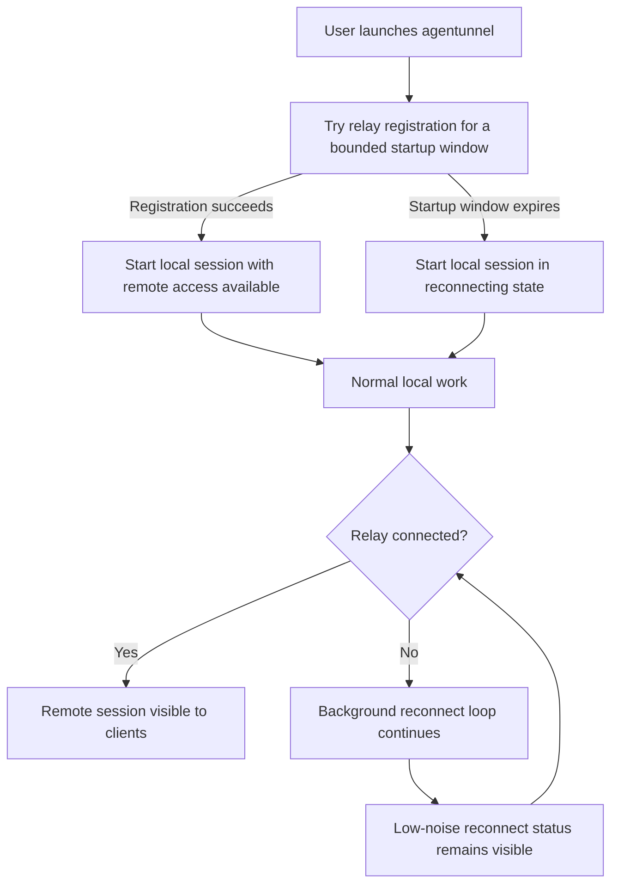

# Relay-Aware Startup and Reconnect Semantics

## Problem Frame

`agentunnel` is intended to be a wrapper that lets a mobile client interact with a locally running terminal agent through the relay. The current product definition says the relay connection is mandatory, but the current behavior is softer than that contract: the local agent can start even if relay registration has never succeeded, and the user does not get a clear product-level distinction between "remote access is available" and "local-only fallback is happening."

This creates two problems:

- the startup semantics are misleading relative to the product definition
- relay availability and relay outages are not surfaced in a user-centered way

At the same time, the local terminal experience must remain primary. Once the local session is running, relay outages must not interrupt or degrade the user's work in the terminal.

## Requirements

**Startup Semantics**
- R1. `agentunnel` must attempt relay connection and registration before declaring startup complete.
- R2. Startup relay connection attempts must use a bounded wait window rather than waiting forever.
- R3. If relay registration succeeds within the startup wait window, `agentunnel` must enter normal connected operation.
- R4. If relay registration does not succeed within the startup wait window, `agentunnel` must still enter the local terminal session instead of exiting.
- R5. Entering the local terminal session after startup timeout must place the process into an explicit reconnecting state rather than silently behaving as if remote access were available.

**Runtime Disconnect Behavior**
- R6. After the local terminal session has started, relay disconnection must not terminate the local agent process or interrupt terminal interactivity.
- R7. After any relay disconnection, `agentunnel` must keep attempting to reconnect in the background until the local session ends or the process exits.
- R8. Reconnection attempts must use a progressive backoff strategy that starts relatively quickly and grows over time.
- R9. When background reconnection succeeds, remote availability must be restored automatically without requiring user intervention.
- R10. The local session identity should remain stable across reconnect attempts so reconnect is treated as continuity of the same local session rather than a brand-new local run.

**User-Facing Status**
- R11. Startup success output must be concise and limited to the most important information needed to confirm that the wrapper is running.
- R12. Relay-unavailable and reconnecting states must be surfaced with a compact status presentation that does not meaningfully interfere with terminal input, output, or scrollback.
- R13. Reconnect status should communicate that local work is unaffected while remote access is temporarily unavailable.
- R14. The reconnect status should update when connection state changes, including successful restoration of relay connectivity.
- R15. Reconnect-related status must avoid noisy repeated logs in the main terminal output stream.

**Product Semantics**
- R16. The product definition must explicitly distinguish between two phases:
  - startup gating, where `agentunnel` first gives relay availability a bounded chance to succeed
  - post-startup operation, where local work continues regardless of relay availability
- R17. Operator-facing docs must describe that relay access is expected and attempted first, but local agent work continues if the relay remains unavailable after the startup wait window.
- R18. Relay unavailability must not be represented as a hard failure once the local terminal session has begun.

## Success Criteria

- Users can start `agentunnel` and immediately understand whether remote access is available, without reading verbose startup logs.
- A relay outage during local work does not interrupt typing, output, or control of the local agent.
- Users can see that reconnect is happening, but the reconnect UX stays low-noise and non-disruptive.
- When the relay becomes reachable again, remote access resumes automatically.
- Documentation and runtime behavior no longer contradict each other about startup and relay dependency semantics.

## Scope Boundaries

- No durable relay-side session persistence is required.
- No relay-side grace-period retention for disconnected sessions is required in this change.
- No new frontend or web UI is included in this work.
- This brainstorm does not change the live-only, content-opaque nature of the relay.
- This brainstorm does not decide exact terminal rendering mechanics beyond the requirement that reconnect status be low-noise and non-disruptive.

## Key Decisions

- Bounded startup wait followed by local continuation: The user wants relay availability to be attempted first, but does not want initial relay failure to block or cancel local terminal work.
- Local work is primary after session start: Relay loss must never interrupt the user's active terminal session.
- Background reconnect is continuous: Reconnect should keep trying with a reasonable progressive backoff rather than failing once.
- Reconnect visibility should be subtle: Status belongs in a compact, low-interference presentation rather than repeated log spam.
- Startup output should be shorter: Successful startup confirmation should be intentionally minimal.

## Dependencies / Assumptions

- `cmd/agentunnel`, `connector/`, and `session/` will need coordinated behavior changes because startup flow, reconnect policy, and terminal status all cross those boundaries.
- Existing relay behavior may continue removing live sessions immediately when the agent websocket disconnects; that is acceptable for this phase as long as reconnect restores remote visibility later.

## Outstanding Questions

### Deferred to Planning

- [Affects R2][Technical] What should the default startup wait window be, and should it be configurable?
- [Affects R8][Technical] What exact reconnect backoff schedule and cap best match the desired UX?
- [Affects R12][Technical] What terminal rendering approach can show reconnect state near the bottom without corrupting user-visible PTY output?
- [Affects R10][Technical] What exact relay/session behavior is needed so reconnect preserves the intended session identity from the user's perspective?
- [Affects R11][Technical] What is the minimal successful startup message format that still gives enough operator confidence?

## Next Steps

→ `/prompts:ce-plan` for structured implementation planning
