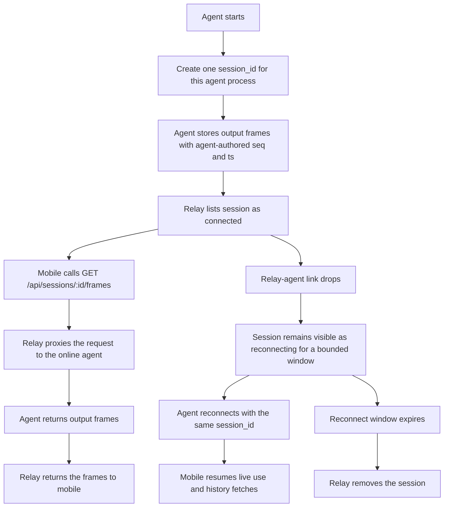

# Agent-Side Session History

## Problem Frame

Today the relay owns retained output frames and assigns replay metadata. That conflicts with the intended direction for the product: session history should live with the PTY owner, while the relay should narrow toward discovery and transport only. In the short term, mobile still cannot fetch history directly from the agent, so the relay must proxy history reads without becoming the storage authority again.

This change also needs a cleaner identity contract. A single running agent process should keep one stable `session_id` across relay disconnects and reconnects, but a brand-new agent start should create a brand-new session. History in this phase is defined as the session's PTY output transcript only. It is not a durable cross-session archive, and it is not an exact input log.

## Requirements

**Session Identity and Lifecycle**
- R1. `session_id` identifies one running agent process and must remain stable across relay disconnects and reconnects for that process.
- R2. When that agent process ends and a later agent start occurs, the later run must register a new `session_id`.
- R3. Relay-visible session state must distinguish at least `connected` and `reconnecting` for a still-running session.
- R4. After a relay-agent disconnect, the session must remain discoverable in `reconnecting` state for a bounded grace window before removal if the agent does not return.

**History Authority**
- R5. The authoritative history for a session must live on the agent, not on the relay.
- R6. Session history in this phase includes PTY output frames only. It is a terminal transcript, not a separate exact record of local input or mobile input.
- R7. The agent must assign and retain per-frame `seq` and `ts` metadata for the lifetime of the session, and those values must survive relay reconnects for the same `session_id`.
- R8. Live output and replayed output for the same frame must expose the same agent-authored `seq` and `ts` values.

**Client and Relay Contract**
- R9. Mobile clients must continue using `GET /api/sessions/:id/frames` as the history API in this phase.
- R10. Relay must satisfy `GET /api/sessions/:id/frames` by proxying to the online owning agent instead of reading local retained history.
- R11. `GET /api/sessions` metadata must include a `state` field so clients can distinguish `connected` from `reconnecting`.
- R12. While a session is `reconnecting`, it may remain visible for discovery, but history fetches, live output continuity, and remote input are unavailable until the agent reconnects.
- R13. `latest_seq` exposed to clients must reflect the agent-authored session history, not a relay-local counter.
- R14. Relay must not keep relay-side history storage or relay-side history cache as part of the product contract for this phase.

**Direction Alignment**
- R15. The near-term relay-proxied history path must be framed as a temporary transport shape compatible with a future direct P2P history fetch path.
- R16. This phase must preserve the product boundary that relay is for discovery and routing, not the long-term owner of session history.

## Success Criteria

- A mobile client can keep calling `GET /api/sessions/:id/frames` and receive session history from the agent while that session is `connected`.
- A relay disconnect and reconnect within one running agent session does not create a new `session_id`, and replay metadata continues from the same agent-authored sequence.
- A mobile client can tell the difference between a session that is reachable now and a session that is only temporarily discoverable in `reconnecting`.
- The repository's architecture and protocol direction no longer depend on relay-owned history.

## Scope Boundaries

- No durable cross-session archive.
- No history access while the session is `reconnecting`, after the session has ended, or after the reconnect grace window has expired.
- No separate input-history product surface for local typing or mobile input.
- No relay-side retained-history mirror, cache, or fallback store.
- No direct mobile-to-agent P2P fetch path in this phase.

## Key Decisions

- One running agent process owns one stable `session_id`: reconnecting to the relay should not mint a new session identity, but a fresh agent start should.
- Agent-owned metadata is the source of truth: `seq`, `ts`, and `latest_seq` move with history ownership to the agent.
- Output-only history is enough for now: the saved history is the PTY transcript, which may include echoed input when the terminal echoes it, but it is not defined as a reliable input log.
- Keep the client history endpoint stable: `GET /api/sessions/:id/frames` stays in place so mobile does not need a separate migration to a new history route.
- Relay should stay thin: discovery plus proxying now, with a future path to direct P2P later.

## Alternatives Considered

- Relay remains the history authority: rejected because it fights the future P2P direction and keeps replay metadata owned by the wrong layer.
- Relay keeps a short-term history cache only: rejected for this phase because it reintroduces dual authority and weakens the relay boundary.
- A new dedicated history endpoint for mobile: rejected because the existing `/api/sessions/:id/frames` surface already matches the client need.

## Dependencies / Assumptions

- Mobile clients can tolerate `reconnecting` as a discoverable but temporarily unavailable state for history and remote control.
- The relay can authenticate and route a history-range request to the owning agent without interpreting terminal content.
- The current best-effort live output stance remains acceptable; this change is about history authority and replay ownership, not end-to-end lossless transport.

## Outstanding Questions

### Deferred to Planning
- [Affects R4][Technical] What reconnect grace-window duration and removal semantics best fit the current connector retry behavior?
- [Affects R10][Technical] What exact relay-to-agent request and response shape should proxy `GET /api/sessions/:id/frames?from=&to=` without introducing a second durable store?
- [Affects R12][Technical] What exact HTTP failure contract should `GET /api/sessions/:id/frames` use when a session is visible as `reconnecting` but the agent is not currently reachable?
- [Affects R11][Needs research] Does mobile need explicit session-state update events on `/api/updates/ws`, or is polling `GET /api/sessions` sufficient for this phase?

## Next Steps

→ `/prompts:ce-plan` for structured implementation planning
