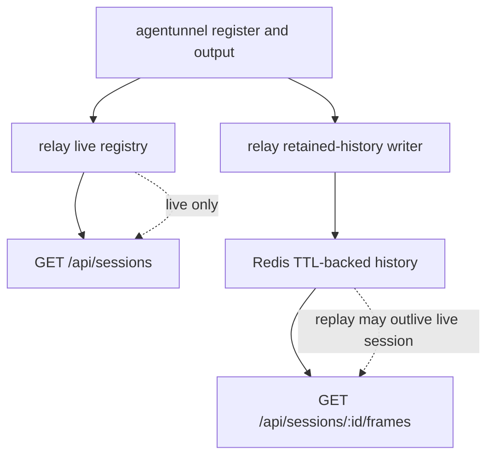

# Relay Redis Retained History

## Problem Frame

The current relay couples two different concerns inside one in-memory structure: live session ownership and retained output history. In `relay/registry.go`, each `liveSession` owns the agent peer, the current `SessionInfo`, the retained `frames`, the retained-byte counter, and `latestSeq`. That works for a purely live-only relay, but it blocks the new goal:

- `GET /api/sessions` should still return only live sessions
- `GET /api/sessions/:id/frames` should remain available for up to 24 hours after the last retained output
- retained history should survive agent disconnects and relay restarts
- this phase should stay single-relay and should not expand into multi-instance coordination

The design therefore needs to split "what is live right now" from "what recent history is still replayable". Redis is the right fit for the retained-history side of that split because it gives TTL-based expiry, restart survival, and bounded server-side retention without making Redis the source of truth for live ownership.

## Requirements

**Live Session Semantics**
- R1. `GET /api/sessions` must continue to return only sessions that are currently live in the running relay process.
- R2. Retained history in Redis must not cause a disconnected or not-yet-reconnected session to appear in `GET /api/sessions`.
- R3. This change only needs to support a single relay instance. No multi-relay lease, ownership election, or shared live-session discovery is required.
- R4. If the relay process restarts, live sessions may temporarily disappear from `GET /api/sessions` until their owning `agentunnel` processes reconnect and register again.

**Retained History**
- R5. Retained output history must move out of the relay process memory into Redis-backed storage keyed by `session_id`.
- R6. `GET /api/sessions/:id/frames` must continue to serve retained output for a session for up to 24 hours after the most recent retained output frame for that session.
- R7. Each newly retained output frame must refresh that session's retained-history TTL to 24 hours from the write time.
- R8. When the TTL expires, retained history for that session must disappear automatically without separate manual cleanup steps.
- R9. Retained history remains a bounded recent replay feature, not an indefinite archive or full transcript feature.
- R10. No new API is required to list recently offline sessions whose retained history still exists in Redis.

**Replay and Continuity**
- R11. `GET /api/sessions/:id/frames` must remain available for a disconnected session as long as retained history for that `session_id` still exists in Redis.
- R12. Clients that want replay after a session disappears from `GET /api/sessions` must rely on a previously known `session_id`; the relay does not need to expose recent offline session discovery in this phase.
- R13. Inclusive `from` / `to` replay filtering must keep the same client-facing behavior it has today.
- R14. Replayed frames must keep the existing payload shape and semantics: `seq`, `data_b64`, `cols`, `rows`, and `ts`.
- R15. A live session with no retained output yet may return an empty frame array, but a non-live session with no retained history must return `404`.
- R16. History written before an agent disconnect or relay restart must remain replayable after that disconnect or restart until the retained-history TTL expires.
- R17. If the same `session_id` reconnects before retained history expires, newly retained output must continue from the retained history's latest `seq` rather than restarting at `1`.
- R18. Relay restart and later re-registration for the same surviving `session_id` must not create overlapping or conflicting replay sequence ranges.
- R18a. When a live session re-registers under a still-valid `session_id`, its live `SessionInfo.latest_seq` should reflect the retained-history latest sequence immediately rather than appearing to reset until the next output arrives.

**Bounding and Eviction**
- R19. Retained history must continue to have an explicit server-side bound in addition to TTL so one noisy session cannot grow without limit during a 24-hour window.
- R20. When that bound is exceeded, the relay must evict the oldest retained frames for that session first while keeping newer frames and sequence continuity intact.
- R21. The bounding policy should preserve the current product shape of "recent retained replay" rather than becoming an unbounded 24-hour log.

**Storage Boundary and Operations**
- R22. Live session ownership, input routing, and `GET /api/sessions` listing remain relay-process responsibilities and must not depend on Redis in the normal live path.
- R23. Agent disconnect must remove the session from the live registry immediately without deleting retained history immediately.
- R24. The relay remains content-opaque: retained Redis data may contain output bytes and output metadata, but it must not contain derived previews or content interpretation.
- R25. Local development and maintenance must have a supported Redis Docker workflow so the relay can be run and tested against Redis consistently.
- R26. The system must not silently claim retained-history continuity if Redis is unavailable; startup and runtime behavior around missing Redis must be explicit and documented.

**Documentation Alignment**
- R27. `README.md`, `docs/architecture.md`, `docs/protocol.md`, `CLAUDE.md`, and `AGENTS.md` must stop describing retained frame history as live-only and in-memory once this change ships.
- R28. The docs must clearly distinguish live-session visibility from retained-history availability.
- R29. The docs must state that retained history may outlive a live session by up to 24 hours, while `GET /api/sessions` remains live-only.

## Success Criteria

- After an agent disconnects, its session disappears from `GET /api/sessions`, but `GET /api/sessions/:id/frames` still returns recent retained history until the 24-hour TTL expires.
- After a relay restart, previously retained frames for a known `session_id` are still replayable once the relay is back up.
- If the same `session_id` reconnects before expiry, replay remains monotonic and does not restart sequence numbering from `1`.
- A high-output session still has bounded retained history rather than unbounded Redis growth.
- The core docs no longer describe retained history as live-only in-memory state.

## Scope Boundaries

- No API to enumerate recently offline sessions.
- No Redis-backed live-session registry for this phase.
- No multi-relay coordination or horizontal-scaling design in this phase.
- No indefinite archive, search, or transcript product.
- No retained input history.

## Key Decisions

- Split live state from retained history: the relay process keeps live ownership in memory, while Redis becomes the retained-history backend.
- Keep `GET /api/sessions` honest: only live sessions belong there, even if Redis still has history for older `session_id` values.
- Let replay outlive liveness: `GET /api/sessions/:id/frames` should work for known session ids while the Redis TTL is still active.
- Use TTL plus bounded eviction: 24-hour inactivity expiry alone is not enough; retained history also needs an explicit bounded recent-history policy.
- Stay single-instance: using Redis for durable-ish replay continuity does not require moving live ownership into Redis yet.

## Alternatives Considered

- Redis for both live sessions and history: rejected for this phase because it adds lease and ownership complexity the current single-relay goal does not need.
- Keep the current in-memory live session structure and only snapshot history to Redis on disconnect: rejected because it does not cover relay crash/restart continuity and keeps cleanup logic coupled to disconnect timing.
- Full durable transcript/archive behavior: rejected because the goal is bounded recent replay continuity, not a permanent logging product.

## Dependencies / Assumptions

- `agentunnel` keeps the same `session_id` across reconnects for one local run.
- The relay remains a single running instance in the target deployment for this phase.
- Redis is available as an operational dependency, with Docker used for local setup and maintenance where appropriate.

## Outstanding Questions

### Deferred to Planning
- [Affects R19][Technical] What exact retained-history bound should replace or extend the current `10 MiB per session` in-memory rule: bytes, frame count, or both?
- [Affects R20][Technical] Which Redis data shape best fits append, inclusive range replay, oldest-first eviction, and TTL refresh without excessive write amplification?
- [Affects R26][Technical] Should Redis-backed retention be mandatory for all relay startups, or should it be an explicit opt-in mode with fail-closed behavior when enabled?
- [Affects R17][Technical] Should the relay hydrate `latestSeq` from Redis during registration, or lazily on the first post-reconnect output append?

## Next Steps

→ `/prompts:ce-plan` for structured implementation planning
