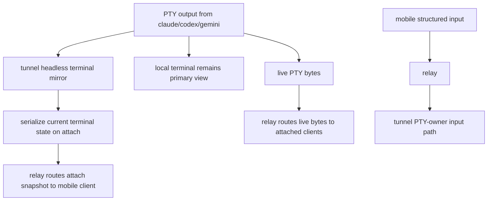

# Session Attach Terminal Mirror

## Problem Frame

The current replay-oriented design is solving the wrong problem. The product does not need a retained output transcript, frame sequencing, or relay-proxied history fetches. What remote clients actually need is simpler and closer to real terminal semantics:

- discover live sessions
- attach to one running session
- reconstruct the current terminal screen
- continue receiving live PTY bytes
- send structured remote input back to the PTY owner

Trying to model this as retained `frames` creates unnecessary protocol weight and pulls the relay toward terminal-state ownership. It also encourages hand-rolled replay logic that is easier to get subtly wrong than using a real terminal-state mirror.

The cleaner product shape is:

- `tunnel` remains the PTY owner
- `tunnel` maintains a headless terminal mirror from the same PTY output bytes it already sees
- a new remote attach receives one snapshot of the current terminal state plus subsequent live bytes
- the relay stays responsible for auth, discovery, routing, and reconnect lifecycle, but not terminal history

## Requirements

**Session Identity and Lifecycle**
- R1. `session_id` must continue to identify one running `tunnel` process and remain stable across relay disconnects and reconnects for that process.
- R2. A fresh `tunnel` launch must register a fresh `session_id`.
- R3. Relay-visible session state must continue to distinguish at least `connected` and `reconnecting`.
- R4. A `reconnecting` session may remain discoverable briefly, but it must not accept new remote attaches until the owning agent reconnects.
- R5. If the owning agent disconnects, any active remote attach sockets for that session must be closed promptly rather than hanging on a dead stream.

**Remote Attach Contract**
- R6. `GET /api/sessions` must remain the discovery API for live sessions.
- R7. Remote viewing must move to a session-scoped attach websocket rather than a replay endpoint plus a global live-output websocket.
- R8. A successful attach must provide terminal size metadata before or alongside the initial snapshot so the client can size its terminal emulator correctly.
- R9. A successful attach must provide snapshot bytes that reconstruct the current terminal state of the session at one consistent point in time.
- R10. After the snapshot boundary, subsequent PTY output bytes must continue on the same attach as ordered live terminal bytes.
- R11. The attach flow must guarantee no byte gap between the serialized snapshot point and the start of subsequent live delivery.
- R12. The remote recovery surface in this phase is the current terminal state only, not an output transcript or replayable history.

**Mirror Authority and Fidelity**
- R13. `tunnel` must maintain the authoritative headless terminal mirror for the running session.
- R14. The headless mirror must be fed from the same PTY output stream that is sent to the local terminal and any remote attaches.
- R15. The chosen mirror must preserve the terminal features required for modern CLI TUIs, including normal and alternate buffers, cursor position, wrap state, 16/256/24-bit color, and common text attributes.
- R16. The chosen mirror approach should prefer xterm-compatible semantics with built-in serialization over a hand-written screen walker.
- R17. The attach snapshot must exclude transcript-style history and should restore only the current visible terminal state by default.

**Relay and Input Boundaries**
- R18. The relay must remain content-opaque with respect to terminal bytes: it may route bytes and control envelopes, but it must not emulate the terminal or derive semantic content from PTY output.
- R19. Structured remote input must remain agent-owned: the relay forwards `input_text` and `input_key`, while `tunnel` remains the boundary that turns them into PTY bytes.
- R20. This phase must remove relay-owned frame sequencing and history concepts such as replay frames, `latest_seq`, and `/api/sessions/:id/frames`.
- R21. This phase must remove the global live-output websocket as a product contract; remote output becomes session-scoped attach traffic.

**Terminal Size and Product Scope**
- R22. The PTY size must continue to follow the local terminal in this phase.
- R23. Remote clients must follow relay-forwarded size changes rather than becoming the size authority.
- R24. This phase must not add durable history, relay-side history cache, scrollback replay API, or direct mobile-driven PTY resize.

## Success Criteria

- A remote client can attach to a connected session and immediately render the current terminal screen correctly, then continue rendering live updates.
- A remote client that disconnects and reconnects gets a fresh current-state snapshot instead of transcript replay and does not rely on retained frames.
- The repository no longer depends on `ReplayFrame`, `/api/sessions/:id/frames`, `history_request`, `history_response`, `latest_seq`, or the global live-output websocket contract.
- The chosen headless mirror approach is strong enough for Claude/Codex-style TUIs without resorting to a hand-built ANSI serializer.

## Scope Boundaries

- No output-history API.
- No transcript replay after reconnect.
- No relay-side terminal emulation.
- No direct mobile-to-agent P2P transport in this phase.
- No mobile-controlled terminal dimensions in this phase.
- No new lossless-delivery guarantee.

## Key Decisions

- Snapshot plus live bytes replaces replay frames: reconnect recovery is now "show me the current screen," not "replay what I missed."
- Session-scoped attach replaces global live output: remote output becomes part of one session attach, not one global websocket for all sessions.
- Structured input stays: `input_text` and `input_key` remain the remote input contract rather than regressing to raw key bytes.
- The relay stays thin: auth, discovery, routing, and reconnect lifecycle remain relay-owned; terminal-state authority remains with `tunnel`.
- Headless mirror fidelity matters more than replay metadata: the central technical risk is correct current-state reconstruction, not sequence numbering.

## Dependencies / Assumptions

- Remote clients can tolerate reconnect behavior that restores only the current terminal state.
- A mobile terminal emulator can consume one snapshot byte stream and then continue with live PTY bytes on the same websocket.
- The local terminal remains the size authority for the PTY in this phase.
- Multiple remote viewers may exist, but they all observe the same PTY and therefore the same terminal dimensions.

## Outstanding Questions

### Deferred to Planning
- [Affects R7-R12][Technical] What exact session-scoped attach websocket contract best replaces `/api/updates/ws` and `/api/sessions/:id/frames` without adding a second relay connection per client?
- [Affects R15-R17][Needs research] What headless terminal mirror gives the strongest fidelity for Claude/Codex-style TUIs while fitting this Go codebase cleanly?
- [Affects R5][Technical] What exact close/error contract should attached clients observe when the session transitions to `reconnecting`?
- [Affects R22-R23][Technical] What is the cleanest resize-subscription model inside `session.Hub` now that more than one local component needs resize notifications?

## Next Steps

→ `/prompts:ce-plan` for structured implementation planning
