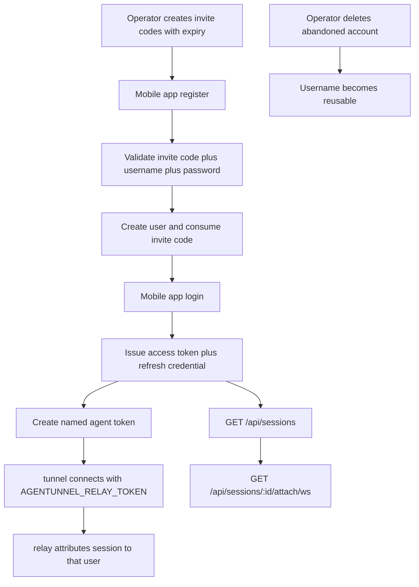

# Invite Code Relay Auth

## Problem Frame

The current relay auth model is still a shared-credential prototype:

- app-side access uses one relay-wide Basic Auth username/password
- agent-side access uses one shared bearer token

That is enough for local testing, but it is the wrong model for a hosted relay such as `diaro.me`. It does not give the product real user ownership, cannot scope sessions to one account, and cannot support a controlled beta where access is granted intentionally.

This revision moves the product to a closed-beta account model:

- registration is gated by pre-issued invite codes
- users sign in with `username + password`
- app APIs use user-scoped bearer auth
- agent connections use user-owned long-lived agent tokens
- relay session discovery and attach become user-scoped instead of globally shared

This phase also needs an operational model that fits the repo's current deployment style instead of introducing a heavyweight service topology. The first rollout should stay compatible with a single VPS, `nginx`, `systemd`, one `relay` binary, and a system-installed PostgreSQL instance.

There is no email system in this phase. Registration, login, password change, and agent-token management all happen through the mobile app or the existing `tunnel` CLI environment variable flow. Operator-only maintenance actions happen locally on the relay host.

## Requirements

**Closed Beta Registration**
- R1. The relay service must support durable user accounts rather than one shared client credential for all users.
- R2. Registration must require a valid invite code, a username, and a password.
- R3. Invite codes must be operator-issued and preloaded with an expiration time.
- R4. One invite code must be usable to create at most one account.
- R5. Invite-code consumption and user creation must succeed or fail atomically so one code cannot create two users through race or retry behavior.
- R6. Registration must reject unknown, expired, disabled, or already-consumed invite codes.
- R7. Registration must reject usernames shorter than 4 characters.
- R8. Registration must reject passwords shorter than 8 characters.
- R9. Username uniqueness must prevent visually trivial duplicates such as case-only variants from being treated as different accounts.
- R10. v1 invite codes must be six-character alphanumeric codes accepted case-insensitively and intended for easy manual entry.
- R11. Registration must protect against invite-code guessing with at least IP-scoped throttling in the first rollout.

**Login and App Auth**
- R12. Successful registration must create the account and consume the invite code, but it must not implicitly establish the app login session.
- R13. After an account has been created, subsequent sign-in must require only username and password; invite codes are not part of normal login.
- R14. Successful login must issue a short-lived access token suitable for `Authorization: Bearer`.
- R15. Successful login must also issue a refresh credential so the mobile app can renew access without forcing frequent password entry.
- R16. App-facing authenticated APIs must stop using relay-wide Basic Auth and instead require user-scoped bearer auth.
- R17. The service must provide a refresh flow that can mint a new access token for an already-signed-in app session.
- R18. The service must provide a logout path that invalidates the current app session's refresh credential.

**Password Lifecycle**
- R19. This phase must support password change for already-authenticated users.
- R20. Password change must require the current password before accepting a replacement password.
- R21. This phase must not include self-service forgot-password or password-reset flows.
- R22. If a user loses access to their password, recovery must happen by creating a new account with a new invite code rather than by reusing a consumed invite code.

**Agent Token Lifecycle**
- R23. An authenticated user must be able to create multiple long-lived agent tokens for use by local `tunnel` processes.
- R24. Each agent token must have a user-supplied name or label so the user can distinguish tokens later.
- R25. The plaintext agent token must be shown only at creation time and must not be recoverable from later read APIs.
- R26. The service must let a user list their existing agent tokens with metadata such as name, creation time, last-used time, and revocation state.
- R27. The service must let a user revoke one agent token without affecting their other tokens.

**Relay Ownership and Session Access**
- R28. Agent authentication on `/agent/ws` must move from one relay-wide shared token to a user-owned agent token.
- R29. When a `tunnel` process connects with a valid agent token, the resulting live session must be attributed to that token's owning user.
- R30. `GET /api/sessions` must return only sessions owned by the authenticated user.
- R31. `GET /api/sessions/:id/attach/ws` must authorize access against the authenticated user and must not allow one user to attach to another user's session.
- R32. This user-scoped auth change must preserve the current attach-oriented relay contract, live-only registry behavior, and session lifecycle semantics already documented elsewhere in the repo.

**Operator Maintenance**
- R33. This phase must not include a user-facing or admin-facing invite-code management API; invite-code operations are local operator workflows.
- R34. Operators must be able to create invite codes with expiry through local `relay` management commands.
- R35. Operators must be able to disable an invite code before consumption through local `relay` management commands.
- R36. Operators must be able to delete an account to release its username for reuse.
- R37. Account deletion must immediately revoke the account's refresh credentials and agent tokens.
- R38. Account deletion must immediately disconnect any currently online relay sessions owned by that account and remove them from discovery.
- R39. Account deletion may permanently remove the account and its auth credentials rather than preserving a dormant account shell.
- R40. Username reuse after account deletion must still require a fresh invite code; consumed invite codes are never reusable.

**Operational Shape**
- R41. The first production rollout must use PostgreSQL as the durable source of truth for users, invite codes, refresh credentials, agent tokens, and auth audit records.
- R42. Redis must not be required for the first production rollout of this capability.
- R43. The first production rollout must fit the current single-host deployment model: one `relay` binary behind `nginx`, managed by `systemd`, with system-installed PostgreSQL on the same VPS.
- R44. The `relay` binary must remain the single service binary for auth, account management, relay APIs, and attach routing in this phase.
- R45. Schema migration must be runnable explicitly as a local operator command separate from normal service startup.

**Initial Scope and Operations**
- R46. This phase must not require any email sending, verification code delivery, or email-address collection.
- R47. This phase must not require a web frontend; the mobile app remains the primary user-facing client.
- R48. The service must provide enough audit metadata to support closed-beta operations, including when invite codes were consumed, when agent tokens were last used, and which operator-initiated account deletions occurred.

## Recommended API Surface

The recommended first-pass API shape is:

- `POST /api/auth/register`
  - input: `invite_code`, `username`, `password`
  - effect: validates invite code, creates user, consumes code
- `POST /api/auth/login`
  - input: `username`, `password`
  - effect: returns access token plus refresh token
- `POST /api/auth/refresh`
  - input: refresh credential
  - effect: rotates or renews the app session
- `POST /api/auth/logout`
  - auth: app bearer token
  - effect: revokes the current refresh credential or app session
- `POST /api/auth/password/change`
  - auth: app bearer token
  - input: `current_password`, `new_password`
- `GET /api/agent-tokens`
  - auth: app bearer token
  - effect: lists metadata for the user's tokens
- `POST /api/agent-tokens`
  - auth: app bearer token
  - input: `name`
  - effect: creates a new token and returns the plaintext value once
- `DELETE /api/agent-tokens/:id`
  - auth: app bearer token
  - effect: revokes one token
- `GET /api/sessions`
  - auth: app bearer token
  - effect: lists only the user's own live sessions
- `GET /api/sessions/:id/attach/ws`
  - auth: app bearer token during websocket upgrade
  - effect: attaches only if the session belongs to the caller

Operator-facing invite-code and account-deletion actions are intentionally out of API scope in this phase.

## Recommended Operator Surface

The recommended first-pass operator command surface is:

- `relay serve`
  - effect: starts the relay service process used by `systemd`
- `relay migrate`
  - effect: runs schema migrations explicitly before service restart
- `relay invite create`
  - effect: creates invite codes with expiry and returns the plaintext codes once
- `relay invite disable`
  - effect: disables an invite code before consumption
- `relay user delete`
  - effect: deletes an abandoned account, disconnects its live sessions, and frees the username for reuse

Exact flag names, output format, and migration tooling are deferred to planning.

## Success Criteria

- An operator can create invite codes with expiry on the relay host, and one valid code can successfully create one account.
- The same invite code cannot be reused to create a second account.
- A registered user can sign in with username and password and receive app auth credentials.
- A signed-in user can change their password without any email flow.
- A signed-in user can create multiple named agent tokens, revoke them individually, and use one of them from `tunnel`.
- The relay returns only the authenticated user's live sessions and rejects cross-user attach attempts.
- An operator can delete an abandoned account, immediately terminate its live relay presence, and then reuse that username for a new account created with a fresh invite code.
- The repository no longer describes app auth as relay-wide Basic Auth for end users.
- The first production rollout does not require Redis to operate.

## Scope Boundaries

- No email addresses.
- No email verification.
- No verification-code delivery.
- No self-service forgot-password flow.
- No manual password-reset flow.
- No public admin invite-code CRUD API in v1.
- No team or organization sharing model in this phase.
- No change to the existing attach snapshot/live-byte product contract beyond auth and ownership scoping.
- No Redis requirement in the first production rollout.

## Key Decisions

- Closed beta is enforced at registration time, not login time: invite codes gate account creation, then disappear from the normal sign-in flow.
- Registration and login stay separate: account creation consumes the invite code, and explicit login issues app auth credentials.
- The login identifier is the username: there is no email fallback in this phase.
- App auth and agent auth are separate credentials: the mobile app uses short-lived bearer auth, while `tunnel` uses long-lived user-managed agent tokens.
- Agent tokens are many-per-user and independently revocable: one lost laptop or leaked token should not force full account rotation.
- Session visibility is private by default: users can discover and attach only their own sessions.
- Password loss is handled by re-registration with a new invite code, not by account recovery flows.
- Username reuse is an operator action: the old account may be deleted entirely, but the deletion must be auditable and must terminate any active relay sessions immediately.
- The first production rollout uses PostgreSQL as the only required durable dependency; Redis is optional future infrastructure, not a v1 prerequisite.
- Deployment stays operationally simple in v1: one VPS, one `relay` binary, `nginx`, `systemd`, and system-installed PostgreSQL.
- Database migration is an explicit operator step, not an automatic side effect of every service start.

## Dependencies / Assumptions

- The current codebase has no database-backed account, invite-code, refresh-session, or agent-token layer today.
- The hosted relay continues to be API-only; the mobile app owns the registration and account-management UX.
- Operators can distribute invite codes out of band and can handle manual support for password-loss cases during closed beta by issuing a new invite code.
- Existing relay session state remains live-only and in-memory; this work adds durable account auth without turning relay session transport into durable history storage.

## Outstanding Questions

### Deferred to Planning
- Affects R14-R18. Technical: What exact access-token lifetime, refresh-token lifetime, and refresh-rotation policy best fit a mobile app plus CLI-backed relay service?
- Affects R28-R32. Technical: What is the cleanest way to thread authenticated user identity through the existing relay handlers without disturbing the attach transport contract?
- Affects R34-R45. Technical: What command structure, migration format, and configuration shape best extend the current `relay` binary without making deployment brittle?
- Affects R11. Technical: What exact IP-throttling thresholds and reset windows are appropriate for short invite codes on a single-VPS closed beta deployment?
- Affects R36-R48. Technical: What minimal audit record shape is sufficient for operator account deletion and invite-code lifecycle tracking in v1?

## Next Steps

→ `/prompts:ce-plan` for structured implementation planning
