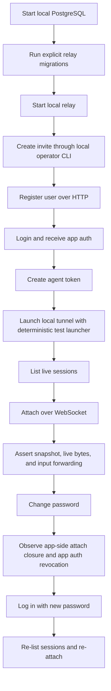

# Local E2E Regression

## Problem Frame

The current repository has strong Go-level tests for relay handlers, protocol contracts, and package behavior, but those tests do not prove that the full local product flow still works when the real binaries, runtime configuration, PostgreSQL schema, HTTP APIs, WebSocket APIs, and `tunnel` process all meet at runtime.

That gap matters because the highest-risk regressions in this project sit at process and boundary edges:

- the relay now depends on PostgreSQL-backed auth and invite-code state
- `tunnel` startup depends on real bearer auth against a live relay
- remote use depends on the interaction between `GET /api/sessions`, `GET /api/sessions/:id/attach/ws`, and `/agent/ws`
- password changes are expected to revoke app sessions and close app-side attaches without killing the owning agent session

The repo needs a local-first end-to-end regression layer that developers can run after making changes to relay auth, session attach behavior, or `tunnel` startup semantics. The goal is not to replace package tests. The goal is to catch the classes of failures that only appear when the real local stack is running together.

## Requirements

**Local Runtime Boundary**
- R1. The first-phase end-to-end regression flow must run entirely against a local stack and must not call the hosted relay or any other non-local service.
- R2. The automated regression flow must exercise a real PostgreSQL database and the repository's explicit migration step before the relay starts.
- R3. The automated regression flow must start a real `relay serve` process configured against that local PostgreSQL instance.
- R4. The automated regression flow must use the real local operator surface to create invite codes before registration. The primary path is the running relay plus `relay invite create`, not direct database insertion.
- R5. The automated flow must use a local `TUNNEL_BASE_URL` and local auth material explicitly, so it never falls back to hosted defaults.

**Automated Regression Scope**
- R6. The main automated regression flow must exercise the real public app-facing auth and session surfaces needed for the local user journey: registration, login, agent-token creation, session listing, session attach, and password change.
- R7. The automated regression flow must launch a real `tunnel` binary against the local relay.
- R8. The automated regression flow must use a repo-controlled deterministic launcher process behind `tunnel` so terminal output and input assertions stay stable across local runs.
- R9. The automated regression flow must prove end-to-end session discovery and attach behavior by listing sessions, opening `GET /api/sessions/:id/attach/ws`, receiving attach control plus snapshot/live bytes, and sending at least one input event that changes the attached terminal state.
- R10. The first-phase automated regression scope must cover the happy path plus the critical password-change failure path. Broader lifecycle scenarios can be added later.
- R11. The password-change path must use the real authenticated API, must observe the current app-side attach being closed, and must verify that the old app auth can no longer continue normal app access.
- R12. After password change, the automated flow must log in with the new password and verify that app access is restored while the still-running `tunnel` session remains discoverable if the owning agent socket stayed connected.
- R13. The end-to-end flow must remain primarily black-box for the user-visible path, while allowing limited harness-only setup or observation where that is needed to keep the run repeatable and diagnosable.

**Durable State Verification**
- R14. The regression layer must verify the durable database transitions that are part of the source of truth for this flow, including invite consumption, user creation, password change effects, app-session revocation, and agent-token persistence.
- R15. Database verification must align with the product boundary that relay session ownership, discovery, and attach routing are live-only and in-memory. Those behaviors must be verified through relay HTTP and WebSocket behavior rather than by expecting durable session rows.
- R16. The first phase must treat database checks as read-only verification of expected state transitions, not as the primary mechanism for driving the user flow.

**Manual Local Acceptance**
- R17. In addition to the automated regression flow, the repository must define a manual local acceptance flow for a real interactive `tunnel` session so developers can verify the local end-to-end experience that a deterministic launcher cannot fully judge.
- R18. The manual acceptance flow must run against the same local relay and local PostgreSQL stack as the automated flow.
- R19. The manual acceptance flow must cover at least local relay startup, invite issuance, fresh-account registration or existing-account login, agent-token creation or reuse, `tunnel` startup, session discovery, attach behavior, and password-change side effects.
- R20. The manual acceptance flow may use a real developer-facing launcher instead of the deterministic test launcher, because its purpose is to validate the actual interactive experience rather than only contract stability.

**Developer Workflow**
- R21. The first phase must optimize for a developer running a local regression pass after making changes to relay auth, relay session attach behavior, or `tunnel` startup behavior.
- R22. CI compatibility is a future consideration, but this phase must not be blocked on turning the local end-to-end flow into a CI gate.
- R23. The repository must provide one obvious local entry point for the automated regression flow and one obvious documentation entry point for the manual local acceptance checklist.
- R24. Failure output from the automated regression flow must make it clear which stage failed and which local process or durable-state transition was inconsistent.

## Success Criteria

- After changing relay auth, session attach behavior, or `tunnel`, a developer can run one local automated regression entry point and validate the critical local user journey end to end.
- That automated run exercises real local PostgreSQL, real migrations, a real relay, a real `tunnel`, the real operator invite path, and the real HTTP and WebSocket app-facing surfaces.
- The automated run catches regressions that package-level tests would not catch, especially around process startup, auth handoff, attach behavior, and password-change side effects.
- A password change in the automated run closes the active app-side attach, invalidates the old app auth for normal app use, and a fresh login can discover and attach to the still-running session again when the agent socket stayed online.
- The repository also gives developers a repeatable manual local acceptance checklist for validating the real interactive `tunnel` experience against the same local stack.

## Scope Boundaries

- No hosted-relay coverage in this phase.
- No requirement to turn the local regression flow into a CI merge gate in this phase.
- No requirement to automate every lifecycle scenario in the first pass.
- No requirement in the first pass to automate cross-user isolation, agent-token revocation, invite reuse, or account-deletion flows.
- No requirement to replace existing package tests or contract tests.
- No requirement to drive a real mobile app UI for the automated flow.
- No requirement to validate live session behavior through direct database queries when the product contract says that state is in-memory.

## Key Decisions

- Local-first regression is the goal: the first consumer is a developer protecting local end-to-end experience after making changes.
- The recommended balance is automated critical-path regression plus a separate manual acceptance checklist for the interactive experience.
- Automated `tunnel` coverage uses a deterministic repo-controlled launcher, not a real AI CLI, so the regression run stays stable and debuggable.
- The main user flow stays black-box and goes through real operator, HTTP, WebSocket, and `tunnel` surfaces; limited white-box setup or observation is acceptable only where it improves repeatability or diagnosis.
- Database verification is part of the requirement, but only for durable auth and operator state. Live relay session state remains a behavioral assertion over the running relay.

## Dependencies / Assumptions

- Developers running this flow can provide a local PostgreSQL instance for the relay.
- The repo can add a deterministic helper launcher suitable for driving a real `tunnel` process during automated runs.
- A repo-owned simulated client is acceptable for driving the local HTTP and WebSocket app flows; the goal is to exercise the real relay contract, not the mobile app UI itself.

## Alternatives Considered

- Full manual verification only: rejected because it is too easy to skip and too slow to rely on after each relay or `tunnel` change.
- CI-first end-to-end gate: deferred because the immediate goal is protecting local development confidence, not designing a merge gate.
- Full lifecycle automation in v1: deferred because the highest-value initial guardrail is the happy path plus the password-change failure path.

## Outstanding Questions

### Deferred to Planning
- Affects R2-R5, R21-R24. Technical: What is the least brittle way to orchestrate local PostgreSQL, migrations, relay startup, and teardown for repeated developer runs?
- Affects R7-R9. Technical: What deterministic launcher behavior gives enough terminal realism to prove snapshot, live-byte, and input-forwarding behavior without making assertions flaky?
- Affects R14-R16. Technical: Which database tables and fields should be asserted after each stage so the suite verifies durable state transitions without overfitting to storage details?
- Affects R23-R24. Technical: What entry point and failure-artifact format best fit the current repo conventions and local developer workflow?
- Affects R17-R20. Technical: What manual checklist is minimal but still strong enough to catch local interactive regressions that the deterministic launcher cannot expose?

## Next Steps

→ `/prompts:ce-plan` for structured implementation planning
