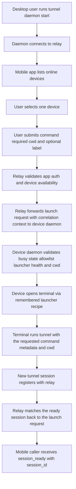

# Mobile Device Session Launch

## Problem Frame

Today the mobile client can only discover and attach to `tunnel` sessions that are already online. That is not enough for the common workflow where the user is away from their computer and wants to start a fresh terminal session from their phone.

The target experience is: the user explicitly enables remote launch on one computer with `tunnel daemon start`, then later opens the mobile app, chooses that online device, submits a command plus required cwd and optional label, and the chosen computer opens a new visible desktop terminal window and starts `tunnel run <command>` there in the requested working directory. This creates a brand-new `tunnel` session on that machine without requiring the user to first start the session locally by hand.

This is a new product capability, not an extension of attach. It introduces an online device concept alongside the existing online session concept, plus a new explicit daemon-management CLI surface. The daemon should not depend on the system's default terminal; instead it should infer and remember a terminal-launch recipe from the environment where `tunnel daemon start` was run.

The mobile client also needs a decisive result from the creation flow. A terminal window merely opening is not enough feedback because the user still does not know whether a real remote session now exists. In this revision, launch success should mean `session_ready`: the newly started `tunnel` process has actually registered a live session with the relay, and the caller receives that `session_id` directly instead of having to guess from later session-list polling.

## Requirements

**Device Model**
- R1. The relay must expose an online device concept separate from the existing online session concept.
- R2. A device must become online only after the user has explicitly started its device-side daemon with a `tunnel daemon` command on that machine.
- R3. The mobile client must list only the authenticated user's currently online devices.
- R4. The device name shown to the mobile client must default to the machine hostname.
- R5. Device metadata exposed to the mobile client must distinguish between a device that is online and launch-healthy versus online but degraded for launch.

**Launch Request Flow**
- R6. The mobile client must allow the user to choose one online device and submit one command string as a launch request.
- R7. A device is launchable only while its device-side daemon is currently connected to the relay and its remembered terminal launcher recipe is healthy.
- R8. A successful launch request must instruct the selected device to create a brand-new `tunnel` session on that machine.
- R9. The mobile client launch flow must stop at launch result reporting; it must not automatically attach to the newly created session.
- R10. The new session must appear through the normal session discovery flow after `tunnel` registers it.

**Per-Launch Metadata**
- R11. The mobile client must send a working-directory path with each launch request.
- R12. The launch-specific working-directory path must apply only to that one launch request and must not reconfigure the daemon's long-lived startup state.
- R13. When a launch request includes a working-directory path, the selected device must start the new `tunnel run <command>` process in that directory, equivalent to locally changing into that directory before running the command.
- R14. If the supplied working-directory path does not exist or is otherwise unusable as a working directory, the daemon must reject the launch request before opening a terminal window and return a structured cwd-related failure result.
- R15. The mobile client must be able to send an optional session label with each launch request.
- R16. When a launch request includes a session label, the created session must expose that label through the normal session metadata surface.

**Daemon CLI**
- R17. The selected machine must run a long-lived local daemon that stays connected to the relay and can receive launch requests even when no `tunnel` session is currently online.
- R18. The existing `tunnel run <command>` execution path must remain unchanged; daemon management must be introduced through explicit `tunnel daemon ...` subcommands instead of changing the primary launch behavior.
- R19. v1 must provide at least these daemon-management commands: `tunnel daemon start`, `tunnel daemon status`, `tunnel daemon stop`, and `tunnel daemon doctor`.
- R20. `tunnel daemon start` must start a background daemon process that remains alive until it is explicitly stopped or otherwise exits unexpectedly.
- R21. `tunnel daemon stop` must terminate the daemon and remove that device from the online device list.
- R22. `tunnel daemon status` must be read-only and must not perform active health probing as part of its normal behavior.
- R23. `tunnel daemon status` must report at least whether the daemon is running, whether it is connected to the relay, whether its launcher recipe is healthy or degraded, which launcher strategy it is bound to, and the most recent launch failure reason when one exists.
- R24. `tunnel daemon doctor` must provide a deeper user-invoked diagnostic path beyond the normal read-only `status` command.
- R25. `tunnel daemon doctor` must be local-first but include relay connectivity as one diagnostic check rather than treating relay reachability as the only thing that matters.
- R26. `tunnel daemon doctor` must perform light active probing, such as validating relay reachability, local GUI-session availability, launcher-recipe viability, `tunnel` executable availability, and daemon config readability, without launching a real terminal window as part of the check.
- R27. The default `tunnel daemon doctor` output must be a human-oriented checklist with per-check `ok`, `warn`, or `fail` status and a short factual explanation.
- R28. `tunnel daemon doctor` must not include prescriptive repair suggestions in its normal output.
- R29. `tunnel daemon doctor` must return exit code `0` only when all checks are `ok`; any `warn` or `fail` result must return a non-zero exit code.

**Launcher Recipe and Terminal Launch**
- R30. `tunnel daemon start` must infer a terminal launcher recipe from the environment where it was run and persist that recipe for later launches.
- R31. The daemon must reuse the remembered launcher recipe for subsequent launches instead of re-detecting the terminal strategy on every request.
- R32. If the remembered launcher recipe becomes invalid, the daemon must remain online but move into a degraded launch state until the user explicitly restarts it.
- R33. v1 must not automatically re-infer or self-heal the launcher recipe after launch failures.
- R34. A successful launch request must open a new visible desktop terminal window through the remembered launcher recipe and run `tunnel run <requested command>` there so the resulting shell session is visible and locally inspectable on the machine.
- R35. v1 must not place the launched session into an existing terminal window as a new tab.
- R36. When the launched `tunnel run <requested command>` process exits, the terminal window must remain open and return to an interactive shell prompt rather than closing automatically.
- R37. This feature is only required when the target machine already has an active desktop session capable of showing a terminal surface.
- R38. If `tunnel daemon start` is run on a machine without a supported desktop terminal-launch environment, it must fail instead of advertising the device as launchable.

**Command Allowlist**
- R39. The device daemon must read a user-editable global configuration file that defines the allowed command whitelist.
- R40. The whitelist decision must be based only on the first token of the requested command string, treated as the main command name.
- R41. The product should ship with a default whitelist that includes common agent commands such as `codex`, `claude`, and `gemini`.
- R42. The user must be able to add and remove allowed main commands in the global configuration file.
- R43. If the requested command's first token is not in the whitelist, the daemon must reject the launch request.
- R44. If the requested command's first token is in the whitelist, the remaining arguments must be passed through without additional product-level restriction in v1.

**Authorization and Safety**
- R45. After a device has been enrolled to a user account, the default v1 behavior is direct execution without per-launch local confirmation.
- R46. The relay must authorize device discovery and launch so a user can only target devices they own.
- R47. The relay and device must treat launch as a distinct capability from attach; existing session attach authorization rules must remain unchanged.

**Concurrency and Result Reporting**
- R48. Each device may have at most one launch request in progress at a time.
- R49. If a second launch request arrives while another launch request is still in progress for that device, the second request must fail immediately rather than queue.
- R50. The mobile client must receive a structured success or failure result for the launch request.
- R51. In this revision, launch success must mean `session_ready`, not merely that the device daemon accepted the request or opened a terminal window.
- R52. A successful result must include the created `session_id`.
- R53. Failure results must use structured reasons rather than a generic failure string.
- R54. The relay and daemon must preserve a request-scoped correlation mechanism so the session that later registers can be matched back to the launch request that created it.
- R55. The creation flow may wait up to roughly 20-30 seconds for `session_ready` before returning a structured timeout failure instead of waiting indefinitely.

**Failure Reasons**
- R56. The v1 failure model must distinguish at least these cases when they are known: `device_offline`, `busy`, `command_not_allowed`, `desktop_unavailable`, `terminal_launch_failed`, `tunnel_not_found`, a cwd-related validation failure, and launch timeout before `session_ready`.

**Platform Scope**
- R57. v1 must support macOS and Linux desktop environments with a usable desktop GUI session.
- R58. v1 must not require Windows support.

## Success Criteria

- A signed-in mobile user can see their currently online devices even when none of those devices currently has a live `tunnel` session.
- A user can explicitly enable and disable the device-side launch capability with `tunnel daemon start` and `tunnel daemon stop`.
- The user can submit an allowed command plus required cwd and optional label to one online device and receive a structured launch result.
- On a compatible desktop machine, a new visible terminal window opens and runs `tunnel run <command>`, producing a new session that is reported back to the caller as `session_ready` with a concrete `session_id`.
- When the launched `tunnel run <command>` exits, the new terminal window stays open and returns to an interactive shell prompt.
- A disallowed main command is rejected before local terminal launch.
- A missing or unusable cwd is rejected before local terminal launch with a structured failure result.
- A second concurrent launch request to the same device fails with a structured busy result instead of creating duplicate sessions.
- If `session_ready` does not arrive within the allowed wait window, the caller receives a structured timeout failure instead of an indefinitely pending request.
- If the remembered launcher recipe becomes invalid, the device remains online but is shown as degraded for launch until the user explicitly restarts the daemon.
- `tunnel daemon doctor` gives a stable `ok/warn/fail` checklist and a non-zero exit code whenever the machine is not fully healthy for remote launch.

## Scope Boundaries

- No Windows support in v1.
- No requirement to support launch when the target machine lacks a usable desktop GUI session.
- No automatic mobile-side attach or redirect into the new session after launch.
- No command profile system, placeholder templating, or per-command argument schema in v1.
- No per-launch local confirmation prompt in v1.
- No device list for offline or historical devices in v1; the mobile client only shows devices that are online now.
- No relay-managed durable queue of pending launch requests.
- No automatic recovery or silent rebinding to a different launcher recipe after launch failures in v1.
- No requirement that daemon lifetime be tied to the shell, tab, or window from which `tunnel daemon start` was run.
- No requirement to create new tabs inside existing terminal windows in v1.
- No requirement to keep the mobile creation UI subscribed to later session lifecycle events after the initial `session_ready` or failure result.

## Key Decisions

- Separate online devices from online sessions: the mobile client first targets a device, and a new session is created only after the device launches `tunnel`.
- Use an explicitly managed device-side daemon: device-targeted launch is required even when no `tunnel` session is already online, but the user must opt into that capability with `tunnel daemon start` rather than system auto-start.
- Keep the existing launch UX stable: `tunnel run <command>` remains unchanged and daemon behavior lives under `tunnel daemon ...`.
- Keep command control simple: v1 uses a main-command whitelist from a global config file rather than profiles or template expansion.
- Allow full argument pass-through after whitelist match: the product constrains the executable family, not the full command shape.
- Make launch single-flight per device: one in-progress request at a time is easier to reason about than queueing or fixed cooldown windows.
- Keep per-launch execution context on the request: required cwd and optional label belong to each launch request, not to long-lived daemon startup.
- Make launch success mean `session_ready`: the mobile flow should report success only after the new session has actually registered and can be identified by `session_id`.
- Make timeout explicit and terminal for the create flow: if `session_ready` does not arrive within the wait window, return a structured failure instead of leaving the client in an indeterminate state.
- Keep mobile launch and session attach separate: launch reports `session_ready` or failure, then the user can use the existing attach flow when ready.
- Bind launch behavior to a remembered launcher recipe, not to the system's default terminal.
- Keep launcher choice stable for one daemon lifetime: v1 does not auto-heal or silently switch terminal-launch strategies after failures.
- Standardize launch presentation on a new terminal window: opening a new window is easier for users to find than attaching to an existing window as a tab.
- Correlate launch to session registration explicitly: the relay and daemon need request-scoped correlation so one pending mobile create request can be completed by the later session registration event.

## Dependencies / Assumptions

- The target machine is already signed in to a desktop session where terminal automation can present a visible terminal surface.
- `tunnel daemon start` can infer a workable launcher recipe from the environment in which it was run when the host terminal setup is supported and a desktop GUI session is available.
- The device has `tunnel` installed and accessible in the execution environment used by the launched terminal surface.
- The device can resolve and enter the caller-supplied cwd before starting the requested command when that cwd is valid.
- Device ownership and trust are already established by the broader account and agent-token model.

## Outstanding Questions

### Resolve Before Planning

- None.

### Deferred to Planning

- [Affects R1-R16] (Technical) What exact public API shape should carry per-launch command, required cwd, optional label, and the final `session_ready` response without conflating device discovery with live session discovery?
- [Affects R17-R38] (Needs research) What is the narrowest implementation shape for the `tunnel daemon` CLI and background process across macOS and the Linux desktop environments the project intends to support first?
- [Affects R24-R38] (Needs research) What launcher-recipe inference and persistence model is stable enough for v1 across supported desktop environments?
- [Affects R39-R44] (Technical) What config file path and format best fit the existing `tunnel` product surface while staying portable across macOS and Linux?
- [Affects R50-R56] (Technical) What request correlation mechanism, timeout handling, timeout reason contract, and relay/session registration hooks should complete one pending launch with `session_ready` plus `session_id`?

## Next Steps

→ `/prompts:ce-plan` for structured implementation planning
