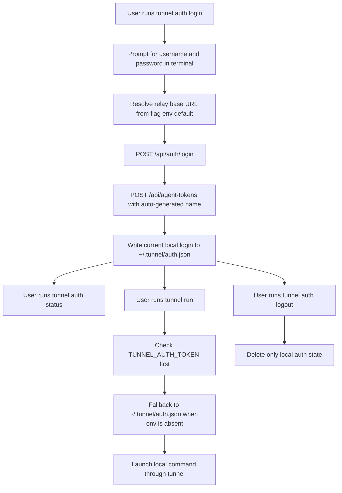

# Tunnel Auth And Run

## Problem Frame

`tunnel` currently treats the first non-flag token as the launcher command and requires `TUNNEL_AUTH_TOKEN` to already exist in the environment. That shape blocks natural growth of the CLI: any future built-in subcommand risks colliding with a real local command, and first-run authentication is still an external manual step instead of a repo-owned `tunnel` workflow.

This revision creates a clear top-level command space for `tunnel` and adds a first-pass terminal-native auth workflow:

- user-launched commands move from `tunnel <command>` to `tunnel run <command>`
- `tunnel auth login`, `tunnel auth logout`, and `tunnel auth status` become repo-owned subcommands
- login stays terminal-only, uses the existing relay username/password and agent-token APIs, and stores one current local login in a repo-owned auth file
- runtime auth keeps environment-variable override semantics so scripts and CI can still take precedence over local machine state

## Requirements

**CLI Shape**
- R1. `tunnel` must reserve the top-level command space for built-in subcommands instead of treating any first non-flag token as a launcher command.
- R2. Launching a local command must move to `tunnel run <command> [args...]`.
- R3. This revision must add a top-level `auth` command group with at least `login`, `logout`, and `status`.
- R4. After this change, `tunnel <command>` must no longer launch the user command directly.
- R5. When a user runs the legacy `tunnel <command>` form, the CLI must fail with guidance that points to `tunnel run <command>`.

**Relay Selection**
- R6. `tunnel auth login` and `tunnel run` must both resolve the relay base URL from the same precedence order: explicit `--base-url`, then `TUNNEL_BASE_URL`, then the hosted default `https://diaro.me`.
- R7. This revision must not persist the relay base URL in local auth or config files.

**Auth Login**
- R8. `tunnel auth login` must complete entirely in the terminal and must not require a browser flow.
- R9. `tunnel auth login` must prompt for username and password directly in the terminal.
- R10. Password entry during `tunnel auth login` must not echo the plaintext password back to the terminal.
- R11. `tunnel auth login` must authenticate through the existing relay username/password login API and, on success, automatically create a new agent token for this local machine through the existing agent-token creation API.
- R12. The agent token created by `tunnel auth login` must use an automatically generated token name; first-pass login must not require the user to type a custom token name.
- R13. First-pass local auth storage must support only one current stored login. Logging in again must replace the previously stored local login state rather than accumulating multiple relay hosts or accounts.

**Local Storage**
- R14. First-pass local auth state must be stored in `~/.tunnel/auth.json`.
- R15. This revision must reserve `~/.tunnel/config.json` as the future path for non-auth CLI configuration, but `login`, `logout`, `status`, and `run` in this pass must not require the file to exist and must not depend on any data in it.
- R16. `auth.json` must store enough local metadata to support later `tunnel auth status` output and `tunnel run` fallback behavior without requiring a network request.

**Auth Source Precedence**
- R17. `tunnel run` must resolve the effective auth token from `TUNNEL_AUTH_TOKEN` first and only fall back to `~/.tunnel/auth.json` when the environment variable is absent.
- R18. The local auth file must act as a convenience fallback for normal interactive use, not as a source that overrides explicit environment configuration.

**Auth Logout**
- R19. `tunnel auth logout` must remove only the locally stored auth state.
- R20. `tunnel auth logout` must not revoke the current server-side agent token in this pass.
- R21. `tunnel auth logout` must not attempt to clear or modify `TUNNEL_AUTH_TOKEN`; if the environment variable remains set, later `tunnel run` and `tunnel auth status` behavior must still reflect that higher-priority source.

**Auth Status**
- R22. `tunnel auth status` must output JSON by default.
- R23. `tunnel auth status` must be local-only in this pass and must not contact the relay to validate whether a token is still valid server-side.
- R24. `tunnel auth status` must tell the user which local auth sources are available and which source is currently effective after precedence is applied.
- R25. When both `TUNNEL_AUTH_TOKEN` and `~/.tunnel/auth.json` are present, `tunnel auth status` must make clear that the environment variable is the active source and the auth file is currently shadowed.
- R26. When local file-backed metadata is available, `tunnel auth status` should include user-oriented context from the stored login such as the username and generated token label; when the active source is environment-only and equivalent metadata is unavailable locally, the JSON output may leave those fields empty rather than guessing.

## Success Criteria

- A user can authenticate from the terminal with `tunnel auth login` and then launch a local command with `tunnel run <command>` without manually exporting an agent token first.
- Built-in `tunnel` subcommands no longer compete with arbitrary local launcher names because command execution has moved under `run`.
- Scripts and CI can still override local machine auth by setting `TUNNEL_AUTH_TOKEN`.
- `tunnel auth status` clearly explains which local auth sources exist and which one is currently active, even when environment and stored auth both exist.
- `tunnel auth logout` cleanly removes only the machine-local stored login state and does not revoke the remote token.

## Scope Boundaries

- No Windows support in this pass.
- No browser-based OAuth or external login handoff.
- No multi-host local auth store.
- No multi-account local auth switching.
- No server-side token revocation from `tunnel auth logout`.
- No relay liveness check or token validity probe inside `tunnel auth status`.
- No persisted `base_url` setting in this pass.
- No user-facing behavior that depends on `~/.tunnel/config.json` yet.

## Key Decisions

- `run` becomes the only launcher entrypoint: this avoids permanent collisions between repo-owned subcommands and arbitrary user-local commands.
- Login is terminal-native and first-party: the relay already exposes the necessary username/password and agent-token APIs, so the first pass should use them directly instead of inventing a browser dependency.
- Local auth is single-current-login in v1: one stored login keeps the first pass easy to explain and avoids host/account switching complexity before there is a proven need.
- Environment auth stays highest priority: explicit environment configuration is the right override for scripts, CI, and one-off operator flows.
- Logout is local-only in v1: clearing machine state and revoking a remote token are materially different user intentions and should not be conflated in the first pass.
- `status` is local-only JSON in v1: the command should explain current local precedence and state without introducing network latency, false negatives, or extra relay dependency.

## Dependencies / Assumptions

- The relay login and agent-token APIs documented in `docs/api.md` remain the authoritative backend surfaces for terminal-native auth in this pass.
- `tunnel` can generate a deterministic enough machine-oriented default token label without asking the user to provide one interactively.
- The repo may later introduce real non-auth persistent settings, but this pass does not require any of them to make `run` and `auth` useful.

## Outstanding Questions

### Resolve Before Planning

None.

### Deferred to Planning

- [Affects R5] [Technical] What exact legacy-command error text best teaches the new `tunnel run <command>` shape without being too noisy for terminal users?
- [Affects R10-R12] [Technical] What terminal prompting flow best balances hidden password entry, error recovery, and autogenerated token-label visibility?
- [Affects R14-R16] [Technical] What exact `auth.json` schema best captures the minimum local metadata needed for `status` and `run` while staying easy to evolve?
- [Affects R22-R26] [Technical] What exact JSON field names should `tunnel auth status` expose for `active_source`, `available_sources`, and optional stored metadata?
- [Affects R15] [Technical] Should this pass avoid creating `~/.tunnel/config.json` entirely, or create it lazily only when a later command first needs it?

## Next Steps

→ `/prompts:ce-plan` for structured implementation planning
