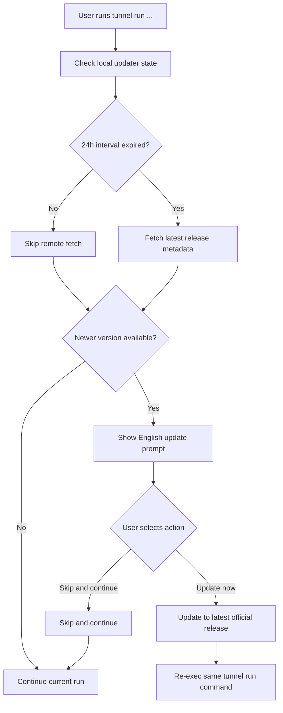

# Tunnel Binary Update UX

## Problem Frame

`tunnel` ships as a fast-moving CLI, but users who do not update regularly miss important capabilities and fixes. The release/distribution flow now exists, but the day-2 experience is still weak: an installed user can keep running an old binary indefinitely unless they proactively remember to reinstall it.

This work should add a simple, stable update experience that helps active `tunnel run` users move forward without turning startup into a brittle, network-dependent flow. The product should prefer low-friction upgrade paths, clear recovery behavior, and minimal configuration surface over a more ambitious fully automatic updater.

## Requirements

**Entry Points and Eligibility**
- R1. The automatic update UX must run only on `tunnel run`, not on `tunnel daemon` commands.
- R2. The startup update prompt must appear only when `tunnel run` is executing in an interactive terminal.
- R3. Non-interactive usage must not show an update prompt, must not print update notices, and must not block on update interaction.
- R4. Interactive update discovery must be available both for official release binaries and for local dev or other non-release builds, so users can move onto the official release channel from their current install.

**Update Discovery Model**
- R5. Every `tunnel run` invocation must pass through update-check logic, even when no remote request is made.
- R6. v1 must use one single 24-hour update-check interval that governs both remote re-checking and re-prompting.
- R7. If the local update-check interval has not expired, `tunnel run` must reuse local updater state and must not re-fetch remote update metadata.
- R8. If the local update-check interval has expired, `tunnel run` must fetch the latest official release metadata before deciding whether to prompt.
- R9. If the remote update check fails, `tunnel run` must continue silently and keep local work unblocked.
- R10. The automatic update-disable setting must cause `tunnel run` to skip all automatic update logic, including both checking and prompting.

**Startup Prompt UX**
- R11. The startup update prompt must be presented in English.
- R12. The startup prompt must be minimal and must show the current version, the latest version, and a confirmation question.
- R13. The prompt copy for v1 must follow this shape:

| Element | Copy |
|---|---|
| Title | `A new Tunnel version is available` |
| Line 1 | `Current: <current-version>` |
| Line 2 | `Latest:  <latest-version>` |
| Question | `? Update Tunnel now?` |

- R14. The prompt must use a two-option arrow-menu interaction.
- R15. The prompt actions for v1 must be `Update now` and `Skip and continue`.
- R16. The prompt must not show manual command hints such as `tunnel update`.
- R17. If the user chooses to skip, the current `tunnel run` command must continue immediately.
- R18. v1 must treat any newer version as eligible for prompting, including versions outside the current compatibility line; the prompt must not add special cross-line warning copy in this first pass.

**Update and Recovery Behavior**
- R19. If the user selects `Update now`, Tunnel must update to the latest official release.
- R20. If the update step fails before control is handed off to the new binary, Tunnel must print the failure and continue the original `tunnel run`.
- R21. If the update succeeds, Tunnel must automatically restart the same `tunnel run` command under the new binary.
- R22. If the update succeeds but automatic restart of the original `tunnel run` fails, Tunnel must stop and print a clear recovery path, including `tunnel rollback`, instead of silently continuing.
- R23. Tunnel must expose a manual `tunnel update` command for explicit upgrade.
- R24. `tunnel update` must allow a local dev or other non-release build to move onto the latest official release.
- R25. Tunnel must expose a manual `tunnel rollback` command for explicit downgrade to the previous installed official version.
- R26. `tunnel rollback` in v1 must be a single-step undo of the most recent successful official upgrade. After one successful rollback, no rollback target remains until a later successful official upgrade creates a new one.
- R27. `tunnel rollback` must re-download the previous official version instead of restoring a locally preserved prior binary.
- R28. If rollback cannot download its target version, Tunnel must fail with a clear error and explicit recovery guidance.
- R29. If the user upgraded from a non-release build into an official release, and that previous build was not itself an official release version, Tunnel must make clear that rollback is unavailable for that transition.

**Binary Identity and Local State**
- R30. Whether the current binary is an official Tunnel release must be provable by the binary itself and must not depend on an external local metadata file.
- R31. Loss or corruption of local updater state must not cause an official release binary to be treated as unofficial; it may only affect conveniences such as prompt cadence or rollback availability.
- R32. Tunnel must treat `~/.tunnel/` as its user-visible persistent local state root for this feature area.
- R33. User-editable CLI settings must live in `~/.tunnel/settings.json`.
- R34. `settings.json` must use an `env` object as the extensible container for user-configurable values.
- R35. Runtime environment variables must override keys provided via `~/.tunnel/settings.json`.
- R36. v1 must support disabling automatic startup update behavior through both environment configuration and `~/.tunnel/settings.json`.

**Documentation**
- R37. User-facing docs must explain the automatic startup update behavior for `tunnel run`, the 24-hour check interval, `tunnel update`, and `tunnel rollback`.
- R38. User-facing docs must explain that persistent Tunnel settings and updater state live under `~/.tunnel/`.
- R39. Repo-facing docs must align on the new local-state story, including `README.md`, `CLAUDE.md`, and `AGENTS.md`.

## Success Criteria
- An interactive `tunnel run` user with an outdated binary is prompted at most once per 24-hour interval and can upgrade with one visible menu choice.
- A user who skips the prompt can continue their current `tunnel run` without extra friction.
- A user whose startup upgrade fails before handoff still reaches their original `tunnel run`.
- A user whose post-upgrade restart fails sees a clear manual recovery path.
- A user can run `tunnel update` explicitly without waiting for the startup prompt.
- The docs explain the new update UX and the `~/.tunnel/` local-state contract without relying on tribal knowledge.

## Scope Boundaries
- No startup update UX for `tunnel daemon` in v1.
- No update prompt or warning output in non-interactive or scripted usage.
- No forced upgrades in v1.
- No release notes, changelog snippets, or feature summaries in the startup prompt.
- No multi-version rollback history in v1.
- No guarantee that rollback works for transitions from a non-release build into the official release channel.

## Key Decisions
- **Prompt only on `tunnel run`**: this keeps the experience anchored to the most common interactive entrypoint and avoids broadening the surface area too early.
- **Single 24-hour interval**: one cadence governs both network checks and re-prompting, which keeps the model simple and easy to explain.
- **Minimal English prompt**: current version, latest version, and a binary choice are enough for v1; anything more adds UI and copy complexity.
- **Binary self-identifies official releases**: deleting a local state file must not change whether Tunnel recognizes itself as an official release binary.
- **`~/.tunnel/` as the persistent state root**: this creates one stable, user-visible home for settings and updater state instead of scattering new feature state across multiple roots.
- **`settings.json` with `env` semantics**: this keeps v1 small while leaving room for future CLI settings without inventing a second configuration system.
- **Manual `update` and `rollback` commands**: the startup prompt stays minimal, but users still have explicit lifecycle commands when they need them.

## Dependencies / Assumptions
- The official release channel continues to publish a machine-readable latest-version signal that Tunnel can consume.
- Official release artifacts remain publicly downloadable by exact version for rollback purposes.
- Tunnel can safely replace its installed binary in the supported install scenarios without requiring elevated privileges.

## Outstanding Questions

### Resolve Before Planning

None.

### Deferred to Planning
- [Affects R18,R19,R29] (Technical) What exact build metadata or release marker should be embedded in the binary so Tunnel can distinguish official release binaries from non-release builds without relying on local files?
- [Affects R6-R10,R30-R35] (Technical) What exact updater-state schema should live under `~/.tunnel/`, and which files should be treated as user-editable versus internal state?
- [Affects R8,R18,R19] (Technical) What exact remote manifest fields should v1 consume beyond the current version and compatibility-line contract?
- [Affects R20-R28] (Technical) What is the safest handoff and re-exec flow for `tunnel run`, including atomic replace behavior and rollback-target recording?
- [Affects R23-R28] (Technical) Should manual `tunnel update` remain latest-only in v1, or should version pinning be intentionally unsupported and documented as such?

## Next Steps

→ `/prompts:ce-plan` for structured implementation planning
