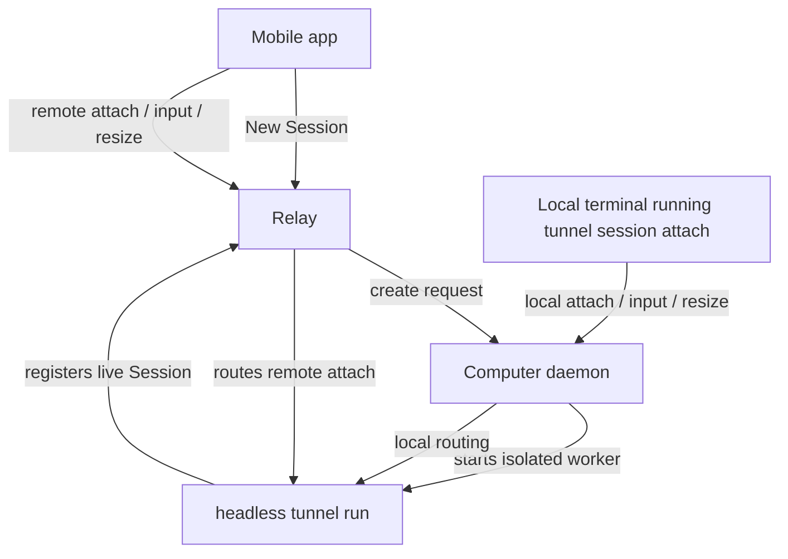

# Session And Terminal Unification

## Summary

Tunnel should unify Session and Terminal around one model: a Session is a computer-owned terminal execution context that users can attach to, return to, and stop. Mobile `New Session` creates a background shell Session by asking the target computer daemon to start an isolated headless `tunnel run <shell>` worker; mobile and local terminals then attach to that Session instead of treating Terminal as a separate product object.

---

## Problem Frame

The current mobile-created Session flow feels more like submitting a launch form than entering a terminal. A user picks path and label values, sends a composed launch request, and waits for Tunnel to start the command. That can work functionally, but it does not match the mental model users bring from SSH: connect to a computer, land in a terminal, type commands naturally, and continue the work from another client later.

The split between "Session" and "Terminal" also makes common workflows awkward. While working inside an agent session, users often need a quick shell command such as `git`, `cp`, `rm`, or `ffmpeg`, but there is no natural terminal-shaped place to do that work. Conversely, a plain terminal running `vim`, `codex`, or `ffmpeg` is also a returnable unit of work and should not feel second-class compared with an agent session.

Earlier brainstorms separated mobile terminals, agent sessions, and tmux workspaces. This document replaces that direction with a unified Session model for the first implementation phase. It supersedes the Terminal-tab and tmux-workspace assumptions in `docs/brainstorms/2026-04-27-mobile-remote-terminal-requirements.md` and the remote-launch workspace assumptions in `docs/brainstorms/2026-04-18-mobile-device-tmux-workspace-requirements.md` where they conflict with this model.

## Prior Art Signals

Current mobile-agent products converge on a similar shape: keep execution on the user's machine or chosen environment, expose a daemon or bridge as the control plane, and make mobile a remote control surface for live Sessions rather than a full replacement for the local development environment.

- **Paseo** runs a local daemon that manages coding agents and exposes the same work across mobile, desktop, web, and CLI. Its CLI surface includes list, attach, and send-style actions, which reinforces local terminal handoff as a first-class workflow.
- **Vibelet** uses a local daemon plus QR pairing, supports mobile-created Claude/Codex sessions, and emphasizes session recovery, approvals, and local-first data ownership.
- **Claude Code Remote Control** keeps Claude running locally and uses phone/web as a window into that local Session. It supports explicit remote-control activation, QR/session URL entry, Session List discovery, and mobile push notifications.
- **Codex mobile** positions mobile as a way to stay close to active work across machines and dev environments, with terminal output, diffs, test results, approvals, and context flowing back to the phone while files and credentials stay where Codex runs.
- **Termly, Bridge Terminal, ClawTab, TermLoop, MuxAgent, C3, and similar tools** mostly follow the same pattern: a local bridge/daemon or managed environment runs the actual agent/terminal work; mobile observes, steers, answers prompts, or attaches.

Common lessons for Tunnel:

- Execution locality is part of the trust story. Users expect their files, credentials, shells, and project setup to stay on the computer or environment where the agent runs.
- Session continuity is the product object. List, attach, stop, send follow-up, approval, and notifications all orbit live work units rather than terminal windows.
- Local CLI handoff matters. Products with a CLI commonly expose list/attach/send equivalents, supporting the idea that a user should be able to return to the computer and resume from a local terminal.
- tmux or a multiplexer is useful when the product promises panes, workspaces, or survival across app/daemon restarts. It is not required for the narrower first-phase promise of daemon-and-worker-alive attach/reconnect.
- Mobile UX often wins through intervention points: approvals, answering prompts, seeing progress, and giving follow-up instructions. Tunnel's differentiator in this phase is that `New Session` starts terminal-first instead of forcing an agent-and-prompt form.

---

## Actors

- A1. Mobile user: starts a new Session from a paired mobile device, attaches to it, types commands, and can reconnect after mobile network changes.
- A2. Local computer user: returns to the target computer and attaches to a mobile-created background shell Session from any local terminal.
- A3. Computer daemon: acts as the resilient control plane for mobile-created background Sessions, worker supervision, local attach, and local stop.
- A4. Session worker: an isolated `tunnel run <command>` process that owns one PTY, terminal mirror, attach handling, and the child command lifecycle.
- A5. Relay: routes mobile requests and remote attaches but does not own terminal state, command semantics, or durable Session history.

---

## Key Flows

- F1. Mobile creates a new background Session
  - **Trigger:** A paired mobile client taps `New Session` for an online computer.
  - **Actors:** A1, A3, A4, A5
  - **Steps:** The mobile app sends a create request through the relay. The daemon accepts only if no other create request is currently in flight and the live background Session limit has not been reached. The daemon chooses a shell, starts an isolated headless `tunnel run <shell>` worker in the user's home directory, and waits for the worker to register as a live Session. The mobile app attaches to the new Session once it is ready.
  - **Outcome:** A live background shell Session appears in the unified Session List and can be attached from mobile.
  - **Covered by:** R1, R4, R6, R7, R9, R10, R11, R20, R21, R22, R23, R24, R25

- F2. User returns to the computer and attaches locally
  - **Trigger:** The user is back at the target computer and runs `tunnel session attach <session-id>` in their chosen terminal.
  - **Actors:** A2, A3, A4
  - **Steps:** The CLI contacts the local daemon socket. The daemon verifies that the target is a local, mobile-created background shell Session. The local terminal enters interactive attach mode and shares the same PTY as any mobile attach clients. Exiting the attach client detaches the local terminal without stopping the Session.
  - **Outcome:** The work naturally moves from phone to computer without relying on relay availability.
  - **Covered by:** R27, R28, R29, R30, R31, R32, R35

- F3. Session ends
  - **Trigger:** The shell exits, the user explicitly stops the Session, or the worker fails.
  - **Actors:** A1, A2, A3, A4, A5
  - **Steps:** A normal shell `exit` ends the background Session. `tunnel session stop <session-id>` ends it explicitly; for local mobile-created background Sessions, stop uses the local daemon path. Worker failure is isolated to that Session. The Session disappears from the live Session List.
  - **Outcome:** No ended Session history is retained in the live product surface, and daemon health is not degraded by one Session ending.
  - **Covered by:** R36, R37, R38, R39, R40

---

## Requirements

**Unified Session model**
- R1. The mobile primary creation action must be named `New Session`, not `New Terminal`.
- R2. The mobile app must use one unified Session List for agent command sessions, background shell Sessions, and any other live terminal execution contexts; it must not introduce a separate top-level Terminals tab in this phase.
- R3. A Session must be presented as a returnable terminal execution context, regardless of whether the current work is a shell, `vim`, `codex`, `ffmpeg`, or another command.
- R4. `tunnel run <command>` remains the only Session worker model in this phase. The CLI must continue requiring an explicit command; this phase must not add `tunnel run` with no command.
- R5. Existing local foreground command Sessions, such as `tunnel run codex`, keep their current lifecycle: when the launched command exits, the Session ends.

**Mobile-created background shell Sessions**
- R6. Mobile `New Session` must ask the selected computer daemon to create a background shell Session.
- R7. The daemon must create that Session by starting an isolated headless `tunnel run <shell>` worker rather than by owning all PTYs inside the daemon process.
- R8. Each background shell Session must run in its own worker process so a worker crash or PTY failure affects only that Session.
- R9. The daemon must act as a control plane for worker launch, supervision, local attach, local stop, and roster visibility; it must not become the shared runtime owner for all Session PTYs.
- R10. The shell command for mobile `New Session` must be chosen from the daemon environment's `$SHELL` when usable, falling back to `/bin/sh` when `$SHELL` is missing or unusable.
- R11. A new mobile-created background shell Session starts in the daemon user's home directory.
- R12. The Session worker inherits the daemon startup environment in this phase. The product does not promise full login-shell environment reconstruction.
- R13. Paired and authenticated mobile clients are trusted to create background shell Sessions on the paired computer. This phase must not preserve the old command-form allowlist model for mobile `New Session`.

**Session List display**
- R14. A newly created background shell Session with no submitted command must display as `Terminal N`, where `N` disambiguates live blank terminal Sessions on the same computer.
- R15. The `Terminal N` numbering is display-oriented and does not need to be durable across daemon restart or Session lifecycle boundaries.
- R16. When a user submits a non-empty command through a Tunnel attach client, the Session title must update to a truncated version of that full submitted command line.
- R17. Empty Enter submissions must not update the Session title.
- R18. Title updates must come from Tunnel attach input only. The product must not parse terminal output, shell prompts, aliases, history expansion, or process trees to infer the current foreground program in this phase.
- R19. The first phase does not redact sensitive arguments from title text. Truncation is required for display, but secret detection and masking are deferred.

**Creation reliability and limits**
- R20. A computer may have at most one mobile `New Session` creation request in flight at a time.
- R21. Once a background shell Session is created successfully, it no longer counts as in flight; the same computer may have multiple live background shell Sessions.
- R22. Each computer must enforce a conservative default limit for live mobile-created background shell Sessions. When the limit is reached, `New Session` fails clearly and does not create a Session item.
- R23. `New Session` creation must time out after a short window of roughly 10-15 seconds if the worker does not register as a live Session.
- R24. Worker startup failure, shell unavailability, registration timeout, pairing/auth failure, and launch-busy conditions must return explicit failure results to mobile. Failed creation must not leave a failed Session item in the Session List.
- R25. When creation fails after a worker may have started, the daemon should attempt best-effort cleanup while keeping its own health independent from that worker failure.

**Attach behavior**
- R26. Mobile clients may attach to live Sessions through the existing relay-routed remote attach model.
- R27. The local CLI must provide a relay-independent way to discover attachable local mobile-created background shell Sessions, including their Session IDs.
- R28. `tunnel session attach <session-id>` must attach from the current local terminal to a local mobile-created background shell Session.
- R29. Local attach in this phase must be limited to Sessions owned by the same computer daemon and created by mobile `New Session`.
- R30. Local attach must not support foreground command Sessions such as `tunnel run codex`, Sessions on other computers, or arbitrary account-visible remote Sessions in this phase.
- R31. Local attach must use the local daemon path and must not require relay availability once the local daemon and Session worker are alive.
- R32. Multiple attach clients may be connected to the same background shell Session at the same time, and all attached clients may send input to the shared PTY.
- R33. PTY size must follow the last active attach client. Activity includes attach, input, or terminal resize from a client.
- R34. Because all clients share one PTY, non-active clients may see terminal layout changes when another client becomes active and changes size.
- R35. Detaching a mobile client, closing the mobile view, losing mobile network, or exiting the local attach client must not stop the Session.

**Stop and lifecycle**
- R36. A background shell Session ends when its shell exits.
- R37. A background shell Session may also be stopped explicitly through `tunnel session stop <session-id>` or the mobile stop action.
- R38. For local mobile-created background shell Sessions, `tunnel session stop <session-id>` must use the local daemon path and must not require relay availability.
- R39. When a background shell Session ends, it must disappear from the live Session List immediately. This phase must not add durable ended-session history.
- R40. Worker crash or child process failure must remove only the affected Session and must not crash the daemon or other Sessions.

**Tmux and workspace scope**
- R41. Mobile `New Session` must not require tmux in the first phase.
- R42. The first phase must not expose tmux workspace concepts in the user-facing model for creating, listing, attaching to, or stopping Sessions.
- R43. This phase does not promise Session recovery after daemon restart or worker process death. Recovery is limited to attach/reconnect while the daemon and worker remain alive.

---

## Acceptance Examples

- AE1. **Covers R1, R2, R6, R10, R11, R14.** Given a paired phone and an online computer daemon with `$SHELL=/bin/zsh`, when the user taps `New Session`, the daemon starts a headless `tunnel run /bin/zsh` in the user's home directory and the mobile Session List shows a live `Terminal 1` Session.
- AE2. **Covers R16, R17, R18, R19.** Given `Terminal 1` is attached on mobile, when the user submits `ffmpeg -i input.mov output.mp4`, the Session title updates to a truncated version of that submitted command; when the user presses Enter on an empty prompt afterward, the title stays unchanged.
- AE3. **Covers R20, R21, R23, R24.** Given one `New Session` request is waiting for worker registration, when a second phone submits another `New Session` request to the same computer before the first finishes, the second request fails with a busy-style result; after the first request succeeds or times out, a new request may be attempted.
- AE4. **Covers R27, R28, R29, R30, R31, R35.** Given a mobile-created background shell Session is live on this computer and relay connectivity is unavailable, when the local user lists local attachable Sessions and runs `tunnel session attach <session-id>`, the local terminal attaches through the local daemon path; exiting local attach detaches only that local terminal.
- AE5. **Covers R32, R33, R34.** Given mobile and local terminal are both attached to the same background shell Session, when the local terminal receives input or resizes, the PTY follows the local terminal size; the mobile view may see the TUI reflow because both clients share one PTY.
- AE6. **Covers R36, R37, R38, R39, R40.** Given a background shell Session is live, when the shell exits or the user runs local `tunnel session stop <session-id>`, the Session disappears from the live Session List and other Sessions remain unaffected.

---

## Success Criteria

- Mobile `New Session` feels like entering a computer terminal rather than filling out a launch form.
- Users can start from mobile, type `codex` or any shell command, then return to the computer and continue in a local terminal with `tunnel session attach <session-id>`.
- A single Session worker failure does not crash the daemon or affect other live Sessions.
- tmux is no longer required for the first-phase mobile `New Session` path.
- Session List presents one coherent model for foreground command Sessions and mobile-created background shell Sessions.
- The requirements are concrete enough that planning does not need to invent Session ownership, lifecycle, attach scope, title behavior, or tmux boundaries.

---

## Scope Boundaries

- No `tunnel run` without an explicit command.
- No separate mobile Terminals tab.
- No old mobile cwd/label/command creation form for the primary `New Session` flow.
- No Session-internal split terminal in this phase.
- No automatic opening of the user's default terminal application or desktop window.
- No local attach to foreground command Sessions such as `tunnel run codex`.
- No local attach to Sessions on other computers.
- No relay-independent mobile attach; local relay independence applies only to same-computer CLI attach and stop.
- No strict current-foreground-process detection.
- No shell prompt, terminal output, or process-tree parsing for title updates.
- No sensitive-argument masking in Session titles.
- No durable ended-session history.
- No daemon-restart Session recovery guarantee.
- No tmux workspace user flow for the first-phase `New Session` model.

---

## Key Decisions

- **Session is the macro concept:** Terminal is the interaction surface, but the user manages Sessions.
- **`tunnel run <command>` remains the Session worker:** Foreground local command Sessions and mobile-created background shell Sessions share one runtime model while preserving explicit CLI command creation.
- **Use isolated workers rather than daemon-owned PTYs:** Stability is more important than collapsing everything into one process; daemon remains a resilient control plane.
- **Remove tmux as a first-phase dependency:** The new lifecycle target is daemon-and-worker-alive attach/reconnect, not tmux-level recovery after daemon restart.
- **Local attach is part of v1 scope:** Returning from phone to computer is essential to the SSH-like flow, so `tunnel session attach <id>` is required for local mobile-created background Sessions.
- **Local attach and stop do not require relay:** A user sitting at the computer should be able to recover and clean up local background Sessions even when relay connectivity is unavailable.
- **Mobile stop targets tunnel daemon:** Paired mobile clients stop Sessions on the computer by reaching **tunnel daemon** (prefer **direct** transport). If traffic goes through **relay**, relay **forwards** the stop to that daemon rather than exposing restored account-wide session list/stop APIs.
- **Creation is serialized, runtime is parallel:** One in-flight create per computer reduces startup races, while multiple live background Sessions preserves terminal-like usage.
- **Titles are user-submitted task hints:** The recent command title improves scanning without pretending to be a process monitor.

---

## GitHub Tracking

Umbrella issue: [#147 Session/Terminal unification umbrella (2026)](https://github.com/yuanbohan/agent-tunnel/issues/147)

The 2026 replan uses **seven feature-focused milestones** (one primary issue each). A separate observability milestone was deferred. Issues **#106–#129** and milestones **#1–#8** were closed as superseded.

- [Milestone 9: Session model & local list](https://github.com/yuanbohan/agent-tunnel/milestone/9) — [#140 Session metadata, full local list, and local attach eligibility](https://github.com/yuanbohan/agent-tunnel/issues/140)
- [Milestone 10: Headless session worker](https://github.com/yuanbohan/agent-tunnel/milestone/10) — [#141 Headless tunnel run worker](https://github.com/yuanbohan/agent-tunnel/issues/141)
- [Milestone 11: Daemon background launch](https://github.com/yuanbohan/agent-tunnel/milestone/11) — [#142 Daemon background shell sessions without tmux](https://github.com/yuanbohan/agent-tunnel/issues/142)
- [Milestone 12: Local attach & stop](https://github.com/yuanbohan/agent-tunnel/milestone/12) — [#143 Local attach, local stop, mobile stop (direct + relay forward)](https://github.com/yuanbohan/agent-tunnel/issues/143)
- [Milestone 13: Shared PTY & titles](https://github.com/yuanbohan/agent-tunnel/milestone/13) — [#144 Shared PTY, resize ownership, and session titles](https://github.com/yuanbohan/agent-tunnel/issues/144)
- [Milestone 14: Mobile New Session cutover](https://github.com/yuanbohan/agent-tunnel/milestone/14) — [#145 Mobile New Session product cutover](https://github.com/yuanbohan/agent-tunnel/issues/145)
- [Milestone 15: Docs & tmux positioning](https://github.com/yuanbohan/agent-tunnel/milestone/15) — [#146 Documentation and tmux model cleanup](https://github.com/yuanbohan/agent-tunnel/issues/146)

---

## Dependencies / Assumptions

- The daemon can start child worker processes with the same base URL and auth context it uses for its relay connection without exposing those values to mobile clients.
- The daemon can supervise worker liveness and clean up local state when a worker exits or fails.
- The existing attach/mirror/input model can be reused by a headless `tunnel run <shell>` worker without requiring a local terminal sink.
- The local daemon socket is an acceptable authority boundary for same-user local attach and stop.
- Mobile clients can tolerate live-only Session discovery: ended or failed Sessions do not remain as history items.
- Users accept that paired mobile clients have shell-equivalent power on the paired computer for this feature.

---

## Outstanding Questions

### Resolve Before Planning

- None.

### Deferred to Planning

- [Affects R7, R26][Technical] What exact internal mode or invocation should make `tunnel run <shell>` headless while preserving the normal PTY, mirror, relay registration, and stop behavior?
- [Affects R10][Technical] How should `$SHELL` be validated as usable before falling back to `/bin/sh`?
- [Affects R14, R15][Technical] What exact numbering rule produces `Terminal N` consistently across concurrent live blank Sessions without introducing durable naming state?
- [Affects R16, R18][Technical] Which input boundary should record the submitted command for title updates so mobile and local attach behave identically?
- [Affects R22][Product/Technical] What default live background Session limit should ship first, and should it be configurable in this phase?
- [Affects R23, R24, R25][Technical] What worker cleanup guarantee is realistic after a registration timeout?
- ~~[Affects R27][Product/Technical] Should relay-independent local discovery extend `tunnel session list`, add a local-only option, or use a separate narrow command?~~ **Resolved:** `tunnel session list` is the single local-computer roster (all live broker sessions). Local `attach` is allowed only for eligible mobile-created background shells; ineligible rows remain visible with clear errors. Mobile **stop** targets **tunnel daemon** (direct preferred); **relay forwards** stop to the daemon when the path is not direct. Tracking: [#140](https://github.com/yuanbohan/agent-tunnel/issues/140), [#143](https://github.com/yuanbohan/agent-tunnel/issues/143).
- [Affects R28-R35][Technical] What local daemon attach protocol provides terminal bytes, input, resize, and detach semantics without depending on relay?
- [Affects R33][Technical] How should "last active attach" be ordered when attach, input, and resize events arrive close together from different clients?
