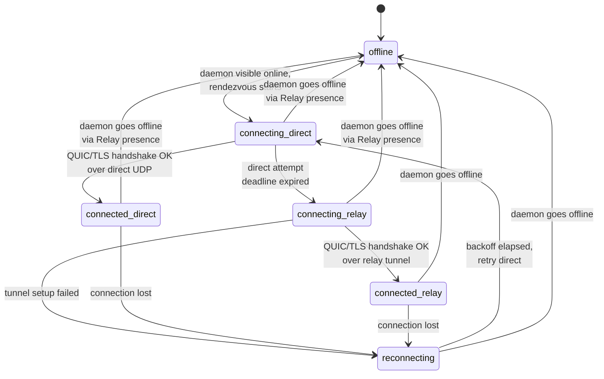
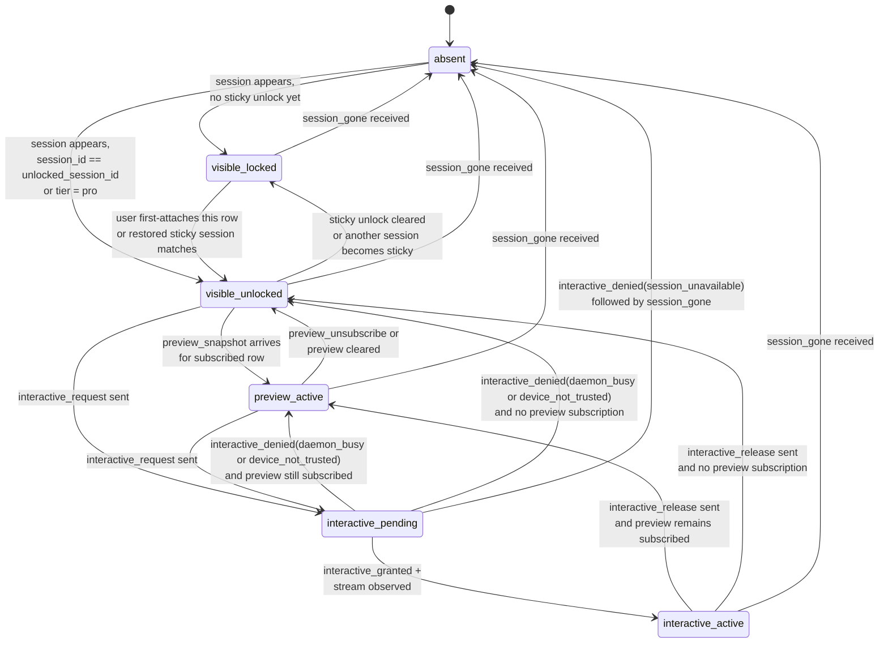
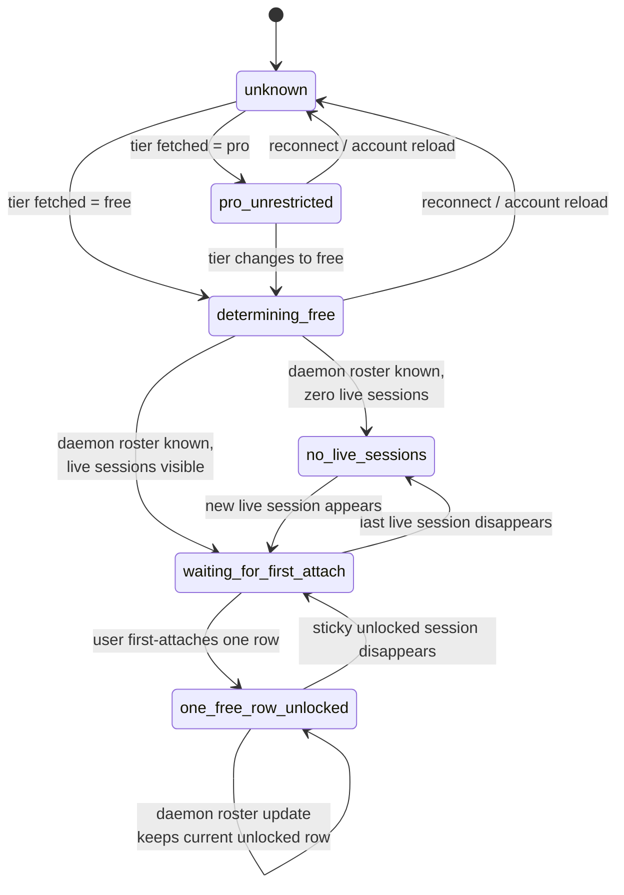

# Connectivity State Machines

## Status

This document collects the three core state machines of the QUIC session-connectivity architecture in one place. State names match the transport and UI concepts used elsewhere in `docs/connectivity/`.

## Per-Daemon Transport State

This state is owned by the Android connection manager. Each daemon connection has one independent instance of this state machine. The state name is also surfaced in the UI as the daemon-card status.

### Transition Rules

- `offline → connecting_direct` happens when Relay presence shows the daemon online and the app chooses to connect to it
- `connecting_direct → connecting_relay` is sequential, not happy-eyeballs; the deadline is an implementation default, not a wire-level constant
- `connecting_* → offline` happens immediately if Relay presence marks the daemon offline before the transport finishes connecting
- `reconnecting` uses exponential backoff with jitter; exact timing is an implementation default
- the path badge shown in the UI is derived directly from this state: `connected_direct → "Direct"`, `connected_relay → "Relay"`, others → status word

### Daemon-Side Mirror

The daemon also maintains a per-Android-connection state, but its state space is narrower: it only knows whether a QUIC connection currently exists for a given Android device fingerprint. There is no daemon-side notion of `connecting_direct` vs `connecting_relay`; the daemon accepts QUIC packets from either carrier and treats them identically.

## Per-Session UI Lifecycle

This state is owned per `(daemon, session)` pair on the Android side. Multiple sessions on the same daemon connection can each be in different states.

### State Meanings

- `absent` — the session is not currently present in the daemon roster
- `visible_locked` — the row is visible in the official app but not currently usable under the local free/pro product rule
- `visible_unlocked` — the row is currently usable, but no live preview is being shown yet
- `preview_active` — the app subscribed to preview and is receiving live preview snapshots for this session
- `interactive_pending` — the app sent `interactive_request` and is awaiting daemon response
- `interactive_active` — daemon opened an interactive stream; snapshot and live bytes are flowing

### Rules

- the lock/unlock decision is app-local in phase 1; neither Relay nor daemon tracks this per session
- on free tier, before the user has chosen a session, all rows may remain `visible_locked`
- on free tier, at most one row per connected daemon card is `visible_unlocked` at a time
- on free tier, roster updates do not unlock a new row automatically; only a user first-attach or sticky restore does that
- `interactive_denied(session_unavailable)` should be followed by row removal once `session_gone` is processed

### Daemon-Side Mirror

The daemon does not model `visible_locked` vs `visible_unlocked`.

From the daemon's perspective a paired device may:

- subscribe or unsubscribe preview for any session
- request interactive for any session
- receive grant / deny per session

The phase-1 official app enforces the free/pro rule before sending those requests.

## Per-Daemon Card Policy Lifecycle

This state is owned by the official Android app per connected daemon card. It exists only to make the free-tier rule explicit.

### Notes

- Relay provides only the tier input for this machine
- the roster input comes from one daemon's `session_index` / `session_upsert` / `session_gone`
- on free tier, the app keeps one optional `unlocked_session_id` per connected daemon card
- that sticky unlock is set only by the user's first interactive attach on that card
- no manual switching exists in phase 1
- when the sticky unlocked session disappears, the app returns to `waiting_for_first_attach`

## Cross-Reference

- transport state names are listed in `transport-protocol.md`
- free/pro product rules are described in `subscription-model.md`
- preview and interactive frame behavior are in `../protocol/transport.md`
- recommended UI behavior is in `../ux/android.md`

## Related Documents

- `../architecture.md`
- `../contract.md`
- `../protocol/transport.md`
- `../protocol/relay.md`
- `../ux/subscription.md`
- `error-codes.md`
- `sequence-flows.md`
