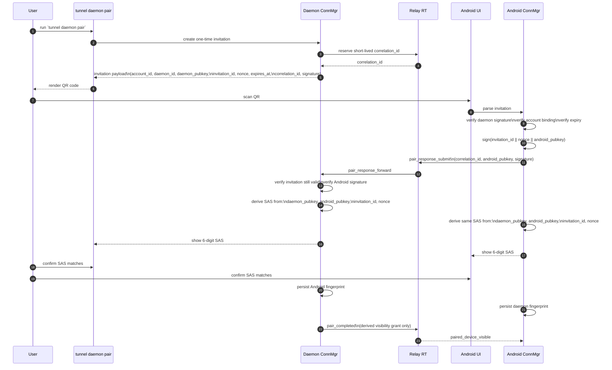
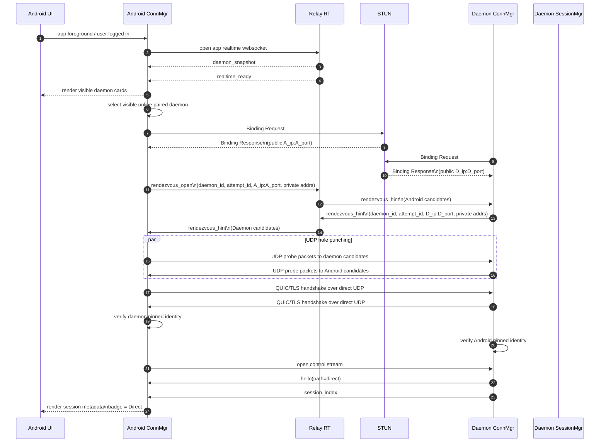
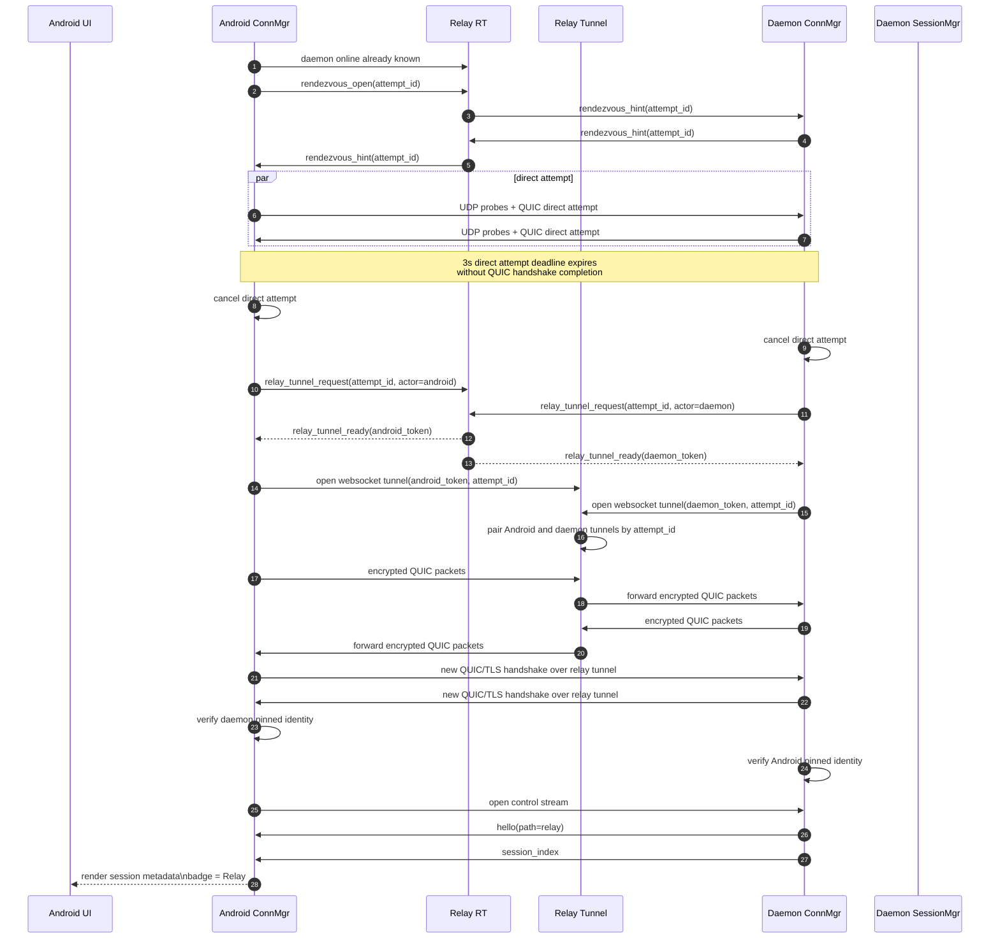
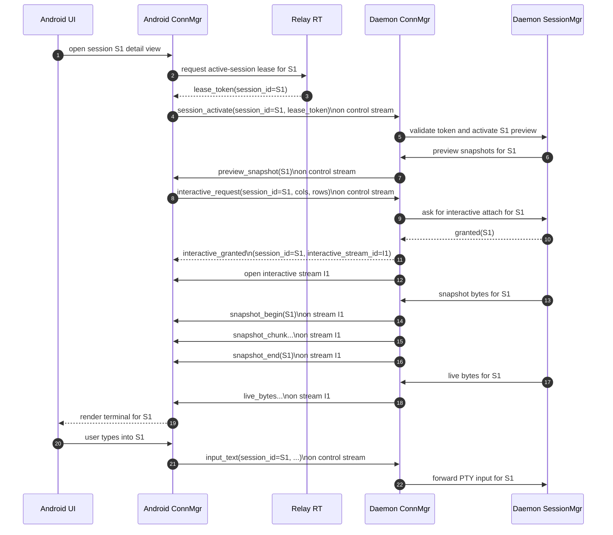
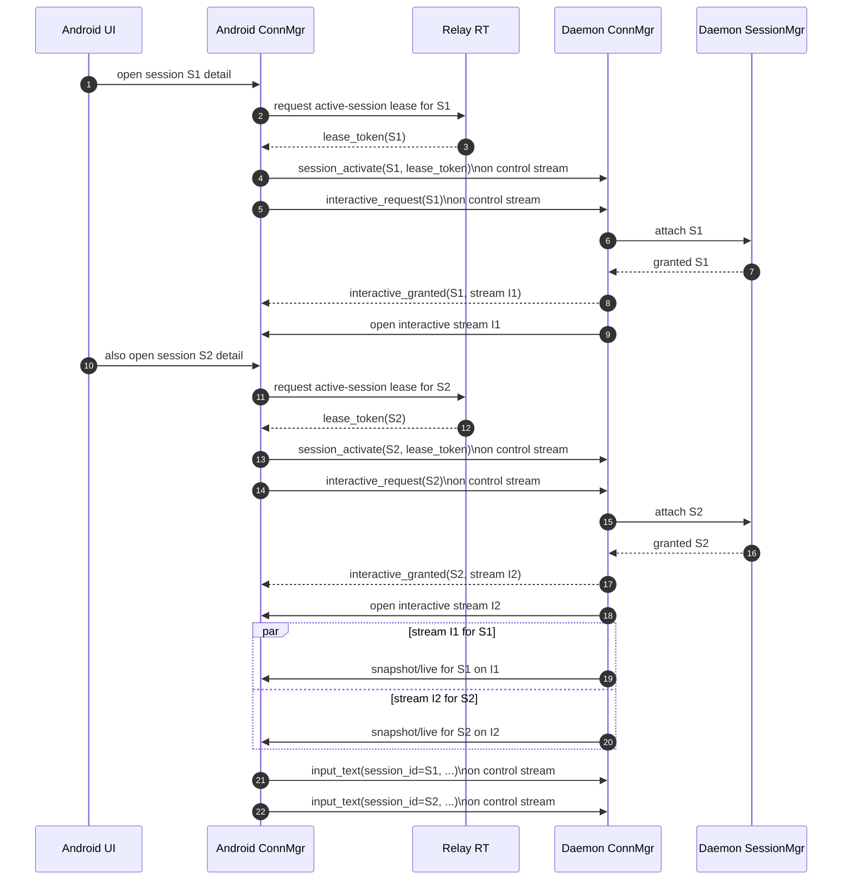
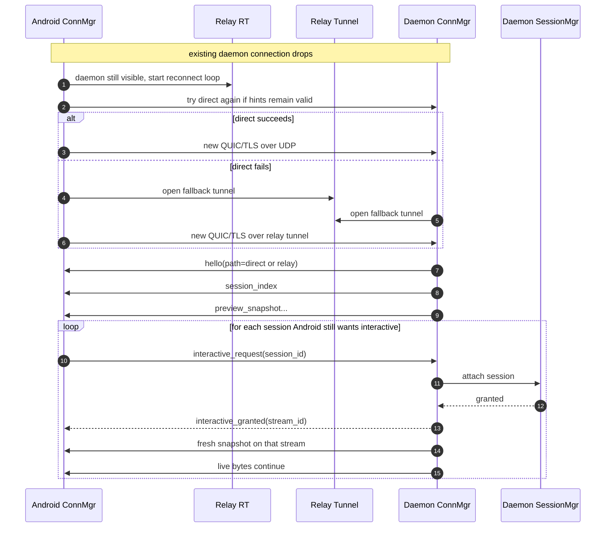

# Connectivity Sequence Flows

## Status

This document captures detailed end-to-end sequence flows for the target connectivity architecture under `docs/connectivity/`.

It is intentionally more operational than `architecture.md`. Its purpose is to make the moving pieces easy to reason about before implementation:

- pairing
- SAS confirmation
- STUN-assisted direct connection attempts
- relay fallback tunnel establishment
- daemon-driven session synchronization
- interactive session attachment over multiple QUIC streams

These flows describe the intended target design. They are not a statement that the current repository already implements them.

## Actors

The diagrams use these actors:

- `Android UI`: the visible mobile app screens and user actions
- `Android ConnMgr`: the mobile connectivity manager responsible for relay control-plane and daemon transport
- `Relay RT`: Relay realtime control plane
- `Relay Tunnel`: Relay fallback packet tunnel service
- `STUN`: self-hosted STUN service operated in the same edge footprint as Relay
- `Daemon ConnMgr`: daemon-side connectivity manager
- `Daemon SessionMgr`: daemon-side session authority, preview generator, and PTY bridge

## Flow 1: Pairing Invitation And SAS Confirmation

### What This Flow Establishes

- Relay transports pairing messages but is not the trust root.
- The daemon-authored invitation is the initial trust anchor.
- The Android device proves possession of its device key by signing the invitation challenge.
- The 6-digit SAS gives the user a final MITM check.
- Successful pairing produces pinned peer identities on Android and daemon. It does not produce one long-lived shared transport secret.

## Flow 2: App Startup To Direct Connection Success

### What This Flow Shows

- Relay tells Android which daemons are visible and online.
- STUN is only used to learn public UDP mappings.
- Relay carries rendezvous hints but never terminal data.
- Direct success means the daemon becomes the source of session list and preview data.
- Path state is tracked per daemon connection, so the Android badge is `Direct` for that daemon.

## Flow 3: Direct Attempt Fails And Falls Back To Relay

### What This Flow Shows

- Direct and relay are different carriers, not different business protocols.
- Fallback creates a new QUIC/TLS connection. It does not migrate the failed direct connection in place.
- Relay Tunnel forwards encrypted QUIC packets only.
- After fallback succeeds, daemon resends session list and preview data over the new connection.
- The direct attempt deadline is fixed at `3s` in phase 1. Sequential (not happy-eyeballs) is chosen so the path-state badge stays unambiguous. See `transport-protocol.md` for the deadline contract.

## Flow 4: Interactive Session Attach Over QUIC Streams

### What This Flow Shows

- Interactive control messages stay on the control stream.
- Terminal payload bytes stay on a dedicated interactive stream.
- The daemon is authoritative for whether a session may become interactive.

## Flow 5: Multiple Interactive Sessions On One Daemon Connection

### What This Flow Shows

- There is one daemon connection path, but potentially many interactive sessions under it.
- The path badge remains a daemon-level property:
  - all sessions on this daemon are either currently `Direct`
  - or currently `Relay`
- Interactive state remains session-scoped:
  - grant/deny
  - stream binding
  - input routing

This flow is the general protocol capability. On free tier, Relay should deny the second active-session lease request, so the app will never reach the second `session_activate` step while the first lease is still held.

## Flow 6: Reconnect And Fresh Recovery

### What This Flow Shows

- Reconnect is path-agnostic.
- Recovery is based on fresh daemon state, not missed-byte replay.
- Each still-needed interactive session is reattached independently.

## State Ownership Summary

### Android ConnMgr Owns

- app realtime websocket lifecycle
- per-daemon transport lifecycle:
  - `connecting_direct`
  - `connecting_relay`
  - `connected_direct`
  - `connected_relay`
  - `reconnecting`
- control stream handle per daemon
- interactive stream handles per session

### Daemon ConnMgr Owns

- paired-device validation
- direct-vs-relay carrier selection
- QUIC/TLS transport lifecycle
- stream creation and routing

### Daemon SessionMgr Owns

- session list
- preview generation
- PTY snapshot/live byte production
- per-session interactive attach decisions

### Relay Owns

- daemon presence
- pairing transport
- rendezvous hint exchange
- fallback tunnel pairing

Relay does not own:

- session list
- preview content
- interactive grants
- terminal byte routing semantics

## Related Documents

- `docs/connectivity/architecture.md`
- `docs/connectivity/pairing-protocol.md`
- `docs/connectivity/relay-protocol.md`
- `docs/connectivity/transport-protocol.md`
- `docs/connectivity/mobile-reference.md`
- `docs/connectivity/android-client-behavior.md`
- `docs/connectivity/daemon-session-sync.md`
