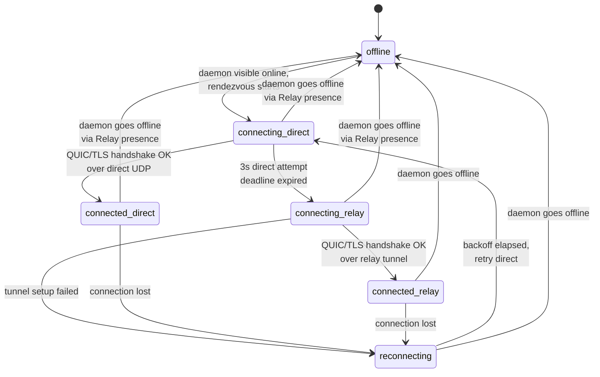
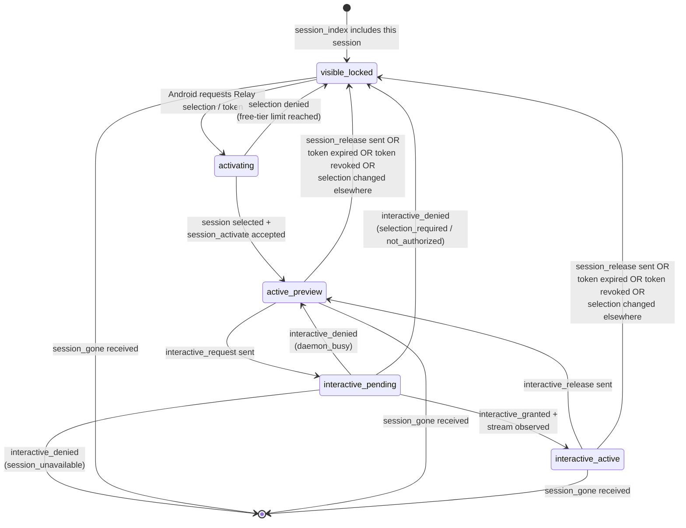
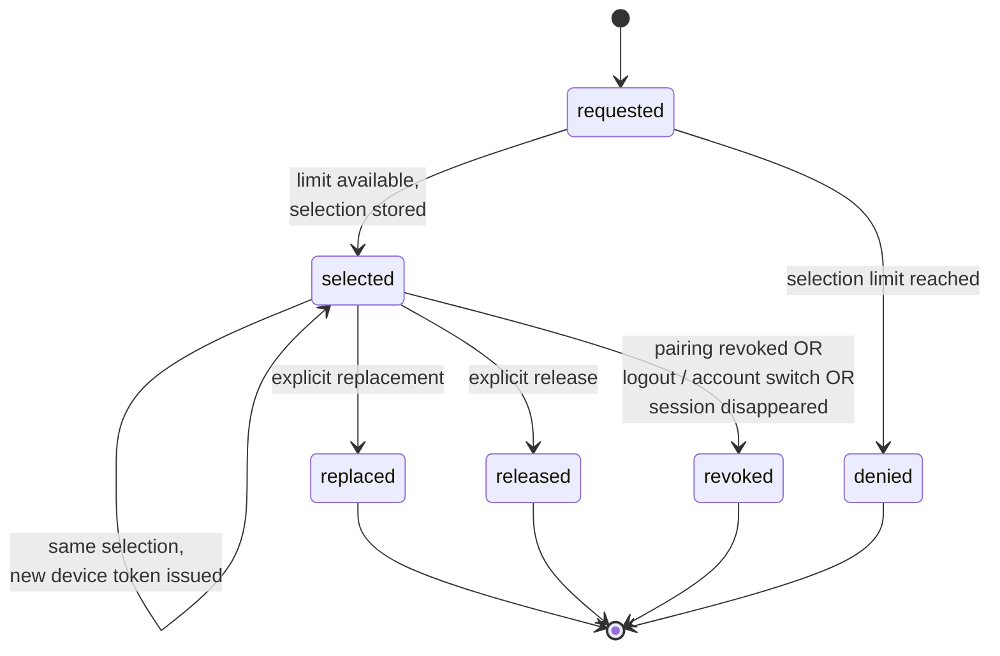

# Connectivity State Machines

## Status

This document collects the three core state machines of the QUIC session-connectivity architecture in one place. State names match the enums used in `transport-protocol.md` and `subscription-model.md` exactly; this is the canonical reference for both daemon (Go) and Android (quiche/Rust) implementations.

## Per-Daemon Transport State

This state is owned by the Android connection manager. Each daemon connection has one independent instance of this state machine. The state name is also surfaced in the UI as the daemon-card status.

### Transition Rules

- `offline → connecting_direct` happens when Relay presence shows the daemon online AND the user is currently looking at this daemon (or it is the most-recently-used daemon in the eager-with-idle-tear-down strategy)
- `connecting_direct → connecting_relay` is sequential, not happy-eyeballs; the deadline is fixed at `3s`
- `connecting_* → offline` happens immediately if Relay presence marks the daemon offline before the transport finishes connecting
- `reconnecting` uses exponential backoff with full jitter, base `1s`, cap `60s`, reset to base on `connected_*`
- the path badge shown in the UI is derived directly from this state: `connected_direct → "Direct"`, `connected_relay → "Relay"`, others → status word

### Daemon-Side Mirror

The daemon also maintains a per-Android-connection state, but its state space is narrower: it only knows whether a QUIC connection currently exists for a given Android device fingerprint. There is no daemon-side notion of `connecting_direct` vs `connecting_relay`; the daemon accepts QUIC packets from either carrier and treats them identically.

## Per-Session Interactive Lifecycle

This state is owned per (daemon, session) pair on the Android side. Multiple sessions on the same daemon connection can each be in different states.

### State Meanings

- `visible_locked` — the session is in `session_index` but is not currently selected for the account or this device does not currently hold a valid access token for it; the row renders as locked, no preview text, no interactive
- `activating` — Android is asking Relay to select the session for the account or mint/renew a device-scoped access token, then presenting it to the daemon via `session_activate`
- `active_preview` — account selection and device token have both been accepted by the daemon; `preview_snapshot` frames now flow for this session
- `interactive_pending` — Android sent `interactive_request`, awaiting daemon decision
- `interactive_active` — daemon opened an interactive stream, full snapshot delivered, live bytes flowing
- `interactive_denied(selection_required / not_authorized)` returns the session to the locked state because the session is not currently usable on this device
- `interactive_denied(daemon_busy)` is temporary and returns to `active_preview`
- `interactive_denied(session_unavailable)` should be followed by row removal once `session_gone` is processed
- terminal states: when `session_gone` arrives the row is removed from the list

### Daemon-Side Mirror

The daemon maintains:

- the set of `(device_fingerprint, session_id, selection_epoch)` tuples currently holding a valid access token
- a revocation cache of access-token `jti` values that were invalidated before expiry
- per active session: whether interactive is granted on this connection
- the QUIC stream id of the interactive stream

The daemon does not need to model `activating`; from its perspective a session is either selected-and-token-active or not. Access-token validation happens on every `session_activate` and on every renewal, and `access_token_revoked` events invalidate cached `jti` values immediately.

## Active-Session Selection Lifecycle

This state is owned by Relay, the source of truth for account-global selected-session state.

### Notes

- `selection_epoch` identifies the current account-global choice for that `(daemon_id, session_id)` entry
- device-scoped access tokens carry both `selection_epoch` and `jti`; renewals reuse `jti` for the same `(device, session, selection_epoch)` lineage but get new `iat` and `exp`
- the daemon accepts a token only while `exp > now` and while its `jti` is not present in the local revocation cache
- `released`, `replaced`, and `revoked` states are propagated to app clients as `active_session_selection_changed` and to daemons as `access_token_revoked` so old devices immediately tear down preview / interactive state and reject reuse of the old token

### Why Relay Owns This Machine

Selection authority is the single subscription gate in the architecture. Centralizing it at Relay means:

- the daemon can stay subscription-unaware
- the account-wide selected-session decision is made once rather than per device
- subscription rule changes propagate from Relay configuration only, not requiring daemon or Android updates

## Cross-Reference

- transport state names are listed in `transport-protocol.md` § Transport State
- interactive frame protocol is in `transport-protocol.md` § Control Stream / Interactive Stream
- access-token format and selection semantics are in `subscription-model.md`
- error codes returned at state transitions are catalogued in `error-codes.md`

## Related Documents

- `docs/connectivity/architecture.md`
- `docs/connectivity/transport-protocol.md`
- `docs/connectivity/relay-protocol.md`
- `docs/connectivity/subscription-model.md`
- `docs/connectivity/error-codes.md`
- `docs/connectivity/sequence-flows.md`
