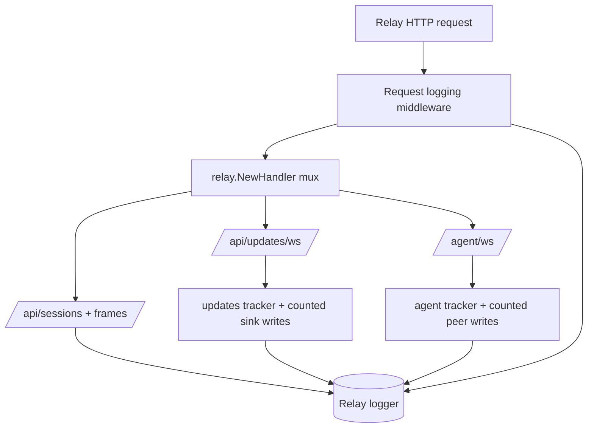

# feat: Add relay request and websocket traffic logging

## Overview

Add relay-scoped access logging for every non-health HTTP request and add per-connection WebSocket lifecycle summaries for `/api/updates/ws` and `/agent/ws`. The new logs stay bodyless and content-opaque while surfacing request targets, durations, response sizes, and aggregate WebSocket message and byte counts that make relay-side traffic easier to debug.

## Problem Frame

The current relay logs are event-specific rather than request-oriented. They show important moments such as auth failures, WebSocket upgrade failures, agent registration, and agent disconnects, but they do not answer basic operator questions such as which request completed with which status, how long it took, or how much traffic a WebSocket session carried. The origin requirements document defines the intended observability boundary: bodyless relay-only logging, `/healthz` excluded, raw query preserved, and aggregate WebSocket traffic tracked without deriving meaning from terminal content (see origin: `docs/brainstorms/2026-04-08-relay-request-and-ws-traffic-logging-requirements.md`).

## Requirements Trace

- R1. Log every non-health-check HTTP request, including requests that later upgrade to WebSocket.
- R2. Keep request and response bodies out of the new logs.
- R3. Include method, request target, response status, and duration for HTTP requests.
- R4. Preserve raw query strings in request logs.
- R5. Include HTTP-layer size signals when they are knowable.
- R6. Emit WebSocket lifecycle logs for `/api/updates/ws` and `/agent/ws`.
- R7. Keep WebSocket lifecycle logs bodyless and content-opaque.
- R8. Surface per-connection duration, message counts, and byte counts in both directions.
- R9. Distinguish upgrade/setup failures from successfully established connections that later close.
- R10. Keep this work relay-only; do not add connector-side outbound request logging.
- R11. Exclude `GET /healthz` from the new request logging by default.
- R12. Fit the new logs into the relay's existing structured JSON logging style.

## Scope Boundaries

- No request or response body logging.
- No PTY-content inspection, previews, or message-semantic derivation.
- No connector-side or `agentunnel` local outbound request logging.
- No metrics backend, persistence layer, or transcript guarantees.
- No changes to relay auth, endpoint contracts, or protocol payload shapes.

## Context & Research

### Relevant Code and Patterns

- `relay/server.go` is the single relay ingress assembly point. It builds the `http.ServeMux`, performs auth checks, handles WebSocket upgrades, and emits the current event logs.
- `relay/client_update_ws.go` owns the outbound update sink for `/api/updates/ws`, which is the natural relay-side write boundary for counting client-directed WebSocket payloads.
- `relay/registry.go` routes client input to the owning agent through `AgentPeer.Send(...)`, which is the natural relay-side write boundary for counting outbound `/agent/ws` traffic.
- `relay/logger.go` defines the structured JSON log shape already used by the relay (`ts`, `level`, `event`, plus flat fields).
- `relay/server_test.go` already uses `httptest.NewServer`, real WebSocket dials, and relay integration assertions. That is the right pattern for proving request logging and upgrade-safe wrappers.
- `relay/logger_test.go` already asserts JSON field-level logger behavior and is the right place for any helper-level logger assertions if field formatting changes.

### Institutional Learnings

- No `docs/solutions/` directory or prior institutional learnings exist in this repository today.

### External References

- None. The codebase already has direct local patterns for relay ingress, WebSocket handling, structured logging, and end-to-end relay tests, so external research would add little practical value here.

## Key Technical Decisions

- Wrap the mux once at the end of `NewHandler(...)`: request logging should be a single middleware layer around the returned handler so successful responses, auth failures, 404s, 405s, and 101 upgrades all share one access-log path.
- Define HTTP sizes conservatively: request size comes from `r.ContentLength` only when the server knows it; response size comes from bytes observed through the wrapped `http.ResponseWriter`. Post-upgrade traffic belongs to WebSocket lifecycle logs, not the HTTP access log.
- Count WebSocket traffic at the decoded application payload boundary: use JSON message bytes the relay successfully decodes from or encodes onto `websocket.Conn`, excluding handshake bytes and ping/pong control traffic, so the logs remain useful without pretending to be wire-accurate.
- Preserve existing targeted relay events: keep `auth_failed`, `ws_upgrade_failed`, and `agent_registered`; add one canonical HTTP completion event and complement the existing agent-side connection events with updates-side lifecycle logs and shared traffic fields.
- Count at actual read/write boundaries: successful read/write boundaries are a better source of truth than queued intent because they avoid overstating traffic when parsing fails, a sink backpressures, or a write never reaches the connection.

## Open Questions

### Resolved During Planning

- How should request logging be attached? Wrap the mux returned from `NewHandler(...)` so all relay routes share one request-logging path and `/healthz` can be skipped centrally.
- How should HTTP request and response sizes be defined? Use `r.ContentLength` when it is non-negative for request size and bytes observed through the wrapped `http.ResponseWriter` for response size, with WebSocket post-upgrade traffic handled separately.
- How should WebSocket byte counts be defined? Count JSON application payload bytes the relay successfully decodes or encodes, excluding upgrade handshake bytes and ping/pong control frames.
- How should event naming fit the current relay log taxonomy? Add `http_request_completed`, add updates-side lifecycle events (`updates_ws_connected`, `updates_ws_disconnected`), and enrich the existing agent-side lifecycle events (`agent_ws_connected`, `agent_disconnected`) with the same traffic summary fields.

### Deferred to Implementation

- The exact helper split between `relay/http_logging.go` and `relay/ws_logging.go` can stay flexible if one combined helper file proves clearer while editing.
- If the wrapped `http.ResponseWriter` cannot observe meaningful body bytes for a 101 upgrade response without awkward special-casing, the access log should prefer omission or observed bytes only over synthetic precision.

## High-Level Technical Design

> *This illustrates the intended approach and is directional guidance for review, not implementation specification. The implementing agent should treat it as context, not code to reproduce.*

## Implementation Units

- [x] **Unit 1: Add access logging around relay HTTP ingress**

**Goal:** Emit one structured access-log event for each non-health HTTP request, including requests that later upgrade to WebSocket, without changing relay route behavior.

**Requirements:** R1, R2, R3, R4, R5, R11, R12

**Dependencies:** None

**Files:**
- Create: `relay/http_logging.go`
- Modify: `relay/server.go`
- Test: `relay/server_test.go`

**Approach:**
- Add a small middleware wrapper around the mux returned from `NewHandler(...)` and emit `http_request_completed` in a deferred closeout path after the wrapped handler returns.
- Skip `/healthz` centrally before allocating the logging wrapper so the new access logging stays low-noise by default.
- Capture status code and response bytes with a wrapped `http.ResponseWriter` that preserves the interfaces needed by WebSocket upgrade paths (`Hijacker`, `Flusher`, and any other delegated interfaces already exposed by the underlying writer).
- Log the request target as `path + "?" + raw_query` when a raw query exists so replay-range requests stay observable as one filterable field.
- Keep existing warning events such as `auth_failed` and `ws_upgrade_failed` unchanged; the new access log complements them rather than replacing them.

**Execution note:** Start with failing log-capture assertions for `/api/sessions`, `/api/sessions/:id/frames?from=...&to=...`, and `/healthz` before extracting the middleware so wrapper behavior is locked down from the start.

**Patterns to follow:**
- `relay/server.go` request handling layout and centralized handler assembly
- `relay/logger.go` flat JSON field style
- `relay/server_test.go` `httptest.NewServer(...)` pattern for end-to-end relay assertions

**Test scenarios:**
- Happy path: authenticated `GET /api/sessions` emits `http_request_completed` with `status=200`, target `/api/sessions`, a non-negative duration, and observed response bytes.
- Happy path: authenticated `GET /api/sessions/sess-1/frames?from=2&to=3` emits `http_request_completed` with the full request target including raw query parameters.
- Error path: unauthenticated `GET /api/sessions` still emits `http_request_completed` with `status=401` while preserving the existing `auth_failed` warning.
- Error path: invalid `from > to` frame query emits `http_request_completed` with `status=400`.
- Edge case: `GET /healthz` emits no `http_request_completed` event.
- Integration: successful WebSocket upgrade requests to `/api/updates/ws` and `/agent/ws` still complete as 101 requests without the wrapper breaking upgrade behavior.

**Verification:**
- Relay ingress emits one bodyless access-log event per non-health HTTP request, and existing relay routes still behave exactly as before.

- [x] **Unit 2: Add reusable WebSocket traffic accounting at relay read and write boundaries**

**Goal:** Introduce shared per-connection traffic accounting that can summarize successfully decoded and encoded WebSocket application messages for both relay-managed WebSocket endpoints without inspecting payload content.

**Requirements:** R6, R7, R8, R12

**Dependencies:** None

**Files:**
- Create: `relay/ws_logging.go`
- Modify: `relay/client_update_ws.go`
- Modify: `relay/server.go`
- Test: `relay/server_test.go`

**Approach:**
- Introduce a small per-connection tracker that records open time, path, remote address, optional session identity, inbound and outbound message counts, and inbound and outbound payload-byte totals.
- Move relay-side reads that need accounting from `ReadJSON(...)` to `ReadMessage(...)` plus `json.Unmarshal(...)` so successfully decoded inbound payload bytes can be counted once before the existing validation logic runs.
- Count outbound payload bytes at the actual relay write boundaries: the `/api/updates/ws` sink path in `relay/client_update_ws.go` and the agent peer send path in `relay/server.go`.
- Count only successfully decoded inbound payloads and successfully encoded outbound payloads. Do not treat malformed frames, queued-but-undelivered messages, ping/pong control frames, or upgrade handshake bytes as traffic totals.
- Allow the `/agent/ws` tracker to attach `session_id` after the register frame succeeds so close summaries can correlate traffic with the owning session when that information exists.

**Patterns to follow:**
- `relay/client_update_ws.go` as the relay-owned outbound write boundary for client updates
- `relay/registry.go` `AgentPeer.Send(...)` usage as the relay-owned outbound write boundary for client input forwarded to the agent
- `relay/server.go` safe-ignore posture for malformed or unsupported WebSocket input

**Test scenarios:**
- Happy path: an `/api/updates/ws` client that receives one output and sends one input closes with non-zero inbound and outbound message counts and payload-byte totals.
- Happy path: an `/agent/ws` connection that registers and sends output frames closes with non-zero inbound counts and includes `session_id` in its summary fields.
- Edge case: a normal client close or sink backpressure path still emits one close summary with the existing reason taxonomy preserved.
- Error path: malformed WebSocket payload that is ignored does not inflate successful routed-message counters as if it were valid relay traffic.
- Integration: traffic accounting does not change output fanout, input forwarding, session replacement, or session-removal behavior.

**Verification:**
- Relay-owned WebSocket trackers report successful application-level traffic in both directions without changing any protocol or routing behavior.

- [x] **Unit 3: Wire endpoint lifecycle logs and prove field parity end to end**

**Goal:** Expose consistent connection-open and connection-close logs for both WebSocket endpoints and verify the new log taxonomy alongside the existing relay event logs.

**Requirements:** R6, R7, R8, R9, R12

**Dependencies:** Unit 1, Unit 2

**Files:**
- Modify: `relay/server.go`
- Modify: `relay/server_test.go`

**Approach:**
- Emit `updates_ws_connected` immediately after a successful `/api/updates/ws` upgrade and preserve `agent_ws_connected` for the agent side, enriching both with the same identifying fields where available.
- Add `updates_ws_disconnected` and enrich `agent_disconnected` so both close summaries carry `path`, `remote_addr`, `duration_ms`, `inbound_messages`, `outbound_messages`, `inbound_bytes`, `outbound_bytes`, and `session_id` when known.
- Keep `agent_registered` as the session-registration event rather than merging registration semantics into connection-open logging.
- Capture logger output in `relay/server_test.go` by injecting `HandlerConfig.Logger` backed by a `bytes.Buffer`, then assert JSON fields rather than relying on fragile plain-text matching.
- Ensure upgrade failure cases continue to emit `ws_upgrade_failed` plus the access log, but never a false connected or disconnected lifecycle pair for a socket that never established.

**Patterns to follow:**
- Existing agent-side lifecycle events in `relay/server.go`
- Existing JSON field assertions in `relay/logger_test.go`
- Existing end-to-end relay tests in `relay/server_test.go`

**Test scenarios:**
- Happy path: successful `/api/updates/ws` connect, one inbound client input, one outbound output update, and disconnect emit `updates_ws_connected` and `updates_ws_disconnected` with shared traffic-summary fields.
- Happy path: successful `/agent/ws` upgrade, register, output upload, and disconnect emit `agent_ws_connected`, `agent_registered`, and enriched `agent_disconnected` with `session_id` and non-zero inbound traffic fields.
- Error path: failed WebSocket upgrade continues to emit `ws_upgrade_failed` plus the HTTP access log, but never an endpoint-connected event.
- Edge case: agent socket that upgrades but closes before a valid register frame still emits a close summary without `session_id` rather than panicking or claiming successful registration.
- Integration: the new log assertions coexist with the existing request, output fanout, and input-forwarding behavior tests in `relay/server_test.go`.

**Verification:**
- Relay logs tell one consistent story across request receipt, successful upgrade, live WebSocket traffic, and connection close for both relay-managed WebSocket endpoints.

## System-Wide Impact

- **Interaction graph:** Request logging wraps every relay HTTP and WebSocket ingress path; WebSocket traffic accounting touches `relay/server.go`, `relay/client_update_ws.go`, and the `AgentPeer.Send(...)` boundary used by `relay/registry.go`.
- **Error propagation:** Access logging must still fire for 401, 404, 405, bad frame-range requests, and failed upgrades. WebSocket close summaries should only appear after a successful upgrade, with existing disconnect-reason mapping preserved.
- **State lifecycle risks:** Counting should happen after successful read/write boundaries so ignored payloads, failed writes, and sink backpressure do not get misreported as delivered traffic.
- **API surface parity:** Relay HTTP and protocol contracts stay unchanged, but the new log event names and shared fields become an operator-facing observability surface that should stay internally consistent.
- **Integration coverage:** End-to-end tests must prove both 101 upgrade compatibility and later WebSocket traffic summaries; helper-only tests would not catch `ResponseWriter` or upgrader regressions.
- **Unchanged invariants:** No request or response body logging, no terminal-content derivation, no connector-side request logging, and no implication that WebSocket byte counts are durable or wire-accurate.

## Risks & Dependencies

| Risk | Mitigation |
|------|------------|
| Wrapped `http.ResponseWriter` breaks WebSocket upgrade | Delegate the underlying writer interfaces needed by the upgrader and prove 101 upgrade success in `relay/server_test.go` |
| WebSocket byte counting adds avoidable encoding overhead on the hot path | Count at the existing read/write boundaries and avoid synthetic re-encoding where a single explicit JSON payload encode can serve both send and count |
| Duplicate logs make failures harder, not easier, to read | Keep one canonical HTTP completion event and one close summary per successful WebSocket connection, while leaving existing targeted warning and registration events intact |
| Byte totals imply more precision than the relay can actually guarantee | Define the counters explicitly as application payload bytes, excluding control frames and handshake traffic, and keep that limitation visible in the plan and final implementation |

## Documentation / Operational Notes

- No `README.md`, `docs/protocol.md`, or `docs/architecture.md` changes are required because the relay's external API and product contract do not change.
- Operators should expect additional structured stderr log volume on non-health HTTP requests and on WebSocket connect and disconnect events, but still no payload content.

## Sources & References

- **Origin document:** [docs/brainstorms/2026-04-08-relay-request-and-ws-traffic-logging-requirements.md](docs/brainstorms/2026-04-08-relay-request-and-ws-traffic-logging-requirements.md)
- Related code: [relay/server.go](relay/server.go)
- Related code: [relay/client_update_ws.go](relay/client_update_ws.go)
- Related code: [relay/registry.go](relay/registry.go)
- Related code: [relay/logger.go](relay/logger.go)
- Related tests: [relay/server_test.go](relay/server_test.go)
