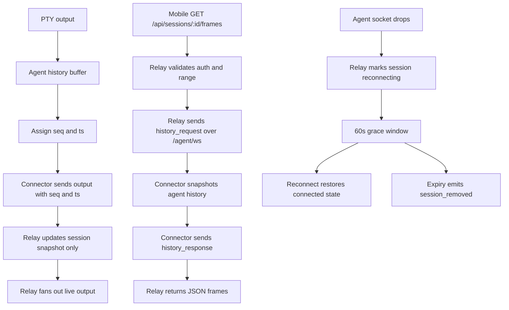
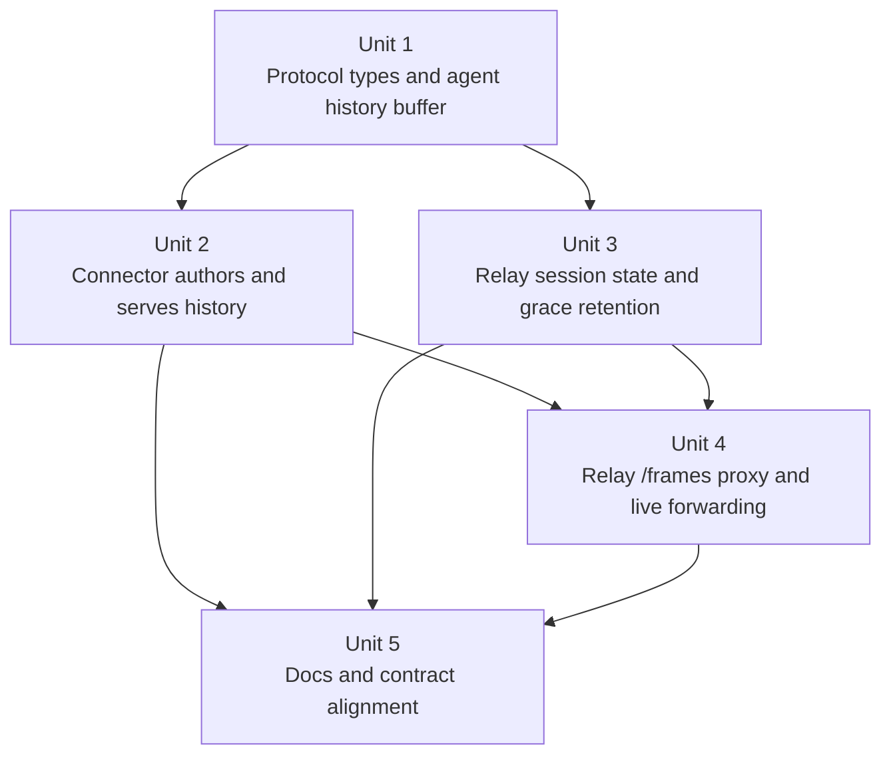

# feat: Move session history ownership to the agent

## Overview

Move session-history authority out of the relay and into the running `agentunnel` process while keeping the client history API stable. In this phase, the agent owns the bounded in-memory PTY output transcript, assigns `seq` and `ts`, and serves history over the existing agent WebSocket when the relay proxies `GET /api/sessions/:id/frames`. The relay keeps discovery, auth, client fanout, and a short reconnect grace window, but it stops storing retained frames locally.

## Problem Frame

The current implementation makes the relay the owner of replay state: it stores frames in memory, assigns `seq`, timestamps frames, and deletes that history as soon as the owning socket disappears. That directly conflicts with the intended product direction from `docs/brainstorms/2026-04-09-agent-side-session-history-requirements.md`: history should live with the PTY owner, relay should narrow toward discovery and routing, and the current relay-proxied history path should be an intermediate step toward future direct P2P fetches.

This change needs to preserve a few product truths at the same time:

- one running agent process keeps one stable `session_id` across relay reconnects
- a fresh agent start creates a fresh session
- session history is PTY output only, not a separate input log
- mobile keeps using `GET /api/sessions/:id/frames`
- `reconnecting` sessions stay discoverable briefly, but are not remotely readable or controllable until the agent reconnects

## Requirements Trace

- R1-R4. Keep one stable `session_id` per running agent process, expose `connected` / `reconnecting`, and add a bounded reconnect grace window.
- R5-R8. Move replay authority to the agent and make the agent the author of frame `seq`, `ts`, and `latest_seq`.
- R9-R14. Keep `/api/sessions/:id/frames` stable for clients, proxy it through relay while connected, add `state` to session snapshots, and remove relay-side history storage.
- R15-R16. Keep the relay thin and frame the relay-proxied history path as a temporary bridge toward future direct P2P fetches.

## Scope Boundaries

- No durable cross-session archive.
- No direct mobile-to-agent P2P transport in this phase.
- No separate input-history or input-acknowledgement product surface.
- No relay-side history cache, shadow store, or retained-frame fallback.
- No attempt to make `GET /api/updates/ws` a lossless channel; live output remains best-effort.

## Context & Research

### Relevant Code and Patterns

- `protocol/message.go` is the shared wire-contract boundary for agent frames, session snapshots, and client update payloads.
- `relay/history.go` contains the existing bounded inclusive-range replay semantics; those semantics should move to the agent side rather than be reinvented.
- `relay/registry.go` already centralizes session ownership, replacement, update-sink fanout, and removal semantics.
- `relay/server.go` already owns the HTTP `/api/sessions/:id/frames` path and the `/agent/ws` read loop that will need to understand more than just `output`.
- `connector/connector.go` already owns stable `protocol.SessionInfo` reuse across reconnects and is the natural transport boundary for agent-authored history and relay-request handling.
- `connector/connector_test.go`, `relay/registry_test.go`, `relay/server_test.go`, and `protocol/relay_types_test.go` already pin the relevant contract surfaces and provide direct patterns for the new behavior.
- `docs/protocol.md`, `docs/architecture.md`, `README.md`, and `CLAUDE.md` currently describe relay-owned history and must be updated together.
- `docs/plans/2026-04-06-002-feat-relay-startup-reconnect-plan.md` already established stable per-process `session_id` continuity across reconnects and should remain compatible with this plan.
- `docs/plans/2026-04-06-003-feat-relay-output-best-effort-contract-plan.md` already documents the best-effort live-output boundary and should be preserved while replay ownership moves.

### Institutional Learnings

- No `docs/solutions/` entries exist in this repository today.

### External References

- None. The work is a repo-internal protocol and lifecycle change, and the local codebase already provides the relevant patterns to follow.

## Key Technical Decisions

- Move the bounded in-memory replay buffer to the agent side and keep it bounded in v1 rather than introducing durable storage. This preserves the current live-session-only scope while changing ownership.
- Keep the current replay endpoint stable for clients: `GET /api/sessions/:id/frames` remains the only history API in this phase.
- Make `seq`, `ts`, and `latest_seq` agent-authored metadata. The relay should forward and expose them, not synthesize them.
- Add a relay-owned session `state` field to session snapshots, but do not add state-update events to `/api/updates/ws` in this phase. Clients can poll `GET /api/sessions`.
- Use the existing `/agent/ws` connection for history proxying with explicit request/response control messages instead of introducing a new side channel.
- Split reliable control traffic from best-effort live output inside the agent connector so history responses are not dropped or starved behind PTY output backlog.
- Keep `reconnecting` discoverability bounded with a 60-second grace window. This is long enough to cover short network blips and early reconnect retries without turning the relay into a long-lived offline registry.
- Return `409 Conflict` with a machine-readable reconnecting reason when `/api/sessions/:id/frames` targets a session that still exists but is temporarily unreadable because its agent peer is disconnected.

## Open Questions

### Resolved During Planning

- What reconnect grace-window duration should the relay use? Use a fixed 60-second grace window in v1.
- How should relay proxy history without adding another transport? Add explicit history request/response control messages on the existing `/agent/ws` connection.
- How should `GET /api/sessions/:id/frames` behave during `reconnecting`? Return `409 Conflict` with an explicit reconnecting reason rather than `404`.
- Does this phase need session-state events on `/api/updates/ws`? No. Add `state` to `GET /api/sessions` and leave websocket state events for a later phase if polling proves insufficient.
- Should relay continue keeping any retained frames locally? No. Remove relay-owned replay storage entirely from the product contract.

### Deferred to Implementation

- The exact request identifier field names and helper names for the history control messages can be finalized during implementation as long as they remain explicit and test-covered.
- The exact internal timeout used for a proxied history request can be tuned during implementation, but it should be bounded and map cleanly to HTTP timeout behavior.
- Whether `relay/history.go` is deleted outright or reduced to shared range helpers can be decided during implementation once the new agent-side buffer lands.

## High-Level Technical Design

> *This illustrates the intended approach and is directional guidance for review, not implementation specification. The implementing agent should treat it as context, not code to reproduce.*

## Implementation Units

- [x] **Unit 1: Introduce shared replay types and an agent-owned history buffer**

**Goal:** Establish shared protocol shapes for agent-authored replay metadata and move the bounded frame-buffer logic onto the agent side.

**Requirements:** R5-R8, R13

**Dependencies:** None

**Files:**
- Modify: `protocol/message.go`
- Modify: `protocol/relay_types_test.go`
- Create: `session/history_buffer.go`
- Create: `session/history_buffer_test.go`

**Approach:**
- Promote the replay-frame shape that is currently local to `relay/history.go` into a shared protocol type so the same shape can be used for agent-side storage, history responses, and HTTP replay bodies.
- Extend the agent-WebSocket contract with explicit control-message support for history request/response flow rather than overloading `input_text` / `input_key`.
- Add relay-visible session-state support to `protocol.SessionInfo` so `GET /api/sessions` can expose `connected` and `reconnecting` without inventing a parallel snapshot type.
- Create a bounded in-memory history buffer under `session/` that preserves the current important semantics: monotonic `seq`, inclusive `from` / `to` snapshots, bounded byte retention, and non-zero timestamps. The difference is that append time now happens on the agent.

**Execution note:** Start with focused protocol and history-buffer tests so the later transport work can consume a stable contract.

**Patterns to follow:**
- `relay/history.go` for bounded byte-retention and inclusive-range semantics
- `protocol/relay_types_test.go` for JSON field-name stability

**Test scenarios:**
- Happy path: a stored output frame round-trips through the shared replay type with `seq`, `data_b64`, `cols`, `rows`, and `ts`.
- Happy path: a history snapshot with `from` and `to` returns the closed inclusive range.
- Edge case: appending frames beyond the byte cap evicts the oldest frames but keeps `latest_seq` monotonic.
- Edge case: an omitted session `state` still marshals older payloads cleanly when not set.
- Error path: a history request message missing its request identifier or carrying `from > to` is rejected by protocol-level validation helpers.

**Verification:**
- The repository has one shared replay-frame shape and one reusable agent-side buffer primitive that later units can depend on without copying relay-owned logic.

- [x] **Unit 2: Refactor the connector into an agent-authored history transport**

**Goal:** Make the agent connector assign replay metadata, retain session output history, and answer relay history requests while preserving current reconnect semantics.

**Requirements:** R1-R2, R5-R10, R13, R15

**Dependencies:** Unit 1

**Files:**
- Modify: `connector/connector.go`
- Modify: `connector/connector_test.go`

**Approach:**
- Give the connector an agent-side history buffer and make `WriteOutput` append each PTY output chunk there before attempting relay delivery.
- Emit live `output` messages with agent-authored `seq` and `ts`, and keep `info.LatestSeq` synchronized so reconnect registration advertises the current replay frontier.
- Add explicit handling for inbound history requests in the connector read loop and return matching history responses from the buffer.
- Separate reliable control traffic from best-effort PTY output so register frames and history responses are not silently dropped when the output queue backs up.
- Preserve the existing stable `SessionInfo` reuse across reconnects so the same running process keeps the same `session_id` and history lineage.

**Execution note:** Start with failing connector contract tests for history request/response and reconnect registration before changing queueing behavior.

**Patterns to follow:**
- `connector/connector.go` as the single relay transport boundary
- Existing reconnect continuity tests in `connector/connector_test.go`

**Test scenarios:**
- Happy path: a live output frame sent by the connector carries non-zero agent-authored `seq` and `ts` plus the current terminal size.
- Happy path: after several outputs, a reconnect register frame advertises the preserved `latest_seq` for the same `session_id`.
- Happy path: a history request for `from=2&to=3` returns exactly those agent-stored frames.
- Edge case: a history request with no bounds returns the currently retained buffer contents.
- Edge case: a history response still succeeds when the best-effort output queue is saturated.
- Error path: an unknown or malformed control message from relay is ignored without breaking normal input routing.
- Integration: PTY output buffered during a relay disconnect remains available through history responses after reconnect.

**Verification:**
- The connector becomes the agent-side author of replay metadata and can serve history without depending on relay-owned storage.

- [x] **Unit 3: Turn the relay registry into a session-state broker with reconnect grace retention**

**Goal:** Keep the relay responsible for discovery and lifecycle state while removing its retained-history role.

**Requirements:** R1-R4, R11-R14, R16

**Dependencies:** Unit 1

**Files:**
- Modify: `relay/registry.go`
- Modify: `relay/history.go`
- Modify: `relay/registry_test.go`

**Approach:**
- Remove relay-owned frame slices and relay-authored sequence incrementation from the live-session model.
- Keep relay-owned session state in the registry: current peer, `connected` / `reconnecting`, last activity, latest known `latest_seq`, and any reconnect-expiry bookkeeping.
- On agent disconnect, keep the session discoverable as `reconnecting`, clear its active peer, and start a 60-second expiry path instead of removing it immediately.
- On re-register for the same `session_id`, cancel pending expiry and restore the session to `connected` without creating a new logical session.
- Fail any in-flight proxied history requests as soon as the active peer disconnects so `/frames` does not hang behind a dead websocket until a generic timeout fires.
- Keep input forwarding limited to sessions with an active connected peer. This phase does not add a new input-acknowledgement contract; clients should use `state` to disable remote control when reconnecting.

**Execution note:** Start with registry lifecycle tests for reconnect grace and stale-owner replacement before wiring HTTP handlers to the new state model.

**Patterns to follow:**
- `relay/registry.go` session replacement and owner validation
- `relay/registry_test.go` current replacement and removal coverage

**Test scenarios:**
- Happy path: a registered session appears as `connected` in `List()`.
- Happy path: an agent disconnect changes the session to `reconnecting` without immediate removal.
- Happy path: a re-register within the grace window restores `connected` and cancels delayed removal.
- Edge case: grace-window expiry emits exactly one `session_removed` update and then deletes the session.
- Edge case: a stale owner disconnect cannot remove or downgrade a replaced live session.
- Error path: `WriteInput` against a reconnecting session does not forward bytes to any agent peer.
- Error path: a disconnect that happens during an in-flight proxied history read fails the pending relay-side request promptly.
- Integration: `latest_seq` and `last_active_at` continue to surface in session snapshots without relay-owned frames.

**Verification:**
- The relay can keep sessions discoverable during short disconnects without also acting as the replay store.

- [x] **Unit 4: Proxy `/api/sessions/:id/frames` to the connected agent and forward live output verbatim**

**Goal:** Preserve the existing client replay route while switching its implementation from relay-owned storage to relay-to-agent proxying.

**Requirements:** R7-R14, R15-R16

**Dependencies:** Unit 2, Unit 3

**Files:**
- Modify: `relay/server.go`
- Modify: `relay/server_test.go`

**Approach:**
- Extend the `/agent/ws` read loop so relay distinguishes live `output` messages from history-control responses.
- When relay receives live `output`, trust the agent-authored `seq` and `ts`, update session snapshot metadata, and fan the same frame out to client update sinks without reassigning metadata.
- Replace the current `registry.Frames(...)` local snapshot path with a proxied request path: validate auth and range, confirm the session exists, reject `reconnecting` with `409`, send a bounded history request to the connected peer, and return the response frames directly as the HTTP body.
- Fail proxied history reads explicitly: `404` for unknown or expired sessions, `409` for reconnecting sessions, `504` for upstream timeout, and `502` for malformed or mismatched agent responses.
- Keep the HTTP route shape and range-query semantics unchanged for connected clients.

**Execution note:** Start with failing end-to-end relay tests that exercise connected, reconnecting, and timeout paths through the existing HTTP handler.

**Patterns to follow:**
- `relay/server.go` HTTP validation and websocket read-loop structure
- `relay/server_test.go` existing `/frames` and live-session handler coverage

**Test scenarios:**
- Happy path: `GET /api/sessions/:id/frames?from=2&to=3` returns the matching agent-owned frames with unchanged `seq` and `ts`.
- Happy path: live output received from an agent is forwarded to clients with the same `seq`, `ts`, and terminal size metadata.
- Edge case: `GET /api/sessions/:id/frames` with no bounds returns the full currently retained agent buffer.
- Error path: an unknown session still returns `404`.
- Error path: a `reconnecting` session returns `409` with a reconnecting reason instead of pretending the session is gone.
- Error path: an agent that never answers a history request yields a bounded timeout response.
- Error path: a malformed or mismatched history response from the agent yields `502` instead of leaking a partial replay body.
- Integration: a reconnecting session that later re-registers can serve history again under the same `session_id`.

**Verification:**
- The relay preserves the client-facing replay API while no longer reading replay data from local memory.

- [x] **Unit 5: Align documentation and contract tests with agent-owned history**

**Goal:** Make repository docs and contract tests describe the same history-ownership and reconnect-state model that the code implements.

**Requirements:** R3-R16

**Dependencies:** Unit 2, Unit 3, Unit 4

**Files:**
- Modify: `README.md`
- Modify: `docs/protocol.md`
- Modify: `docs/architecture.md`
- Modify: `CLAUDE.md`
- Modify: `protocol/relay_types_test.go`
- Modify: `connector/connector_test.go`
- Modify: `relay/registry_test.go`
- Modify: `relay/server_test.go`

**Approach:**
- Update docs to state that session history is agent-owned, bounded, and live-session-only; `/api/sessions/:id/frames` is relay-proxied while the session is `connected`; and `state` on session snapshots is the supported discoverability signal for temporary relay disconnects.
- Remove or rewrite any wording that still says relay assigns replay metadata or retains frames locally.
- Keep the best-effort live-output contract honest: the relay can still drop live visibility under pressure, but `/frames` now recovers from the agent while connected.
- Update contract tests alongside docs so the wire format and lifecycle semantics stay pinned as the implementation changes.

**Patterns to follow:**
- Documentation alignment expectations in `CLAUDE.md`
- Existing contract-style tests in `protocol/relay_types_test.go`, `relay/server_test.go`, and `connector/connector_test.go`

**Test scenarios:**
- Happy path: session snapshot JSON includes `state` and `latest_seq` with stable field names.
- Happy path: protocol tests prove live output and replay use the same agent-authored `seq` and `ts` values.
- Regression: no protocol or doc text still claims that relay retains replay frames locally.
- Regression: docs and tests agree that `reconnecting` sessions remain discoverable but temporarily unreadable.

**Verification:**
- Code, tests, and docs all describe one coherent contract: relay discovers and proxies; the agent owns session history.

## System-Wide Impact

- **Interaction graph:** PTY output now flows through an agent-owned history buffer before relay fanout; history reads travel back over `/agent/ws` as explicit control requests instead of local relay snapshots.
- **Error propagation:** Replay-read failures become explicit HTTP errors at the relay boundary (`404`, `409`, `502`, `504`) instead of empty local snapshots or silent disappearance.
- **State lifecycle risks:** Grace retention introduces a second lifecycle state (`reconnecting`) that must cancel cleanly on re-register and expire exactly once on timeout.
- **API surface parity:** `GET /api/sessions`, `GET /api/sessions/:id/frames`, agent output frames, and replay-frame JSON all need to evolve together.
- **Integration coverage:** Cross-layer tests must prove that agent-authored `seq` / `ts` survive live fanout, reconnect, and proxied replay.
- **Unchanged invariants:** The local terminal remains the most complete session view, live output remains best-effort, and this phase still does not provide durable archives or offline replay.

## Alternative Approaches Considered

- Keep relay as the replay authority: rejected because it conflicts directly with the desired P2P direction and keeps metadata ownership on the wrong side of the transport boundary.
- Keep a short-lived relay cache in addition to agent storage: rejected because dual authority would complicate `seq` semantics and reconnect recovery immediately.
- Add a brand-new history endpoint for mobile: rejected because the existing `/api/sessions/:id/frames` surface already fits the client need and is cheaper to preserve.

## Risks & Dependencies

| Risk | Mitigation |
|------|------------|
| History proxy responses get stuck behind best-effort output backlog | Split reliable control traffic from lossy output traffic inside the connector and cover it with connector tests |
| Reconnect grace logic leaves stale sessions visible forever or removes them too early | Centralize expiry bookkeeping in `relay/registry.go` and pin reconnect/expiry behavior with registry tests |
| Live output and replay drift into different metadata contracts | Promote one shared replay-frame type in `protocol/` and assert equality in protocol and server tests |
| Clients continue assuming relay-local history semantics | Update `README.md`, `docs/protocol.md`, `docs/architecture.md`, and `CLAUDE.md` together in the same change |
| Memory growth moves from relay to agent without a bound | Reuse bounded byte-retention semantics in the new agent-side history buffer rather than introducing unbounded storage |

## Documentation / Operational Notes

- The docs should explicitly say that session history is only available while the session is `connected` and that `reconnecting` is a temporary discovery state, not a readable replay state.
- Relay memory use should decrease after local replay storage is removed, while each running agent now carries its own bounded replay buffer.
- Future P2P work should be able to reuse the same agent-owned history buffer and replay metadata without redefining `seq` or `ts`.

## Sources & References

- **Origin document:** `docs/brainstorms/2026-04-09-agent-side-session-history-requirements.md`
- Related code: `protocol/message.go`
- Related code: `connector/connector.go`
- Related code: `relay/registry.go`
- Related code: `relay/server.go`
- Related code: `relay/history.go`
- Related prior plan: `docs/plans/2026-04-06-002-feat-relay-startup-reconnect-plan.md`
- Related prior plan: `docs/plans/2026-04-06-003-feat-relay-output-best-effort-contract-plan.md`
