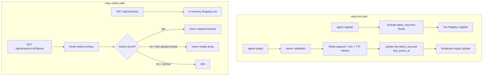

# feat: Persist relay retained history in Redis

## Overview

Move relay retained output history from in-process memory to Redis while keeping live session ownership in the relay process. The result should preserve the current live-only `GET /api/sessions` contract, allow `GET /api/sessions/:id/frames` replay for known `session_id` values for up to 24 hours after the last retained output, and survive both agent disconnects and relay restarts without turning the relay into a multi-instance coordination system.

## Problem Frame

Today the relay stores live ownership and retained frames in the same in-memory structure. `relay/registry.go` owns `liveSession`, and `relay/history.go` hangs retained `frames`, `frameBytes`, and `latestSeq` directly off that live entry. That shape matches the current live-only product boundary, but it prevents the new behavior defined in the origin requirements: live session listing must remain honest and live-only, while retained history must survive disconnects and relay restarts for 24 hours (see origin: `docs/brainstorms/2026-04-09-relay-redis-retained-history-requirements.md`).

The plan therefore needs to separate two responsibilities that are currently fused:

- live session routing, ownership validation, and `/api/sessions` listing
- retained frame storage, replay, TTL refresh, and restart continuity

## Requirements Trace

- R1-R4. `GET /api/sessions` remains a live-only view sourced from the running relay process, even across relay restarts and agent reconnects.
- R5-R10. Retained frames move to Redis, use a 24-hour refresh-on-write TTL, stay bounded, and do not introduce a new offline-session discovery API.
- R11-R18a. `/api/sessions/:id/frames` remains the replay path for a known `session_id`, including after disconnect or relay restart, with inclusive range semantics and monotonic `seq` continuity across reconnects.
- R19-R21. Retained history keeps an explicit oldest-first server-side bound rather than becoming an unbounded archive.
- R22-R26. Live ownership stays in-process, retained-history deletion is no longer coupled to disconnect, the relay stays content-opaque, Redis gets a supported Docker workflow, and missing Redis behavior becomes explicit.
- R27-R29. Core docs must distinguish live visibility from retained-history availability and stop describing retained history as live-only in-memory state.

## Scope Boundaries

- No Redis-backed live-session registry or multi-relay coordination.
- No API to enumerate recently offline sessions.
- No indefinite archive, transcript search, or retained input history.
- No change to the best-effort nature of `GET /api/updates/ws`.

## Context & Research

### Relevant Code and Patterns

- `relay/registry.go` is the current ownership boundary for live sessions, input routing, output acceptance, and `/api/sessions` snapshots.
- `relay/history.go` shows the exact behavior worth preserving where practical: append-only per-session output, monotonic `latestSeq`, inclusive replay filtering, and oldest-first trimming once the retained raw-byte budget is exceeded.
- `relay/server.go` is the ingress assembly point for `/agent/ws`, `/api/sessions`, and `/api/sessions/:id/frames`; it is where registration hydration, output append wiring, and offline replay semantics need to converge.
- `cmd/relay/main.go` and `cmd/relay/main_test.go` define the current relay configuration pattern: env-driven startup with a small `mainConfig` and fail-fast validation.
- `relay/registry_test.go` and `relay/server_test.go` already cover the important live-session invariants that must survive this change: stale-owner protection, global update fanout, inclusive frame ranges, and live/session removal semantics.
- `Makefile` is the only existing operator/developer entrypoint in the repo today, so local Redis lifecycle support should extend it rather than introducing a parallel workflow with no repo integration.

### Institutional Learnings

- No `docs/solutions/` learnings exist in this repository today.

### External References

- Official Redis Go client: `github.com/redis/go-redis/v9` is the official Redis client for Go and documents both direct option-based configuration and URL parsing, which fits this repo's Go 1.25 toolchain. Source: https://github.com/redis/go-redis
- Redis `EXPIRE` is an O(1) key-expiration primitive, which supports the required "refresh TTL on each new retained frame" behavior. Source: https://redis.io/docs/latest/commands/expire/
- Redis list commands line up with the current history shape: `RPUSH` appends, `LRANGE` returns inclusive ranges, and `LTRIM` supports bounded log-style retention. Sources: https://redis.io/docs/latest/commands/rpush/ , https://redis.io/docs/latest/commands/lrange/ , https://redis.io/docs/latest/commands/ltrim/
- `alicebob/miniredis/v2` is a pure-Go Redis test server with TTL fast-forwarding support, which keeps `go test ./...` viable without a required external Redis daemon. Source: https://github.com/alicebob/miniredis

## Key Technical Decisions

- Keep live state in memory and move only retained history to Redis: this satisfies R1-R4 and avoids introducing lease or heartbeat complexity the current single-relay scope does not need.
- Preserve the current queue-shaped history semantics in Redis: use a per-session Redis keyset that models append, oldest-first eviction, and inclusive replay directly, instead of forcing the design into Redis Streams or score-ordered secondary indexes.
- Keep the current `10 MiB` raw-output bound for v1 in addition to the new 24-hour TTL: the current code already enforces a raw-byte budget in `relay/history.go`, and carrying that forward avoids an accidental retention-shape change while the backend moves from memory to Redis.
- Hydrate `SessionInfo.latest_seq` from Redis during agent registration: this is required to satisfy R18a and prevents the same surviving `session_id` from appearing to reset after relay restart or reconnect.
- Require Redis at relay startup, but keep runtime live routing independent from Redis availability: startup should fail clearly if the relay cannot establish its retained-history dependency, while runtime Redis errors should degrade replay/remote continuity explicitly rather than terminating the live relay process.
- Use a single Redis URL env var for v1: `AGENTUNNEL_REDIS_URL` keeps the relay config surface small and maps directly to `go-redis` URL parsing.

## Open Questions

### Resolved During Planning

- Should live sessions move into Redis too? No. Live ownership remains in-process for this phase.
- Should offline sessions become discoverable through a new list API? No. Clients must already know the `session_id` to use offline replay.
- What retention bound should v1 keep? Preserve the current `10 MiB` raw-output budget per session and add a 24-hour refresh-on-write TTL.
- How should the relay load Redis config? Use a required `AGENTUNNEL_REDIS_URL` env var and fail startup if it is missing or unusable.
- How should Redis-backed store tests stay inside `go test ./...`? Use `github.com/alicebob/miniredis/v2` for deterministic store-level tests, with Docker reserved for local development and manual maintenance flows.

### Deferred to Implementation

- Whether the atomic append-plus-trim helper is clearer as a Lua script or as a small `WATCH`/transaction helper can be decided while editing, as long as the resulting behavior remains atomic at the session-history boundary.
- Exact runtime log event names for Redis read/write failures can stay flexible if they remain explicit, content-opaque, and test-covered.

## High-Level Technical Design

> *This illustrates the intended approach and is directional guidance for review, not implementation specification. The implementing agent should treat it as context, not code to reproduce.*

| Key | Type | Purpose |
|---|---|---|
| `agentunnel:history:{session_id}:frames` | Redis list | Serialized replay frames in ascending `seq` order |
| `agentunnel:history:{session_id}:sizes` | Redis list | Raw chunk byte sizes aligned with `frames` for byte-budget trimming |
| `agentunnel:history:{session_id}:meta` | Redis hash | `first_seq`, `latest_seq`, and `frame_bytes` |

The `{session_id}` hash tag is cheap to add now and keeps the per-session keyset co-located if a clustered deployment is ever explored later, without turning this phase into a cluster design.

## Alternative Approaches Considered

- Redis Streams: rejected because the current client-facing replay contract is keyed by relay-assigned `seq`, not stream IDs, and forcing stream IDs into that role would complicate reconnect continuity and `/frames?from=&to=` behavior.
- Sorted sets with `seq` as score: rejected for v1 because the current semantics are naturally queue-shaped, and exact raw-byte trimming still needs extra side bookkeeping even with score-ordered replay.
- Snapshot retained history to Redis only on disconnect: rejected because it would still lose history on relay crash/restart before disconnect handling runs and would keep retention correctness coupled to disconnect timing.

## Implementation Units

- [ ] **Unit 1: Introduce a Redis-backed retained-history store boundary**

**Goal:** Decouple retained frame storage from the live registry and add a Redis implementation that preserves append order, inclusive replay, TTL refresh, and oldest-first byte-budget trimming.

**Requirements:** R5-R9, R13-R21, R24

**Dependencies:** None

**Files:**
- Create: `relay/history_store.go`
- Create: `relay/history_store_redis.go`
- Create: `relay/history_store_redis_test.go`
- Modify: `relay/history.go`
- Modify: `go.mod`

**Approach:**
- Introduce a small retained-history store interface that exposes the three capabilities the relay actually needs: append output and receive the assigned `seq`, fetch retained frames by inclusive `seq` range, and fetch retained `latest_seq` during registration.
- Keep `relay/history.go` focused on shared frame serialization and replay-shape helpers (`outputFrameMessage` and any encode/decode helpers) so the HTTP and Redis layers share one representation.
- Implement the Redis store as a three-key per-session queue:
  - append serialized frame payloads to `frames`
  - append raw chunk sizes to `sizes`
  - update `meta.latest_seq`, `meta.first_seq`, and `meta.frame_bytes`
  - trim oldest entries while `frame_bytes > 10 MiB`
  - refresh `EXPIRE` on all three keys to `24h`
- Keep the stored frame payload shape aligned with `/api/sessions/:id/frames` (`seq`, `data_b64`, `cols`, `rows`, `ts`) so replay does not need a second translation layer.

**Execution note:** Start with store behavior tests before rewiring the live registry so the retained-history contract is fixed first.

**Patterns to follow:**
- `relay/history.go` current append-and-trim semantics
- `relay/registry_test.go` frame-range expectations
- `relay/server_test.go` replay-shape assertions

**Test scenarios:**
- Happy path: first append for a new `session_id` creates retained history with `seq=1`, stores one replay frame, and makes `LatestSeq(...)` return `1`.
- Happy path: subsequent appends increment `seq`, keep frame order stable, and refresh all session-history TTLs to 24 hours from the newest append.
- Edge case: `Frames(sessionID, from=0, to=0)` with no explicit range returns the full retained slice in ascending `seq` order.
- Edge case: `from` before `first_seq` and `to` after `latest_seq` clamps naturally to the retained range without error.
- Edge case: when retained raw bytes exceed `10 MiB`, the oldest frames are evicted first, `first_seq` advances, and `latest_seq` remains monotonic.
- Edge case: after simulated TTL expiry, retained keys disappear together and the store reports the session as not found.
- Error path: requesting frames for a session with no retained history returns a distinct not-found result rather than an empty slice.
- Integration: creating a new store instance against the same Redis state rehydrates the previous `latest_seq` and retained frames, simulating relay restart continuity.

**Verification:**
- The Redis store can fully replace the in-memory history slice without changing replay payload shape or inclusive range semantics.

- [ ] **Unit 2: Rewire relay live-session logic around the retained-history store**

**Goal:** Keep live session ownership in memory while sourcing replay and `latest_seq` continuity from the Redis-backed history store.

**Requirements:** R1-R4, R11-R18a, R22-R24

**Dependencies:** Unit 1

**Files:**
- Modify: `relay/registry.go`
- Modify: `relay/registry_test.go`
- Modify: `relay/server.go`
- Modify: `relay/server_test.go`

**Approach:**
- Remove retained `frames` and `frameBytes` from `liveSession`; the live registry should own only live routing state (`AgentPeer`, `SessionInfo`, owner replacement bookkeeping, and update sinks).
- Change registration flow in `relay/server.go` so the relay hydrates retained `latest_seq` from Redis before calling `Registry.Register(...)`.
- Replace the current in-memory append path with a store-backed append path:
  - validate that the connection still owns the live session
  - append the output to Redis and receive the assigned `seq`
  - update the live session snapshot's `LatestSeq` and `LastActiveAt`
  - broadcast the client update using the same `seq` and `ts`
- Update `/api/sessions/:id/frames` behavior to consult retained history first. If retained history exists, return it even when the session is offline. If retained history is absent but the session is still live, return `[]`. If neither retained history nor live session exists, return `404`.
- Preserve immediate live-session removal on disconnect and preserve `session_removed` fanout; only retained history should outlive disconnect.
- Keep stale-owner protection explicit so a replaced websocket cannot continue mutating retained history for that `session_id`.

**Patterns to follow:**
- `relay/registry.go` current stale-owner/session-replacement checks
- `relay/server.go` current register/output split
- `docs/protocol.md` current `latest_seq` and `/frames` contract

**Test scenarios:**
- Happy path: agent registration for a `session_id` with retained Redis history surfaces the stored `latest_seq` in `GET /api/sessions` immediately.
- Happy path: after agent disconnect, `GET /api/sessions` no longer lists the session but `GET /api/sessions/:id/frames` still returns retained frames while TTL remains active.
- Happy path: reconnecting the same `session_id` appends new output at `latest_seq + 1` rather than restarting at `1`.
- Edge case: a live session with no retained history returns an empty array from `/frames`.
- Edge case: a replaced agent websocket cannot append additional retained output once a new owner has taken over the same `session_id`.
- Error path: Redis read failure on `/frames` returns an explicit server error instead of pretending the session was never retained.
- Error path: Redis write failure on agent output does not advance live `latest_seq` and does not emit a client `output` update with a fabricated `seq`.
- Integration: runtime Redis failure leaves `/api/sessions` and client-input routing live for currently connected sessions, while replay and new remote output continuity degrade explicitly for the affected writes.
- Integration: constructing a fresh relay handler against surviving Redis state reproduces replay continuity after simulated relay restart.

**Verification:**
- Live session visibility and retained-history availability become distinct behaviors without breaking session replacement, input routing, or client update fanout.

- [ ] **Unit 3: Add relay Redis configuration and local Docker maintenance workflow**

**Goal:** Make Redis a first-class relay dependency with explicit startup validation and a repo-supported local development workflow.

**Requirements:** R25-R26

**Dependencies:** Unit 1

**Files:**
- Create: `compose.redis.yml`
- Modify: `cmd/relay/main.go`
- Modify: `cmd/relay/main_test.go`
- Modify: `Makefile`

**Approach:**
- Extend `mainConfig` with `RedisURL` and require `AGENTUNNEL_REDIS_URL` alongside the existing auth env vars.
- Build the Redis client during relay startup, issue an initial ping, and fail startup clearly if Redis configuration is missing or the dependency is unreachable.
- Inject the retained-history store into `relay.NewHandler(...)` rather than constructing it deep inside the handler, so tests can keep using fakes or miniredis-backed stores.
- Add a lightweight Docker Compose file using the official Redis image with a named volume so operators can restart the relay process without losing retained history during local testing.
- Extend `Makefile` with explicit Redis lifecycle targets such as `redis-up`, `redis-down`, and `redis-logs`; keep them separate from the existing relay start/stop targets so developers opt into Redis management intentionally.

**Patterns to follow:**
- `cmd/relay/main.go` current fail-fast env validation
- `cmd/relay/main_test.go` startup config tests
- `Makefile` current developer/operator target style

**Test scenarios:**
- Happy path: `loadMainConfig(...)` accepts a valid `AGENTUNNEL_REDIS_URL` and still respects the `--port` override.
- Error path: missing `AGENTUNNEL_REDIS_URL` fails config loading with a clear startup error.
- Error path: relay startup returns an error when Redis ping fails rather than starting in a misleading "persistent history enabled" posture.
- Test expectation: none -- `compose.redis.yml` and `Makefile` target additions are operational scaffolding rather than feature-bearing application behavior.

**Verification:**
- Relay startup becomes explicit about whether Redis-backed retained history is actually available, and local developers have one repo-native path to run Redis.

- [ ] **Unit 4: Align docs and regression coverage with the new live-versus-history boundary**

**Goal:** Update the user-facing and protocol-facing docs so they describe the new Redis-backed retained-history contract accurately and add regression coverage for the new boundary.

**Requirements:** R27-R29

**Dependencies:** Unit 2, Unit 3

**Files:**
- Modify: `README.md`
- Modify: `docs/architecture.md`
- Modify: `docs/protocol.md`
- Modify: `CLAUDE.md`
- Modify: `relay/server_test.go`
- Modify: `relay/registry_test.go`
- Modify: `cmd/relay/main_test.go`

**Approach:**
- Update product-level docs to distinguish:
  - live-only `/api/sessions`
  - best-effort live output on `/api/updates/ws`
  - retained replay on `/api/sessions/:id/frames` for up to 24 hours after the last retained output
- Remove wording that still claims retained history disappears immediately with live session removal or only exists in process memory.
- Document the new relay startup dependency and local Redis Docker workflow in `README.md`.
- Keep the docs explicit that offline replay requires a known `session_id`; no offline discovery API is introduced in this phase.
- Extend regression tests where needed so the repo proves the most important boundary changes, especially live-only listing versus offline replay continuity.

**Patterns to follow:**
- `docs/brainstorms/2026-04-06-relay-output-best-effort-requirements.md` style of precise boundary wording
- `docs/architecture.md` current responsibility split between relay and `agentunnel`
- Existing relay integration tests in `relay/server_test.go`

**Test scenarios:**
- Happy path: relay tests prove live-session removal and offline `/frames` replay can both be true for the same `session_id`.
- Happy path: relay tests prove `latest_seq` survives reconnect and relay reconstruction against existing retained history.
- Edge case: once retained-history TTL expires, `/frames` returns `404` for an offline session.
- Test expectation: none -- the documentation text changes themselves do not need separate automated tests beyond the behavior regressions above.

**Verification:**
- Readers and tests tell the same story: live sessions are ephemeral, retained replay lasts up to 24 hours, and the relay is still content-opaque and best-effort on the live output channel.

## System-Wide Impact

- **Interaction graph:** Agent output now crosses `relay/server.go` -> live owner validation -> retained-history store append -> live snapshot update -> client fanout; `/frames` decouples from the live registry and becomes a history-store read path with live fallback semantics.
- **Error propagation:** Redis write failures must not kill the local agent or the live relay process, but they must prevent fabricated replay metadata; Redis read failures on `/frames` should surface as explicit server errors, not as false "not found" results.
- **State lifecycle risks:** The three-key Redis session bucket must keep `frames`, `sizes`, and `meta` in sync; TTL refresh must apply uniformly; reconnect must not reset `latest_seq`; owner replacement must not allow stale sockets to append to the new live incarnation.
- **API surface parity:** `SessionInfo.latest_seq`, `/api/sessions/:id/frames`, and live `output` updates must keep sharing one sequence story. Docs and tests need to evolve together so clients can reason about reconnect and replay correctly.
- **Integration coverage:** Pure unit tests are not enough. The repo needs cross-layer coverage for register hydration, disconnect-versus-replay behavior, relay restart continuity, and TTL expiry semantics.
- **Unchanged invariants:** `GET /api/sessions` remains live-only, `GET /api/updates/ws` remains best-effort, the relay remains content-opaque, and this phase still does not add an offline discovery API or multi-relay coordination.

## Risks & Dependencies

| Risk | Mitigation |
|------|------------|
| Multi-key Redis session state drifts and breaks replay or trimming | Keep append/trim/expire semantics atomic at the per-session history boundary and cover the boundary with store behavior tests |
| `latest_seq` appears to reset after relay restart or reconnect | Hydrate retained `latest_seq` during registration and cover reconnect and relay-reconstruction paths in `relay/server_test.go` |
| Runtime Redis failures silently degrade remote continuity | Fail startup if Redis is unavailable initially, and add explicit runtime error logging plus docs that distinguish live routing from retained-history guarantees |
| Docker workflow and docs drift from actual relay config | Add config tests in `cmd/relay/main_test.go` and update `README.md`, `docs/architecture.md`, `docs/protocol.md`, and `CLAUDE.md` together |

## Documentation / Operational Notes

- `README.md` needs a new Redis setup section that shows the required `AGENTUNNEL_REDIS_URL` and the Docker maintenance flow.
- `docs/protocol.md` needs to stop saying replay is limited to still-live in-memory history and instead document the 24-hour retained-history window for known `session_id` values.
- `docs/architecture.md` and `CLAUDE.md` need to distinguish live registry responsibility from Redis-backed retained-history responsibility.
- The local Redis Compose setup should use a named volume so relay restart continuity is easy to verify manually without turning local development into a data-loss trap.

## Sources & References

- **Origin document:** [docs/brainstorms/2026-04-09-relay-redis-retained-history-requirements.md](docs/brainstorms/2026-04-09-relay-redis-retained-history-requirements.md)
- Related code: [relay/registry.go](relay/registry.go)
- Related code: [relay/history.go](relay/history.go)
- Related code: [relay/server.go](relay/server.go)
- Related code: [cmd/relay/main.go](cmd/relay/main.go)
- Related code: [Makefile](Makefile)
- Related tests: [relay/registry_test.go](relay/registry_test.go)
- Related tests: [relay/server_test.go](relay/server_test.go)
- Related tests: [cmd/relay/main_test.go](cmd/relay/main_test.go)
- External docs: https://github.com/redis/go-redis
- External docs: https://redis.io/docs/latest/commands/expire/
- External docs: https://redis.io/docs/latest/commands/rpush/
- External docs: https://redis.io/docs/latest/commands/lrange/
- External docs: https://redis.io/docs/latest/commands/ltrim/
- External docs: https://github.com/alicebob/miniredis
