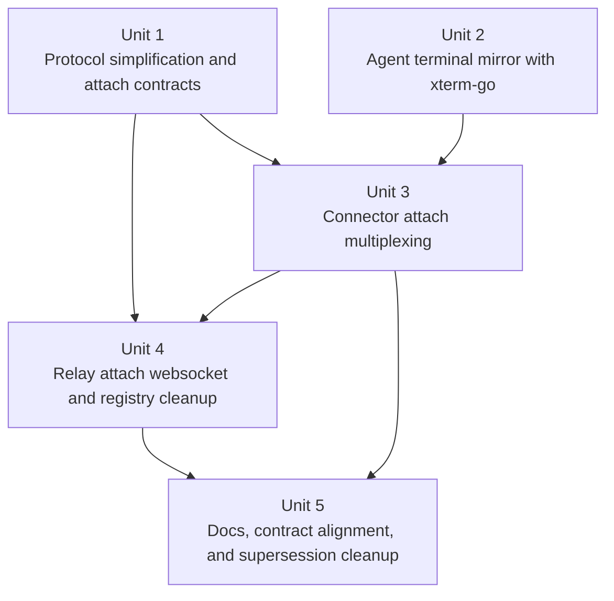

# feat: Replace frame replay with session attach terminal mirroring

## Overview

Replace the repository's frame-centric remote-output contract with a session-scoped attach model. In the new design, `tunnel` maintains a headless terminal mirror, serializes the current terminal state when a remote client attaches, and then streams subsequent raw PTY bytes live to that attached client. The relay remains responsible for auth, discovery, routing, and reconnect lifecycle, but it no longer exposes transcript/history APIs or a global live-output websocket.

This plan also picks a concrete fidelity strategy: use `github.com/gitpod-io/xterm-go` as the primary headless mirror engine, with a narrow local abstraction so the implementation can fall back to `@xterm/headless` only if real-world validation shows a correctness gap.

## Problem Frame

The current repository contract is deeply tied to replay frames:

- `protocol/message.go` defines `ReplayFrame`, `history_request`, `history_response`, `latest_seq`, and the client-facing `ClientUpdateMessage`
- `connector/connector.go` appends PTY output into an agent-side frame buffer and uploads `output` frames continuously
- `relay/server.go` exposes both `GET /api/updates/ws` and `GET /api/sessions/:id/frames`
- `README.md`, `docs/protocol.md`, `docs/architecture.md`, `CLAUDE.md`, and `AGENTS.md` all describe that frame/history contract

That is now the wrong product model. The user has explicitly rejected transcript/history semantics and wants the simpler, more terminal-native behavior:

- discover a live session
- attach to it
- reconstruct the current screen
- continue receiving live bytes
- send structured input back to the PTY owner

Once history is out of scope, the real hard problem becomes terminal-state fidelity, not frame retention or sequence numbering. That shifts the design center from replay buffers toward a trustworthy headless terminal mirror with gap-free snapshot handoff.

## Requirements Trace

- R1-R5. Keep stable per-process `session_id`, preserve `connected` / `reconnecting`, and close active attaches when the agent disappears.
- R6-R12. Replace replay/history APIs with a session-scoped attach websocket that delivers size, snapshot, and subsequent live bytes without a handoff gap.
- R13-R17. Make `tunnel` the authoritative headless mirror and choose a high-fidelity xterm-compatible implementation that restores current visible terminal state, not transcript history.
- R18-R21. Keep the relay content-opaque, preserve structured input ownership in `tunnel`, and remove replay-frame and global-output concepts from the product contract.
- R22-R24. Keep local-terminal-owned PTY size, relay-forwarded resize updates, and no history/scrollback/remote-resize expansion in this phase.

## Scope Boundaries

- No output-history API.
- No `ReplayFrame`, `seq`, `latest_seq`, or transcript replay semantics.
- No global live-output websocket contract.
- No mobile-driven PTY resize.
- No relay-side terminal emulation or shadow state.
- No durable archive or offline recovery.

## Context & Research

### Relevant Code and Patterns

- `cmd/agentunnel/main.go` already creates one stable `protocol.SessionInfo` per running process and should continue to own startup and reconnect posture.
- `session/hub.go` is already the PTY fanout and input-routing boundary. It is the right place to keep output fanout semantics, but its current single `OnResize` callback needs to become multi-subscriber.
- `session/local_terminal.go` already keeps the local terminal as the primary PTY-size authority; this should remain true.
- `connector/connector.go` is already the one outbound agent-to-relay transport. It is the right place to host attach multiplexing and per-client forwarding over `/agent/ws`.
- `relay/registry.go` already owns session identity, peer replacement, and reconnect grace state. It should keep that lifecycle role while dropping replay-specific bookkeeping.
- `relay/server.go` already owns auth and websocket upgrades. It should become the host for a new session-scoped attach websocket endpoint and should remove `/frames` and `/api/updates/ws`.
- Existing tests in `connector/connector_test.go`, `relay/server_test.go`, `relay/registry_test.go`, `protocol/relay_types_test.go`, and `session/hub_test.go` already pin most of the surfaces this change will replace.

### Institutional Learnings

- No `docs/solutions/` entries exist in this repository today.

### External References

- The official xterm.js README explicitly documents `@xterm/headless` as a Node.js package that can track terminal state where a process runs and use the serialize addon to restore state on reconnection.
- `github.com/gitpod-io/xterm-go` describes itself as a pure-Go headless terminal emulator ported from xterm.js, with alternate-buffer support, 24-bit color, a serialize addon for terminal state snapshots, and conformance tests against xterm.js golden data.
- `github.com/gitpod-io/xterm-go/conformance/README.md` makes xterm.js the correctness oracle: golden data is generated by `@xterm/headless`, and the Go port is expected to match it.
- Local module metadata strengthens the fit decision:
  - `github.com/gitpod-io/xterm-go@latest` resolves to `v0.0.0-20260408140746-46436f1050ee` dated 2026-04-08
  - `github.com/hinshun/vt10x@latest` resolves to a 2022 pseudo-version
  - `github.com/ActiveState/vt10x@latest` resolves to `v1.3.1` dated 2020-08-21

This is enough to make a clear planning choice: prefer `xterm-go` over older VT libraries, and avoid a Node sidecar unless validation proves it necessary.

## Key Technical Decisions

- Adopt `github.com/gitpod-io/xterm-go` as the primary headless terminal mirror.
  Rationale: it is Go-native, derived from xterm.js semantics, includes a serialize addon, handles alternate buffers and truecolor, and ships with xterm.js conformance tests. It fits this Go codebase much better than introducing a Node runtime by default.

- Introduce a narrow local mirror abstraction around the chosen engine.
  Rationale: this keeps the implementation flexible if real Claude/Codex traffic uncovers a fidelity bug that requires a fallback engine. The default implementation should still be `xterm-go`.

- Replace `/api/updates/ws` and `/api/sessions/:id/frames` with one session-scoped attach websocket, proposed as `GET /api/sessions/:id/attach/ws`.
  Rationale: once history is gone, the clean product surface is a direct attach to one session, not a global multiplexed live-output feed plus a replay recovery route.

- Keep `GET /api/sessions` as the discovery API and preserve `connected` / `reconnecting`.
  Rationale: clients still need a lightweight list/discovery surface and a reconnect-state signal before attempting an attach.

- Keep structured remote input (`input_text`, `input_key`) and do not regress to raw key bytes.
  Rationale: the repo already has a better mobile-oriented ownership split for input. This change is about output transport and snapshot fidelity, not about undoing input semantics.

- Use mixed transport on `/agent/ws`: JSON control messages plus client-routed binary data packets.
  Rationale: register, attach-open, attach-close, resize, and structured input are easier to express as JSON controls, while terminal bytes should remain raw bytes rather than base64-wrapped JSON payloads.

- Snapshot only the current visible terminal state by default.
  Rationale: the user explicitly said no history. The initial snapshot should exclude transcript-style scrollback and should be generated with serializer options that capture the visible terminal state only.

- Preserve local-terminal PTY size as the authority in this phase.
  Rationale: one PTY cannot satisfy conflicting local and remote dimensions simultaneously. Remote clients should follow resize events rather than compete for size ownership.

- Keep session discovery minimal and online-only.
  Rationale: the relay only needs to expose sessions that are currently online and attachable. Discovery does not need extra metadata beyond the session registration payload.

- Treat `reconnecting` as attach-unavailable and close existing attach sockets promptly on disconnect.
  Rationale: stale attaches are worse than explicit reconnect behavior. The client can rediscover state and obtain a fresh snapshot after the agent reconnects.

## Open Questions

### Resolved During Planning

- What is the right headless mirror choice for this codebase? Use `xterm-go` first, behind a small interface, with Node `@xterm/headless` reserved as a fallback only if validation fails.
- Does this phase still need history or replay endpoints? No. Remove them entirely from the product contract.
- Should remote output stay on a global websocket? No. Move to a session-scoped attach websocket.
- Should input semantics regress to raw bytes? No. Keep `input_text` and `input_key`.
- Who owns terminal dimensions? The local terminal in this phase.

### Deferred to Implementation

- The exact binary packet header used on `/agent/ws` for client-routed terminal bytes can be finalized during implementation as long as it is compact, test-covered, and clearly separate from JSON control frames.
- The exact close-code and close-reason mapping for `attach/ws` disconnects can be finalized during implementation.

## High-Level Technical Design

> *This illustrates intended structure and sequencing for review. It is directional guidance, not implementation specification.*

```mermaid
flowchart TB
    A[PTY output] --> B[session.Hub]
    B --> C[local terminal sink]
    B --> D[terminal mirror]

    D --> E[attach snapshot bytes]
    D --> F[live subscriber bytes]

    G[relay attach_open] --> H[connector attaches client under mirror lock]
    H --> E
    H --> F

    E --> I[/agent/ws binary packet]
    F --> I
    I --> J[relay routes to /api/sessions/:id/attach/ws]
    J --> K[mobile terminal emulator]

    L[mobile input_text or input_key] --> J
    J --> M[relay JSON control frame]
    M --> N[connector]
    N --> O[session.Hub input path]
    O --> P[PTY stdin]

    Q[agent disconnect] --> R[relay marks reconnecting]
    R --> S[relay closes active attach sockets]
    R --> T[session stays discoverable briefly]
```

## Implementation Units



- [ ] **Unit 1: Replace frame-centric protocol types with attach-oriented contracts**

**Goal:** Remove replay/history vocabulary from the shared protocol layer and define the control and routing shapes needed for session-scoped attach.

**Requirements:** R1-R12, R18-R21

**Dependencies:** None

**Files:**
- Modify: `protocol/message.go`
- Modify: `protocol/relay_types_test.go`
- Create: `protocol/attach_packet.go`
- Create: `protocol/attach_packet_test.go`

**Approach:**
- Remove `ReplayFrame`, `history_request`, `history_response`, `ClientUpdateMessage`, and `latest_seq` from the shared protocol surface.
- Keep `register` and `SessionInfo`, but trim `SessionInfo` down to fields still meaningful without history replay.
- Define JSON control-message helpers for:
  - session registration
  - attach open / attach close
  - attach resize
  - session-scoped structured input
- Define binary packet encode/decode helpers for client-routed terminal bytes on `/agent/ws`.
- Keep the control/data split explicit so terminal bytes remain raw bytes and control envelopes stay readable and testable.

**Execution note:** Start with failing protocol round-trip tests so the transport rewrite lands on a pinned contract instead of ad hoc structs.

**Patterns to follow:**
- `protocol/relay_types_test.go` for stable field names and wire-level round-trip coverage
- Current `protocol/message.go` helper style for small encoding/decoding constructors

**Test scenarios:**
- Happy path: a register frame still round-trips with stable `session_id`, launcher, cwd, and state fields.
- Happy path: an attach-open control frame round-trips with the session-scoped client identifier the relay issued.
- Happy path: a binary attach packet round-trips a client identifier plus raw terminal bytes without base64 encoding.
- Regression: no wire type still exposes `ReplayFrame`, `history_request`, `history_response`, `latest_seq`, or `ClientUpdateMessage`.
- Error path: malformed binary packet headers are rejected by protocol helpers.

**Verification:**
- The repo has one shared attach-oriented wire contract and no remaining shared replay-frame contract.

- [ ] **Unit 2: Add an xterm-go-backed terminal mirror with gap-free attach snapshots**

**Goal:** Give `tunnel` a high-fidelity headless terminal mirror that can serialize the current screen and fan out subsequent live bytes.

**Requirements:** R9-R17, R22-R23

**Dependencies:** None

**Files:**
- Modify: `go.mod`
- Modify: `go.sum`
- Modify: `session/hub.go`
- Modify: `session/hub_test.go`
- Create: `session/terminal_mirror.go`
- Create: `session/terminal_mirror_test.go`

**Approach:**
- Add `github.com/gitpod-io/xterm-go` as the primary mirror dependency.
- Create a `session`-level mirror abstraction whose first implementation wraps:
  - one `xterm.Terminal`
  - one `SerializeAddon`
  - one per-client live-byte subscriber registry
- Feed every PTY output chunk into the mirror before any attach fanout.
- Implement `Attach()` as one atomic critical section:
  - lock mirror state
  - serialize the current visible terminal state with no scrollback history
  - capture current terminal size
  - register the live-byte subscriber
  - unlock
- Generalize resize subscriptions in `session.Hub` so both the status line and the mirror can observe PTY size changes without overwriting one another.
- Emit resize notifications to attached clients whenever the PTY size changes.

**Execution note:** Start with mirror round-trip tests that prove snapshot bytes can reconstruct the same xterm-go state in a fresh terminal.

**Patterns to follow:**
- `session/hub.go` output fanout and size tracking
- `session/local_terminal.go` current PTY size ownership model

**Test scenarios:**
- Happy path: plain visible-screen content serializes and replays into a fresh mirror with identical cursor position and visible text.
- Happy path: alternate-buffer content serializes and replays with alternate-buffer state intact.
- Happy path: truecolor and style attributes survive snapshot round-trip.
- Happy path: wide characters survive snapshot round-trip.
- Happy path: cursor-hidden state survives snapshot round-trip.
- Edge case: snapshot serialization excludes transcript-style scrollback and restores only the current visible state.
- Edge case: attach plus immediate subsequent PTY output yields no byte gap between snapshot boundary and live stream.
- Edge case: resize notifications reach more than one `session.Hub` subscriber.

**Verification:**
- `tunnel` gains a trustworthy current-state mirror and no longer needs a hand-built ANSI screen serializer.

- [ ] **Unit 3: Refactor the connector into an attach multiplexer instead of a continuous output uploader**

**Goal:** Make the connector own attach lifecycle, mirror-backed snapshot delivery, and per-client live-byte forwarding.

**Requirements:** R1-R12, R18-R23

**Dependencies:** Unit 1, Unit 2

**Files:**
- Modify: `connector/connector.go`
- Modify: `connector/connector_test.go`
- Modify: `cmd/agentunnel/main.go`
- Modify: `cmd/agentunnel/main_test.go`
- Delete: `session/history_buffer.go`
- Delete: `session/history_buffer_test.go`

**Approach:**
- Remove the continuous replay/output upload model from `connector.WriteOutput`.
- Keep `WriteOutput` responsible for:
  - updating the local terminal mirror
  - forwarding live bytes only to currently attached remote clients
- Teach the connector to process new relay controls:
  - `attach_open`
  - `attach_close`
  - session-scoped `input_text`
  - session-scoped `input_key`
- When an attach opens, ask the mirror for an atomic size + snapshot + live subscriber, send initial resize control, then send snapshot bytes, then begin streaming live packets for that client.
- Maintain per-client buffered queues and drop slow attaches rather than allowing one stalled client to block PTY progress or other attaches.
- Preserve existing reconnect/session-id behavior across relay reconnects for the owning process.

**Execution note:** Start with failing connector tests for attach-open snapshot delivery, multi-client live fanout, and no-output-upload-without-attach behavior.

**Patterns to follow:**
- `connector/connector.go` as the single relay transport boundary
- Existing reconnect/session-id continuity tests in `connector/connector_test.go`

**Test scenarios:**
- Happy path: opening an attach yields one resize control followed by snapshot bytes.
- Happy path: live PTY bytes after attach are forwarded as client-routed binary packets.
- Happy path: two attached clients receive the same live PTY bytes independently.
- Edge case: when no remote clients are attached, PTY output updates the mirror but does not upload terminal bytes to the relay.
- Edge case: a slow attached client is dropped without blocking PTY output or other clients.
- Edge case: relay reconnect preserves the same `session_id`, and later attach-open still produces a current-state snapshot.
- Error path: malformed or unknown relay control frames do not break the connector loop.

**Verification:**
- The connector becomes an attach/session transport instead of a replay-history uploader.

- [ ] **Unit 4: Replace relay output/history endpoints with session-scoped attach routing**

**Goal:** Make the relay route attach clients to the owning agent session and remove replay/global-output infrastructure.

**Requirements:** R3-R12, R18-R24

**Dependencies:** Unit 1, Unit 3

**Files:**
- Modify: `relay/registry.go`
- Modify: `relay/registry_test.go`
- Modify: `relay/server.go`
- Modify: `relay/server_test.go`
- Delete: `relay/client_updates.go`
- Delete: `relay/client_update_ws.go`

**Approach:**
- Keep `relay/registry.go` focused on:
  - live session snapshots
  - owner peer replacement
  - online-only discovery
  - attached-client bookkeeping
- Add `GET /api/sessions/:id/attach/ws` as the client-facing attach websocket.
- Remove `GET /api/updates/ws` and `GET /api/sessions/:id/frames`.
- On attach upgrade:
  - validate auth
  - verify the session exists and is currently `connected`
  - allocate a relay-scoped client identifier
  - register the client sink
  - send `attach_open` to the agent peer
- Route agent binary data packets to the matching attach sink without interpreting terminal bytes.
- Route agent JSON resize and attach lifecycle controls appropriately.
- Forward session-scoped structured input from the attach websocket to the owning agent peer.
- On agent disconnect, move the session to `reconnecting` and close any active attach sockets for that session promptly.

**Execution note:** Start with failing relay tests that exercise attach happy path, reconnecting rejection, attach-close-on-disconnect, and removal of the old endpoints.

**Patterns to follow:**
- `relay/server.go` current auth and websocket-upgrade structure
- `relay/registry.go` current owner validation and reconnect grace logic
- `relay/server_test.go` current HTTP/WebSocket contract testing style

**Test scenarios:**
- Happy path: authenticated `GET /api/sessions/:id/attach/ws` upgrades successfully for a connected session and receives resize plus snapshot data.
- Happy path: client `input_text` and `input_key` on the attach websocket are forwarded to the owning agent session.
- Happy path: agent live terminal bytes are routed only to the matching attach sink.
- Edge case: opening a second attach to the same session succeeds and receives its own snapshot.
- Error path: unknown session attach returns `404`.
- Error path: reconnecting session attach returns `409`.
- Error path: unauthenticated attach still returns `401`.
- Error path: agent disconnect closes active attach sockets promptly with an explicit reconnecting/session-gone reason.
- Regression: `/api/updates/ws` and `/api/sessions/:id/frames` are no longer exposed.

**Verification:**
- The relay becomes a discovery-and-attach broker instead of a replay broker or global-output fanout service.

- [ ] **Unit 5: Align docs, tests, and planning artifacts with the no-history attach model**

**Goal:** Make repository docs and contract tests describe one coherent attach-based product surface and retire the now-wrong replay plan.

**Requirements:** R1-R24

**Dependencies:** Unit 1, Unit 3, Unit 4

**Files:**
- Modify: `README.md`
- Modify: `docs/protocol.md`
- Modify: `docs/architecture.md`
- Modify: `CLAUDE.md`
- Modify: `AGENTS.md`
- Modify: `docs/plans/2026-04-09-001-feat-agent-side-session-history-plan.md`
- Modify: `protocol/relay_types_test.go`
- Modify: `connector/connector_test.go`
- Modify: `relay/server_test.go`
- Modify: `relay/registry_test.go`

**Approach:**
- Rewrite docs to describe:
  - discovery via `GET /api/sessions`
  - session-scoped attach via websocket
  - current-screen snapshot plus live bytes
  - reconnecting sessions as temporarily discoverable but unattached
  - no history API and no replay metadata
- Remove any wording that still claims:
  - retained replay frames
  - `latest_seq`
  - `/api/sessions/:id/frames`
  - `/api/updates/ws`
  - replay recovery after reconnect
- Mark `docs/plans/2026-04-09-001-feat-agent-side-session-history-plan.md` as superseded so the repo does not carry two conflicting active plans for the same product area.
- Keep contract tests aligned with the new endpoint surface and message vocabulary.

**Patterns to follow:**
- Documentation alignment expectations in `CLAUDE.md`
- Existing contract-style tests in `protocol/relay_types_test.go` and `relay/server_test.go`

**Test scenarios:**
- Happy path: session snapshot JSON still includes stable discovery fields.
- Regression: no test or doc text still references `/api/sessions/:id/frames`, `/api/updates/ws`, `ReplayFrame`, `history_request`, or `latest_seq`.
- Regression: docs and tests agree that reconnect means fresh attach plus fresh snapshot, not transcript replay.
- Regression: the superseded plan is no longer marked active.

**Verification:**
- Code, docs, and planning artifacts all describe one attach-based product surface instead of two conflicting replay models.

## System-Wide Impact

- **Output topology:** PTY output is no longer uploaded continuously to the relay by default; instead, it is mirrored locally and forwarded remotely only when attach clients exist.
- **Protocol shape:** The shared contract shifts from replay/history/control-envelopes plus global updates to session-scoped attach control plus raw client-routed data packets.
- **State ownership:** Terminal-state authority moves decisively to the agent-side mirror; the relay tracks discovery and lifecycle only.
- **Client behavior:** Reconnect strategy changes from "catch up on missed frames" to "reattach and restore current state."
- **UI/UX boundary:** Remote clients lose transcript recovery by design but gain a cleaner current-state attach model.

## Alternative Approaches Considered

- Keep `xterm-go` out and hand-roll a serializer over `vt10x` state: rejected because it reinvents the hardest part of the problem and creates a large correctness burden around alternate buffers, wide glyphs, modes, and style diffs.
- Use `@xterm/headless` in a Node sidecar as the default mirror: rejected for this phase because it adds a second runtime, IPC, and operational complexity to a Go CLI when a recent Go-native xterm-compatible option now exists.
- Keep the global live-output websocket and only swap out `/frames`: rejected because it preserves the wrong product model and keeps session output multiplexed globally when the product now wants a session attach.
- Retain `/api/sessions/:id/frames` but return a one-element "snapshot frame": rejected because it keeps history vocabulary and framing overhead for a product that no longer wants history at all.

## Risks & Dependencies

| Risk | Mitigation |
|------|------------|
| `xterm-go` still diverges from real Claude/Codex traffic despite xterm.js conformance | Hide the engine behind a narrow mirror interface, add repo-specific golden/round-trip tests, and keep `@xterm/headless` as an implementation fallback rather than rewriting the transport |
| Snapshot/live handoff drops a byte under concurrent output | Make mirror attach atomic: snapshot + subscriber registration happen under one lock |
| Slow remote clients back up the agent or relay | Use per-client buffered queues and drop slow attaches explicitly |
| PTY size state drifts between local terminal, mirror, and remote clients | Centralize size ownership in `session.Hub` and fan out resize notifications to all subscribers |
| The repo ends up carrying two contradictory plans | Mark `docs/plans/2026-04-09-001-feat-agent-side-session-history-plan.md` as superseded in the same documentation change |

## Documentation / Operational Notes

- The docs should explicitly say that reconnect behavior is "reattach and restore current state," not transcript recovery.
- The docs should also say that the local terminal remains the most complete and authoritative live view.
- Remote attach sockets should be treated as session-scoped foreground channels; discovery continues through `GET /api/sessions`.
- Online presence now matters more than sequence counters; any stale `seq` terminology should be removed rather than repurposed.

## Sources & References

- **Origin document:** `docs/brainstorms/2026-04-09-session-attach-terminal-mirror-requirements.md`
- Related code: `cmd/agentunnel/main.go`
- Related code: `session/hub.go`
- Related code: `session/local_terminal.go`
- Related code: `connector/connector.go`
- Related code: `relay/registry.go`
- Related code: `relay/server.go`
- Related code: `protocol/message.go`
- Superseded prior plan: `docs/plans/2026-04-09-001-feat-agent-side-session-history-plan.md`
- Related prior plan: `docs/plans/2026-04-06-002-feat-relay-startup-reconnect-plan.md`
- External reference: https://github.com/xtermjs/xterm.js
- External reference: https://github.com/gitpod-io/xterm-go
- External reference: https://github.com/gitpod-io/xterm-go/blob/main/conformance/README.md
