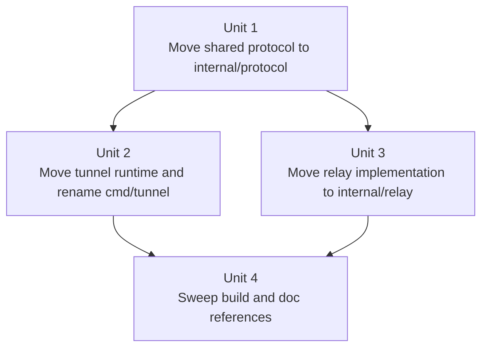

# refactor: Reorganize repo layout around tunnel and relay

## Overview

Reorganize the repository so the code layout matches the product layout: `cmd/tunnel` and `cmd/relay` remain the executable entrypoints, while implementation packages move under `internal/tunnel/`, `internal/relay/`, and `internal/protocol/`.

This is a structural refactor only. It should improve boundary clarity, reduce root-level package sprawl, and keep the repo easier to navigate without changing runtime behavior, protocol semantics, binary names, or product scope.

## Problem Frame

Before this refactor, the repo layout hid the fact that this is really two products with one shared protocol:

- the `tunnel` runtime is split across top-level `connector/`, `launcher/`, and `session/`
- the relay server lives in top-level `relay/`
- shared wire types live in top-level `protocol/`
- the CLI source entrypoint sat in `cmd/agentunnel/` even though the shipped binary name is `tunnel`

That makes the root read like a bucket of Go packages rather than one repo with two primary surfaces. The origin requirements document calls for a conservative fix: keep one module, keep `cmd/`, move implementation under `internal/`, and stop there (see origin: `docs/brainstorms/2026-04-11-repo-layout-restructure-requirements.md`).

## Requirements Trace

- R1-R7. Move executable and implementation code into the target `cmd/` plus `internal/` layout while keeping the repo single-module.
- R8-R11. Make `tunnel` and `relay` the visible ownership boundaries and keep non-Go assets at the repo root.
- R12-R15. Preserve runtime behavior, protocol behavior, binary names, and the current attach-based product contract.
- R16-R23. Update imports, build entrypoints, and living docs consistently, with the first pass limited to structural movement plus path cleanup.

## Scope Boundaries

- No auth redesign.
- No protocol redesign.
- No multi-module split.
- No rename of the public binaries away from `tunnel` and `relay`.
- No reorganization of `docs/`, `deploy/`, or `scripts/` beyond keeping them where they are.
- No second-wave package architecture cleanup unless the straight move reveals a concrete problem that blocks the restructure.

## Context & Research

### Relevant Code and Patterns

- `Makefile` now builds `tunnel` from `./cmd/tunnel` and `relay` from `./cmd/relay`.
- `cmd/tunnel/main.go` imports `internal/tunnel/connector`, `internal/tunnel/launcher`, `internal/tunnel/session`, and `internal/protocol`, which confirms those packages are the CLI runtime cluster.
- `cmd/relay/main.go` imports only `internal/relay`, which confirms that the relay remains one cohesive server package from the entrypoint's perspective.
- `internal/protocol/` is the only shared Go package imported by both product surfaces.
- `docs/architecture.md` already presents the repo as two product surfaces plus one shared protocol, which matches the intended target layout.
- `docs/tui-attach-flow.md`, `AGENTS.md`, and `CLAUDE.md` contain hard-coded source-path references that will need to move with the code rather than being left behind.

### Institutional Learnings

- No `docs/solutions/` entries exist in this repository today.

### External References

- None needed. This is a repo-internal layout refactor, and the current import graph plus existing docs provide enough grounding.

## Key Technical Decisions

- Use one root `internal/` tree with three children: `internal/tunnel/`, `internal/relay/`, and `internal/protocol/`.
  Rationale: this preserves one shared internal protocol package that both product surfaces can import without inventing a second shared package layer.

- Rename the CLI source entrypoint from `cmd/agentunnel/` to `cmd/tunnel/`, but keep the built binary name `tunnel`.
  Rationale: source layout should match the shipped product name, while user-facing commands remain unchanged.

- Preserve current package names while changing only directory locations and import paths.
  Rationale: keeping `package connector`, `package session`, `package relay`, and `package protocol` avoids unnecessary identifier churn and keeps the move mechanical.

- Sequence the work as protocol first, then tunnel packages, then relay packages, then docs/reference cleanup.
  Rationale: `protocol` is the only shared leaf package, so moving it first reduces later ambiguity. The docs sweep belongs last so it can point at the final paths once.

- Keep `internal/relay/` flat in this first pass.
  Rationale: the goal here is layout clarity, not a second refactor that also redesigns relay package boundaries.

- Update living docs and active reference documents in the same change, but leave historical origin context intact where a document is clearly describing the pre-refactor state.
  Rationale: operational and architectural docs should not mislead implementers, but historical requirements context should not be rewritten into something it was not.

## Open Questions

### Resolved During Planning

- Should shared protocol code remain top-level? No. Move it to `internal/protocol/`.
- Should package declarations be renamed as part of the move? No. Keep package names stable and change only paths.
- Should `docs/`, `deploy/`, and `scripts/` move in this pass? No. Keep non-Go assets at the repo root.
- Should `internal/relay/` be broken into more subpackages now? No. Keep it flat unless the move itself exposes a concrete problem.

### Deferred to Implementation

- The exact file-move order inside each package cluster can be finalized during execution to keep diffs readable and preserve a buildable tree as much as practical.
- A final repo-wide reference sweep may uncover a small number of additional living-doc path references beyond the ones already identified; those should be folded into the last cleanup unit instead of forcing a separate follow-up.

## High-Level Technical Design

> *This illustrates the intended approach and is directional guidance for review, not implementation specification. The implementing agent should treat it as context, not code to reproduce.*

## Implementation Units

- [x] **Unit 1: Move shared wire contracts into `internal/protocol/`**

**Goal:** Establish the shared internal package root before moving either product-specific package cluster.

**Requirements:** R1-R7, R9, R16-R17, R20-R23

**Dependencies:** None

**Files:**
- Move: `protocol/message.go` -> `internal/protocol/message.go`
- Move: `protocol/message_test.go` -> `internal/protocol/message_test.go`
- Move: `protocol/attach_packet.go` -> `internal/protocol/attach_packet.go`
- Move: `protocol/attach_packet_test.go` -> `internal/protocol/attach_packet_test.go`
- Modify: `cmd/tunnel/main.go`
- Modify: `cmd/tunnel/main_test.go`
- Modify: `internal/tunnel/connector/connector.go`
- Modify: `internal/tunnel/connector/connector_test.go`
- Modify: `internal/relay/attach_client_ws.go`
- Modify: `internal/relay/registry.go`
- Modify: `internal/relay/registry_test.go`
- Modify: `internal/relay/server.go`
- Modify: `internal/relay/server_test.go`
- Modify: `Makefile`

**Approach:**
- Move the shared protocol files as-is into `internal/protocol/`.
- Keep the package declaration as `package protocol` so only import paths change.
- Update every current importer to point at `yuanbohan/tunnel/internal/protocol`.
- Update any build/test path references that explicitly name `./protocol` so the repo remains coherent after the move.

**Patterns to follow:**
- Current helper/test colocation pattern in `internal/protocol/`
- Existing import style in `cmd/tunnel/main.go`, `internal/tunnel/connector/connector.go`, and `internal/relay/server.go`

**Test scenarios:**
- Happy path: `internal/protocol/message_test.go` still proves the JSON control-message helpers round-trip without field-name drift.
- Happy path: `internal/protocol/attach_packet_test.go` still proves binary packet encoding and client-id validation behave exactly as before the move.
- Integration: the existing `tunnel` and `relay` code compiles against `internal/protocol` without introducing an import cycle.
- Error path: invalid attach-packet input continues to fail with the same protocol-level validation behavior after the path move.

**Verification:**
- The only shared protocol package lives at `internal/protocol/`, and no build or test target still depends on top-level `protocol/`.

- [x] **Unit 2: Move the `tunnel` runtime under `internal/tunnel/` and rename the source entrypoint**

**Goal:** Rehome the CLI runtime packages under one product boundary and align the source entrypoint path with the shipped binary name.

**Requirements:** R1-R5, R8-R14, R16-R17, R20-R23

**Dependencies:** Unit 1

**Files:**
- Move: `connector/connector.go` -> `internal/tunnel/connector/connector.go`
- Move: `connector/connector_test.go` -> `internal/tunnel/connector/connector_test.go`
- Move: `launcher/registry.go` -> `internal/tunnel/launcher/registry.go`
- Move: `launcher/registry_test.go` -> `internal/tunnel/launcher/registry_test.go`
- Move: `session/hub.go` -> `internal/tunnel/session/hub.go`
- Move: `session/hub_test.go` -> `internal/tunnel/session/hub_test.go`
- Move: `session/local_terminal.go` -> `internal/tunnel/session/local_terminal.go`
- Move: `session/local_terminal_test.go` -> `internal/tunnel/session/local_terminal_test.go`
- Move: `session/local_terminal_wait_darwin.go` -> `internal/tunnel/session/local_terminal_wait_darwin.go`
- Move: `session/local_terminal_wait_poll.go` -> `internal/tunnel/session/local_terminal_wait_poll.go`
- Move: `session/local_terminal_wait_test.go` -> `internal/tunnel/session/local_terminal_wait_test.go`
- Move: `session/process.go` -> `internal/tunnel/session/process.go`
- Move: `session/process_test.go` -> `internal/tunnel/session/process_test.go`
- Move: `session/remote_input.go` -> `internal/tunnel/session/remote_input.go`
- Move: `session/remote_input_test.go` -> `internal/tunnel/session/remote_input_test.go`
- Move: `session/status_line.go` -> `internal/tunnel/session/status_line.go`
- Move: `session/status_line_test.go` -> `internal/tunnel/session/status_line_test.go`
- Move: `session/terminal_mirror.go` -> `internal/tunnel/session/terminal_mirror.go`
- Move: `session/terminal_mirror_test.go` -> `internal/tunnel/session/terminal_mirror_test.go`
- Move: `session/test_helpers_test.go` -> `internal/tunnel/session/test_helpers_test.go`
- Move: `cmd/agentunnel/args.go` -> `cmd/tunnel/args.go`
- Move: `cmd/agentunnel/args_test.go` -> `cmd/tunnel/args_test.go`
- Move: `cmd/agentunnel/main.go` -> `cmd/tunnel/main.go`
- Move: `cmd/agentunnel/main_test.go` -> `cmd/tunnel/main_test.go`
- Modify: `Makefile`

**Approach:**
- Move the CLI runtime packages into `internal/tunnel/` as straight path changes, keeping package names unchanged.
- Rename `cmd/agentunnel/` to `cmd/tunnel/` so the source tree matches the `tunnel` binary name.
- Update internal imports among `cmd/tunnel`, `internal/tunnel/connector`, `internal/tunnel/launcher`, `internal/tunnel/session`, and `internal/protocol`.
- Keep flags, environment variables, startup banners, and runtime behavior unchanged; this unit is about ownership clarity, not CLI semantics.
- Update the build path that points at the tunnel entrypoint so the normal binary output remains `bin/tunnel`.

**Patterns to follow:**
- Current behavior locks in `cmd/tunnel/args_test.go` and `cmd/tunnel/main_test.go`
- Existing package-local test placement in `connector/`, `launcher/`, and `session/`

**Test scenarios:**
- Happy path: the moved `cmd/tunnel/args_test.go` still proves the CLI accepts the same flags and rejects the same invalid relay-address inputs.
- Happy path: the moved `cmd/tunnel/main_test.go` still proves startup-session metadata, launcher selection, and startup banner behavior are unchanged.
- Happy path: the moved `internal/tunnel/connector/connector_test.go` still proves relay registration, reconnect continuity, and attach routing behavior remain intact.
- Happy path: the moved `internal/tunnel/session/terminal_mirror_test.go` and related session tests still prove PTY fanout, resize tracking, and snapshot behavior are unchanged after the move.
- Integration: the `cmd/tunnel` package can import `internal/tunnel/...` and `internal/protocol` cleanly with no import cycles and no top-level `connector/`, `launcher/`, or `session/` package dependencies left behind.

**Verification:**
- The `tunnel` runtime code lives under `cmd/tunnel/` and `internal/tunnel/`, and user-facing CLI behavior remains unchanged.

- [x] **Unit 3: Move relay server code under `internal/relay/`**

**Goal:** Rehome the relay implementation under its own product boundary while keeping the server behavior and entrypoint semantics unchanged.

**Requirements:** R1, R3-R5, R8-R15, R16-R17, R20-R23

**Dependencies:** Unit 1

**Files:**
- Move: `relay/attach_client_ws.go` -> `internal/relay/attach_client_ws.go`
- Move: `relay/auth.go` -> `internal/relay/auth.go`
- Move: `relay/http_logging.go` -> `internal/relay/http_logging.go`
- Move: `relay/logger.go` -> `internal/relay/logger.go`
- Move: `relay/logger_test.go` -> `internal/relay/logger_test.go`
- Move: `relay/registry.go` -> `internal/relay/registry.go`
- Move: `relay/registry_test.go` -> `internal/relay/registry_test.go`
- Move: `relay/server.go` -> `internal/relay/server.go`
- Move: `relay/server_test.go` -> `internal/relay/server_test.go`
- Move: `relay/ws_logging.go` -> `internal/relay/ws_logging.go`
- Modify: `cmd/relay/main.go`
- Modify: `cmd/relay/main_test.go`
- Modify: `Makefile`

**Approach:**
- Move the relay implementation files into `internal/relay/` with the existing flat package shape intact.
- Keep the package declaration as `package relay` so `cmd/relay` only needs an import-path update.
- Update imports to use `internal/relay` and the already-moved `internal/protocol`.
- Keep CLI flags, listen behavior, auth behavior, and attach transport behavior unchanged; the purpose is path clarity, not server redesign.
- Update the relay package path in build/test targets once the move is complete.

**Patterns to follow:**
- Current `cmd/relay/main.go` plus `cmd/relay/main_test.go` for entrypoint expectations
- Existing flat-file organization inside the current `relay/` package

**Test scenarios:**
- Happy path: the moved `internal/relay/server_test.go` still proves the authenticated session list, attach websocket upgrade, and attach lifecycle behavior remain unchanged.
- Happy path: the moved `internal/relay/registry_test.go` still proves session registration, replacement, and disconnect handling remain unchanged.
- Happy path: the moved `internal/relay/logger_test.go` still proves structured logging output is stable after the path move.
- Happy path: `cmd/relay/main_test.go` still proves config loading and server startup wiring remain unchanged.
- Integration: `cmd/relay` imports only `internal/relay` plus standard-library dependencies, and no top-level `relay/` package remains in the active build graph.

**Verification:**
- The relay implementation lives under `internal/relay/`, and the relay server still presents the same runtime behavior and entrypoint surface.

- [x] **Unit 4: Sweep living docs, active reference docs, and stale source-path mentions**

**Goal:** Finish the restructure by updating the repo's living documentation and active planning references so they point at the new layout instead of the old root-level package sprawl.

**Requirements:** R11, R14-R20, R22-R23

**Dependencies:** Unit 2, Unit 3

**Files:**
- Modify: `Makefile`
- Modify: `README.md`
- Modify: `AGENTS.md`
- Modify: `CLAUDE.md`
- Modify: `docs/architecture.md`
- Modify: `docs/tui-attach-flow.md`
- Modify: `docs/plans/2026-04-09-002-feat-session-attach-terminal-mirror-plan.md`
- Modify: `docs/plans/2026-04-10-001-refactor-attach-server-audit-plan.md`
- Modify: `docs/plans/2026-04-11-001-refactor-tunnel-relay-layout-plan.md`

**Approach:**
- Update all living operational and architectural docs so they reference `cmd/tunnel`, `internal/tunnel/...`, `internal/relay/...`, and `internal/protocol/...` where applicable.
- Update active reference plans that still function as code-navigation documents so their file paths do not send a future implementer to deleted locations.
- Keep historical requirements context intact where a document is clearly describing the pre-refactor state rather than instructing future work.
- Finish the repo sweep by removing stale `cmd/agentunnel` and top-level package references from build comments, package-map sections, and source-path annotations.

**Patterns to follow:**
- Existing package-map sections in `AGENTS.md`, `CLAUDE.md`, and `docs/architecture.md`
- Existing source-reference style in `docs/tui-attach-flow.md` and the active plan docs

**Test scenarios:**
- Test expectation: none -- this unit is a documentation and reference-alignment sweep rather than a behavioral code change.

**Verification:**
- Living docs and active reference documents point at the new layout, and a repo-wide source-path review no longer presents `cmd/agentunnel` or the old top-level implementation package paths as current locations.

## System-Wide Impact

- **Interaction graph:** the import graph becomes `cmd/tunnel -> internal/tunnel/... -> internal/protocol` and `cmd/relay -> internal/relay -> internal/protocol`, which makes the shared seam explicit and the product-specific seams private.
- **Error propagation:** the main failure mode is compile-time or doc-drift breakage from missed path updates, not runtime state corruption or protocol regressions.
- **State lifecycle risks:** there is no persistent data migration here; the main lifecycle risk is leaving orphaned files, stale tests, or stale package references after the move.
- **API surface parity:** binary names, CLI flags, environment variables, websocket routes, protocol field names, and attach semantics must remain unchanged.
- **Integration coverage:** the moved `cmd/tunnel`, `cmd/relay`, `internal/tunnel/connector`, `internal/tunnel/session`, `internal/relay`, and `internal/protocol` tests together should continue to prove behavior neutrality after the move.
- **Unchanged invariants:** the attach-based relay contract, session lifecycle semantics, user-facing commands, and deployment model remain exactly as they are today; only source layout and internal import paths change.

## Risks & Dependencies

| Risk | Mitigation |
|------|------------|
| A partial move leaves stale import paths or broken build targets behind | Sequence the refactor by shared leaf first, then product clusters, and update `Makefile` alongside each package move instead of deferring all build-path fixes to the end |
| `internal/` visibility is applied at the wrong level and blocks intended imports | Use one root `internal/` directory rather than product-local `internal/` directories so both `cmd/tunnel` and `cmd/relay` can legally import `internal/protocol` |
| The path rename from `cmd/agentunnel` to `cmd/tunnel` leaks into user-facing behavior accidentally | Keep package names, binary names, flags, and env vars unchanged, and rely on the existing `cmd/tunnel` tests to pin CLI behavior |
| Living docs and active plan docs continue sending contributors to deleted paths | Reserve a final documentation/reference sweep and include the known source-reference documents in the same change |

## Documentation / Operational Notes

- `README.md`, `AGENTS.md`, `CLAUDE.md`, `docs/architecture.md`, and `docs/tui-attach-flow.md` should be updated in the same refactor because they actively describe the code layout.
- Active plan documents that still contain direct code-file references should be updated when those references would otherwise point at deleted paths.
- This restructure should be kept separate from the deferred auth work now parked under `temp/brainstorms/`.

## Sources & References

- **Origin document:** `docs/brainstorms/2026-04-11-repo-layout-restructure-requirements.md`
- Related code: `Makefile`
- Related code: `cmd/tunnel/main.go`
- Related code: `cmd/relay/main.go`
- Related code: `docs/architecture.md`
- Related code: `docs/tui-attach-flow.md`
