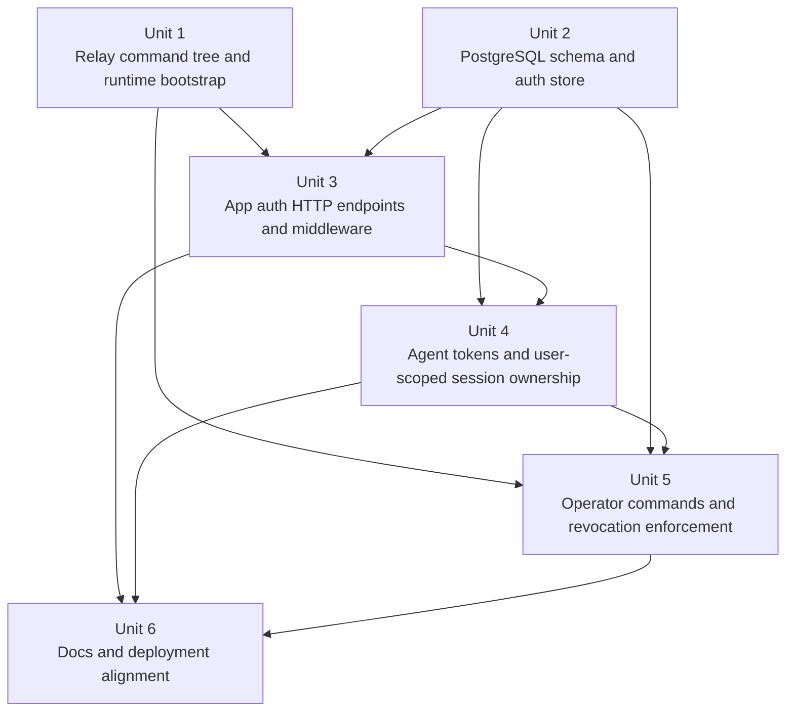

# feat: Add invite-gated relay accounts and user-scoped auth

> Historical note: this plan is superseded by the shipped implementation. The final version uses loopback-only operator HTTP routes outside `/api/`, does not run a revocation reconciliation loop, and applies schema changes through the standalone `relay-migrate --schema-dir ...` command.

## Overview

Replace the relay's shared Basic Auth and shared agent bearer token with a durable account system that still fits the repo's current operational shape: one `relay` binary behind `nginx`, managed by `systemd`, with PostgreSQL on the same VPS and no Redis requirement in v1.

The plan keeps the current attach protocol intact. The big changes are around identity, persistence, and operator workflows:

- mobile-app APIs move to user-scoped bearer auth
- agent registration moves to user-owned long-lived agent tokens
- live session discovery and attach become user-scoped
- invite codes, refresh sessions, and agent tokens become durable data
- operator actions move into explicit local `relay` subcommands

This plan intentionally does not split the service, introduce a public admin API, or change the attach snapshot/live-byte contract.

## Problem Frame

The current codebase still assumes a prototype auth model:

- `cmd/relay/main.go` requires `AGENTUNNEL_BASIC_USER`, `AGENTUNNEL_BASIC_PASSWORD`, and `AGENTUNNEL_AGENT_TOKEN`
- `internal/relay/auth.go` only supports constant-time comparison against those shared credentials
- `internal/relay/server.go` applies Basic Auth to `GET /api/sessions` and `GET /api/sessions/:id/attach/ws`, and applies one bearer token to `/agent/ws`
- `internal/relay/registry.go` treats all live sessions as globally visible because it has no user ownership concept

That is incompatible with the settled requirements in `docs/brainstorms/2026-04-11-invite-code-relay-auth-requirements.md`: invite-gated account creation, user bearer auth, multiple named agent tokens per user, session privacy, operator maintenance commands, and single-host PostgreSQL-backed deployment.

The main implementation challenge is not HTTP routing. It is introducing durable auth state and user ownership without regressing three existing strengths:

- `tunnel` startup and reconnect behavior stay stable
- the attach-oriented relay contract stays unchanged
- the repo stays operationally simple enough for one VPS deployment

## Requirements Trace

- R1-R6. Add durable user accounts plus atomic, single-use invite-code registration.
- R7-R11. Enforce username/password validation, short invite-code ergonomics, and invite-guess throttling.
- R12-R18. Replace relay-wide Basic Auth for app APIs with bearer-authenticated register/login/refresh/logout/password-change flows.
- R19-R22. Support password change, but no forgot-password flow; re-entry after password loss requires a fresh invite code.
- R23-R27. Add multiple named agent tokens per user, with one-time plaintext display, list metadata, and per-token revocation.
- R28-R32. Change session ownership and attach auth to be user-scoped without changing the attach wire contract.
- R33-R40. Add local operator workflows for invite create/disable and user deletion, including username reuse after audited account deletion.
- R41-R45. Use PostgreSQL as the durable source of truth, keep Redis optional, keep one `relay` binary, and make migrations explicit.
- R46-R48. Preserve the API-only product shape, avoid email flows, and capture enough audit metadata for closed-beta operations.

## Scope Boundaries

- No web frontend.
- No email addresses, verification codes, or password-recovery flow.
- No public admin CRUD API for invites or users.
- No Redis dependency in v1.
- No attach protocol redesign, no replay/history return, and no change to `tunnel`'s `AGENTUNNEL_RELAY_TOKEN` environment-variable flow.
- No separate auth service in this phase.

## Context & Research

### Relevant Code and Patterns

- `cmd/relay/main.go` is currently a thin stdlib-`flag` entrypoint. It is the natural place to grow subcommands without introducing a new CLI framework.
- `internal/relay/server.go` already owns all public HTTP and WebSocket entrypoints. It should remain the place where auth decisions meet registry/session behavior.
- `internal/relay/auth.go` is intentionally small today. It is the right boundary for bearer parsing, password verification helpers, and token-auth middleware glue, but not for persistence-heavy logic.
- `internal/relay/registry.go` is the existing live-only source of session discovery, attach membership, and disconnect behavior. It should keep that role while learning about `user_id` and `agent_token_id`.
- `cmd/tunnel/main.go`, `cmd/tunnel/args.go`, and `internal/tunnel/connector/connector.go` already send `Authorization: Bearer <token>` to `/agent/ws`. That transport shape can stay unchanged while the meaning of the token changes from relay-wide shared secret to user-owned agent token.
- `docs/deployment.md` describes a single Ubuntu VPS with `nginx` and `systemd`. The plan should preserve that deployment posture rather than inventing container or multi-service infrastructure.
- Existing tests already pin the current public relay behavior and provide the right seams for incremental change:
  - `cmd/relay/main_test.go`
  - `internal/relay/server_test.go`
  - `internal/relay/registry_test.go`
  - `cmd/tunnel/main_test.go`
  - `cmd/tunnel/args_test.go`

### Institutional Learnings

- No `docs/solutions/` entries exist in this repository today.

### External References

- OWASP Password Storage Cheat Sheet recommends Argon2id as the preferred password hashing algorithm, with modern memory-hard parameters.
- OWASP Authentication Cheat Sheet recommends login throttling and layered protection against automated guessing attacks.
- OWASP Session Management Cheat Sheet recommends server-side session state, session renewal after privilege changes, and explicit timeout enforcement on the server side.
- RFC 9700 recommends refresh-token rotation, revocation on security events such as password change or logout, and server-side tracking that can detect replay.
- PostgreSQL `citext` documentation confirms that case-insensitive uniqueness is possible in the database, but also shows the operational tradeoff of relying on an extension. For this repo, explicit lowercase normalization is a simpler v1 choice than adding extension-dependent behavior on a fresh VPS.

## Key Technical Decisions

- **Use PostgreSQL as the only required durable dependency in v1.**
  Rationale: it satisfies users, invites, sessions, agent tokens, and audit state without adding Redis before there is a concrete runtime need for it.

- **Use opaque random bearer tokens for app access and refresh credentials, not JWTs.**
  Rationale: this is a single-service relay. Opaque tokens let the service revoke app sessions immediately on logout or account deletion, keep auth semantics easy to reason about, and avoid adding JWT signing/validation machinery that buys little at current scale.

- **Store token and invite-code digests with an application secret, not plaintext.**
  Rationale: agent tokens and app tokens are high-entropy secrets; invite codes are intentionally short. Storing only digests prevents later read APIs from recovering secrets and avoids keeping live credentials in the database.

- **Hash passwords with Argon2id and store versioned PHC-style hashes.**
  Rationale: this follows current OWASP guidance and leaves room to raise work factors later without schema churn.

- **Normalize usernames to lowercase ASCII and keep invite codes uppercase-but-case-insensitive.**
  Rationale: a closed beta benefits more from predictable login semantics than from Unicode-friendly display names. Lowercase normalization avoids a PostgreSQL extension requirement and makes uniqueness rules explicit in code and tests.

- **Keep the `/agent/ws` wire contract unchanged and shift ownership at validation time.**
  Rationale: `tunnel` already knows how to send a bearer token and register a `SessionInfo`. The relay should attach `user_id` and `agent_token_id` after validating the bearer token, without changing the connector protocol.

- **Extend the in-memory registry with owner metadata instead of pushing live session state into PostgreSQL.**
  Rationale: the requirements explicitly preserve live-only session state. PostgreSQL should back identities and credentials, while `internal/relay/registry.go` remains the authority for currently online sessions and active attaches.

- **Use explicit stdlib-`flag` subcommands in `relay`: `serve`, `migrate`, `invite create`, `invite disable`, and `user delete`.**
  Rationale: that matches the repo's current CLI style and avoids introducing a new command framework for a small operator surface.

- **Handle cross-process account deletion and session eviction with a short-interval service-side revocation reconciliation loop.**
  Rationale: operator commands run in separate processes from `relay serve`, while live sessions exist only in the running registry. A short polling loop against recent revocation/audit state preserves the “local operator workflow” requirement without adding a public admin API or Redis.

- **Run migrations explicitly with `relay migrate`; do not auto-migrate during every service start.**
  Rationale: schema changes are high-blast-radius. Making them explicit keeps deployment failures easier to reason about and aligns with the current VPS/systemd posture.

## Alternative Approaches Considered

| Approach | Why not chosen |
|---|---|
| Separate auth/account service alongside relay | Adds deployment and operational complexity before the product has a need for independent scaling or service isolation. |
| Signed JWT access tokens plus DB-backed refresh tokens | Harder to revoke immediately, adds signing-key lifecycle work, and does not materially reduce complexity in a single-service relay. |
| Redis-backed revocation, throttling, and session helpers in v1 | Premature for one VPS and not required by the settled requirements. |

## Open Questions

### Resolved During Planning

- **Access-token and refresh-token shape:** Use opaque bearer access tokens with a 15-minute TTL and rotating opaque refresh tokens with a 30-day TTL. Every successful refresh rotates the refresh token and issues a fresh access token.
- **How password-change should affect app sessions:** Revoke all app sessions on password change, including the current one, so the new password becomes the only valid app-auth path immediately.
- **How to implement case-insensitive username uniqueness:** Normalize to lowercase in application code and enforce uniqueness on the normalized column, instead of relying on `citext`.
- **How to preserve operator-only invite management without a public API:** Use local `relay` subcommands that connect to PostgreSQL directly.
- **How a separate `relay user delete` process can evict live sessions from the running service:** Store deletion/revocation signals durably, and let the running service reconcile and disconnect matching live sessions on a short interval.
- **Whether `tunnel` needs a new auth transport:** No. `AGENTUNNEL_RELAY_TOKEN` remains the environment variable; only the issuance and validation story changes.

### Deferred to Implementation

- The exact digest format for tokens and invite codes can be finalized during implementation as long as it uses a secret-backed one-way digest and never requires plaintext recovery from storage.
- The exact database index set can be finalized during implementation after the SQL schema is drafted, but uniqueness and lookup performance for usernames, invite-code digests, access-token digests, refresh-token digests, and active agent-token digests must all be explicit.
- The exact reaper interval for cross-process deletions can be tuned during implementation, but it must be short enough that “user delete disconnects live sessions” feels immediate in practice and is covered by integration tests.

## High-Level Technical Design

> *This illustrates the intended approach and is directional guidance for review, not implementation specification. The implementing agent should treat it as context, not code to reproduce.*

```mermaid
flowchart TB
    A[Mobile app] --> B[/api/auth/*]
    A --> C[/api/agent-tokens]
    A --> D[/api/sessions + /attach/ws]

    B --> E[app auth service]
    C --> E
    D --> F[bearer auth middleware]

    G[tunnel] --> H[/agent/ws]
    H --> I[agent token lookup]

    E --> J[(PostgreSQL)]
    F --> J
    I --> J

    I --> K[Registry session owner metadata]
    D --> K

    L[relay invite/user commands] --> J
    M[revocation reconciliation loop] --> J
    M --> K
```

## Implementation Units



- [ ] **Unit 1: Restructure `relay` into a command tree with shared runtime config**

**Goal:** Turn the current single-purpose `relay` entrypoint into a small multi-command CLI that can serve HTTP traffic, run migrations, and execute operator-only maintenance actions through one explicit command surface.

**Requirements:** R33-R45, R43-R45

**Dependencies:** None

**Files:**
- Modify: `cmd/relay/main.go`
- Modify: `cmd/relay/main_test.go`
- Create: `cmd/relay/command.go`
- Create: `cmd/relay/command_test.go`
- Create: `cmd/relay/config.go`
- Create: `cmd/relay/config_test.go`

**Approach:**
- Introduce stdlib-`flag.FlagSet` subcommands for `serve`, `migrate`, `invite create`, `invite disable`, and `user delete`.
- Replace shared-auth env loading with runtime config that centers on:
  - listen address / port
  - PostgreSQL DSN
  - application secret key for credential digests
  - optional operator identity flags for destructive commands
- Keep migration execution separate from service startup; `serve` should refuse to auto-run migrations.
- Build handler/bootstrap wiring so `serve` can construct the PostgreSQL store, the in-memory registry, and the revocation reconciliation loop in one place.

**Patterns to follow:**
- Current stdlib `flag` usage in `cmd/relay/main.go`
- Config parsing style already used by `cmd/tunnel/args.go`

**Test scenarios:**
- Happy path: `relay serve --listen-addr 127.0.0.1:9999` loads DB and secret config successfully and returns the expected listen address.
- Error path: missing database DSN or missing application secret fails fast for commands that require them.
- Error path: unknown subcommand returns a clear usage error without starting the service.
- Regression: `cmd/relay/main_test.go` still pins startup logging behavior and timeout configuration for the serve path.

**Verification:**
- An operator can reason about one `relay` binary with explicit subcommands and no legacy startup alias path.

- [ ] **Unit 2: Add PostgreSQL schema, credential helpers, and a repo-native auth store**

**Goal:** Introduce the durable persistence layer for accounts, invite codes, app sessions, agent tokens, and operator audit records.

**Requirements:** R1-R11, R23-R27, R41-R48

**Dependencies:** Unit 1

**Files:**
- Create: `internal/relay/store.go`
- Create: `internal/relay/store_postgres.go`
- Create: `internal/relay/store_postgres_test.go`
- Create: `internal/relay/credentials.go`
- Create: `internal/relay/credentials_test.go`
- Create: `internal/relay/migrations/0001_auth_schema.sql`
- Create: `internal/relay/migrations/0002_operator_audit.sql`

**Approach:**
- Define a minimal store interface that covers:
  - register user with invite-code consumption
  - authenticate username/password
  - create / rotate / revoke app sessions
  - create / list / revoke agent tokens
  - disable invites
  - hard-delete users with audit logging
- Implement the first PostgreSQL-backed store directly with SQL, not an ORM.
- Use normalized lowercase usernames with a unique database constraint on the normalized value.
- Generate six-character invite codes from an ambiguity-reduced alphanumeric alphabet and verify them case-insensitively after normalization.
- Store passwords as Argon2id hashes and store access tokens, refresh tokens, agent tokens, and invite codes as secret-backed digests rather than plaintext.
- Use transactional write paths for invite consumption plus user creation, refresh-token rotation, and hard-delete cleanup so partial auth state cannot leak through retries.
- Model app auth as durable server-side sessions:
  - access token digest + expiry
  - refresh token digest + expiry
  - revoked / deleted state
  - user linkage and timestamps
- Model operator audit as durable, append-only metadata that preserves user identity and action details even when the deleted account row is gone.

**Execution note:** Start with store integration coverage against a real PostgreSQL instance when a test DSN is present, and keep handler tests on top of small fake stores so auth behavior is pinned independently of SQL details.

**Patterns to follow:**
- Small explicit helper style from `internal/protocol/message.go`
- Existing table-free in-memory state boundaries in `internal/relay/registry.go`; persistence should be explicit, not hidden behind magic globals

**Test scenarios:**
- Happy path: registering with a valid invite code creates one user row, consumes the invite code, and leaves no reusable invite state behind.
- Edge case: two concurrent register attempts with the same invite code produce exactly one success and one deterministic failure.
- Error path: expired, disabled, unknown, or already-consumed invite codes are rejected without creating a user.
- Happy path: username normalization treats `Alice` and `alice` as the same login identifier.
- Happy path: authenticating with the right password returns a new app session with distinct access and refresh tokens.
- Error path: wrong password, revoked app session, expired refresh token, and revoked agent token all fail cleanly.
- Integration: deleting a user removes durable auth material while retaining an audit record that still names the deleted user identity and operator action.

**Verification:**
- PostgreSQL becomes the durable source of truth for auth and operator state, with transactional semantics around the high-risk write paths.

- [ ] **Unit 3: Add app auth endpoints, middleware, and invite/register throttling**

**Goal:** Replace relay-wide Basic Auth for app APIs with user-scoped bearer auth plus the required register/login/refresh/logout/password-change flows.

**Requirements:** R2, R6-R22, R46-R48

**Dependencies:** Unit 1, Unit 2

**Files:**
- Modify: `internal/relay/server.go`
- Modify: `internal/relay/auth.go`
- Modify: `internal/relay/server_test.go`
- Create: `internal/relay/app_auth.go`
- Create: `internal/relay/app_auth_test.go`
- Create: `internal/relay/throttle.go`
- Create: `internal/relay/throttle_test.go`

**Approach:**
- Add JSON HTTP handlers for:
  - `POST /api/auth/register`
  - `POST /api/auth/login`
  - `POST /api/auth/refresh`
  - `POST /api/auth/logout`
  - `POST /api/auth/password/change`
- Add app-bearer middleware that resolves the current user and app session from the opaque access token.
- Remove Basic Auth requirements from app-facing routes and keep auth failures uniform so invite validity and account existence are not overexposed by response shape.
- Implement a fixed-window in-memory IP throttle for register attempts in the first rollout. The target default is `5` failed register attempts per `10` minutes per IP, returning `429` plus a `Retry-After` hint.
- Keep timeout and JSON envelope behavior compatible with the existing handler style rather than adding a full framework.
- Treat password change as a server-side privilege transition: verify the current password, update the password hash, and revoke all app sessions so the old password cannot retain any bearer-based foothold.

**Patterns to follow:**
- Existing route registration and request validation flow in `internal/relay/server.go`
- Current auth parsing helpers in `internal/relay/auth.go`
- `httptest`-driven handler coverage in `internal/relay/server_test.go`

**Test scenarios:**
- Happy path: register with valid invite, username, and password creates the account but does not log the user in automatically.
- Happy path: login with valid credentials returns a bearer access token and a refresh token; using the access token authorizes logout and password-change routes.
- Happy path: refresh with a live refresh token rotates the refresh token and returns a fresh access token.
- Error path: login with a wrong password returns unauthorized without exposing whether the username exists.
- Error path: refresh with a revoked or expired refresh token fails and does not mint a new access token.
- Edge case: enough failed register attempts from one IP cross the throttle threshold and begin returning `429`; a separate IP is unaffected.
- Integration: logout revokes the current durable app session so the same refresh token can no longer mint access tokens.
- Integration: password change with the correct current password updates stored credentials and causes the current access token and any stored refresh token to fail on subsequent use.

**Verification:**
- Mobile-app auth moves off shared Basic Auth and onto explicit bearer-authenticated account flows, while register/login security controls remain simple and testable.

- [ ] **Unit 4: Add agent-token management and user-scoped session ownership**

**Goal:** Make `/agent/ws`, session discovery, and attach authorization aware of user ownership without changing the attach-oriented client/agent wire contract.

**Requirements:** R23-R32, R47-R48

**Dependencies:** Unit 2, Unit 3

**Files:**
- Modify: `internal/relay/server.go`
- Modify: `internal/relay/registry.go`
- Modify: `internal/relay/registry_test.go`
- Modify: `internal/relay/server_test.go`
- Create: `internal/relay/agent_tokens.go`
- Create: `internal/relay/agent_tokens_test.go`

**Approach:**
- Add `GET /api/agent-tokens`, `POST /api/agent-tokens`, and `DELETE /api/agent-tokens/:id` behind app bearer auth.
- Keep plaintext agent-token display one-time only at creation; later reads return metadata only.
- Change `/agent/ws` auth from “compare against one env var” to “look up live agent token digest, reject revoked/unknown token, and capture owner metadata”.
- Extend registry state so each live session records:
  - `user_id`
  - `agent_token_id`
  - existing public `protocol.SessionInfo`
- Replace global discovery/attach helpers with ownership-aware methods:
  - list sessions for one user
  - start attach only when the session belongs to the authenticated user
- Return “not found” for cross-user attach attempts rather than revealing another user's live session existence.
- Preserve `protocol.SessionInfo`, `/agent/ws` register frames, `GET /api/sessions/:id/attach/ws`, and attach control/binary traffic so `tunnel` and external clients do not need a protocol rewrite.

**Patterns to follow:**
- Existing relay-to-registry ownership split in `internal/relay/server.go` and `internal/relay/registry.go`
- Existing client-facing metadata shape in `internal/protocol/message.go`
- Existing `/agent/ws` and attach coverage in `internal/relay/server_test.go`

**Test scenarios:**
- Happy path: authenticated user A sees only user A's sessions in `GET /api/sessions` even when user B also has live sessions.
- Happy path: user A can attach to user A's session and still receives the existing `attached` -> snapshot bytes -> `snapshot_done` sequence.
- Error path: user A attempting to attach to user B's session receives a not-found-style failure and no attach begins on the owner side.
- Happy path: creating a new agent token returns plaintext once, and later list responses show only metadata including creation time and last-used time.
- Error path: revoked or unknown agent tokens cannot register on `/agent/ws`.
- Integration: an agent registered with a valid user-owned token becomes discoverable only under that user's bearer-authenticated session list.
- Regression: `cmd/tunnel` still uses `AGENTUNNEL_RELAY_TOKEN` unchanged and does not require a connector protocol change.

**Verification:**
- Session visibility becomes private by default, and agent tokens become per-user credentials without disturbing the attach contract.

- [ ] **Unit 5: Add operator commands and live-session revocation enforcement**

**Goal:** Provide the required operator maintenance workflows and ensure that destructive account actions affect both durable auth state and currently live in-memory sessions.

**Requirements:** R33-R40, R45, R48

**Dependencies:** Unit 1, Unit 2, Unit 4

**Files:**
- Create: `cmd/relay/invite_cmd.go`
- Create: `cmd/relay/invite_cmd_test.go`
- Create: `cmd/relay/user_cmd.go`
- Create: `cmd/relay/user_cmd_test.go`
- Create: `internal/relay/revocation_reaper.go`
- Create: `internal/relay/revocation_reaper_test.go`
- Modify: `internal/relay/registry.go`
- Modify: `internal/relay/registry_test.go`

**Approach:**
- Implement:
  - `relay invite create`
  - `relay invite disable`
  - `relay user delete`
- Require explicit operator identity input on destructive commands so audit rows do not collapse into anonymous “root did something”.
- Make `relay user delete`:
  - remove the user row
  - revoke/delete refresh sessions and agent tokens
  - leave an audit trail that preserves target identity and operator identity
  - free the username for future reuse
- Add a short-interval revocation reconciliation loop inside `relay serve` that reads recent deletion/revocation state from PostgreSQL and disconnects matching live sessions from the in-memory registry.
- Keep this reconciliation service-local; do not add a public admin API or Redis side channel in v1.
- Ensure invite create/disable remain direct DB operations and do not require the HTTP service to be reachable.

**Patterns to follow:**
- Registry-driven disconnect behavior already used for offline session cleanup in `internal/relay/registry.go`
- Current command-entry style in `cmd/relay/main.go`

**Test scenarios:**
- Happy path: `relay invite create` emits one or more plaintext invite codes once and persists only non-recoverable stored digests plus metadata.
- Happy path: `relay invite disable` makes a previously valid invite code unusable for subsequent registration attempts.
- Happy path: `relay user delete` removes the durable account, frees the normalized username, and records an audit event naming the operator and target user.
- Edge case: deleting a user with no live sessions still succeeds and leaves an audit trail.
- Integration: deleting a user who currently owns a live session causes that session to disappear from discovery and closes existing attaches on the next reconciliation pass.
- Error path: deleting a missing user or disabling a missing invite returns a deterministic operator-facing error without partial writes.

**Verification:**
- Operator workflows exist as local commands, and destructive account actions affect both PostgreSQL state and the live relay session graph.

- [ ] **Unit 6: Align product, protocol, and deployment docs with the new auth model**

**Goal:** Update repository docs so they describe the new account model, operator commands, deployment prerequisites, and unchanged attach contract accurately.

**Requirements:** R29, R43-R48

**Dependencies:** Unit 3, Unit 4, Unit 5

**Files:**
- Modify: `README.md`
- Modify: `docs/protocol.md`
- Modify: `docs/architecture.md`
- Modify: `docs/deployment.md`
- Modify: `CLAUDE.md`
- Modify: `AGENTS.md`

**Approach:**
- Replace relay-wide Basic Auth app-client examples with app bearer-auth examples.
- Update `/agent/ws` documentation so `AGENTUNNEL_RELAY_TOKEN` is described as a user-created agent token rather than a shared operator secret.
- Add deployment guidance for PostgreSQL installation, DSN configuration, explicit `relay migrate`, and the new operator subcommands.
- Preserve the attach/lifecycle documentation that is still true: live-only registry, attach-oriented recovery, local terminal authority, and session-scoped attach behavior.
- Keep docs explicit that Redis is not required in the first production rollout.

**Patterns to follow:**
- Existing doc alignment across `README.md`, `docs/protocol.md`, `docs/architecture.md`, `CLAUDE.md`, and `AGENTS.md`
- Current deployment guide style in `docs/deployment.md`

**Test scenarios:**
- Test expectation: none -- this unit is documentation-only, but the implementer should do a parity pass to ensure the same auth and operator story appears consistently across all required docs.

**Verification:**
- The repo tells one coherent story about app auth, agent auth, operator workflows, PostgreSQL deployment, and the unchanged attach contract.

## System-Wide Impact

- **Interaction graph:** `cmd/relay` becomes the assembly point for command parsing, store construction, registry startup, and reconciliation loops; `internal/relay/server.go` remains the public HTTP/WS surface; `internal/relay/registry.go` stays the live-session authority; PostgreSQL becomes the durable identity/auth store.
- **Error propagation:** PostgreSQL outages must fail auth and new agent registration closed. Existing local `tunnel` sessions continue running locally because connector reconnect behavior already tolerates relay unavailability.
- **State lifecycle risks:** invite-code consumption, refresh rotation, and user deletion now cross multiple durable objects; those write paths must be transactional. Live session ownership remains in-memory and must be reconciled against durable deletions.
- **API surface parity:** `/agent/ws`, `GET /api/sessions`, and `GET /api/sessions/:id/attach/ws` remain the public session surfaces, but their auth semantics change. `tunnel`'s environment contract stays stable.
- **Integration coverage:** end-to-end tests must cover register/login/refresh/logout, agent-token creation and revocation, user-scoped session listing/attach, and deletion-driven live-session eviction.
- **Unchanged invariants:** attach snapshot/live-byte order, live-only registry semantics, `session_id` lifetime rules, local-terminal PTY authority, and tunnel reconnect behavior remain unchanged from the current product contract.

## Risks & Dependencies

| Risk | Mitigation |
|------|------------|
| PostgreSQL becomes unavailable and blocks auth or agent registration | Fail closed for auth paths, preserve local `tunnel` usability, and document PostgreSQL as a first-class runtime dependency in deployment docs and service ordering. |
| Short invite codes are easier to brute-force than long opaque secrets | Use an ambiguity-reduced alphabet, enforce single-use/expiry/disable semantics, return uniform errors, and add register throttling in v1. |
| Cross-process `user delete` writes durable state but leaves live registry state behind too long | Add a short-interval reconciliation loop plus integration tests that pin “deleted user disappears from discovery and active attaches close” behavior. |
| Migration mistakes break a running single-host deployment | Keep `relay migrate` explicit, keep migrations transactional, and update deployment docs to run migration before restarting the service. |
| Token/session logic sprawls into ad hoc helpers | Centralize durable auth behaviors behind a narrow store/service interface and keep registry ownership logic separate from SQL concerns. |

## Documentation / Operational Notes

- `docs/deployment.md` should add PostgreSQL installation, DSN configuration, `After=postgresql.service` guidance, and an explicit deploy flow of “upload binary -> `relay migrate` -> restart service”.
- The old `AGENTUNNEL_BASIC_USER`, `AGENTUNNEL_BASIC_PASSWORD`, and shared `AGENTUNNEL_AGENT_TOKEN` service envs should be removed from docs once the feature lands.
- `AGENTUNNEL_RELAY_TOKEN` remains required for `tunnel`, but its source becomes the user-facing agent-token API rather than relay operator bootstrap.
- The plan deliberately avoids a public admin API, Redis, or a second daemon. If later rollout pressure shows the revocation reconciliation loop or DB lookup volume becoming a bottleneck, that can be a separate follow-up rather than sneaking into v1.

## Sources & References

- **Origin document:** `docs/brainstorms/2026-04-11-invite-code-relay-auth-requirements.md`
- Related code:
  - `cmd/relay/main.go`
  - `cmd/tunnel/main.go`
  - `cmd/tunnel/args.go`
  - `internal/relay/server.go`
  - `internal/relay/auth.go`
  - `internal/relay/registry.go`
  - `internal/protocol/message.go`
  - `docs/protocol.md`
  - `docs/deployment.md`
- External references:
  - OWASP Password Storage Cheat Sheet: https://cheatsheetseries.owasp.org/cheatsheets/Password_Storage_Cheat_Sheet.html
  - OWASP Authentication Cheat Sheet: https://cheatsheetseries.owasp.org/cheatsheets/Authentication_Cheat_Sheet.html
  - OWASP Session Management Cheat Sheet: https://cheatsheetseries.owasp.org/cheatsheets/Session_Management_Cheat_Sheet.html
  - RFC 9700: Best Current Practice for OAuth 2.0 Security: https://www.rfc-editor.org/rfc/rfc9700.html
  - PostgreSQL `citext` documentation: https://www.postgresql.org/docs/current/citext.html
