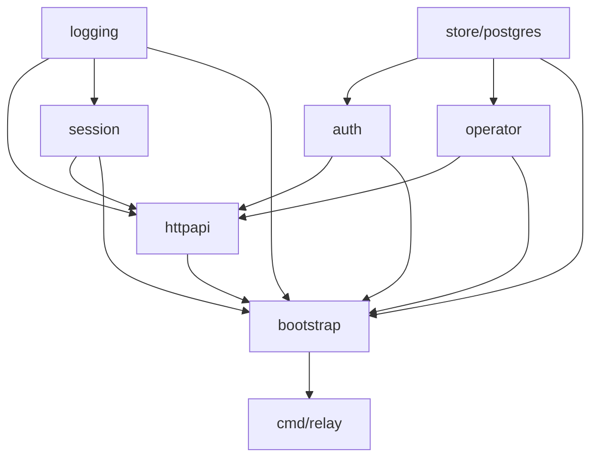

# refactor: reorganize relay packages by domain and transport

## Overview

Reorganize `internal/relay/` so the package layout matches the relay's actual responsibilities: auth, operator workflows, live session runtime, HTTP/WebSocket transport, and PostgreSQL persistence.

This is a structural refactor first. It should make the relay easier to read without changing runtime behavior, HTTP routes, WebSocket protocol semantics, environment variables, or CLI behavior. The stdlib router stays in place for this pass. A later pass may switch the transport layer to `gin` and middleware once the package boundaries are cleaner.

## Problem Frame

`internal/relay/` is now large enough that a flat package is fighting readability:

- transport code, request auth, response mapping, and websocket loops are mixed together in `internal/relay/server.go`
- credential rules, app-session flows, and agent-token logic live beside request helpers and registry code
- PostgreSQL persistence is concentrated in one large `internal/relay/store_postgres.go`
- runtime live-session state in `internal/relay/registry.go` sits next to durable-auth storage concerns even though they are different kinds of state

The result is that reading the relay means mentally reconstructing domain boundaries from file names instead of navigating an explicit package map. The user direction for this pass is to fix that with a conservative package-layout refactor, not with a behavior rewrite and not with a transport-framework migration.

## Requirements Trace

- R1. Replace the flat `internal/relay/` layout with a domain-oriented package map that makes auth, operator, runtime session state, transport, and PostgreSQL persistence easier to find.
- R2. Keep the current relay behavior unchanged: same routes, same websocket protocol, same auth semantics, same environment variables, same CLI semantics.
- R3. Keep this pass on the stdlib router. Do not introduce `gin` yet.
- R4. Split the current large `Store` dependency surface into smaller consumer-owned repository interfaces instead of one package-wide catch-all interface.
- R5. Keep runtime live-session state (`Registry`, attach indexing, owner/client routing) separate from PostgreSQL-backed persistence.
- R6. Update relay entrypoint wiring, tests, and living docs so the new layout is coherent and future work can safely add `gin` plus middleware in a second pass.

## Scope Boundaries

- No `gin` in this pass.
- No router or middleware redesign beyond moving the current stdlib logic into clearer files and packages.
- No endpoint, protocol, or auth behavior changes.
- No env-var changes.
- No operator-path rename in this pass.
- No product-scope changes.
- No rewrite of working business logic just because a new package boundary exists.

## Context & Research

### Relevant Code and Patterns

- `cmd/relay/command.go` currently assembles relay dependencies directly from the flat `internal/relay` package.
- `internal/relay/server.go` currently owns:
  - route registration
  - request authentication
  - JSON request/response mapping
  - websocket upgrade flows
  - attach-session bookkeeping
- `internal/relay/app_auth.go`, `internal/relay/agent_tokens.go`, and `internal/relay/credentials.go` already form an implicit auth cluster.
- `internal/relay/operator_service.go` and `internal/relay/operator_api.go` already form an implicit operator cluster.
- `internal/relay/registry.go` is already the live runtime state boundary for session ownership, attach routing, and disconnect behavior.
- `internal/relay/store_postgres.go` plus `internal/relay/migration.go` already form an implicit PostgreSQL persistence cluster.
- `docs/plans/2026-04-11-001-refactor-tunnel-relay-layout-plan.md` intentionally kept `internal/relay/` flat during the first internal-layout pass and explicitly deferred deeper relay package cleanup.

### Institutional Learnings

- No `docs/solutions/` entries exist in this repository today.

### External References

- None needed for this pass. The problem is repo-local structure, and the current code already makes the missing boundaries visible.

## Key Technical Decisions

- Use business/domain packages instead of top-level technical-layer packages.
  Rationale: `repository/service/handler/model` would scatter one feature across many folders. The user's complaint is readability, and feature/domain grouping is the more direct fix in Go.

- Target this package map:

```text
internal/relay/
  bootstrap/
    module.go

  httpapi/
    handler.go
    auth_handlers.go
    operator_handlers.go
    session_handlers.go
    agent_ws.go
    attach_ws.go
    request_auth.go
    access_log.go
    ws_logging.go
    throttle.go

  auth/
    service.go
    credentials.go
    repository.go
    types.go

  operator/
    service.go
    repository.go
    types.go

  session/
    registry.go
    attach_index.go

  logging/
    logger.go

  store/postgres/
    store.go
    auth_repository.go
    operator_repository.go
    migration.go
    migrations/
```

  Rationale: this keeps package count small while making the main relay domains obvious.

- Keep `agent token` logic inside `auth/`.
  Rationale: agent tokens are credentials owned by a user, not runtime session state.

- Keep `Registry` and attach indexing in `session/`, not in a repository package.
  Rationale: these are live in-memory runtime objects, not durable persistence.

- Move the structured logger into `logging/`, and let `session/` plus `httpapi/` depend on it.
  Rationale: logging crosses both runtime and transport concerns and should not force either package to import the other.

- Move HTTP path constants and operator request/response payloads into `httpapi/`.
  Rationale: they are transport contracts used both by server handlers and the CLI's operator HTTP client.

- Introduce a small `bootstrap` package to assemble relay dependencies for `cmd/relay`.
  Rationale: after the split, `cmd/relay/command.go` should not need to understand every internal package directly.

- Split the current `Store` contract into consumer-owned interfaces:
  - `auth.Repository`
  - `operator.Repository`
  Rationale: consumers should describe the persistence surface they need. The current single `Store` interface hides package boundaries instead of expressing them.

- Keep one concrete PostgreSQL store type in `store/postgres/` that satisfies both repository interfaces.
  Rationale: this keeps the DB wrapper simple without reintroducing a package-wide mega-interface.

## Open Questions

### Resolved During Planning

- Should this pass switch to `gin`? No. Defer to a second pass after package boundaries are explicit.
- Should the relay be split into top-level `repository/`, `service/`, and `handler/` directories? No. Use domain-oriented packages instead.
- Should `agent token` live under `session/`? No. Keep it under `auth/`.
- Should `Registry` be treated like a repository? No. Keep runtime state separate from PostgreSQL persistence.

### Deferred to Implementation

- The exact file split inside `httpapi/` can be finalized during implementation as long as route ownership is clearer than the current single-file `server.go`.
- The exact surface of `bootstrap.Module` can stay small and execution-driven as long as it reduces direct wiring complexity in `cmd/relay/command.go`.

## High-Level Technical Design

> This is directional guidance for review, not implementation specification.



## Implementation Units

- [ ] **Unit 1: Establish the new relay package map and move domain/runtime code**

**Goal:** Create the new directory structure and move auth, operator, session, and logger code into explicit domain packages without changing behavior.

**Requirements:** R1, R2, R4, R5

**Dependencies:** None

**Files:**
- Move: `internal/relay/app_auth.go` -> `internal/relay/auth/service.go`
- Move: `internal/relay/agent_tokens.go` -> `internal/relay/auth/service.go` or `internal/relay/auth/agent_tokens.go`
- Move: `internal/relay/credentials.go` -> `internal/relay/auth/credentials.go`
- Move: `internal/relay/store.go` -> `internal/relay/auth/types.go` and `internal/relay/auth/repository.go`
- Move: `internal/relay/operator_service.go` -> `internal/relay/operator/service.go`
- Move: `internal/relay/operator_api.go` -> `internal/relay/httpapi/operator_contract.go`
- Move: `internal/relay/registry.go` -> `internal/relay/session/registry.go`
- Extract: attach-session index from `internal/relay/server.go` -> `internal/relay/session/attach_index.go`
- Move: `internal/relay/logger.go` -> `internal/relay/logging/logger.go`
- Modify: tests that currently assume one flat `relay` package

**Approach:**
- Move the domain/service code first so the transport split has stable imports to target.
- Keep types and errors near the consuming domain package instead of one shared flat file.
- Preserve identifiers and behavior where possible to keep this primarily structural.

**Patterns to follow:**
- Existing domain seams already visible in `internal/relay/app_auth.go`, `internal/relay/agent_tokens.go`, `internal/relay/operator_service.go`, and `internal/relay/registry.go`
- Existing logger API in `internal/relay/logger.go`

**Test scenarios:**
- Happy path: auth service tests still prove register/login/refresh/logout/password-change behavior is unchanged after package moves.
- Happy path: agent-token tests still prove create/list/authenticate/revoke behavior is unchanged after the move.
- Happy path: registry tests still prove session registration, replacement, and disconnect behavior is unchanged after the move.
- Integration: no import cycle appears among `auth`, `operator`, `session`, and `logging`.

**Verification:**
- The flat `internal/relay/` package no longer contains auth, operator, session, or logger business code; those concerns each live in explicit subpackages.

- [ ] **Unit 2: Extract stdlib HTTP/WebSocket transport into `httpapi/`**

**Goal:** Break the current `internal/relay/server.go` into transport-focused files under `internal/relay/httpapi/` while keeping routes, auth behavior, and websocket semantics unchanged.

**Requirements:** R1, R2, R3, R5

**Dependencies:** Unit 1

**Files:**
- Move: `internal/relay/server.go` -> `internal/relay/httpapi/handler.go`, `auth_handlers.go`, `operator_handlers.go`, `session_handlers.go`, `agent_ws.go`, `attach_ws.go`
- Move: `internal/relay/auth.go` -> `internal/relay/httpapi/request_auth.go`
- Move: `internal/relay/http_logging.go` -> `internal/relay/httpapi/access_log.go`
- Move: `internal/relay/ws_logging.go` -> `internal/relay/httpapi/ws_logging.go`
- Move: `internal/relay/attach_client_ws.go` -> `internal/relay/httpapi/attach_client_ws.go`
- Move: `internal/relay/throttle.go` -> `internal/relay/httpapi/throttle.go`
- Modify: `cmd/relay/operator_client.go`
- Modify: `internal/relay/server_test.go` -> `internal/relay/httpapi/handler_test.go`

**Approach:**
- Keep one `NewHandler` entrypoint in `httpapi/` for this pass so the route surface stays stable.
- Split request DTOs, auth helpers, and websocket loops by responsibility, not by HTTP method.
- Keep stdlib `http.ServeMux` in place and postpone `gin` to the next pass.

**Patterns to follow:**
- Existing route and websocket behavior in `internal/relay/server.go`
- Existing CLI operator-client behavior in `cmd/relay/operator_client.go`

**Test scenarios:**
- Happy path: handler tests still prove register/login/refresh/logout and agent-token endpoints behave unchanged.
- Happy path: attach websocket tests still prove `attached -> snapshot bytes -> snapshot_done -> live bytes` behavior is unchanged.
- Happy path: operator-route tests still prove loopback-only and bearer-token restrictions are unchanged.
- Error path: cross-user attach, invalid auth, and throttled registration still return the same statuses and reasons.
- Integration: `cmd/relay/operator_client.go` still speaks to the same operator HTTP contract after the move.

**Verification:**
- `internal/relay/httpapi/` owns the stdlib router, request auth, request/response mapping, and websocket transport, and `server.go` no longer exists as an all-in-one file.

- [ ] **Unit 3: Move PostgreSQL persistence and relay assembly into `store/postgres/` plus `bootstrap/`**

**Goal:** Separate PostgreSQL persistence from runtime/session code and give `cmd/relay` a cleaner assembly boundary.

**Requirements:** R1, R2, R4, R5, R6

**Dependencies:** Unit 1, Unit 2

**Files:**
- Move: `internal/relay/store_postgres.go` -> `internal/relay/store/postgres/store.go`, `auth_repository.go`, `operator_repository.go`
- Move: `internal/relay/migration.go` -> `internal/relay/store/postgres/migration.go`
- Move: `internal/relay/migrations/0001_auth_schema.sql` -> `internal/relay/store/postgres/migrations/0001_auth_schema.sql`
- Move: `internal/relay/migrations/0002_operator_audit.sql` -> `internal/relay/store/postgres/migrations/0002_operator_audit.sql`
- Add: `internal/relay/bootstrap/module.go`
- Modify: `cmd/relay/command.go`
- Modify: `internal/relay/store_postgres_test.go` -> `internal/relay/store/postgres/store_test.go`

**Approach:**
- Keep one concrete PostgreSQL store type that satisfies both `auth.Repository` and `operator.Repository`.
- Move migration ownership into the PostgreSQL package so persistence concerns are fully co-located.
- Use `bootstrap` to assemble logger, registry, repositories, services, throttle, and transport handler for `cmd/relay`.

**Patterns to follow:**
- Existing `cmd/relay/command.go` startup wiring
- Existing transaction boundaries and migration behavior in `internal/relay/store_postgres.go` and `internal/relay/migration.go`

**Test scenarios:**
- Happy path: PostgreSQL integration tests still prove invite creation, registration, app-session creation, and password-change revocation behavior is unchanged.
- Happy path: `relay migrate` still applies embedded SQL migrations transactionally and idempotently.
- Integration: `cmd/relay` still starts the relay and runs migrations with the same external behavior after importing `bootstrap` and `store/postgres`.

**Verification:**
- PostgreSQL code and embedded migrations live entirely under `internal/relay/store/postgres/`, and `cmd/relay` no longer wires the relay from a flat package.

- [ ] **Unit 4: Sweep docs, package references, and code-navigation artifacts**

**Goal:** Finish the refactor by updating living docs and active reference docs that point at the old flat relay layout.

**Requirements:** R1, R6

**Dependencies:** Unit 1, Unit 2, Unit 3

**Files:**
- Modify: `AGENTS.md`
- Modify: `CLAUDE.md`
- Modify: `docs/architecture.md`
- Modify: `docs/plans/2026-04-11-002-feat-invite-code-relay-auth-plan.md`
- Modify: `docs/plans/2026-04-11-003-refactor-relay-package-layout-plan.md`

**Approach:**
- Update package maps and source references so they describe the new relay structure rather than the old flat package.
- Keep historical context intact while fixing broken code-navigation references in active docs.

**Patterns to follow:**
- Existing package-map sections in `AGENTS.md`, `CLAUDE.md`, and `docs/architecture.md`
- Existing active-plan reference style in `docs/plans/`

**Test scenarios:**
- Test expectation: none beyond repo-wide build/test verification.

**Verification:**
- Living docs and active plan docs no longer present the flat `internal/relay/` package as the current implementation layout.

## System-Wide Impact

- **Interaction graph:** `cmd/relay` now reaches the relay through `bootstrap`, which assembles domain services, runtime session state, transport, and PostgreSQL persistence explicitly.
- **State lifecycle:** live in-memory session state remains in `session/`, while durable auth state remains in `store/postgres/`.
- **API surface parity:** routes, websocket messages, auth semantics, env vars, and CLI command behavior remain unchanged in this pass.
- **Maintainability:** future `gin` and middleware work can focus on the transport layer without reopening domain and persistence boundaries.

## Risks & Dependencies

| Risk | Mitigation |
|------|------------|
| The refactor introduces import cycles across new subpackages | Keep `logging/` dependency-free, keep runtime state in `session/`, and keep repository interfaces consumer-owned |
| Structural moves accidentally change route or websocket behavior | Keep handler tests end to end and treat transport behavior as locked for this pass |
| Splitting the big `Store` interface breaks test helpers and stubs in subtle ways | Update fake repositories alongside each moved test package instead of trying to preserve the old mega-interface through shims |
| Docs and active plan references drift after the move | Reserve a final docs sweep unit and update active code-navigation docs in the same change |

## Documentation / Operational Notes

- This pass should update living docs that describe relay package ownership or source paths.
- This pass should not update operator workflows, deployment semantics, or public product behavior beyond source-path references.
- The deferred `gin` pass should start from `httpapi/` once this refactor lands.

## Sources & References

- Related code: `cmd/relay/command.go`
- Related code: `internal/relay/server.go`
- Related code: `internal/relay/store.go`
- Related code: `internal/relay/store_postgres.go`
- Related code: `docs/plans/2026-04-11-001-refactor-tunnel-relay-layout-plan.md`
