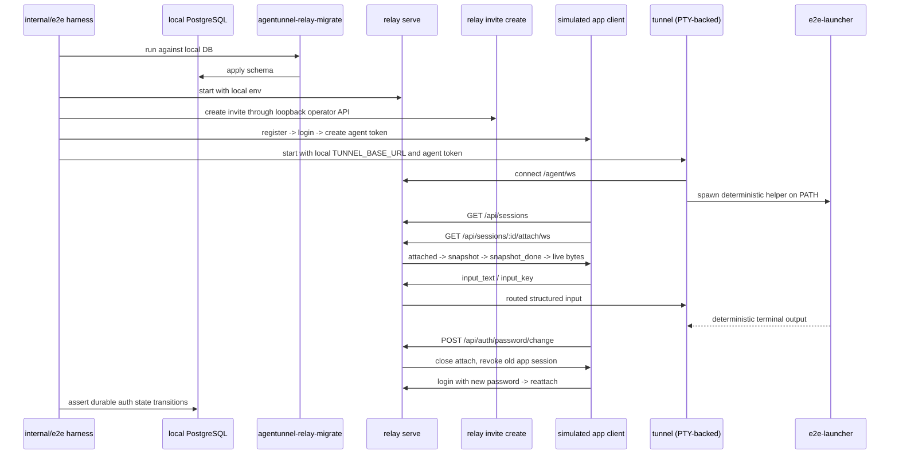

# feat: Add local end-to-end regression harness

## Overview

Add a developer-first local regression layer that runs the real relay stack against a real local PostgreSQL database, launches a real `tunnel` process, drives the public HTTP and WebSocket surfaces through a simulated client, and verifies the durable database state transitions that matter for auth and operator flows.

This is not a CI gate and not a full lifecycle matrix. The first pass is intentionally bounded to the highest-value local regression path:

- create an invite through the local operator CLI
- register and log in through the public HTTP API
- create an agent token
- launch a real `tunnel` against the local relay
- discover and attach to the live session
- prove snapshot, live bytes, and structured input end to end
- change the password and verify app-session revocation, attach closure, relogin, and session continuity

The same work also adds one clear manual local acceptance document so interactive tunnel experience can be checked against the same local stack after automation passes.

## Problem Frame

The repository already has strong package-level coverage for auth handlers, relay websocket behavior, protocol types, connector lifecycle, and PostgreSQL store behavior. Those tests do not prove that the real binaries still cooperate correctly when launched together on a developer machine.

The gap is concentrated at integration boundaries that package tests can only approximate:

- `agentunnel-relay-migrate`, `relay serve`, `relay invite create`, and `tunnel` each have their own process lifecycle and environment wiring
- `tunnel` requires a real local terminal context and connects over `/agent/ws`
- remote access depends on the interaction between `POST /api/auth/*`, `GET /api/sessions`, and `GET /api/sessions/:id/attach/ws`
- password change must revoke app sessions and close app-side attaches without disconnecting the owning agent session
- durable auth state lives in PostgreSQL, while live session state remains intentionally in-memory

The plan therefore focuses on a local, real-runtime regression harness rather than more in-process handler tests.

## Requirements Trace

- R1-R5. Keep the first-pass flow strictly local: real PostgreSQL, explicit migration step, real `relay serve`, real operator invite creation, and explicit local `TUNNEL_BASE_URL`.
- R6-R13. Cover the real critical-path user journey through public auth/session surfaces plus a real `tunnel` launched with a deterministic repo-owned helper process, while staying primarily black-box on user-visible behavior.
- R14-R16. Verify durable database transitions for invite consumption, user creation, app-session revocation, password change, and agent-token persistence without treating live session state as durable storage.
- R17-R20. Add a manual local acceptance checklist on the same local stack for validating the interactive tunnel experience beyond deterministic automation.
- R21-R24. Optimize for one obvious local developer entry point, one obvious manual acceptance doc, and failure output that identifies the broken stage or state transition clearly.

## Scope Boundaries

- No hosted-relay or remote-environment coverage.
- No CI gate or GitHub Actions requirement in this phase.
- No first-pass automation for cross-user isolation, agent-token revocation, invite reuse, or account-deletion flows.
- No real mobile app UI automation; the harness exercises the relay contract through a simulated app client.
- No product contract changes for `/api/sessions`, `GET /api/sessions/:id/attach/ws`, `/agent/ws`, session ownership, or password-change semantics.

## Context & Research

### Relevant Code and Patterns

- `internal/relay/store/postgres/store_test.go` already establishes the local PostgreSQL integration pattern for this repo: a dedicated `TUNNEL_TEST_DATABASE_URL`, explicit migration execution, and direct verification of durable auth state.
- `cmd/migrate/main.go` and `cmd/relay/command.go` show that the real local runtime surface is split across explicit binaries and subcommands rather than a monolithic in-process runner.
- `cmd/tunnel/main.go` and `internal/tunnel/session/local_terminal.go` confirm that automated e2e coverage must give `tunnel` a real PTY-backed local terminal, not a plain stdin/stdout pipe.
- `internal/tunnel/launcher/registry.go` resolves launchers from `PATH`, which makes a repo-owned deterministic helper binary the cleanest way to keep automated tunnel output stable.
- `internal/relay/handler/ws_api_test.go` and `internal/relay/handler/rest_api_test.go` already encode the expected HTTP and WebSocket auth/session behavior for register, login, attach, logout, and password change. The e2e harness should mirror those contracts rather than inventing a second client protocol.
- `internal/relay/store/postgres/auth_repository.go` and `schema/0001_auth_schema.sql` define the durable state worth asserting in phase one: `users`, `invite_codes`, `app_sessions`, and `agent_tokens`.
- The Makefile currently exposes `test` and `test-relay`, but there is no dedicated local e2e target yet. A new local regression entry should fit that existing developer workflow rather than inventing a separate launcher culture.

### Institutional Learnings

- No `docs/solutions/` entries exist in this repository.

### External References

- None. Local patterns are already strong enough for this work, and the main uncertainty is orchestration across existing repo-owned binaries and contracts.

## Key Technical Decisions

- Use a dedicated local e2e Go package as the harness boundary.
  Rationale: the repo already uses Go integration tests for PostgreSQL-backed verification. A Go package can launch real binaries, drive WebSocket/HTTP flows, run SQL assertions, and still fit the current test/developer workflow.

- Reuse `TUNNEL_TEST_DATABASE_URL` as the local database input for the harness, then map it into `RELAY_DATABASE_URL` for the child binaries.
  Rationale: this environment variable already exists for PostgreSQL integration tests in `internal/relay/store/postgres/store_test.go`, so reusing it avoids introducing another DSN convention.

- Run `tunnel` under a PTY from the harness and run the helper launcher behind that PTY as a real executable on `PATH`.
  Rationale: `tunnel` itself requires local terminal preparation, and `launcher.Resolve` is PATH-based. A PTY-backed `tunnel` plus a repo-owned deterministic helper gives real runtime behavior without depending on a real AI CLI.

- Keep user-visible flow black-box, but allow harness-owned database cleanup and read-only state assertions.
  Rationale: the critical path should use the real operator/API/WebSocket surfaces, but repeatable local runs still need a dedicated test database and durable-state verification.

- Treat the first phase as one critical-path scenario plus one manual checklist, not a full auth lifecycle matrix.
  Rationale: the highest leverage is protecting local regression confidence after relay or tunnel changes, not exhausting every auth combination on day one.

## Open Questions

### Resolved During Planning

- Should this be planned as local-only or CI-first? Local-only in phase one, with CI compatibility explicitly deferred.
- Should the harness talk to a real launcher process or a fake in-process session stub? A real `tunnel` process plus a deterministic repo-owned launcher binary.
- Should operator invite creation happen through SQL setup or through the real operator surface? Through the running relay and `relay invite create`, with direct DB writes reserved for harness setup/cleanup only.
- Should the plan add Docker Compose or Testcontainers to provision PostgreSQL? No. Phase one assumes developers provide a local PostgreSQL instance via the existing test DSN convention.
- Should the harness validate live session state through SQL? No. Live session presence stays a behavioral assertion over `GET /api/sessions` and attach websocket behavior.

### Deferred to Implementation

- Whether the harness should reset the dedicated local test database via `TRUNCATE ... RESTART IDENTITY` or via per-run unique data only can be finalized once the helper package is sketched against the actual SQL client ergonomics.
- Whether to keep all harness helpers in one `internal/e2e` package or split lightweight process/database/client helpers into sub-files should be decided by code clarity once implementation starts.
- Whether the deterministic launcher should emit a single line-oriented echo protocol or a slightly richer scripted exchange depends on how much snapshot-versus-live-byte separation the first end-to-end test needs.

## High-Level Technical Design

> *This illustrates the intended approach and is directional guidance for review, not implementation specification. The implementing agent should treat it as context, not code to reproduce.*

## Implementation Units

- [x] **Unit 1: Build the local e2e harness and local stack supervisor**

**Goal:** Establish one repo-owned harness that can build or locate the required local binaries, wire environment variables, prepare the dedicated local test database, start and stop relay-side processes, and report stage-specific failures clearly.

**Requirements:** R1, R2, R3, R4, R5, R13, R21, R23, R24

**Dependencies:** None

**Files:**
- Create: `internal/e2e/harness.go`
- Create: `internal/e2e/process_supervisor.go`
- Create: `internal/e2e/database.go`
- Create: `internal/e2e/local_regression_test.go`
- Modify: `Makefile`
- Test: `internal/e2e/local_regression_test.go`

**Approach:**
- Add a dedicated local e2e package that owns child-process startup, environment wiring, time-bounded readiness checks, and teardown.
- Reuse `TUNNEL_TEST_DATABASE_URL` as the operator/developer input, then pass it as `RELAY_DATABASE_URL` to the migrator and relay child processes.
- Start the real migrator binary before relay startup, mirroring the explicit runtime contract already documented in `README.md` and `docs/operation.md`.
- Reserve a loopback listen address per run so the harness can force `TUNNEL_BASE_URL` to a local value and avoid any fallback to hosted defaults.
- Capture per-process stdout/stderr with stage labels and short tails so failures identify whether migration, relay startup, invite creation, tunnel startup, or client behavior broke.

**Execution note:** Start with harness-level integration coverage rather than utility-unit tests. The value of this unit is end-to-end orchestration, not abstract process wrappers.

**Patterns to follow:**
- PostgreSQL test DSN and migration invocation from `internal/relay/store/postgres/store_test.go`
- Real CLI subcommand boundaries from `cmd/migrate/main.go` and `cmd/relay/command.go`
- Existing Makefile target style in `Makefile`

**Test scenarios:**
- Happy path: the harness can migrate a dedicated local database, start `relay serve`, and create an invite through `relay invite create` before any app flow runs.
- Error path: missing `TUNNEL_TEST_DATABASE_URL` fails fast with a clear local setup error instead of trying to run against hosted defaults.
- Error path: relay startup timeout reports the relay stage and includes recent relay output rather than a generic process failure.
- Integration: the harness forces a loopback base URL and the child process environment never relies on the built-in hosted default.

**Verification:**
- A developer has one harness entry point that can bring up and tear down the local relay stack deterministically enough to support the remaining e2e scenario.

- [x] **Unit 2: Add a deterministic launcher and PTY-backed tunnel runner**

**Goal:** Make the automated regression flow launch a real `tunnel` process in a way that preserves real runtime behavior while keeping terminal output deterministic and easy to assert.

**Requirements:** R7, R8, R9, R10, R13, R17, R20

**Dependencies:** Unit 1

**Files:**
- Create: `cmd/e2e-launcher/main.go`
- Create: `cmd/e2e-launcher/main_test.go`
- Create: `internal/e2e/tunnel_runner.go`
- Modify: `internal/e2e/local_regression_test.go`
- Test: `cmd/e2e-launcher/main_test.go`
- Test: `internal/e2e/local_regression_test.go`

**Approach:**
- Add a tiny repo-owned launcher binary that emits a predictable startup line, accepts stdin, and writes deterministic output that can be observed through attach snapshot and live-byte delivery.
- Build that helper binary into a temporary directory and prepend that directory to the `PATH` of the PTY-backed `tunnel` process so `launcher.Resolve` follows the same code path as production.
- Start `tunnel` itself as a child process attached to a PTY from the harness. That keeps `PrepareLocalTerminal()` and local-size logic on the real path instead of adding a test-only bypass.
- Set the harness-owned PTY to a deterministic size before tunnel startup so attach control fields and snapshot layout assertions do not depend on the developer's current terminal geometry.
- Wait for observable session readiness through the relay contract (`GET /api/sessions`) rather than by scraping tunnel stdout as the primary readiness signal.

**Execution note:** Characterization-first for tunnel startup. Prove that a PTY-backed child process survives local terminal setup before widening the scenario to auth and attach assertions.

**Patterns to follow:**
- `cmd/tunnel/main.go` for the real startup path that must remain untouched
- `internal/tunnel/session/local_terminal.go` for the terminal assumptions the harness must satisfy
- `internal/tunnel/launcher/registry.go` for PATH-based launcher resolution

**Test scenarios:**
- Happy path: the harness can start a real `tunnel` binary under a PTY and the relay eventually exposes the session through `GET /api/sessions`.
- Happy path: the deterministic launcher emits stable initial output that appears in the first attach snapshot.
- Integration: sending an attach-side `input_text` event produces a deterministic launcher response that arrives as live terminal bytes after `snapshot_done`.
- Error path: if the helper launcher is missing from `PATH`, the tunnel stage fails in a way that is attributed to launcher resolution rather than to attach or auth stages.

**Verification:**
- The automated regression path reaches a live relay-owned session through a real `tunnel` process and a real launcher executable, without depending on an AI CLI or a tunnel test-only shortcut.

- [x] **Unit 3: Implement the critical-path automated regression flow and durable-state assertions**

**Goal:** Encode the local happy path plus password-change failure path as one repeatable automated scenario that drives the real auth/session APIs and verifies the durable database changes that should accompany them.

**Requirements:** R6, R9, R10, R11, R12, R14, R15, R16, R21, R24

**Dependencies:** Unit 1, Unit 2

**Files:**
- Create: `internal/e2e/client.go`
- Create: `internal/e2e/db_assertions.go`
- Modify: `internal/e2e/local_regression_test.go`
- Test: `internal/e2e/local_regression_test.go`

**Approach:**
- Add a single end-to-end scenario that uses the public HTTP API for registration, login, agent-token creation, session listing, and password change, and uses the public attach websocket for snapshot/live/input behavior.
- Mirror the contract already characterized in `internal/relay/handler/rest_api_test.go` and `internal/relay/handler/ws_api_test.go`, but run it against the real migrator, relay, tunnel, and local PostgreSQL process boundary.
- Assert durable state only where the product contract says durability exists: `users`, `invite_codes`, `app_sessions`, and `agent_tokens`.
- Keep live-session expectations on the behavioral side: session becomes discoverable after tunnel connects, remains discoverable across password change when the agent socket stays online, and is attachable again after relogin.
- Verify at least one meaningful terminal round trip: snapshot contains deterministic startup output, `snapshot_done` marks the live boundary, and attach-side input causes new terminal output after the snapshot phase.

**Execution note:** Test-first within the e2e package. Add the end-to-end scenario and grow assertions in the order the user actually experiences the flow: auth, tunnel connect, attach, password change, relogin, database checks.

**Patterns to follow:**
- HTTP and websocket helper shape from `internal/relay/handler/ws_api_test.go`
- App auth expectations from `internal/relay/handler/rest_api_test.go`
- Durable-state expectations from `internal/relay/store/postgres/auth_repository.go` and `schema/0001_auth_schema.sql`

**Test scenarios:**
- Happy path: register with a real invite, log in, create an agent token, launch tunnel, list one live session, attach, receive `attached` plus snapshot bytes plus `snapshot_done`, and observe deterministic live output after sending input.
- Integration: after tunnel authentication, the matching `agent_tokens` row shows persisted metadata for the created token and a non-nil `last_used_at`.
- Integration: invite registration consumes exactly one invite row and creates one user row whose normalized username matches the login path.
- Error path: after password change, the current attach receives `closing { reason: "password_changed" }` and old app auth can no longer use normal authenticated session APIs.
- Happy path: login with the new password succeeds, the still-running tunnel session remains discoverable, and a fresh attach succeeds again.
- Integration: after password change, prior `app_sessions` rows for that user are revoked with `revoke_reason = 'password_changed'`, while a new post-change login creates a fresh active app session row.

**Verification:**
- One automated local run proves the exact user journey described in the requirements doc and catches regressions at the boundaries between binaries, WebSockets, auth state, and PostgreSQL.

- [x] **Unit 4: Expose the developer entry point and manual local acceptance checklist**

**Goal:** Make the new regression layer easy to discover and pair it with a concise manual checklist for validating the real interactive tunnel experience on the same local stack.

**Requirements:** R17, R18, R19, R20, R22, R23

**Dependencies:** Unit 1, Unit 2, Unit 3

**Files:**
- Create: `docs/local-e2e.md`
- Modify: `README.md`
- Modify: `Makefile`

**Approach:**
- Add one obvious local target in `Makefile` for the automated regression flow so it sits alongside `test` and `test-relay`.
- Add one focused doc for local e2e usage and manual acceptance. The doc should explain required local inputs, the automated regression entry point, and a short interactive checklist covering fresh-account registration or existing-account login, token creation or reuse, tunnel startup, attach behavior, and password-change side effects.
- Make the manual checklist explicitly reuse the same local PostgreSQL DSN and local relay startup path as the automated flow, so developers are validating the interactive experience against the same environment rather than a looser ad hoc setup.
- Keep the documentation explicit that the automated path is local-only and phase-one coverage is intentionally narrower than the full auth lifecycle.

**Patterns to follow:**
- Existing developer-entry formatting in `README.md`
- Operations language already used in `docs/operation.md`

**Test scenarios:**
- Test expectation: none -- this unit is developer ergonomics and documentation. The automated regression behavior is already exercised by `internal/e2e/local_regression_test.go`.

**Verification:**
- A developer scanning the repo can find one automated local regression entry point and one manual acceptance checklist without reading the implementation.

## System-Wide Impact

- **Interaction graph:** the new harness sits above existing runtime boundaries rather than replacing them. It orchestrates `agentunnel-relay-migrate`, `relay serve`, `relay invite create`, the public app HTTP/WebSocket contract, and a PTY-backed `tunnel` process.
- **Error propagation:** failures should stop at the first broken stage with labeled context, because this work is meant to diagnose local regressions rather than brute-force through partial startup.
- **State lifecycle risks:** local repeatability depends on separating durable auth state from live relay session state. The harness must clean or isolate durable tables without teaching reviewers to expect durable session rows.
- **API surface parity:** the harness must exercise the same endpoints and websocket contracts documented in `docs/api.md`, `docs/protocol.md`, and `README.md`; it must not add a second private app client protocol.
- **Integration coverage:** the highest-value path crosses all layers: operator invite creation -> app auth -> agent token -> `/agent/ws` registration -> `/api/sessions` discovery -> attach snapshot/live/input -> password change -> app-session revocation -> relogin -> reattach.
- **Unchanged invariants:** relay remains content-opaque, live sessions remain in-memory only, `session_id` remains owned by the running `tunnel` process, and password change continues to revoke app sessions without disconnecting the owning agent session.

## Risks & Dependencies

| Risk | Mitigation |
|------|------------|
| PTY-backed tunnel startup is flaky under automation | Use a real PTY from the harness, keep readiness tied to relay session discovery, and prefer deterministic launcher output over brittle stdout scraping |
| Developers accidentally point the harness at a non-dedicated database | Reuse the existing test DSN convention and make the entry point fail fast unless the dedicated local test database is explicitly configured |
| Durable-state assertions become too coupled to storage internals | Limit SQL assertions to contract-relevant tables and fields already reflected in `schema/0001_auth_schema.sql` and the auth repository behavior |
| Password-change coverage becomes timing-sensitive across websocket and HTTP layers | Sequence assertions around observable protocol events already pinned by `internal/relay/handler/ws_api_test.go` before checking the database |
| Documentation drifts from the actual automated entry point | Land the Makefile target, README entry, and manual local-e2e doc in the same change as the harness |

## Documentation / Operational Notes

- Add the automated local e2e entry point to the development section of `README.md`.
- Add `docs/local-e2e.md` as the manual acceptance and setup reference for this flow.
- No protocol or architecture docs should change unless implementation uncovers an existing mismatch between the documented contract and the shipped runtime behavior.

## Sources & References

- **Origin document:** `docs/brainstorms/2026-04-12-local-e2e-regression-requirements.md`
- Related code: `internal/relay/store/postgres/store_test.go`
- Related code: `schema/0001_auth_schema.sql`
- Related code: `internal/relay/handler/rest_api_test.go`
- Related code: `internal/relay/handler/ws_api_test.go`
- Related code: `cmd/tunnel/main.go`
- Related code: `internal/tunnel/session/local_terminal.go`
- Related code: `internal/tunnel/launcher/registry.go`
- Related code: `cmd/migrate/main.go`
- Related code: `cmd/relay/command.go`
