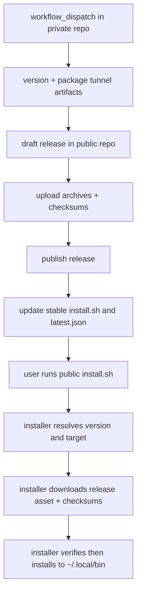
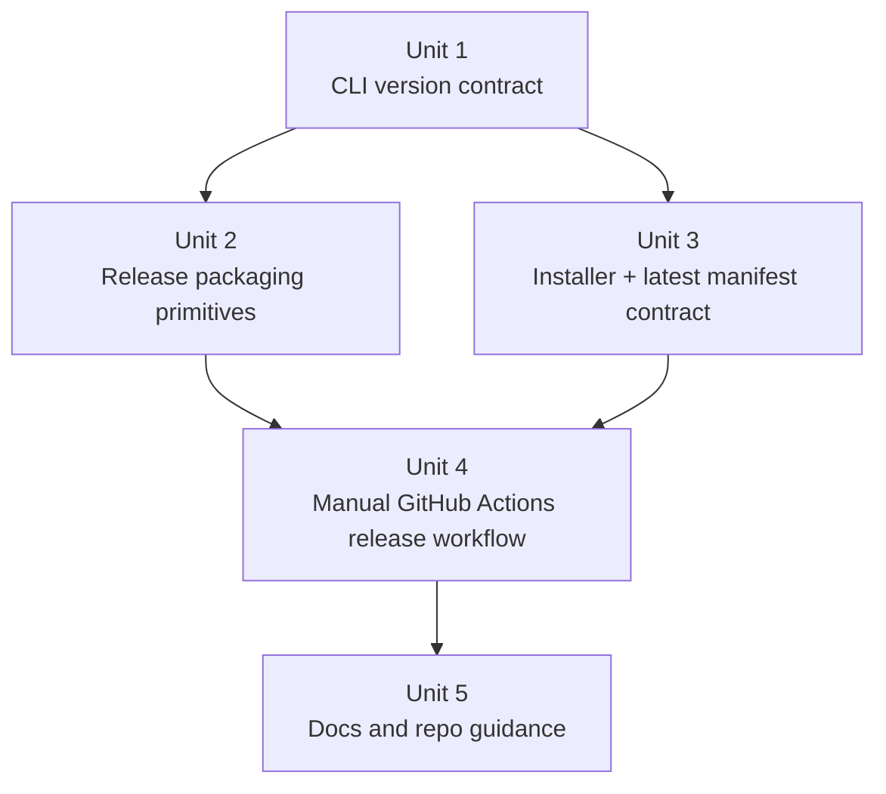
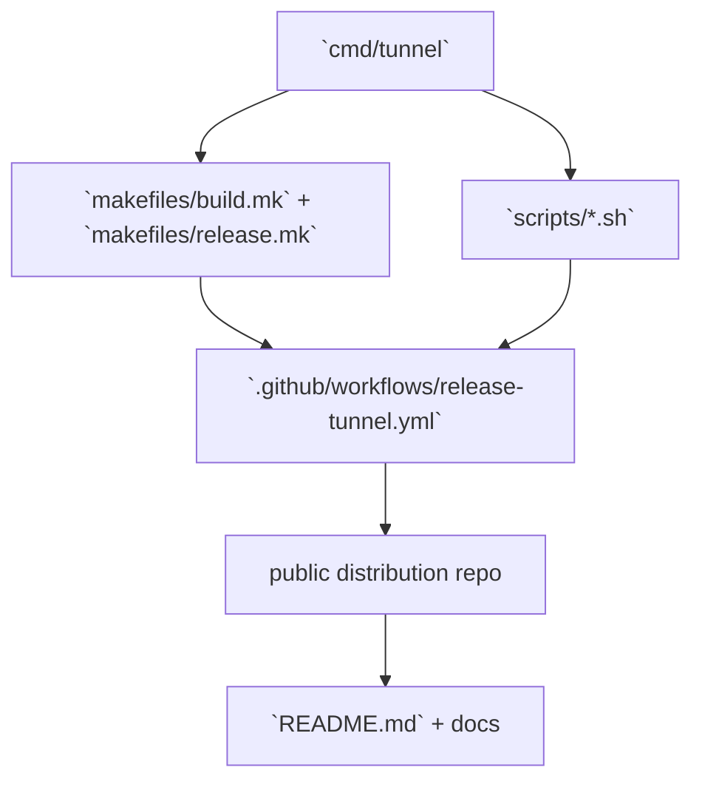

# feat: Add tunnel release distribution workflow

## Overview

Add a release pipeline that keeps `agent-tunnel` as the private source-of-truth while publishing installable `tunnel` binaries through a separate public distribution repo. The private repo will own version metadata, multi-platform packaging, the public installer source, and the manual release workflow; the public repo will remain a thin distribution surface that exposes a stable `install.sh`, a stable latest-release manifest, and GitHub Releases assets.

**Target repos:** this private repo plus the public distribution repo `yuanbohan/tunnel`.

## Problem Frame

`tunnel` currently ships as a source-built CLI, which is workable for contributors but too heavy for end users. The origin requirements define a narrower product: one manual release action in the private repo, four supported Mac/Linux targets, a public `curl | bash` install path, checksum verification, and a default non-`sudo` install into `~/.local/bin` (see origin: `docs/brainstorms/2026-04-12-tunnel-release-distribution-requirements.md`).

The planning challenge is not just "build four binaries." The release surface crosses four externally visible contracts that must stay aligned:

- the built `tunnel` binary must expose a reliable version contract
- the shared Tunnel/Relay compatibility line must remain explicit and stable enough for maintainers to reason about compatibility
- the public distribution repo must expose a stable latest-install contract and public install docs
- the private repo workflow must publish only complete releases, without leaking half-finished public state

The plan therefore keeps this repo authoritative for logic and release metadata, then syncs only the small distribution-facing surface outward.

## Requirements Trace

- R1-R4. Keep the source repo private while publishing installable `tunnel` artifacts and the public installer entrypoint through a separate public distribution repo.
- R5-R10. Add a manual GitHub Actions release flow that builds all four v1 targets, emits predictable artifact names, produces a checksum manifest, and refuses to publish incomplete releases.
- R11-R17. Ship one official shell installer that defaults to the latest stable release, supports `VERSION=...` pinning, auto-detects OS/arch, installs into `~/.local/bin`, avoids `sudo`, prints PATH guidance when needed, and lets users confirm the installed version.
- R18-R20. Verify downloaded artifacts before replacing the local binary and fail closed on unsupported targets, download errors, or checksum mismatches.
- R21-R24. Keep v1 scope limited to `tunnel` plus the shell installer path, and update both user-facing and maintainer-facing docs for the new release process.
- R25. Keep the Tunnel/Relay compatibility contract explicit: same compatibility line guarantees compatibility, and a compatibility-line change removes that guarantee.

## Scope Boundaries

- No Windows support in v1.
- No public binary distribution for `relay` or `relay-migrate`.
- No Homebrew or other package-manager integration in v1.
- No system-wide install target or automatic `sudo`.
- No silent shell-profile edits.
- No requirement that the public distribution repo become the contributor repo or expose private source history.

## Context & Research

### Relevant Code and Patterns

- `cmd/tunnel/args.go`, `cmd/tunnel/args_test.go`, `cmd/tunnel/main.go`, and `cmd/tunnel/main_test.go` are the current CLI contract surface and already contain the startup-path tests most likely to catch a bad `--version` change.
- `makefiles/build.mk` currently builds local binaries plus a `build-linux` target for `linux/amd64`; there is no release-packaging abstraction yet.
- `makefiles/install.mk`, `scripts/install.sh`, and `scripts/deploy.sh` show the repo's current preference for thin Make targets that delegate to explicit shell scripts.
- There is currently no `.github/workflows/` directory, so the release workflow can be introduced cleanly instead of adapting an existing CI graph.
- `README.md` and `docs/deployment.md` currently describe source builds and relay deployment flows but not public CLI distribution.
- `AGENTS.md` and `CLAUDE.md` are used as living repo instructions and should carry any new long-lived distribution boundary that future agents need to respect.

### Institutional Learnings

- No `docs/solutions/` entries exist in this repository.

### External References

- GitHub `workflow_dispatch` supports manual workflow runs with typed inputs and only triggers when the workflow file is on the default branch: https://docs.github.com/en/actions/reference/workflows-and-actions/events-that-trigger-workflows
- GitHub recommends `GITHUB_TOKEN` for workflow auth, but cross-repo publication still needs an additional credential when the workflow must write outside its own repo: https://docs.github.com/en/actions/concepts/security/github_token
- GitHub artifact attestations are available broadly, but private-repo support on Free/Pro/Team is limited; they should not be a hard v1 requirement for this private source repo: https://docs.github.com/en/actions/how-tos/secure-your-work/use-artifact-attestations/use-artifact-attestations

## Key Technical Decisions

| Decision | Choice | Rationale |
|---|---|---|
| Release authority | Publish directly from the private repo workflow | The manual approval point already lives in the private repo. Keeping build, versioning, packaging, installer source, and publication in one workflow avoids split-brain release orchestration. |
| Cross-repo auth | Use a dedicated fine-grained token secret scoped to the public distribution repo for v1 | `GITHUB_TOKEN` is not enough for cross-repo writes. A fine-grained token limited to one repo is the smallest practical credential surface for this repo's current scale. |
| Artifact layout | Publish versioned `tar.gz` archives for all four targets plus one `checksums.txt` | One archive format keeps the installer and docs simple across macOS and Linux. |
| Latest-release lookup | Publish a stable `latest.json` file in the public distribution repo default branch | The installer can resolve "latest" without parsing GitHub API JSON in POSIX shell and without hard-coding versionless asset names. |
| Installer source-of-truth | Keep the installer source in this private repo under an unambiguous path, then sync it to `install.sh` in the public repo | This preserves the public repo as distribution-only and avoids maintaining parallel installer logic by hand. |
| Version contract | Add shared linker-injected build metadata, a `tunnel --version` fast path, and `relay version` | Release assets, support flows, and installer smoke checks all need one stable version-reporting contract. |
| Compatibility contract | Publish a derived compatibility line and treat it as the Tunnel/Relay compatibility boundary | This keeps `v0.1.x` distinct from `v0.2.x` before `v1`, while still collapsing `v1+` compatibility to semver major version. |
| Partial-release handling | Create the public release as draft, upload assets, publish it, then update `latest.json` | This keeps the public "latest" pointer from ever referring to an unpublished or incomplete release. |
| Supply-chain hardening | Make checksums mandatory and attestations optional follow-on work | Checksums are the baseline invariant. Attestations depend on GitHub plan support for private repos and should not block v1. |

## Open Questions

### Resolved During Planning

- Should cross-repo publication be a second workflow owned by the public repo? No. The private repo workflow should remain authoritative and publish directly to the public repo.
- How should the installer resolve the latest release? Through a stable `latest.json` file in the public repo rather than by parsing the GitHub Releases API inside the installer.
- What should the v1 archive layout be? Four versioned `tar.gz` archives plus one `checksums.txt` manifest.
- How should users confirm the installed version? Add a `tunnel --version` fast path with release metadata injected at build time.
- What is the cleanest partial-release recovery posture? Keep the new public release as draft until all assets are uploaded successfully, and only update the stable latest pointer after publish.
- Should attestations be a v1 requirement? No. Keep them as optional follow-on hardening because private-repo support depends on GitHub plan level.

### Deferred to Implementation

- Finalize the public distribution repo name and the exact secret names used in the workflow.
- Decide whether the first implementation also syncs a public-repo README from this repo, or leaves that README as a one-time manual bootstrap.
- Finalize the exact `latest.json` field names once the installer and publish script are drafted together.

## High-Level Technical Design

> *This illustrates the intended approach and is directional guidance for review, not implementation specification. The implementing agent should treat it as context, not code to reproduce.*

The important sequencing constraint is `publish release` before `update latest.json`. That preserves a safe failure mode: a brand-new release may exist without immediately becoming the default install target, but the default install target must never point at unavailable assets.

## Implementation Units

- [x] **Unit 1: Add shared Tunnel/Relay version and compatibility metadata**

**Goal:** Give `tunnel` and `relay` one shared version/compatibility metadata layer, with a `tunnel --version` fast path that works for release builds and local dev builds and exits before launcher resolution or token validation.

**Requirements:** R9, R17, R25

**Dependencies:** None

**Files:**
- Create: `internal/buildinfo/buildinfo.go`
- Create: `internal/buildinfo/buildinfo_test.go`
- Create: `cmd/tunnel/version.go`
- Create: `cmd/relay/version.go`
- Modify: `cmd/tunnel/args.go`
- Modify: `cmd/tunnel/args_test.go`
- Modify: `cmd/tunnel/main.go`
- Modify: `cmd/tunnel/main_test.go`
- Modify: `cmd/relay/command.go`
- Modify: `cmd/relay/command_test.go`

**Approach:**
- Add shared build metadata variables with a sensible dev default so local builds keep working before release packaging exists.
- Derive one compatibility-line helper from the release version so Tunnel and Relay can follow the same contract.
- Extend argument parsing so `--version` is handled as a true fast path rather than as launcher input.
- Ensure the version path does not require `TUNNEL_AUTH_TOKEN`, does not resolve a launcher, and does not touch local terminal setup.
- Keep the output format intentionally short and stable so scripts and support instructions can rely on it.

**Patterns to follow:**
- Existing flag parsing and environment handling style in `cmd/tunnel/args.go`
- Early-exit test style already used in `cmd/tunnel/main_test.go`

**Test scenarios:**
- Happy path: `tunnel --version` prints the build version and exits successfully without requiring `TUNNEL_AUTH_TOKEN`.
- Happy path: `relay version` prints the shared build version without requiring relay startup configuration.
- Happy path: a default local build with no linker overrides still prints a recognizable non-release version marker.
- Happy path: the shared compatibility-line helper treats `v0.1.x` and `v0.2.x` as different compatibility lines, while `v1.2.3` and `v1.9.0` share the same line.
- Edge case: `tunnel --version` wins even when no launcher command is present.
- Error path: normal execution without `--version` still rejects a missing `TUNNEL_AUTH_TOKEN`.
- Integration: the version fast path does not call launcher resolution, local terminal preparation, or session startup hooks in `cmd/tunnel/main_test.go`.

**Verification:**
- Maintainers can inspect a built `tunnel` binary and get one stable version string without entering the normal session startup path.

- [x] **Unit 2: Add tunnel-only multi-platform release packaging primitives**

**Goal:** Introduce first-class packaging targets for `tunnel` release artifacts without disturbing the existing relay deploy flow.

**Requirements:** R6, R7, R8, R10, R21

**Dependencies:** Unit 1

**Files:**
- Modify: `Makefile`
- Modify: `makefiles/build.mk`
- Create: `makefiles/release.mk`
- Create: `scripts/release-package.sh`
- Create: `scripts/test-release-package.sh`

**Approach:**
- Add a dedicated release packaging layer instead of stretching `build-linux`, because the release surface is `tunnel`-only and spans four targets.
- Keep the existing local build targets for contributor workflows intact, then add new release-specific targets that accept a version input and emit versioned archives plus `checksums.txt`.
- Use one predictable archive naming scheme for all targets so the installer never has to special-case macOS versus Linux.
- Keep packaging output isolated from the normal `bin/` developer workflow so contributors do not accidentally confuse local binaries with release artifacts.

**Patterns to follow:**
- Thin Make-target-to-shell-script delegation used by `makefiles/install.mk` and `scripts/install.sh`
- Existing build variable layout in `makefiles/common.mk` and `makefiles/build.mk`

**Test scenarios:**
- Happy path: packaging a release version emits exactly four archives matching the expected version, OS, and architecture naming scheme.
- Happy path: `checksums.txt` contains one entry for each emitted archive and no entries for relay binaries.
- Edge case: rerunning the packaging target for the same version replaces stale local packaging output instead of mixing old and new assets.
- Error path: an unsupported or malformed version input causes packaging to fail before any publish step can start.
- Integration: a packaged archive expands to a single runnable `tunnel` binary whose `--version` output matches the requested release version.

**Verification:**
- One packaging invocation yields the exact artifact set that the release workflow and installer both expect, with a release version that maps to the intended compatibility line.

- [x] **Unit 3: Add the public installer source and stable latest-manifest contract**

**Goal:** Define the public distribution surface that the workflow will sync to the external public repo: installer source, latest-release manifest, and installer smoke coverage.

**Requirements:** R3, R11-R20, R22, R25

**Dependencies:** Unit 1

**Files:**
- Create: `scripts/install-tunnel.sh`
- Create: `scripts/render-latest-manifest.sh`
- Create: `scripts/test-release-installer.sh`

**Approach:**
- Keep the installer source in this repo under an unambiguous name so it does not collide with the existing remote-host `scripts/install.sh`.
- Design the installer around two inputs: pinned version via `VERSION=...`, or latest version resolved from a stable `latest.json` published in the public repo.
- Publish the compatibility line in `latest.json` so public release metadata carries the same Tunnel/Relay contract seen by maintainers.
- Detect `darwin`/`linux` plus `amd64`/`arm64`, map them to the release naming scheme, download the matching archive and `checksums.txt`, verify integrity, then move the binary into `~/.local/bin` atomically.
- Print PATH guidance when needed, but never mutate shell profiles automatically.
- Support a test override for the public base URL so smoke coverage can run against a local fixture rather than the live public repo.

**Execution note:** Start with installer smoke coverage against a local fixture release layout before wiring the real workflow publication step.

**Patterns to follow:**
- Defensive POSIX shell style in `scripts/install.sh` and `scripts/deploy.sh`
- Structured failure messaging already used by the repo's shell automation

**Test scenarios:**
- Happy path: with no `VERSION` override, the installer reads a fixture `latest.json`, downloads the matching archive, verifies it, and installs `tunnel` into a temp `HOME/.local/bin`.
- Happy path: with `VERSION=vX.Y.Z`, the installer bypasses the latest manifest and installs the explicitly requested version.
- Edge case: when `~/.local/bin` is absent from `PATH`, the installer succeeds and prints next-step guidance without trying to edit shell startup files.
- Error path: the installer rejects a `latest.json` whose compatibility line does not match the published version.
- Error path: an unsupported OS or architecture exits with a clear unsupported-target message before download.
- Error path: a checksum mismatch leaves any pre-existing `tunnel` binary untouched.
- Integration: a freshly installed binary reports the same release version the installer requested.

**Verification:**
- The installer works against a local fixture that mirrors the public repo contract and never leaves the caller with a partially replaced binary.

- [x] **Unit 4: Add the manual GitHub Actions release workflow and cross-repo publication path**

**Goal:** Give maintainers one explicit workflow-dispatch entrypoint that packages `tunnel`, publishes a complete release to the public repo, and updates the public stable-install surface only after success.

**Requirements:** R2, R5-R10, R12-R13, R18, R24, R25

**Dependencies:** Unit 2, Unit 3

**Files:**
- Create: `.github/workflows/release-tunnel.yml`
- Create: `scripts/publish-tunnel-release.sh`
- Create: `scripts/test-release-publish.sh`
- Test: `scripts/test-release-package.sh`
- Test: `scripts/test-release-installer.sh`

**Approach:**
- Introduce a manual `workflow_dispatch` workflow with at least a required release version input and a small number of optional maintainer controls only where they materially improve safety.
- Keep source-repo permissions tight, then use a dedicated secret token only for the steps that must create releases or commit stable distribution files in the public repo.
- Treat the publish path as two outputs with different mutability rules:
  - immutable versioned release assets in the public repo's Releases area
  - mutable stable files in the public repo default branch, namely `install.sh`, `latest.json`, and the public install README
- Include the derived compatibility line in the public manifest and release notes so the public release surface carries the same Tunnel/Relay contract as the source repo docs.
- Publish in safe order: package and validate locally, create draft release, upload all assets, publish the release, then update stable public files.
- Expose a local or dry-run publish mode in the publish script so the repo can validate path computation and ordering without hitting the live GitHub API on every test run.

**Patterns to follow:**
- Explicit shell entrypoint pattern already used by `scripts/deploy.sh`
- Existing Make/shell split where GitHub workflow logic stays thin and delegates real work to repo-owned scripts

**Test scenarios:**
- Happy path: a release dispatch with a valid version produces all four assets, uploads them to a draft public release, publishes the release, then advances `latest.json`.
- Edge case: rerunning publication for the same version fails before duplicating or mutating the stable latest pointer unexpectedly.
- Error path: a missing archive or checksum file aborts publication before the public release is published.
- Error path: a dry-run publish validates target repo paths and stable-file updates without performing external writes.
- Integration: the workflow uses the same installer and packaging contracts already exercised by the repo-owned smoke scripts, so the published public surface matches the local fixture surface.

**Verification:**
- Maintainers can publish one complete public `tunnel` release from the private repo with a single manual workflow run, and the public latest pointer never advances to an incomplete release.

- [x] **Unit 5: Update contributor, maintainer, and user docs for the new distribution model**

**Goal:** Document the new install path, release workflow, public distribution boundary, and maintainer recovery steps.

**Requirements:** R1-R4, R23-R25

**Dependencies:** Unit 4

**Files:**
- Modify: `README.md`
- Create: `docs/public-distribution-readme.md`
- Create: `docs/release-distribution.md`
- Modify: `AGENTS.md`
- Modify: `CLAUDE.md`

**Approach:**
- Keep maintainer-facing source-repo docs in `README.md` and `docs/release-distribution.md`, but ensure the external public distribution repo also carries the user-facing install command, pinned-version install form, supported platform matrix, and install location.
- Document the compatibility-line contract everywhere a maintainer or user will look for version expectations.
- Put maintainer workflow details in a dedicated `docs/release-distribution.md` instead of mixing them into relay deployment docs.
- Record the lasting repo boundary in `AGENTS.md` and `CLAUDE.md`: this repo remains the private source-of-truth, while the public repo is a distribution-only surface.
- Include recovery guidance for interrupted public releases and for the credential/bootstrap prerequisites needed before the first release can run.

**Patterns to follow:**
- Existing top-level README style and operational-doc prose in `docs/deployment.md`
- Instruction-file update expectations already stated in `AGENTS.md` and `CLAUDE.md`

**Test scenarios:**
- Test expectation: none -- this unit is documentation-only, but the edited docs must agree on the public distribution boundary, install commands, supported targets, and maintainer recovery flow.

**Verification:**
- A first-time user can install `tunnel` from the public distribution repo docs alone, and a first-time maintainer can bootstrap and rerun the release flow without tribal knowledge.

## System-Wide Impact

- **Interaction graph:** `cmd/tunnel` version metadata feeds release packaging; release packaging and installer scripts feed the workflow; the workflow updates the external public repo; the docs explain both the user entrypoint and the maintainer flow.
- **Error propagation:** version or compatibility-line drift can break packaging, installer smoke checks, and user support simultaneously; publish-order mistakes can make `latest.json` point at unavailable assets; checksum failures must stop before any local binary replacement.
- **State lifecycle risks:** the public repo contains one mutable latest pointer and immutable versioned assets; the release workflow must preserve that distinction.
- **API surface parity:** the new external contract surfaces are `.github/workflows/release-tunnel.yml`, workflow inputs, the public `install.sh`, the public `latest.json`, the public distribution README, `tunnel --version`, `relay version`, and the shared compatibility-line contract.
- **Integration coverage:** the highest-value coverage is fixture-backed end-to-end smoke testing from packaged archive through installer execution and final `tunnel --version` verification.
- **Unchanged invariants:** relay auth, attach semantics, relay deployment flow, and `relay` / `relay-migrate` distribution remain unchanged.

## Risks & Dependencies

| Risk | Mitigation |
|------|------------|
| Cross-repo credential is too broad or gets reused casually | Use one fine-grained token scoped to the public distribution repo only, isolate it to publish steps, and document it as a release-only secret |
| Public stable files drift from the private source-of-truth | Treat `scripts/install-tunnel.sh` and manifest generation in this repo as canonical and sync outward from the workflow rather than editing the public repo by hand |
| `latest.json` points to a release whose assets are not yet public | Keep the public release draft until asset upload completes, then publish the release before advancing the stable latest manifest |
| Installer portability breaks on one shell platform | Keep the installer POSIX-shell compatible, avoid `jq` as a runtime dependency, and cover both latest and pinned install paths with fixture-backed smoke tests |
| Release packaging logic accidentally bleeds into relay deployment targets | Put release packaging in a dedicated Make include and scripts so the existing relay deployment path keeps its current semantics |
| Artifact attestations are assumed available but the private repo plan tier does not support them | Keep checksums mandatory and treat attestations as optional hardening that can be enabled later without blocking the core release flow |

## Documentation / Operational Notes

- The first release requires an external bootstrap step: create the public distribution repo, set its default branch, and add the fine-grained publish token secret to the private repo.
- Maintainer docs should explicitly name the stable public installer URL pattern and the recovery steps for a failed draft release.
- The public distribution repo should be treated as generated distribution state. Manual edits there should be limited to emergency repair and then folded back into this repo.

## Alternative Approaches Considered

- Make the source repo public.
  Rejected because the requirements explicitly keep the source repo private.

- Use a second workflow in the public repo to publish releases after a dispatch from the private repo.
  Rejected for v1 because it adds another approval boundary and another place where release state can drift.

- Adopt GoReleaser immediately.
  Not chosen for v1 because this repo already prefers explicit Make + shell automation, and the cross-repo public-sync requirements are custom enough that a small auditable first-party pipeline is easier to reason about here.

## Sources & References

- **Origin document:** `docs/brainstorms/2026-04-12-tunnel-release-distribution-requirements.md`
- Related code: `cmd/tunnel/args.go`
- Related code: `cmd/tunnel/main.go`
- Related code: `makefiles/build.mk`
- Related code: `makefiles/install.mk`
- Related code: `scripts/install.sh`
- Related code: `scripts/deploy.sh`
- External docs: https://docs.github.com/en/actions/reference/workflows-and-actions/events-that-trigger-workflows
- External docs: https://docs.github.com/en/actions/concepts/security/github_token
- External docs: https://docs.github.com/en/actions/how-tos/secure-your-work/use-artifact-attestations/use-artifact-attestations
