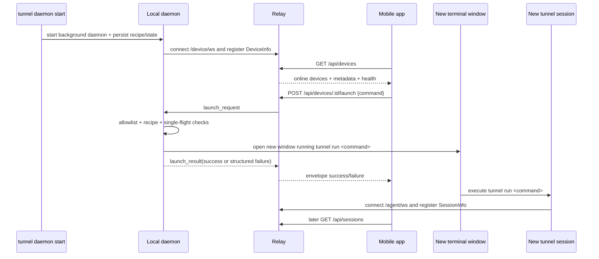
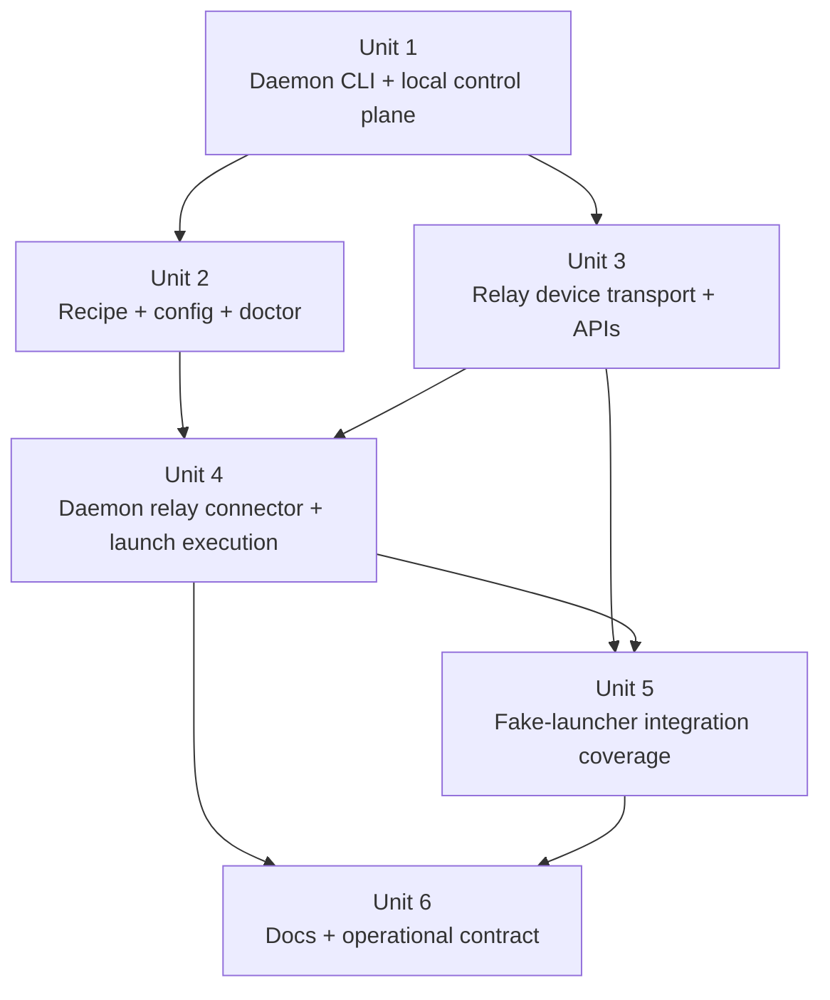

# feat: Add mobile device launch daemon

## Revised Plan

This section supersedes the more relay-heavy draft below. For implementation, follow this simplified plan as the current source of truth.

### Revised Goal

Let a mobile client ask one online desktop machine to open a new terminal window running `tunnel run <command>`, while keeping device state owned by the machine-local daemon rather than by the relay.

### Core Simplification

- The daemon is the state source.
- The relay is only a broker for currently online daemon websockets.
- If a daemon disconnects, its entry disappears immediately.
- The relay does not keep offline-device state in memory, PostgreSQL, Redis, or any other store.
- The relay does not own device health, last failure, launcher recipe, or busy state as product concepts.

### Revised Relay Responsibilities

The relay keeps only the minimum transient routing state needed to service live requests:

- authenticated `/device/ws` connections
- `user_id -> device_id -> websocket` lookup for online daemons
- the latest registration payload for each currently connected daemon
- in-flight `request_id -> waiting HTTP response` linkage for one request/reply round-trip

When the websocket closes, the relay removes that daemon immediately. Nothing survives disconnect.

### Revised Daemon Responsibilities

The daemon owns and persists machine-local state:

- stable `device_id`
- `display_name`
- `platform_family`
- `platform_id`
- allowlist config
- launcher recipe
- local `busy` state
- local `last_failure`
- local `status` / `doctor`

The daemon decides whether a launch request succeeds or fails and returns structured reasons such as:

- `busy`
- `command_not_allowed`
- `desktop_unavailable`
- `tunnel_not_found`
- `terminal_launch_failed`

### Revised API Contract

#### `GET /api/devices`

Return only daemons whose `/device/ws` connection is online right now.

Minimal device payload:

- `device_id`
- `display_name`
- `platform_family`
- `platform_id`

Do not include relay-owned `launch_health`, `last_failure`, or other derived daemon state in v1.

#### `POST /api/devices/:deviceID/launch`

- If no online websocket exists for that `device_id`, return `device_offline`.
- Otherwise relay forwards `launch_request` to the daemon and waits for `launch_result`.
- The daemon's result is returned to the mobile client without relay-side reinterpretation beyond normal envelope handling.

### Revised Message Flow

1. User runs `tunnel daemon start` locally.
2. Daemon loads local config and state, infers launcher recipe, and connects to `/device/ws`.
3. Daemon sends a thin register payload:
   - `device_id`
   - `display_name`
   - `platform_family`
   - `platform_id`
4. Mobile calls `GET /api/devices` and sees only currently online daemons.
5. Mobile calls `POST /api/devices/:id/launch`.
6. Relay forwards the request to the matching websocket.
7. Daemon decides success/failure locally and returns `launch_result`.
8. Relay returns that result to the mobile client.
9. If the daemon websocket disconnects at any point, the daemon disappears from `GET /api/devices`.

### Revised Scope Boundaries

- No relay-owned offline device inventory.
- No relay-owned device health model.
- No relay-owned long-lived `busy` or failure state.
- No database or Redis changes for daemon presence.
- No auto-attach after launch.
- No Windows support.
- No headless/server launch mode.

### Revised Implementation Units

- **Unit A: Local daemon control plane**
  - Keep `tunnel daemon start|status|stop|doctor`
  - Keep machine-local config/state/recipe handling
  - Keep daemon-owned `busy` / `last_failure` / `doctor`

- **Unit B: Thin relay broker**
  - Keep `/device/ws`
  - Keep only online websocket lookup and request/reply routing
  - Drop relay-side device-health and device-state-management ambitions

- **Unit C: Thin mobile-facing device APIs**
  - `GET /api/devices` lists online daemons only
  - `POST /api/devices/:deviceID/launch` forwards one launch request and returns one result

- **Unit D: Desktop launch execution**
  - Daemon validates allowlist and prerequisites locally
  - Daemon opens a new terminal window and runs `tunnel run <command>`
  - Daemon returns structured launch failure reasons

- **Unit E: Docs**
  - Rewrite API and architecture docs to describe relay as a live broker, not a device state manager

### Revised Security Boundary

One relay-side cleanup behavior should still remain even in the simplified model:

- if an agent token is revoked, any live `/device/ws` connections authenticated with that token must be disconnected immediately

This is connection invalidation, not product-state management.

## Overview

Add a new `tunnel daemon` control surface that lets a desktop user explicitly enable remote launch on one machine, keeps that machine visible to the relay as an online device, and lets the mobile app request that the machine open a new terminal window running `tunnel run <command>`. The existing `tunnel run <command>` path, `/agent/ws` session registration, `GET /api/sessions`, and attach contract remain intact; this work adds a second live-only control path for online devices and launch requests.

## Problem Frame

The current product only supports discovering and attaching to sessions that are already online. The origin requirements define a different workflow: the user explicitly starts a background daemon on a desktop machine, later selects that machine from mobile, and asks it to create a brand-new `tunnel` session in a new visible terminal window. This is cross-cutting work touching the `tunnel` CLI, a new local daemon runtime, relay live state, app-facing APIs, and platform-specific desktop launch behavior (see origin: `docs/brainstorms/2026-04-17-mobile-device-session-launch-requirements.md`).

The plan must preserve three non-negotiable boundaries from the origin document:

- `tunnel run <command>` remains the primary direct-launch UX and must not change.
- The daemon is explicitly user-managed with `tunnel daemon start|status|stop|doctor`; it is not a login item or system service.
- v1 is desktop-GUI only and always opens a new terminal window; it does not target server-only machines or existing terminal tabs.

## Requirements Trace

- R1-R10. Add a new online-device model, user-scoped device listing, and mobile launch flow that is distinct from session attach.
- R11-R23. Add a `tunnel daemon` CLI surface, local daemon lifecycle, read-only `status`, and light-probe `doctor` semantics.
- R24-R32. Infer and persist a launcher recipe, keep it stable for one daemon lifetime, degrade instead of auto-healing, and standardize launches on a new visible terminal window that returns to a shell prompt after `tunnel run <command>` exits.
- R33-R41. Enforce first-token allowlisting, preserve existing auth boundaries, and expose structured launch failures plus single-flight launch behavior.
- R42-R48 and success criteria. Keep support limited to macOS and Linux desktop GUI sessions, leave Windows and headless servers out of scope, and document the resulting public and operator-facing contracts.

## Scope Boundaries

- No Windows implementation in this plan.
- No headless/server launch mode; `tunnel daemon start` must fail without a usable desktop GUI session.
- No auto-attach from mobile into the new session.
- No queueing or batching of launch requests; one in-flight launch per device only.
- No automatic recipe healing or silent rebinding after launcher failures.
- No tab injection into existing terminal windows.

## Context & Research

### Relevant Code and Patterns

- `cmd/tunnel/cmd.go` is now the Cobra root command and is the correct extension point for `tunnel daemon ...`.
- `cmd/tunnel/main.go` still owns the current session startup path and should remain the single implementation of direct `tunnel run <command>` launches.
- `internal/tunnel/launcher/registry.go` already centralizes PATH-based executable resolution and should remain the pattern for validating requested launcher binaries.
- `internal/tunnel/session/process.go` is the current PTY owner for spawned sessions and shows how launched commands are wrapped as `Running` sessions.
- `internal/protocol/message.go` holds JSON protocol types for relay/session transport today; adding a separate device-transport contract here keeps protocol-facing types centralized.
- `internal/relay/session/registry.go` is the live-only in-memory session registry pattern to mirror for an online-device registry without mixing runtime state into PostgreSQL persistence.
- `internal/relay/handler/new.go`, `internal/relay/handler/api/sessions.go`, and `internal/relay/handler/agent/ws.go` show the current split between app HTTP routes and authenticated websocket endpoints.
- `internal/relay/handler/rest_api_test.go` and `internal/relay/handler/ws_api_test.go` are the existing contract-level test seams for user-scoped HTTP and websocket behavior.
- `cmd/migrate/main.go` shows a current Cobra command that already uses explicit env-file precedence and validation patterns that are relevant for user-editable daemon config and state path decisions.

### Institutional Learnings

- No `docs/solutions/` directory or prior institutional write-up exists in this repo for device daemons, desktop launchers, or user-managed background processes. The plan therefore leans on repo patterns plus targeted external references rather than documented local prior art.

### External References

- Apple Terminal User Guide: Terminal is scriptable via AppleScript and can be automated from `osascript`. This is the primary macOS grounding for a script-driven terminal launch path.
  - https://support.apple.com/guide/terminal/trml1003/mac
- iTerm2 scripting reference: iTerm2 exposes AppleScript commands such as `create window with default profile command "..."`, which is the primary source for a supported iTerm-backed launch recipe on macOS.
  - https://iterm2.com/3.3/documentation-scripting.html
- `xdg-terminal-exec(1)`: a freedesktop-aligned utility that launches the preferred terminal emulator and supports passing a command and `--hold`. This is useful as the first-choice Linux GUI launcher when available, but the plan cannot assume it exists on every desktop.
  - https://manpages.debian.org/testing/xdg-terminal-exec/xdg-terminal-exec.1.en.html

## Key Technical Decisions

- **Use a dedicated device transport instead of overloading `/agent/ws`**: Add a separate `/device/ws` websocket plus dedicated live-only device registry. Rationale: device lifecycle, request/reply launch semantics, and degraded health are materially different from session attach routing, and mixing them into `SessionInfo` or `AgentFrame` would blur two distinct runtime models.
- **Keep relay state live-only for devices just like sessions**: The relay will list only currently connected devices and will not persist offline device records in PostgreSQL. Rationale: this matches the origin scope and existing session-registry architecture, minimizing new durable state.
- **Adopt a per-user local control plane for `tunnel daemon`**: Manage the background daemon with a local Unix socket plus state metadata under user-scoped config/runtime directories instead of job-control semantics. Rationale: `start`, `status`, `stop`, and `doctor` need stable IPC even after the launching shell exits, and macOS/Linux both support Unix sockets.
- **Store daemon config, runtime IPC, and persisted state in distinct user-scoped locations**: Use `os.UserConfigDir()` for the editable allowlist config, a short user-scoped runtime directory (for example `XDG_RUNTIME_DIR` on Linux or an app-owned temp/runtime directory on macOS) for the control socket, and a user state/cache directory for PID, recipe, and last-failure metadata. Rationale: sockets need a short, ephemeral path, while config and health metadata should survive across shell exits without inventing ad hoc locations.
- **Persist a local stable `device_id` alongside daemon state**: Generate one device identifier per machine-local daemon state directory and reuse it on reconnect so relay presence, busy state, and mobile targeting stay stable across websocket reconnects and daemon restarts. Rationale: hostnames are display labels, not durable identifiers, and relay request routing should not depend on ephemeral connection IDs.
- **Refresh display metadata separately from stable identity**: Persist only the stable `device_id`, but collect and re-register current device metadata such as a human-friendly display name, `platform_family`, `platform_id`, hostname, and launch health whenever the daemon starts or reconnects to the relay. Rationale: users need fresh device labels in mobile UI, while relay routing, ownership checks, and platform-specific icons need structured metadata rather than a durable identity string that drifts over time.
- **Split platform metadata into family plus specific ID**: Device registration should always include a stable `platform_family` for coarse UI fallback (`macos`, `linux`) and should include a more specific `platform_id` when detectable (`macos`, `ubuntu`, `arch`, `debian`, `fedora`, or `unknown`). Rationale: mobile clients can map exact icons when they know the distribution, but still fall back safely to a generic family icon when they do not.
- **Model launch success as “terminal window launch accepted locally,” not “new session already registered”**: The relay returns success once the daemon has validated allowlist/launcher prerequisites and successfully handed the command to the terminal launcher. Rationale: mobile launch and session attach are intentionally separate, and waiting for later `tunnel` session registration would create brittle cross-process coupling and longer timeouts.
- **Keep launcher recipes sticky and health-tracked**: `tunnel daemon start` infers a recipe once, persists it, and reports degraded health on later failures until the user explicitly restarts the daemon. Rationale: this preserves the explicit, low-magic product posture from the origin doc.
- **Standardize v1 desktop launches on new windows**: Even when a terminal supports tabs, the daemon opens a new window and uses a command wrapper that returns to an interactive shell prompt after `tunnel run <command>` exits. Rationale: users can find new windows more reliably than tabs in an arbitrary existing window, and this keeps launch semantics uniform across macOS and Linux GUI desktops.

## Open Questions

### Resolved During Planning

- **Where should daemon commands live?** Under the existing Cobra root command as `tunnel daemon ...`, alongside `tunnel run` and `tunnel auth`.
- **Should the relay persist devices?** No. Devices stay live-only and in-memory, parallel to session presence.
- **What local persistence model should back `start/status/stop/doctor`?** A per-user local control socket plus config/state files, not shell/session binding.
- **What device information is durable versus dynamic?** Only `device_id` is durable; display name, `platform_family`, `platform_id`, hostname, and health are refreshed whenever the daemon registers with the relay.
- **How should the mobile launch API report success?** As a synchronous request/reply over relay-to-device transport with structured success/failure, but without waiting for later session discovery.
- **What is the default terminal presentation?** Always a new terminal window that stays open and returns to a shell prompt after the launched session exits.

### Deferred to Implementation

- **Exact Linux recipe inference order**: The plan intentionally fixes the contract shape but leaves the exact probe order between `xdg-terminal-exec` and desktop-specific fallbacks to implementation, because it depends on the supported desktop environments available during development.
- **Exact `doctor` checklist wording and exit-code plumbing details**: The behavior is fixed, but the concrete output labels can be finalized once the local runtime and launcher probes exist.
- **Exact platform detection source order on Linux**: The contract requires `platform_family` and best-effort `platform_id`, but implementation can choose the final probe order across `/etc/os-release`, desktop-environment hints, or other local signals.
- **Exact ready/timeout values for launch request round-trips**: The plan assumes a bounded relay-side timeout and daemon-side cleanup path, but the precise value can be finalized while implementing and testing the request lifecycle.

## High-Level Technical Design

> *This illustrates the intended approach and is directional guidance for review, not implementation specification. The implementing agent should treat it as context, not code to reproduce.*

## Alternative Approaches Considered

- **Bind the daemon to the launching shell/tab lifecycle**: Rejected because it makes remote-launch availability disappear when a user closes the original terminal surface, which directly conflicts with the chosen explicit `start`/`stop` model.
- **Reuse `/agent/ws` and `SessionInfo` for device registration**: Rejected because devices and sessions have different identity, health, and request/response semantics; merging them would make both protocol surfaces less clear.
- **Launch into existing tabs when possible**: Rejected because the resulting session location is much harder for users to find and depends on whichever window happened to be active.

## Implementation Units

- [ ] **Unit 1: Add the local daemon control plane and Cobra command surface**

**Goal:** Introduce `tunnel daemon start|status|stop|doctor` as explicit subcommands, create the background-runtime process model, and provide a stable local IPC layer that survives the launching shell.

**Requirements:** R2, R11-R18, R39-R41

**Dependencies:** None

**Files:**
- Modify: `cmd/tunnel/cmd.go`
- Modify: `cmd/tunnel/main.go`
- Modify: `cmd/tunnel/main_test.go`
- Modify: `cmd/tunnel/args_test.go`
- Create: `internal/tunnel/daemon/paths.go`
- Create: `internal/tunnel/daemon/control.go`
- Create: `internal/tunnel/daemon/runtime.go`
- Test: `internal/tunnel/daemon/control_test.go`
- Test: `internal/tunnel/daemon/runtime_test.go`

**Approach:**
- Extend the Cobra root command so `tunnel daemon` is a real subcommand tree alongside the existing `tunnel run` and `tunnel auth` subcommands.
- Introduce a per-user local control socket plus runtime metadata (PID, start time, recipe health summary) so `status`, `stop`, and `doctor` can interrogate a detached daemon reliably.
- Make `tunnel daemon start` spawn a background child of the current executable and wait for an explicit “ready” signal before returning success. This avoids shell-specific `nohup`/`&` semantics and keeps the CLI contract portable across macOS and Linux.
- Build stale-socket and already-running detection into the local control layer so repeated `start` and `status` calls behave predictably.
- Reserve `daemon` as the management namespace while keeping an explicit `--` parsing escape hatch for bare launcher commands so users can still run a real launcher named `daemon` if needed.

**Patterns to follow:**
- `cmd/tunnel/cmd.go` for Cobra root command conventions
- `cmd/migrate/main.go` for explicit validation and environment precedence patterns
- `cmd/tunnel/main_test.go` for runtime injection and fast-path command testing

**Test scenarios:**
- Happy path: `tunnel daemon start` launches one background runtime, receives a ready signal, and returns without affecting `tunnel run <command>` behavior.
- Edge case: a second `tunnel daemon start` while the daemon is already running reports the existing runtime instead of starting a duplicate.
- Edge case: `tunnel daemon status` against a stale socket or dead PID reports “not running” rather than hanging.
- Edge case: `tunnel run daemon --flag` still reaches the direct launcher path for a real launcher binary literally named `daemon`.
- Error path: daemon startup fails before readiness and the parent command returns a non-zero error without leaving orphaned state files behind.
- Integration: `tunnel daemon stop` reaches the running daemon over the local control socket, terminates it, and removes the device from future online registration once relay connectivity exists.

**Verification:**
- The repo has one stable CLI path for daemon management, and local lifecycle commands can interrogate or stop a detached daemon without relying on the original terminal process.

- [ ] **Unit 2: Implement allowlist config, launcher recipe persistence, and doctor probes**

**Goal:** Add the user-editable allowlist config, infer and persist launcher recipes at start time, surface degraded health, and implement the `doctor` contract as a light active-probe checklist.

**Requirements:** R16-R38, success criteria for degraded devices and `doctor`

**Dependencies:** Unit 1

**Files:**
- Create: `internal/tunnel/daemon/config.go`
- Create: `internal/tunnel/daemon/config_test.go`
- Create: `internal/tunnel/daemon/recipe.go`
- Create: `internal/tunnel/daemon/recipe_test.go`
- Create: `internal/tunnel/daemon/doctor.go`
- Create: `internal/tunnel/daemon/doctor_test.go`
- Create: `internal/tunnel/daemon/launcher_darwin.go`
- Create: `internal/tunnel/daemon/launcher_darwin_test.go`
- Create: `internal/tunnel/daemon/launcher_linux.go`
- Create: `internal/tunnel/daemon/launcher_linux_test.go`

**Approach:**
- Define one JSON config file under the user config directory with a minimal v1 schema: allowed command names plus any daemon-local launch settings needed for recipe persistence.
- Define one persisted launcher-recipe shape with explicit fields for platform strategy, health state, and enough launch metadata to reopen a new terminal window later without re-detecting the environment on every request.
- Add recipe inference at `tunnel daemon start`: macOS should choose a scriptable terminal strategy grounded in the terminal environment it started from; Linux should infer and persist a concrete GUI window-launch strategy from the current desktop environment, with terminal-specific launchers or freedesktop helpers such as `xdg-terminal-exec` treated as candidate recipes rather than a semantic fallback to “whatever the system default terminal is.”
- Implement `doctor` as a local-first checklist that probes relay reachability, GUI availability, recipe viability, config readability, and `tunnel` binary lookup without launching a real terminal window.
- Persist degraded health and last-failure details so both `status` and the relay-facing device registration can surface them.

**Patterns to follow:**
- `internal/tunnel/launcher/registry.go` for PATH-based executable validation
- `cmd/migrate/main.go` for file-backed config precedence and validation style
- `internal/relay/handler/response/response.go` as the source of truth for structured failure reason naming, even though `doctor` itself is local-only

**Test scenarios:**
- Happy path: reading a valid allowlist config returns the configured first-token allowlist and default entries when the config file is absent.
- Edge case: malformed config content marks config parsing as failed for `doctor` and keeps launch requests from executing.
- Edge case: recipe inference on a supported GUI environment persists a stable strategy and reuses it across later `status` and launch attempts.
- Error path: `tunnel daemon start` on a machine without a supported desktop-launch environment fails before the device can be advertised online.
- Error path: recipe health transitions to degraded after a launcher probe fails, and `status` reports that degraded state without attempting auto-heal.
- Integration: `tunnel daemon doctor` returns `0` only when all checks are `ok`, and any `warn` or `fail` produces one non-zero exit code while still printing the full checklist.

**Verification:**
- The daemon has one portable config and recipe model, and both `status` and `doctor` can explain whether the machine is currently healthy enough for remote launch.

- [ ] **Unit 3: Add relay device protocol, live registry, and app-facing device APIs**

**Goal:** Introduce a dedicated live-only device transport and user-scoped device APIs without disturbing the existing session attach protocol.

**Requirements:** R1-R10, R39-R46

**Dependencies:** Unit 1 only for local CLI naming alignment; otherwise independent

**Files:**
- Create: `internal/protocol/device.go`
- Create: `internal/protocol/device_test.go`
- Create: `internal/relay/device/registry.go`
- Create: `internal/relay/device/registry_test.go`
- Create: `internal/relay/handler/api/devices.go`
- Create: `internal/relay/handler/device/ws.go`
- Create: `internal/relay/handler/types/device.go`
- Modify: `internal/relay/handler/new.go`
- Modify: `internal/relay/bootstrap/module.go`
- Modify: `internal/relay/handler/response/response.go`
- Test: `internal/relay/handler/rest_api_test.go`
- Test: `internal/relay/handler/ws_api_test.go`

**Approach:**
- Add a dedicated device protocol contract parallel to session protocol types: `DeviceInfo`, device register/update frames, launch request frames, and launch result frames.
- Create a live-only device registry keyed by a daemon-persisted stable device ID, storing owner metadata, current display metadata, current health, and at-most-one in-flight launch state per device.
- Add `GET /api/devices` for online device listing and `POST /api/devices/:deviceID/launch` for mobile-triggered launches. These routes should reuse the existing app bearer auth model and envelope response style.
- Add a dedicated `/device/ws` websocket authenticated with agent tokens, analogous to `/agent/ws` but device-oriented rather than session-oriented.
- Keep single-flight launch orchestration inside the device registry so “busy” is authoritative at the relay layer rather than being reconstructed ad hoc in handlers.

**Execution note:** Start with handler- and registry-level contract tests for device listing, cross-user visibility, and busy/offline launch failure behavior before filling in the websocket transport details.

**Patterns to follow:**
- `internal/relay/session/registry.go` for live-only presence and owner scoping
- `internal/relay/handler/new.go` for route assembly and auth-group structure
- `internal/relay/handler/rest_api_test.go` and `internal/relay/handler/ws_api_test.go` for envelope and websocket contract coverage

**Test scenarios:**
- Happy path: a device connected over `/device/ws` appears in `GET /api/devices` only for the owning user and exposes health/degraded fields.
- Happy path: device-list responses always include `platform_family`, and include a best-effort `platform_id`, so mobile clients can prefer exact icon mapping and fall back to family-level icons without string guessing.
- Edge case: an online but degraded device is listed as online yet not launchable, and the app API surface reflects that state consistently.
- Error path: a cross-user `POST /api/devices/:id/launch` request behaves as not found/inaccessible rather than leaking another user’s online device presence.
- Error path: a second launch request to the same device while one request is in flight returns structured `busy` without queueing.
- Integration: reconnecting the same daemon with the same persisted `device_id` replaces the prior live entry instead of creating duplicate devices in `GET /api/devices`.
- Integration: if a device websocket disconnects during an in-flight launch request, the waiting app request resolves with a structured offline/service-unavailable result and the in-flight slot is cleared.

**Verification:**
- The relay can track online devices separately from sessions, list them safely per user, and broker one structured launch request at a time through a dedicated websocket path.

- [ ] **Unit 4: Connect the daemon to relay launch requests and execute desktop launches**

**Goal:** Make the background daemon register with `/device/ws`, answer launch requests, validate allowlist and prerequisites, open a new terminal window, and return structured launch results.

**Requirements:** R6-R10, R24-R32, R39-R46

**Dependencies:** Units 2 and 3

**Files:**
- Create: `internal/tunnel/daemon/connector.go`
- Create: `internal/tunnel/daemon/connector_test.go`
- Modify: `internal/tunnel/daemon/runtime.go`
- Modify: `internal/tunnel/daemon/control.go`
- Test: `internal/tunnel/daemon/runtime_test.go`
- Test: `internal/tunnel/daemon/launcher_darwin_test.go`
- Test: `internal/tunnel/daemon/launcher_linux_test.go`

**Approach:**
- Add a daemon-side relay connector separate from `internal/tunnel/connector/connector.go` because the transport shape is request/reply device control, not session attach and PTY bytes.
- Register device metadata that includes the stable `device_id` plus refreshed display fields for mobile UI, including a human-friendly device name, `platform_family`, `platform_id`, hostname, launcher health, and enough diagnostic context for local `status`.
- On each launch request, enforce one in-flight operation locally, re-check recipe health, read allowlist config, preflight the `tunnel` executable, and then invoke the remembered launcher recipe to open a new terminal window with a wrapper that returns to an interactive shell prompt after the launched `tunnel run ...` process exits.
- Build launch commands from a parsed argv model and escape only at the final launcher boundary so relay/device plumbing never concatenates untrusted raw shell fragments into an intermediate command string.
- Return structured launch results to the relay with explicit failure reasons (`busy`, `command_not_allowed`, `desktop_unavailable`, `terminal_launch_failed`, `tunnel_not_found`) and persist the latest failure for later `status`/`doctor` output.
- Keep success/failure boundaries consistent with the plan’s earlier decision: success means the terminal window launch was accepted locally, not that the later `tunnel` session already appeared in `GET /api/sessions`.

**Patterns to follow:**
- `internal/tunnel/connector/connector.go` for websocket lifecycle management and injected test seams
- `cmd/tunnel/main.go` for how `tunnel` currently assembles session metadata and relay startup gating
- `internal/tunnel/session/process.go` for process lifecycle expectations once a launched `tunnel` session actually starts

**Test scenarios:**
- Happy path: a healthy daemon connects to `/device/ws`, receives a launch request, launches a new terminal window command, and returns a structured success result.
- Happy path: after a successful launch acceptance, a later `tunnel` process started from that new window still registers a normal session through the unchanged `/agent/ws` path.
- Edge case: a launch request for a command with an allowed first token and extra arguments passes the full argument tail through unchanged.
- Edge case: arguments containing spaces or shell-sensitive characters survive wrapper construction without being split, dropped, or reinterpreted before `tunnel` receives them.
- Error path: the daemon rejects disallowed first tokens with `command_not_allowed` without attempting terminal launch.
- Error path: missing GUI session, missing `tunnel` binary, unsupported launcher environment, or launcher invocation failure each map to their own structured failure reason and update daemon health/failure state.
- Error path: if the daemon loses relay connectivity mid-request, it clears local single-flight state and does not remain permanently “busy.”

**Verification:**
- A running daemon can round-trip a launch request from relay to local desktop launch and back to a structured result without changing the existing direct `tunnel` session path.

- [ ] **Unit 5: Add non-GUI integration coverage with a fake launcher seam**

**Goal:** Prove the end-to-end launch workflow across app API, device websocket, daemon runtime, and later session registration without depending on a real desktop GUI in test environments.

**Requirements:** R3-R10, R17-R23, R42-R46, success criteria for busy/degraded behavior

**Dependencies:** Units 3 and 4

**Files:**
- Create: `internal/e2e/device_launch_test.go`
- Modify: `internal/e2e/client.go`
- Modify: `internal/e2e/harness.go`
- Modify: `internal/e2e/local_regression_test.go`
- Test: `internal/tunnel/daemon/connector_test.go`

**Approach:**
- Introduce an injectable fake-launcher seam in daemon runtime so tests can simulate “new terminal window launched” without needing a real GUI session in CI or local headless runs.
- Extend the existing E2E app client utilities with device-list and device-launch helpers so the same test harness can cover login, device listing, launch request submission, and later session discovery.
- Use the existing deterministic `cmd/e2e-launcher` program as the launched `tunnel run <command>` target so the new regression coverage can assert that a launched session later appears and remains attachable after the launch API succeeded.
- Keep GUI-specific behavior itself covered at unit seams via recipe and launcher tests; do not make CI depend on a real desktop session.

**Patterns to follow:**
- `internal/e2e/local_regression_test.go` for current multi-layer regression coverage
- `internal/e2e/client.go` for app bearer API helpers
- `cmd/e2e-launcher/main.go` for deterministic launched-session behavior

**Test scenarios:**
- Happy path: login -> list devices -> launch allowed command -> later list sessions shows the new session -> attach still works on that session.
- Edge case: a degraded device still appears in `GET /api/devices` but its launch request returns the stored structured failure state.
- Error path: launching a disallowed command returns `command_not_allowed` and does not create a session.
- Error path: issuing two launch requests concurrently against the same device yields one success path and one `busy` path.
- Integration: stopping the daemon removes the device from `GET /api/devices` while leaving already launched sessions to follow the unchanged session lifecycle.

**Verification:**
- The repo has deterministic, non-GUI integration coverage for the new device-launch workflow and its main failure modes.

- [ ] **Unit 6: Update public docs, architecture docs, and operator guidance**

**Goal:** Re-document the product and operational contract so CLI users, mobile clients, and future implementers all see the same device-launch model.

**Requirements:** R12-R23, R42-R48 and the documentation expectations in `AGENTS.md`

**Dependencies:** Units 1-5

**Files:**
- Modify: `README.md`
- Modify: `docs/api.md`
- Modify: `docs/protocol.md`
- Modify: `docs/architecture.md`
- Modify: `docs/operation.md`
- Modify: `CLAUDE.md`
- Modify: `AGENTS.md`

**Approach:**
- Document the new `tunnel daemon` subcommands, the explicit user-managed daemon model, config-file expectations, desktop-only scope, and new app-facing device endpoints.
- Extend protocol and architecture docs so device presence, `/device/ws`, launch request/result semantics, degraded state, and unchanged session attach invariants are all described together.
- Keep the docs explicit that v1 is GUI-only, opens new windows rather than tabs, and does not auto-attach from mobile after launch.

**Patterns to follow:**
- `docs/api.md` and `docs/protocol.md` for current public contract language
- `docs/architecture.md` for responsibility boundaries
- `README.md` and `docs/operation.md` for operator/user-facing command documentation

**Test scenarios:**
- Test expectation: none -- this unit is documentation-only, but all touched docs must agree on daemon lifecycle, device APIs, launch result semantics, degraded-state behavior, and unchanged attach/session invariants.

**Verification:**
- No repo document still describes the product as session-only once daemon launch ships, and no updated document implies unsupported headless/server behavior.

## System-Wide Impact

- **Interaction graph:** The change introduces a new cross-layer path: `tunnel daemon` CLI -> local control socket/state -> `/device/ws` -> app `GET /api/devices` / `POST /api/devices/:id/launch` -> desktop terminal launcher -> later `/agent/ws` session registration.
- **CLI surface change:** `tunnel daemon ...` now lives alongside the already-landed `tunnel run ...` and `tunnel auth ...` commands. The plan should preserve `tunnel run daemon ...` for the rare case where the requested launcher binary is literally named `daemon`.
- **Error propagation:** Launch failures now have two audiences: local CLI (`status`/`doctor`) and mobile app launch requests. The plan keeps one structured reason vocabulary so daemon, relay, docs, and app API stay aligned.
- **State lifecycle risks:** There are three distinct live states to keep coherent: daemon local runtime state, relay live device presence, and later launched session presence. The plan explicitly keeps them separate so a degraded device does not masquerade as an offline one and a launched session does not depend on daemon lifetime after it starts.
- **API surface parity:** New device APIs and websocket transport must preserve the same user-scoping guarantees already enforced for sessions; adding devices must not weaken the existing `GET /api/sessions` and attach isolation model.
- **Integration coverage:** Cross-layer confidence depends on request/response timeouts, single-flight cleanup, and “launch accepted locally” semantics; unit tests alone will not prove those boundaries, which is why Unit 5 adds a fake-launcher regression seam.
- **Unchanged invariants:** `tunnel run <command>` behavior, `/agent/ws` session registration, `GET /api/sessions`, `/api/sessions/:id/attach/ws`, attach control messages, and relay content opacity remain structurally unchanged. The new feature is additive and must not reframe the relay as terminal-state authority.

## Risks & Dependencies

| Risk | Mitigation |
|------|------------|
| Local daemon state becomes stale or orphaned after crashes | Use an explicit ready handshake, stale-socket/PID cleanup on `start`, and a per-user control socket instead of shell-bound jobs. |
| Cross-user device discovery or launch leaks device presence | Mirror session auth patterns: user-scoped registry ownership, not-found behavior for foreign resources, and handler tests for cross-user cases. |
| Desktop launcher behavior varies too widely across Linux environments | Treat Linux launcher inference as a strategy chain with `xdg-terminal-exec` as the first choice, fail fast on unsupported environments, and expose degraded health plus `doctor` diagnostics. |
| Mobile launch success is mistaken for guaranteed session creation | Keep launch success narrowly defined as local launch acceptance, separate it from later session discovery, and document that boundary explicitly. |
| Single-flight launch state can deadlock on disconnects or timeouts | Keep one authoritative in-flight slot in the relay device registry, add bounded request timeouts, and clear both relay and local busy state on all exit paths. |

## Documentation / Operational Notes

- Add README guidance showing that users must start the daemon explicitly with `tunnel daemon start`; there is no login-item or system-service auto-start in v1.
- Extend `docs/api.md` with the device list and launch endpoints plus failure-code mapping.
- Extend `docs/protocol.md` and `docs/architecture.md` with the new `/device/ws` contract and live-only device presence model.
- Update `docs/operation.md` only as needed for local troubleshooting and any operator-visible relay implications; this feature should not add new relay-host operator commands in v1.
- Document that headless/server environments are unsupported for device launch and that `tunnel daemon start` should fail there.

## Sources & References

- **Origin document:** `docs/brainstorms/2026-04-17-mobile-device-session-launch-requirements.md`
- Related code: `cmd/tunnel/cmd.go`
- Related code: `internal/relay/session/registry.go`
- Related code: `internal/relay/handler/new.go`
- External docs: https://support.apple.com/guide/terminal/trml1003/mac
- External docs: https://iterm2.com/3.3/documentation-scripting.html
- External docs: https://manpages.debian.org/testing/xdg-terminal-exec/xdg-terminal-exec.1.en.html
