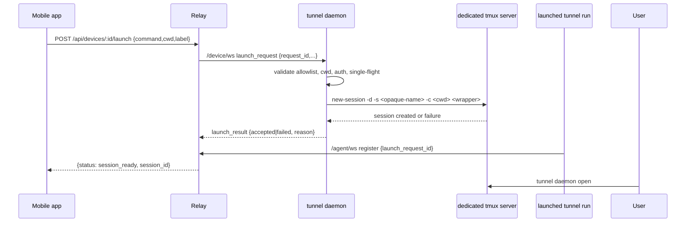

# feat: Add tmux-backed mobile device workspace

## Overview

Replace the current device-launch implementation's terminal-recipe model with a daemon-managed `tmux` workspace. Remote launch should create one independent `tmux` session, keep `session_ready` as the success boundary, and remove GUI-terminal automation from the critical path. Users inspect or resume local sessions manually with `tunnel daemon open` and `tunnel daemon sessions`.

## Problem Frame

The new requirements deliberately reverse the earlier product direction. The device daemon must still let a mobile client create a fresh `tunnel` session on an online machine, but that launch path must no longer depend on detecting a desktop terminal app, opening a visible window, or remembering a launcher recipe. Instead, the daemon should manage a dedicated `tmux` workspace, create sessions there, and leave local viewing as an explicit user action (see origin: `docs/brainstorms/2026-04-18-mobile-device-tmux-workspace-requirements.md`).

This changes the local ownership model more than the relay contract. The relay still brokers online devices and request-scoped launch correlation until `session_ready`, but the daemon/runtime layer, CLI surface, diagnostics, and docs all need to pivot away from "visible terminal launch" toward "dedicated tmux workspace."

## Requirements Trace

- R1-R10. Preserve the online-device model, device-targeted remote launch, and `session_ready` as the only success state.
- R11-R16. Keep required per-launch `cwd` and optional `label` flowing into the resulting session metadata.
- R17-R25. Keep the explicit `tunnel daemon` lifecycle and extend it with `open` and `sessions`.
- R26-R35. Make `tmux` a required local dependency, use a dedicated daemon-managed socket/server, reuse it across daemon restarts, and keep `open`/`sessions` thin rather than building custom session-management UX.
- R36-R40. Ensure remote launch does not depend on GUI display, preserve sessions after daemon stop/crash, and let users re-enter later.
- R41-R48. Preserve single-flight device launch, structured failure reasons, request correlation, and bounded `session_ready` waiting.
- R49-R51 and success criteria. Support macOS/Linux, not Windows, and remove GUI automation as a runtime requirement.

## Scope Boundaries

- No Windows support.
- No automatic opening of a GUI terminal window after launch.
- No terminal detection, remembered launcher recipe, or terminal-specific fallback logic.
- No `screen` backend in v1.
- No custom dashboard, chooser, alias, or per-session `open/close` commands layered on top of `tmux`.
- No changes to the primary `tunnel run <command>` UX outside the launch wrapper/correlation it already supports.

## Context & Research

### Relevant Code and Patterns

- `cmd/tunnel/cmd.go`, `cmd/tunnel/args.go`, and `cmd/tunnel/main.go` already centralize the `tunnel daemon` subcommands, help text, and output rendering. This is the correct seam for adding `open`/`sessions` and for removing launcher-specific status/doctor language.
- `internal/tunnel/daemon/runtime.go`, `internal/tunnel/daemon/control.go`, and `internal/tunnel/daemon/paths.go` already provide the daemon's local control socket, persisted state, and lifecycle model. The tmux workspace should fit into this existing control plane instead of introducing a second bespoke daemon.
- `internal/tunnel/daemon/connector.go` already owns per-launch validation, single-flight behavior, `cwd` handling, `label` propagation, and `launch_request_id` correlation. The launch substrate should change there, but the relay-facing success boundary should not.
- `internal/relay/device/registry.go`, `internal/relay/handler/api/devices.go`, `internal/relay/handler/device/ws.go`, and `internal/protocol/device.go` already provide the live-only online-device registry and launch request/result routing. They should remain broker-oriented, with only the minimum protocol additions needed to expose launch health.
- `internal/relay/handler/rest_api_test.go`, `internal/relay/handler/ws_api_test.go`, `internal/tunnel/daemon/runtime_test.go`, `internal/tunnel/daemon/doctor_test.go`, `internal/tunnel/daemon/control_test.go`, and `cmd/tunnel/main_test.go` are the right contract-level test seams for this refactor.
- `internal/tunnel/daemon/config.go` already owns the command allowlist and should remain unchanged as the gate for allowed launch commands.

### Institutional Learnings

- No `docs/solutions/` directory exists in this repo, so there is no prior institutional write-up to follow for daemon-managed terminal multiplexers or background workspaces.

### External References

- `tmux` official getting-started documentation confirms the core session lifecycle the plan relies on: named sessions, later `attach-session`, and attach-or-create behavior through standard tmux commands.
  - https://github.com/tmux/tmux/wiki/Getting-Started
- The tmux manual documents the low-level commands relevant to this design, especially `new-session`, `attach-session`, and server/socket behavior.
  - https://man7.org/linux/man-pages/man1/tmux.1.html

## Key Technical Decisions

- **Use `tmux` as the long-lived session owner**: The daemon should not own PTYs directly once the product requirement is that daemon stop/crash must not kill already created sessions. `tmux` becomes the persistence boundary for launched sessions.
- **Use a dedicated tmux socket/server per daemon workspace**: The workspace must not attach to or mutate the user's normal tmux environment. A dedicated socket also gives `tunnel daemon open` and `tunnel daemon sessions` a stable target independent of whether the daemon process is currently running.
- **Keep `tunnel daemon open` and `tunnel daemon sessions` daemon-independent**: These commands should target the workspace socket directly rather than going through the daemon control socket. This is the only way they can continue to work after `tunnel daemon stop` while sessions remain alive.
- **Remove desktop-session and launcher-recipe concerns from readiness**: Launch readiness should pivot to `tmux` availability, workspace reachability, allowlist validity, relay connectivity, and launch-session creation health. GUI automation should stop influencing launch success.
- **Keep the relay broker thin**: The existing `/device/ws`, `GET /api/devices`, `POST /api/devices/:deviceID/launch`, and `session_ready` correlation model should remain. The only relay-side expansion should be carrying enough device metadata to distinguish launch-healthy vs degraded devices.
- **Preserve the shell wrapper pattern**: The existing wrapper already carries `TUNNEL_BASE_URL`, `TUNNEL_AUTH_TOKEN`, and `TUNNEL_LAUNCH_REQUEST_ID` into a launched `tunnel run` and restores the caller environment before returning to a login shell. That pattern should survive the tmux migration; only the outer launch substrate changes.

## Open Questions

### Resolved During Planning

- **Should `tunnel daemon open` require a running daemon?** No. It should attach directly to existing sessions in the dedicated tmux workspace so preserved sessions remain accessible after daemon stop. If no daemon-managed sessions exist, it should report that there is nothing to open instead of creating an empty tmux session.
- **Should launch-health state stay daemon-owned or move into the relay?** It stays daemon-owned. The relay only reflects the latest daemon-reported health in the live device snapshot.
- **Should this plan preserve the current device launch HTTP contract?** Yes. `session_ready` remains the only success state, and the tmux refactor should not weaken request/response semantics.

### Deferred to Implementation

- **Exact `tunnel daemon sessions` text formatting**: The requirements only call for a thin read-only view. The final output format should stay close to tmux defaults and can be settled during implementation.
- **Exact Linux package-manager recommendation matrix**: The start-path guidance should cover the first supported Linux families and fall back cleanly, but the precise distro mapping table can be finalized while implementing OS detection.

## High-Level Technical Design

> *This illustrates the intended approach and is directional guidance for review, not implementation specification. The implementing agent should treat it as context, not code to reproduce.*

## Implementation Units

- [x] **Unit 1: Introduce a dedicated tmux workspace substrate**

**Goal:** Replace launcher-recipe state and GUI launch helpers with a dedicated tmux workspace abstraction that survives daemon restarts and daemon stop.

**Requirements:** R24-R35, R38-R40

**Dependencies:** None

**Files:**
- Create: `internal/tunnel/daemon/tmux.go`
- Test: `internal/tunnel/daemon/tmux_test.go`
- Modify: `internal/tunnel/daemon/paths.go`
- Modify: `internal/tunnel/daemon/control.go`
- Modify: `internal/tunnel/daemon/runtime.go`
- Modify: `internal/tunnel/daemon/recipe.go`
- Test: `internal/tunnel/daemon/control_test.go`
- Test: `internal/tunnel/daemon/runtime_test.go`
- Delete: `internal/tunnel/daemon/launcher_darwin.go`
- Delete: `internal/tunnel/daemon/launcher_darwin_test.go`
- Delete: `internal/tunnel/daemon/launcher_darwin_stub.go`
- Delete: `internal/tunnel/daemon/launcher_linux.go`
- Delete: `internal/tunnel/daemon/launcher_linux_test.go`
- Delete: `internal/tunnel/daemon/launcher_nonlinux.go`
- Delete: `internal/tunnel/daemon/launcher_stub.go`

**Approach:**
- Add a daemon-managed tmux helper layer responsible for locating `tmux`, targeting a dedicated socket path, creating/listing/attaching sessions, and representing typed workspace errors such as `tmux_not_found`.
- Extend `Paths` with stable tmux socket metadata separate from the daemon control socket. The control socket remains daemon-owned; the tmux socket must remain usable even after daemon stop.
- Remove recipe persistence and launcher-strategy state from the runtime model. Replace it with workspace-oriented state such as preserved-session count or backend identity only where it materially improves status/doctor rendering.
- Make runtime startup reuse the workspace rather than recreate it. If existing tmux sessions are found, keep them and make that count available for `tunnel daemon start` messaging.
- Ensure daemon shutdown only tears down the control socket/PID state and never kills the tmux server.

**Patterns to follow:**
- `internal/tunnel/daemon/paths.go` for user-scoped config/runtime/state path management
- `internal/tunnel/daemon/runtime.go` for persisted daemon status lifecycle
- `internal/tunnel/daemon/control.go` for typed local control errors such as `ErrNotRunning`

**Test scenarios:**
- Happy path: creating a workspace-backed session uses the dedicated tmux socket and produces a discoverable session in that workspace only.
- Happy path: listing sessions against an existing dedicated socket returns the expected session names without touching the user's default tmux server.
- Edge case: starting the daemon when no tmux server exists yet succeeds without requiring the daemon control socket, while opening an empty workspace reports that there are no daemon-managed sessions instead of creating one.
- Edge case: daemon shutdown leaves the tmux server and sessions intact while marking the daemon status itself as stopped.
- Error path: missing `tmux` returns a typed workspace error rather than a generic exec failure.
- Integration: runtime startup after a previous daemon stop reuses the existing workspace and preserved sessions instead of reinitializing state.

**Verification:**
- The daemon has a stable dedicated tmux workspace that outlives daemon stop and can be queried independently of the control socket.

- [x] **Unit 2: Rework the daemon CLI and diagnostics around tmux**

**Goal:** Add `tunnel daemon open` and `tunnel daemon sessions`, make `start` fail early with OS-specific tmux guidance when needed, and pivot `status`/`doctor` away from launcher-recipe semantics.

**Requirements:** R17-R25, R27, R32-R35, R39-R40

**Dependencies:** Unit 1

**Files:**
- Modify: `cmd/tunnel/cmd.go`
- Modify: `cmd/tunnel/args.go`
- Modify: `cmd/tunnel/main.go`
- Test: `cmd/tunnel/main_test.go`
- Modify: `internal/tunnel/daemon/doctor.go`
- Test: `internal/tunnel/daemon/doctor_test.go`

**Approach:**
- Add explicit `daemon open` and `daemon sessions` subcommands to the Cobra tree and help text.
- Make `runDaemonStart` preflight tmux before attempting background startup. When missing, return a user-facing error with OS-appropriate installation guidance rather than a low-level exec error.
- Keep `status` read-only, but remove fields and messaging tied to launcher strategy or visible terminal windows. Replace them with tmux-backed readiness signals only if they materially help the user.
- Replace `doctor` checks for desktop session and launcher recipe with checks for tmux presence, dedicated workspace reachability, relay/auth/config health, and daemon connectivity.
- Implement `daemon open` and `daemon sessions` directly against the workspace helper, not the daemon control socket, so they remain useful after daemon stop.

**Execution note:** Start with characterization coverage around current `status`/`doctor` output and daemon command parsing so the refactor changes only the intended user-facing surfaces.

**Patterns to follow:**
- `cmd/tunnel/cmd.go` for daemon subcommand registration
- `cmd/tunnel/main.go` for status/doctor rendering and typed CLI error handling
- `internal/tunnel/daemon/doctor.go` for structured health checks and exit-code behavior

**Test scenarios:**
- Happy path: `tunnel daemon open` attaches through the dedicated tmux socket when sessions exist.
- Happy path: `tunnel daemon sessions` returns a thin read-only listing for the dedicated workspace.
- Edge case: `tunnel daemon open` works even when the daemon process is stopped but daemon-managed tmux sessions still exist.
- Edge case: `tunnel daemon start` reports preserved sessions when a workspace already contains them.
- Error path: missing `tmux` on macOS returns install guidance using Homebrew language; missing `tmux` on the first supported Linux family returns the appropriate package-manager guidance.
- Error path: `doctor` reports tmux-related degradation/failure instead of desktop-session or launcher-recipe failure.
- Integration: daemon help output includes `open` and `sessions` and no longer implies terminal-recipe management.

**Verification:**
- The daemon CLI exposes the new workspace entry points, and diagnostics consistently describe tmux-backed readiness rather than GUI-launch readiness.

- [x] **Unit 3: Create tmux-backed launch sessions while preserving session_ready**

**Goal:** Refactor launch execution so each remote launch creates one dedicated tmux session, keeps existing validation and correlation behavior, and returns to an interactive shell when the launched command exits.

**Requirements:** R6-R16, R31, R36-R48

**Dependencies:** Unit 1

**Files:**
- Modify: `internal/tunnel/daemon/connector.go`
- Test: `internal/tunnel/daemon/connector_test.go`
- Modify: `internal/tunnel/daemon/runtime.go`
- Test: `internal/tunnel/daemon/runtime_test.go`
- Modify: `internal/protocol/device.go`
- Test: `internal/protocol/device_test.go`

**Approach:**
- Keep the existing validation order where possible: single-flight guard, allowlist, `cwd`, and `tunnel` presence should still fail before attempting launch.
- Replace `launchWithRecipe` with a tmux-backed session creation path that starts one detached session in the dedicated workspace, sets the requested working directory, and runs the existing shell wrapper carrying `TUNNEL_BASE_URL`, `TUNNEL_AUTH_TOKEN`, `TUNNEL_LAUNCH_REQUEST_ID`, and optional label.
- Keep the wrapper responsible for returning to an interactive login shell after `tunnel run ...` exits so the tmux session remains useful instead of terminating immediately.
- Remove the hard requirement for a GUI desktop session from daemon runtime startup and launch handling.
- Replace launcher-specific failure reasons with tmux/session-start reasons, while preserving the current `accepted -> session_ready` correlation boundary.

**Patterns to follow:**
- `internal/tunnel/daemon/connector.go` for local validation and request-scoped launch handling
- `buildShellWrapper` in `internal/tunnel/daemon/connector.go` for env propagation and shell restoration
- `internal/relay/device/registry.go` for the accepted/failed/session_ready state machine that should remain unchanged

**Test scenarios:**
- Happy path: a valid launch request creates one detached tmux session with the requested `cwd`, optional `label`, and launch request correlation.
- Happy path: the later agent registration with matching `launch_request_id` still resolves the waiting HTTP request as `session_ready`.
- Edge case: a successful wrapper returns to an interactive shell so the tmux session persists after `tunnel run` exits.
- Edge case: starting the daemon on a non-GUI Linux/macOS environment still succeeds when tmux is available.
- Error path: disallowed command, invalid/missing `cwd`, and missing `tunnel` still fail before tmux session creation.
- Error path: missing `tmux` or tmux session-creation failure returns structured failure without leaving the daemon in a falsely healthy state.
- Integration: one in-flight launch still blocks a second launch request on the same device with `busy`.

**Verification:**
- Remote launch no longer depends on GUI terminal automation, but the relay-visible `session_ready` semantics and local validation guarantees remain intact.

- [x] **Unit 4: Reflect launch health through the live device protocol and API**

**Goal:** Let `GET /api/devices` distinguish launch-healthy vs degraded online devices while keeping the relay broker thin and live-only.

**Requirements:** R1-R5, R23, R43-R48

**Dependencies:** Unit 3

**Files:**
- Modify: `internal/protocol/device.go`
- Test: `internal/protocol/device_test.go`
- Modify: `internal/relay/device/registry.go`
- Test: `internal/relay/device/registry_test.go`
- Modify: `internal/relay/handler/device/ws.go`
- Modify: `internal/relay/handler/api/devices.go`
- Test: `internal/relay/handler/rest_api_test.go`
- Test: `internal/relay/handler/ws_api_test.go`

**Approach:**
- Extend live device metadata with an explicit launch-health field (or equivalent daemon-owned readiness signal) so the app-visible device list can distinguish healthy vs degraded online devices.
- Add a lightweight device-side status-update path on `/device/ws`, or reuse a full-info update frame, so the daemon can push health changes after registration without reconnecting.
- Keep the relay passive: it should store and list the latest live daemon-reported metadata but continue to avoid durable device state, recipe knowledge, or workspace ownership.
- Keep launch-result semantics unchanged: accepted/failed/session_ready remain request-scoped, while device health is the longer-lived online metadata surface.

**Patterns to follow:**
- `internal/relay/device/registry.go` for live-only in-memory state updates
- `internal/relay/handler/device/ws.go` for authenticated device websocket frame handling
- `internal/relay/handler/api/devices.go` for app-facing list/launch response envelopes

**Test scenarios:**
- Happy path: a healthy daemon registers, and `GET /api/devices` returns online device metadata showing launch health as healthy.
- Happy path: a daemon health update after a failed local launch changes the live device list from healthy to degraded without reconnecting.
- Edge case: reconnecting the same device ID replaces the live entry and preserves only the latest health state.
- Error path: cross-user device listings still hide devices entirely rather than leaking another user's health state.
- Integration: device disconnect still removes the device from discovery and fails any in-flight launch requests as `device_offline`.

**Verification:**
- Mobile-visible device discovery can distinguish healthy vs degraded online devices without moving daemon-owned state into durable relay storage.

- [x] **Unit 5: Rewrite the public and repo docs around tmux workspaces**

**Goal:** Bring all user-facing and repo-facing docs into alignment with the tmux-backed workspace model and remove terminal-recipe language.

**Requirements:** R17-R25, R26-R35, R36-R40, R49-R51

**Dependencies:** Units 2-4

**Files:**
- Modify: `README.md`
- Modify: `docs/api.md`
- Modify: `docs/protocol.md`
- Modify: `docs/architecture.md`
- Modify: `CLAUDE.md`
- Modify: `AGENTS.md`

**Approach:**
- Replace every description of "open a new visible terminal window" or "launcher recipe" with tmux-workspace language.
- Document `tunnel daemon open`, `tunnel daemon sessions`, the tmux dependency, preserved sessions after daemon stop, and the removal of GUI automation from the launch critical path.
- Update the API/protocol/architecture docs to describe any new device-health field, workspace-backed local execution, and the unchanged `session_ready` correlation model.
- Keep the docs explicit that the relay remains live-only for device presence and does not own tmux sessions or transcript history.

**Patterns to follow:**
- Existing attach/session docs in `README.md`, `docs/api.md`, `docs/protocol.md`, and `docs/architecture.md` for how this repo describes source-of-truth boundaries and protocol guarantees
- The docs-alignment rules in `CLAUDE.md` and `AGENTS.md`

**Test scenarios:**
- Test expectation: none -- this unit is documentation-only, but the implementing agent should verify that no doc still claims terminal-recipe inference or automatic GUI terminal opening.

**Verification:**
- The doc set consistently describes tmux-backed device launch, manual workspace entry, and the unchanged attach/session discovery contract.

## System-Wide Impact

- **Interaction graph:** `tunnel daemon` start/stop/status/doctor/open/sessions -> dedicated tmux workspace -> `/device/ws` launch routing -> later `/agent/ws` session registration -> app-facing `GET /api/devices` and `POST /api/devices/:deviceID/launch`.
- **Error propagation:** Launch failures now split into two classes: workspace/preflight failures (`tmux_not_found`, session start failure, invalid `cwd`, disallowed command) and post-acceptance correlation failures (`launch_timeout`, `device_offline`). The plan keeps those boundaries explicit.
- **State lifecycle risks:** The daemon control socket can disappear while tmux sessions remain alive; `open` and `sessions` therefore must not depend on daemon IPC. The relay must treat launch health as live metadata only and clear it on disconnect.
- **API surface parity:** Device listing, launch request/response, websocket protocol docs, CLI help text, and doctor/status output all need coordinated updates to avoid mixed terminal-recipe vs tmux language.
- **Integration coverage:** Unit tests alone will not prove the full `launch_request -> tmux session -> launched tunnel registers -> session_ready` path. Existing relay handler tests and daemon connector tests need to keep covering that sequence end-to-end.
- **Unchanged invariants:** `tunnel run <command>` remains the direct local launch path; attach still uses the existing session discovery and `/api/sessions/:id/attach/ws` flow; the relay still does not own terminal state or transcript history.

## Risks & Dependencies

| Risk | Mitigation |
|------|------------|
| The tmux socket path or server lifecycle becomes coupled to daemon stop, breaking preserved-session access | Keep workspace addressing separate from the daemon control socket, and test `daemon stop` followed by `daemon open` explicitly |
| Launch health can drift between daemon-local state and the relay's live device snapshot | Add an explicit device metadata update path and test health transitions without reconnect |
| The tmux wrapper exits the session instead of returning to an interactive shell | Preserve the current shell-wrapper pattern and add explicit coverage for the post-command shell handoff |
| OS-specific tmux install guidance becomes brittle on Linux families | Keep the initial support matrix narrow, detect `/etc/os-release` conservatively, and fall back to a generic "install tmux" message when the distro is unknown |
| Removing launcher fields leaves stale state or broken backward-compatibility in old daemon directories | Treat missing/obsolete recipe artifacts as ignorable migrated state and keep startup cleanup tolerant of previously persisted terminal-launch artifacts |

## Documentation / Operational Notes

- This implementation completed the docs sweep across `README.md`, `docs/api.md`, `docs/protocol.md`, `docs/architecture.md`, `CLAUDE.md`, and `AGENTS.md` to remove visible-terminal and launcher-recipe language.
- This rollout depends on nginx proxying `/device/ws` and `/healthz` so daemon connectivity and doctor health checks work through the relay; keep the nginx templates and deployment docs aligned with that ingress requirement.

## Sources & References

- **Origin document:** `docs/brainstorms/2026-04-18-mobile-device-tmux-workspace-requirements.md`
- Related code: `cmd/tunnel/main.go`, `internal/tunnel/daemon/runtime.go`, `internal/tunnel/daemon/connector.go`, `internal/relay/device/registry.go`, `internal/relay/handler/api/devices.go`, `internal/protocol/device.go`
- External docs: https://github.com/tmux/tmux/wiki/Getting-Started
- External docs: https://man7.org/linux/man-pages/man1/tmux.1.html
