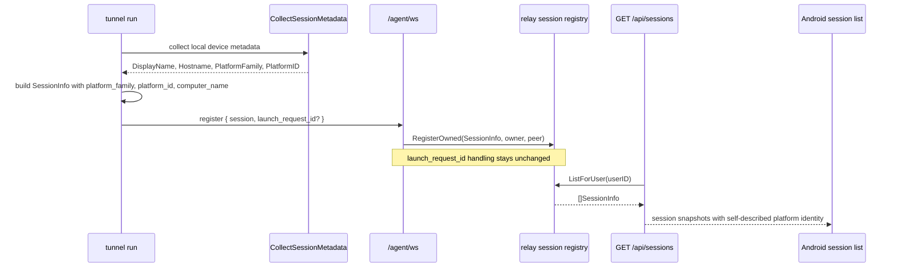

# feat: Expose session platform identity in session discovery

## Overview

Extend the shared session contract so every live session self-describes its platform identity through `GET /api/sessions`.

The change is additive but cross-cutting:

- `tunnel run` must populate `platform_family`, `platform_id`, and normalized `computer_name` when it registers a session
- relay session discovery must continue returning the stored `SessionInfo` verbatim, with no device-join inference layer
- public and internal docs must state that session platform identity now belongs to the session itself, not to device-launch correlation
- regression tests must prove that launch correlation still completes as `session_ready`

This plan is for the `agent-tunnel` repository. Android is the motivating downstream consumer, but Android code changes are out of scope here.

## Problem Frame

The current mobile flow now has two separate live surfaces:

- device discovery through `GET /api/devices`
- session discovery through `GET /api/sessions`

That split is correct for remote launch, but the current session payload is still too thin for downstream clients that need to render session cards directly. `GET /api/sessions` exposes launcher, label, cwd, command preview, and start time, but it does not expose the session's machine identity. That gap pushes clients toward reconstructing session metadata from device-launch context or launch history.

That reconstruction is the wrong model. It fails for manually started `tunnel run` sessions, it makes session rendering depend on whether a launch happened through the daemon path, and it turns a live session contract into an inference problem.

The session should instead be self-describing. Every `tunnel run` process already runs on a concrete machine and can gather machine metadata locally. The relay already stores and returns `protocol.SessionInfo` as the authoritative live-session snapshot. The missing piece is to extend that shared session model and populate it at registration time.

This continues the direction already established in the origin requirements document: launch success means `session_ready`, but attach and session discovery remain normal session flows after creation. The additional requirement from the current design request is that session discovery itself must be rich enough for Android to render session cards without joining against device-launch state.

## Requirements Trace

- R1. `GET /api/sessions` must expose session-level `platform_family`, `platform_id`, and `computer_name` in the shared `SessionInfo` contract.
- R2. Every `tunnel run` session must populate those three fields during `/agent/ws` registration, regardless of whether the session was started manually or by the daemon-managed launch flow.
- R3. `computer_name` must be the server-side normalized display value: prefer daemon metadata `DisplayName`, otherwise fall back to `Hostname`. The public session API must not expose separate `display_name` and `hostname` fields.
- R4. Relay session discovery must keep its current invariants: live-only visibility, newest-first sorting by `started_at`, and strict user scoping.
- R5. Launch correlation must remain unchanged: `launch_request_id` plus the registering `session_id` still complete one pending launch as `session_ready`.
- R6. Public docs must explicitly say that `platform_family` is the coarse fallback field, `platform_id` is the raw platform key for client-side icon mapping, and clients must not infer session OS through device-launch relationships.
- R7. Tests must cover the shared protocol model, `tunnel run` metadata population and fallback, authenticated `/api/sessions` output, and launch-correlation non-regression.

## Scope Boundaries

- No change to `GET /api/devices` or the device-launch request/response contract.
- No Android implementation work in this repository.
- No relay-side join between sessions and online devices.
- No new session API fields for raw `display_name` or raw `hostname`.
- No backfill mechanism for already-registered live sessions from older `tunnel` binaries.
- No change to attach transport, terminal rendering, or `session_ready` semantics.

## Context & Research

### Relevant Code and Patterns

- `internal/protocol/message.go` defines `protocol.SessionInfo`, which is shared by `/agent/ws` registration and `GET /api/sessions`.
- `cmd/tunnel/main.go` builds the `SessionInfo` for every `tunnel run` session before the connector registers it with the relay.
- `internal/tunnel/daemon/recipe.go` now exposes `CollectSessionMetadata()` for session registration, returning `DisplayName`, `Hostname`, `PlatformFamily`, and `PlatformID`.
- `internal/relay/handler/agent/ws.go` registers the incoming `SessionInfo` without projecting it into a second DTO and uses the same registration hook to complete pending launches as `session_ready`.
- `internal/relay/session/registry.go` stores the full `SessionInfo` and returns it unchanged from `ListForUser`.
- `internal/relay/handler/api/sessions.go` already serves `registry.ListForUser(...)` directly, so this contract expansion should stay pass-through rather than introducing relay-side enrichment.
- `docs/api.md`, `docs/protocol.md`, `docs/architecture.md`, `README.md`, `CLAUDE.md`, and `AGENTS.md` are all contract-bearing documents for session semantics in this repo's own guidance.
- `internal/protocol/message_test.go`, `cmd/tunnel/main_test.go`, `internal/relay/handler/rest_api_test.go`, and `internal/relay/handler/ws_api_test.go` already cover the seams this feature changes.

### Institutional Learnings

- There are no `docs/solutions/` entries in this repository for session metadata. The strongest local pattern is architectural: relay session discovery is intentionally a thin reflection of registered session state, not a reconstruction layer.
- The downstream Android requirements and plans consistently prefer explicit runtime state over heuristics. This feature should preserve that posture by making session discovery self-contained.

### External References

- None. The repo already has direct patterns for shared protocol types, session registration, live session listing, and contract documentation.

## Key Technical Decisions

- **Extend the shared `protocol.SessionInfo` contract directly.** The same struct already spans `/agent/ws` registration and `GET /api/sessions`, so adding the new fields there keeps one source of truth instead of creating API-only projection code.
- **Populate metadata in `tunnel run`, not in relay.** Machine identity belongs to the session's owning process. Relay should not try to derive it later from device-launch state because manually started sessions would remain incomplete.
- **Reuse `daemon.CollectSessionMetadata()` for all sessions.** The helper already returns the needed display and platform fields for session registration, so `tunnel run` should reuse it rather than creating a second platform-detection path.
- **Normalize `computer_name` before registration.** `computer_name` should be derived once in `tunnel run`: non-blank `DisplayName` first, otherwise `Hostname`. Clients should consume the normalized display value rather than re-implementing this fallback.
- **Keep relay pass-through.** `internal/relay/session/Registry` and `GET /api/sessions` should continue storing and returning `SessionInfo` directly. No device registry lookups, launch-history joins, or enrichment hooks should be added to the relay request path.
- **Document `platform_family` as coarse fallback and `platform_id` as raw and client-mapped.** The server should transport both fields, with exact icon mapping remaining client-owned.
- **Treat the fields as additive but rollout-sensitive.** Relay can accept and return the new fields immediately, but only updated `tunnel` binaries will populate them. Downstream clients must tolerate temporarily blank or missing values until the tunnel fleet is updated.

## Open Questions

### Resolved During Planning

- Where should session machine metadata come from? `internal/tunnel/daemon/CollectSessionMetadata()`.
- Should relay expose both `display_name` and `hostname` on session discovery? No. The public session surface should expose only normalized `computer_name`.
- Should relay infer session OS from device-launch relationships? No. Session registration itself is the source of truth.
- Does this require new relay storage or schema changes? No. Session state remains live-only and in-memory.

### Deferred To Implementation

- Exact helper naming inside `cmd/tunnel/main.go` for test injection. A small package-level function variable is recommended so `main_test.go` can force the `computer_name` fallback path deterministically.
- Exact wording in `README.md` for downstream app-facing discovery notes. The required semantic points are fixed, but final prose can be tightened during implementation.
- Whether to add a lightweight mixed-version note to `docs/local-e2e.md`. Useful, but not required for the minimal contract update.

## High-Level Technical Design

> *This illustrates the intended approach and is directional guidance for review, not implementation specification. The implementing agent should treat it as context, not code to reproduce.*

## Implementation Units

- [x] **Unit 1: Extend the shared session contract**

**Goal:** Add session-level platform identity to the single shared `SessionInfo` model used by both registration and session discovery.

**Requirements:** R1, R6, R7

**Dependencies:** None

**Files:**
- Modify: `internal/protocol/message.go`
- Test: `internal/protocol/message_test.go`

**Approach:**
- Add `platform_family`, `platform_id`, and `computer_name` to `protocol.SessionInfo`.
- Keep the contract additive and stable across both `/agent/ws` registration and `GET /api/sessions`.
- Treat the new fields as regular session fields rather than device-only metadata.
- Keep `label` optional, but make the new session-identity fields part of the stable session JSON shape.

**Patterns to follow:**
- `internal/protocol/message.go`
- `internal/protocol/message_test.go`

**Test scenarios:**
- Happy path: `RegisterFrameWithLaunchRequest` round-trips a session containing `platform_family`, `platform_id`, `computer_name`, and `launch_request_id`.
- Happy path: marshaling `SessionInfo` uses stable JSON field names for `session_id`, `launcher`, `cwd`, `command_preview`, `started_at`, `platform_family`, `platform_id`, and `computer_name`.
- Edge case: when `label` is unset, it remains omitted without affecting the new session-identity fields.

**Verification:**
- The shared protocol package exposes one consistent session shape for both registration and REST discovery, and its JSON tests pin the new field names.

- [x] **Unit 2: Populate platform identity for every `tunnel run` session**

**Goal:** Ensure every newly registered session carries platform identity at the moment `tunnel run` builds `SessionInfo`.

**Requirements:** R2, R3, R5, R7

**Dependencies:** Unit 1

**Files:**
- Modify: `cmd/tunnel/main.go`
- Test: `cmd/tunnel/main_test.go`

**Approach:**
- Call `daemon.CollectSessionMetadata()` when building `SessionInfo` in `runTunnelSession`.
- Populate:
  - `platform_family = metadata.PlatformFamily`
  - `platform_id = metadata.PlatformID`
  - `computer_name = metadata.DisplayName` when non-blank, otherwise `metadata.Hostname`
- Keep this logic on the normal `tunnel run` path so manual launches and daemon-created launches behave the same way.
- Preserve the current `launch_request_id` forwarding, startup gating, and connector setup behavior.
- Introduce only the minimum test seam needed to force metadata fallback behavior in `main_test.go`.

**Patterns to follow:**
- `cmd/tunnel/main.go`
- `internal/tunnel/daemon/recipe.go`
- `cmd/tunnel/main_test.go`

**Test scenarios:**
- Happy path: `tunnel run --label api-fix codex --profile prod` forwards `platform_family`, `platform_id`, and normalized `computer_name` into the connector's `SessionInfo`.
- Edge case: when daemon metadata returns blank `DisplayName` and non-blank `Hostname`, `computer_name` uses the hostname fallback.
- Integration: when `TUNNEL_LAUNCH_REQUEST_ID` is set, the same metadata-rich `SessionInfo` still registers while preserving the existing launch-request correlation path.

**Verification:**
- New sessions created by `tunnel run` register with platform identity populated, and the metadata addition does not change current startup or launch-request behavior.

- [x] **Unit 3: Lock relay discovery to pass-through session identity and update contract docs**

**Goal:** Preserve relay session discovery as a thin reflection of registered session state while documenting the new app-facing contract.

**Requirements:** R1, R3, R4, R6, R7

**Dependencies:** Units 1-2

**Files:**
- Modify: `internal/relay/handler/rest_api_test.go`
- Modify: `README.md`
- Modify: `docs/api.md`
- Modify: `docs/protocol.md`
- Modify: `docs/architecture.md`
- Modify: `CLAUDE.md`
- Modify: `AGENTS.md`

**Approach:**
- Keep `internal/relay/handler/api/sessions.go` unchanged unless tests reveal a serialization gap; the intended design is still direct `registry.ListForUser(...)` pass-through.
- Strengthen REST tests so `GET /api/sessions` proves the authenticated user receives the new session fields.
- Update contract docs to say:
  - session discovery now includes session-owned `platform_family`, `platform_id`, and `computer_name`
  - `platform_family` is the coarse UI fallback and `platform_id` is the raw platform key that clients map to icons
  - `computer_name` is already normalized server-side from display name, then hostname fallback
  - clients, including Android, must not infer session OS from device-launch relationships
- Update internal repo guidance files because this is a session-state semantic change under the repo's own documentation rules.

**Patterns to follow:**
- `internal/relay/handler/api/sessions.go`
- `internal/relay/session/registry.go`
- `docs/api.md`
- `CLAUDE.md`

**Test scenarios:**
- Happy path: an authenticated user calling `GET /api/sessions` receives `platform_family`, `platform_id`, and `computer_name` for that user's live session.
- Edge case: another user's live session, even with different platform metadata, remains absent from the response.
- Integration: session ordering and live-only discovery semantics remain unchanged after the additive fields are introduced.

**Verification:**
- REST tests pin the new `/api/sessions` response shape, and every contract-bearing document in the repo describes the same session discovery semantics.

- [x] **Unit 4: Prove launch correlation still resolves as `session_ready`**

**Goal:** Add a targeted non-regression check showing that richer session registration metadata does not disturb pending launch completion.

**Requirements:** R5, R7

**Dependencies:** Units 1-2

**Files:**
- Modify: `internal/relay/handler/ws_api_test.go`
- Modify: `internal/relay/handler/test_helpers_test.go`

**Approach:**
- Update the agent-registration helpers used by device-launch websocket tests so they register sessions with the new platform fields populated.
- Keep the assertion focused on the existing invariant: a matching `launch_request_id` plus registering `session_id` completes one pending launch as `session_ready`.
- Do not add a device-registry join or any alternative completion path while implementing these tests.

**Patterns to follow:**
- `internal/relay/handler/ws_api_test.go`
- `internal/relay/handler/test_helpers_test.go`
- `internal/relay/handler/agent/ws.go`

**Test scenarios:**
- Happy path: a device launch still returns `status: "session_ready"` and the expected `session_id` after the launched agent registers a metadata-rich `SessionInfo`.
- Integration: launch completion still keys off `launch_request_id` correlation rather than any device-to-session inference layer.

**Verification:**
- WebSocket launch-flow tests still pass with the expanded session contract, proving that launch completion semantics remain unchanged.

## System-Wide Impact

- **Interaction graph:** `cmd/tunnel/main.go` now collects local machine metadata before session registration; `/agent/ws` stores the resulting `SessionInfo`; `/api/sessions` continues returning that stored snapshot directly to authenticated clients.
- **Error propagation:** `CollectSessionMetadata()` does not currently return an error, so this feature should not create a new startup failure mode for `tunnel run`.
- **State lifecycle risks:** sessions registered by older `tunnel` binaries will not gain the new fields until they reconnect or restart with the updated binary. This is acceptable for a live-only session registry, but downstream clients must tolerate temporarily missing values during rollout.
- **API surface parity:** `/agent/ws` registration, `GET /api/sessions`, `docs/api.md`, `docs/protocol.md`, `docs/architecture.md`, `README.md`, `CLAUDE.md`, and `AGENTS.md` must all describe the same session fields.
- **Integration coverage:** end-to-end confidence comes from combining protocol JSON tests, `tunnel run` session registration tests, authenticated `/api/sessions` tests, and launch-correlation websocket tests.
- **Unchanged invariants:** live-only discovery, newest-first sorting, strict user scoping, attach transport, and `session_ready` launch completion all remain unchanged.

## Risks & Dependencies

| Risk | Mitigation |
|------|------------|
| Relay-side enrichment would make manual `tunnel run` sessions incomplete forever. | Populate the fields in `tunnel run` itself and keep relay as pass-through. |
| Downstream Android could assume the fields always exist immediately after relay deploy. | Document mixed-version rollout behavior and keep the contract additive so clients can tolerate blank or missing values until tunnel binaries are updated. |
| Contract docs could drift across public docs and internal repo guidance. | Update `README.md`, `docs/api.md`, `docs/protocol.md`, `docs/architecture.md`, `CLAUDE.md`, and `AGENTS.md` in the same change. |
| Test coverage could prove the REST response change but miss a `session_ready` regression. | Add explicit websocket launch-flow non-regression coverage in `internal/relay/handler/ws_api_test.go`. |

## Documentation / Operational Notes

- This feature should ship as one coordinated tunnel + relay contract update, even though the JSON shape change itself is additive.
- Relay can be deployed first safely, but downstream consumers should not rely on the new fields being populated until the relevant `tunnel` binaries are updated and new sessions have registered with the expanded contract.
- Android session list rendering should consume session platform identity from `GET /api/sessions` directly once the upstream rollout is complete.

## Sources & References

- Origin document: `docs/brainstorms/2026-04-18-mobile-device-tmux-workspace-requirements.md`
- Related code: `internal/protocol/message.go`
- Related code: `cmd/tunnel/main.go`
- Related code: `internal/relay/handler/agent/ws.go`
- Related code: `internal/relay/session/registry.go`
- Related tests: `internal/protocol/message_test.go`
- Related tests: `cmd/tunnel/main_test.go`
- Related tests: `internal/relay/handler/rest_api_test.go`
- Related tests: `internal/relay/handler/ws_api_test.go`
