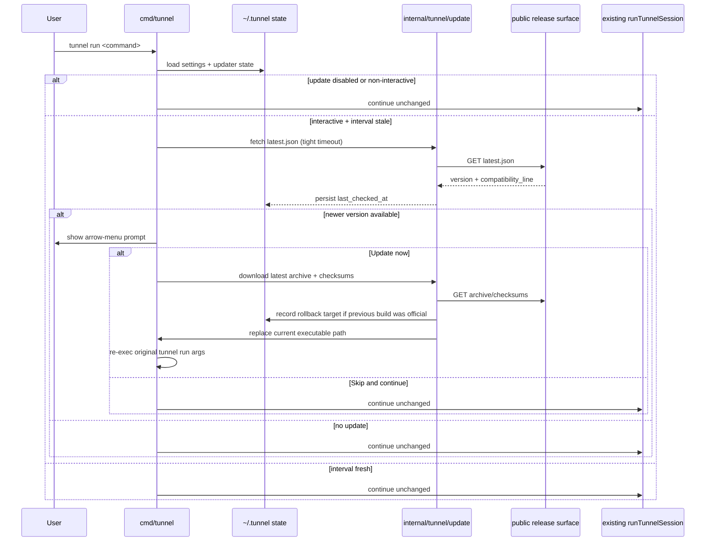

# feat: Add Tunnel binary update and rollback flow

## Overview

Add a native Tunnel binary update flow that shows a minimal English prompt before interactive `tunnel run`, supports explicit `tunnel update` and `tunnel rollback` commands, records updater state under `~/.tunnel/`, and keeps the current session startup unblocked when update checks or pre-handoff upgrades fail.

## Problem Frame

The origin requirements define a narrow v1 target: improve binary freshness for real users without turning Tunnel into a background auto-updater or widening the UX to every CLI entrypoint. The implementation therefore has four responsibilities:

- add one reliable way for the binary to recognize whether it is an official Tunnel release
- add one repo-owned local state model under `~/.tunnel/` for user settings and updater state
- add one native updater path for latest-only upgrades plus single-step rollback
- add one `tunnel run` startup gate that checks at most once per 24-hour interval, prompts only in interactive terminals, and otherwise preserves the current runtime behavior

The repo already has the core pieces needed for this work: `cmd/tunnel` owns the full CLI contract, `internal/buildinfo` already carries release version metadata, and the public release surface already publishes `latest.json`, release archives, and `checksums.txt` through a stable naming scheme. The planning problem is how to connect those existing seams without introducing a second installer path, fragile shell handoffs, or a local-state model that users cannot reason about (see origin: `docs/brainstorms/2026-04-18-tunnel-binary-update-requirements.md`).

## Requirements Trace

- R1-R4. Limit the automatic UX to interactive `tunnel run`, keep non-interactive paths silent, and allow both official releases and non-release builds to converge onto the official release channel.
- R5-R10. Add one automatic check gate on every `tunnel run`, but use one shared 24-hour interval to suppress both re-fetching and re-prompting.
- R11-R18. Render one minimal English arrow-menu prompt with the approved copy and no extra release-note or manual-command clutter.
- R19-R29. Add latest-only update, single-step rollback, automatic post-update re-exec, explicit failure behavior, and non-release-build downgrade limits.
- R30-R36. Make official-release identity come from the binary itself, keep `~/.tunnel/` as the persistent local root, and move future user-editable CLI settings onto `~/.tunnel/settings.json` with env-style overrides.
- R37-R39. Update the public and repo-facing docs so the new binary lifecycle and local-state contract are explained consistently.

## Scope Boundaries

- No startup update UX for `tunnel daemon`.
- No prompt or warning output in non-interactive usage.
- No forced upgrades.
- No changelog or release-notes content in the startup prompt.
- No arbitrary-version `tunnel update` in v1; latest-only keeps the updater surface small.
- No multi-version rollback history.
- No guarantee that rollback works when the replaced binary was not itself an official release build.

## Context & Research

### Relevant Code and Patterns

- `cmd/tunnel/cmd.go`, `cmd/tunnel/args.go`, and `cmd/tunnel/main.go` already define the repo-owned CLI surface. `runTunnelSession` is the natural seam for preserving the existing runtime after a new preflight update gate decides to continue.
- `cmd/tunnel/auth_store.go` already owns `~/.tunnel/auth.json`, path resolution, permission hardening, and atomic file replacement. That is the closest local pattern for `settings.json` and updater-state persistence.
- `internal/buildinfo/buildinfo.go` already carries the release version and compatibility-line helpers. It is the correct home for an embedded “official release vs non-release build” marker.
- `scripts/install-tunnel.sh`, `scripts/release-package.sh`, `scripts/render-latest-manifest.sh`, and `scripts/release-common.sh` already define the public archive names, checksum behavior, manifest contract, and release compatibility-line enforcement. The updater should mirror those rules rather than invent a parallel distribution contract.
- `scripts/test-release-installer.sh` already provides fixture-backed release smoke coverage. It is the most natural acceptance harness for “download archive + verify checksum + replace binary” behavior.
- `docs/plans/2026-04-17-001-feat-tunnel-auth-run-plan.md` already established the repo’s current `.tunnel` contract and reserved `config.json`. This work intentionally supersedes that reservation with `settings.json`, so the plan must update the previously documented local-state story.

### Institutional Learnings

- No `docs/solutions/` entries exist in this repository.

### External References

- None. The repo already has strong local patterns for CLI composition, local file persistence, and release distribution. The main unknowns are integration decisions, not framework or ecosystem gaps.

## Key Technical Decisions

| Decision | Choice | Rationale |
|---|---|---|
| Automatic UX entrypoint | Gate only `tunnel run` | This preserves the product boundary decided in the origin doc and avoids widening update behavior to daemon and scripted flows. |
| Update cadence model | One shared 24-hour interval for both re-checking and re-prompting | This is the simplest model that satisfies the product goal and keeps updater state easy to explain. |
| Official release identity | Add an embedded build marker in `internal/buildinfo`, injected only by release packaging | This lets the binary prove “official release vs non-release build” without relying on local files that users can delete. |
| Manual update surface | `tunnel update` is latest-only in v1 | Latest-only keeps `latest.json`, command help, rollback recording, and recovery behavior small and stable. |
| Manual rollback surface | `tunnel rollback` restores one previous official version by re-downloading that exact release | This matches the product requirement, avoids local binary hoarding, and reuses the public artifact surface already maintained by the release pipeline. |
| Updater implementation | Native Go updater, not shelling out to `install.sh` | The CLI needs tighter control over re-exec, rollback-target recording, install-path validation, and test seams than a shell-script handoff would allow. |
| Persistent local state split | Keep `auth.json`, add user-editable `settings.json`, and add internal `updater.json` under `~/.tunnel/` | This preserves the current auth store, gives settings one Claude-style home, and keeps mutable updater bookkeeping out of a user-editable file. |
| Settings override model | Real env vars override `settings.json.env`, with `TUNNEL_UPDATE_DISABLED` as the first supported key | This follows the chosen product model and leaves room for future CLI settings without inventing a separate key/value precedence system. |
| Startup update check timing | Do the stale-check fetch synchronously but with a tight dedicated timeout; on timeout or fetch error, continue silently | The prompt should appear before `tunnel run` enters its main flow, but the runtime must not gain an unbounded network dependency. |
| Install target for self-update | Replace the current executable path only when it resolves to a regular writable file; otherwise fail with clear reinstall guidance | This supports official release tarballs copied into arbitrary user-owned locations without silently overwriting unsafe or unwritable targets. |

## Open Questions

### Resolved During Planning

- Should `tunnel update` support arbitrary version pinning in v1? No. Keep it latest-only and let `rollback` handle the one-step recovery case.
- Does v1 need a richer `latest.json` schema? No. Keep the existing `version` and `compatibility_line` manifest contract, and derive archive/checksum URLs from the existing release naming rules.
- Should the updater shell out to the public installer script? No. Implement a native updater in Go so binary replacement, rollback-target recording, and re-exec behavior stay under one testable control flow.
- Should deleting updater state change whether a binary is considered an official release? No. Official-release identity comes only from embedded build metadata.
- How should startup recovery behave after re-exec failure? Standard path: print an explicit recovery message that includes `tunnel rollback` when a rollback target exists. Non-release-origin edge case: explain that rollback is unavailable because the replaced build was not an official release.

### Deferred to Implementation

- Finalize the exact stale-check timeout values once the updater HTTP client is implemented and reviewed beside the existing release installer timeouts.
- Finalize the exact internal `updater.json` field names once the code paths for cache interval gating, rollback recording, and non-release-origin failure messaging are all in view.
- Finalize the exact prompt-rendering abstraction boundary after seeing how much of the arrow-menu behavior can be unit tested without coupling to a real TTY.

## High-Level Technical Design

> *This illustrates the intended approach and is directional guidance for review, not implementation specification. The implementing agent should treat it as context, not code to reproduce.*

## Implementation Units

- [ ] **Unit 1: Establish shared `.tunnel` path, settings, and updater-state foundations**

**Goal:** Replace the old reserved `config.json` concept with one real `settings.json` contract, centralize `.tunnel` path helpers, and add an internal updater-state file model without disturbing auth behavior.

**Requirements:** R30-R36

**Dependencies:** None

**Files:**
- Create: `cmd/tunnel/local_state.go`
- Create: `cmd/tunnel/local_state_test.go`
- Modify: `cmd/tunnel/auth_store.go`
- Modify: `cmd/tunnel/auth_store_test.go`
- Test: `cmd/tunnel/auth_cmd_test.go`

**Approach:**
- Extract the `.tunnel` home resolution and file-path helpers out of the auth-store-only code so auth, settings, and updater state all share one path boundary.
- Add a small settings loader for `~/.tunnel/settings.json` with an `env` map and one merged-lookup helper that applies “real env overrides settings env” precedence.
- Add an internal updater-state type and path helper for `~/.tunnel/updater.json`, but keep its read/write surface separate from the user-editable settings file.
- Update the old `ConfigFilePath()` semantics so the codebase stops reserving `config.json` and instead recognizes `settings.json` as the user-facing config file.

**Patterns to follow:**
- Atomic JSON file writes and permission hardening in `cmd/tunnel/auth_store.go`
- Minimal CLI-owned state structs rather than a generic configuration framework

**Test scenarios:**
- Happy path: resolving local-state paths yields `~/.tunnel/auth.json`, `~/.tunnel/settings.json`, and `~/.tunnel/updater.json` under one shared root.
- Happy path: missing `settings.json` is treated as empty settings rather than an error.
- Happy path: a `settings.json` `env` key such as `TUNNEL_UPDATE_DISABLED=1` is visible through the merged env lookup when no real env override exists.
- Edge case: a real process env value overrides the same key provided through `settings.json.env`.
- Edge case: malformed `settings.json` returns a deterministic config error to update-related callers without changing auth persistence behavior.
- Error path: the `.tunnel` home directory cannot be resolved or created, and the settings/updater helpers fail cleanly.

**Verification:**
- All persistent CLI-owned local state for this feature area shares one `.tunnel` helper surface.
- No code path still depends on or documents `~/.tunnel/config.json`.

- [ ] **Unit 2: Embed official-release identity and add Go-side release metadata helpers**

**Goal:** Make the binary self-identify official releases and give the updater one Go-native source of truth for release archive naming and manifest parsing.

**Requirements:** R4, R18, R23-R31

**Dependencies:** Unit 1

**Files:**
- Modify: `internal/buildinfo/buildinfo.go`
- Modify: `internal/buildinfo/buildinfo_test.go`
- Create: `internal/tunnel/update/release.go`
- Create: `internal/tunnel/update/release_test.go`
- Modify: `scripts/release-package.sh`
- Modify: `scripts/test-release-package.sh`

**Approach:**
- Extend `internal/buildinfo` with one embedded distribution marker such as `official` vs `non-release`, defaulting to the non-release value in normal developer builds.
- Update release packaging so official published binaries inject both the semver version and the official-release marker via existing `-ldflags`.
- Add Go helpers under `internal/tunnel/update` that mirror the existing public distribution rules: latest manifest decoding, compatibility-line interpretation, archive names, and checksum path conventions.
- Keep `latest.json` shape unchanged in v1 unless implementation reveals a hard need for another field; the updater should derive what it needs from the existing release contract plus the current executable location.

**Patterns to follow:**
- Version parsing and compatibility-line logic in `internal/buildinfo/buildinfo.go`
- Archive naming and compatibility helpers in `scripts/release-common.sh`
- Release packaging injection in `scripts/release-package.sh`

**Test scenarios:**
- Happy path: a non-release build reports the default non-release marker.
- Happy path: a packaged release build injects the official-release marker alongside the requested version.
- Happy path: Go-side release helpers compute the same archive names and compatibility-line expectations as the existing shell release helpers.
- Edge case: latest manifest parsing rejects missing or malformed version fields with clear updater-facing errors.
- Edge case: compatibility-line parsing still behaves correctly for pre-`v1` and `v1+` versions.
- Regression: existing release smoke tests still prove the packaged binary reports the expected version string.

**Verification:**
- Official-release identity is provable by the binary alone.
- Updater code does not need to shell out to release scripts to understand the public artifact contract.

- [ ] **Unit 3: Implement the native updater engine and manual `update` / `rollback` commands**

**Goal:** Add a native updater that can fetch the latest release, verify checksums, replace the current binary atomically, and record one rollback target when appropriate.

**Requirements:** R19-R31, R37

**Dependencies:** Unit 1, Unit 2

**Files:**
- Create: `internal/tunnel/update/state.go`
- Create: `internal/tunnel/update/state_test.go`
- Create: `internal/tunnel/update/manifest.go`
- Create: `internal/tunnel/update/manifest_test.go`
- Create: `internal/tunnel/update/engine.go`
- Create: `internal/tunnel/update/engine_test.go`
- Create: `cmd/tunnel/update_cmd.go`
- Create: `cmd/tunnel/update_cmd_test.go`
- Modify: `cmd/tunnel/cmd.go`
- Modify: `cmd/tunnel/args.go`

**Approach:**
- Implement one updater engine that performs: latest-manifest fetch, archive/checksum download, checksum verification, safe archive extraction, current-executable validation, temp-file replace, and rollback-target recording.
- Reuse the current executable path from `os.Executable()` as the replacement target. Only replace it when it resolves to a regular writable file; otherwise fail with explicit reinstall guidance instead of attempting unsafe mutation.
- Keep `tunnel update` latest-only. It should work for both official release binaries and non-release builds, but only official-release origins can create a rollback target.
- Record one rollback target version in updater state only when the replaced binary was an official release version. When the replaced build is non-release, clear any rollback target and persist enough internal reason state to explain why rollback is unavailable.
- Implement `tunnel rollback` as “download previous official version and replace current executable.” If no rollback target exists or download fails, produce a clear, local-only error with recovery guidance.

**Technical design:** *(directional only)*

Prefer an updater-state shape along these lines:

| Field | Purpose |
|---|---|
| `version` | schema version |
| `last_checked_at` | automatic check interval gate for `tunnel run` |
| `rollback_version` | previous official version, when available |
| `rollback_reason` | explanatory state when rollback is unavailable, such as previous build being non-release |

This keeps the product-level cadence model small while leaving room for implementation-only diagnostic context.

**Patterns to follow:**
- Local file replacement and permission handling in `cmd/tunnel/auth_store.go`
- Release download/verification contract in `scripts/install-tunnel.sh`
- Current Cobra command construction in `cmd/tunnel/cmd.go`

**Test scenarios:**
- Happy path: `tunnel update` on an official release binary downloads the latest release, verifies checksums, replaces the current executable, and records the previous version as the rollback target.
- Happy path: `tunnel update` on a non-release build still upgrades to the latest official release.
- Happy path: `tunnel rollback` downloads the recorded previous official version and replaces the current executable.
- Edge case: the current executable path is not writable or is not a regular file, and `tunnel update` fails with reinstall guidance instead of partially mutating anything.
- Edge case: updater state survives a successful official-to-official update and exposes exactly one rollback target.
- Edge case: updater state after non-release-to-official update records that rollback is unavailable for this transition.
- Error path: latest manifest fetch fails, and `tunnel update` returns a clear fetch error without changing the current binary.
- Error path: checksum mismatch or malformed archive leaves the original binary untouched.
- Error path: `tunnel rollback` has no recorded rollback target and returns a clear explanatory error.
- Error path: `tunnel rollback` has a target version but cannot download it, and returns explicit recovery guidance.
- Integration: command help and root help include `update` and `rollback` without disturbing existing `run`, `auth`, `daemon`, or `version` behavior.

**Verification:**
- Manual update and rollback flows are fully CLI-owned and do not depend on `install.sh`.
- Binary replacement is atomic enough that failed downloads or verification do not leave a partial executable in place.

- [ ] **Unit 4: Gate interactive `tunnel run` through automatic update check, prompt, and re-exec**

**Goal:** Add the approved startup prompt and automatic latest-check flow ahead of `runTunnelSession` while preserving the existing runtime startup once the updater gate decides to continue.

**Requirements:** R1-R22, R36-R37

**Dependencies:** Unit 1, Unit 2, Unit 3

**Files:**
- Create: `cmd/tunnel/update_prompt.go`
- Create: `cmd/tunnel/update_prompt_test.go`
- Modify: `cmd/tunnel/cmd.go`
- Modify: `cmd/tunnel/main.go`
- Test: `cmd/tunnel/args_test.go`
- Test: `cmd/tunnel/main_test.go`

**Approach:**
- Wrap the existing `run` handler so every `tunnel run` passes through one updater preflight before launcher resolution, auth fallback, connector startup, or local-terminal preparation begin.
- Use the merged settings/env helper to support `TUNNEL_UPDATE_DISABLED=1` as the first real `settings.json.env`-aware setting.
- Keep the automatic updater path silent in every skip case that the product already decided: non-interactive terminals, disabled automatic update behavior, fresh interval window, remote check failure, and “no update available.”
- For stale intervals in interactive terminals, fetch `latest.json` synchronously with a tight dedicated timeout, compare against the current version, and show the approved English arrow-menu prompt only when a newer version exists.
- On `Update now`, run the native updater from Unit 3. If the update fails before handoff, print the error and continue the original `tunnel run`. If the update succeeds, re-exec the exact original `tunnel run` argv under the new binary. If re-exec fails, stop and print the explicit recovery path rather than falling back to the old runtime.

**Execution note:** Add characterization coverage around the current `runTunnelSession` fast paths before threading the updater gate through them.

**Patterns to follow:**
- Runtime startup sequencing in `cmd/tunnel/main.go`
- Existing CLI fast-path tests in `cmd/tunnel/args_test.go` and `cmd/tunnel/main_test.go`
- Hidden-input and terminal-state handling already used through `golang.org/x/term`

**Test scenarios:**
- Happy path: interactive `tunnel run` with a stale interval and a newer available version shows the approved prompt copy with `Update now` selected by default.
- Happy path: choosing `Skip and continue` bypasses the update and reaches the existing `tunnel run` startup path.
- Happy path: choosing `Update now` upgrades and re-execs the same `tunnel run` argv under the new binary.
- Edge case: non-interactive `tunnel run` never prompts and never emits update warnings.
- Edge case: `TUNNEL_UPDATE_DISABLED=1` via real env or `settings.json.env` causes `tunnel run` to skip all automatic updater logic.
- Edge case: a fresh interval window skips both remote fetch and prompt.
- Edge case: a newer version outside the current compatibility line still triggers the same prompt shape in v1.
- Error path: stale-interval manifest fetch times out or fails, and `tunnel run` continues silently.
- Error path: `Update now` fails before replacing the binary, and the current `tunnel run` proceeds normally.
- Error path: update succeeds but re-exec fails after an official-to-official upgrade, and the CLI stops with a message that includes `tunnel rollback`.
- Error path: update succeeds but re-exec fails after a non-release-to-official upgrade, and the CLI stops with a message that explains rollback is unavailable for this transition.
- Regression: `tunnel --help`, `tunnel --version`, and non-`run` commands remain updater-free fast paths.

**Verification:**
- Once the updater gate decides to continue, `runTunnelSession` still owns auth resolution, launcher resolution, connector startup, and PTY lifecycle exactly as before.
- The automatic UX appears only in the product-approved `tunnel run` surface.

- [ ] **Unit 5: Align release smoke coverage and living docs with the new binary lifecycle**

**Goal:** Update release fixtures and docs so the public binary lifecycle, updater settings, and rollback contract are all described and regression-tested together.

**Requirements:** R37-R39

**Dependencies:** Unit 1, Unit 2, Unit 3, Unit 4

**Files:**
- Modify: `scripts/test-release-installer.sh`
- Modify: `makefiles/release.mk`
- Modify: `.github/workflows/release-tunnel.yml`
- Modify: `README.md`
- Modify: `docs/release-distribution.md`
- Modify: `docs/public-distribution-readme.md`
- Modify: `docs/architecture.md`
- Modify: `AGENTS.md`
- Modify: `CLAUDE.md`

**Approach:**
- Extend release smoke coverage so fixture-backed tests prove the new release marker and updater download assumptions remain aligned with the public distribution surface.
- Update user docs to explain automatic `tunnel run` prompting, the single 24-hour interval, `tunnel update`, `tunnel rollback`, `TUNNEL_UPDATE_DISABLED`, and the `~/.tunnel/` local-state layout.
- Update repo-facing docs so the source of truth for local state is no longer “`auth.json` plus a reserved `config.json` someday,” but instead “`auth.json`, `settings.json`, and internal updater state under one `.tunnel` root.”
- Keep app-facing protocol docs unchanged unless implementation reveals a real external API contract change; this feature is local CLI and release-surface work, not relay API work.

**Patterns to follow:**
- Existing release smoke harness in `scripts/test-release-installer.sh`
- Current release workflow and distribution docs in `docs/release-distribution.md`
- Documentation alignment rules in `AGENTS.md`

**Test scenarios:**
- Happy path: release smoke coverage proves packaged binaries still report the expected version and now also carry the official-release marker required by the updater.
- Happy path: fixture-backed updater coverage proves the same archive/checksum contract used by the installer is sufficient for `tunnel update` and `tunnel rollback`.
- Edge case: release fixtures continue to reject malformed `latest.json` data before updater logic can trust it.
- Regression: the public and repo docs consistently describe `~/.tunnel/settings.json` instead of the old reserved `config.json` path.
- Regression: docs only describe automatic update prompting on `tunnel run`, not on daemon or non-interactive flows.

**Verification:**
- Release packaging, fixture-backed smoke coverage, and living docs all describe the same binary update contract.

## System-Wide Impact

- **Interaction graph:** `tunnel run` gains one new preflight gate before auth fallback, launcher resolution, connector creation, and PTY startup. `tunnel update` and `tunnel rollback` add new root-level CLI surfaces. The public release repo remains the sole artifact source.
- **Error propagation:** automatic update failures before binary replacement must degrade into “continue current run,” while post-replacement re-exec failures must become explicit stop-and-recover paths.
- **State lifecycle risks:** updater bookkeeping introduces new local mutable state under `~/.tunnel/`. The plan deliberately separates user-editable settings from internal updater state so cache corruption, rollback-target loss, or user edits do not redefine binary identity.
- **API surface parity:** root help text, run help text, release docs, and local-state docs all need the same command/config story. Public distribution docs must stay aligned with the archive and manifest contract the updater consumes.
- **Integration coverage:** updater correctness depends on cross-layer proofs: manifest fetch + archive download + checksum verification + file replacement + command re-exec. Pure unit tests are necessary but not sufficient.
- **Unchanged invariants:** relay APIs, `/agent/ws` registration semantics, startup relay-wait behavior after the updater gate, auth precedence between `TUNNEL_AUTH_TOKEN` and `auth.json`, and daemon workflows remain unchanged.

## Risks & Dependencies

| Risk | Mitigation |
|------|------------|
| Replacing the current executable is OS-sensitive and easy to make non-atomic | Keep replacement in one updater engine, write temp files in the target directory, and require the original binary to remain untouched until checksum verification and extraction have succeeded |
| The 24-hour interval logic drifts into two separate cadence models | Store only the minimum state needed for one shared interval gate and make the “fresh interval means no fetch and no prompt” rule explicit in tests |
| The old `config.json` reservation lingers in code or docs and leaves two competing settings stories | Make Unit 1 and Unit 5 update code and docs in the same delivery sequence, and treat leftover `config.json` references as regressions |
| Non-release-build upgrades create confusing rollback expectations | Persist an explicit rollback-unavailable reason for that path and test the post-update re-exec failure message separately from the official-to-official recovery path |
| The updater drifts from the public installer/release contract | Mirror the existing archive and checksum rules in Go, then extend fixture-backed release smoke coverage so installer and updater keep proving the same contract |
| Startup update checks introduce too much latency when stale | Keep stale checks synchronous but tightly bounded, and continue silently on timeout or fetch failure |

## Documentation / Operational Notes

- `README.md` should become the primary user-facing reference for `tunnel update`, `tunnel rollback`, the `tunnel run` startup prompt, and `TUNNEL_UPDATE_DISABLED`.
- `docs/release-distribution.md` and `docs/public-distribution-readme.md` must explain that the public release surface now serves both the installer and the native updater/rollback flow.
- `docs/architecture.md`, `AGENTS.md`, and `CLAUDE.md` must align on the new local-state story: persistent CLI state under `~/.tunnel/`, with `settings.json` user-editable and updater bookkeeping internal.
- The release workflow should keep its current manual trigger and artifact validation shape; this plan changes the binary metadata and consumer behavior, not the repo’s compatibility-line approval policy.

## Sources & References

- **Origin document:** `docs/brainstorms/2026-04-18-tunnel-binary-update-requirements.md`
- Related code: `cmd/tunnel/cmd.go`
- Related code: `cmd/tunnel/args.go`
- Related code: `cmd/tunnel/main.go`
- Related code: `cmd/tunnel/auth_store.go`
- Related code: `internal/buildinfo/buildinfo.go`
- Related code: `scripts/install-tunnel.sh`
- Related code: `scripts/release-package.sh`
- Related code: `scripts/render-latest-manifest.sh`
- Related tests: `cmd/tunnel/main_test.go`
- Related tests: `cmd/tunnel/args_test.go`
- Related tests: `scripts/test-release-installer.sh`
- Related docs: `README.md`
- Related docs: `docs/release-distribution.md`
- Related docs: `docs/public-distribution-readme.md`
- Related docs: `docs/architecture.md`
- Related docs: `AGENTS.md`
- Related docs: `CLAUDE.md`
