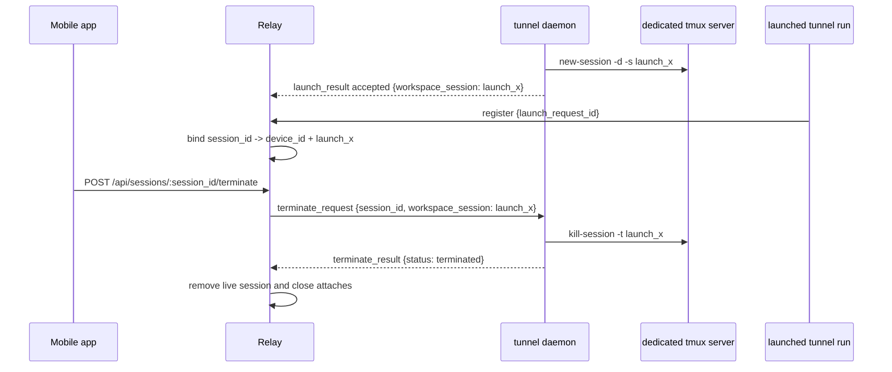

# feat: Add daemon workspace close and session terminate

## Overview

Add two deliberately separate operations:

- `tunnel daemon close` is the inverse of `tunnel daemon open`: it closes one currently open view of the daemon tmux workspace by detaching a tmux client. It must not stop the daemon, kill a tmux session, close a tmux window, or terminate a `tunnel run` process.
- Mobile session shutdown is a separate destructive operation, named `terminate`, that can target only live sessions created by the device daemon.

## Problem Frame

The current daemon model can create tmux-backed sessions from mobile launch requests and can list or open the daemon workspace. The missing local operation is not "kill this session"; it is "close the workspace view I opened." That means `close` must be non-destructive and paired conceptually with `open`.

The mobile requirement is different: the app needs a way to request that a daemon-created session be ended. Reusing `close` for that would blur an important product boundary, because local `close` means "detach workspace view" while mobile session shutdown means "terminate the target daemon-created session." The plan therefore keeps `close` for workspace view lifecycle and uses `terminate` for session lifecycle.

The important authorization constraint remains that `device_id` alone cannot prove a session was daemon-created. Direct local `tunnel run` also includes `device_id` when it can read daemon identity from local state. Mobile terminate therefore needs explicit daemon-workspace metadata captured during the launch that created the tmux session.

## Requirements Trace

- R1. `tunnel daemon close` closes one currently open daemon workspace view when possible by detaching a tmux client from the dedicated daemon tmux workspace.
- R2. `tunnel daemon close` is non-destructive: daemon process, tmux sessions, tmux windows, shell processes, and live `tunnel run` sessions remain intact.
- R3. `tunnel daemon close` is paired with `tunnel daemon open`; it must not be documented or implemented as a session stop/kill command.
- R4. Mobile/app clients can request termination for a live session only when that session was created by the daemon launch flow.
- R5. Direct local `tunnel run` sessions, even when they report a `device_id`, are not terminable through the mobile terminate API.
- R6. Terminating a daemon-created session kills the owning daemon tmux session, causes the owning agent websocket to disappear, closes active attaches, and removes the session from discovery.
- R7. Close and terminate failures are structured and user-scoped: another user's session is not revealed, offline devices fail clearly, and unknown tmux targets do not become generic internal errors.
- R8. Relay state remains live-only. The relay may route terminate requests and hold live terminate metadata, but it must not persist workspace history or become the owner of tmux state.

## Scope Boundaries

- No support for terminating direct local `tunnel run` sessions from mobile in this revision.
- No generic process-kill endpoint for arbitrary live sessions.
- No custom tmux picker, dashboard, rename, alias, or multi-session management UI.
- No durable close/terminate history, offline terminate queue, or relay-owned tmux inventory.
- No Windows support beyond the existing daemon platform boundary.
- No change to the attach websocket input model; terminate is an app-facing API action routed through the device daemon.

## Context & Research

### Relevant Code and Patterns

- `internal/tunnel/daemon/tmux.go` already centralizes dedicated tmux socket operations for list, open, and launch session creation. It is the right place for both workspace detach helpers and destructive session terminate helpers.
- `cmd/tunnel/cmd.go` and `cmd/tunnel/main.go` already define daemon subcommands and map daemon tmux errors into user-facing CLI output.
- `internal/tunnel/daemon/connector.go` owns daemon websocket handling, launch request validation, tmux launch session creation, and device health updates.
- `internal/protocol/device.go` defines current device websocket frames; it is the right place to add terminate request/result frame shapes.
- `internal/protocol/message.go` defines `SessionInfo` and agent registration frames; this is where terminable session metadata must become explicit enough for the relay to distinguish daemon-created sessions.
- `internal/relay/device/registry.go` owns live device peers, request correlation, and device-scoped routing. Terminate routing should follow this pattern without reusing launch single-flight state unnecessarily.
- `internal/relay/session/registry.go` owns live session metadata and attach cleanup. It needs a way to expose a terminate target for owned daemon-created sessions and remove sessions after successful terminate routing.
- `internal/relay/handler/api/sessions.go` and `internal/relay/handler/new.go` are the app-facing seams for adding a terminate request route.
- Existing contract tests live in `internal/tunnel/daemon/tmux_test.go`, `internal/tunnel/daemon/connector_test.go`, `internal/protocol/device_test.go`, `internal/relay/device/registry_test.go`, `internal/relay/handler/rest_api_test.go`, and `cmd/tunnel/main_test.go`.

### Institutional Learnings

- No `docs/solutions/` directory exists in this repo, so there is no prior institutional write-up for this workspace close / session terminate workflow.

### External References

- External research is not needed for this plan. The repo already has direct tmux helper patterns, and tmux detach/kill behavior over a dedicated socket is stable enough to follow local implementation style.

## Key Technical Decisions

- **Reserve `close` for workspace view lifecycle:** `tunnel daemon close` means "detach one open daemon workspace client if one exists." It must never mean stop daemon, kill tmux session, or terminate a `tunnel run` process.
- **Use `terminate` for destructive mobile session lifecycle:** Mobile session shutdown should be named terminate across API, protocol, and daemon routing. This keeps it visibly different from `daemon close` and `daemon stop`.
- **Terminate daemon tmux sessions, not arbitrary PTYs:** Mobile terminate should be constrained to sessions with a daemon workspace target captured during launch. This prevents accidental process-kill semantics for direct local sessions.
- **Treat one daemon launch as one terminable workspace unit:** The existing implementation creates one tmux session per remote launch. Terminate should kill that daemon-managed tmux session; close should only detach a tmux client from the workspace view.
- **Capture terminate target at daemon launch acceptance:** Extend the accepted launch result to include the daemon tmux session name. The relay can bind that target to the final `session_id` when the later `session_ready` registration arrives.
- **Expose terminate support without exposing raw tmux details to apps:** Public session discovery should tell clients whether terminate is supported, but the raw tmux target name should remain relay/device internal unless implementation simplicity proves the extra hiding layer unnecessary.
- **Route terminate through `/device/ws`:** The relay should ask the online owning daemon to terminate the tmux target and receive a terminate result. The relay should not execute tmux commands or infer local workspace state.
- **Use HTTP errors for authorization/scope and result bodies for routed terminate attempts:** `POST /api/sessions/:sessionID/terminate` should return `404 session_not_found` for missing or cross-user sessions and `409 session_terminate_unsupported` for live sessions that are not daemon-created. Once a request is eligible and routed to a daemon, device-side failures should be returned in a success envelope body with `status: "failed"` and a structured `reason`, matching the existing launch result pattern.
- **Keep local CLI close direct-to-tmux:** `tunnel daemon close` should use the dedicated tmux socket directly, like `open` and `sessions`, so it can detach preserved workspace views even when the daemon process is stopped.

## Open Questions

### Resolved During Planning

- **Should mobile terminate infer daemon ownership from `device_id`?** No. `device_id` is associated with the machine daemon identity, not the launch source. Explicit daemon workspace metadata is required.
- **Should close require the daemon process to be running?** No. Local CLI close should not require it because it acts directly on the dedicated tmux socket.
- **Should terminate require the daemon process to be running?** Yes for mobile. The relay can only route terminate through an online `/device/ws` daemon.
- **Should close kill the whole tmux server or session?** No. Close should detach an attached tmux client only.
- **Should terminate kill the whole tmux server?** No. Terminate should kill only the daemon-managed tmux session for the target launched session.

### Deferred to Implementation

- **Exact detached-client selection for `daemon close`:** The implementer should settle whether no-argument close detaches the current daemon tmux client when invoked inside the workspace, or detaches one attached client from the daemon workspace when invoked outside it. Either way, the command must be best-effort and non-destructive.

## High-Level Technical Design

> *This illustrates the intended approach and is directional guidance for review, not implementation specification. The implementing agent should treat it as context, not code to reproduce.*

## Implementation Units

- [x] **Unit 1: Add tmux workspace close and terminate primitives**

**Goal:** Add daemon-local tmux helpers for non-destructive workspace close and destructive daemon-created session terminate.

**Requirements:** R1, R2, R6, R7

**Dependencies:** None

**Files:**
- Modify: `internal/tunnel/daemon/tmux.go`
- Test: `internal/tunnel/daemon/tmux_test.go`

**Approach:**
- Add a helper that detaches one tmux client attached to the dedicated daemon workspace. This is the primitive behind `tunnel daemon close`.
- Add a separate helper that kills a named daemon workspace session through the dedicated socket. This is the primitive behind mobile session terminate, not local close.
- Return typed errors for no attached workspace client, target not found, missing tmux, detach failure, and terminate failure so CLI and remote routing can map failures without string parsing.
- Keep list/open/create helpers unchanged except for sharing common target validation code where it reduces duplication.

**Patterns to follow:**
- `internal/tunnel/daemon/tmux.go` for `EnsureTmuxAvailable`, `ListWorkspaceSessions`, and dedicated `tmux -S <socket>` execution.
- `internal/tunnel/daemon/tmux_test.go` fake tmux script pattern for asserting tmux arguments.

**Test scenarios:**
- Happy path: workspace close detaches one tmux client from the daemon workspace through `paths.TmuxSocketPath`.
- Happy path: terminating named session `launch_fixed` invokes tmux through `paths.TmuxSocketPath` and targets only `launch_fixed`.
- Edge case: workspace close when no daemon workspace client is attached returns a typed no-open-workspace error and does not create or kill sessions.
- Edge case: workspace close never targets a non-daemon tmux socket.
- Error path: missing `tmux` returns `ErrTmuxNotFound`.
- Error path: tmux reports missing terminate target and the helper returns a typed not-found error rather than a generic exec failure.

**Verification:**
- The daemon package can detach daemon workspace views and terminate daemon-created tmux sessions through separate helpers without touching default tmux.

- [x] **Unit 2: Add `tunnel daemon close` CLI**

**Goal:** Expose local workspace close as `tunnel daemon close`, the non-destructive counterpart to `tunnel daemon open`.

**Requirements:** R1, R2, R3, R7

**Dependencies:** Unit 1

**Files:**
- Modify: `cmd/tunnel/cmd.go`
- Modify: `cmd/tunnel/main.go`
- Modify: `cmd/tunnel/args.go`
- Test: `cmd/tunnel/main_test.go`
- Test: `cmd/tunnel/args_test.go`
- Modify: `docs/daemon.md`

**Approach:**
- Add `close` under `tunnel daemon` with no positional target.
- Implement close as a best-effort detach of one currently open daemon workspace tmux client. If no daemon workspace view is open, report that there is no open workspace to close and exit successfully.
- Render user-facing messages for no open workspace, detach failure, and missing tmux using existing daemon CLI tone.
- Keep this command direct-to-tmux, not routed through daemon IPC, matching `open` and `sessions`.
- Update daemon docs in this unit to clarify that `close` is not a per-session close command; it is the workspace-view counterpart to `open`.

**Patterns to follow:**
- `cmd/tunnel/cmd.go` for daemon subcommand registration and help wiring.
- `cmd/tunnel/main.go` for `runDaemonOpen` and `runDaemonSessions` error mapping.
- `docs/daemon.md` daemon command surface and tmux workspace contract.

**Test scenarios:**
- Happy path: `tunnel daemon close` detaches one open daemon workspace client and prints a close confirmation.
- Edge case: no daemon workspace view is open, so `tunnel daemon close` prints a no-open-workspace message and exits successfully.
- Edge case: `tunnel daemon close extra args` returns usage help so users do not mistake it for session targeting.
- Error path: missing tmux reuses install guidance.
- Integration: daemon help lists `close` as paired with `open`, and still does not imply session termination.

**Verification:**
- Users can close one open daemon workspace view locally from the CLI without starting the daemon and without affecting any tmux sessions.

- [x] **Unit 3: Track daemon workspace targets for terminable launched sessions**

**Goal:** Persist live-only terminate metadata from daemon launch acceptance through session registration so the relay can distinguish daemon-created sessions from direct local sessions.

**Requirements:** R4, R5, R7, R8

**Dependencies:** Unit 1

**Files:**
- Modify: `internal/protocol/device.go`
- Test: `internal/protocol/device_test.go`
- Modify: `internal/tunnel/daemon/connector.go`
- Test: `internal/tunnel/daemon/connector_test.go`
- Modify: `internal/relay/device/registry.go`
- Test: `internal/relay/device/registry_test.go`
- Modify: `internal/relay/session/registry.go`
- Test: `internal/relay/session/registry_test.go`
- Modify: `internal/relay/handler/agent/ws.go`
- Test: `internal/relay/handler/ws_api_test.go`

**Approach:**
- Extend successful `launch_result` frames to include the daemon workspace session name returned by `CreateLaunchSession`.
- Store that workspace target on the pending launch request in `internal/relay/device/registry.go`.
- When `CompleteLaunchIfOwner` observes the matching agent registration, return or publish enough metadata for `internal/relay/session/registry.go` to bind the live `session_id` to its terminate target.
- Account for the current ordering in `internal/relay/handler/agent/ws.go`: the session is registered before launch completion is currently signaled. The implementation should either retrieve terminate metadata before session registration and register once with terminate metadata, or register first and immediately update the live session with terminate metadata after `CompleteLaunchIfOwner`. The plan preference is register-once when practical because it avoids a transient `terminate_supported: false` snapshot.
- Add a terminate-support marker to public session metadata, such as `terminate_supported`, so mobile clients can decide when to show destructive session actions without seeing raw tmux target names.
- Do not mark sessions terminable only because they have `device_id`. Direct local sessions must remain visible but not terminable.

**Patterns to follow:**
- `internal/relay/device/registry.go` accepted launch request lifecycle and existing request correlation.
- `internal/relay/session/registry.go` live session snapshot and user-scoped lookup behavior.
- `internal/relay/handler/agent/ws.go` registration flow that already bridges launch completion into the device registry.

**Test scenarios:**
- Happy path: accepted launch result with workspace target plus later matching agent registration produces a live session with terminate support.
- Happy path: `GET /api/sessions` includes terminate support for the daemon-created session.
- Edge case: direct local session registration with `device_id` but no launch correlation remains not terminable.
- Edge case: launch accepted without workspace target does not create a terminate target and should be treated as terminate unsupported.
- Error path: workspace target from a stale or wrong owner launch request cannot attach to another user's session.
- Integration: agent registration ordering does not expose a daemon-created session as permanently non-terminable because terminate metadata arrived after session registration.
- Integration: replacing a live session preserves only the terminate metadata associated with the new registration.

**Verification:**
- Terminability is explicit, user-scoped, live-only, and cannot be inferred from `device_id` alone.

- [x] **Unit 4: Route mobile terminate through the relay and device websocket**

**Goal:** Add an app-facing terminate endpoint that authorizes by live session ownership, routes only daemon-created sessions to the owning online daemon, and returns structured terminate results.

**Requirements:** R4, R5, R6, R7, R8

**Dependencies:** Units 1 and 3

**Files:**
- Modify: `internal/protocol/device.go`
- Test: `internal/protocol/device_test.go`
- Modify: `internal/relay/device/registry.go`
- Test: `internal/relay/device/registry_test.go`
- Modify: `internal/relay/handler/device/ws.go`
- Modify: `internal/tunnel/daemon/connector.go`
- Test: `internal/tunnel/daemon/connector_test.go`
- Modify: `internal/relay/handler/api/sessions.go`
- Create: `internal/relay/handler/types/session.go`
- Modify: `internal/relay/handler/new.go`
- Modify: `internal/relay/handler/response/response.go`
- Test: `internal/relay/handler/rest_api_test.go`

**Approach:**
- Add `POST /api/sessions/:sessionID/terminate` for authenticated app clients. Use an explicit action route rather than `DELETE` so the API name communicates that this is destructive session termination, not workspace close.
- Have the API layer look up the live session for the authenticated user. Missing or cross-user sessions should continue to look like `session_not_found`.
- If the session lacks daemon terminate metadata, return `409` with `session_terminate_unsupported` and do not contact any device daemon.
- Add `terminate_request` and `terminate_result` frames on `/device/ws` with a relay-scoped request ID, public `session_id`, and internal workspace target.
- In the daemon connector, handle `terminate_request` by killing the requested daemon workspace session and replying with `terminated` or `failed` plus a structured reason.
- In the relay device registry, route terminate requests to the currently online owning device. Device offline, peer send failure, terminate timeout, target not found, and tmux failure should produce structured outcomes.
- Return routed terminate outcomes as a `TerminateSessionResponse` body: `request_id`, `status: "terminated"|"failed"`, and optional `reason`. Expected failure reasons include `device_offline`, `terminate_timeout`, `session_not_found`, `tmux_not_found`, and `session_terminate_failed`.
- After a successful daemon terminate result, remove the live session from discovery and close active attaches promptly; the owning agent socket should also disappear naturally when tmux terminates the launched process.

**Patterns to follow:**
- `internal/relay/handler/api/devices.go` for app-authenticated routed operations that return operation results in the API envelope.
- `internal/relay/device/registry.go` for request ID generation, peer liveness handling, and in-memory correlation.
- `internal/relay/handler/device/ws.go` for frame dispatch.
- `internal/tunnel/daemon/connector.go` for device websocket request handling and typed failure reason mapping.

**Test scenarios:**
- Happy path: app terminates a daemon-created live session, relay sends one terminate request to the owning device, daemon returns terminated, API returns success, and the session disappears from `GET /api/sessions`.
- Happy path: active attaches on the session receive the existing session-offline close behavior after successful terminate.
- Edge case: terminating another user's session returns `session_not_found` and sends no device frame.
- Edge case: terminating a direct local session with `device_id` but no terminate target returns `409 session_terminate_unsupported` and sends no device frame.
- Error path: owning daemon offline returns a structured device-offline terminate failure.
- Error path: daemon reports target not found and the API returns that structured terminate failure without removing an unrelated live session.
- Error path: terminate request times out and the session remains discoverable.
- Integration: terminating one daemon-created session does not affect other sessions in the same daemon tmux workspace.

**Verification:**
- Mobile can terminate daemon-created sessions through a user-scoped API, and non-daemon sessions remain protected from terminate routing.

- [x] **Unit 5: Align public contracts and docs**

**Goal:** Document the new non-destructive close contract and destructive terminate contract across CLI, API, protocol, architecture, and agent guidance.

**Requirements:** R1-R8

**Dependencies:** Units 2-4

**Files:**
- Modify: `README.md`
- Modify: `docs/api.md`
- Modify: `docs/protocol.md`
- Modify: `docs/daemon.md`
- Modify: `docs/architecture.md`
- Modify: `AGENTS.md`
- Modify: `CLAUDE.md`

**Approach:**
- Update daemon docs to state that `tunnel daemon close` is the workspace-view counterpart to `open`, not a session stop or kill operation.
- Document `tunnel daemon close`, best-effort detach behavior, and the fact that it uses only the dedicated daemon tmux socket.
- Document `POST /api/sessions/:sessionID/terminate`, terminate-supported session metadata, response shapes, and structured terminate failure reasons.
- Update protocol docs for `launch_result` workspace metadata and new `/device/ws` terminate frames.
- Keep relay ownership language explicit: the relay routes terminate requests and maintains live metadata, but the daemon owns tmux state and the relay does not store terminate history.
- Keep docs explicit that only daemon-created sessions are terminable from mobile in this revision.

**Patterns to follow:**
- `docs/api.md` route sections and error tables.
- `docs/protocol.md` device websocket and agent registration sections.
- `docs/daemon.md` command-surface and tmux-workspace contract.
- Docs alignment rules in `AGENTS.md` and `CLAUDE.md`.

**Test scenarios:**
- Test expectation: none -- documentation-only unit, but the implementer should verify docs distinguish workspace close from session terminate consistently.

**Verification:**
- The repo docs consistently explain local workspace close behavior, mobile terminate behavior, their limits, and live-only relay ownership.

## System-Wide Impact

- **Interaction graph:** `tunnel daemon close` targets local tmux detach directly; `POST /api/sessions/:id/terminate` targets session registry metadata, device registry routing, `/device/ws` terminate frames, daemon tmux terminate helper, and session attach cleanup.
- **Error propagation:** User-owned session lookup errors should stay indistinguishable from missing sessions. Device terminate failures and local close failures should become structured outcomes, not generic internal errors.
- **State lifecycle risks:** Terminate metadata is live-only and derived from launch correlation. It should disappear when the session disappears and should not survive relay restart or agent reconnect unless the same live registration supplies valid terminate context again.
- **API surface parity:** Session discovery, terminate endpoint, device websocket frames, daemon CLI help, and docs all need coordinated updates so clients know when terminate is available and what `close` means.
- **Integration coverage:** Unit tests should prove tmux command construction, but handler and registry tests must prove the full app terminate path: app request -> relay authorization -> device terminate frame -> daemon result -> session removal/attach closure.
- **Unchanged invariants:** `tunnel run <command>` remains the owner of direct local PTY sessions; relay attach remains session-scoped; relay remains content-opaque and does not inspect terminal output; daemon stop still must not kill existing tmux sessions.

## Risks & Dependencies

| Risk | Mitigation |
|------|------------|
| Direct local sessions become terminable by accident because they share `device_id` | Require explicit daemon launch terminate metadata and add tests for direct sessions with `device_id` |
| Raw tmux target names leak unnecessarily to mobile clients | Expose a boolean terminate-support field publicly and keep tmux target metadata internal where practical |
| Relay removes a live session after a false-positive terminate success | Only remove after daemon reports terminate success for the exact workspace target; keep failures non-destructive |
| `daemon close` is mistaken for stop or terminate | Keep `close` targetless, pair it with `open` in CLI/docs, and use `terminate` everywhere for destructive session shutdown |
| Terminate request races with agent disconnect or device disconnect | Treat already-gone sessions as not found at the app boundary and device disconnects as structured terminate failure before destructive relay cleanup |
| Accepted launch with missing workspace metadata creates an unterminable daemon session | Keep this as a safe degradation and document terminate support as best-effort for daemon-created sessions once metadata is available |
| Session registration happens before launch completion metadata is available | Make the agent websocket handler either fetch terminate metadata before registration or immediately update the live session after launch completion, and test the ordering explicitly |

## Documentation / Operational Notes

- This change adds an app-facing API route and device websocket frames for terminate, so `docs/api.md` and `docs/protocol.md` must be updated with request/response examples and failure reasons.
- This change updates daemon lifecycle semantics, so `docs/daemon.md`, `docs/architecture.md`, `README.md`, `AGENTS.md`, and `CLAUDE.md` must be aligned.
- No data migration or persistent relay storage is required.

## Sources & References

- Related origin context: `docs/brainstorms/2026-04-18-mobile-device-tmux-workspace-requirements.md`
- Related prior plan: `docs/plans/2026-04-18-001-feat-mobile-device-tmux-workspace-plan.md`
- Related code: `internal/tunnel/daemon/tmux.go`
- Related code: `internal/tunnel/daemon/connector.go`
- Related code: `internal/relay/device/registry.go`
- Related code: `internal/relay/session/registry.go`
- Related code: `internal/relay/handler/api/sessions.go`
- Related code: `internal/protocol/device.go`
