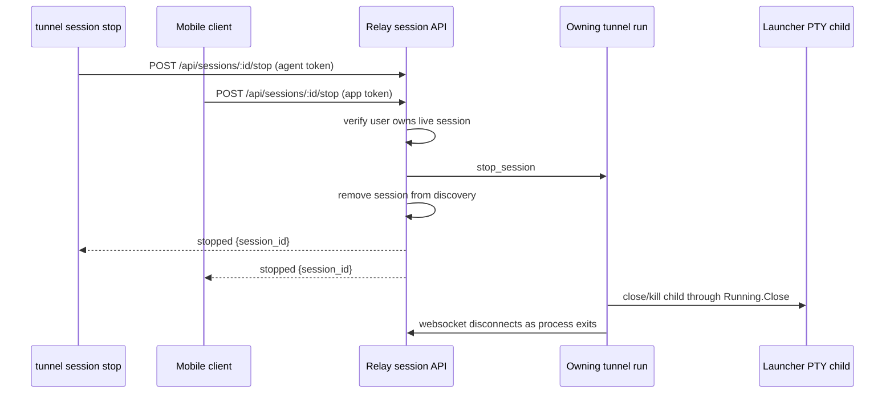

# feat: Add unified session management

## Overview

Add an account-level `tunnel session` CLI surface for listing and stopping live Tunnel sessions while keeping `tunnel run` as the only local start command. Replace the daemon-specific session shutdown model with a unified stop model: local CLI and mobile clients both ask the relay to send a stop control message to the owning `tunnel run` agent, and the agent exits its own session.

This plan intentionally keeps daemon commands focused on daemon and tmux workspace lifecycle. `tunnel daemon open` and `tunnel daemon close` remain workspace-view commands; `tunnel daemon stop` remains daemon lifecycle; `tunnel session stop` becomes session lifecycle.

This plan does not implement the planned future single-long-connection multiplexing refactor. It does keep the new stop behavior as a routable session control message so that later refactor can carry the same user-facing operation over a multiplexed transport without changing `tunnel session stop` or mobile stop semantics.

## Problem Frame

The origin document defines the product target: users should not need to learn separate session-management concepts for direct `tunnel run` sessions and daemon-launched sessions. Both are live `tunnel run` sessions, so they should be listed and stopped through the same session-management commands (see origin: `docs/brainstorms/2026-04-22-unified-session-management-requirements.md`).

The current code already has account-scoped live session discovery in the relay, and daemon-launched sessions are registered as normal agent sessions. The mismatch is shutdown: `POST /api/sessions/:id/terminate` currently works only for daemon-created sessions with tmux terminate metadata. Direct `tunnel run` sessions cannot be stopped remotely. The new model should stop the owning agent session directly, so daemon-launch origin no longer determines whether a session can be stopped.

## Requirements Trace

- R1. `tunnel run <command>` remains the only local CLI command for starting a foreground Tunnel session.
- R2. Do not add `tunnel session start`.
- R3. Add `tunnel session list` as the primary account-level live session list command.
- R4. Add `tunnel session stop <session-id>` as the primary live session stop command.
- R5. Keep daemon commands focused on daemon and workspace lifecycle.
- R6. De-emphasize `tunnel daemon sessions` because it lists tmux workspace sessions, not account-level Tunnel sessions.
- R7. `tunnel session list` lists all currently online sessions for the authenticated account, including other machines.
- R8. The list distinguishes current-machine sessions from sessions on other machines when reliable local identity exists.
- R9. The list distinguishes direct `tunnel run` sessions from daemon-launched sessions.
- R10. The list uses `label`; it does not introduce `name`.
- R11-R21. The default table is bordered, emoji-free, fixed-width, omits `platform_id`, and truncates long values predictably.
- R22-R24. Session stop targets the live `tunnel run` session and does not stop the daemon or kill the daemon tmux workspace.
- R25-R26. Local CLI and mobile stop both route through the relay; no local-only registry or per-session local socket is added.
- R27. Successful CLI stop output includes the session id and enough machine context for remote stops.
- R28-R29. This revision does not implement connection multiplexing, but stop is modeled as a routable session control action compatible with a later one-long-connection-per-device transport.

## Scope Boundaries

- No `tunnel session start`.
- No local-only session stop fast path.
- No local session registry, per-session local control socket, or pid inventory.
- No list filters such as `--local` in the first version.
- No emoji in the bordered session table.
- No `platform_id` display in the default table.
- No daemon workspace killing as part of normal `tunnel session stop`.
- No broadening of attach websocket auth; browser/native attach remains app-session authenticated.
- No single-long-connection multiplexing refactor in this revision.
- No compatibility alias for `/api/sessions/:id/terminate`; that route has not shipped and should be removed from the active contract.

## Context & Research

### Relevant Code and Patterns

- `cmd/tunnel/cmd.go` owns Cobra command wiring and root help registration. New `session` commands should follow `run`, `auth`, and `daemon` command structure.
- `cmd/tunnel/args.go` owns hand-written help text. Root help, session help, and examples need to stay aligned.
- `cmd/tunnel/auth_store.go` stores the local agent token used by `tunnel run` and `tunnel daemon start`. CLI session management should use this existing local auth path instead of requiring a separate app access token.
- `cmd/tunnel/auth_api.go` already has a small JSON-envelope HTTP client pattern that can be reused or split for session-management calls.
- `cmd/tunnel/main.go` owns `runTunnelSession`, current session metadata assembly, daemon identity lookup, and user-facing daemon command behavior.
- `internal/protocol/message.go` defines `SessionInfo` and `AgentFrame`, the right place for session origin metadata and the new agent stop control frame.
- `internal/tunnel/connector/connector.go` receives relay-to-agent control frames and routes them into local runtime behavior. It currently handles attach/input/resize-related frames but not stop.
- `internal/tunnel/session/process.go` already exposes `Running.Close()`, which kills and reaps the child process and treats expected signaled exits as clean shutdown.
- `internal/relay/session/registry.go` owns live session lookup, owner websocket routing, attach cleanup, and user-scoped list behavior. It already has a generic owner-send path that can become the basis for stop.
- `internal/relay/handler/api/sessions.go` currently lists sessions through app auth and terminates daemon-created sessions through the device registry. This is the main route to replace or supersede for unified stop.
- `internal/relay/handler/new.go` groups app-authenticated routes. Session list/stop need an auth path usable by both app access tokens and locally saved agent tokens.
- `internal/relay/handler/ws_api_test.go`, `internal/relay/handler/rest_api_test.go`, `internal/relay/session/registry_test.go`, `internal/tunnel/connector/connector_test.go`, `cmd/tunnel/main_test.go`, and `cmd/tunnel/args_test.go` are the key test locations.

### Institutional Learnings

- No `docs/solutions/` directory exists in this repo, so there are no prior institutional write-ups to reuse.

### External References

- External research is not needed. The repo already has established Go, Cobra, Gin, relay registry, JSON envelope, and WebSocket control-message patterns.

## Key Technical Decisions

- **Use relay-mediated stop for both CLI and mobile:** This preserves one authorization model, one account-wide session list, and one stop behavior across local and remote sessions.
- **Stop the owning agent, not the daemon tmux session:** `session stop` should stop the live `tunnel run` process. For daemon-launched sessions, the surrounding tmux workspace can remain and return to shell according to the existing daemon wrapper behavior.
- **Add explicit session origin metadata:** Add a relay-controlled origin value such as `run`, `daemon`, or `unknown` to session snapshots so CLI and clients do not infer origin from `device_id` or terminate support.
- **Classify local scope only when reliable:** Use the current machine's daemon `device_id` when available. If the current machine has no readable daemon identity or the session lacks comparable identity, render `Scope` as `unknown` rather than guessing from hostname.
- **Allow agent-token auth only for session list/stop:** The local CLI already stores an agent token. Add or refactor middleware so `GET /api/sessions` and `POST /api/sessions/:id/stop` can authenticate either an app access token or an agent token, while keeping sensitive app/session-management routes on their existing auth model.
- **Remove `/api/sessions/:id/terminate` from the active contract:** The terminate route was added recently and has not shipped, so the simpler path is to replace it with `/api/sessions/:id/stop` rather than carry a compatibility alias.
- **Remove session from discovery after stop request is accepted:** Once relay successfully writes `stop_session` to the owning agent, the session should disappear from discovery and active attaches should close with a stop-specific reason. The agent then exits itself.
- **Keep table rendering deterministic:** Use fixed column widths, tail truncation for `Label`, `Command`, and `Machine`, and middle truncation for `CWD`.
- **Keep stop transport-neutral:** Model stop as a session-addressed control action. Today's implementation sends it over the existing agent websocket, but the message shape should be able to move into a future multiplexed device/client relay connection without changing the CLI or mobile API semantics.

## Open Questions

### Resolved During Planning

- **Should local CLI stop bypass relay?** No. It would require a local session registry and per-session control sockets, and it would diverge from mobile stop behavior.
- **Should `tunnel session start` exist?** No. Local creation stays with `tunnel run`; daemon/device creation stays a mobile/API launch concern.
- **Should default list include remote machines?** Yes. It should mirror account-level live session discovery.
- **Should `platform_id` display in the table?** No. Use the best machine name only.
- **Should origin be inferred from `terminate_supported`?** No. Stop will be supported for all live sessions, so origin needs its own metadata.
- **Should `/api/sessions/:id/terminate` remain for compatibility?** No. It has not shipped, and keeping it would add unnecessary lifecycle ambiguity.
- **Should this plan implement single-connection multiplexing?** No. This plan should avoid blocking that refactor, but multiplexing is a separate follow-up.

### Deferred to Implementation

- **Exact timeout/wait behavior after sending `stop_session`:** The plan recommends accepting stop when the frame is written and removing discovery immediately. Implementation can add a short confirmation wait only if it stays simple and does not create inconsistent CLI/mobile behavior.
- **Exact table width constants:** Use the origin table shape as the target, but adjust a few characters if tests reveal better alignment.

## High-Level Technical Design

> *This illustrates the intended approach and is directional guidance for review, not implementation specification. The implementing agent should treat it as context, not code to reproduce.*

For daemon-launched sessions, the `Agent` participant is still the `tunnel run` process inside tmux. The stop request exits that Tunnel session; it does not send a device terminate request and does not kill the tmux workspace session.

The `stop_session` frame is intentionally session-addressed. In the current implementation it travels over `/agent/ws`; in the later multiplexing refactor it should be movable into the single long-lived device/client relay connection as one routed control message.

## Implementation Units

- [ ] **Unit 1: Add protocol metadata and stop control**

**Goal:** Extend shared protocol types so session snapshots expose origin and relay can send an agent stop control frame.

**Requirements:** R8, R9, R22-R24

**Dependencies:** None

**Files:**
- Modify: `internal/protocol/message.go`
- Test: `internal/protocol/message_test.go`

**Approach:**
- Add a session origin field to `SessionInfo`, with expected public values `run`, `daemon`, and `unknown`.
- Add a helper for the relay-to-agent stop control frame, using a clear frame type such as `stop_session`.
- Keep origin assignment relay-controlled. Agents can register their existing metadata, but the relay should decide whether a session is direct or daemon-launched based on launch correlation.
- Remove or stop exposing `terminate_supported` from the active public contract once unified stop is in place. Stop support should follow live session ownership, not daemon terminate metadata.

**Patterns to follow:**
- `RegisterFrameWithLaunchRequest`, `AttachOpenFrame`, and input frame helpers in `internal/protocol/message.go`.
- JSON field coverage in `internal/protocol/message_test.go`.

**Test scenarios:**
- Happy path: marshaling a `SessionInfo` with origin `daemon` includes the origin field.
- Happy path: `StopSessionFrame` produces a frame with only the expected stop type.
- Edge case: origin omitted or empty decodes without breaking existing session snapshots and can be rendered as `unknown` by consumers.
- Regression: existing register, attach, resize, input, and snapshot frame tests continue to pass except where `terminate_supported` expectations are deliberately replaced by unified stop/origin expectations.

**Verification:**
- Protocol types can represent session origin and stop control without changing attach packet behavior.

- [ ] **Unit 2: Implement relay-side unified session stop**

**Goal:** Add relay registry and HTTP API behavior that stops any owned live session by sending a stop frame to the owning agent.

**Requirements:** R4, R22-R27

**Dependencies:** Unit 1

**Files:**
- Modify: `internal/relay/session/registry.go`
- Test: `internal/relay/session/registry_test.go`
- Modify: `internal/relay/handler/api/sessions.go`
- Modify: `internal/relay/handler/middleware/app_auth.go`
- Modify: `internal/relay/handler/middleware/agent_auth.go`
- Modify: `internal/relay/handler/types/session.go`
- Modify: `internal/relay/handler/response/response.go`
- Modify: `internal/relay/handler/new.go`
- Test: `internal/relay/handler/rest_api_test.go`
- Test: `internal/relay/handler/ws_api_test.go`

**Approach:**
- Add a registry method that looks up a session by `session_id` and user, writes `stop_session` to the owning agent peer, removes the session from discovery, and closes app-side attaches with a stop-specific reason such as `session_stopped`.
- Return `404 session_not_found` for missing or cross-user sessions. Return a service/unavailable-style error only when the session exists but the owner peer cannot receive the stop frame.
- Add `POST /api/sessions/:sessionID/stop` as the new public stop endpoint.
- Adjust route wiring so session list and stop can be authenticated by either app access tokens or agent tokens. Keep attach routes app-authenticated.
- Keep `GET /api/sessions` response sorting behavior from `Registry.ListForUser`.
- Remove `POST /api/sessions/:sessionID/terminate` from route wiring and tests. Add `POST /api/sessions/:sessionID/stop` as the only session shutdown route in the active contract.
- Do not use device terminate routing for the normal user-facing stop path.

**Patterns to follow:**
- User-scoped lookup and attach cleanup in `internal/relay/session/registry.go`.
- Current `ListSessions` and `TerminateSession` handler shape in `internal/relay/handler/api/sessions.go`.
- Existing API envelope response types in `internal/relay/handler/types/session.go`.
- Auth middleware split in `internal/relay/handler/middleware/app_auth.go` and `internal/relay/handler/middleware/agent_auth.go`.

**Test scenarios:**
- Happy path: app-authenticated `POST /api/sessions/sess-1/stop` sends `stop_session` to the owning agent, returns `status: "stopped"`, removes the session from `GET /api/sessions`, and closes active attaches with `session_stopped`.
- Happy path: agent-token-authenticated `POST /api/sessions/sess-1/stop` has the same behavior for a session owned by the same user.
- Happy path: agent-token-authenticated `GET /api/sessions` lists only that token owner's sessions.
- Edge case: direct `tunnel run` session with `device_id` but no daemon terminate metadata can still be stopped.
- Edge case: daemon-launched session can be stopped without sending a `terminate_request` to `/device/ws`.
- Edge case: `POST /api/sessions/sess-1/terminate` is no longer available in the active contract.
- Error path: cross-user stop returns the same not-found response as a missing session.
- Error path: missing bearer token still returns the standard unauthorized envelope.
- Error path: stale/offline owner peer returns a structured failure and does not reveal another user's session.
- Integration: active attach websocket receives a closing control message when stop succeeds.

**Verification:**
- Relay stop no longer depends on daemon terminate metadata, `/terminate` is removed from the active contract, and session discovery reflects stopped sessions immediately after successful stop request acceptance.

- [ ] **Unit 3: Make `tunnel run` obey relay stop requests**

**Goal:** Teach the local connector and runtime to stop the running session when the relay sends `stop_session`.

**Requirements:** R22-R24

**Dependencies:** Unit 1

**Files:**
- Modify: `internal/tunnel/connector/connector.go`
- Test: `internal/tunnel/connector/connector_test.go`
- Modify: `cmd/tunnel/main.go`
- Test: `cmd/tunnel/main_test.go`
- Test: `internal/tunnel/session/process_test.go`

**Approach:**
- Extend connector inbound handling with a stop signal exposed to `runTunnelSession`.
- Ensure a stop request that arrives before the PTY child is fully started prevents session startup or causes immediate shutdown rather than being lost.
- In `runTunnelSession`, wait for the connector stop signal alongside local terminal completion and child process completion.
- On stop, close the running session through existing `Running.Close()` behavior and return a clean nil error when the shutdown was initiated by stop.
- Cancel the connector/runtime context as part of stop handling so the connector does not reconnect and re-register the same stopped session.
- Do not route this through daemon code or tmux code.

**Patterns to follow:**
- Connector inbound control dispatch in `internal/tunnel/connector/connector.go`.
- Existing process shutdown semantics in `internal/tunnel/session/process.go`.
- `waitForProcessOrShutdown` tests in `cmd/tunnel/main_test.go`.

**Test scenarios:**
- Happy path: connector receives `stop_session` and closes a stop-request channel exactly once.
- Happy path: `runTunnelSession` receives a stop request after PTY startup, calls the running session close path, and exits without surfacing a child-killed error.
- Edge case: duplicate `stop_session` frames do not panic or attempt duplicate close work.
- Edge case: stop request before `BindHub` or before child startup is not lost.
- Error path: unknown inbound frame types remain ignored as they are today.
- Integration: attach/input/resize behavior continues to work after adding stop handling.

**Verification:**
- A relay stop frame can terminate a local `tunnel run` session without daemon involvement.

- [ ] **Unit 4: Track origin and local scope for session listing**

**Goal:** Populate session origin in relay snapshots and provide CLI-side local/remote classification using reliable local identity only.

**Requirements:** R7-R10, R14-R16

**Dependencies:** Unit 1

**Files:**
- Modify: `internal/relay/session/registry.go`
- Test: `internal/relay/session/registry_test.go`
- Modify: `internal/relay/handler/agent/ws.go`
- Modify: `internal/relay/handler/device/ws.go`
- Test: `internal/relay/handler/ws_api_test.go`
- Modify: `cmd/tunnel/main.go`
- Test: `cmd/tunnel/main_test.go`

**Approach:**
- Mark normal agent registrations as origin `run` by default.
- When a valid daemon launch correlation completes for a registering session, mark origin `daemon`.
- Handle late accepted launch results by backfilling origin using the existing late-launch completion pattern.
- Do not let an agent self-assert daemon origin merely by sending a `device_id` or launch-like field.
- For CLI display, classify `local` only when the current machine has a readable daemon identity and the session's `device_id` matches it. Classify sessions with another non-empty `device_id` as `remote`. Use `unknown` when reliable comparison is unavailable.

**Patterns to follow:**
- Existing late accepted launch backfill pattern in `internal/relay/handler/device/ws.go`.
- Session snapshot mutation in `internal/relay/session/registry.go`.
- Local daemon identity lookup through `sessionDeviceID()` and `readSessionDeviceIdentity`.

**Test scenarios:**
- Happy path: direct agent registration without launch correlation lists origin `run`.
- Happy path: daemon launch registration with matching launch request lists origin `daemon`.
- Edge case: direct registration with `device_id` but no launch correlation remains origin `run`.
- Edge case: late launch accepted result backfills origin `daemon`.
- Edge case: CLI scope classification returns `unknown` when no local daemon identity is readable.
- Edge case: CLI scope classification returns `local` only for matching non-empty device ids.

**Verification:**
- Session list consumers can display origin and scope without inferring source from removed terminate metadata.

- [ ] **Unit 5: Add `tunnel session` CLI commands and table rendering**

**Goal:** Expose `tunnel session list` and `tunnel session stop <session-id>` with the requested stable bordered table and concise stop output.

**Requirements:** R1-R4, R7-R21, R27

**Dependencies:** Units 2 and 4

**Files:**
- Modify: `cmd/tunnel/cmd.go`
- Modify: `cmd/tunnel/args.go`
- Modify: `cmd/tunnel/main.go`
- Modify: `cmd/tunnel/auth_api.go`
- Test: `cmd/tunnel/args_test.go`
- Test: `cmd/tunnel/main_test.go`
- Test: `cmd/tunnel/auth_api_test.go`

**Approach:**
- Add a `session` top-level command with `list` and `stop`.
- Do not add `start`.
- Resolve auth through the existing runtime auth precedence: `TUNNEL_AUTH_TOKEN` first, then `~/.tunnel/auth.json`.
- Resolve relay base URL like other CLI relay operations, using explicit `--base-url` only if added as a standard connection flag, otherwise `TUNNEL_BASE_URL` and the default. Do not add filtering flags.
- Add a small session API client for `GET /api/sessions` and `POST /api/sessions/:id/stop`, reusing JSON envelope behavior from `relayAuthAPI`.
- Render a bordered table with columns `Scope`, `Origin`, `Session`, `Label`, `Command`, `Machine`, `CWD`, and `Age`.
- Use fixed column widths. Tail-truncate `Label`, `Command`, and `Machine`; middle-truncate `CWD`; render empty labels as `-`.
- Render `Machine` as `This machine` for local rows, otherwise best available `computer_name`, with a fallback such as `-`.
- For `stop`, fetch or use returned session context so success output includes session id and machine context, for example `Stopped session 1839012 on Office Linux`.

**Patterns to follow:**
- Root and daemon command help style in `cmd/tunnel/args.go`.
- Existing `runDaemonSessions` tabular rendering is not sufficient because this table needs borders, but its stdout/error style is still relevant.
- Auth store and HTTP client patterns in `cmd/tunnel/auth_store.go` and `cmd/tunnel/auth_api.go`.

**Test scenarios:**
- Happy path: `tunnel session list` renders the exact bordered table for mixed local, remote, daemon, and direct sessions.
- Happy path: `tunnel session stop sess-1` sends the stop request and prints stopped session output with machine context.
- Edge case: empty session list prints a concise empty-state message rather than an empty table if that is the chosen UI.
- Edge case: long `Label`, `Command`, and `Machine` values are tail-truncated without breaking borders.
- Edge case: long `CWD` is middle-truncated and keeps the final directory visible.
- Edge case: missing label renders `-`.
- Edge case: no local daemon identity makes scope `unknown` instead of incorrectly marking rows local.
- Error path: missing session id for `stop` returns usage help.
- Error path: `tunnel session start` is unknown and not suggested as a supported command.
- Error path: missing local auth reports the existing auth guidance.
- Integration: root help includes `session` and no longer presents `tunnel daemon sessions` as the primary session-management path.

**Verification:**
- Users can list and stop account-level live sessions from the CLI using existing local auth, and the table remains aligned with long values.

- [ ] **Unit 6: Update docs and active API language**

**Goal:** Align user-facing and protocol documentation with unified session stop and the new CLI surface.

**Requirements:** R1-R27

**Dependencies:** Units 1-5

**Files:**
- Modify: `README.md`
- Modify: `docs/api.md`
- Modify: `docs/protocol.md`
- Modify: `docs/architecture.md`
- Modify: `docs/daemon.md`
- Modify: `CLAUDE.md`
- Modify: `AGENTS.md`

**Approach:**
- Document `tunnel session list` and `tunnel session stop <session-id>` as the main session-management commands.
- Document `tunnel run` as the only local session start command.
- Reword daemon docs so `daemon open/close/start/stop` remain workspace and daemon lifecycle operations.
- De-emphasize `tunnel daemon sessions` and clarify that it is a tmux workspace inspection command, not the account-level Tunnel session list.
- Update API docs for `POST /api/sessions/:id/stop`, dual app/agent-token auth if implemented, stop response shape, and stop-specific attach closing reason.
- Update protocol docs for `SessionInfo.origin` and relay-to-agent `stop_session`.
- Update architecture docs to say stop routes through the owning agent, not device terminate, and does not kill daemon tmux workspace sessions.
- Remove `/api/sessions/:id/terminate` from the documented active API and document `/api/sessions/:id/stop` as the only session shutdown route.
- Add a short note that this revision does not implement single-connection multiplexing, but `stop_session` is a session control message intended to survive that transport refactor.

**Patterns to follow:**
- Existing docs consistency requirements in `AGENTS.md` and `CLAUDE.md`.
- Current endpoint inventory and session model descriptions in `docs/api.md` and `docs/protocol.md`.
- Daemon boundary language in `docs/daemon.md`.

**Test scenarios:**
- Test expectation: none -- documentation-only unit, with correctness verified by consistency against implemented API/protocol behavior.

**Verification:**
- Docs no longer imply that only daemon-created sessions can be stopped through the main user-facing session stop flow.

## System-Wide Impact

- **Interaction graph:** `cmd/tunnel` CLI calls relay session APIs; relay session APIs authenticate app or agent tokens; relay registry sends `stop_session` to the owning agent peer; tunnel connector signals `runTunnelSession`; the local running session closes its child process.
- **Error propagation:** Missing/cross-user session remains `session_not_found`. Failed owner send should surface as a structured stop failure without revealing cross-user existence. CLI should translate relay envelope errors into concise user-facing errors.
- **State lifecycle risks:** Relay removes stopped sessions from live discovery immediately after stop request acceptance. Agent disconnect cleanup must tolerate the session already being removed. Duplicate stop requests should be idempotent enough to return not found after the first succeeds.
- **API surface parity:** Mobile and CLI should both use the new stop semantics. Existing app attach remains app-token only. Existing daemon launch remains device-scoped. `/terminate` is removed rather than preserved as an alias.
- **Future multiplexing:** The stop frame should stay independent of the current `/agent/ws` transport shape so it can later become one routed message on a single long-lived relay connection.
- **Integration coverage:** Unit tests need to prove registry behavior, while websocket/API integration tests need to prove stop control reaches the agent and active attaches close.
- **Unchanged invariants:** Relay remains live-only and content-opaque. The relay still does not own terminal state, transcript history, tmux workspace state, or durable device inventory. `tunnel run` startup relay registration remains mandatory.

## Risks & Dependencies

| Risk | Mitigation |
|------|------------|
| Agent-token auth on session APIs accidentally broadens unrelated app APIs | Add a narrow session-management auth middleware and apply it only to list/stop routes. Keep attach, auth, agent-token management, device launch, and password routes on existing auth. |
| Stop request is sent but agent does not exit | Keep connector stop handling small and covered by connector/runtime tests. Relay removes discovery after write success; reconnect with same session should be prevented by the agent exiting. |
| Local/remote scope is guessed incorrectly | Use only reliable daemon `device_id` comparison. Render `unknown` when no reliable local identity exists. |
| Old daemon terminate semantics conflict with unified stop | Remove `/terminate` from the active contract and update docs/tests so new behavior is centered only on `/stop`. |
| Bordered table breaks with long text | Use fixed widths and deterministic truncation with exact-output tests for long values. |
| Daemon-launched stop accidentally kills tmux workspace | Stop through agent control only; do not send `terminate_request` to `/device/ws` for unified stop. |
| New stop design fights the future multiplexing refactor | Keep stop as a session-addressed control message and avoid introducing CLI/mobile semantics tied to today's separate websocket topology. |

## Documentation / Operational Notes

- This change touches public CLI, public relay HTTP API, agent websocket protocol, session lifecycle semantics, and daemon documentation.
- Update `README.md`, `docs/api.md`, `docs/protocol.md`, `docs/architecture.md`, `docs/daemon.md`, `CLAUDE.md`, and `AGENTS.md` in the same implementation.
- Mobile clients should move from daemon-specific terminate semantics to unified session stop semantics.
- This revision should remove recently added terminate API documentation rather than carrying compatibility language.

## Sources & References

- **Origin document:** `docs/brainstorms/2026-04-22-unified-session-management-requirements.md`
- Related plan: `docs/plans/2026-04-21-001-feat-daemon-workspace-close-session-terminate-plan.md`
- CLI command wiring: `cmd/tunnel/cmd.go`
- CLI help text: `cmd/tunnel/args.go`
- CLI auth and HTTP client: `cmd/tunnel/auth_store.go`, `cmd/tunnel/auth_api.go`
- Tunnel runtime: `cmd/tunnel/main.go`, `internal/tunnel/connector/connector.go`, `internal/tunnel/session/process.go`
- Relay session API: `internal/relay/handler/api/sessions.go`, `internal/relay/handler/new.go`
- Relay session registry: `internal/relay/session/registry.go`
- Protocol types: `internal/protocol/message.go`
