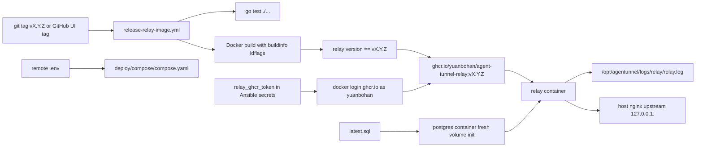

# feat: Add Relay Docker Compose deployment

## Overview

Add a Docker-first Relay deployment path: a Relay-only container image published to private GHCR from semver tags, Docker Compose files that run Relay with PostgreSQL, a complete canonical `latest.sql` snapshot for fresh database initialization, persistent Relay logs on the VPS, and documentation/Ansible entrypoints that make Compose the preferred server operations surface.

This is additive. The existing `relay-migrate`, numbered SQL migrations, local E2E harness, and legacy binary/systemd Ansible flow stay working until a later cleanup deliberately removes them.

---

## Problem Frame

The origin document defines an operational simplification: stop rebuilding and copying Relay binaries during normal deploys, stop running automatic production migrations, and make server updates mostly "sync Compose files, set `.env`, pull image, start services" (see origin: `docs/brainstorms/2026-04-22-relay-docker-deployment-requirements.md`).

The plan therefore needs to connect four external surfaces without changing Relay product behavior: Docker image packaging, GHCR release publishing, Compose runtime configuration, and PostgreSQL schema bootstrap. The key constraint is that fresh databases must be reproducible from `latest.sql`, while existing databases are mutated only by manual operator-run SQL.

---

## Requirements Trace

- R1-R4. Build a Relay-focused container that embeds release metadata, starts `relay serve`, listens correctly in Docker, and can be version-verified in CI.
- R5-R9. Publish tagged Relay images to private GHCR from semver git tags using GitHub package permissions and immutable version tags.
- R10-R15. Provide Compose deployment for Relay and PostgreSQL with a remote `.env`, PostgreSQL health dependency, persistent Relay log bind mount, host nginx compatibility, and Ansible lifecycle support.
- R16-R20. Add a complete `latest.sql` schema snapshot for fresh PostgreSQL initialization, keep future schema changes manual for existing servers, and preserve current migration tooling.
- R21-R24. Update README, deployment/operations docs, release docs, and agent instructions to make the new deployment contract explicit.

**Origin actors:** A1 Maintainer, A2 GitHub Actions workflow, A3 Remote deployment automation, A4 Relay operator, A5 PostgreSQL container

**Origin flows:** F1 Tagged image release, F2 Fresh Compose bootstrap, F3 Routine service update, F4 Manual schema change

**Origin acceptance examples:** AE1 tag-to-image tag, AE2 image version verification, AE3 fresh DB bootstrap, AE4 no automatic existing-DB mutation, AE5 host nginx compatibility

---

## Scope Boundaries

- No Relay API, auth, websocket, session, or database repository behavior changes.
- No bundled nginx, TLS, or certbot inside Compose in this iteration; host nginx remains the public reverse proxy.
- No automatic schema migrations in the Docker deployment path.
- No deletion of `cmd/migrate`, `internal/migration`, numbered SQL files, or legacy local test paths.
- No change to the public `tunnel` CLI binary release workflow except documentation clarifying that Relay images are published by a separate workflow.
- No backup/PITR implementation; docs should make clear that Docker named volumes are persistence, not backups.

---

## Context & Research

### Relevant Code and Patterns

- `internal/buildinfo/buildinfo.go` already owns version, git commit, branch, build time, compatibility-line helpers, and the `official-release` distribution marker used by release builds.
- `scripts/release-package.sh` already shows the ldflags pattern for embedding `Version`, `DistributionMarker`, `GitCommit`, `GitBranch`, and `BuildTime`.
- `.github/workflows/release-tunnel.yml` is intentionally CLI-only and uses workflow dispatch; the Relay image workflow should be separate to avoid coupling CLI public release with Relay container publishing.
- `cmd/relay/command.go` makes `relay serve` the right container entrypoint and `relay version` the right image smoke check.
- `internal/config/relay.go` defaults `RELAY_LISTEN_ADDR` to `127.0.0.1:8586`; Docker Compose must override it to `0.0.0.0:8586`.
- `schema/0001_auth_schema.sql` and `schema/0002_operator_audit.sql` represent the current PostgreSQL schema that `deploy/postgres/latest.sql` must reproduce.
- `internal/migration/migration.go` reads every `.sql` file in `schema/`, so the snapshot belongs under `deploy/postgres/latest.sql` rather than `schema/latest.sql` to avoid changing legacy migrator behavior.
- `.gitignore` already ignores `.env` and `.env.*` while allowing `.env.example` and `.env.sample`, matching the desired committed example plus untracked remote secrets pattern.
- `deploy/nginx/*.template` already proxies `/api/`, `/agent/ws`, `/device/ws`, and `/healthz` to an upstream address; Compose should keep exposing Relay on a host-local port compatible with that upstream.
- `makefiles/deploy.mk` and `ansible/roles/relay/tasks/main.yml` currently encode the binary/systemd/migrator flow. New Compose targets should be separate rather than silently changing `deploy-prod`.

### Institutional Learnings

- No `docs/solutions/` entries exist in this repository.

### External References

- GitHub Actions docs for publishing Docker images to GHCR use `GITHUB_TOKEN`, `packages: write`, `docker/login-action`, `docker/metadata-action`, and `docker/build-push-action`.
- Private GHCR pulls from the VPS require `docker login ghcr.io`; this deployment fixes the username to `yuanbohan` and stores only `relay_ghcr_token` in Ansible secrets.
- Docker Compose docs confirm `.env` is used for interpolation and can be supplied with `--env-file`; variables still need to be explicitly passed into container environments when the container needs them.
- Docker PostgreSQL docs confirm `/docker-entrypoint-initdb.d/` scripts run only when the data directory is empty, and existing volumes skip initialization.
- Docker Build GitHub Actions docs list the official Docker actions for login, metadata, Buildx, Compose, and build/push workflows.

---

## Key Technical Decisions

| Decision | Choice | Rationale |
|---|---|---|
| Relay image name | Use `ghcr.io/yuanbohan/agent-tunnel-relay` | The suffix makes it clear this image is for the Relay service, not the public `tunnel` CLI distribution, and the owner is fixed for this project. |
| Relay GHCR visibility | Treat the GHCR package as private | Remote deploys must log in before pulling; do not document a public-package fallback. |
| Relay GHCR pull auth | Use fixed username `yuanbohan` plus `relay_ghcr_token` in Ansible secrets | Avoids a redundant username variable while keeping the token out of the repo and remote Compose `.env`. |
| Relay workflow trigger | `push.tags: ["v*.*.*"]` only | Tags may be created locally or through the GitHub UI; either path creates a tag push event and keeps the git tag and image tag as one source of truth. |
| Image tags | Publish the semver tag exactly, and do not rely on mutable `latest` for deploys | This preserves reproducible Compose deploys and satisfies AE1. |
| Build metadata injection | Reuse the existing ldflags names from `scripts/release-package.sh` | Keeps `relay version` and `/api/version` aligned with current buildinfo behavior. |
| Container listen address | Set `RELAY_LISTEN_ADDR=0.0.0.0:8586` in the container environment | The Go default is loopback-only and would not be reachable through Docker port publishing. |
| Compose database config | Build `RELAY_DATABASE_URL` from `POSTGRES_USER`, `POSTGRES_PASSWORD`, and `POSTGRES_DB` in Compose, and document password character constraints | This keeps the common case to one set of DB credentials while avoiding code changes to add separate DB env vars. |
| Schema snapshot location | Use `deploy/postgres/latest.sql` as canonical | Current migrator reads every `schema/*.sql`, so this avoids accidentally applying the snapshot as a migration. |
| Relay logs | Set `RELAY_LOG_FILE=/var/log/agentunnel/relay.log` and bind `../logs/relay` to `/var/log/agentunnel` | Relay structured logs persist on the VPS at `/opt/agentunnel/logs/relay/relay.log` outside container lifecycle. |
| Ansible rollout | Add separate Compose sync/lifecycle role and Make targets; leave legacy binary deploy targets intact | This avoids breaking current deployment workflows while making the new flow available. |

---

## Open Questions

### Resolved During Planning

- Exact GHCR image name: use `ghcr.io/yuanbohan/agent-tunnel-relay`.
- GHCR package access: package is private; deploy auth uses fixed username `yuanbohan` and a required `relay_ghcr_token` created with package read access.
- Tag creation: creating `vX.Y.Z` in the GitHub UI is valid because the workflow listens to tag push events.
- Compose DB configuration: construct `RELAY_DATABASE_URL` from Compose `.env` values for the first version, and document that passwords must be URL-safe unless the implementation later chooses explicit DSN input.
- Ansible strategy: add a separate Compose deployment path first, rather than repurposing existing `deploy-dev` / `deploy-prod` targets in the same change.
- Snapshot path: use `deploy/postgres/latest.sql`.
- Persistent logging: persist Relay logs under `/opt/agentunnel/logs/relay/relay.log`.

### Deferred to Implementation

- Finalize exact Make target names for Compose lifecycle after seeing how much existing deploy naming should be preserved for compatibility.
- Finalize whether the image workflow should include OCI attestations in a later PR. GitHub's documented example includes attestations, but the core requirement is GHCR publishing.

---

## Output Structure

    .github/workflows/
      release-relay-image.yml
    deploy/
      compose/
        compose.yaml
        .env.example
        README.md
      postgres/
        latest.sql
      logs/
        relay/        # generated locally or on the VPS; ignored by git
    ansible/
      roles/
        relay_compose/
          tasks/main.yml
    Dockerfile.relay
    scripts/
      test-relay-docker-image.sh

`deploy/postgres/latest.sql` is the canonical full schema snapshot for fresh Docker PostgreSQL volumes.

---

## High-Level Technical Design

> *This illustrates the intended approach and is directional guidance for review, not implementation specification. The implementing agent should treat it as context, not code to reproduce.*

---

## Implementation Units

- [x] U1. **Add the full PostgreSQL schema snapshot**

**Goal:** Provide a complete SQL snapshot for fresh Docker PostgreSQL initialization without changing legacy migration behavior.

**Requirements:** R16-R20, F2, F4, AE3, AE4

**Dependencies:** None

**Files:**
- Create: `deploy/postgres/latest.sql`
- Test: `deploy/postgres/latest.sql`

**Approach:**
- Start from the effective schema created by `schema/0001_auth_schema.sql` and `schema/0002_operator_audit.sql`.
- Keep the snapshot idempotent enough for fresh initialization readability (`create table if not exists`, indexes) but treat it as a full baseline, not an incremental migration.
- Keep the snapshot outside `schema/` so it is not discovered by `relay-migrate`.
- Do not include `schema_migrations` in `latest.sql`; Docker fresh initialization is intentionally not migration-tracked.
- Wrap the snapshot in a transaction so PostgreSQL init fails atomically if the snapshot is invalid.

**Patterns to follow:**
- Current table/index definitions in `schema/0001_auth_schema.sql`
- Current operator audit definitions in `schema/0002_operator_audit.sql`
- Migration discovery and ordering tests in `internal/migration/migration_test.go`

**Test scenarios:**
- Happy path: the snapshot contains all current durable tables: `users`, `invite_codes`, `app_sessions`, `agent_tokens`, and `operator_audit_events`.
- Edge case: `relay-migrate` does not try to apply `latest.sql` because the snapshot is outside `schema/`.
- Covers AE3. Integration: with a fresh PostgreSQL data directory, mounting the snapshot into initdb creates all Relay tables.
- Covers AE4. Integration: with an existing data directory, PostgreSQL does not rerun the init script and Compose does not invoke `relay-migrate`.

**Verification:**
- Fresh Compose bootstrap has a complete schema source.
- Existing migration tests and local E2E paths remain compatible with numbered migrations.

---

- [x] U2. **Add the Relay container image build**

**Goal:** Create a small Relay-only Docker image that embeds build metadata and runs the server with Docker-compatible defaults.

**Requirements:** R1-R4, R9, F1, AE2

**Dependencies:** U1 is not required for building the image, but should land before full Compose verification.

**Files:**
- Create: `Dockerfile.relay`
- Create: `.dockerignore`
- Create: `scripts/test-relay-docker-image.sh`
- Modify: `Makefile`
- Modify: `makefiles/build.mk` or add a focused makefile include if needed
- Test: `scripts/test-relay-docker-image.sh`

**Approach:**
- Use a multi-stage build: Go builder stage based on the repo's `go.mod` version, then a minimal Linux runtime image with CA certificates and the `relay` binary.
- Build only `./cmd/relay`; do not include `tunnel` or `relay-migrate` in the runtime image.
- Accept build args for `VERSION`, `GIT_COMMIT`, `GIT_BRANCH`, `BUILD_TIME`, and distribution marker, then pass them through existing buildinfo ldflags.
- Set the default command to run `relay serve`.
- Set container defaults so `RELAY_LISTEN_ADDR` is `0.0.0.0:8586`; keep secrets and database DSN out of the image.
- Add a smoke script that builds the image with a test version and asserts `relay version` reports that version.

**Patterns to follow:**
- ldflags in `scripts/release-package.sh`
- `relay version` behavior in `cmd/relay/version.go`
- existing Makefile include style in `makefiles/build.mk`

**Test scenarios:**
- Happy path: building with `VERSION=v0.1.0-test` produces an image whose `relay version` first line contains that version.
- Happy path: the image default command is `relay serve` and does not require a shell wrapper for normal execution.
- Edge case: missing runtime secrets fail at container start through the existing Relay config validation, not during image build.
- Regression: local `make build` continues to build `tunnel`, `relay`, and `relay-migrate` as before.

**Verification:**
- The image can be built locally and version-smoked without a database.
- The image does not bake deployment secrets or schema migration behavior into the runtime layer.

---

- [x] U3. **Add Docker Compose runtime assets**

**Goal:** Provide a server-ready Compose project that runs PostgreSQL and Relay with a persistent database volume, persistent Relay log bind mount, `.env`-driven configuration, health ordering, and host-nginx-compatible port exposure.

**Requirements:** R10-R15, R17, F2, F3, AE3, AE4, AE5

**Dependencies:** U1, U2

**Files:**
- Create: `deploy/compose/compose.yaml`
- Create: `deploy/compose/.env.example`
- Create: `deploy/compose/README.md`
- Modify: `.gitignore` only if the committed example naming needs a new exception
- Modify: `.dockerignore` to keep generated logs and secrets out of image build context
- Test: `deploy/compose/compose.yaml`

**Approach:**
- Define two services: `postgres` using a fixed major/minor image tag and `relay` using `ghcr.io/yuanbohan/agent-tunnel-relay:${RELAY_IMAGE_TAG}`.
- Mount the schema snapshot into `/docker-entrypoint-initdb.d/` read-only for PostgreSQL.
- Use a named volume for PostgreSQL data, defaulting to `relay-postgres-data` through `RELAY_POSTGRES_VOLUME`.
- Set `RELAY_LOG_FILE=/var/log/agentunnel/relay.log` and bind host `../logs/relay` into the container so structured logs persist at `/opt/agentunnel/logs/relay/relay.log` on the VPS.
- Add a PostgreSQL healthcheck and make Relay depend on the healthy database.
- Use `.env` for Compose interpolation and explicitly pass required Relay environment variables into the Relay container. Keep secret values blank in `.env.example` so an unedited copy fails rather than starting with known placeholders.
- Publish Relay only to a host-local address by default, for example `${RELAY_HOST_BIND:-127.0.0.1}:${RELAY_HOST_PORT:-8586}:8586`, so public exposure remains controlled by host nginx.
- Do not add a migrator service, one-shot migration job, or startup command that mutates an existing database.

**Patterns to follow:**
- nginx upstream assumptions in `deploy/nginx/agentunnel-http.conf.template`
- existing Relay env var names in `internal/config/relay.go`
- Docker Compose `.env` precedence and interpolation documented by Docker

**Test scenarios:**
- Happy path: `docker compose config` resolves image tag, port binding, PostgreSQL credentials, Relay env, named volume, and log bind mount after the blank secret values from `.env.example` are filled in.
- Happy path: fresh Compose startup creates all tables through the PostgreSQL init script.
- Happy path: Relay writes structured logs to the host-mounted log file.
- Covers AE4. Regression: restarting Compose against an existing volume does not run any migration command or reapply the init SQL.
- Covers AE5. Integration: Relay is reachable on the configured local host port for `/healthz`, preserving host nginx proxy compatibility.
- Error path: missing `RELAY_APP_SECRET`, `RELAY_OPERATOR_TOKEN`, or database credential values cause clear Compose/config failure rather than a silently misconfigured Relay.

**Verification:**
- The Compose project can bootstrap from empty state and restart against existing state without schema mutation.
- Operators can deploy by changing `.env` image tag and running Compose pull/up.

---

- [x] U4. **Publish Relay images to GHCR from git tags**

**Goal:** Add CI that validates, builds, smokes, and pushes the Relay image to GHCR with a Docker tag matching the git tag.

**Requirements:** R2, R4-R9, F1, AE1, AE2

**Dependencies:** U2

**Files:**
- Create: `.github/workflows/release-relay-image.yml`
- Modify: `docs/release-distribution.md`
- Test: `.github/workflows/release-relay-image.yml`

**Approach:**
- Trigger only on pushed tags matching semver shape `v*.*.*`. Tags can be pushed from a local checkout or created through the GitHub UI.
- Set workflow permissions to at least `contents: read` and `packages: write`; include attestation permissions only if image provenance is implemented in this unit.
- Use Docker's official GitHub Actions (`login-action`, `build-push-action`, and setup Buildx when needed).
- Derive the release version from `github.ref_name`, validate it matches semver, and pass it as the Docker build `VERSION` arg.
- Pass `official-release` distribution marker, commit SHA, ref name, and UTC build time as build args.
- Run `go test ./...` before pushing.
- Build/load the image locally with final labels/build args, run a pre-push smoke check so `relay version` must contain the tag, and then push the verified local image tag.
- Push the exact tag `ghcr.io/yuanbohan/agent-tunnel-relay:vX.Y.Z`; avoid making Compose docs depend on `latest`.

**Patterns to follow:**
- Existing workflow shape in `.github/workflows/release-tunnel.yml`
- GitHub's GHCR publishing docs for `GITHUB_TOKEN` and `packages: write`
- Docker's official build/push GitHub Actions docs

**Test scenarios:**
- Happy path: for tag `v0.1.0`, workflow metadata produces image tag `ghcr.io/yuanbohan/agent-tunnel-relay:v0.1.0`.
- Covers AE2. Happy path: the built image reports `relay v0.1.0` before publishing.
- Error path: a non-semver tag does not publish an image.
- Error path: tests fail and the image is not pushed.
- Regression: `release-tunnel.yml` remains CLI-only and is not required to publish Relay images.

**Verification:**
- The workflow has the package permissions needed for private GHCR publishing and does not rely on `github.repository_owner` for image naming.
- The image tag visible to Compose is identical to the git tag that triggered the workflow.

---

- [x] U5. **Add Compose deploy automation entrypoints**

**Goal:** Let Ansible and Make operate the new Compose deployment path by syncing Compose assets and running explicit lifecycle actions, without replacing legacy binary deploy targets.

**Requirements:** R15, F3

**Dependencies:** U3

**Files:**
- Create: `ansible/roles/relay_compose/tasks/main.yml`
- Modify: `ansible/playbooks/site.yml`
- Modify: `ansible/inventories/dev.yml`
- Modify: `ansible/inventories/prod.yml`
- Modify: `makefiles/deploy.mk`
- Modify: `Makefile` only if new makefile includes are added
- Test: `makefiles/deploy.mk`

**Approach:**
- Add Ansible variables for remote Compose directory, env file path, compose file path, and lifecycle action.
- Sync `deploy/compose/compose.yaml`, `deploy/postgres/latest.sql`, supporting README/example files, and the host Relay log directory to the remote directory.
- Do not overwrite the remote real `.env` by default; only sync `.env.example` or render a non-secret template if explicitly requested.
- Use `relay_ghcr_token` from `ansible/host_vars/<env>/relay-secrets.yml` to log in to private GHCR as `yuanbohan` before `pull` or `up`.
- Add lifecycle tasks for `docker compose pull`, `up -d`, `start`, `stop`, and `down`, controlled by tags or an action variable.
- Add Make targets with names that clearly distinguish the Compose path from legacy deploy, such as `compose-sync-prod`, `compose-up-prod`, `compose-stop-prod`, and matching dev variants.
- Keep `deploy-dev` / `deploy-prod` unchanged in this PR unless the user explicitly decides to make Compose the default target later.

**Patterns to follow:**
- Current Ansible tag-sliced deploy style in `makefiles/deploy.mk`
- Current file sync and template patterns in `ansible/roles/relay/tasks/main.yml`
- Existing inventory split between `ansible/inventories/dev.yml` and `ansible/inventories/prod.yml`

**Test scenarios:**
- Happy path: running the sync action would copy Compose assets but leave an existing remote `.env` untouched.
- Happy path: running sync creates `/opt/agentunnel/logs/relay` without requiring the operator to create it manually.
- Happy path: the up action pulls the configured image and starts services through `docker compose up -d`.
- Error path: missing `relay_ghcr_token` for the private package causes image pull failure; docs tell the operator how to create and store the token.
- Edge case: the remote `.env` is missing, and the lifecycle action fails clearly instead of starting with empty secrets.
- Regression: existing `deploy-prod`, `relay-prod`, `migrate-prod`, and website deploy targets still point at the legacy roles they used before.

**Verification:**
- Operators can use Ansible/Make for Compose lifecycle without local Go builds.
- Legacy deploy paths remain available and visibly separate.

---

- [x] U6. **Update deployment, release, and agent-facing documentation**

**Goal:** Make the new Docker Compose flow, GHCR release model, and manual schema responsibility clear across user docs and agent instructions.

**Requirements:** R18-R24, F2, F3, F4, AE4

**Dependencies:** U1-U5

**Files:**
- Modify: `README.md`
- Modify: `docs/deploy.md`
- Modify: `docs/operation.md`
- Modify: `docs/deployment.md`
- Modify: `docs/release-distribution.md`
- Modify: `docs/architecture.md`
- Create: `docs/docker-operation.md`
- Modify: `docs/daemon.md` only if deployment references there need alignment
- Modify: `CLAUDE.md`
- Test: documentation links and command examples in the modified docs

**Approach:**
- Replace the README VPS quick start with a Compose-first version that points to `deploy/compose/.env.example`, GHCR image tags, and `docker compose` lifecycle.
- Add `docs/docker-operation.md` as the canonical Docker Compose operations guide, including GitHub UI tag creation, fixed GHCR image owner, required `relay_ghcr_token`, remote paths, `.env`, logs, schema changes, and troubleshooting.
- Preserve legacy migrator/binary deployment as a secondary or legacy path where docs still mention it; do not present it as the primary new deployment model.
- In `docs/operation.md`, show operator commands via `docker compose exec relay relay invite ...` or an equivalent host-local container invocation.
- Explain that `latest.sql` initializes only fresh PostgreSQL volumes and is not a migration runner.
- Add an explicit schema-change rule to README and `CLAUDE.md`: every schema change updates the full snapshot, and existing servers require manual SQL execution.
- Clarify in `docs/release-distribution.md` that `Release Tunnel` remains for public CLI binaries while `release-relay-image.yml` publishes GHCR Relay images.
- Keep docs aligned with current product boundaries: Relay remains API-only, host nginx remains the public frontend/reverse proxy, and operator routes should not be exposed publicly.

**Patterns to follow:**
- Existing deployment doc split: `docs/deployment.md` redirects to `docs/deploy.md`, and `docs/operation.md` covers host-side runbook tasks.
- Current AGENTS/CLAUDE docs expectations in `CLAUDE.md`
- Current release distribution explanation in `docs/release-distribution.md`

**Test scenarios:**
- Happy path: docs contain a complete fresh-host Compose bootstrap path from `.env` creation to health check.
- Happy path: docs explain how to create the GitHub package-read token and where to put `relay_ghcr_token`.
- Happy path: docs explain that GitHub UI tag creation triggers the same workflow as local tag push.
- Happy path: docs contain a routine update path that changes `RELAY_IMAGE_TAG`, pulls, and restarts services.
- Happy path: docs identify `/opt/agentunnel/logs/relay/relay.log` as the persistent Relay log path.
- Covers AE4. Regression: docs explicitly say Compose deployment does not automatically mutate existing databases.
- Regression: `CLAUDE.md` mentions the `latest.sql` maintenance rule and manual existing-server SQL rule.
- Regression: docs do not instruct users to run `relay-migrate` as part of the new Compose deployment path.

**Verification:**
- A future agent or human operator can understand the new deployment flow without rediscovering requirements.
- Documentation no longer implies automatic production migrations for the Docker path.

---

## System-Wide Impact

- **Interaction graph:** Git tags created locally or through GitHub UI trigger the Relay image workflow; Ansible logs in to private GHCR with `relay_ghcr_token`; Compose consumes the published tag; PostgreSQL fresh initialization consumes the snapshot; host nginx continues proxying to the Relay port.
- **Error propagation:** Missing `.env` values should fail through Compose interpolation or existing Relay config validation. PostgreSQL health failures should prevent Relay startup rather than starting a broken service.
- **State lifecycle risks:** PostgreSQL named volumes persist across Compose restarts and skip init scripts. Removing the volume intentionally destroys persistence and causes `latest.sql` to run again. Relay file logs persist on the host outside container lifecycle but are not a backup or retention system by themselves.
- **API surface parity:** Relay HTTP/WebSocket APIs and operator CLI commands stay unchanged; only invocation changes under Compose.
- **Integration coverage:** Image version smoke, fresh Compose bootstrap, existing-volume restart, and host-local `/healthz` reachability are the key cross-layer checks.
- **Unchanged invariants:** The relay remains content-opaque, stores durable auth/operator state in PostgreSQL, keeps live session routing in memory, and does not retain terminal transcript history.

---

## Risks & Dependencies

| Risk | Mitigation |
|------|------------|
| `latest.sql` accidentally runs through `relay-migrate` | Either keep the snapshot outside `schema/` or update migration discovery to include only numbered migrations, with tests. |
| Compose `.env` interpolation creates an invalid database URL when passwords contain URL-reserved characters | Document URL-safe database passwords for the composed DSN, or switch to explicit `RELAY_DATABASE_URL` if implementation shows this is too fragile. |
| Relay binds only to loopback inside the container | Set `RELAY_LISTEN_ADDR=0.0.0.0:8586` in Compose/container defaults and smoke `/healthz`. |
| A mutable image tag causes unexpected production drift | Make semver `RELAY_IMAGE_TAG` required in `.env` and document that `latest` is not the deploy source of truth. |
| Existing Ansible users are disrupted | Add separate Compose targets/role and leave legacy deploy targets intact. |
| Operator assumes Docker volume is a backup | Document that named volume persistence is not a backup strategy. |
| Private GHCR pulls fail on the VPS | Require `relay_ghcr_token`, document token creation with package read access, and have Ansible run `docker login ghcr.io --username yuanbohan --password-stdin` before pull/up. |
| Unedited example secrets start production with known values | Keep secret values blank in `.env.example` so Compose interpolation fails until the operator fills them in. |

---

## Documentation / Operational Notes

- The first production rollout should be treated as a deployment-path migration: prepare `relay_ghcr_token`, prepare remote `.env`, start Compose against a fresh or intentionally restored PostgreSQL volume, verify `/healthz`, verify `/opt/agentunnel/logs/relay/relay.log`, then create invites from inside the Relay container.
- Existing production databases should not be pointed at a new image requiring schema changes until the operator has manually applied the corresponding SQL.
- `deploy/postgres/latest.sql` must be reviewed in every database-shape PR, even when the manual production SQL is a smaller `ALTER TABLE` script.
- A later cleanup can retire legacy binary/systemd deploy once Compose has been proven in dev and prod.

---

## Sources & References

- **Origin document:** [docs/brainstorms/2026-04-22-relay-docker-deployment-requirements.md](../brainstorms/2026-04-22-relay-docker-deployment-requirements.md)
- Related code: `internal/buildinfo/buildinfo.go`
- Related code: `scripts/release-package.sh`
- Related code: `.github/workflows/release-tunnel.yml`
- Related code: `cmd/relay/command.go`
- Related code: `internal/config/relay.go`
- Related code: `internal/migration/migration.go`
- Related code: `schema/0001_auth_schema.sql`
- Related code: `schema/0002_operator_audit.sql`
- External docs: [GitHub Actions: publishing Docker images](https://docs.github.com/en/actions/tutorials/publish-packages/publish-docker-images)
- External docs: [Docker Compose environment variable interpolation](https://docs.docker.com/compose/how-tos/environment-variables/variable-interpolation/)
- External docs: [Docker PostgreSQL initialization scripts](https://docs.docker.com/guides/postgresql/advanced-configuration-and-initialization/)
- External docs: [Docker Build GitHub Actions](https://docs.docker.com/build/ci/github-actions/)
