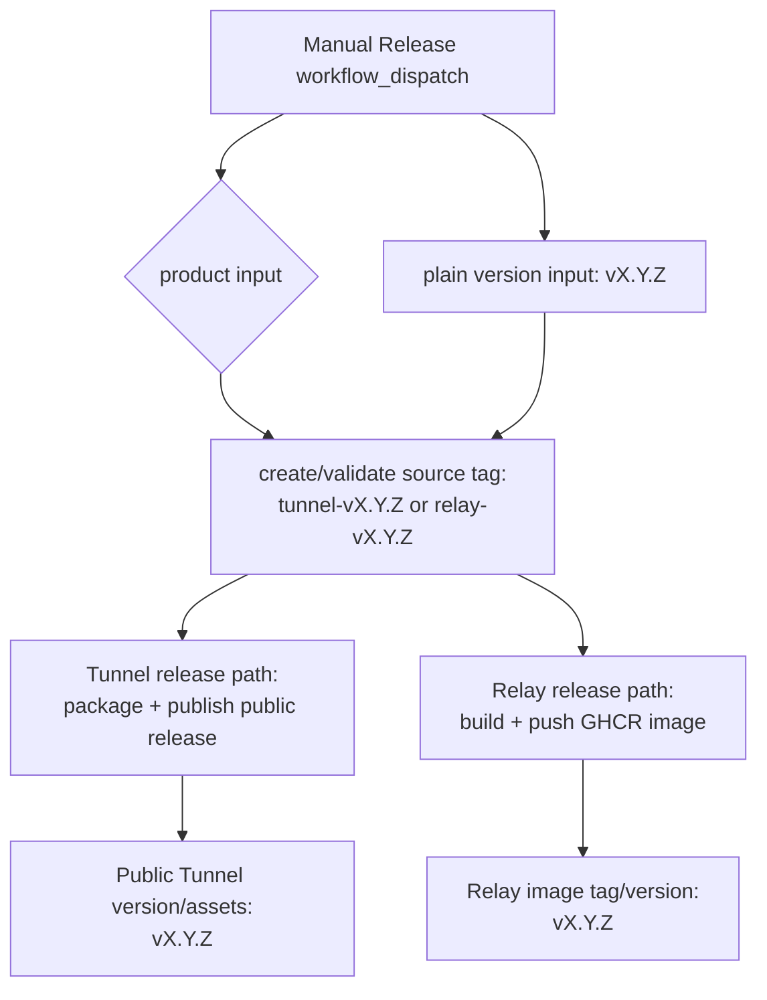

# refactor: Disambiguate Tunnel and Relay release channels

## Overview

Replace the current mixed release model with a dispatch-first, product-explicit release path. A maintainer will trigger one GitHub Actions release workflow, choose `tunnel` or `relay`, and enter a plain product version such as `v0.2.3`. The private source repository records the release with a product-prefixed tag (`tunnel-v0.2.3` or `relay-v0.2.3`), while all published outputs keep the prefix-free version (`v0.2.3`).

Local development builds should stop deriving or incrementing release versions from git tags. `make install` remains a local build/install command, not a release primitive.

---

## Problem Frame

The current repo has two nearby release surfaces: `Release Tunnel` is manually dispatched with a plain `vX.Y.Z`, while `Release Relay Image` publishes from bare `vX.Y.Z` tag pushes. This makes source tags ambiguous and makes local version helper behavior too release-like for ordinary development. The origin document defines the desired boundary: product prefixes exist only in source-control release markers, and users/operators continue to see plain versions (see origin: `docs/brainstorms/2026-04-23-release-channel-disambiguation-requirements.md`).

---

## Requirements Trace

- R1. Official Tunnel and Relay releases use explicit GitHub Actions dispatch, not bare semver tag push.
- R2. The dispatch experience makes the product explicit.
- R3. Tunnel source tags use `tunnel-vX.Y.Z`.
- R4. Relay source tags use `relay-vX.Y.Z`.
- R5. Bare `vX.Y.Z` tags do not trigger official publication.
- R6. Published product versions strip the source-control prefix.
- R7. Tunnel public releases, installer behavior, update/rollback metadata, and `tunnel --version` remain plain `vX.Y.Z`.
- R8. Relay image tags, user-visible image version labels, `/api/version`, and `relay version` remain plain `vX.Y.Z`.
- R9. Local build/install commands do not calculate, create, or push release tags.
- R10. `make install` does not require a release version and does not embed official release identity.
- R11. Any release tag helper requires explicit product/version or is removed.
- R12. Release documentation explains product-prefixed source tags and prefix-free published versions.
- R13. Maintainer docs show `tunnel-vX.Y.Z` and `relay-vX.Y.Z` release examples.
- R14. Operator and user docs keep install/update/deploy examples as plain `vX.Y.Z`.
- R15. Compatibility-line comparisons continue to use plain product versions.

**Origin actors:** A1 (Maintainer), A2 (GitHub Actions release workflow), A3 (Tunnel user), A4 (Relay operator), A5 (Local developer)

**Origin flows:** F1 (Tunnel release dispatch), F2 (Relay release dispatch), F3 (Local development install)

**Origin acceptance examples:** AE1 (Tunnel dispatch/source tag/plain CLI version), AE2 (Relay dispatch/source tag/plain image tag), AE3 (bare tag does not publish), AE4 (`make install` does not create/increment/push tags)

---

## Scope Boundaries

- Do not merge Tunnel and Relay into one published artifact.
- Do not change the public `yuanbohan/tunnel` distribution repository.
- Do not change the GHCR package name `ghcr.io/yuanbohan/agent-tunnel-relay`.
- Do not change the supported Tunnel platform matrix.
- Do not add package-manager distribution.
- Do not change the Docker Compose deployment model beyond version/tag guidance.
- Do not change compatibility-line semantics; strip source tag prefixes before using existing plain semver helpers.

---

## Context & Research

### Relevant Code and Patterns

- `.github/workflows/release-tunnel.yml` already dispatches manually with `inputs.version`, runs release smoke tests, packages Tunnel assets, publishes to `yuanbohan/tunnel`, and verifies public install.
- `.github/workflows/release-relay-image.yml` currently listens to `push.tags: ["v*.*.*"]`, derives the image version from `github.ref_name`, builds `Dockerfile.relay`, verifies `relay version`, and pushes to GHCR.
- `scripts/release-common.sh` owns strict plain semver validation, target lists, asset naming, compatibility-line helpers, and checksum helpers for Tunnel release scripts.
- `scripts/release-package.sh`, `scripts/render-latest-manifest.sh`, and `scripts/publish-tunnel-release.sh` already accept plain `vX.Y.Z` versions and should continue doing so.
- `makefiles/build.mk` currently calls `scripts/git-version.sh` for local builds. `scripts/git-version.sh` fetches tags, reuses a bare tag on HEAD, or increments the latest bare semver tag; `make tag-version` can create and push a bare tag.
- `makefiles/install.mk` already presents `make install` as local-only, but it depends on `build`, so it currently inherits automatic version resolution from `makefiles/build.mk`.
- `Dockerfile.relay` and `scripts/test-relay-docker-image.sh` already embed plain build versions and verify the first `relay version` line.
- `README.md`, `docs/release-distribution.md`, `docs/deploy.md`, and `docs/docker-operation.md` currently describe Relay publishing from pushed bare `vX.Y.Z` tags.

### Institutional Learnings

- No applicable `docs/solutions/` entries were present in this checkout.

### External References

- Not used. Existing GitHub Actions and Docker workflow patterns in this repo are sufficient for planning.

---

## Key Technical Decisions

- Use one unified dispatch workflow with a product selector: This directly matches the user request that Dispatch should let the maintainer choose Tunnel or Relay, and it avoids two similarly named workflow entrypoints.
- Dispatch creates or validates the product-prefixed source tag: This removes local tag-push side effects from the release path. The workflow should be idempotent when the tag already exists at the same commit and should fail if the tag exists on a different commit.
- Strip the product prefix before all product build/publish steps: Existing release scripts and buildinfo helpers operate on plain `vX.Y.Z`; keeping that boundary avoids leaking `tunnel-` or `relay-` into public artifacts.
- Delete the automatic local tag increment path: `scripts/git-version.sh` and `make tag-version` encode the behavior the requirements remove. Local build/install should use the checked-in development default unless `VERSION` is explicitly provided for a local build.
- Keep release packaging scripts plain-version-only: `scripts/release-package.sh`, `scripts/render-latest-manifest.sh`, and `scripts/publish-tunnel-release.sh` should reject prefixed source tags rather than silently accepting them.

---

## Open Questions

### Resolved During Planning

- One combined workflow or two separate dispatch workflows: Use one combined dispatch workflow with a required product selector.
- Should dispatch create tags or require pre-existing tags: Dispatch creates or validates the product-prefixed source tag at the workflow commit.
- Delete or retain the auto-increment helper: Delete the auto-increment/tag-push path; if implementation keeps any helper, it must require explicit product and plain version and must not infer the next version.

### Deferred to Implementation

- Exact helper shape for source tag creation: Prefer a small shell helper used by the workflow and covered by smoke tests, but final factoring can follow what makes the workflow simplest.
- Exact workflow filename: Prefer `.github/workflows/release.yml`; if implementation finds a repo convention reason to keep a product-specific filename, the old bare tag trigger must still be removed.

---

## High-Level Technical Design

> *This illustrates the intended approach and is directional guidance for review, not implementation specification. The implementing agent should treat it as context, not code to reproduce.*

---

## Implementation Units

- [x] U1. **Add source tag helpers and validation coverage**

**Goal:** Provide a testable boundary that converts explicit product + plain version into a source tag and rejects ambiguous or malformed release inputs.

**Requirements:** R2, R3, R4, R5, R6, R11, R15; supports F1, F2, AE1, AE2, AE3

**Dependencies:** None

**Files:**
- Modify: `scripts/release-common.sh`
- Create: `scripts/release-source-tag.sh`
- Create: `scripts/test-release-source-tag.sh`
- Modify: `makefiles/release.mk`

**Approach:**
- Keep `release_validate_version` strict for plain `vX.Y.Z`.
- Add product validation for exactly `tunnel` and `relay`.
- Add source-tag derivation for `tunnel-vX.Y.Z` and `relay-vX.Y.Z`.
- Add source-tag parsing/validation only where needed for workflow tag checks; do not broaden existing release package scripts to accept prefixed tags.
- Make tag creation idempotent for an existing tag on the same commit and fail on an existing tag that points elsewhere.
- Expose the helper through a smoke-test target so CI can validate this logic without publishing.

**Patterns to follow:**
- `scripts/release-common.sh` for small POSIX shell release helpers.
- `scripts/test-release-package.sh` and `scripts/test-release-publish.sh` for fixture-backed shell smoke tests.

**Test scenarios:**
- Happy path: product `tunnel` and version `v0.2.3` produce source tag `tunnel-v0.2.3`.
- Happy path: product `relay` and version `v0.4.1` produce source tag `relay-v0.4.1`.
- Error path: bare source tag `v0.5.0` is not accepted as a product source-release tag.
- Error path: product values other than `tunnel` or `relay` fail with a clear message.
- Error path: prefixed version input such as `tunnel-v0.2.3` fails when a plain version is required.
- Integration: an existing source tag at the target commit is treated as reusable, while the same source tag at a different commit fails.

**Verification:**
- Release source-tag smoke tests pass and demonstrate that prefix handling is explicit and product-scoped.

---

- [x] U2. **Replace product-specific release triggers with one dispatch workflow**

**Goal:** Make official release publication start from a single GitHub Actions dispatch where the maintainer selects `tunnel` or `relay`.

**Requirements:** R1, R2, R3, R4, R5, R6, R7, R8; covers F1, F2, AE1, AE2, AE3

**Dependencies:** U1

**Files:**
- Create: `.github/workflows/release.yml`
- Delete: `.github/workflows/release-tunnel.yml`
- Delete: `.github/workflows/release-relay-image.yml`
- Modify: `scripts/test-release-publish.sh`
- Modify: `scripts/test-relay-docker-image.sh`

**Approach:**
- Define `workflow_dispatch` inputs for `product` (`tunnel` or `relay`) and plain `version` (`vX.Y.Z`).
- Give the workflow the permissions it needs for both branches: source tag creation, Tunnel public distribution publication through `TUNNEL_DIST_REPO_TOKEN`, and GHCR package publication.
- Run shared validation and source-tag creation/validation before product-specific build/publish work.
- Preserve the existing Tunnel branch behavior from `release-tunnel.yml`: Go setup, tests, release smoke tests, package artifacts, public repo token check, public release publication, and public install verification.
- Preserve the existing Relay branch behavior from `release-relay-image.yml`: Go setup, tests, Docker Buildx setup, image build/load, `relay version` verification, GHCR login, and image push.
- Pass the plain version into release packaging, Docker build args, image labels, release titles, and install verification.
- Pass the product-prefixed source tag only as source metadata, such as the ref/tag marker or `GIT_BRANCH` build metadata when useful; do not use it as the public product version.
- Remove `push.tags` release triggers so bare `vX.Y.Z` tags cannot publish either product.

**Patterns to follow:**
- Existing job structure in `.github/workflows/release-tunnel.yml`.
- Existing Docker build and verification sequence in `.github/workflows/release-relay-image.yml`.

**Test scenarios:**
- Happy path: for `product=tunnel`, workflow validation derives `tunnel-v0.2.3` and downstream Tunnel package/archive/install checks still expect `v0.2.3`.
- Happy path: for `product=relay`, workflow validation derives `relay-v0.4.1` and the Docker image tag is `ghcr.io/yuanbohan/agent-tunnel-relay:v0.4.1`.
- Error path: a bare pushed tag `v0.5.0` has no release workflow trigger.
- Error path: an invalid version fails before package/image publication.
- Error path: a conflicting existing product-prefixed tag fails before package/image publication.

**Verification:**
- The repository has no release workflow that listens to bare semver tag pushes.
- The unified workflow clearly shows product choice in the GitHub Actions dispatch UI.
- Existing Tunnel and Relay publication behavior is preserved after prefix stripping.

---

- [x] U3. **Simplify local build and install version behavior**

**Goal:** Remove hidden release-version inference from local development commands.

**Requirements:** R9, R10, R11; covers F3, AE4

**Dependencies:** None

**Files:**
- Modify: `makefiles/build.mk`
- Modify: `makefiles/install.mk`
- Delete: `scripts/git-version.sh`
- Create: `scripts/test-local-build-version.sh`
- Modify: `makefiles/release.mk`

**Approach:**
- Stop calling `scripts/git-version.sh` from `_resolve_version`.
- Let local builds use the checked-in `internal/buildinfo` development default when `VERSION` is unset.
- Keep `VERSION=vX.Y.Z make build` available only as an explicit local metadata override, without setting `DistributionMarker=official-release`.
- Remove the `tag-version` Make target or replace it with an explicit release-only helper that requires product and version and does not infer the next version.
- Ensure `make install` continues to build/install `tunnel`, `relay`, and `relay-migrate` without a version argument and without any git tag reads/writes.

**Patterns to follow:**
- `internal/buildinfo/buildinfo.go` default version and non-release marker.
- Existing `makefiles/install.mk` local-only install contract.

**Test scenarios:**
- Covers AE4. Happy path: invoking the local build/install path without `VERSION` does not call a tag helper and does not require any release version input.
- Happy path: local binaries built without `VERSION` report the development default version and remain non-release builds.
- Happy path: `VERSION=v0.2.3 make build` embeds `v0.2.3` for local testing without setting the official release marker.
- Error path: no Make target can infer, create, or push the next release tag from local tags.

**Verification:**
- `make install` remains local-only and no referenced script performs automatic version increment or tag push.

---

- [x] U4. **Keep Tunnel and Relay public outputs prefix-free**

**Goal:** Ensure product-prefixed source tags never leak into user/operator-facing release outputs.

**Requirements:** R6, R7, R8, R15; covers AE1, AE2

**Dependencies:** U1, U2

**Files:**
- Modify: `scripts/release-package.sh`
- Modify: `scripts/render-latest-manifest.sh`
- Modify: `scripts/publish-tunnel-release.sh`
- Modify: `scripts/test-release-package.sh`
- Modify: `scripts/test-release-publish.sh`
- Modify: `scripts/test-relay-docker-image.sh`
- Modify: `internal/buildinfo/buildinfo_test.go`

**Approach:**
- Keep release package, manifest, and publish scripts accepting only plain `vX.Y.Z`.
- Add regression coverage that prefixed source tags are rejected by product output scripts when a plain version is expected.
- Preserve Tunnel asset names such as `tunnel_v0.2.3_linux_amd64.tar.gz`, public release tags/titles as `v0.2.3`, and `latest.json` as `{"version":"v0.2.3",...}`.
- Preserve Relay image tags as `ghcr.io/yuanbohan/agent-tunnel-relay:v0.4.1` and first-line `relay version` output as `relay v0.4.1`.
- Ensure compatibility-line helpers are exercised with plain versions after any source tag prefix stripping.

**Patterns to follow:**
- `scripts/test-release-package.sh` current checks for archive naming, version output, official release marker, invalid versions, and compatibility-line failures.
- `scripts/test-release-publish.sh` current dry-run checks for public release output text.
- `scripts/test-relay-docker-image.sh` current first-line version verification.

**Test scenarios:**
- Covers AE1. Happy path: Tunnel package built from dispatch version `v0.2.3` reports `tunnel v0.2.3` and uses prefix-free artifact names.
- Covers AE2. Happy path: Relay image built from dispatch version `v0.4.1` reports `relay v0.4.1` and is tagged `:v0.4.1`.
- Error path: `scripts/release-package.sh tunnel-v0.2.3` fails validation.
- Error path: `scripts/render-latest-manifest.sh relay-v0.4.1` fails validation.
- Integration: compatibility-line checks continue to compare plain `vX.Y.Z` values and do not interpret product-prefixed source tags.

**Verification:**
- All public-facing release tests assert prefix-free versions while source-tag tests assert product-prefixed private tags.

---

- [x] U5. **Update release, deployment, and agent-facing documentation**

**Goal:** Align user, operator, maintainer, and agent instructions with the new release semantics.

**Requirements:** R12, R13, R14, R15; supports A1, A3, A4, A5

**Dependencies:** U2, U3, U4

**Files:**
- Modify: `README.md`
- Modify: `docs/release-distribution.md`
- Modify: `docs/deploy.md`
- Modify: `docs/docker-operation.md`
- Modify: `docs/brainstorms/2026-04-22-relay-docker-deployment-requirements.md`
- Modify: `docs/plans/2026-04-22-002-feat-relay-docker-deployment-plan.md`
- Modify: `CLAUDE.md`
- Modify: `AGENTS.md`

**Approach:**
- Replace "push a semver tag" Relay instructions with "run the Release workflow, select Relay, enter `vX.Y.Z`; the workflow records `relay-vX.Y.Z` and publishes image `:vX.Y.Z`."
- Replace Tunnel maintainer instructions with "run the Release workflow, select Tunnel, enter `vX.Y.Z`; the workflow records `tunnel-vX.Y.Z` and publishes public release `vX.Y.Z`."
- Keep all user/operator install, update, rollback, and Compose `RELAY_IMAGE_TAG` examples plain `vX.Y.Z`.
- Mark the older Relay Docker deployment brainstorm/plan decisions about bare tag push as superseded by this plan, rather than leaving conflicting durable docs.
- Update agent instructions because release-flow changes are explicitly called out by repo docs expectations.

**Patterns to follow:**
- Existing concise release docs in `docs/release-distribution.md`.
- Existing Docker operator examples in `docs/docker-operation.md` and `docs/deploy.md`.
- Existing product-boundary bullets in `CLAUDE.md` and `AGENTS.md`.

**Test scenarios:**
- Test expectation: none -- documentation-only changes. Verification is through consistency review against the implemented workflow and scripts.

**Verification:**
- No maintainer/operator docs instruct publishing Relay by pushing a bare `vX.Y.Z` tag.
- Docs distinguish source tags (`tunnel-vX.Y.Z`, `relay-vX.Y.Z`) from published versions (`vX.Y.Z`).
- `README.md`, `docs/release-distribution.md`, `docs/deploy.md`, `docs/docker-operation.md`, `CLAUDE.md`, and `AGENTS.md` agree on the release model.

---

## System-Wide Impact

- **Interaction graph:** The release entrypoint moves from two workflows plus local tag helpers to one dispatch workflow plus explicit product-prefixed source tags. Tunnel public distribution and Relay GHCR publication remain separate downstream paths.
- **Error propagation:** Invalid product/version/tag conflicts should fail before any public release or image push. Tunnel public repo token failures should affect only the Tunnel branch.
- **State lifecycle risks:** Source tag creation introduces partial-release recovery concerns. The workflow should be idempotent for a tag that already points to the same commit so a maintainer can rerun after downstream publication failure.
- **API surface parity:** Tunnel installer/update/rollback and Relay Compose image pinning must continue to consume plain versions.
- **Integration coverage:** Shell smoke tests should cover prefix derivation, plain-version rejection of prefixed values, local build behavior, Tunnel package/publish dry-runs, and Relay image version smoke.
- **Unchanged invariants:** Relay remains Docker-image-only; Tunnel remains public binary distribution through `yuanbohan/tunnel`; compatibility-line logic remains plain semver-based.

---

## Risks & Dependencies

| Risk | Mitigation |
|------|------------|
| Workflow creates a source tag before a later publication step fails | Make tag creation idempotent for same-commit reruns and document recovery. |
| Product prefix leaks into public Tunnel assets or Relay image tags | Keep release package/publish/image scripts plain-version-only and add regression tests for prefixed input rejection. |
| Removing `scripts/git-version.sh` breaks local build expectations | Preserve explicit `VERSION=... make build` as a local metadata override and document that no-version builds use the development default. |
| Old docs continue telling maintainers to push bare Relay tags | Update primary docs and mark superseded decisions in the prior Relay Docker brainstorm/plan. |
| Unified workflow has broader permissions than each old product-specific workflow | Scope secret checks and publish steps with product-specific job conditions; only require `TUNNEL_DIST_REPO_TOKEN` in the Tunnel branch. |

---

## Documentation / Operational Notes

- Maintainer release docs should describe both source tags and published outputs in one place:
  - Tunnel source tag: `tunnel-vX.Y.Z`
  - Tunnel public release/version/assets: `vX.Y.Z`
  - Relay source tag: `relay-vX.Y.Z`
  - Relay GHCR image tag/version: `vX.Y.Z`
- Operator docs should continue to tell deployers to set `RELAY_IMAGE_TAG=vX.Y.Z`.
- User docs should continue to tell installers and updaters to use `VERSION=vX.Y.Z`.
- Local development docs should avoid release-version language for `make install`.

---

## Sources & References

- **Origin document:** [docs/brainstorms/2026-04-23-release-channel-disambiguation-requirements.md](../brainstorms/2026-04-23-release-channel-disambiguation-requirements.md)
- Related code: `.github/workflows/release-tunnel.yml`
- Related code: `.github/workflows/release-relay-image.yml`
- Related code: `scripts/release-common.sh`
- Related code: `scripts/git-version.sh`
- Related code: `makefiles/build.mk`
- Related code: `makefiles/install.mk`
- Related code: `scripts/release-package.sh`
- Related code: `scripts/publish-tunnel-release.sh`
- Related code: `scripts/test-release-package.sh`
- Related code: `scripts/test-release-publish.sh`
- Related code: `scripts/test-relay-docker-image.sh`
