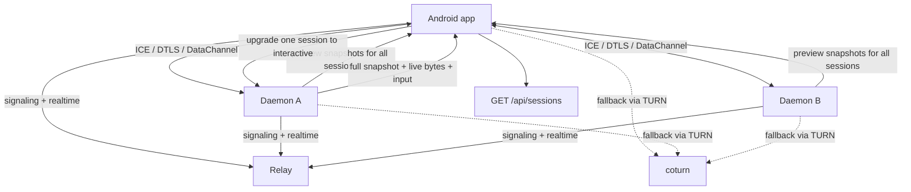

# feat: WebRTC session connectivity program plan

## Overview

This plan defines the long-term migration from Relay-terminated session attach to a WebRTC-based direct session-connectivity architecture with Relay-managed signaling, STUN/TURN-assisted connectivity, and end-to-end encrypted fallback through TURN relay.

The program keeps the current product simple for users:

- Android remains the only mobile client in the first production scope.
- `tunnel` on Linux and macOS remains the only machine-side binary users install.
- Relay remains the device-scoped control plane and authorization authority.
- `GET /api/sessions` stays as the discovery snapshot surface.
- A new realtime/signaling channel carries WebRTC negotiation and live control-plane updates.
- Android displays multiple daemons' session previews at once, while full interactive terminal access remains limited to one session at a time.
- Android app usage requires account login.
- Relay is allowed to hold the minimum plaintext authorization and discovery metadata needed to filter visible daemons and sessions, but not preview plaintext, terminal plaintext, or sensitive session metadata such as command preview, cwd, or git branch. First-phase payload confidentiality relies on WebRTC/DTLS transport encryption rather than an additional application-layer encryption envelope.

This is intentionally a program, not a single implementation pass. The first delivery phase establishes the control-plane, preview, and connectivity substrate. Later phases migrate full interactive attach onto the new transport and contract the legacy Relay-specific attach data path.

---

## Problem Frame

The current repository couples session discovery, attach authorization, and terminal data transport tightly to Relay-specific WebSocket routes and account-scoped auth. The long-term target still keeps an account layer for subscription and device ownership, but shifts session connectivity itself to device pairing plus WebRTC transport as captured in `docs/brainstorms/2026-04-23-direct-attach-control-plane-requirements.md` (see origin: `docs/brainstorms/2026-04-23-direct-attach-control-plane-requirements.md`).

The user goal is narrower than a device-level overlay or general VPN product:

- enable direct connectivity for session access
- keep terminal traffic end-to-end encrypted
- fall back automatically to relay traversal when direct connectivity fails
- avoid requiring users to install extra networking software
- keep account login available for subscription, entitlement, and multi-device ownership
- keep user understanding and operation simple

Because the feature only serves session connectivity and not general device networking, the plan prefers WebRTC DataChannels over a device-level overlay. This uses widely adopted open-source NAT traversal and relay primitives instead of custom hole-punching logic, while keeping Relay responsible for auth, discovery, signaling, and session ownership.

---

## Requirements Trace

- R1-R5. Separate control plane from terminal data plane, prefer direct connectivity, preserve Relay fallback, and keep the PTY owner authoritative.
- R6-R9. Keep session traffic end-to-end encrypted on both direct and fallback paths, with out-of-band trust and Relay ignorant of terminal plaintext.
- R10-R12. Reduce Relay pressure primarily by moving session traffic to direct paths and by avoiding a Relay-centric per-session attach transport as the long-term scaling model.
- R13-R15. Preserve one attach product surface with automatic fallback and Relay-resident control actions.
- R16-R17. Prefer abstractions that support both direct and fallback transport paths and avoid over-investing in the current Relay-only attach transport.

**Origin actors:** A1 (mobile client), A2 (Tunnel session owner on the computer), A3 (Relay server)
**Origin flows:** F1 (direct attach succeeds), F2 (direct attach fails and fallback takes over), F3 (Relay-only control-plane operation)
**Origin acceptance examples:** AE1 (covers R2, R4, R6, R8), AE2 (covers R3, R6, R7, R13), AE3 (covers R10, R11, R16, R17)

---

## Scope Boundaries

- This program does not introduce device-level general networking or a machine-wide overlay. It serves session connectivity only.
- This program does not require users to install separate WireGuard, VPN, or desktop companion software.
- This program does not use account login as the transport or payload trust model.
- This program does not make QR pairing the source of per-session authorization; pairing establishes daemon-scoped device trust.
- This program does not attempt to hide the entire discovery index from Relay. Relay may know paired-device relationships, daemon presence, and session membership metadata.
- This program does not replace `GET /api/sessions` for discovery. Instead it keeps discovery and signaling as separate concerns.
- This program does not preserve Relay-terminated session attach as the long-term transport model.
- This program does not keep sensitive session-content metadata in `GET /api/sessions`; such metadata moves to the encrypted daemon-to-Android channel.

### Deferred to Follow-Up Work

- Rich device-management UX for many-to-many paired devices beyond the minimal first-phase flows.
- NAT traversal optimization beyond conservative direct attempts with fast TURN fallback.
- Eventual retirement of the legacy Relay-backed attach transport after direct/fallback parity is proven in production.

---

## Context & Research

### Relevant Code and Patterns

- `GET /api/sessions` and `internal/relay/session/` already encode the repository's discovery rules. They remain the right existing surface to preserve for discovery snapshot semantics, but their authorization model will need to combine account ownership with paired-device scope.
- `internal/tunnel/session/` already owns terminal state and is the right authority to produce encrypted preview payloads and encrypted interactive session payloads instead of exposing that plaintext through Relay.
- `internal/protocol/` and the daemon/session metadata model will need a new split between Relay-visible session index fields and encrypted session-content metadata fields.
- `internal/tunnel/daemon/` already represents the machine-side long-lived runtime. It is the best existing home for persistent realtime connectivity, preview generation, and machine-side WebRTC participation.
- `internal/tunnel/session/` already owns PTY fanout and the terminal mirror. That is the right authority for both full interactive snapshots and lightweight preview projection.
- `internal/tunnel/connector/` and the current `/agent/ws` / `/attach/ws` paths are the major long-term data-path seams that will need abstraction or contraction.
- `docs/daemon.md`, `docs/protocol.md`, and `docs/architecture.md` already encode strong boundaries around PTY ownership, session authority, and live-only Relay state. The new plan should preserve those strengths while updating transport shape.

### Institutional Learnings

- No repository-local `docs/solutions/` entries currently shape this program.

### External References

- WebRTC DataChannels provide arbitrary bidirectional data transport over `SCTP over DTLS over ICE/UDP`, with reliable and ordered delivery available as a first-phase default. Source: `https://www.rfc-editor.org/rfc/rfc8831.pdf`
- MDN documents that WebRTC data channels are automatically secured with DTLS and support arbitrary application data, not only media. Source: `https://developer.mozilla.org/en-US/docs/Web/API/WebRTC_API/Using_data_channels`
- Pion WebRTC is a mature pure-Go WebRTC implementation with DataChannel, ICE, STUN, and TURN support suitable for a Go daemon runtime. Source: `https://github.com/pion/webrtc`
- coturn is the widely used open-source STUN/TURN server implementation appropriate for direct-connectivity discovery and TURN relay fallback. Source: `https://github.com/coturn/coturn/wiki/turnserver`
- WebRTC candidate and stats surfaces can distinguish relay-selected paths from direct-selected paths, which supports the product requirement that Android know whether a connection is `direct` or `relay`. Source: `https://developer.mozilla.org/en-US/docs/Web/API/WebRTC_API/Connectivity`, `https://www.w3.org/TR/webrtc-stats/`
- Paseo demonstrates a similar product trust model: QR pairing as the trust anchor, untrusted relay, direct-or-relay transport, and end-to-end encrypted fallback. Its transport differs, but its product model validates the chosen trust shape. Source: `https://paseo.sh/docs/security`, `https://paseo.sh/privacy`

---

## Key Technical Decisions

- Use WebRTC DataChannels, not WireGuard or a device overlay, as the direct-connectivity transport.
  Rationale: the feature only serves session connectivity, so a session-oriented transport with standard NAT traversal is a better fit than a general device networking layer.

- Rely on WebRTC/DTLS transport encryption for first-phase payload confidentiality and do not add a second application-layer encryption envelope on top of the DataChannel.
  Rationale: WebRTC already encrypts direct and TURN-relayed traffic, so adding application-layer payload encryption in phase one would increase protocol and debugging complexity without clear first-phase product value.

- Keep Relay as the sole business control plane and add a dedicated signaling/realtime channel.
  Rationale: discovery, account ownership, device authorization, signaling, and connection-state reporting should remain unified, but realtime signaling should not be overloaded onto `GET /api/sessions`.

- Keep `GET /api/sessions` as the discovery snapshot API.
  Rationale: it already solves the right problem, and keeping discovery separate from realtime signaling is lower-maintenance than pushing more realtime responsibilities into the existing REST shape.

- Let Relay hold only the minimum plaintext authorization graph and discovery metadata.
  Rationale: Relay still needs to decide which daemon/session metadata a device can discover and signal against, but preview and terminal content should stay end-to-end encrypted.

- Remove sensitive session metadata from `GET /api/sessions` and synchronize it over the encrypted daemon connection instead.
  Rationale: `command_preview`, `cwd`, `git_branch`, and preview content are all closer to real session content than to routing metadata, so Relay should not retain them in plaintext.

- Keep account login for ownership, subscription, entitlement, and multi-device grouping, while keeping transport trust device-centric.
  Rationale: the product needs one paid identity across multiple phones and computers, but session connectivity trust should still be mediated by device pairing rather than by account password alone.

- Use QR pairing for daemon-scoped device trust only; pairing does not directly encode per-session authorization.
  Rationale: this keeps trust bootstrap, network establishment, and per-session behavior cleanly separated.

- Make pairing daemon-generated and daemon-validated, while allowing Relay to forward pairing responses.
  Rationale: Relay should not be the trust root, but using it as a transient response transport keeps pairing simpler than requiring a fully offline bidirectional local exchange.

- Use short-lived, one-time pairing invitations rather than static daemon identity QR codes.
  Rationale: this keeps QR scanning simple for users while avoiding the long-lived leakage risk of a reusable static pairing code.

- Require Android app login before pairing or session usage, and bind pairing invitations to the current account.
  Rationale: subscription and device ownership remain account-scoped, and account-bound pairing invitations avoid accidental cross-account device trust.

- Do not auto-trust newly added daemons just because they belong to the same account.
  Rationale: account ownership solves subscription and device grouping, but daemon visibility should still require explicit daemon-scoped pairing approval.

- Keep pairing trust local to the daemon and Android device rather than syncing it through Relay for recovery.
  Rationale: this preserves the zero-trust posture and keeps Relay out of the role of long-term trust recovery authority.

- Use a product-level default Relay home rather than embedding relay configuration into the pairing QR payload.
  Rationale: QR should stay minimal and focused on trust bootstrap, while default Relay discovery keeps the product simple for users.

- Use one `PeerConnection` per daemon and multiplex that daemon's session traffic inside it.
  Rationale: the mobile product needs to watch multiple sessions from the same daemon concurrently, so per-session `PeerConnection` fanout would be unnecessary complexity.

- Keep one global interactive session at a time; all other sessions remain preview-only.
  Rationale: this matches the product constraint that the user only meaningfully interacts with one terminal at once and simplifies connection state, input routing, and recovery.

- Use one reliable, ordered DataChannel per daemon connection in the first phase.
  Rationale: this is the simplest and most stable first-phase mapping. Channel-level QoS or channel splitting can come later if evidence justifies it.

- Generate pure-text session previews on the daemon side and send preview snapshots, not diffs.
  Rationale: the mobile list view needs lightweight live content, not terminal emulation. Snapshot-style preview updates are simpler and more robust than diff protocols.

- Reuse the existing daemon connection when upgrading a session from preview to interactive.
  Rationale: this keeps the model simple: one daemon connection carries preview and interactive semantics, and session state changes happen within that connection.

- After reconnect, recover interactive sessions by requesting a fresh full snapshot, not by replaying missed bytes.
  Rationale: this matches the current attach philosophy and avoids complex byte-gap recovery semantics.

- Use conservative direct attempts with fast TURN fallback in the first production slice.
  Rationale: the first job is reliable connectivity, not aggressive NAT traversal optimization.

---

## Open Questions

### Resolved During Planning

- Should the main architecture use WireGuard or a device-level overlay?
  Resolution: no; use WebRTC DataChannels because the feature serves session connectivity only.

- Should Relay continue to own discovery and business authorization?
  Resolution: yes; Relay keeps account ownership and device authorization state together.

- Should `GET /api/sessions` remain part of the product?
  Resolution: yes; keep it as the discovery snapshot API and add a separate signaling/realtime channel.

- Should the account system remain?
  Resolution: yes; account login remains for subscription, entitlements, and multi-device ownership, while pairing remains the daemon-scoped trust mechanism.

- Should the transport be session-first or device-first?
  Resolution: session-first in product semantics, but daemon-scoped in transport shape. One daemon connection carries multiple session streams.

- Should one `PeerConnection` be created per session?
  Resolution: no; use one `PeerConnection` per daemon and multiplex session traffic inside it.

- Should preview and interactive be distinct transports?
  Resolution: no; they are different consumption modes of the same session-connectivity system.

- Should previews be rendered as full terminals?
  Resolution: no; previews are daemon-generated pure-text projections.

- Should preview updates be diffs?
  Resolution: no; use current-preview snapshots.

- Should interactive recovery after reconnect use byte replay?
  Resolution: no; use fresh snapshot recovery.

- Should pairing create long-term trust until explicit revocation?
  Resolution: yes; one successful local pairing creates persistent daemon-scoped trust until it is revoked.

- Should Relay know daemon/session discovery metadata in plaintext?
  Resolution: yes, for the minimum authorization and discovery index needed to filter visibility; preview and terminal content remain encrypted end-to-end.

- Should `GET /api/sessions` continue to expose sensitive session metadata such as command preview, cwd, and git branch?
  Resolution: no; keep only the minimum session index in `GET /api/sessions` and move sensitive metadata to the encrypted daemon-to-Android channel.

- Should the first phase add application-layer payload encryption on top of WebRTC DataChannels?
  Resolution: no; first-phase confidentiality comes from WebRTC/DTLS transport encryption, while QR pairing and device keys establish identity and authorization.

- Should first pairing require Relay online?
  Resolution: the daemon-generated invitation does not require Relay to exist, but first-phase pairing completion may use Relay as the response transport back to the daemon.

- Should the daemon be allowed to start and stay online before any device is paired?
  Resolution: yes; an unpaired daemon may be online, but no Android device can discover or subscribe to it until trust exists.

- Should pairing QR codes be static or short-lived?
  Resolution: short-lived, one-time pairing invitations.

- Should Android be usable before account login?
  Resolution: no; login is required before pairing, discovery, realtime connectivity, or session usage.

- Should pairing invitations be account-bound?
  Resolution: yes; the daemon-generated pairing invitation is tied to the current account, and Android must be logged into the matching account to complete pairing.

- Should a newly added daemon under the same account automatically become visible to already-paired Android devices?
  Resolution: no; every daemon still requires explicit daemon-scoped pairing approval.

- Should pairing trust be recoverable from Relay after device replacement or reinstall?
  Resolution: no; pairing trust stays local, and replaced or reset devices must pair again.

### Deferred to Implementation

- What exact app-level signaling channel shape should Relay expose for offer/answer/candidate exchange and daemon/session realtime state.
- Whether a later phase should add application-layer payload encryption beyond WebRTC transport guarantees once the basic architecture is stable.
- What exact preview projection format should the daemon emit, including line count, truncation, normalization rules, and update cadence.
- What exact application messages should travel inside the single DataChannel to distinguish preview snapshots, interactive snapshots, live bytes, input, and control events.
- Whether TURN credentials should be issued by Relay directly or by a dedicated TURN-auth surface integrated with Relay-owned auth.
- What connection-state taxonomy Android should display beyond the high-level `direct` / `relay` distinction.

---

## High-Level Technical Design

> *This illustrates the intended approach and is directional guidance for review, not implementation specification.*

---

## Phased Delivery

### Phase 1: Session connectivity architecture freeze and control-plane split

- Replace the discarded WireGuard / overlay exploration with the WebRTC-based architecture in repository docs and planning artifacts.
- Freeze the split between discovery snapshot and signaling/realtime control plane.
- Define the child-plan map for the rest of the program.

### Phase 2: Pairing, daemon identity, and Relay signaling/realtime channel

- Add device-trust pairing flows and machine identity persistence.
- Add the new Relay signaling/realtime channel for offer/answer/candidate exchange, daemon presence, and connection-state updates.
- Preserve `GET /api/sessions` as the global discovery snapshot.
- Layer daemon-scoped paired-device authorization on top of account ownership and subscription state.

### Phase 3: Daemon preview substrate and daemon-scoped WebRTC connection

- Add daemon-generated preview projections for all sessions on that daemon.
- Establish one daemon-scoped `PeerConnection` between Android and each connected daemon.
- Stream preview snapshots over a single reliable DataChannel.

### Phase 4: Interactive attach upgrade on the existing daemon connection

- Support upgrading one selected session from preview to full interactive attach over the existing daemon connection.
- Add fresh full snapshot initialization, live bytes, input, and recovery semantics.

### Phase 5: TURN fallback, connection-state UX, and legacy attach contraction

- Integrate TURN fallback cleanly through coturn.
- Expose stable `direct` / `relay` state to Android.
- Contract the legacy Relay-backed attach data path as the new path reaches parity.

Each phase should receive its own child plan before implementation begins.

---

## Implementation Units

- [ ] U1. **Architecture reset and child-plan map**

**Goal:** Replace the discarded overlay direction with a stable WebRTC-based program baseline and define the child-plan structure.

**Requirements:** R1, R10, R16, R17

**Dependencies:** None

**Files:**
- Modify: `docs/architecture.md`
- Modify: `docs/protocol.md`
- Modify: `docs/daemon.md`
- Test expectation: none in repo code for this unit; documentation and planning only

**Approach:**
- Rewrite architecture docs so they no longer imply that Relay-specific attach transport is the inevitable long-term shape.
- Record the separation between discovery snapshot and signaling/realtime channel.
- Record the separation between account ownership, device pairing, and transport security.
- Define the child-plan boundaries for pairing, signaling, preview substrate, interactive upgrade, and TURN fallback.

**Patterns to follow:**
- `docs/plans/2026-04-09-002-feat-session-attach-terminal-mirror-plan.md` for plan detail level
- `docs/brainstorms/2026-04-23-direct-attach-control-plane-requirements.md` for carried-forward requirements language

**Test scenarios:**
- Integration: architecture docs, protocol docs, and the total program plan agree on Relay role, daemon role, and WebRTC role.

**Verification:**
- Implementers have one canonical architecture direction and one child-plan map.

- [ ] U2. **Pairing and daemon identity substrate**

**Goal:** Establish the machine-side identity and per-device-pair trust substrate needed for direct session connectivity.

**Requirements:** R5, R6, R8, R14

**Dependencies:** U1

**Files:**
- Modify: `internal/tunnel/daemon/`
- Modify: `internal/protocol/`
- Modify: `docs/daemon.md`
- Modify: external Android pairing flows
- Test: `internal/tunnel/daemon/...`

**Approach:**
- Extend the daemon from launch runtime to machine-side realtime-connectivity participant.
- Keep pairing per device pair and avoid making Relay the trust root.
- Keep pairing separate from session behavior and keep many-to-many pairing support in the data model while first-phase UX stays minimal.
- Generate pairing invitations locally on the daemon and validate pairing responses locally on the daemon.
- Allow Android to return the pairing response through Relay for first-phase simplicity.
- Allow the daemon to exist online before any pairing is present.
- Generate short-lived, single-use pairing invitations for `tunnel daemon pair` rather than exposing a permanent static device QR code.
- Bind pairing invitations to the current account so the Android app must already be logged in under the matching owner identity.
- Persist pairing trust only on the daemon and Android device themselves; do not sync trust state through Relay for recovery.

**Test scenarios:**
- Happy path: daemon can create or load stable machine identity across restarts.
- Edge case: adding a second Android device trust relationship does not disturb the first.
- Edge case: a pairing invitation can be generated while Relay is offline, but pairing completion waits until a response path to the daemon exists.
- Edge case: an expired or already-consumed pairing QR invitation cannot create a second trust relationship.
- Edge case: a second daemon under the same account stays invisible to an Android device until that daemon is explicitly paired.
- Edge case: reinstalling the Android app loses local pairing trust and requires a fresh pairing flow.
- Error path: an Android app logged into a different account cannot complete the pairing invitation.
- Error path: invalid or corrupt pairing state fails closed rather than silently trusting a new device.

**Verification:**
- Device trust can be established and persisted without changing session authorization rules.

- [ ] U3. **Relay signaling and realtime channel**

**Goal:** Add a dedicated signaling/realtime channel while preserving `GET /api/sessions` as the discovery snapshot and layering paired-device authorization on top of account ownership.

**Requirements:** R1, R3, R10, R14, R17

**Dependencies:** U1, U2

**Files:**
- Modify: `internal/relay/handler/`
- Modify: `internal/relay/session/`
- Modify: `internal/protocol/`
- Modify: `docs/api.md`
- Modify: `docs/protocol.md`
- Modify: external Android realtime/signaling consumers
- Test: `internal/relay/...`

**Approach:**
- Add the minimal Relay-owned channel for offer/answer/candidate exchange, daemon connection-state reporting, and session-connectivity control events.
- Keep discovery snapshot and realtime negotiation as intentionally separate responsibilities.
- Keep account ownership explicit and narrow runtime visibility further through daemon-scoped paired-device authorization.
- Keep Relay authorization explicit even though terminal payloads remain end-to-end encrypted.
- Keep session discovery metadata minimal and plaintext in Relay, while moving preview content out of Relay-readable form.
- Trim `GET /api/sessions` down to a true index surface and remove content-adjacent fields from it.
- Treat WebRTC transport encryption as the confidentiality boundary for preview and interactive payloads in the first phase.

**Test scenarios:**
- Happy path: a paired Android can discover sessions over `GET /api/sessions` and negotiate signaling over the new realtime channel.
- Edge case: realtime signaling for multiple daemons does not alter discovery snapshot semantics.
- Error path: an unpaired Android cannot discover or signal against a daemon even if it knows daemon identifiers.
- Error path: an authenticated but unpaired Android cannot discover or signal against a daemon owned by the same account.
- Error path: Relay cannot decode preview payloads or interactive session payloads even though it can still filter the daemon/session index.
- Regression: `GET /api/sessions` no longer exposes `command_preview`, `cwd`, or `git_branch` in plaintext once the new model is active.
- Regression: payload-carrying flows do not introduce a second application-layer ciphertext envelope in phase one.

**Verification:**
- Relay can coordinate direct/fallback session connectivity without becoming the terminal data endpoint.

- [ ] U4. **Daemon preview substrate and daemon-scoped WebRTC connection**

**Goal:** Establish one daemon-scoped `PeerConnection` with preview snapshots for all daemon sessions.

**Requirements:** R2, R4, R10, R12

**Dependencies:** U2, U3

**Files:**
- Modify: `internal/tunnel/daemon/`
- Modify: `internal/tunnel/session/`
- Modify: `internal/protocol/`
- Modify: external Android session-list rendering
- Test: `internal/tunnel/...`

**Approach:**
- Use Pion WebRTC on the daemon and Android WebRTC on mobile.
- Keep one `PeerConnection` and one reliable ordered `DataChannel` per daemon.
- Generate pure-text preview projections on the daemon side and send current-preview snapshots for all online sessions on that daemon.
- Synchronize sensitive session metadata snapshots from daemon to Android over the encrypted channel instead of depending on Relay discovery payloads.
- Keep payload framing application-specific but not separately encrypted beyond the WebRTC transport layer.

**Test scenarios:**
- Happy path: Android receives preview snapshots for every session on one daemon over one WebRTC connection.
- Happy path: Android receives encrypted session metadata updates, including display-worthy command/cwd/branch information, over the daemon connection.
- Happy path: Android can hold simultaneous daemon connections for the small number of online daemons the product expects.
- Edge case: preview updates remain correct when a session output changes rapidly.
- Error path: preview connection loss does not corrupt daemon session state.

**Verification:**
- Preview streaming works without Relay terminating session payloads.

- [ ] U5. **Interactive attach upgrade and recovery**

**Goal:** Upgrade one selected session from preview to full interactive attach over the existing daemon connection.

**Requirements:** R2, R4, R5, R13, R15

**Dependencies:** U3, U4

**Files:**
- Modify: `internal/tunnel/daemon/`
- Modify: `internal/tunnel/session/`
- Modify: `internal/protocol/`
- Modify: external Android detail-view terminal flows
- Test: `internal/tunnel/...`

**Approach:**
- Keep one global interactive session at a time.
- When a session becomes interactive, send a fresh full terminal snapshot, then continue live bytes and input on the existing daemon connection.
- When the daemon reconnects, automatically restore preview subscriptions and re-request the full snapshot for the previously interactive session.

**Test scenarios:**
- Happy path: entering a session detail view upgrades that session to interactive and initializes from a fresh full snapshot.
- Edge case: switching interactive focus from one session to another correctly demotes the old one and promotes the new one.
- Edge case: daemon reconnection restores previews and automatically rehydrates the previously interactive session with a new snapshot.
- Error path: interactive input cannot be delivered to a session the Relay no longer authorizes.

**Verification:**
- Full interactive attach works over the same daemon connection as preview streaming.

- [ ] U6. **TURN fallback, direct/relay state, and legacy attach contraction**

**Goal:** Add TURN-backed fallback, explicit connection-state reporting, and the migration path away from Relay-backed attach.

**Requirements:** R3, R6, R7, R11, R13, R14

**Dependencies:** U3, U4, U5

**Files:**
- Modify: `cmd/relay/`
- Modify: `internal/relay/`
- Modify: `docs/api.md`
- Modify: `docs/architecture.md`
- Modify: external Android diagnostics and session-connectivity UI
- Test: `internal/relay/...`

**Approach:**
- Use coturn for STUN/TURN and integrate TURN credentials and fallback behavior through Relay-owned auth/signaling.
- Classify each daemon connection as `direct` or `relay` from selected ICE candidate information.
- Keep fallback encrypted and make the old Relay-backed attach path a migration bridge rather than a permanent parallel architecture.

**Test scenarios:**
- Happy path: direct connectivity succeeds and Android reports `direct`.
- Happy path: TURN fallback succeeds when direct connectivity fails and Android reports `relay`.
- Edge case: connection-state transitions are visible without misleading the user about session availability.
- Error path: fallback relay cannot observe plaintext session payloads.

**Verification:**
- The product delivers direct-first session connectivity with encrypted fallback and clear user-visible state.

---

## System-Wide Impact

- **Interaction graph:** `GET /api/sessions` remains the discovery snapshot, while a new Relay realtime channel coordinates daemon presence, signaling, and connectivity state; daemon and Android become the session data endpoints.
- **Authorization model:** Relay uses account ownership plus paired-device capability scope; QR pairing establishes long-term daemon trust, while Relay enforces discoverability and signaling rights.
- **Discovery/privacy model:** Relay may know the minimum daemon/session index and pairing graph needed for filtering and routing, but preview content and interactive session content move to end-to-end encrypted payloads.
- **Confidentiality model:** first-phase preview and interactive payload secrecy depends on WebRTC/DTLS transport encryption and TURN blind forwarding, not on an extra application-layer encryption envelope.
- **Metadata split:** Relay-visible session fields should be routing-safe index data only; display-rich session metadata is synchronized through the encrypted daemon connection.
- **Error propagation:** direct-connectivity failures should downgrade into TURN-backed fallback whenever possible, not generic attach failure.
- **State lifecycle risks:** pairing recovery, daemon reconnection, interactive-session restoration, and legacy attach coexistence are the main lifecycle hazards.
- **API surface parity:** discovery, signaling, and session-connectivity state must align across REST docs, protocol docs, Relay handlers, and Android diagnostics.
- **Integration coverage:** unit tests alone will not prove signaling correctness, TURN fallback behavior, or multi-daemon preview streaming.
- **Unchanged invariants:** the PTY owner remains the source of terminal truth, and Relay remains the account-scoped authority for discovery and session authorization.

---

## Risks & Dependencies

| Risk | Mitigation |
|------|------------|
| Signaling, preview, and interactive semantics get mixed together into one hard-to-evolve protocol. | Keep discovery snapshot, signaling/realtime control, preview projection, and full interactive attach as distinct conceptual layers even when they share transport. |
| Removing the account system leaves Relay without enough authorization logic. | Replace account auth with explicit device identity, paired-device relationships, and daemon-scoped capability checks rather than assuming encryption alone is sufficient. |
| Trying to encrypt the entire discovery index would make filtering and signaling brittle and expensive. | Keep only the minimum daemon/session index in Relay plaintext and encrypt actual preview and terminal content end-to-end. |
| Leaving content-adjacent session metadata in `GET /api/sessions` undermines the privacy boundary. | Trim the discovery API to routing-safe fields and move command/cwd/branch-style metadata into encrypted daemon synchronization. |
| Adding application-layer encryption too early makes the protocol harder to evolve and debug. | Use WebRTC transport encryption first and revisit application-layer encryption only if a later concrete requirement justifies it. |
| Per-daemon multiplexing becomes inconsistent when multiple daemons are online. | Use a simple first-phase assumption: Android may connect to all currently online daemons, but only in small counts, and each daemon keeps one connection with all previews. |
| Preview projection becomes too lossy or too expensive. | Keep first-phase previews pure-text, daemon-generated, and snapshot-based rather than diff-based. |
| Interactive recovery semantics become flaky after reconnect. | Standardize on fresh snapshot recovery instead of byte replay. |
| TURN fallback adds operational complexity outside the current Relay deploy path. | Give TURN integration its own child plan and rollout notes instead of hiding it inside signaling work. |

---

## Documentation / Operational Notes

- This program needs child plans before execution begins for at least: pairing and daemon identity, account-system removal plus device-scoped authorization, Relay signaling/realtime channel, daemon preview substrate, interactive attach upgrade, and TURN fallback with connection-state UX.
- `docs/architecture.md`, `docs/protocol.md`, `docs/daemon.md`, `README.md`, and `docs/api.md` must evolve together as the system shifts from Relay-terminated attach to daemon/mobile data transport.
- TURN deployment and credential issuance are now explicit operational concerns even though Relay remains the only business control plane.

---

## Sources & References

- **Origin document:** [docs/brainstorms/2026-04-23-direct-attach-control-plane-requirements.md](docs/brainstorms/2026-04-23-direct-attach-control-plane-requirements.md)
- Related code: `internal/tunnel/daemon/`, `internal/tunnel/session/`, `internal/relay/session/`, `internal/relay/handler/`, `internal/protocol/`
- Related plan: [docs/plans/2026-04-09-002-feat-session-attach-terminal-mirror-plan.md](docs/plans/2026-04-09-002-feat-session-attach-terminal-mirror-plan.md)
- External docs: `https://www.rfc-editor.org/rfc/rfc8831.pdf`
- External docs: `https://developer.mozilla.org/en-US/docs/Web/API/WebRTC_API/Using_data_channels`
- External docs: `https://developer.mozilla.org/en-US/docs/Web/API/WebRTC_API/Connectivity`
- External docs: `https://www.w3.org/TR/webrtc-stats/`
- External docs: `https://github.com/pion/webrtc`
- External docs: `https://github.com/coturn/coturn/wiki/turnserver`
- External docs: `https://paseo.sh/docs/security`
- External docs: `https://paseo.sh/privacy`
