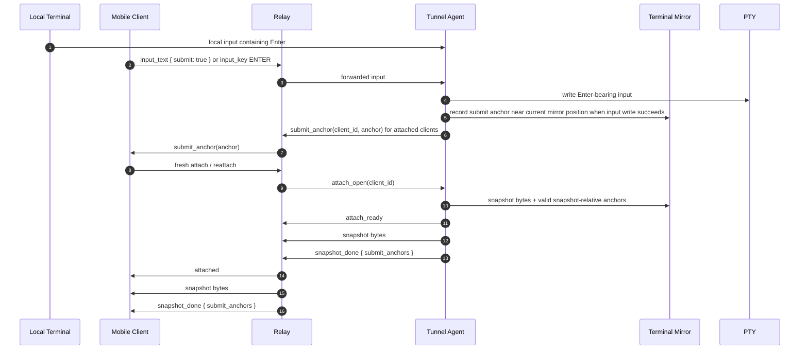

# feat: Add Submit Anchor Index With Live Updates

## Overview

Add an agent-local, bounded submit-anchor index so mobile clients can show right-side jump dots for recent local or remote submit Enter events both after refresh/reattach and while continuously attached. The anchor contract has two delivery paths: fresh attach returns the current bounded anchor set on `snapshot_done.submit_anchors`, and live attached clients receive incremental `submit_anchor` events when new submit anchors are recorded. The Tunnel agent remains the single owner of anchor creation, ids, retention, and expiry; the relay remains content-opaque and only routes anchor metadata.

The first version deliberately marks PTY input writes that send the `ENTER` carriage return outside bracketed-paste regions, not every keypress, draft edit, or Codex-rendered message block (see origin: `docs/brainstorms/2026-04-28-mobile-submit-anchor-index-requirements.md`).

---

## Problem Frame

Long coding-agent sessions make it hard for a mobile user to find the points where they submitted previous prompts. Tunnel already owns the PTY, structured remote input translation, and the headless terminal mirror used for fresh attach snapshots. This plan adds a small metadata layer at that same ownership boundary so valid recent submit locations can be restored after reconnect and kept current while the mobile websocket stays online, without relay transcript storage or terminal-output parsing.

---

## Requirements Trace

- R1. Jump dots represent local or remote submit Enter events, not every keypress or output chunk.
- R2. Anchors are "user submit anchors" or "turn entry anchors," not exact Codex-rendered user-message markers.
- R3. V1 records local-terminal Enter, mobile Local Draft submit, and mobile Remote Streaming Enter through the same PTY input boundary.
- R4. The Tunnel agent keeps anchors in memory for the running session, bounded by the terminal mirror context.
- R5. Fresh attach and reattach expose currently valid anchors with the snapshot context.
- R6. Expired or unmappable anchors are omitted rather than shown as broken jump targets.
- R7. Mobile clients can render multiple anchors and jump to retained terminal locations.
- R8. Relay remains content-opaque and does not inspect terminal bytes or persist transcript state.
- R9. No durable transcript replay or relay-side scrollback storage is introduced.
- R10. Reconnect remains fresh snapshot plus live bytes, not missed-byte replay.
- R11. Mobile UI can land near submitted turns without implying exact Codex semantic knowledge.
- R12. UI dots are submit-level only, avoiding per-key visual noise.
- R13. Already attached mobile clients receive live submit-anchor events for newly recorded successful submit Enter events.
- R14. Tunnel remains the unified anchor authority; mobile clients reconcile live dots against snapshot anchors after reconnect.

**Origin actors:** A1 Mobile user, A2 Mobile client, A3 Tunnel agent, A4 Relay
**Origin flows:** F1 Submit and mark an anchor, F2 Reattach and restore jump dots, F3 Live attached client receives a new anchor, F4 Anchor expires with scrollback
**Origin acceptance examples:** AE1 submits produce multiple dots, AE2 local and mobile Enter submits are both recoverable when retained, AE3 expired anchors are omitted, AE4 relay remains content-opaque, AE5 online clients receive live submit anchors

---

## Scope Boundaries

- Do not parse Codex, Claude, or any other TUI's terminal output to infer semantic message blocks.
- Do not promise exact alignment with a rendered user-message block inside the TUI.
- Do not add per-key, per-character, or draft-edit anchors.
- Do not persist anchors across process exit, new `session_id`, or retained scrollback expiry.
- Do not add relay-side transcript storage, terminal emulation, scrollback cache, or replay endpoints.
- Do not change PTY size ownership or mobile-driven resize behavior.
- Do not make the mobile client the source of truth for anchors. Local provisional dots are optional UI affordances; the authoritative id, retention, and expiry still come from Tunnel.

### Deferred to Follow-Up Work

- Mobile app visual rendering, live-event consumption, dedupe/reconciliation, and dense-dot interaction polish: implement in the mobile client once this repo exposes the attach metadata contract.
- TUI semantic markers for exact user-message blocks: future cooperation from specific TUIs, not inferred by Tunnel.

---

## Context & Research

### Relevant Code and Patterns

- `internal/protocol/message.go` owns attach control, agent frames, and client input envelope types. It is the right place to define optional submit-anchor metadata.
- `internal/tunnel/session/terminal_mirror.go` owns the xterm-backed mirror, bounded scrollback, and snapshot serialization. Anchor retention and snapshot-relative mapping should live beside this mirror state.
- `internal/tunnel/session/hub.go` is the shared PTY input boundary for local terminal input and remote attach input.
- `internal/tunnel/connector/connector.go` binds to the Hub, captures snapshots atomically on `attach_open`, and emits `snapshot_done`.
- `internal/relay/session/registry.go` routes `attach_ready`, snapshot bytes, `snapshot_done`, resize controls, and other attach-scoped controls without inspecting terminal bytes. It should pass through snapshot and live anchor metadata as opaque attach control data.
- `internal/relay/handler/agent/ws.go` and `internal/relay/handler/attach/ws.go` are the websocket seams for agent-to-relay control and client-to-relay input.
- `internal/tunnel/session/terminal_mirror_test.go`, `internal/tunnel/connector/connector_test.go`, `internal/relay/session/registry_test.go`, `internal/relay/handler/ws_api_test.go`, and `internal/protocol/message_test.go` already provide the right test layers for mirror, connector, relay routing, websocket integration, and protocol round trips.

### Institutional Learnings

- No `docs/solutions/` learnings were present in this worktree during planning.

### External References

- No external research was used. The feature is an incremental extension of existing repo-owned attach protocol and mirror behavior.

---

## Key Technical Decisions

- Extend `snapshot_done` with optional submit anchors instead of introducing a replay endpoint or transcript API: anchors are meaningful only after the snapshot bytes have restored the client terminal buffer.
- Add a live `submit_anchor` attach control event for already attached clients: live events prevent online mobile clients from missing desktop or other-client submits between fresh snapshots.
- Define anchor line positions relative to the restored snapshot buffer: `line` is a 0-based row in the client's terminal buffer after applying the just-received snapshot bytes.
- Define live anchor line positions relative to the attached client's current terminal buffer at the point the `submit_anchor` event is processed. The agent should send the event in order with surrounding live terminal bytes so clients can create a local terminal marker for future scroll movement.
- Keep anchor payloads content-free: include session-local identifiers, snapshot-relative positions, and Unix-second submit timestamps, not prompt text, terminal bytes, or transcript excerpts.
- Store anchors in the Tunnel agent next to `TerminalMirror`: the mirror owns current terminal state, bounded scrollback, and the knowledge needed to decide whether an anchor is still mappable.
- Use mirror-owned marker semantics where possible: marker disposal or a failed snapshot-range check should cause an anchor to be omitted rather than sent stale.
- Treat `snapshot_done.submit_anchors` as the authoritative full bounded set after attach/reconnect, and `submit_anchor` as authoritative online incremental updates from the same Tunnel-owned index. A mobile client may show provisional dots for its own submits, but should reconcile with server ids from live events or the next snapshot.

---

## Open Questions

### Resolved During Planning

- What line representation should mobile receive? Use a snapshot-relative 0-based terminal-buffer line so the mobile client can scroll within the emulator state restored by that same attach.
- How should anchors be delivered? Use both `snapshot_done.submit_anchors` for fresh attach recovery and live `submit_anchor` events for online attached clients.
- Where should expiry be owned? The Tunnel mirror should decide whether a marker still maps into the serialized snapshot context; expired or ambiguous anchors are omitted.
- Should local terminal input count? Yes. Local terminal Enter and remote attach Enter should share the same anchor model.

### Deferred to Implementation

- Exact struct, helper, and method names: settle while editing the existing protocol and mirror files.
- Alternate-buffer mapping behavior: characterize with tests and omit anchors when the mapping cannot be made honest to the snapshot bytes.
- Mobile dense-dot visual treatment and live-event dedupe/reconciliation: belongs to the external mobile client after the attach metadata contract exists.

---

## High-Level Technical Design

> *This illustrates the intended approach and is directional guidance for review, not implementation specification. The implementing agent should treat it as context, not code to reproduce.*

The snapshot anchor list is tied to the snapshot it accompanies. A client must apply the snapshot bytes first, then interpret each anchor's `line` against that restored terminal buffer. Live `submit_anchor` events are incremental updates for clients that are already attached; they should be processed in stream order and reconciled against the next snapshot if the client reconnects.

---

## Implementation Units

- U1. **Define snapshot and live submit-anchor protocol metadata**

**Goal:** Add the attach metadata shape needed for snapshot-relative submit anchors and live incremental submit-anchor events without changing binary terminal byte packets.

**Requirements:** R1, R2, R5, R7, R8, R10, R13, R14, AE1, AE4, AE5

**Dependencies:** None

**Files:**
- Modify: `internal/protocol/message.go`
- Test: `internal/protocol/message_test.go`

**Approach:**
- Add a small protocol type for submit anchors with fields sufficient for mobile recovery, such as a session-local stable id, snapshot-relative line, and Unix-second submit timestamp.
- Extend agent-side `snapshot_done` and client-side `snapshot_done` control messages with an optional anchor list that is omitted when empty.
- Add a live client-facing `submit_anchor` control message carrying one anchor for already attached clients.
- Add the matching agent-to-relay frame shape so the owning agent can route one live anchor to each attached client without changing terminal-byte packets.
- Sanitize anchor lists before forwarding: omit empty ids and negative coordinates/timestamps, and cap the payload at 256 anchors.
- Sanitize live single-anchor messages with the same validity rules; invalid live anchors should be dropped rather than forwarded.
- Do not include submitted text, raw terminal bytes, or TUI-derived labels.
- Keep existing binary attach packet format unchanged.

**Patterns to follow:**
- Existing constructors such as `SnapshotDoneFrame`, `SnapshotDoneMessage`, and JSON omit-empty behavior in `internal/protocol/message.go`.
- Existing JSON round-trip tests in `internal/protocol/message_test.go`.

**Test scenarios:**
- Happy path: building a `snapshot_done` agent frame with two anchors serializes and deserializes with id, line, and timestamp preserved.
- Happy path: building a client `snapshot_done` message with anchors serializes and deserializes with anchors preserved.
- Happy path: building a live `submit_anchor` agent frame and client control message preserves the same anchor fields.
- Edge case: empty anchor lists are omitted from JSON so existing no-anchor snapshot behavior remains compact.
- Edge case: invalid and over-limit anchor lists are filtered and truncated before they reach clients.
- Edge case: invalid single live anchors are omitted or rejected by constructor helpers so relay routing cannot forward malformed metadata.
- Edge case: existing no-anchor `snapshot_done` round trips exactly as before from the perspective of type and required fields.

**Verification:**
- Protocol tests prove optional snapshot anchor metadata and live single-anchor metadata can move through JSON control frames without changing attach binary packet behavior.

---

- U2. **Add mirror-owned submit-anchor indexing**

**Goal:** Teach the terminal mirror to record, retain, expire, and snapshot-map submit anchors inside the same bounded state model as scrollback snapshots.

**Requirements:** R4, R5, R6, R9, R11, AE3

**Dependencies:** U1

**Files:**
- Modify: `internal/tunnel/session/terminal_mirror.go`
- Test: `internal/tunnel/session/terminal_mirror_test.go`

**Approach:**
- Add mirror-owned anchor state guarded by the existing mirror mutex.
- Record submit anchors against the current terminal buffer position when the Hub input path successfully writes an `ENTER` carriage return outside a bracketed-paste region.
- Make anchor recording return the newly created anchor metadata needed for a live `submit_anchor` event, while still retaining the marker for future snapshot mapping.
- Use xterm buffer marker behavior, or an equivalent mirror-owned position tracker, so anchors naturally expire or become unmappable when retained scrollback no longer includes them.
- When producing a snapshot, return both snapshot bytes and only the anchors whose line can be mapped into that snapshot's serialized buffer range.
- Normalize each emitted anchor to the client's restored buffer coordinate system: `line = marker line - serialized snapshot start line`.
- Normalize a live anchor to the currently attached terminal-buffer coordinate system at emission time so the mobile client can create a local marker immediately.
- Omit anchors that are disposed, negative, outside the serialized range, or ambiguous because the active terminal buffer cannot be mapped honestly.
- Avoid storing submitted text.

**Execution note:** Add characterization tests for normal-buffer anchors before changing connector behavior.

**Patterns to follow:**
- Existing snapshot round-trip and bounded-scrollback tests in `internal/tunnel/session/terminal_mirror_test.go`.
- Existing mirror mutex and snapshot serialization flow in `internal/tunnel/session/terminal_mirror.go`.

**Test scenarios:**
- Happy path: after recording three submit anchors in normal-buffer output, `Snapshot` returns three anchors with increasing snapshot-relative lines that restore into visible or scrollback buffer positions.
- Covers AE3. Edge case: after enough output trims the oldest marker outside retained scrollback, the expired anchor is omitted from the next snapshot anchor list.
- Edge case: `input_text` content is not stored in any anchor payload returned from the mirror.
- Edge case: anchors before the snapshot serialization start line are omitted rather than clamped to line zero.
- Edge case: active alternate-buffer behavior is characterized; if an anchor cannot be mapped into the serialized snapshot honestly, it is omitted.
- Edge case: live anchor metadata is not emitted when the anchor cannot be mapped honestly at record time.
- Integration: snapshot bytes still restore the same viewport and bounded scrollback as before when anchors are present.

**Verification:**
- Mirror tests prove anchor retention and expiry follow snapshot-retained terminal context, not durable history.

---

- U3. **Record submit anchors at the Hub input boundary**

**Goal:** Connect local-terminal and remote attach submit input to the mirror-owned anchor index while preserving existing PTY input ordering.

**Requirements:** R1, R3, R4, R12, R13, R14, F1, F3, AE1, AE2, AE5

**Dependencies:** U1, U2

**Files:**
- Modify: `internal/tunnel/connector/connector.go`
- Modify: `internal/tunnel/session/hub.go`
- Test: `internal/tunnel/connector/connector_test.go`
- Test: `internal/tunnel/session/hub_test.go`

**Approach:**
- Let the connector register the Hub input observer when it binds to the running session.
- Record one anchor for each local or remote input write carriage return (`\r`) outside bracketed-paste regions.
- Do not record anchors for `input_text` with `submit: false` when the text body does not contain `\r`, non-Enter `input_key` events, local typing without Enter, or PTY output.
- If a client sends a carriage return inside non-paste `input_text` with `submit: false`, treat it like any other Enter-bearing PTY input and record an anchor.
- If an input write fails, remove any anchors provisionally recorded for that write and roll back bracketed-paste scanner state.
- Record the anchor near the current mirror position while preserving the "turn entry" semantics from the origin document.
- After the input write succeeds, enqueue live `submit_anchor` control frames for currently attached clients for each newly recorded anchor.
- Preserve ordering with surrounding live terminal bytes as much as the existing connector queues allow: the live anchor should be sent after the successful input write is known and before later output-driven live bytes can make the client's marker point ambiguous.
- Include valid anchors in the `snapshot_done` frame emitted by `handleAttachOpen`.
- Preserve the no-gap snapshot handoff: snapshot bytes and anchor extraction happen under the same attach/mirror critical section before the client is considered live for subsequent bytes.

**Patterns to follow:**
- Existing submit ordering behavior in `deliverInputToHub`.
- Existing attach snapshot handoff tests in `internal/tunnel/connector/connector_test.go`.

**Test scenarios:**
- Covers AE1. Happy path: three forwarded `input_text { submit: true }` events produce three anchors in a later attach's `snapshot_done` metadata.
- Covers AE2. Happy path: local terminal input through `session.Hub.WriteInput` and remote `input_key { key: "ENTER" }` create retained submit anchors.
- Edge case: `input_text { submit: false }` without `\r`, non-Enter `input_key` events, and local input without `\r` do not create anchors.
- Edge case: multiple carriage returns in one input write produce multiple anchors.
- Edge case: `input_text { submit: false }` with an embedded `\r` creates an anchor because it writes an Enter carriage return to the PTY.
- Edge case: carriage returns inside bracketed paste do not create anchors.
- Edge case: pending inbound submit input before `BindHub` is delivered once and records at most one anchor when eventually routed.
- Integration: attaching after anchors exist still sends `attach_ready`, snapshot bytes, and `snapshot_done` in order, with live bytes after the snapshot boundary.
- Integration: an already attached client receives a live `submit_anchor` control after a desktop Enter, a remote `input_key ENTER`, and a remote `input_text { submit: true }`.
- Integration: if two attached clients are watching the same session, both receive live `submit_anchor` events for a submit from either client or the local terminal.
- Error path: empty or expired anchor list still emits a valid no-anchor `snapshot_done`.
- Error path: failed PTY input writes do not leave submit anchors behind.
- Error path: failed PTY input writes also do not emit live `submit_anchor` events.

**Verification:**
- Hub and connector tests prove local and remote Enter submits create anchors while non-submit input does not, and attach ordering remains compatible with the current snapshot/live byte contract.

---

- U4. **Pass snapshot and live anchor metadata through relay attach routing**

**Goal:** Let the relay forward snapshot and live submit-anchor metadata from the owning agent to attached clients without interpreting terminal bytes or storing history.

**Requirements:** R5, R7, R8, R10, R13, R14, F2, F3, AE4, AE5

**Dependencies:** U1

**Files:**
- Modify: `internal/relay/session/registry.go`
- Modify: `internal/relay/handler/agent/ws.go`
- Test: `internal/relay/session/registry_test.go`
- Test: `internal/relay/handler/ws_api_test.go`

**Approach:**
- Extend the agent websocket handler so `snapshot_done` frames can carry optional anchor metadata.
- Extend registry snapshot-done routing to pass the optional anchor list into the client-facing `snapshot_done` control message.
- Extend the agent websocket handler and registry so live `submit_anchor` frames are routed only when the owner matches and the target client is currently attached.
- Keep the relay blind to anchor meaning: it validates routing ownership and client attachment state, but it does not inspect terminal bytes or derive anchors from content.
- Preserve existing slow-client and stale-client behavior for control-message send failures on both snapshot and live anchor controls.

**Patterns to follow:**
- Existing `RouteSnapshotDoneIfOwner`, `RouteAttachReadyIfOwner`, and websocket integration tests.
- Existing owner/client checks in `internal/relay/session/registry.go`.

**Test scenarios:**
- Happy path: registry routes `snapshot_done` with two anchors to the attached client and preserves anchor fields.
- Covers AE4. Integration: handler websocket test sends `snapshot_done` with anchors from the agent and the attach client receives the same metadata without relay-side terminal byte inspection.
- Covers AE5. Integration: handler websocket test sends a live `submit_anchor` from the agent and the already attached client receives the same anchor metadata.
- Edge case: invalid agent-sent anchors are omitted and over-limit anchor lists are capped before client delivery.
- Edge case: invalid live `submit_anchor` payloads are dropped before delivery.
- Edge case: `snapshot_done` with no anchors remains compatible with existing tests and client control ordering.
- Error path: if sending `snapshot_done` or `submit_anchor` with anchors fails, the relay detaches the slow client using the existing slow-client path.
- Error path: `snapshot_done` or `submit_anchor` from a non-owner or for a detached client is ignored as existing lifecycle rules require.

**Verification:**
- Relay tests prove snapshot and live anchors are routed as opaque attach control metadata and do not create relay-owned history.

---

- U5. **Update public attach contract documentation**

**Goal:** Document the new optional snapshot and live submit-anchor metadata and the intended mobile-client interpretation without widening the product promise.

**Requirements:** R2, R5, R8, R9, R10, R11, R12, R13, R14, F2, F3, F4, AE3, AE4, AE5

**Dependencies:** U1, U2, U3, U4

**Files:**
- Modify: `README.md`
- Modify: `docs/api.md`
- Modify: `docs/protocol.md`
- Modify: `docs/tui-attach-flow.md`
- Modify: `docs/architecture.md`
- Modify: `CLAUDE.md`

**Approach:**
- Update client attach docs to show optional `submit_anchors` on `snapshot_done`.
- Document live `submit_anchor` control events for already attached clients and explain that they are incremental updates from the same Tunnel-owned anchor index.
- Define `line` as a 0-based row in the terminal buffer after the snapshot bytes have been applied.
- Clarify the line-coordinate difference: snapshot anchor lines are interpreted after snapshot restore, while live anchor lines are interpreted against the current attached terminal state when the live event is received.
- State that anchors represent local or remote submit Enter entry points, not exact Codex-rendered prompt blocks.
- State that anchors are bounded, agent-local, non-durable, and omitted when they no longer map into retained snapshot context.
- State that reconnect snapshots are the reconciliation point for missed live events or local provisional dots.
- State that clients should ignore unknown attach control fields so optional future metadata remains compatible.
- Preserve and restate the no replay, no relay transcript, content-opaque relay boundary.
- Update `CLAUDE.md`; `AGENTS.md` is a symlink to `CLAUDE.md` in this worktree and receives the same content.

**Patterns to follow:**
- Existing attach lifecycle language in `docs/protocol.md`, `docs/api.md`, and `docs/tui-attach-flow.md`.
- Existing product-boundary language in `README.md` and `docs/architecture.md`.

**Test scenarios:**
- Test expectation: none -- documentation-only unit. The behavioral guarantees are covered by U1-U4 tests.

**Verification:**
- Docs consistently describe submit anchors as optional snapshot metadata plus live incremental metadata and do not imply transcript replay, Relay terminal emulation, or Codex-specific parsing.

---

## System-Wide Impact

- **Interaction graph:** Mobile attach input flows through the relay attach websocket to the agent connector, while local terminal input flows directly through the session Hub. Anchor creation happens when the bound connector observes successful Enter-bearing Hub input and records into the mirror. Anchors return as a full bounded set on fresh attach through `snapshot_done.submit_anchors`, and as live incremental `submit_anchor` controls for clients that are already attached.
- **Error propagation:** Anchor metadata should follow existing attach control-message failure behavior. Slow or closed clients are detached through existing paths for both `snapshot_done` and live `submit_anchor`.
- **State lifecycle risks:** Anchors are in-memory, per running session, and bounded by mirror context. They disappear on process exit, new `session_id`, or scrollback expiry.
- **API surface parity:** Client attach docs, protocol types, relay routing, and connector behavior must agree on optional `snapshot_done.submit_anchors` and live `submit_anchor` events.
- **Integration coverage:** Protocol unit tests are not enough; connector and relay websocket tests must prove metadata reaches attach clients in both lifecycle phases: snapshot recovery and live online updates.
- **Unchanged invariants:** Terminal bytes remain raw and content-opaque, reconnect remains fresh snapshot recovery, local terminal remains PTY size authority, and Relay does not store transcript history.

---

## Risks & Dependencies

| Risk | Mitigation |
|------|------------|
| Snapshot-relative line mapping differs between agent mirror and mobile terminal emulator | Define the line coordinate relative to the restored snapshot buffer and cover it with xterm round-trip tests. |
| Active alternate-screen TUIs make anchors hard to map | Characterize behavior and omit anchors that cannot be mapped honestly; document this as approximate turn-entry navigation, not exact TUI message positioning. |
| Older clients mishandle extra metadata | Put anchors on optional `snapshot_done` fields and keep no-anchor behavior unchanged; document clients should ignore unknown fields. |
| Online clients miss anchors because live events were not present in the first design | Add a live `submit_anchor` control emitted from the same Tunnel-owned anchor index used by snapshots. |
| Duplicate dots after reconnect or after a local provisional dot | Use Tunnel-generated anchor ids as authoritative identity; clients reconcile local/provisional dots against live events and replace the full set from `snapshot_done.submit_anchors` after reconnect. |
| Live anchor line ordering drifts relative to terminal bytes | Emit live anchor controls in order with the connector's live stream and define live line coordinates relative to the client's terminal state when the event is processed. |
| Anchor payload accidentally becomes transcript-like | Keep payload content-free and test that submitted text is not stored or emitted. |
| Users expect durable history | Keep docs explicit that anchors expire with agent-local retained context and disappear across session/process lifecycle boundaries. |

---

## Documentation / Operational Notes

- This changes the public attach websocket message contract, so `docs/api.md`, `docs/protocol.md`, `docs/tui-attach-flow.md`, `docs/architecture.md`, `README.md`, and `CLAUDE.md` need coordinated updates for both `snapshot_done.submit_anchors` and live `submit_anchor`.
- No PostgreSQL schema, Docker deployment, operator workflow, or relay persistence change is expected.
- Mobile client work is a follow-up outside this repo: replace/reconcile dots from `snapshot_done.submit_anchors` after attach, append authoritative dots from live `submit_anchor` while online, interpret snapshot lines after applying snapshot bytes, interpret live lines against the current attached terminal state, and keep local provisional dots for active-session submits only if desired.

---

## Sources & References

- **Origin document:** [docs/brainstorms/2026-04-28-mobile-submit-anchor-index-requirements.md](../brainstorms/2026-04-28-mobile-submit-anchor-index-requirements.md)
- Related code: `internal/protocol/message.go`
- Related code: `internal/tunnel/session/terminal_mirror.go`
- Related code: `internal/tunnel/connector/connector.go`
- Related code: `internal/relay/session/registry.go`
- Related code: `internal/relay/handler/agent/ws.go`
- Related docs: `docs/protocol.md`
- Related docs: `docs/tui-attach-flow.md`
