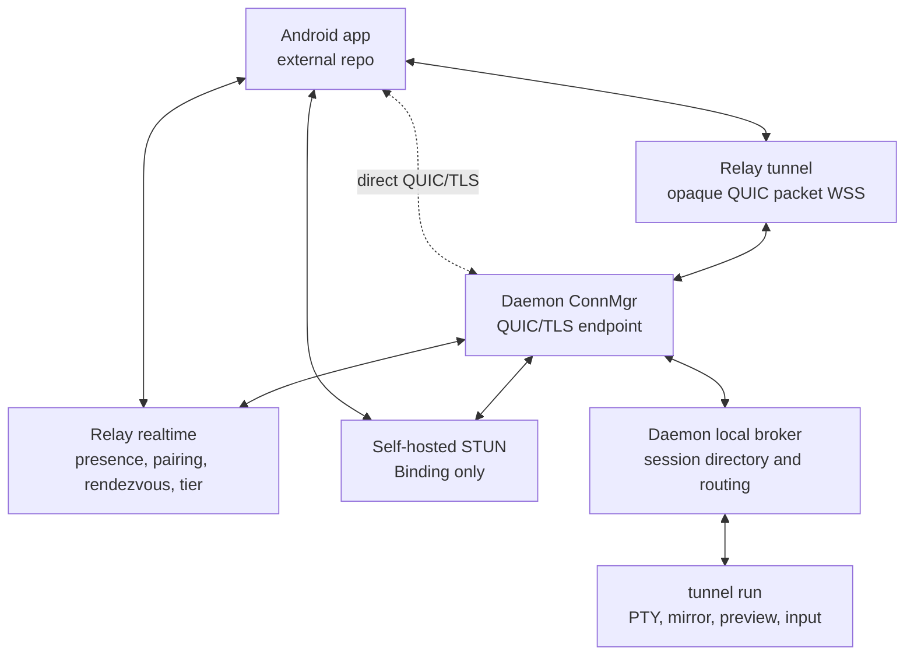
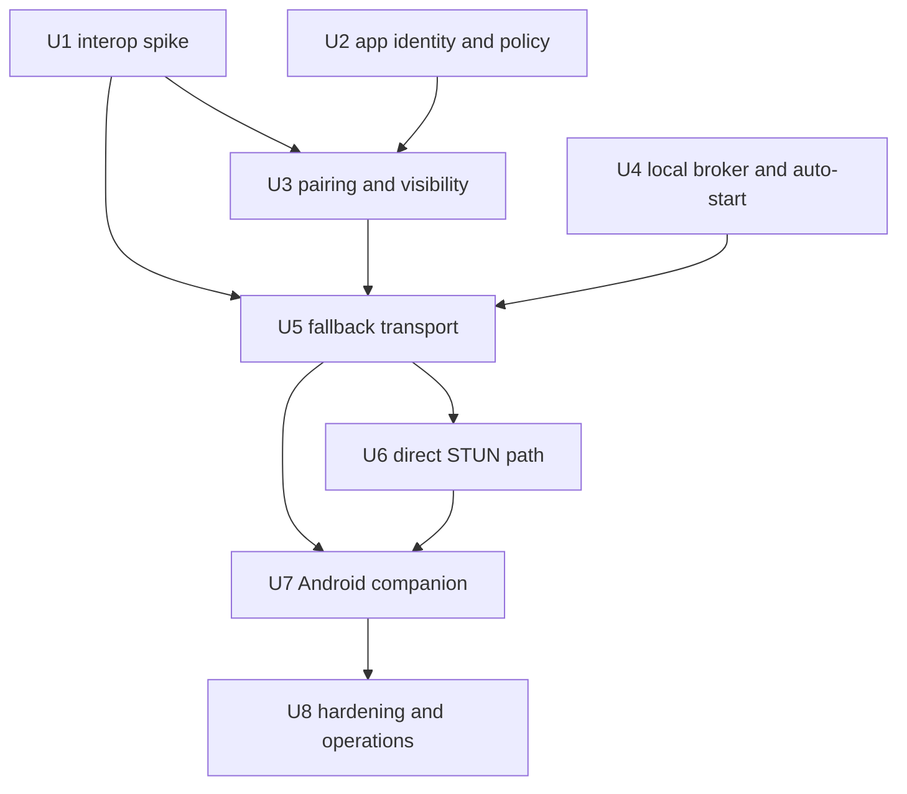

# feat: Implement QUIC session connectivity in phases

## Overview

Implement the `docs/connectivity/` architecture as a multi-branch program, not a single mega-PR. The target shape is a daemon-mediated mobile session stack where Android connects to a trusted computer over QUIC/TLS with device-key pinning, prefers direct UDP when possible, and falls back to a Relay-hosted WebSocket tunnel that forwards only encrypted QUIC packets.

This plan intentionally separates the program into large, reviewable steps. Each step should land independently, update a step handoff document, and leave the repository in a coherent state before the next branch begins. Step 1 is the only step that should start immediately: a Go mobile-simulator protocol/data and transport-primitives spike. Later steps should be re-reviewed after Step 1 merges.

---

## Problem Frame

The origin requirements define the long-term need to separate Relay control-plane duties from terminal data-plane traffic: direct mobile-to-computer transport should be preferred, Relay forwarding should remain as encrypted fallback, and the PTY owner on the computer should remain authoritative for snapshot, live bytes, input, and session lifecycle (see origin: `docs/brainstorms/2026-04-23-direct-attach-control-plane-requirements.md`).

The later `docs/connectivity/` documents refine that into a concrete phase-1 contract: QUIC/TLS 1.3 with device-key pinning, `quic-go` on daemon, Cloudflare `quiche` on Android, WSS-tunneled QUIC fallback before direct STUN, daemon-owned session discovery, a trusted-computer-count tier rule in the official app, and Relay reduced to auth, daemon presence, pairing transport, rendezvous, account tier exposure, and opaque fallback packet relay.

The current repository still implements a Relay-centered model: `/agent/ws`, `/device/ws`, `/api/sessions`, and `/api/sessions/:id/attach/ws` carry session discovery, attach control, terminal bytes, input, launch, and stop. This program focuses on the new daemon-mediated connectivity stack; preserving, retiring, or redesigning the old attach surface is not a planning dimension for this feature split.

---

## Requirements Trace

- R1-R5. Separate Relay control from terminal data; keep attach semantics path-agnostic and keep `tunnel run` as PTY/session authority.
- R6-R9. Preserve end-to-end encryption and prevent Relay from learning terminal plaintext or transport session keys on both direct and fallback paths.
- R10-R12. Move long-term scaling away from one Relay data-plane socket per viewed session and toward one daemon transport per opened daemon card.
- R13-R15. Make direct failure fall back automatically without exposing a separate security mode to users.
- R16-R17. Prefer contracts and abstractions that advance direct plus encrypted fallback instead of optimizing the existing Relay attach path alone.
- D1. Use WSS-tunneled QUIC fallback first; defer UDP relay unless production fallback latency fails the documented SLO.
- D2. Auto-start the daemon from `tunnel run` without making users manage daemon lifecycle manually.
- D3. Enforce Free / Pro only in the official app through trusted-computer count: Free has one active trusted computer; Pro has up to ten trusted computers.
- D4. Bind app sessions to `device_fingerprint` in phase 1 without per-WebSocket proof of possession.
- D5. Use one bidirectional control stream plus daemon-initiated unidirectional interactive streams.
- D6. Use length-framed JSON control payloads and raw bytes only for snapshot/live chunks.

**Origin actors:** A1 Mobile client, A2 Tunnel session owner on the computer, A3 Relay server

**Origin flows:** F1 Direct attach succeeds, F2 Direct attach fails and fallback takes over, F3 Relay-only control-plane operation

**Origin acceptance examples:** AE1 direct attach with same semantics, AE2 fallback where Relay only sees encrypted payload frames, AE3 direct/data separation preferred over Relay-only multiplexing

---

## Scope Boundaries

- This plan is a program plan for the current Go repository. It includes Android acceptance gates, but the production Android codebase is not present in this workspace. Before Android production implementation begins, create or update a companion Android plan with concrete repo-relative Android file paths.
- Do not make existing Relay attach compatibility or retirement part of this program's high-level scope. Implementation PRs should avoid unrelated changes to that surface unless a step explicitly requires a route or protocol change.
- Do not implement UDP relay in phase 1.
- Do not implement daemon-side per-session ACLs or tier enforcement in phase 1.
- Do not implement payment or upgrade purchase flow in phase 1. Relay operators may temporarily set a user to `free` or `pro`; this is a FIXME to replace with a real payment-backed subscription flow later.
- Do not add missed-byte replay; reconnect recovery is fresh `session_index`, preview resubscribe, interactive re-request, and fresh snapshot.
- Do not describe the root `README.md`, `AGENTS.md`, or `CLAUDE.md` as if QUIC connectivity has shipped before implementation reaches user-visible parity.

### Deferred to Follow-Up Work

- Android production implementation: separate plan in the Android client repo once its path and build system are available.
- UDP relay fallback: only after production WSS fallback metrics fail the phase-2 trigger in `docs/connectivity/contract.md`.
- Proof-of-possession Relay app auth: phase-2 `/auth/register-device` work if account-token theft becomes a practical abuse vector.
- OS keyring daemon identity storage: future hardening after file-mode `0600` is proven insufficient.

---

## Context & Research

### Relevant Code and Patterns

- `internal/protocol/message.go` owns current Relay attach/session JSON envelopes and is the natural place to add shared connectivity control-plane event types while the protocol is still Go-only.
- `internal/protocol/attach_packet.go` already demonstrates a compact binary frame with tests; the new length-framed connectivity frame codec should live separately so the existing attach packet format stays stable.
- `internal/tunnel/connector/connector.go` is the current session-to-Relay adapter and already maintains a `session.TerminalMirror`, attach snapshots, live output fanout, submit serialization, resize forwarding, and reconnect backoff.
- `internal/tunnel/session/hub.go` and `internal/tunnel/session/terminal_mirror.go` already provide PTY fanout, input serialization, resize tracking, snapshot serialization, and viewport text.
- `internal/tunnel/daemon/runtime.go`, `control.go`, `paths.go`, `recipe.go`, and `connector.go` own daemon lifecycle, local control socket, persisted device identity, status, tmux launch, and current `/device/ws` connection.
- `internal/relay/handler/new.go` wires the current REST/WebSocket surface; new connectivity endpoints must be added in parallel with `/agent/ws`, `/device/ws`, and `/api/sessions/:id/attach/ws`.
- `internal/relay/auth/app_service.go`, `internal/relay/auth/types.go`, `internal/relay/store/postgres/auth_repository.go`, and `deploy/postgres/latest.sql` must change together for `device_fingerprint`, JWT/session storage, and account tier.
- `internal/relay/device/registry.go` and `internal/relay/session/registry.go` are live in-memory registries. New pairing-derived daemon visibility and relay-tunnel attempt state should follow that live-only style unless a schema-backed state is explicitly required.
- `docs/daemon.md` currently says daemon start fails early when tmux is unavailable. Connectivity auto-start creates a conflict: the daemon's connectivity core should run even when launch health is degraded, or `tunnel run` auto-start will regress local launch.
- `docs/plans/2026-04-24-001-feat-session-connectivity-program-plan.md` is superseded and should not be edited. It is only a breadcrumb from the old WebRTC direction.

### Institutional Learnings

- No `docs/solutions/` entries exist in this repository.

### External References

- `quic-go` v0.59.0 is the latest module version available through `go list`; official docs describe `quic.Transport`, handshake deadlines, TLS session resumption, 0-RTT behavior, streams, flow control, and server/client setup: https://quic-go.net/docs/quic/client/ and https://quic-go.net/docs/quic/server/
- `quiche` docs identify it as a low-level QUIC implementation where the application owns packet I/O, timers, ALPN, flow-control configuration, and stream reads/writes: https://docs.quic.tech/quiche/
- `quiche` C API exposes peer verification, certificate/key loading, ALPN, idle timeout, stream/data limits, pacing, and early-data configuration hooks needed by the Android JNI spike: https://github.com/cloudflare/quiche/blob/master/quiche/include/quiche.h
- Android Keystore documentation confirms non-exportable app-owned key storage and the operational model for Android app key material: https://developer.android.com/privacy-and-security/keystore
- AOSP source shows Android platform support for `ED25519` and `XDH` KeyPairGenerator SPI classes in newer platform code, but device/API support must still be verified during the Android spike: https://android.googlesource.com/platform/frameworks/base/+/80a664262667cf14ee1ae52ab7c53abc26e17d1e/keystore/java/android/security/keystore2/AndroidKeyStoreKeyPairGeneratorSpi.java
- RFC 8489 defines STUN and Binding behavior; Pion's STUN package is a Go implementation candidate for the self-hosted STUN service: https://datatracker.ietf.org/doc/html/rfc8489 and https://github.com/pion/stun

---

## Key Technical Decisions

| Decision | Choice | Rationale |
|---|---|---|
| Program shape | Land as step branches with handoff docs | The feature spans crypto, daemon lifecycle, Relay auth, transport, deployment, and Android. Branch-sized steps keep review tractable and avoid making Step 2 depend on unmerged Step 1 assumptions. |
| Step handoff location | Create `docs/connectivity/implementation/step-XX-*.md` as each step lands | The user needs durable "what was implemented, what remains, what to do next" records. These are execution handoffs, distinct from this plan. |
| First implementation step | Hard-gate interop and transport primitives only | If `quic-go`/`quiche`, SPKI pinning, ALPN, bidirectional/unidirectional streams, or WSS packet carrier assumptions fail, higher-level pairing and broker work should not start. |
| Production integration timing | Keep this program focused on the new stack | The user explicitly does not want legacy attach preservation or retirement to drive the step split. Existing routes may remain untouched while the new connectivity path is built, but they are not a deliverable in this plan. |
| Shared primitives | Add isolated `internal/connectivity/...` packages before daemon/Relay integration | SAS, identity certificate construction, frame codec, QUIC config, and packet carrier tests are security-sensitive and should not be buried inside daemon or handler code. |
| Daemon startup | Split daemon connectivity core from tmux launch health | `tunnel run` auto-start requires a daemon that can broker local sessions even when tmux is missing. Tmux should degrade remote launch health, not necessarily prevent the connectivity broker from running. |
| Relay app identity | Add `device_fingerprint` to app-session auth before pairing | Pairing account binding depends on the Android JWT/session's account and fingerprint; bolting this on after pairing would create migration churn. |
| Account tier storage | Add a temporary Relay operator-managed tier surface, defaulting to `free` | Payment is deferred, but Android still needs a reliable `free`/`pro` input for trusted-computer limits. Operators can upgrade/downgrade users manually for now; this should be marked as a FIXME for future payment-backed ownership. |
| Pairing visibility refresh | Step 2 must spec and implement daemon-to-Relay visibility refresh after reconnect | Current docs say Relay should not be the durable trust DB, but do not fully specify how Relay rebuilds daemon visibility after restart. The daemon-local trusted roster should refresh Relay's live derived visibility. |
| Fallback before direct | Implement WSS-tunneled QUIC before STUN/direct | `contract.md` orders 1.2 before 1.3. Fallback-only makes session protocol, stream routing, and Android UI testable without NAT variability. |
| STUN implementation | Self-host Binding-only STUN in the Relay edge footprint | The docs explicitly avoid public third-party STUN and TURN. STUN belongs later with direct path work and deployment changes. |
| Android ownership | Treat Android production work as companion implementation until repo path is known | The Go repo can provide contracts, interop harnesses, and simulated clients. Production Android file paths cannot be invented in this plan. |

---

## Open Questions

### Resolved During Planning

- QUIC library direction: `quic-go` on daemon and Cloudflare `quiche` via JNI on Android, with `kwik` only as fallback if packaging blocks.
- Fallback carrier: WSS-tunneled QUIC, not TURN/coturn and not a Relay-visible session byte pipe.
- Tier enforcement: official-app trusted-computer count only; Relay exposes tier, daemon stays tier-unaware.
- First branch scope: interop spike and reusable primitives, not production daemon/Relay behavior.
- Existing Relay attach posture: ignore as a product planning dimension for this program unless a concrete implementation step must touch it.

### Deferred to Implementation

- Android repo paths and build integration: required before production Android work, not knowable from this workspace.
- Exact Relay realtime route names: decide in Step 4 when the handler layout is edited, then document in `docs/api.md` before code review.
- JWT signing key rotation: Step 2 should keep a signer/verifier abstraction, but phase 1 may use the existing Relay app secret as the HMAC signing root if that keeps operations simple.
- Daemon visibility refresh event name: Step 2 should amend `docs/connectivity/protocol/relay.md` before implementation.
- Final packet-carrier adapter shape for WSS-tunneled QUIC: Step 1 should prove whether a `net.PacketConn` adapter for `quic-go` is sufficient or whether the daemon side needs a lower-level carrier abstraction.
- Final STUN library: Step 5 should choose between `github.com/pion/stun` and a minimal local Binding-only codec after evaluating dependency footprint.

---

## Output Structure

    docs/
      connectivity/
        implementation/
          step-01-interop-spike.md
          step-02-auth-pairing.md
          step-03-local-broker.md
          step-04-fallback-transport.md
          step-05-direct-stun.md
          step-06-android-companion.md
          step-07-hardening-operations.md
    internal/
      connectivity/
        frame/
        identity/
        pairing/
        transport/
        carrier/
      relay/
        connectivity/
      tunnel/
        daemon/
          broker-related files

This tree is the expected program shape. Each step may adjust names during implementation, but any change should be recorded in that step's handoff document.

---

## High-Level Technical Design

> *This illustrates the intended approach and is directional guidance for review, not implementation specification. The implementing agent should treat it as context, not code to reproduce.*

The invariant is that `TunnelRun` owns terminal state, `Broker` mirrors live local session availability, `DaemonConn` owns paired-device transport and stream routing, `RelayRT` owns account/presence/rendezvous/fallback setup, and `RelayTunnel` never parses session frames.

### Step Dependency Graph

---

## Phased Delivery

### Step 1: Interop Spike And Connectivity Primitives

Goal: prove the core transport/security/protocol assumptions before production code depends on them. This step is the first branch and validates Step 1 with a Go mobile simulator, not a real Android client.

Exit summary:
- `quic-go` daemon side and Go mobile-simulator side complete mutual TLS with self-signed Ed25519 SPKI pinning and ALPN `tunnel-conn/1`.
- The Go mobile simulator exchanges the Android-facing protocol/data sequence over a bidirectional control stream and a daemon-to-app unidirectional stream.
- Go-side tests cover SAS golden vectors, SPKI comparison, frame encoding, protocol mismatch, and relay-carrier packet forwarding.
- Reconnect loop runs 10 times without observable goroutine/file descriptor leaks in the Go harness.
- `docs/connectivity/implementation/step-01-interop-spike.md` records what passed, what failed, the explicit FIXME that Android was not validated, and the TODO for later Android `quiche` emulator/device evidence.

Do not start Step 2 until this step's handoff is reviewed and merged.

### Step 2: App Identity, Subscription Surface, Pairing, And Visibility

Goal: establish the trusted device/account foundation. This step changes Relay auth and pairing transport but does not yet expose session traffic over QUIC.

Exit summary:
- App auth accepts and persists `device_fingerprint`, token refresh rejects mismatches, and Relay exposes current account tier.
- Daemon has persistent Ed25519 identity and trusted Android roster.
- `tunnel daemon pair`, SAS golden vectors, invitation persistence, QR output, revoke/list commands, and Go-only pair test client work through Relay.
- Relay maintains live pairing-derived daemon visibility and can rebuild it from daemon-local trust after reconnect.

### Step 3: Daemon Local Broker And `tunnel run` Registration

Goal: make daemon the local mobile-facing session directory while `tunnel run` remains PTY owner.

Exit summary:
- `tunnel run` auto-starts or reaches the daemon connectivity core before opening the PTY, then registers over a long-lived local socket.
- Daemon tracks `session_id -> local connection`, removes sessions on connection loss, and caches latest preview per session.
- Preview generation comes from the existing terminal mirror and never from Relay.
- The old Relay registration remains in place during transition.

### Step 4: Fallback-Only QUIC Session Transport

Goal: implement the end-to-end daemon transport and Relay WSS packet tunnel without direct UDP yet.

Exit summary:
- App/daemon realtime sockets support presence, pairing visibility, tunnel token issuance, and fallback tunnel setup.
- Relay tunnel pairs Android and daemon by short-lived attempt token and forwards opaque QUIC packets only.
- Daemon sends `session_index`, preview snapshots, interactive grants/denials, fresh snapshots, live bytes, input, and resize over the documented stream model.
- A Go simulated app can list sessions, subscribe preview, attach interactive, send input, release, and reconnect over fallback.
- Android companion planning has enough protocol contract to start in a separate branch before direct UDP work begins.

### Step 5: Direct UDP, STUN, And Degradation

Goal: add direct path attempt, STUN candidate discovery, direct-first fallback behavior, and path observability.

Exit summary:
- Self-hosted STUN Binding service is deployed in the Relay edge footprint.
- Rendezvous hint exchange uses short-lived `attempt_id`, public/private address hygiene, and direct attempt deadline.
- Cone-NAT test panel reaches the documented direct-success target; symmetric NATs fall back cleanly.
- Path badge and diagnostics distinguish direct vs relay without implying different encryption.

### Step 6: Android Companion Integration And Subscription UX

Goal: complete production Android behavior in the companion app once its repository path is available. This can start after Step 4 for fallback-only behavior, but direct-path badge and diagnostics should wait for Step 5.

Exit summary:
- Android plan names concrete production file paths, tests, and manual acceptance gates.
- Official app login, pairing, trusted-computer policy, session preview subscriptions, interactive terminal focus, reconnect recovery, and account-switch cleanup match the documented state machines.
- Android path badge distinguishes direct vs relay without implying different encryption.
- Any Android-specific deviations are reflected back into `docs/connectivity/ux/android.md`, `docs/connectivity/ux/subscription.md`, and sequence/state docs.

### Step 7: Hardening, Documentation Cascade, And Operations

Goal: make the new stack operable, documented, and safe to expose broadly.

Exit summary:
- Root docs and agent instructions describe shipped behavior accurately.
- Operational docs cover STUN, tunnel fallback, metrics, logs, and manual schema changes.
- Production metrics cover direct success, fallback RTT, reconnects, pairing errors, and tunnel byte volume.

---

## Implementation Units

- U1. **Interop spike and reusable connectivity primitives**

**Goal:** Prove the QUIC/TLS, pinning, ALPN, frame, stream, and packet-carrier assumptions without changing production daemon or Relay behavior.

**Requirements:** R2, R4, R6-R9, R13, R17, D1, D5, D6, contract sub-phase 1.0, AE1, AE2

**Dependencies:** None

**Files:**
- Create: `internal/connectivity/identity/identity.go`
- Create: `internal/connectivity/identity/identity_test.go`
- Create: `internal/connectivity/pairing/sas.go`
- Create: `internal/connectivity/pairing/sas_test.go`
- Create: `internal/connectivity/frame/frame.go`
- Create: `internal/connectivity/frame/frame_test.go`
- Create: `internal/connectivity/transport/transport.go`
- Create: `internal/connectivity/transport/transport_test.go`
- Create: `internal/connectivity/carrier/carrier.go`
- Create: `internal/connectivity/carrier/carrier_test.go`
- Create: `internal/connectivity/interop/README.md`
- Create: `internal/connectivity/interop/interop_test.go`
- Create: `docs/connectivity/implementation/step-01-interop-spike.md`
- Modify: `go.mod`
- Modify: `go.sum`
- Test: `internal/connectivity/identity/identity_test.go`
- Test: `internal/connectivity/pairing/sas_test.go`
- Test: `internal/connectivity/frame/frame_test.go`
- Test: `internal/connectivity/transport/transport_test.go`
- Test: `internal/connectivity/carrier/carrier_test.go`
- Test: `internal/connectivity/interop/interop_test.go`

**Approach:**
- Promote `github.com/quic-go/quic-go` to a direct dependency if the implementation uses it directly.
- Build identity helpers that create self-signed X.509 certificates from Ed25519 device keys and compare peer certificate SubjectPublicKeyInfo bytes against pinned public keys.
- Implement the fixed SAS algorithm from `docs/connectivity/protocol/pairing.md` before pairing UI or Relay work begins.
- Implement the `[type][varint length][payload]` frame codec with explicit unknown-type tolerance tests and raw-byte payload support.
- Add a Go-only QUIC harness that rejects ALPN mismatch, disables 0-RTT/early APIs, requires mutual certificates, and exercises one bidirectional control stream plus one daemon-initiated unidirectional stream.
- Add a Go-only packet carrier harness that proves encrypted QUIC packets can travel through a WebSocket-like ordered carrier without Relay parsing frame contents.
- Record in the step handoff that Android `quiche` JNI/emulator/device validation is not performed by Step 1. If later Android validation or packaging blocks, decide whether to switch to `kwik` before claiming Android compatibility.

**Execution note:** Implement security primitives and frame codec test-first. Step 1's automated gate is the Go mobile-simulator protocol/data harness; real Android `quiche` validation is a follow-up TODO/FIXME.

**Patterns to follow:**
- `internal/protocol/attach_packet.go` for compact binary codec tests.
- `internal/tunnel/connector/connector.go` for connect/reconnect test posture and mirror-backed snapshot thinking.
- `docs/connectivity/protocol/transport.md` for ALPN, 0-RTT, stream, and frame contracts.
- `docs/connectivity/protocol/pairing.md` for SAS inputs and golden-vector expectations.

**Test scenarios:**
- Happy path: deterministic SAS inputs containing daemon pubkey, Android pubkey, invitation id, and nonce produce zero-padded 6-digit outputs from at least three golden vectors.
- Edge case: SAS canonicalization length-prefixes inputs so different boundary splits cannot collide.
- Happy path: a self-signed Ed25519 certificate created from a device identity exposes SPKI bytes matching the pinned public key.
- Error path: a peer certificate with different SPKI fails pinning even if all other certificate metadata is acceptable.
- Error path: a QUIC connection that omits or changes ALPN `tunnel-conn/1` is rejected before any session frames are processed.
- Error path: any attempt to use early-data or 0-RTT APIs in the harness is absent or explicitly disabled; no application bytes are accepted before handshake completion.
- Happy path: a bidirectional stream exchanges at least 1 KB each direction and a unidirectional daemon-to-client stream sends at least 1 KB.
- Edge case: frame decoder rejects truncated varints, oversized declared lengths, and incomplete payloads without panics.
- Forward compatibility: unknown frame types and unknown JSON fields are tolerated according to `D6`.
- Integration: Go relay-carrier harness forwards encrypted QUIC packets between two endpoints without parsing control/session frames.
- Covers AE1 replacement. Integration: Go mobile-simulator client and Go `quic-go` daemon complete pinned TLS, protocol ordering, JSON control frame, raw byte stream, direct UDP, and Relay-like packet-carrier exchange.
- FIXME(Android): Android `quiche` client and Go `quic-go` daemon still need pinned TLS and stream/data exchange on emulator API 33 and at least one API 30+ device before Android compatibility is claimed.
- Covers AE2. Integration: fallback carrier test confirms the middle Relay-like component sees only packet-sized opaque bytes, not terminal/session frame JSON.
- Stability: reconnect loop completes 10 iterations without leaking tracked goroutines or leaving listeners open in the Go harness.

**Verification:**
- Step 1 handoff states "pass" or "block" for every contract 1.0 Go simulator exit criterion and explicitly records that real Android validation remains TODO/FIXME.
- No production Relay, daemon, session, or CLI behavior changes are required for this branch.
- Reviewers can decide whether Step 2 is safe based on concrete interop evidence, not design optimism.

---

- U2. **Relay app identity and account tier foundation**

**Goal:** Add the Relay-side account/device/policy substrate required by pairing and official-app trusted-computer behavior.

**Requirements:** R10, R14, D3, D4

**Dependencies:** U1 for device fingerprint encoding and identity conventions

**Files:**
- Modify: `internal/relay/auth/types.go`
- Modify: `internal/relay/auth/app_service.go`
- Modify: `internal/relay/auth/app_service_test.go`
- Modify: `internal/relay/auth/repository.go`
- Modify: `internal/relay/operator/repository.go`
- Modify: `internal/relay/operator/service.go`
- Modify: `internal/relay/operator/service_test.go`
- Modify: `internal/relay/store/postgres/auth_repository.go`
- Modify: `internal/relay/store/postgres/store_test.go`
- Modify: `internal/relay/handler/api/auth.go`
- Modify: `internal/relay/handler/api/operator.go`
- Modify: `internal/relay/handler/types/auth.go`
- Modify: `internal/relay/handler/types/operator.go`
- Modify: `internal/relay/handler/rest_api_test.go`
- Modify: `internal/relay/handler/ws_api_test.go`
- Modify: `cmd/relay/command.go`
- Modify: `cmd/relay/config.go`
- Modify: `cmd/relay/operator_client.go`
- Modify: `cmd/relay/user_cmd.go`
- Modify: `cmd/relay/user_cmd_test.go`
- Modify: `deploy/postgres/latest.sql`
- Modify: `docs/api.md`
- Modify: `docs/connectivity/protocol/relay.md`
- Create: `docs/connectivity/implementation/step-02-auth-pairing.md`
- Test: `internal/relay/auth/app_service_test.go`
- Test: `internal/relay/store/postgres/store_test.go`
- Test: `internal/relay/handler/rest_api_test.go`
- Test: `internal/relay/handler/ws_api_test.go`

**Approach:**
- Extend login and refresh request validation to require a normalized Android `device_fingerprint` for connectivity-capable app clients while preserving any compatibility behavior the existing API still needs.
- Persist app-session `device_fingerprint` server-side and reject refresh when it differs from the original session fingerprint.
- Introduce `free`/`pro` tier storage and authenticated policy API needed by Android; default existing users to `free`.
- Add an operator-only maintenance operation to set a user's temporary account tier to `free` or `pro`. This is intentionally not a payment system and should be documented as a FIXME to replace with real billing ownership later.
- Make the app access token a signed JWT carrying at least `sub`, `device_fingerprint`, `sid`, and `exp`, while keeping server-side session lookup/revocation semantics intact so logout and password change still close affected app-side connections.
- Keep refresh tokens opaque and server-rotated unless implementation uncovers a stronger reason to change them.
- Include manual SQL guidance for existing PostgreSQL deployments because production Compose does not run automatic migrations.

**Patterns to follow:**
- Existing auth/session revocation in `internal/relay/auth/app_service.go`.
- Existing app auth middleware in `internal/relay/handler/middleware/app_auth.go`.
- Schema snapshot expectations in `deploy/postgres/latest.sql`.
- Error envelope conventions in `docs/connectivity/reference/error-codes.md`.

**Test scenarios:**
- Happy path: login with valid credentials and valid fingerprint returns an app session whose authenticated context includes the same fingerprint.
- Error path: login with blank, malformed, or non-hex fingerprint returns the documented invalid request error.
- Happy path: refresh with the same fingerprint rotates the session and preserves fingerprint binding.
- Error path: refresh with a different fingerprint fails with the documented account/device mismatch error and does not rotate tokens.
- Integration: logout and password change still revoke app sessions and disconnect existing app-side realtime connections.
- Happy path: authenticated policy API returns `tier: free` for a default user and `tier: pro` for a user marked pro.
- Happy path: operator command/API upgrades a user to `pro`, downgrades the same user to `free`, and records an operator audit event or equivalent operator trace.
- Error path: operator tier update rejects unknown users and unsupported tier names without changing current tier.
- Migration: a fresh database created from `deploy/postgres/latest.sql` contains the new app-session fingerprint and tier fields.
- Data safety: existing users/sessions can be migrated to default tier/fingerprint-compatible state without losing auth records.

**Verification:**
- Pairing implementation can rely on authenticated account id plus app-session fingerprint as Relay-side Android identity.
- Android can fetch account tier without any daemon or session transport being online.

---

- U3. **Daemon identity, pairing, revoke, and Relay visibility**

**Goal:** Establish daemon-local trust and Relay-assisted pairing transport without exposing sessions over QUIC yet.

**Requirements:** R6-R9, R14, D4, contract sub-phase 1.1 pairing portions

**Dependencies:** U1, U2

**Files:**
- Modify: `internal/tunnel/daemon/paths.go`
- Modify: `internal/tunnel/daemon/recipe.go`
- Create: `internal/tunnel/daemon/identity.go`
- Create: `internal/tunnel/daemon/identity_test.go`
- Create: `internal/tunnel/daemon/invitations.go`
- Create: `internal/tunnel/daemon/invitations_test.go`
- Create: `internal/tunnel/daemon/pairing.go`
- Create: `internal/tunnel/daemon/pairing_test.go`
- Modify: `cmd/tunnel/cmd.go`
- Modify: `cmd/tunnel/args.go`
- Modify: `cmd/tunnel/main.go`
- Modify: `cmd/tunnel/main_test.go`
- Create: `internal/relay/connectivity/pairing_registry.go`
- Create: `internal/relay/connectivity/pairing_registry_test.go`
- Create: `internal/relay/handler/connectivity/app_ws.go`
- Create: `internal/relay/handler/connectivity/daemon_ws.go`
- Modify: `internal/relay/handler/new.go`
- Modify: `docs/connectivity/protocol/pairing.md`
- Modify: `docs/connectivity/protocol/relay.md`
- Modify: `docs/connectivity/reference/error-codes.md`
- Modify: `docs/connectivity/implementation/step-02-auth-pairing.md`
- Modify: `docs/daemon.md`
- Test: `internal/tunnel/daemon/identity_test.go`
- Test: `internal/tunnel/daemon/invitations_test.go`
- Test: `internal/tunnel/daemon/pairing_test.go`
- Test: `internal/relay/connectivity/pairing_registry_test.go`
- Test: `internal/relay/handler/ws_api_test.go`
- Test: `cmd/tunnel/main_test.go`

**Approach:**
- Migrate daemon identity from random `device_id` only to an identity record that includes stable daemon id plus Ed25519 key material. Preserve existing device ids where possible.
- Persist invitations across daemon restarts with `invitation_id`, `nonce`, `correlation_id`, `expires_at`, and `consumed`.
- Add `tunnel daemon pair`, `tunnel daemon devices`, and `tunnel daemon revoke <device>` surfaces consistent with `docs/connectivity/protocol/pairing.md`.
- Route pairing responses through Relay realtime, but keep trust decisions local to daemon and Android/test client.
- Amend `docs/connectivity/protocol/relay.md` before implementation to define how daemon refreshes Relay's live pairing-derived visibility after daemon or Relay reconnect.
- Close active daemon transports and remove Relay visibility when daemon revokes an Android fingerprint.

**Patterns to follow:**
- Current daemon local state helpers in `internal/tunnel/daemon/recipe.go`.
- Current local daemon command style in `cmd/tunnel/main.go`.
- Current live registry style in `internal/relay/device/registry.go`.
- Pairing failure codes in `docs/connectivity/reference/error-codes.md`.

**Test scenarios:**
- Happy path: first daemon startup creates identity with stable daemon id and Ed25519 public/private key stored with owner-only permissions.
- Edge case: existing `device.json` identity migrates without changing the visible daemon id unexpectedly.
- Happy path: `tunnel daemon pair` creates a signed invitation with expiry, nonce, correlation id, daemon pubkey, account id, and relay base URL.
- Error path: expired, consumed, malformed, wrong-account, and invalid-signature pairing responses fail closed and surface stable pairing error codes.
- Happy path: Go-only test client completes full pair through Relay, both sides derive the same SAS, daemon persists Android trust only after local confirmation, and Relay exposes daemon visibility to that fingerprint.
- Restart safety: daemon reloads unexpired invitations and rejects replay of consumed invitations after restart.
- Revoke: `tunnel daemon revoke <device>` removes local trust, closes active matching transport state, and causes Relay visibility removal.
- Relay restart: after daemon reconnects and sends its visibility refresh, paired Android devices regain daemon presence without re-pairing.

**Verification:**
- Pairing is usable end-to-end with a Go test client before Android production UI exists.
- Relay remains a transport/visibility helper, not a durable cryptographic trust authority.

---

- U4. **Daemon local broker, preview pipeline, and `tunnel run` auto-start**

**Goal:** Make the daemon the local mobile-facing session directory while each `tunnel run` remains the PTY owner and mirror authority.

**Requirements:** R1, R4, R5, R10-R12, R14, R17, D2, contract sub-phase 1.1 broker portions

**Dependencies:** U1. U3 is useful for final trusted-device routing but the local broker can be developed with simulated clients.

**Files:**
- Modify: `internal/tunnel/daemon/runtime.go`
- Modify: `internal/tunnel/daemon/control.go`
- Modify: `internal/tunnel/daemon/doctor.go`
- Create: `internal/tunnel/daemon/broker.go`
- Create: `internal/tunnel/daemon/broker_test.go`
- Create: `internal/tunnel/daemon/session_registration.go`
- Create: `internal/tunnel/daemon/session_registration_test.go`
- Modify: `internal/tunnel/session/terminal_mirror.go`
- Modify: `internal/tunnel/session/terminal_mirror_test.go`
- Modify: `internal/tunnel/connector/connector.go`
- Modify: `cmd/tunnel/main.go`
- Modify: `cmd/tunnel/main_test.go`
- Modify: `docs/connectivity/protocol/local-broker.md`
- Modify: `docs/daemon.md`
- Modify: `README.md`
- Test: `internal/tunnel/daemon/broker_test.go`
- Test: `internal/tunnel/daemon/session_registration_test.go`
- Test: `internal/tunnel/session/terminal_mirror_test.go`
- Test: `cmd/tunnel/main_test.go`

**Approach:**
- Split daemon runtime into a connectivity core that can start without tmux and a launch workspace capability that reports degraded `launch_health` when tmux is unavailable.
- Add a daemon-owned long-lived local session registration socket separate from the short-lived control socket.
- Make `tunnel run` ensure the daemon connectivity core, then register session metadata over the broker socket and keep that connection open for session lifetime.
- Keep existing Relay registration changes out of this unit unless implementation requires a small adapter for current `tunnel run` startup behavior.
- Generate preview from the existing terminal mirror's viewport text, strip ANSI/control sequences, bound length, normalize whitespace, and push latest preview to daemon.
- Treat local connection loss as session gone and duplicate `register_session` as replacement.

**Patterns to follow:**
- Existing daemon control socket in `internal/tunnel/daemon/control.go`, but with long-lived lifecycle semantics from `docs/connectivity/protocol/local-broker.md`.
- Existing `session.Hub` sink and `TerminalMirror` fanout in `internal/tunnel/connector/connector.go`.
- Current remote input serialization in `internal/tunnel/session/remote_input.go`.

**Test scenarios:**
- Happy path: `tunnel run` starts when daemon is not running, daemon core becomes reachable, and the session registers before PTY output begins.
- Edge case: tmux missing causes launch health degradation but does not prevent broker registration for local `tunnel run` sessions.
- Happy path: daemon broker roster includes registered session metadata with `session_id`, label, command preview, cwd, git branch, started_at, updated_at, and online status.
- Edge case: daemon restart causes a still-running `tunnel run` to reconnect and send fresh `register_session`.
- Error path: local socket ownership/permission mismatch is rejected or fails closed.
- Happy path: preview updates are pushed proactively, daemon stores only the latest preview, and fresh subscribers get the cached latest value.
- Edge case: empty preview is accepted and does not remove session metadata.
- Integration: current `tunnel run` startup and local terminal behavior are unchanged while broker registration is active.

**Verification:**
- A local daemon can list and mirror live `tunnel run` sessions without Relay carrying session content.
- Existing local session launch behavior remains compatible while the daemon broker is introduced.

---

- U5. **Fallback-only Relay tunnel and daemon QUIC session transport**

**Goal:** Implement the session protocol over WSS-tunneled QUIC first, with no direct UDP path yet.

**Requirements:** R1, R3-R7, R10-R15, D1, D5, D6, contract sub-phase 1.2, AE2, AE3

**Dependencies:** U1, U2, U3, U4

**Files:**
- Create: `internal/relay/connectivity/realtime_registry.go`
- Create: `internal/relay/connectivity/realtime_registry_test.go`
- Create: `internal/relay/connectivity/tunnel_registry.go`
- Create: `internal/relay/connectivity/tunnel_registry_test.go`
- Create: `internal/relay/handler/connectivity/relay_tunnel.go`
- Modify: `internal/relay/handler/connectivity/app_ws.go`
- Modify: `internal/relay/handler/connectivity/daemon_ws.go`
- Modify: `internal/relay/handler/new.go`
- Create: `internal/tunnel/daemon/connmgr.go`
- Create: `internal/tunnel/daemon/connmgr_test.go`
- Create: `internal/tunnel/daemon/mobile_transport.go`
- Create: `internal/tunnel/daemon/mobile_transport_test.go`
- Modify: `internal/protocol/message.go`
- Create: `internal/protocol/connectivity.go`
- Create: `internal/protocol/connectivity_test.go`
- Modify: `docs/api.md`
- Modify: `docs/protocol.md`
- Modify: `docs/connectivity/protocol/relay.md`
- Modify: `docs/connectivity/protocol/transport.md`
- Modify: `docs/connectivity/reference/sequence-flows.md`
- Create: `docs/connectivity/implementation/step-04-fallback-transport.md`
- Test: `internal/relay/connectivity/realtime_registry_test.go`
- Test: `internal/relay/connectivity/tunnel_registry_test.go`
- Test: `internal/relay/handler/ws_api_test.go`
- Test: `internal/tunnel/daemon/connmgr_test.go`
- Test: `internal/tunnel/daemon/mobile_transport_test.go`
- Test: `internal/protocol/connectivity_test.go`

**Approach:**
- Add app-side and daemon-side realtime handling for presence, tunnel request/ready, pairing visibility updates, and account tier fetch coordination.
- Issue short-lived, single-use tunnel tokens bound to `attempt_id`, actor type, authenticated identity, and daemon id.
- Implement Relay tunnel as paired WebSockets that forward opaque encrypted QUIC packet payloads without decoding connectivity frames.
- On daemon transport, open one bidirectional control stream after QUIC handshake; exchange `hello`; send full `session_index` before any deltas.
- Bridge `preview_subscribe`, `interactive_request`, `interactive_release`, `input_text`, `input_key`, and `resize` between daemon transport and local broker.
- Open one daemon-initiated unidirectional stream per granted interactive lifetime and send fresh snapshot then live bytes.
- Use a Go simulated Android client for repository-owned integration tests. Production Android implementation remains a companion track.

**Patterns to follow:**
- Existing WebSocket tracker/ping helpers in `internal/relay/handler/ws`.
- Current session routing semantics in `internal/relay/session/registry.go`.
- Current connector snapshot/input behavior in `internal/tunnel/connector/connector.go`.
- Stream and frame ordering in `docs/connectivity/protocol/transport.md`.

**Test scenarios:**
- Happy path: authenticated app realtime receives daemon presence for a paired visible daemon but no session list.
- Error path: unpaired app fingerprint cannot obtain tunnel tokens for a daemon.
- Error path: tunnel token cannot be reused, redeemed by the wrong actor, or redeemed after expiry.
- Integration: Relay tunnel forwards opaque packet payloads between two sides and does not parse `hello`, `session_index`, preview, input, or terminal bytes.
- Happy path: after fallback QUIC handshake, daemon sends `hello`, then `session_index`, then accepts preview subscriptions.
- Ordering: Android/simulated client ignores or rejects session deltas received before `session_index`.
- Happy path: preview subscription receives cached latest preview, then subsequent preview updates.
- Happy path: `interactive_request` produces `interactive_granted`, opens a daemon-to-client unidirectional stream, sends `snapshot_begin`, at least one `snapshot_chunk`, `snapshot_end`, then `live_bytes`.
- Error path: `interactive_request` for unknown session returns `session_unavailable`.
- Error path: second concurrent interactive request for the same session returns `daemon_busy`.
- Input safety: daemon drops input and resize for sessions without active interactive grant.
- Reconnect: simulated client reconnects over fallback, receives fresh `session_index`, resubscribes preview, re-requests interactive, and receives a fresh snapshot without missed-byte replay.
- Covers AE2. Relay logs/metrics show tunnel setup and packet counts but never terminal plaintext or structured input payloads.

**Verification:**
- A Go simulated app can complete list, preview, interactive, input, release, and reconnect against a real daemon over fallback.
- Android companion branch can use the same protocol before direct UDP work begins.

---

- U6. **Direct UDP, self-hosted STUN, and path degradation**

**Goal:** Add direct-first connectivity with STUN-assisted rendezvous, quick fallback, path badge state, and production measurement.

**Requirements:** R2, R3, R6, R7, R13-R15, D1, contract sub-phase 1.3, AE1, AE2

**Dependencies:** U5

**Files:**
- Create: `internal/relay/stun/server.go`
- Create: `internal/relay/stun/server_test.go`
- Modify: `internal/config/relay.go`
- Modify: `cmd/relay/command.go`
- Modify: `deploy/compose/compose.yaml`
- Modify: `deploy/compose/.env.example`
- Modify: `ansible/templates/relay-env.j2`
- Modify: `internal/relay/connectivity/realtime_registry.go`
- Modify: `internal/relay/connectivity/realtime_registry_test.go`
- Modify: `internal/tunnel/daemon/connmgr.go`
- Modify: `internal/tunnel/daemon/connmgr_test.go`
- Create: `internal/connectivity/nat/candidates.go`
- Create: `internal/connectivity/nat/candidates_test.go`
- Modify: `docs/connectivity/protocol/relay.md`
- Modify: `docs/connectivity/protocol/transport.md`
- Modify: `docs/connectivity/reference/state-machines.md`
- Modify: `docs/docker-operation.md`
- Modify: `docs/deployment.md`
- Create: `docs/connectivity/implementation/step-05-direct-stun.md`
- Test: `internal/relay/stun/server_test.go`
- Test: `internal/connectivity/nat/candidates_test.go`
- Test: `internal/relay/connectivity/realtime_registry_test.go`
- Test: `internal/tunnel/daemon/connmgr_test.go`

**Approach:**
- Add Binding-only STUN service in the Relay edge process or a tightly coupled edge package, with explicit UDP listen configuration and deployment documentation.
- Use Relay realtime for `rendezvous_open`, `rendezvous_hint`, and `rendezvous_close`; keep hints short-lived.
- Filter private address candidates to RFC1918, RFC4193, and link-local ranges, with a capped list length.
- Implement sequential direct-first connection: try direct QUIC within the configured deadline, then start a new fallback QUIC connection over WSS if direct fails.
- Track path state in Android/daemon connection managers and expose it as diagnostic/UI data without changing encryption semantics.
- Add measurement hooks for direct success rate, fallback reason, attempt duration, and fallback RTT.

**Patterns to follow:**
- Live attempt state style in `internal/relay/device/registry.go`.
- Config env parsing in `internal/config/relay.go`.
- Docker Compose operational contract in `deploy/compose/README.md` and `docs/docker-operation.md`.

**Test scenarios:**
- Happy path: STUN Binding request receives the observed public address and no TURN/ICE-only behavior is exposed.
- Error path: malformed STUN datagrams are ignored or receive valid STUN errors without panics.
- Privacy: private address candidate filtering excludes public and unexpected local interface addresses from `private_udp_addrs`.
- Supersession: a new `attempt_id` for the same daemon supersedes older in-flight rendezvous state after the grace window.
- Happy path: direct QUIC handshake succeeds in a local UDP integration harness and path state reports `direct`.
- Error path: direct deadline expiry cancels direct attempt and establishes a fresh fallback QUIC connection over the Step 4 tunnel.
- Error path: STUN failure skips direct and moves to fallback without user choice.
- Covers AE1. Integration: direct path delivers snapshot, live bytes, and input with the same semantics as fallback.
- Covers AE2. Integration: symmetric-NAT or blocked-UDP simulation falls back cleanly and Relay remains opaque.

**Verification:**
- Direct-vs-relay behavior is observable in diagnostics and UI path badge data.
- Deployment docs clearly state the UDP port and firewall requirements for STUN.
- Measurement panel data can evaluate the contract's direct success target.

---

- U7. **Android companion integration and tier UX**

**Goal:** Complete production mobile behavior in the Android repo once its path is available, while keeping this Go repo as the protocol and Relay/daemon source of truth.

**Requirements:** R4, R13-R15, D3, D4, D5, D6

**Dependencies:** U5 for fallback-only production integration; U6 for direct path and badge integration

**Files:**
- Modify: `docs/connectivity/ux/android.md`
- Modify: `docs/connectivity/ux/subscription.md`
- Modify: `docs/connectivity/reference/state-machines.md`
- Modify: `docs/connectivity/reference/sequence-flows.md`
- Create: `docs/connectivity/implementation/step-06-android-companion.md`
- Test: Android repo test paths to be added in the companion Android plan

**Approach:**
- Create a separate Android implementation plan in the Android repo before coding production UI.
- Preserve the official app rules from `docs/connectivity/ux/android.md`: login before connectivity, trusted-computer policy before daemon transport, no preview cache, Free Replace Computer, Pro ten-computer limit, downgrade resolution, and identical session behavior inside one active computer.
- Bind Android device identity to app-session login and pairing; do not rely on Relay as the cryptographic endpoint.
- Implement terminal focus discipline so only one terminal view receives input even when multiple interactive streams exist.
- Keep path badge copy explicit that direct and relay share the same encryption.

**Patterns to follow:**
- `docs/connectivity/ux/android.md`.
- `docs/connectivity/ux/subscription.md`.
- `docs/connectivity/reference/state-machines.md`.

**Test scenarios:**
- Test expectation: Android production test file paths are unavailable in this workspace. The companion Android plan must add concrete unit, instrumentation, and manual acceptance paths before implementation.
- Happy path: Free user with one active trusted computer auto-connects it when online and sees the full session roster.
- Edge case: Free Replace Computer failure, cancellation, or SAS mismatch leaves the old trust active.
- Happy path: Pro user auto-connects online trusted computers up to ten.
- Error path: Pro user at ten trusted computers is asked to remove one before pairing another.
- Downgrade: Pro-to-Free with multiple trusted computers requires choosing one active computer before multi-computer auto-connect.
- Reconnect: app replays preview subscriptions and interactive requests after daemon transport reconnect, then rebuilds terminal views from fresh snapshots.
- Account switch: Relay and daemon transports close, account-derived local policy state clears, daemon-local trust remains until revoke.

**Verification:**
- Android behavior matches the documented state machines before the feature is marketed as available.
- Any Android-specific deviations update `docs/connectivity/ux/android.md` before merge.

---

- U8. **Hardening, observability, docs cascade, and operations**

**Goal:** Turn the new connectivity stack from implemented capability into an operable product surface.

**Requirements:** R1-R17, AE1-AE3

**Dependencies:** U5 at minimum; U6 and U7 for full user-visible parity

**Files:**
- Modify: `README.md`
- Modify: `docs/api.md`
- Modify: `docs/protocol.md`
- Modify: `docs/architecture.md`
- Modify: `docs/daemon.md`
- Modify: `docs/docker-operation.md`
- Modify: `docs/release-distribution.md`
- Modify: `CLAUDE.md`
- Modify: `AGENTS.md`
- Create: `docs/connectivity/observability.md`
- Create: `docs/connectivity/implementation/step-07-hardening-operations.md`
- Test: `internal/relay/handler/ws_api_test.go`
- Test: `internal/tunnel/daemon/doctor_test.go`
- Test: `cmd/tunnel/main_test.go`

**Approach:**
- Update root docs only when behavior is implemented, not while it remains design-only.
- Add observability for pairing errors, transport path, fallback RTT, direct success, reconnect count, tunnel byte counts, and daemon broker roster health.
- Extend `tunnel daemon doctor/status` to include connectivity transport readiness, identity, pairing roster health, Relay realtime status, STUN reachability, and fallback tunnel diagnostics.
- Preserve compatibility-line and public release docs when any client-visible protocol changes ship.

**Patterns to follow:**
- Existing docs expectations in `AGENTS.md`.
- Current daemon doctor style in `internal/tunnel/daemon/doctor.go`.
- Current Relay WebSocket logging/tracker style in `internal/relay/handler/ws`.

**Test scenarios:**
- Happy path: daemon doctor reports identity, local broker, Relay realtime, pairing roster, STUN, and fallback tunnel readiness with actionable statuses.
- Error path: missing identity, revoked app, Relay unavailable, STUN unavailable, and fallback token failure each surface a stable diagnostic code or message.
- Documentation parity: public docs do not claim Relay has transcript/session content it no longer owns in the new connectivity path.
- Operational: deployment docs identify required UDP and WebSocket routes, manual SQL steps, rollback considerations, and metrics to watch after rollout.

**Verification:**
- The shipped docs, CLI status surfaces, and protocol docs match actual behavior.
- Operational readiness is an explicit exit gate, not an accidental side effect of the new stack.

---

## System-Wide Impact

- **Interaction graph:** `cmd/tunnel run`, daemon runtime, daemon local sockets, Relay app auth, Relay realtime WebSockets, Relay tunnel WebSockets, STUN UDP listener, terminal mirror, and external Android client all participate. Changes must be reviewed as multi-surface even when each branch is scoped.
- **Error propagation:** Pairing, Relay auth, transport, policy, QUIC/TLS, STUN, and broker errors need stable codes from `docs/connectivity/reference/error-codes.md`; raw library errors should be logged diagnostically and mapped before reaching users.
- **State lifecycle risks:** Device identity, app sessions, account tier, invitation roster, trusted Android roster, live visibility, tunnel tokens, local session roster, preview cache, and interactive lifetimes all have different durability. The plan keeps durable trust local to daemon and live routing mostly in memory.
- **API surface:** New realtime/tunnel APIs must be documented in `docs/api.md` when their concrete routes land. Existing Relay attach surfaces are outside this program's review scope unless a step explicitly modifies them.
- **Integration coverage:** Unit tests are not enough. Each step needs at least one cross-layer harness: pairing through Relay, broker registration from `tunnel run`, fallback transport from simulated app to daemon, and direct path with STUN/rendezvous.
- **Unchanged invariants:** Relay must not parse terminal payloads in the new fallback; `tunnel run` remains PTY owner; local terminal remains authoritative; account tier must not influence pairing, TLS pinning, or path selection.

---

## Risks & Dependencies

| Risk | Likelihood | Impact | Mitigation |
|---|---|---|---|
| Android `quiche` JNI packaging blocks | Medium | High | Step 1 uses a Go simulator and does not prove Android packaging. Run Android validation before claiming Android compatibility; switch to `kwik` if packaging is not viable. |
| `quic-go` over WSS carrier is harder than expected | Medium | High | Step 1 includes a packet-carrier spike before Relay tunnel implementation. |
| Daemon auto-start conflicts with tmux requirement | High | Medium | U4 explicitly splits connectivity core from launch health and updates `docs/daemon.md`. |
| Relay visibility after restart is underspecified | Medium | High | U3 must amend the relay protocol with daemon-to-Relay visibility refresh before implementation. |
| App auth migration breaks existing clients | Medium | High | U2 should preserve compatibility where required, add clear docs, and include manual SQL for deployed databases. |
| Free / Pro app-only computer-count enforcement is bypassable | High | Low in phase 1 | The docs already accept this tradeoff; do not represent it as daemon-enforced security. |
| WSS fallback latency is poor | Medium | Medium | Keep it as degraded path, measure p95 input RTT, and use the documented UDP relay escalation trigger. |
| Private address rendezvous leaks too much host info | Medium | Medium | Cap and filter `private_udp_addrs`; log only bounded diagnostics. |
| Existing Relay attach concerns distract from the new stack | Medium | Medium | Keep this program scoped to new connectivity; do not add legacy preservation or retirement work to child issues unless it is separately approved. |
| Production schema changes are missed | Medium | High | Every schema-affecting unit updates `deploy/postgres/latest.sql` and documents manual existing-DB SQL. |

---

## Documentation / Operational Notes

- Step 1 writes `docs/connectivity/implementation/step-01-interop-spike.md`; every later step writes the matching handoff file before review.
- Any Relay auth/API shape change updates `docs/api.md`.
- Any attach, snapshot, live-byte, input, or protocol-shape change updates `docs/protocol.md`, `docs/architecture.md`, and `docs/connectivity/`.
- Any daemon lifecycle, auto-start, tmux health, local state, or broker behavior change updates `docs/daemon.md`.
- Any deployment change for STUN, tunnel WebSockets, ports, env vars, or logs updates `deploy/compose/README.md`, `docs/docker-operation.md`, and deployment templates.
- Root `README.md`, `AGENTS.md`, and `CLAUDE.md` should get a design pointer before Step 1 if desired, but should only describe shipped QUIC behavior after the corresponding implementation lands.

---

## Success Metrics

- Step 1: protocol/data gate passes with Go daemon and Go mobile-simulator evidence, and the handoff explicitly records Android `quiche` validation as TODO/FIXME.
- Step 4: fallback-only Android/simulated client can list sessions, see preview, attach, send input, release, and reconnect without Relay seeing plaintext.
- Step 5: measured cone-NAT panel reaches at least 80% direct success over at least 20 test pairings; symmetric NATs fall back without user intervention.
- Production: fallback input p95 remains below the contract's 500 ms trigger unless UDP relay is re-speced.
- Security: pairing, SAS, cert pinning, ALPN mismatch, revoked device, and token reuse failure paths are covered by tests and diagnostics.

---

## Sources & References

- **Origin document:** [docs/brainstorms/2026-04-23-direct-attach-control-plane-requirements.md](docs/brainstorms/2026-04-23-direct-attach-control-plane-requirements.md)
- Connectivity docs: [docs/connectivity/README.md](docs/connectivity/README.md), [docs/connectivity/contract.md](docs/connectivity/contract.md), [docs/connectivity/architecture.md](docs/connectivity/architecture.md)
- Protocol docs: [docs/connectivity/protocol/pairing.md](docs/connectivity/protocol/pairing.md), [docs/connectivity/protocol/transport.md](docs/connectivity/protocol/transport.md), [docs/connectivity/protocol/relay.md](docs/connectivity/protocol/relay.md), [docs/connectivity/protocol/local-broker.md](docs/connectivity/protocol/local-broker.md)
- UX docs: [docs/connectivity/ux/android.md](docs/connectivity/ux/android.md), [docs/connectivity/ux/subscription.md](docs/connectivity/ux/subscription.md)
- Reference docs: [docs/connectivity/reference/sequence-flows.md](docs/connectivity/reference/sequence-flows.md), [docs/connectivity/reference/state-machines.md](docs/connectivity/reference/state-machines.md), [docs/connectivity/reference/error-codes.md](docs/connectivity/reference/error-codes.md), [docs/connectivity/reference/decision-record.md](docs/connectivity/reference/decision-record.md)
- Superseded plan: [docs/plans/2026-04-24-001-feat-session-connectivity-program-plan.md](2026-04-24-001-feat-session-connectivity-program-plan.md)
- Related code: `cmd/tunnel/main.go`, `internal/tunnel/connector/connector.go`, `internal/tunnel/session/terminal_mirror.go`, `internal/tunnel/daemon/runtime.go`, `internal/relay/handler/new.go`, `internal/relay/auth/app_service.go`, `internal/relay/session/registry.go`, `internal/relay/device/registry.go`
- External docs: https://quic-go.net/docs/quic/client/, https://quic-go.net/docs/quic/server/, https://docs.quic.tech/quiche/, https://github.com/cloudflare/quiche/blob/master/quiche/include/quiche.h, https://developer.android.com/privacy-and-security/keystore, https://datatracker.ietf.org/doc/html/rfc8489, https://github.com/pion/stun
