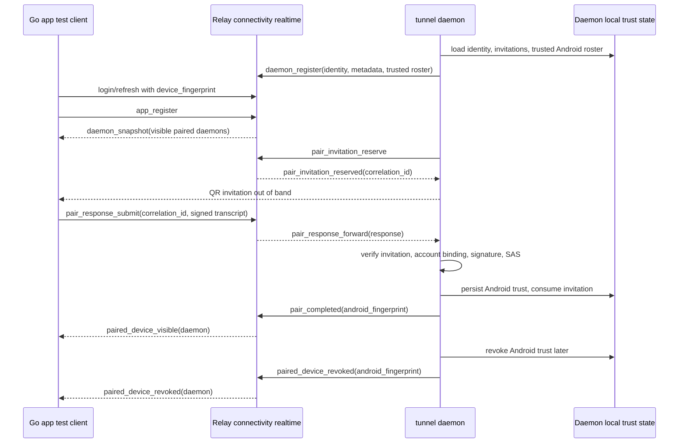

# feat: Implement connectivity auth and pairing foundation

## Summary

Implement Step 2 of the connectivity program: bind app sessions to device fingerprints, expose the temporary free/pro policy surface, persist daemon identity and trusted Android state locally, carry Relay-assisted pairing messages, and rebuild live paired-daemon visibility after reconnects. This builds on the merged Step 1 QUIC primitives from PR #94 and deliberately stops before session transport, terminal preview, attach, fallback tunnel, direct UDP, and Android production code.

---

## Problem Frame

The origin requirements require mobile-to-computer terminal traffic to move toward end-to-end encrypted direct or encrypted-fallback paths while Relay remains a control plane (see origin: `docs/brainstorms/2026-04-23-direct-attach-control-plane-requirements.md`). Step 1 proved Go-side transport primitives; Step 2 establishes the account/device trust layer that later transport steps need before they can expose any session traffic.

---

## Assumptions

*This plan was authored without synchronous user confirmation. The items below are agent inferences that fill gaps in the input and should be reviewed before implementation proceeds.*

- Preserve the repository's existing opaque app-session token model instead of converting app auth to JWT in Step 2. The required `device_fingerprint` binding can be enforced server-side on the app session record, avoids a risky auth-token format migration, and requires updating connectivity docs that currently use JWT wording.
- Existing CLI login clients may keep omitting `device_fingerprint`; connectivity app realtime and pairing APIs require a non-empty fingerprint-bound app session.
- Step 2 can introduce new connectivity realtime WebSocket routes in parallel with the existing `/device/ws` launch daemon route, so pairing and visibility do not overload legacy launch semantics.
- The Step 2 test client remains Go-only. Real Android `quiche`, Android Keystore storage, and production Android UI remain later gates.

---

## Requirements

- R1. Android app login can bind an app session to a client-supplied `device_fingerprint`; refresh rejects mismatches for fingerprint-bound sessions.
- R2. Relay exposes the current temporary account policy tier as `free` or `pro`, and local-only operator tooling can upgrade or downgrade a user without a payment system.
- R3. The daemon persists a long-term Ed25519 identity, invitation state, and trusted Android roster locally with restrictive file permissions.
- R4. `tunnel daemon pair` creates a short-lived one-time invitation, Relay transports the Android response, the daemon verifies the signed transcript locally, and SAS confirmation gates trust persistence.
- R5. Relay live visibility is derived from daemon-reported paired Android fingerprints and current daemon presence; Relay restart or daemon reconnect rebuilds visibility from daemon-local trust.
- R6. `tunnel daemon devices` and `tunnel daemon revoke <device>` manage the daemon-local trusted Android roster, and revocation removes Relay visibility and active trust state.
- R7. Step 2 must not carry terminal snapshot bytes, live bytes, structured input, fallback QUIC packets, STUN hints, or session preview data through the new connectivity surfaces.
- R8. Public API, architecture, daemon, connectivity protocol, schema snapshot, and Step 2 handoff docs stay aligned with any auth, schema, daemon-state, pairing, or visibility behavior changes.

**Origin actors:** A1 Mobile client, A2 Tunnel session owner on the computer, A3 Relay server

**Origin flows:** F1 Direct attach succeeds, F2 Direct attach fails and fallback takes over, F3 Relay-only control-plane operation

**Origin acceptance examples:** AE1 direct attach semantics over trusted path, AE2 encrypted fallback where Relay sees only encrypted payload frames, AE3 control/data separation preferred over Relay-only attach optimization

---

## Scope Boundaries

- No session transport, preview, interactive attach, local broker, fallback tunnel, direct UDP, STUN, or terminal data handling in this step.
- No payment, purchase, billing provider, plan-pricing, or upgrade flow. The tier is an operator-managed placeholder only.
- No daemon-side subscription enforcement. The daemon remains unaware of `free` versus `pro`.
- No durable Relay trust database for paired devices. Relay keeps only live derived visibility state rebuilt from daemon-local trust.
- No production Android repository changes, Android Keystore implementation, JNI packaging, emulator proof, or physical-device proof.
- No proof-of-possession app-session registration in Step 2. That remains a phase-2 hardening path if account-token theft becomes a practical abuse case.
- No automatic production database migration in Docker Compose. Existing databases still require operator-run SQL before deploying code that depends on new columns.

### Deferred to Follow-Up Work

- Step 3: daemon local broker and `tunnel run` registration.
- Step 4: fallback-only QUIC session transport and opaque Relay packet tunnel.
- Step 5: direct UDP/STUN path.
- Step 6: production Android companion integration and subscription UX.
- Step 7: operational hardening, observability, and broader rollout notes.
- Future auth hardening: `/auth/register-device` proof-of-possession flow.
- Future secret hardening: OS keyring storage for daemon identity.

---

## Context & Research

### Relevant Code and Patterns

- `internal/connectivity/identity/identity.go` already generates Ed25519 self-signed certificates and verifies pinned SPKI bytes; daemon identity persistence should reuse this package rather than creating a second key model.
- `internal/connectivity/pairing/sas.go` already implements the documented 6-digit SAS golden-vector algorithm from Step 1; Step 2 should extend the package with invitation and response transcript helpers.
- `internal/relay/auth/app_service.go`, `internal/relay/auth/types.go`, `internal/relay/auth/repository.go`, `internal/relay/store/postgres/auth_repository.go`, and `internal/relay/handler/api/auth.go` are the app-session path that must carry `device_fingerprint`.
- `deploy/postgres/latest.sql` is the full fresh-database snapshot, while `schema/` still supports legacy/local explicit migrations through `cmd/migrate`; schema work should update both.
- `internal/relay/operator/service.go`, `internal/relay/operator/repository.go`, `internal/relay/handler/api/operator.go`, `internal/relay/handler/types/operator.go`, and `cmd/relay/operator_client.go` provide the local-only operator route and CLI pattern to extend for subscription tier changes.
- `internal/relay/device/registry.go` is the closest live in-memory registry pattern: it tracks online devices, owner identity, pending activation, disconnect cleanup, and request completion without becoming durable state.
- `internal/relay/handler/new.go` wires REST and WebSocket surfaces; new connectivity routes should be registered in parallel with legacy `/device/ws` and app routes.
- `internal/tunnel/daemon/paths.go`, `recipe.go`, `runtime.go`, `control.go`, and `connector.go` own daemon local state, control socket, status, and Relay connection loops.
- `cmd/tunnel/cmd.go`, `cmd/tunnel/main.go`, `cmd/tunnel/args.go`, and `cmd/tunnel/main_test.go` define and test daemon subcommands.
- `docs/connectivity/protocol/pairing.md`, `docs/connectivity/protocol/relay.md`, `docs/connectivity/contract.md`, `docs/connectivity/ux/subscription.md`, and `docs/connectivity/reference/error-codes.md` are the Step 2 behavior anchors.

### Institutional Learnings

- No `docs/solutions/` entries exist in this repository.

### External References

- Go `crypto/ed25519` supports standard Ed25519 signing/verification and documents plain Ed25519 versus Ed25519ph behavior: https://pkg.go.dev/crypto/ed25519
- Go `crypto/x509.CreateCertificate` supports `ed25519.PublicKey` and `crypto.Signer` inputs, matching the Step 1 identity package: https://pkg.go.dev/crypto/x509
- OWASP Session Management guidance supports high-entropy opaque identifiers whose meaning lives server-side, which fits preserving the current opaque app-session token model: https://cheatsheetseries.owasp.org/cheatsheets/Session_Management_Cheat_Sheet.html
- OWASP Authentication guidance treats device fingerprints as risk/context signals, not proof of possession by themselves, matching Step 2's accepted phase-1 tradeoff: https://cheatsheetseries.owasp.org/cheatsheets/Authentication_Cheat_Sheet.html

---

## Key Technical Decisions

- Preserve opaque app-session tokens and add server-side fingerprint binding: this keeps existing CLI and app auth stable, aligns with the current repository contract, and still satisfies the Step 2 need for account plus Android-installation identity.
- Make `device_fingerprint` optional for legacy auth clients but mandatory for connectivity routes: existing `tunnel auth login` can keep working, while app-side pairing and visibility cannot proceed without a bound Android fingerprint.
- Store temporary subscription tier on the account/user record, defaulting to `free`: the tier is account-scoped, small, operator-managed, and does not warrant a payment-domain table before payment integration exists. Expose it through `GET /api/account/policy` and mutate it through local-only operator route `POST /operator/users/tier` plus a `relay user tier <username> <free|pro>` CLI command unless implementation discovers a naming conflict.
- Add explicit operator tier mutation with audit: invite/user maintenance already uses local-only operator routes plus audit records; tier changes should follow that surface and record old/new tier metadata.
- Keep daemon trust local and Relay visibility derived: the daemon remains the trust root, and Relay only has enough live state to show the paired Android device which daemons are online.
- Introduce connectivity realtime routes separate from legacy launch `/device/ws`: use an app-authenticated `GET /api/connectivity/app/ws` route and an agent-token-authenticated `GET /connectivity/daemon/ws` route unless implementation discovers a router-level conflict. Pairing, daemon visibility, and future rendezvous/fallback events have a different lifecycle from current remote launch requests.
- Make pairing invitation creation Relay-assisted: the daemon should reserve a correlation ID and use the Relay-authenticated account context before rendering the invitation, so the signed payload binds the same account that Relay will later use for pairing response transport.
- Register daemon identity with both existing `device_id` and new key fingerprint: existing device IDs remain useful UI/routing handles, while trust and later QUIC pinning rely on the Ed25519 public-key fingerprint.
- Persist consumed invitations until expiry: this prevents reuse-after-restart and replay races without making Relay durable pairing state.
- Treat revocation as daemon-authoritative: the local roster update happens first; Relay visibility removal is best-effort live state and is corrected by the next daemon trusted-roster sync.
- Update connectivity docs to remove or qualify JWT-specific wording: Step 2 should document the implemented opaque-session binding clearly instead of leaving a mismatch between docs and code.

---

## Open Questions

### Resolved During Planning

- Step 1 prerequisite: resolved. Local git shows `ab87e95` / PR #94 merged into the current branch baseline, and `docs/connectivity/implementation/step-01-interop-spike.md` marks the Go interop spike complete with Android still explicitly unproven.
- JWT versus opaque app session: resolved for this plan as opaque session plus server-side fingerprint binding, because converting the auth token format would expand Step 2 beyond the trust/pairing foundation.
- Relay trust storage: resolved as live-only derived state, rebuilt from daemon-local trust on daemon reconnect.
- Subscription enforcement location: resolved as official-app-only; Relay exposes tier and daemon ignores tier.

### Deferred to Implementation

- Exact QR rendering dependency: implementation should isolate terminal QR rendering behind a small adapter and choose the dependency after license and output checks.
- Manual SQL artifact location: implementation should decide whether to document the production `ALTER TABLE` SQL in `docs/operation.md`, the Step 2 handoff, or both.
- Android display-name source for the Go test client: Step 2 only needs enough metadata to validate Relay visibility and pairing behavior.
- Tmux-free daemon pairing: current daemon startup fails if tmux is unavailable. Step 2 may keep that existing prerequisite; if implementation finds pairing must work on tmuxless hosts, defer the connectivity-core versus launch-health split to Step 3 rather than hiding it inside pairing.

---

## High-Level Technical Design

> *This illustrates the intended approach and is directional guidance for review, not implementation specification. The implementing agent should treat it as context, not code to reproduce.*

Visibility after Relay restart follows the same first two steps: daemon reconnect loads local trust, sends the trusted roster, and Relay recreates app-visible daemon state when matching apps are online.

---

## Implementation Units

- U1. **Fingerprint-bound app sessions and temporary policy tier**

**Goal:** Extend app auth and account persistence so Android can bind a session to a device fingerprint and fetch the temporary `free`/`pro` policy tier.

**Requirements:** R1, R2, R8; supports origin R8, R10, R14

**Dependencies:** None

**Files:**
- Create: `schema/0003_connectivity_auth_pairing.sql`
- Modify: `deploy/postgres/latest.sql`
- Modify: `internal/relay/auth/types.go`
- Modify: `internal/relay/auth/repository.go`
- Modify: `internal/relay/auth/app_service.go`
- Modify: `internal/relay/store/postgres/store.go`
- Modify: `internal/relay/store/postgres/auth_repository.go`
- Modify: `internal/relay/store/postgres/store_test.go`
- Modify: `internal/relay/handler/types/auth.go`
- Modify: `internal/relay/handler/types/operator.go`
- Modify: `internal/relay/handler/api/auth.go`
- Modify: `internal/relay/handler/api/operator.go`
- Modify: `internal/relay/handler/api/errors.go`
- Modify: `internal/relay/handler/rest_api_test.go`
- Modify: `internal/relay/handler/test_helpers_test.go`
- Modify: `internal/relay/operator/service.go`
- Modify: `internal/relay/operator/repository.go`
- Modify: `internal/relay/store/postgres/operator_repository.go`
- Modify: `cmd/relay/command.go`
- Modify: `cmd/relay/user_cmd.go`
- Modify: `cmd/relay/operator_client.go`
- Test: `internal/relay/operator/service_test.go`
- Test: `cmd/relay/command_test.go`
- Test: `cmd/relay/user_cmd_test.go`
- Test: `cmd/relay/operator_client_test.go`
- Modify: `internal/e2e/db_assertions.go`
- Test: `internal/relay/auth/app_service_test.go`
- Test: `internal/relay/store/postgres/store_test.go`
- Test: `internal/relay/handler/rest_api_test.go`
- Test: `internal/e2e/local_regression_test.go`

**Approach:**
- Add `device_fingerprint` to app sessions and `subscription_tier` to users, with tier validation limited to `free` and `pro`.
- Keep app-session access and refresh tokens opaque. Store all binding semantics server-side on `AppSession`.
- Validate Android fingerprints as SHA-256 public-key fingerprints in hex form for connectivity-capable sessions. Preserve empty fingerprint for legacy CLI clients.
- Add refresh request handling that checks the supplied fingerprint against the stored session fingerprint when the session is fingerprint-bound; mismatches surface as an account/session mismatch rather than silently rotating tokens.
- Add `GET /api/account/policy` returning the current tier. Do not send subscription state to daemons or store chosen session rows.
- Add local-only operator service/repository support for tier updates, including audit metadata with previous and new tier.
- Add `POST /operator/users/tier` and `relay user tier <username> <free|pro>` following the existing operator client style.

**Execution note:** Implement the auth-service tests first because this unit changes public app auth behavior and persistent schema.

**Patterns to follow:**
- App-session lifecycle in `internal/relay/auth/app_service.go`.
- PostgreSQL query helpers in `internal/relay/store/postgres/store.go`.
- Existing API envelope and auth tests in `internal/relay/handler/rest_api_test.go`.
- Operator local-only route/audit pattern in `internal/relay/operator/service.go` and `internal/relay/store/postgres/operator_repository.go`.

**Test scenarios:**
- Happy path: login with a valid `device_fingerprint` creates an app session whose authenticated context carries the same fingerprint.
- Happy path: refresh with the same fingerprint rotates both tokens and preserves the fingerprint binding.
- Happy path: a legacy login without `device_fingerprint` still succeeds for existing CLI auth behavior and can refresh without a fingerprint.
- Happy path: authenticated policy fetch returns `free` by default for a new user.
- Happy path: operator tier update changes the user from `free` to `pro`, and the policy endpoint reflects `pro` on the next authenticated request.
- Edge case: invalid fingerprint length, non-hex input, or whitespace-only fingerprint is rejected for fingerprint-bound login.
- Edge case: tier update rejects unknown tier values without changing the stored tier.
- Error path: refresh with a different fingerprint for a fingerprint-bound session returns the documented mismatch error and does not rotate stored token digests.
- Error path: revoked, expired, or absolute-expired sessions still fail before policy or connectivity use.
- Integration: password change revokes all app sessions regardless of fingerprint, and app-side attaches continue to close with existing `password_changed` semantics.
- Integration: legacy e2e auth and agent-token creation flows remain compatible after the schema change.

**Verification:**
- App auth persists and enforces device fingerprint binding without breaking current CLI auth.
- Relay exposes a minimal authenticated tier response and local-only operator tier mutation.
- Fresh schema and legacy/local migrations both create the new durable columns.

---

- U2. **Daemon identity, invitations, and trusted Android state**

**Goal:** Give the daemon a durable Ed25519 identity and local state stores for invitations and trusted Android devices.

**Requirements:** R3, R4, R5, R6; supports origin R8, R9

**Dependencies:** U1 for account/fingerprint model alignment

**Files:**
- Create: `internal/tunnel/daemon/identity_store.go`
- Create: `internal/tunnel/daemon/pairing_state.go`
- Modify: `internal/tunnel/daemon/paths.go`
- Modify: `internal/tunnel/daemon/recipe.go`
- Modify: `internal/tunnel/daemon/runtime.go`
- Modify: `internal/tunnel/daemon/control.go`
- Test: `internal/tunnel/daemon/identity_store_test.go`
- Test: `internal/tunnel/daemon/pairing_state_test.go`
- Test: `internal/tunnel/daemon/paths_test.go`
- Test: `internal/tunnel/daemon/runtime_test.go`
- Test: `internal/tunnel/daemon/control_test.go`

**Approach:**
- Add a new daemon identity file separate from the existing `device.json`. `device.json` remains the legacy routing/display identity; the new identity stores the Ed25519 key material and exposes a public-key fingerprint for trust and future QUIC pinning.
- Store identity, trusted Android roster, and invitation records with mode `0600`; directories may retain existing mode conventions.
- Persist invitation records with `invitation_id`, nonce, `correlation_id`, expiry, and consumed state. Consumed records remain until expiry and are swept afterward.
- Store trusted Android entries with fingerprint, public key, display name, paired timestamp, account binding, and trust status.
- Make daemon runtime load identity/trust state before registering with connectivity realtime, but do not require terminal transport or local broker code in this step.

**Execution note:** Characterize current daemon state-file behavior before changing shared path/runtime helpers.

**Patterns to follow:**
- Existing file-backed daemon identity behavior in `internal/tunnel/daemon/recipe.go`.
- JSON file I/O and mode assertions in daemon tests.
- Step 1 identity helpers in `internal/connectivity/identity/identity.go`.

**Test scenarios:**
- Happy path: first daemon startup creates a new identity file, returns a stable fingerprint, and reuses the same identity on later loads.
- Happy path: trusted Android roster persists across daemon restart and preserves paired metadata.
- Happy path: invitation creation persists a non-consumed record with the configured 5-minute expiry.
- Edge case: malformed identity file fails closed and does not silently generate a replacement identity.
- Edge case: stale expired invitations are swept while consumed-but-unexpired invitations remain until expiry.
- Error path: file permission failure on identity or trust store load prevents pairing-capable daemon startup with an actionable error.
- Error path: invitation lookup rejects missing, expired, or consumed invitation IDs.
- Integration: existing `device_id` status behavior remains stable while the new daemon fingerprint is available for connectivity registration.

**Verification:**
- Daemon trust state is durable locally, restricted on disk, and independent of Relay persistence.
- Existing launch daemon state remains compatible with the new identity store.

---

- U3. **Pairing invitation, transcript, SAS, and daemon CLI controls**

**Goal:** Implement the local pairing workflow that mints invitations, verifies Android responses, requires SAS confirmation, and exposes operator-facing daemon commands.

**Requirements:** R3, R4, R6, R8; covers AE1 trust bootstrap precondition

**Dependencies:** U2

**Files:**
- Create: `internal/connectivity/pairing/invitation.go`
- Create: `internal/connectivity/pairing/transcript.go`
- Modify: `internal/connectivity/pairing/sas.go`
- Modify: `cmd/tunnel/cmd.go`
- Modify: `cmd/tunnel/main.go`
- Modify: `cmd/tunnel/args.go`
- Modify: `cmd/tunnel/main_test.go`
- Modify: `internal/tunnel/daemon/control.go`
- Modify: `internal/tunnel/daemon/runtime.go`
- Test: `internal/connectivity/pairing/invitation_test.go`
- Test: `internal/connectivity/pairing/transcript_test.go`
- Test: `internal/tunnel/daemon/control_test.go`
- Test: `cmd/tunnel/main_test.go`

**Approach:**
- Extend the Step 1 pairing package with signed invitation and signed Android response transcript helpers. Keep canonical transcript construction centralized so daemon, Go test client, and future Android code cannot drift.
- Add daemon control actions for pairing invitation creation, SAS confirmation/abort, trusted device listing, and revocation. CLI commands should call the local daemon control socket rather than duplicating trust-store writes in `cmd/tunnel`.
- Add `tunnel daemon pair`, `tunnel daemon devices`, and `tunnel daemon revoke <device>` to the Cobra command tree and help text.
- `tunnel daemon pair` should require a reachable local daemon for this step. If the daemon is not running, surface the existing start guidance rather than adding auto-start behavior before Step 3.
- Render a machine-readable invitation payload and terminal QR output only after the daemon has reserved a Relay correlation ID and learned the Relay-authenticated account context. If Relay is unreachable, fail with the documented pairing relay error rather than minting an offline invitation that cannot complete.
- Keep QR rendering behind an adapter so tests can validate the payload without depending on terminal art.
- SAS confirmation remains human-mediated. The daemon stores trust only after local confirmation succeeds.

**Execution note:** Add transcript and replay tests before wiring CLI prompts, because replay and account substitution are the security-sensitive behavior here.

**Patterns to follow:**
- Existing daemon command/help style in `cmd/tunnel/cmd.go` and `cmd/tunnel/args.go`.
- Daemon control socket request/response shape in `internal/tunnel/daemon/control.go`.
- SAS golden-vector style in `internal/connectivity/pairing/sas_test.go`.

**Test scenarios:**
- Happy path: invitation payload verifies against the daemon public key and includes account, daemon identity, correlation ID, nonce, expiry, Relay base URL, and display metadata.
- Happy path: Android response signature over invitation ID, nonce, Android public key, and app-session account ID verifies locally.
- Happy path: matching SAS confirmation stores Android trust and marks the invitation consumed.
- Edge case: invitation payload with unknown version or unsupported fields is rejected or ignored according to forward-compatibility rules.
- Edge case: invitation expiry boundary rejects responses at or after `expires_at`.
- Error path: invalid daemon signature, invalid Android signature, account mismatch, reused invitation, or SAS mismatch all fail closed and do not persist trust.
- Error path: Relay unavailable during invitation reservation prevents invitation rendering and surfaces pairing recovery guidance.
- Error path: `tunnel daemon pair` reports a clear not-running error when the daemon control socket is unavailable.
- Integration: CLI `devices` lists trusted devices from daemon state and hides consumed/expired invitation internals.

**Verification:**
- The daemon can produce a pairable invitation and persist trust only through the documented signed-transcript and SAS path.
- CLI command behavior is test-covered without relying on visual QR output in assertions.

---

- U4. **Relay connectivity realtime pairing transport and live visibility**

**Goal:** Add Relay-side realtime app/daemon sockets for pairing message transport and paired-daemon visibility without carrying session data.

**Requirements:** R4, R5, R7, R8; supports origin F3 and R6-R11, R14

**Dependencies:** U1, U2, U3

**Files:**
- Create: `internal/protocol/connectivity.go`
- Create: `internal/protocol/connectivity_test.go`
- Create: `internal/relay/connectivity/registry.go`
- Create: `internal/relay/connectivity/registry_test.go`
- Create: `internal/relay/handler/connectivity/app_ws.go`
- Create: `internal/relay/handler/connectivity/daemon_ws.go`
- Create: `internal/relay/handler/connectivity/ws_test.go`
- Create: `internal/tunnel/daemon/connectivity_connector.go`
- Create: `internal/tunnel/daemon/connectivity_connector_test.go`
- Modify: `internal/relay/handler/new.go`
- Modify: `internal/tunnel/daemon/connector.go`
- Modify: `internal/tunnel/daemon/connector_test.go`
- Test: `internal/relay/connectivity/registry_test.go`
- Test: `internal/relay/handler/connectivity/ws_test.go`

**Approach:**
- Define shared connectivity realtime envelopes and event payloads in `internal/protocol` so daemon, Relay, and tests share one contract.
- Add app realtime authentication through existing app auth middleware, but require a non-empty session `device_fingerprint` before accepting `app_register`.
- Add daemon realtime authentication through existing agent-token auth. Daemon registration includes account owner, existing `device_id`, daemon public-key fingerprint, daemon public key, display metadata, platform metadata, tunnel version, protocol version, and the daemon-local trusted Android roster.
- Wire app realtime at `GET /api/connectivity/app/ws` and daemon realtime at `GET /connectivity/daemon/ws`, then document those names in `docs/api.md` and `docs/connectivity/protocol/relay.md`.
- Add a daemon connectivity connector alongside the existing launch `/device/ws` connector. Keep the existing connector responsible for mobile launch requests until later steps deliberately consolidate or replace it.
- Keep Relay registry live-only. It tracks online daemons, app peers, reserved pairing correlations, and derived visibility grants keyed by authenticated account plus Android fingerprint.
- Forward `pair_response_submit` only to the daemon addressed by the reserved correlation and same account. Relay must not rewrite the Android-signed account field.
- Handle `pair_completed` and daemon trusted-roster sync as visibility grants. If an app peer for the matching fingerprint is online, Relay sends `paired_device_visible` / daemon upsert events.
- On daemon disconnect, apps receive daemon removal for that live daemon. On daemon reconnect, trusted-roster sync repopulates visibility.
- Unknown realtime event types should be ignored or returned as structured errors according to the connectivity error-code document, without closing healthy sockets unnecessarily.

**Execution note:** Build registry tests before WebSocket tests; most correctness here is state transition and ownership isolation.

**Patterns to follow:**
- Live registry ownership and disconnect cleanup in `internal/relay/device/registry.go`.
- WebSocket ping/read-limit patterns in `internal/relay/handler/device/ws.go`.
- App auth middleware use in `internal/relay/handler/new.go`.
- JSON protocol tests in `internal/protocol/device_test.go`.

**Test scenarios:**
- Happy path: daemon registers with a trusted roster, matching app registers, and app receives a snapshot containing only daemons paired to its fingerprint and account.
- Happy path: app submits a pairing response with a reserved correlation ID, and Relay forwards it only to the owning daemon peer.
- Happy path: daemon sends `pair_completed`; Relay emits visibility to the matching app without persisting trust durably.
- Edge case: app registers before daemon; snapshot is empty, then daemon registration sends an upsert when roster matches.
- Edge case: daemon reconnect with same identity replaces old peer and rebuilds visibility from daemon roster.
- Error path: app session without `device_fingerprint` is rejected from connectivity realtime even though ordinary app APIs may still work.
- Error path: cross-account correlation reuse, unknown daemon, stale correlation, or mismatched device fingerprint does not forward the pairing response.
- Error path: malformed envelope, unsupported protocol version, or over-limit payload returns a structured Relay error and leaves unrelated peers alive.
- Integration: Relay restart is simulated by a fresh registry; daemon re-registering its trusted roster restores app-visible daemon state.

**Verification:**
- Relay can transport pairing messages and live paired-daemon visibility while remaining content-opaque and live-only.
- No session list, preview, terminal bytes, input, rendezvous hints, or tunnel packets are introduced on these routes.

---

- U5. **Trusted device roster management and revocation propagation**

**Goal:** Make daemon-local trusted Android management visible and revocable, with Relay live state corrected immediately or on next reconnect.

**Requirements:** R5, R6, R7, R8

**Dependencies:** U2, U3, U4

**Files:**
- Modify: `internal/tunnel/daemon/pairing_state.go`
- Modify: `internal/tunnel/daemon/control.go`
- Modify: `internal/tunnel/daemon/connectivity_connector.go`
- Modify: `cmd/tunnel/main.go`
- Modify: `cmd/tunnel/main_test.go`
- Modify: `internal/relay/connectivity/registry.go`
- Modify: `internal/relay/handler/connectivity/daemon_ws.go`
- Test: `internal/tunnel/daemon/pairing_state_test.go`
- Test: `internal/tunnel/daemon/control_test.go`
- Test: `internal/relay/connectivity/registry_test.go`
- Test: `internal/relay/handler/connectivity/ws_test.go`

**Approach:**
- `tunnel daemon devices` reads the trusted roster through the local control socket and renders stable identifiers, display names, paired timestamps, and trust state.
- `tunnel daemon revoke <device>` removes or marks trust locally first, then asks the daemon's Relay connector to send `paired_device_revoked` for live app peers.
- If Relay is unavailable during revoke, the local removal still succeeds; the next daemon register/trusted-roster sync excludes the revoked Android fingerprint so Relay cannot rebuild visibility for it.
- Add daemon-side hooks where future QUIC connections and interactive streams can be closed when transport exists, but do not invent Step 4 transport behavior in this step.
- Relay removes derived visibility grants and notifies online app peers when it receives a revoke event from the owning daemon.

**Patterns to follow:**
- Agent-token revocation disconnect cleanup in `internal/relay/handler/api/agent_tokens.go` and device registry disconnect behavior.
- Local daemon status/control request pattern in `internal/tunnel/daemon/control.go`.

**Test scenarios:**
- Happy path: list returns paired Android devices sorted predictably with display metadata and fingerprints.
- Happy path: revoke removes local trust, sends Relay revocation, and online app peer receives `paired_device_revoked`.
- Happy path: revoke while Relay is offline still updates local trust, and later daemon reconnect does not restore visibility for the revoked fingerprint.
- Edge case: revoking an unknown device returns a clear not-found error and does not alter other trust entries.
- Edge case: repeated revoke of the same device is idempotent or returns a stable not-found response, whichever implementation chooses and documents.
- Error path: cross-account daemon cannot revoke another account's live visibility grant.
- Integration: active derived visibility disappears from app snapshot after revoke and remains absent after registry restart plus daemon reconnect.

**Verification:**
- Revocation removes active visibility and future trust without requiring Relay durability.
- The daemon remains the source of truth for trusted Android devices.

---

- U6. **Go pairing test client and end-to-end Step 2 evidence**

**Goal:** Provide an automated Go-only test client that pairs with a daemon through Relay and proves the Step 2 acceptance checklist.

**Requirements:** R1-R8; covers AE1 trust bootstrap and AE3 control-plane separation

**Dependencies:** U1, U2, U3, U4, U5

**Files:**
- Create: `internal/connectivity/pairtest/client.go`
- Create: `internal/connectivity/pairtest/client_test.go`
- Create: `internal/e2e/connectivity_pairing_test.go`
- Modify: `internal/e2e/client.go`
- Modify: `internal/e2e/harness.go`
- Test: `internal/e2e/connectivity_pairing_test.go`

**Approach:**
- Add a Go pairing client that models the Android side enough to generate an Ed25519 device key, compute the device fingerprint, authenticate with Relay, open app realtime, scan/parse invitation payloads, sign the Android transcript, compare SAS in test code, and persist daemon trust in memory.
- Use the existing local e2e harness style to start Relay with PostgreSQL where practical, then connect a daemon-side test peer and the app-side test client over WebSockets.
- Keep the test client out of production Android claims. Its job is Step 2 Relay/daemon/account evidence only.
- Assert absence of terminal data by verifying only pairing, presence, policy, and roster events are observed during the flow.

**Execution note:** Treat this as integration coverage, not a substitute for smaller unit tests in U1-U5.

**Patterns to follow:**
- Step 1 mobile simulator shape in `internal/connectivity/interop/mobile.go`.
- Existing local e2e harness in `internal/e2e`.
- Handler-level WebSocket testing style in `internal/relay/handler/ws_api_test.go`.

**Test scenarios:**
- Covers AE1. Happy path: Go app test client logs in with fingerprint, daemon creates invitation, app submits response through Relay, daemon confirms SAS, daemon persists trust, and app receives visible daemon event.
- Happy path: app fetches policy and observes `free`, then observes `pro` after operator tier update.
- Happy path: Relay registry restart plus daemon reconnect rebuilds visibility from daemon-local trusted roster.
- Error path: app logged into the wrong account cannot complete pairing and daemon does not persist trust.
- Error path: reused invitation fails and cannot create duplicate trust.
- Integration: revoking a paired device removes app visibility immediately and keeps it absent after daemon reconnect.
- Integration: the e2e flow observes no session transport, preview, input, or terminal-byte event families in Step 2 realtime traffic.

**Verification:**
- The Step 2 acceptance checklist is demonstrably covered by automated Go tests.
- The handoff can truthfully state that Android production behavior remains unvalidated.

---

- U7. **Documentation, schema operation notes, and Step 2 handoff**

**Goal:** Keep public docs, architecture docs, connectivity contracts, deployment notes, and the Step 2 handoff aligned with implemented behavior.

**Requirements:** R8

**Dependencies:** U1-U6

**Files:**
- Modify: `docs/api.md`
- Modify: `docs/architecture.md`
- Modify: `docs/daemon.md`
- Modify: `docs/connectivity/contract.md`
- Modify: `docs/connectivity/protocol/relay.md`
- Modify: `docs/connectivity/protocol/pairing.md`
- Modify: `docs/connectivity/reference/error-codes.md`
- Modify: `docs/connectivity/implementation/step-02-auth-pairing.md`
- Modify: `docs/operation.md`
- Modify: `docs/docker-operation.md`
- Modify: `README.md`
- Modify: `CLAUDE.md`
- Modify: `AGENTS.md`

**Approach:**
- Update `docs/api.md` for app login/refresh request changes, policy tier endpoint, connectivity realtime endpoints, operator tier mutation, and error reasons.
- Update `docs/architecture.md` to describe fingerprint-bound app sessions, live-only pairing visibility, and the new connectivity realtime boundary.
- Update `docs/daemon.md` with identity/trust/invitation files, `pair` / `devices` / `revoke`, and revocation behavior.
- Update connectivity docs to match the implemented opaque-session binding and any final realtime route names, while preserving the core pairing and Relay trust boundaries.
- Update deployment/operation docs with manual SQL for existing PostgreSQL databases and reiterate that Compose does not auto-migrate.
- Update `docs/connectivity/implementation/step-02-auth-pairing.md` from `not_started` to the accurate implemented/verified handoff state, including the explicit Android production gap.

**Patterns to follow:**
- Documentation expectations in `AGENTS.md`.
- Step 1 handoff format in `docs/connectivity/implementation/step-01-interop-spike.md`.
- Existing schema-change operation language in `docs/docker-operation.md` and `docs/operation.md`.

**Test scenarios:**
- Test expectation: none -- documentation-only unit, but implementation should cross-check documented endpoint names, request fields, error reasons, and manual SQL against tests and code.

**Verification:**
- Docs no longer claim JWT semantics if the code preserves opaque app sessions.
- Step 2 handoff accurately lists completed checks, verification performed, known gaps, and follow-up for Step 3/Step 4.
- Manual schema operation notes are present wherever operators are told how to handle existing PostgreSQL databases.

---

## System-Wide Impact

- **Interaction graph:** app auth, operator maintenance, PostgreSQL schema, connectivity realtime handlers, daemon runtime, daemon control socket, and connectivity docs all change together. Existing legacy `/agent/ws`, `/device/ws`, `/api/sessions`, and attach routes should remain behaviorally unchanged.
- **Error propagation:** fingerprint validation, refresh mismatch, pairing verification failures, rate/ownership failures, and revoke not-found cases need stable Relay or daemon error reasons that map to `docs/connectivity/reference/error-codes.md`.
- **State lifecycle risks:** app-session fingerprint and subscription tier are durable Relay state; daemon identity, invitations, and trusted Android roster are durable daemon-local state; Relay pairing correlations and visibility grants are live-only and must be rebuilt from daemon state.
- **API surface parity:** app auth request/response docs, CLI help text, operator routes, and tests must all move together. Legacy CLI auth remains compatible through empty fingerprint support.
- **Integration coverage:** unit tests alone will not prove reconnect/rebuild behavior, so U6 adds a Go e2e pairing flow with Relay restart and daemon reconnect scenarios.
- **Unchanged invariants:** Relay must not retain terminal transcript history, derive terminal semantics, or become terminal-state authority. Daemon remains the trust root for pairing, and subscription tier does not affect transport keys or daemon trust.

---

## Risks & Dependencies

| Risk | Mitigation |
|------|------------|
| App auth changes break existing `tunnel auth login` or local e2e auth flows | Preserve empty-fingerprint legacy sessions and add regression coverage for existing CLI flows. |
| JWT wording in connectivity docs conflicts with opaque-token implementation | Make the plan-time correction explicit and update docs in U7 so implemented behavior is the source of truth. |
| Existing deployed PostgreSQL databases miss new columns | Update `deploy/postgres/latest.sql`, add a legacy/local migration, and document manual `ALTER TABLE` SQL before deployment. |
| Relay accidentally becomes a durable trust database | Keep paired visibility in an in-memory connectivity registry and rebuild it from daemon trusted-roster sync. |
| Pairing replay or reuse succeeds after daemon restart | Persist invitation consumed/expiry state locally and test consumed/unexpired replay rejection. |
| Account substitution through Relay during pairing | Keep Android-signed account ID inside the transcript and have daemon compare it to the invitation account. |
| Revocation lost while Relay is offline | Apply local trust removal first and rely on the next daemon registration roster to prevent visibility rebuild. |
| Daemon identity key leakage from local files | Use restrictive file modes, document OS-keyring deferral, and avoid logging private key material. |
| Pairing stays blocked on hosts where the existing daemon cannot start because tmux is unavailable | Keep this as an explicit Step 2 acceptance limitation or defer the daemon connectivity-core split to Step 3; do not silently mix local broker scope into Step 2. |
| Step 2 test client is mistaken for Android proof | Mark Go-only evidence clearly in the handoff and keep the Step 1 Android FIXME alive for later production Android validation. |

---

## Documentation / Operational Notes

- PostgreSQL schema changes must update both `deploy/postgres/latest.sql` and `schema/0003_connectivity_auth_pairing.sql`.
- Existing Docker Compose databases require manual operator SQL before deploying a Relay image that reads the new columns. Expected SQL includes adding `app_sessions.device_fingerprint`, adding `users.subscription_tier` defaulting to `free`, adding a tier check constraint, and adding any lookup indexes chosen during implementation.
- `docs/api.md` must document whether `device_fingerprint` is optional for legacy login but required for connectivity realtime.
- `docs/connectivity/implementation/step-02-auth-pairing.md` must remain the human handoff for what actually shipped and what Step 3 can rely on.
- If new QR-rendering dependencies are added, record dependency rationale in the Step 2 handoff.

---

## Sources & References

- **Origin document:** [docs/brainstorms/2026-04-23-direct-attach-control-plane-requirements.md](docs/brainstorms/2026-04-23-direct-attach-control-plane-requirements.md)
- **Step handoff:** [docs/connectivity/implementation/step-02-auth-pairing.md](docs/connectivity/implementation/step-02-auth-pairing.md)
- **Program plan:** [docs/plans/2026-04-28-001-feat-quic-connectivity-program-plan.md](docs/plans/2026-04-28-001-feat-quic-connectivity-program-plan.md)
- **Step 1 handoff:** [docs/connectivity/implementation/step-01-interop-spike.md](docs/connectivity/implementation/step-01-interop-spike.md)
- Related code: `internal/connectivity/identity/identity.go`
- Related code: `internal/connectivity/pairing/sas.go`
- Related code: `internal/relay/auth/app_service.go`
- Related code: `internal/relay/device/registry.go`
- Related code: `internal/tunnel/daemon/runtime.go`
- Related schema: `deploy/postgres/latest.sql`
- Related PR: #94 (`ab87e95 feat(connectivity): add QUIC interop spike`)
- External docs: https://pkg.go.dev/crypto/ed25519
- External docs: https://pkg.go.dev/crypto/x509
- External docs: https://cheatsheetseries.owasp.org/cheatsheets/Session_Management_Cheat_Sheet.html
- External docs: https://cheatsheetseries.owasp.org/cheatsheets/Authentication_Cheat_Sheet.html
