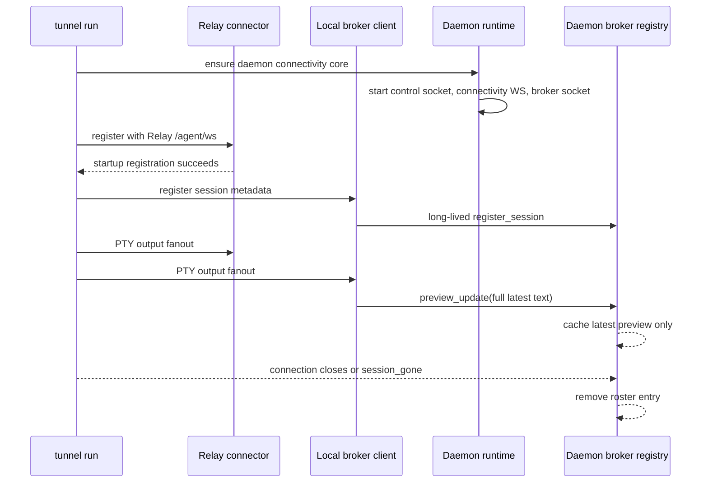

# feat: Implement connectivity local broker for tunnel run sessions

## Summary

Implement Step 3 of the connectivity program by splitting daemon connectivity startup from tmux launch health, adding a daemon-owned local broker socket, registering each `tunnel run` session with that broker, and pushing locally generated preview text into a daemon cache. This keeps `tunnel run` as the PTY and terminal-mirror owner while preparing Step 4's daemon-to-mobile transport to consume a daemon-local session roster.

---

## Problem Frame

The upstream requirements move Tunnel toward a path-agnostic attach model where Relay coordinates account and setup state while the computer remains the terminal authority (see origin: `docs/brainstorms/2026-04-23-direct-attach-control-plane-requirements.md`). Step 1 proved Go-side transport primitives, Step 2 established account/device trust and Relay-assisted pairing visibility, and Step 3 now needs the daemon to learn about local `tunnel run` sessions without becoming the PTY owner.

---

## Assumptions

*This plan was authored without synchronous user confirmation. The items below are agent inferences that fill gaps in the input and should be reviewed before implementation proceeds.*

- Step 1 and Step 2 are treated as complete based on `docs/connectivity/implementation/step-01-interop-spike.md`, `docs/connectivity/implementation/step-02-auth-pairing.md`, and the user's instruction.
- Broker registration should not introduce a new hard failure that prevents otherwise valid local terminal work; the existing strict Relay registration startup gate for `tunnel run` stays intact.
- Step 3 should implement the registration and preview subset of `docs/connectivity/protocol/local-broker.md`; interactive snapshot/live-byte forwarding remains Step 4 work.
- `tunnel daemon pair` stays JSON-only in Step 3. QR rendering is not part of the local broker plan.
- The initial local broker protocol can live inside this Go repository as daemon-owned JSON over a Unix domain socket; it is not a public Relay or Android protocol surface.
- The local broker trust boundary is the current OS user. Step 3 should protect against cross-user socket access, but it is not a same-UID malicious-process sandbox.

---

## Requirements

- R1. `tunnel run` should reach or auto-start the daemon connectivity core during startup so local sessions can become daemon-visible without an explicit user-run daemon step.
- R2. The daemon connectivity core must be able to start and serve control, pairing, connectivity realtime, and local broker responsibilities even when tmux is unavailable.
- R3. Missing tmux must degrade remote-launch health and keep remote launch failure reasons intact; it must not block local broker registration for local `tunnel run` sessions.
- R4. The daemon must expose a separate long-lived local session registration listener, distinct from the short-lived daemon control socket.
- R5. A live `tunnel run` process must register session metadata with the daemon, keep the broker connection open for session lifetime, reconnect after daemon restart, and disappear from the daemon roster when the connection closes.
- R6. The daemon must cache only the latest preview per session, with preview text generated by the local `tunnel run` process from local terminal state, never by Relay.
- R7. Existing `tunnel run` PTY ownership, local terminal behavior, Relay registration behavior, attach semantics, and local command launch flow must remain unchanged except for the added local broker side channel.
- R8. Documentation and Step 3 handoff docs must reflect the new daemon lifecycle split, local broker socket, preview authority, and explicit Step 4 boundary.

**Origin actors:** A1 Mobile client, A2 Tunnel session owner on the computer, A3 Relay server

**Origin flows:** F1 Direct attach succeeds, F2 Direct attach fails and fallback takes over, F3 Relay-only control-plane operation

**Origin acceptance examples:** AE1 direct attach semantics over trusted path, AE2 encrypted fallback where Relay sees only encrypted payload frames, AE3 control/data separation preferred over Relay-only attach optimization

---

## Scope Boundaries

- No Android production code, Android UI, emulator/device proof, or subscription UX implementation.
- No QUIC daemon transport, fallback Relay tunnel, STUN, direct UDP, rendezvous, or mobile session protocol implementation.
- No Relay session API migration and no changes to the existing `/api/sessions/:id/attach/ws` attach contract.
- No Relay-visible preview text, terminal plaintext, structured input, or broker state.
- No daemon-side subscription enforcement; the broker remains subscription-unaware.
- No durable session history, transcript replay, preview history, or daemon-owned terminal emulation history beyond latest-preview cache.
- No tmux workspace redesign beyond separating launch health from daemon connectivity core startup.
- No same-UID adversary hardening beyond normal local user account isolation.

### Deferred to Follow-Up Work

- Step 4: bridge daemon transport frames to the local broker for `session_index`, `preview_subscribe`, `interactive_request`, snapshots, live bytes, input, resize, and release.
- Step 4: expose the cached broker roster and preview cache over fallback-only QUIC transport to a simulated app.
- Step 6 or Android companion planning: decide whether QR rendering belongs in CLI pairing UX.
- Future hardening: cross-platform peer-credential checks beyond the Unix/macOS/Linux owner-boundary behavior available during this step.

---

## Context & Research

### Relevant Code and Patterns

- `cmd/tunnel/main.go` owns `runTunnelSession`, current strict Relay startup wait, hidden mobile launch metadata, daemon command handlers, and `runDaemonStart` / `runDaemonInternal`.
- `internal/tunnel/daemon/runtime.go` currently requires tmux before the daemon runtime starts, initializes status, launches the short-lived control server, `/device/ws` connector, and connectivity realtime connector.
- `internal/tunnel/daemon/control.go` is the existing short-lived Unix socket RPC pattern; the broker should use a separate listener because broker connections are long-lived.
- `internal/tunnel/daemon/paths.go` is the right place to add a dedicated broker socket path under the daemon runtime directory.
- `internal/tunnel/daemon/connector.go` already keeps remote launch tmux failures local and reports `LaunchHealthDegraded`; launch health should remain tied to tmux-backed remote launch, not connectivity-core readiness.
- `internal/tunnel/session/hub.go` provides output sink fanout, PTY input serialization, resize listeners, and input observer hooks.
- `internal/tunnel/session/terminal_mirror.go` already maintains a local xterm mirror and exposes `ViewportText`; preview generation should extend this local mirror capability instead of asking Relay to derive previews.
- `internal/tunnel/connector/connector.go` is the existing Relay attach adapter. The local broker should not weaken its strict startup registration, snapshot, live-byte, submit-anchor, or reconnect behavior.
- `docs/connectivity/protocol/local-broker.md`, `docs/connectivity/contract.md`, and `docs/connectivity/reference/sequence-flows.md` define the Step 3 target shape and the Step 4 boundary.

### Institutional Learnings

- No `docs/solutions/` entries exist in this repository.

### External References

- No external research was needed. The relevant behavior is governed by repository-local connectivity contracts and existing Go daemon/session patterns.

---

## Key Technical Decisions

- Split daemon connectivity readiness from tmux launch readiness: the daemon process should start without tmux, while `LaunchHealth` and remote-launch responses continue to report `tmux_not_found` when launch work needs tmux.
- Add a dedicated broker socket path: long-lived session connections should not reuse `SocketPath`, because `control.go` applies short deadlines and one-request-per-connection semantics.
- Treat broker registration as a local side channel for connectivity, not as a replacement for Relay registration: `tunnel run` still must satisfy the existing Relay startup wait before the PTY session begins.
- Make broker failure non-fatal to local terminal work after bounded ensure/register attempts: this preserves current local terminal behavior and lets `tunnel run` retry broker registration with backoff if the daemon restarts or is temporarily unavailable.
- Keep Step 3 broker scope to registration, roster liveness, and latest preview: interactive attach and input forwarding are transport-facing behavior and should land with Step 4.
- Generate preview in the `tunnel run` process: the process that owns the PTY and mirror derives a plain-text, bounded preview and pushes full replacements to the daemon.
- Cache latest preview only in daemon memory: no history, no transcript, no durable preview file, and no Relay involvement.
- Keep preview content out of status, doctor, and routine diagnostic output: daemon observability may report counts, health, and session IDs, but should not print cached preview text.
- Keep `tunnel daemon pair` JSON-only for Step 3: QR rendering does not advance local broker registration and would distract from the daemon lifecycle split.

---

## Open Questions

### Resolved During Planning

- Should Step 3 add terminal QR rendering for pairing? No. Step 2 left this as a follow-up question, but Step 3's active scope is local broker and daemon registration. JSON-only pairing remains acceptable for tests.
- Should missing tmux prevent daemon startup? No. It should prevent tmux-backed remote launches and degrade launch health, but connectivity core and local broker should still run.
- Should Relay learn previews in Step 3? No. Preview generation and latest-preview cache are local-only.
- Should Step 3 implement mobile interactive attach? No. It prepares the daemon-local session directory and preview source; Step 4 owns transport and interactive bridging.

### Deferred to Implementation

- Exact broker socket filename and cleanup details: choose the narrowest name in `Paths` that avoids collisions with existing runtime files.
- Exact preview throttle constants and character budget: choose small defaults during implementation and keep them documented in `docs/connectivity/protocol/local-broker.md`.
- Exact cross-platform peer credential enforcement: implement owner/path checks where supported, and document any unsupported OS behavior explicitly.
- Existing daemon running against a different Relay base URL or account: implementation should avoid leaking session metadata across a mismatched daemon context, with a non-fatal local broker skip or warning if a safe match cannot be established.

---

## Output Structure

    internal/
      tunnel/
        daemon/
          broker.go
          broker_test.go
          session_registration.go
          session_registration_test.go

The exact file split may change during implementation, but the plan expects daemon-owned broker state plus a reusable registration client/helper used by `tunnel run`.

---

## High-Level Technical Design

> *This illustrates the intended approach and is directional guidance for review, not implementation specification. The implementing agent should treat it as context, not code to reproduce.*

The key invariant is that Relay connector behavior and local terminal behavior remain authoritative for today's product, while the broker side channel quietly builds the daemon-local roster Step 4 will expose over end-to-end transport.

---

## Implementation Units

- U1. **Daemon connectivity core starts without tmux**

**Goal:** Separate daemon process readiness from tmux-backed remote-launch readiness so the local broker can run on machines where tmux is missing.

**Requirements:** R1, R2, R3, R7

**Dependencies:** None

**Files:**
- Modify: `internal/tunnel/daemon/runtime.go`
- Modify: `internal/tunnel/daemon/runtime_test.go`
- Modify: `internal/tunnel/daemon/connector.go`
- Modify: `internal/tunnel/daemon/connector_test.go`
- Modify: `internal/tunnel/daemon/doctor.go`
- Modify: `internal/tunnel/daemon/doctor_test.go`
- Modify: `cmd/tunnel/main.go`
- Modify: `cmd/tunnel/main_test.go`
- Test: `internal/tunnel/daemon/runtime_test.go`
- Test: `internal/tunnel/daemon/connector_test.go`
- Test: `internal/tunnel/daemon/doctor_test.go`
- Test: `cmd/tunnel/main_test.go`

**Approach:**
- Remove tmux as a prerequisite for daemon connectivity-core startup while preserving platform support checks and auth-token requirements.
- Initialize daemon status with `LaunchHealthDegraded` and `LastFailure: tmux_not_found` when tmux is absent, but continue starting local control, connectivity realtime, and broker infrastructure.
- Keep `launchHandler.Handle` and `Terminate` as the places where tmux-backed remote launch or termination fails with existing launch failure reasons.
- Make preserved tmux workspace session counting best-effort or conditional on tmux availability so missing tmux does not abort daemon startup.
- Adjust `tunnel daemon start` messaging and doctor/status rendering to distinguish "daemon running" from "remote launch degraded".

**Execution note:** Add characterization coverage around current tmux failure behavior before changing startup gating, then preserve remote-launch failure semantics.

**Patterns to follow:**
- Launch-health mutation in `internal/tunnel/daemon/connector.go`.
- Friendly daemon status and doctor rendering in `cmd/tunnel/main.go` and `internal/tunnel/daemon/doctor.go`.
- Existing daemon runtime status persistence in `internal/tunnel/daemon/runtime.go`.

**Test scenarios:**
- Happy path: daemon runtime starts with tmux available and reports `LaunchHealthHealthy`.
- Happy path: daemon runtime starts with tmux missing, answers status requests, and reports degraded launch health instead of returning `ErrTmuxNotFound`.
- Error path: remote launch with tmux missing still returns `tmux_not_found` and does not claim a session was accepted.
- Edge case: `StartBackground` on a tmuxless host starts the daemon and reports zero preserved workspace sessions rather than failing during workspace counting.
- Integration: `tunnel daemon doctor` marks daemon process/connectivity checks independently from tmux/workspace checks.

**Verification:**
- A tmuxless daemon can run its connectivity core and control socket.
- Existing tmux-backed launch behavior still fails closed with the documented reason when tmux is required.

---

- U2. **Daemon broker socket and local roster**

**Goal:** Add the daemon-owned long-lived broker listener and in-memory roster/cache that Step 4 can later query.

**Requirements:** R4, R5, R6, R8

**Dependencies:** U1

**Files:**
- Modify: `internal/tunnel/daemon/paths.go`
- Modify: `internal/tunnel/daemon/paths_test.go`
- Create: `internal/tunnel/daemon/broker.go`
- Create: `internal/tunnel/daemon/broker_test.go`
- Modify: `internal/tunnel/daemon/runtime.go`
- Modify: `internal/tunnel/daemon/runtime_test.go`
- Test: `internal/tunnel/daemon/paths_test.go`
- Test: `internal/tunnel/daemon/broker_test.go`
- Test: `internal/tunnel/daemon/runtime_test.go`

**Approach:**
- Add a dedicated broker Unix socket path under the daemon runtime directory and include it in stale-runtime cleanup.
- Implement a daemon broker registry keyed by `session_id`, storing full current session metadata, connection ownership, online state, and latest preview text.
- Accept one long-lived JSON-framed connection per local `tunnel run` session. The initial Step 3 frame set should include registration, full metadata refresh, preview update, and session gone.
- Treat duplicate `register_session` for the same `session_id` as replacement of the previous local connection, closing or superseding old state safely.
- Remove the session from the roster when its local connection closes, even if no `session_gone` frame arrives.
- Enforce the local user boundary with owner-only socket permissions and peer/path ownership checks where the platform supports them.
- Expose an internal snapshot API for later Step 4 transport code; avoid adding a public CLI session list that could be confused with `tunnel daemon sessions`.

**Patterns to follow:**
- Unix socket creation and permission handling in `internal/tunnel/daemon/control.go`.
- Live-only in-memory registry style in `internal/relay/connectivity/registry.go`.
- Full-replacement metadata preference in `docs/connectivity/protocol/local-broker.md`.

**Test scenarios:**
- Happy path: broker creates a separate owner-only socket path and accepts a local session registration.
- Happy path: broker roster snapshot contains registered `session_id`, label, command preview, cwd, git branch, started_at, updated_at, and online state.
- Edge case: duplicate registration for the same `session_id` replaces the previous connection and leaves exactly one roster entry.
- Edge case: unknown or out-of-order frames for an unregistered session are ignored and do not create roster entries.
- Error path: socket path exists as a non-socket file and broker startup fails closed.
- Error path: socket ownership or peer-credential mismatch is rejected where the platform exposes that information.
- Integration: when the long-lived connection closes unexpectedly, the roster entry disappears without requiring a clean `session_gone`.

**Verification:**
- The daemon has a live-only local roster with latest-preview slots and no Relay or durable session-history dependency.
- The broker listener lifecycle is separate from the existing control socket lifecycle.

---

- U3. **`tunnel run` daemon ensure and session registration**

**Goal:** Make `tunnel run` auto-start or connect to the daemon core, register session metadata over the broker socket, and retry across daemon restarts without changing PTY ownership.

**Requirements:** R1, R4, R5, R7

**Dependencies:** U1, U2

**Files:**
- Create: `internal/tunnel/daemon/session_registration.go`
- Create: `internal/tunnel/daemon/session_registration_test.go`
- Modify: `cmd/tunnel/cmd.go`
- Modify: `cmd/tunnel/main.go`
- Modify: `cmd/tunnel/main_test.go`
- Test: `internal/tunnel/daemon/session_registration_test.go`
- Test: `cmd/tunnel/main_test.go`

**Approach:**
- Add a hidden/internal daemon ensure path consistent with `docs/connectivity/contract.md` D2, using the same auth and base URL resolution as `tunnel run`.
- In `runTunnelSession`, attempt daemon ensure and broker registration during startup without replacing the current Relay registration requirement.
- Register the same session metadata already assembled for Relay, projected to the local broker metadata shape.
- Keep the broker connection open for the `tunnel run` lifetime; on daemon restart or socket loss, reconnect with bounded exponential backoff and send a fresh `register_session`.
- Send `session_gone` on normal shutdown where practical, while still relying on connection close as the authoritative liveness signal.
- If a safe daemon context cannot be established, keep local terminal and existing Relay behavior working and leave the session absent from daemon-local connectivity.
- Refuse to connect to a broker socket whose path ownership or permissions fall outside the current local user boundary.

**Patterns to follow:**
- Auth fallback and env override behavior in `resolveRuntimeAuth`.
- Daemon background start flow in `runDaemonStart` / `daemon.StartBackground`.
- Existing `SessionInfo` construction in `runTunnelSession`.
- Connector reconnect posture in `internal/tunnel/connector/connector.go`.

**Test scenarios:**
- Happy path: `tunnel run` on a cold machine invokes daemon ensure, receives a reachable broker socket, and registers before the session begins producing preview updates.
- Happy path: when the daemon is already running on the same base URL, `tunnel run` connects to the existing broker without resolving extra auth or restarting the daemon.
- Edge case: broker connection drops after startup; the registration client retries and sends a fresh full registration after reconnect.
- Edge case: context cancellation or session exit stops broker retry loops and closes the registration connection.
- Error path: daemon ensure or broker connection failure does not start the launcher command before the existing Relay startup gate succeeds, and does not change the existing Relay failure error.
- Error path: broker socket owned by another local user is rejected without sending session metadata or preview text.
- Integration: current `tunnel run` tests still prove command resolution, session metadata, local terminal preparation, Relay connector startup, and stop handling are unchanged.

**Verification:**
- A normal local `tunnel run` session appears in the daemon-local roster and disappears when the process exits or the broker connection closes.
- `tunnel run` remains the PTY owner, and Relay registration remains the current startup authority for today's attach path.

---

- U4. **Local preview generation and latest-preview cache**

**Goal:** Generate plain-text previews in the owning `tunnel run` process and push bounded full replacements to the daemon broker.

**Requirements:** R5, R6, R7

**Dependencies:** U2, U3

**Files:**
- Modify: `internal/tunnel/session/terminal_mirror.go`
- Modify: `internal/tunnel/session/terminal_mirror_test.go`
- Modify: `internal/tunnel/daemon/session_registration.go`
- Modify: `internal/tunnel/daemon/session_registration_test.go`
- Modify: `internal/tunnel/daemon/broker.go`
- Modify: `internal/tunnel/daemon/broker_test.go`
- Test: `internal/tunnel/session/terminal_mirror_test.go`
- Test: `internal/tunnel/daemon/session_registration_test.go`
- Test: `internal/tunnel/daemon/broker_test.go`

**Approach:**
- Add a preview helper around the existing terminal mirror viewport that returns plain text, bounded total length, normalized whitespace, and no ANSI/control sequences.
- Make the local broker registration client implement or wrap a `session.OutputSink` so PTY output fanout updates its local mirror and schedules preview pushes.
- Send full `preview_update` replacements, not diffs. The daemon broker stores only the latest preview for each session.
- Throttle preview pushes lightly and skip duplicate text so chatty terminal output does not flood the local socket.
- Treat empty preview as valid and keep session metadata visible even before meaningful output exists.
- Keep preview independent from the Relay connector's attach snapshot path so Relay attach semantics and submit-anchor behavior are not refactored in this step.
- Ensure status/doctor-style responses and routine error strings do not include cached preview text.

**Patterns to follow:**
- `TerminalMirror.ViewportText` and existing snapshot tests in `internal/tunnel/session/terminal_mirror_test.go`.
- Output sink fanout in `internal/tunnel/session/hub.go`.
- Latest-state-only cache behavior in live registries under `internal/relay`.

**Test scenarios:**
- Happy path: PTY output updates the local preview mirror and produces a plain-text preview update for the registered session.
- Happy path: daemon broker snapshot returns the cached latest preview for a registered session.
- Edge case: empty terminal output or whitespace-only viewport produces an accepted empty preview and does not remove session metadata.
- Edge case: long viewport content is bounded to the documented character budget and preserves recent useful text.
- Edge case: ANSI styling/control sequences in terminal output do not appear in preview text.
- Edge case: repeated identical preview text is not pushed repeatedly within the throttle window.
- Error path: daemon status, doctor, and broker error responses never include preview content.
- Integration: Relay connector mirror and local broker preview mirror both receive PTY output through hub fanout without changing local terminal rendering.

**Verification:**
- Preview is locally generated, bounded, latest-only, and daemon-cached.
- Relay never receives preview text through the new broker path.

---

- U5. **Documentation and Step 3 handoff alignment**

**Goal:** Keep product contracts, implementation handoff docs, and agent guidance aligned with the new daemon broker behavior.

**Requirements:** R8

**Dependencies:** U1, U2, U3, U4

**Files:**
- Modify: `docs/connectivity/implementation/step-03-local-broker.md`
- Modify: `docs/connectivity/protocol/local-broker.md`
- Modify: `docs/daemon.md`
- Modify: `docs/architecture.md`
- Modify: `README.md`
- Modify: `CLAUDE.md`
- Modify: `AGENTS.md`

**Approach:**
- Update the Step 3 handoff with implemented modules, verification performed, known gaps, and Step 4 follow-up notes.
- Clarify in `docs/connectivity/protocol/local-broker.md` which local broker message families are implemented in Step 3 versus reserved for Step 4.
- Update daemon docs to distinguish daemon process readiness from tmux-backed launch readiness.
- Update architecture/root docs and agent guidance so they do not keep saying the daemon is only explicitly started by `tunnel daemon start` after `tunnel run` starts auto-ensuring it.
- Preserve the current Relay attach contract documentation unless implementation actually changes it.

**Patterns to follow:**
- Step handoff style in `docs/connectivity/implementation/step-01-interop-spike.md` and `docs/connectivity/implementation/step-02-auth-pairing.md`.
- Documentation expectations in `AGENTS.md` and `CLAUDE.md`.

**Test scenarios:**
- Test expectation: none -- documentation-only unit. Behavioral verification is covered by U1-U4 tests.

**Verification:**
- Docs accurately state that the daemon broker is local-only, preview is generated by `tunnel run`, Relay does not see preview, tmux only gates remote launch health, and Step 4 still owns mobile transport and interactive bridging.

---

## System-Wide Impact

- **Interaction graph:** `tunnel run` adds a daemon ensure/register side channel while keeping existing Relay connector, local terminal, session hub, and PTY process flow intact.
- **Error propagation:** Relay startup failure remains fatal before PTY start. Broker ensure/register failures should be non-fatal to local work and visible through daemon status/logs or Step 3 handoff evidence.
- **State lifecycle risks:** Broker roster is live-only and connection-scoped. Duplicate registration replaces old ownership; connection loss removes roster and cached preview.
- **Data exposure:** Session metadata and preview text stay local to the current OS user and daemon process. Preview content should not appear in Relay, status output, doctor output, or routine diagnostics.
- **API surface parity:** Public Relay APIs and attach WebSocket contracts do not change. Hidden/internal daemon ensure and local broker socket behavior are local CLI/daemon surfaces.
- **Integration coverage:** Tests need both direct broker registry coverage and `runTunnelSession` integration coverage so the new side channel cannot regress local terminal startup.
- **Unchanged invariants:** `tunnel run` owns PTY, mirror, snapshot authority, local terminal input/output, and existing Relay attach behavior. Daemon does not persist terminal history or emulate terminal state for Relay.

---

## Risks & Dependencies

| Risk | Mitigation |
|------|------------|
| Daemon startup behavior changes could surprise users who relied on tmux absence failing early. | Update docs/status/doctor to distinguish process readiness from launch readiness, and preserve remote-launch failure reasons. |
| Broker registration could accidentally become a new hard dependency for local sessions. | Keep broker ensure/register failures non-fatal after bounded attempts and test existing `tunnel run` startup behavior. |
| Duplicate terminal mirrors could drift or add overhead. | Keep the Step 3 preview mirror lightweight, local, and scoped to preview; avoid refactoring Relay attach mirror in this step. |
| Base URL or account mismatch between an existing daemon and `tunnel run` could leak metadata to the wrong connectivity context. | Require implementation to detect safe context where possible and skip broker registration non-fatally when context is ambiguous or mismatched. |
| Local socket ownership checks vary by OS. | Enforce owner-only socket path permissions everywhere and peer credentials where the platform supports them; document any limits. |
| Preview text could leak through debug/status output even if Relay never receives it. | Keep cached preview out of status, doctor, and routine error surfaces; test representative output paths. |
| Step 3 could accidentally absorb Step 4 transport work. | Keep interactive, QUIC, Relay tunnel, STUN, and Android behavior in Deferred to Follow-Up Work and docs. |

---

## Documentation / Operational Notes

- Existing deployments do not require PostgreSQL schema changes for Step 3.
- Operators should expect tmuxless daemon status to become "running but launch degraded" rather than "daemon cannot start".
- Step 3 handoff should record whether local broker roundtrip, daemon tmuxless startup, `tunnel run` registration, preview cache, and current Relay startup behavior were verified.

---

## Sources & References

- **Origin document:** [docs/brainstorms/2026-04-23-direct-attach-control-plane-requirements.md](../brainstorms/2026-04-23-direct-attach-control-plane-requirements.md)
- Direct step scope: [docs/connectivity/implementation/step-03-local-broker.md](../connectivity/implementation/step-03-local-broker.md)
- Program plan: [docs/plans/2026-04-28-001-feat-quic-connectivity-program-plan.md](2026-04-28-001-feat-quic-connectivity-program-plan.md)
- Step 2 handoff: [docs/connectivity/implementation/step-02-auth-pairing.md](../connectivity/implementation/step-02-auth-pairing.md)
- Local broker contract: [docs/connectivity/protocol/local-broker.md](../connectivity/protocol/local-broker.md)
- Connectivity contract: [docs/connectivity/contract.md](../connectivity/contract.md)
- Related code: `cmd/tunnel/main.go`, `internal/tunnel/daemon/runtime.go`, `internal/tunnel/daemon/control.go`, `internal/tunnel/session/hub.go`, `internal/tunnel/session/terminal_mirror.go`, `internal/tunnel/connector/connector.go`
