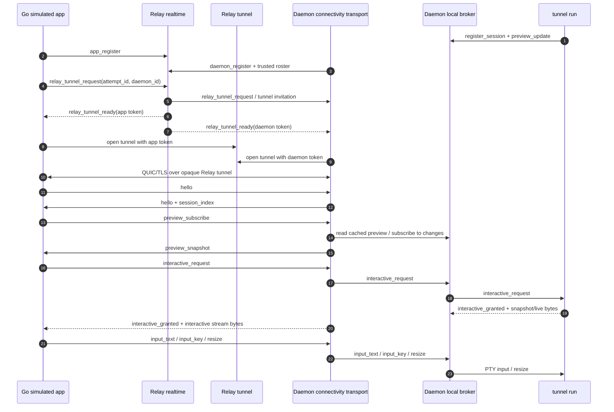

# feat: Implement fallback-only QUIC session transport

## Summary

Implement Step 4 of the connectivity program: a daemon-mediated session protocol that runs over pinned QUIC/TLS, carried through a Relay-hosted WebSocket fallback tunnel. The Relay should authorize and pair opaque tunnel endpoints, while the daemon and local `tunnel run` broker remain the only owners of session index, previews, snapshots, live bytes, input, and resize.

---

## Problem Frame

The broader connectivity program is moving terminal traffic away from Relay-terminated attach sockets toward path-agnostic daemon transport. Step 4 is the deterministic fallback milestone: prove the full session protocol over encrypted Relay fallback before adding STUN and direct UDP variability (see origin: `docs/connectivity/implementation/step-04-fallback-transport.md`).

---

## Assumptions

*This plan was authored without synchronous confirmation after research. The items below are agent inferences that should be reviewed before implementation proceeds.*

- Step 4 should produce a Go simulated app acceptance path in this repository, not production Android code, because the Android repo and file paths are not present here.
- `docs/connectivity/contract.md` still says sub-phase 1.2 exits with an Android `quiche` fallback client; this plan follows the newer Step 4 handoff and program review-guide wording that accepts a Go simulated app plus Android-ready protocol contract in this repo. U6 must reconcile that doc wording before the branch is complete.
- The Relay fallback tunnel should use binary WebSocket frames for QUIC packets and JSON WebSocket frames only for Relay realtime control events.
- Production Step 4 should promote the Step 1 interop payload structs into a reusable package instead of keeping transport/session payload contracts under `internal/connectivity/interop`.
- Step 4 should include local broker interactive frames and `tunnel run` bridging in the same plan, because fallback transport is not accepted until a simulated app can attach, receive bytes, and send input against a real daemon.

---

## Requirements

- R1. Implement the new app-to-daemon session protocol over Relay fallback, without direct UDP, STUN, or UDP relay.
- R2. Preserve Relay opacity: Relay may authenticate tunnel setup and count packets/bytes, but must not parse terminal/session control frames, preview text, snapshot bytes, live bytes, input, or resize payloads.
- R3. Reuse the Step 2 app/daemon realtime WebSockets for presence, trusted-device visibility, and fallback tunnel setup.
- R4. Reuse the Step 3 local broker so `tunnel run` remains PTY owner, mirror authority, preview source, snapshot source, live-byte source, input sink, and resize sink.
- R5. Send daemon-owned `session_index`, `session_upsert`, `session_gone`, preview subscription updates, interactive grant/deny/release, snapshot/live-byte streams, input, and resize using the documented QUIC stream model.
- R6. Enforce paired-device authorization before issuing fallback tunnel tokens and again inside the daemon before exposing broker sessions to a QUIC peer.
- R7. Recover reconnects with fresh daemon state: new QUIC connection, fresh `session_index`, replayed preview subscriptions, replayed interactive requests, and fresh snapshots, with no missed-byte replay promise.
- R8. Provide a Go simulated app acceptance path that lists sessions, subscribes preview, attaches interactively, sends input, releases, reconnects, and verifies Relay cannot observe plaintext.
- R9. Update Step 4 handoff and protocol/API docs so Android companion work can start from stable fallback contracts.

**Origin actors:** A1 Mobile client, A2 Tunnel session owner on the computer, A3 Relay server
**Origin flows:** F2 Direct attach fails and fallback takes over, F3 Relay-only control-plane operation
**Origin acceptance examples:** AE2 fallback where Relay only sees encrypted payload frames, AE3 prefer path-agnostic control/data separation over Relay-only attach multiplexing

---

## Scope Boundaries

- Do not implement direct UDP, STUN, NAT traversal, direct-first deadlines, or direct-vs-relay path badge behavior in this step.
- Do not implement UDP relay or production fallback latency SLO enforcement.
- Do not add payment enforcement beyond the existing Relay-exposed tier and official-app-local trusted-computer count rule.
- Do not make Relay the owner of session lists, preview text, attach state, terminal state, or per-session subscription decisions.
- Do not rewrite or retire the existing `/agent/ws`, `/device/ws`, `/api/sessions`, or `/api/sessions/:id/attach/ws` surfaces as part of Step 4.
- Do not claim production Android compatibility from this repository alone; the acceptance path here is Go simulated app plus stable docs for Android.

### Deferred to Follow-Up Work

- Direct UDP and STUN: Step 5 (`docs/connectivity/implementation/step-05-direct-stun.md`).
- Production Android integration: Step 6 in the Android companion repository once its path and build system are available.
- UDP relay fallback: only if production WSS fallback metrics later fail the phase-2 latency trigger in `docs/connectivity/contract.md`.
- Stronger local broker peer credentials: future hardening beyond owner-only socket/path checks.

---

## Context & Research

### Relevant Code and Patterns

- `internal/connectivity/frame/frame.go` already implements the `[type][varint length][payload]` codec and pins initial frame bytes for `hello`, `session_index`, `preview_subscribe`, `interactive_request`, `interactive_granted`, snapshot, and live-byte frames.
- `internal/connectivity/transport/transport.go` already centralizes QUIC/TLS 1.3 config, ALPN `tunnel-conn/1`, pinned Ed25519 SPKI verification, and disabled 0-RTT.
- `internal/connectivity/carrier/carrier.go` is an in-memory Step 1 packet-carrier harness; Step 4 should add production WebSocket carrier pieces without weakening the harness tests that prove Relay opacity.
- `internal/connectivity/interop/mobile.go` and `internal/connectivity/interop/interop_test.go` prove the current Go simulated app flow for hello, session index, interactive request/grant, snapshot, and live bytes.
- `internal/relay/connectivity/registry.go` owns live app/daemon visibility and pairing correlations; fallback attempt/tunnel correlation should follow this live-only style.
- `internal/relay/handler/connectivity/app_ws.go` and `internal/relay/handler/connectivity/daemon_ws.go` already host the Step 2 realtime WebSockets and unsupported-event handling.
- `internal/tunnel/daemon/connectivity_connector.go` already maintains the daemon-side realtime connection and sends `daemon_register` with trusted Android roster.
- `internal/tunnel/daemon/broker.go` and `internal/tunnel/daemon/session_registration.go` implement the Step 3 local roster/cache and are the natural place to add Step 4 interactive broker frames.
- `internal/tunnel/session/hub.go`, `internal/tunnel/session/terminal_mirror.go`, and `internal/tunnel/connector/connector.go` show the existing PTY input, resize, snapshot, live output, and submit-anchor patterns that Step 4 should reuse rather than reimplementing terminal semantics in Relay.
- `internal/relay/handler/new.go` wires connectivity routes beside existing API and agent/device routes.

### Institutional Learnings

- No `docs/solutions/` entries exist in this repository.

### External References

- quic-go v0.59.0 is already a direct dependency. Official quic-go docs describe the server/client API, connection lifecycle, streams, `Transport`, and use of existing `net.PacketConn`: https://quic-go.net/docs/quic/server/, https://quic-go.net/docs/quic/client/, https://quic-go.net/docs/quic/transport/
- gorilla/websocket v1.5.3 is already used for Relay WebSockets; Step 4 should follow existing handler read-limit, ping-loop, deadline, and close behavior in `internal/relay/handler/ws`.

---

## Key Technical Decisions

- **Fallback tunnel is packet relay, not session relay:** Relay tunnel endpoints forward QUIC packets as opaque binary WebSocket payloads. Typed session frames remain inside QUIC and terminate only in the daemon and simulated app.
- **Attempt tokens are short-lived, single-use, and actor-bound:** Relay issues separate app and daemon tunnel tokens for one `attempt_id`; each token is bound to user, daemon, Android fingerprint, and actor type.
- **Step 4 uses fallback-only transport state:** simulated app and daemon create a fresh QUIC connection over WSS carrier. Direct attempt state and direct-to-fallback deadline logic stay out of this plan.
- **Session payloads move out of `interop`:** reusable protocol payload structs belong in a production package under `internal/connectivity`, while `internal/connectivity/interop` remains a simulator/test harness.
- **Broker owns session liveness and latest preview:** daemon transport reads and subscribes against broker state. Relay realtime never carries session rows or previews.
- **At most one active interactive lifetime per session:** the Step 3 local-broker rule remains the Step 4 behavior; concurrent requests for the same session should deny with `daemon_busy`.
- **Reconnect is resync, not replay:** every reconnect rebuilds state from current broker snapshot and fresh terminal mirror snapshot.
- **Existing Relay attach remains unchanged:** Step 4 builds the new connectivity stack in parallel and avoids compatibility churn in the current attach path.

---

## Open Questions

### Resolved During Planning

- Should Step 4 include Android production work? No. It should provide a Go simulated app and stable contracts; Android companion work is Step 6.
- Should fallback use Relay-visible session messages? No. Relay forwards opaque QUIC packets only.
- Should Step 4 implement direct attempt/fallback transition? No. This plan starts directly on fallback because direct UDP belongs to Step 5.

### Deferred to Implementation

- Exact fallback tunnel route path and query/header token placement: choose while editing `internal/relay/handler/new.go`, then document in `docs/api.md` and `docs/connectivity/protocol/relay.md`.
- Exact WebSocket packet envelope: binary frame per QUIC datagram is the assumed shape, but implementation may add a minimal per-packet wrapper if quic-go `net.PacketConn` behavior requires peer addressing metadata.
- Exact production package names for session protocol payloads: `internal/connectivity/sessionproto` is a reasonable default, but the implementer may choose a clearer local name if it fits existing package boundaries better.
- Submit-anchor exposure over the new transport: the Step 4 source checklist does not require anchors. If implementation can include `snapshot_end` anchor metadata without destabilizing Android contract, document it; otherwise defer anchors for a focused follow-up.

---

## High-Level Technical Design

> *This illustrates the intended approach and is directional guidance for review, not implementation specification. The implementing agent should treat it as context, not code to reproduce.*

---

## Implementation Units

- U1. **Production session protocol payloads and frame registry**

**Goal:** Promote Step 1 simulator-only session payload definitions into reusable production protocol types and complete the Step 4 frame registry.

**Requirements:** R1, R5, R7, R8, R9

**Dependencies:** None

**Files:**
- Create: `internal/connectivity/sessionproto/sessionproto.go`
- Create: `internal/connectivity/sessionproto/sessionproto_test.go`
- Modify: `internal/connectivity/frame/frame.go`
- Modify: `internal/connectivity/frame/frame_test.go`
- Modify: `internal/connectivity/interop/mobile.go`
- Modify: `internal/connectivity/interop/interop_test.go`
- Modify: `docs/connectivity/protocol/transport.md`
- Modify: `docs/connectivity/reference/error-codes.md`
- Test: `internal/connectivity/sessionproto/sessionproto_test.go`
- Test: `internal/connectivity/frame/frame_test.go`
- Test: `internal/connectivity/interop/interop_test.go`

**Approach:**
- Define production payload structs for `hello`, `session_index`, `session_upsert`, `session_gone`, `preview_subscribe`, `preview_unsubscribe`, `preview_snapshot`, `interactive_request`, `interactive_granted`, `interactive_denied`, `interactive_release`, `input_text`, `input_key`, `resize`, `path_state`, `snapshot_begin`, `snapshot_end`, and recoverable `error`.
- Keep raw PTY bytes as raw frame payloads for `snapshot_chunk` and `live_bytes`.
- Extend the frame registry for Step 4 frame families that the transport docs describe but Step 1 did not yet pin.
- Update the simulator to consume the production payload package so tests exercise the same structs planned for daemon transport.
- Preserve unknown JSON field and unknown frame type tolerance.

**Execution note:** Add payload/codec tests before wiring daemon transport; these are contract tests for Android companion work.

**Patterns to follow:**
- `internal/connectivity/frame/frame.go` for compact codec boundaries.
- `internal/connectivity/interop/mobile.go` for existing Step 1 payload shape.
- `docs/connectivity/protocol/transport.md` for frame ordering and stream model.

**Test scenarios:**
- Happy path: every JSON payload type round-trips through `encoding/json` with the documented field names and ignores an added future field.
- Happy path: `session_index` carries a full broker-derived session list with metadata but no preview text.
- Happy path: `preview_snapshot` carries latest preview text separately from session metadata.
- Error path: malformed JSON for a typed control payload is rejected by the receiver-side decoder without panics.
- Forward compatibility: unknown frame type is tolerated and does not abort the connection loop.
- Edge case: raw `snapshot_chunk` and `live_bytes` payloads are not JSON decoded and preserve arbitrary bytes.
- Integration: existing Go interop tests pass after switching from simulator-local payload structs to production payload structs.

**Verification:**
- The production package is the single Go source for Step 4 session payload contracts.
- Transport docs and frame constants agree on all Step 4 frame names used by tests.

---

- U2. **Relay fallback tunnel authorization and opaque packet service**

**Goal:** Add Relay-side fallback tunnel setup and packet forwarding while keeping terminal/session content opaque.

**Requirements:** R2, R3, R6, R8, R9

**Dependencies:** U1 for shared protocol names used in docs/tests

**Files:**
- Modify: `internal/protocol/connectivity.go`
- Modify: `internal/relay/connectivity/registry.go`
- Modify: `internal/relay/connectivity/registry_test.go`
- Modify: `internal/relay/handler/connectivity/app_ws.go`
- Modify: `internal/relay/handler/connectivity/daemon_ws.go`
- Create: `internal/relay/handler/connectivity/tunnel_ws.go`
- Modify: `internal/relay/handler/connectivity_ws_test.go`
- Modify: `internal/relay/handler/new.go`
- Modify: `docs/api.md`
- Modify: `docs/connectivity/protocol/relay.md`
- Modify: `docs/connectivity/reference/error-codes.md`
- Test: `internal/relay/connectivity/registry_test.go`
- Test: `internal/relay/handler/connectivity_ws_test.go`

**Approach:**
- Add `relay_tunnel_request`, `relay_tunnel_ready`, and `relay_tunnel_closed` realtime events with `attempt_id` and daemon identity fields.
- Extend the live connectivity registry with short-lived fallback attempts. A valid attempt requires a visible paired daemon for the app's account and `device_fingerprint`.
- Issue separate one-time tunnel tokens for app and daemon actors. Tokens should expire quickly, be redeemed once, and be invalidated when either actor disconnects, the daemon disappears, the app session is revoked, or trust is revoked.
- Add a fallback tunnel WebSocket endpoint that upgrades only after token validation, pairs the app and daemon sides by `attempt_id`, and forwards binary packets both directions.
- Log tunnel setup, close reason, packet counts, byte counts, actor identities, and attempt id; do not log or inspect packet payload bytes.
- Keep JSON realtime event handling separate from binary tunnel packet forwarding.

**Patterns to follow:**
- Live-only visibility and correlation handling in `internal/relay/connectivity/registry.go`.
- Existing WebSocket deadline, read-limit, and ping-loop behavior in `internal/relay/handler/connectivity/app_ws.go` and `daemon_ws.go`.
- Existing auth-disconnect hooks in `internal/relay/handler/api/auth.go` and `internal/relay/handler/api/agent_tokens.go`.

**Test scenarios:**
- Happy path: paired app requests a fallback tunnel for a visible daemon and receives an app token while the daemon receives a daemon-side tunnel event.
- Happy path: both actor tokens redeem once, pair by `attempt_id`, and binary packets sent by either side are delivered unchanged to the other side.
- Error path: unpaired app, wrong account, wrong device fingerprint, offline daemon, expired attempt, reused token, and wrong actor token are rejected without creating a tunnel.
- Error path: app session logout, password change, agent token revocation, daemon disconnect, or paired-device revocation closes active tunnel endpoints.
- Opacity: Relay tunnel handler records packet/byte counters but tests assert no code path decodes `internal/connectivity/frame` or session payload JSON.
- Backpressure: a blocked or closed peer cannot cause unbounded memory growth; the tunnel closes with a bounded failure reason.
- Integration: app and daemon realtime WebSockets continue to support Step 2 pairing events while fallback events are added.

**Verification:**
- Relay can pair a single app and daemon fallback tunnel by attempt id and forward opaque packets only.
- Public API docs name the new fallback endpoint, auth requirements, token lifecycle, and payload opacity boundary.

---

- U3. **WebSocket packet carrier for QUIC fallback**

**Goal:** Provide a production carrier that lets quic-go run over the Relay fallback WebSocket tunnel as a `net.PacketConn`-like path.

**Requirements:** R1, R2, R5, R7, R8

**Dependencies:** U2 for the Relay tunnel endpoint

**Files:**
- Create: `internal/connectivity/carrier/ws_packet_conn.go`
- Create: `internal/connectivity/carrier/ws_packet_conn_test.go`
- Modify: `internal/connectivity/carrier/carrier.go`
- Modify: `internal/connectivity/carrier/carrier_test.go`
- Modify: `internal/connectivity/transport/transport_test.go`
- Test: `internal/connectivity/carrier/ws_packet_conn_test.go`
- Test: `internal/connectivity/carrier/carrier_test.go`
- Test: `internal/connectivity/transport/transport_test.go`

**Approach:**
- Add a WebSocket-backed packet carrier that implements the behavior quic-go needs from `net.PacketConn`: packet reads, packet writes, local address, close, read deadlines, write deadlines, and deadline wakeups.
- Use one logical remote address for the paired fallback peer; the carrier does not expose session semantics.
- Keep the in-memory `carrier.Relay` harness for deterministic tests and add production WebSocket carrier tests beside it.
- Ensure packet reads and writes are serialized according to gorilla/websocket's concurrency expectations.
- Treat WebSocket close, context cancellation, token rejection, and peer close as packet-connection close errors that the transport layer can reconnect from.

**Patterns to follow:**
- Deadline handling in `internal/connectivity/carrier/carrier.go`.
- quic-go use of existing `net.PacketConn` in `internal/connectivity/interop/interop_test.go`.
- Existing Relay WebSocket helpers in `internal/relay/handler/ws`.

**Test scenarios:**
- Happy path: two WebSocket packet carriers connected through the Relay tunnel can exchange arbitrary binary packets.
- Happy path: quic-go client and listener complete the pinned TLS handshake over the WebSocket packet carrier.
- Edge case: read deadlines and write deadlines unblock pending reads/writes with deadline errors.
- Error path: closing one WebSocket causes the paired packet carrier to unblock and close without goroutine leaks.
- Error path: oversized WebSocket binary messages are rejected according to the configured packet/read limit.
- Opacity: observed WebSocket binary payloads do not contain known plaintext session markers from the QUIC stream test.

**Verification:**
- The carrier can replace the Step 1 in-memory relay harness in an integration test without changing the QUIC/session protocol above it.

---

- U4. **Daemon fallback QUIC transport and session index/preview fanout**

**Goal:** Add daemon-side fallback transport that accepts a paired app's QUIC connection, sends broker session state, and handles preview subscriptions.

**Requirements:** R3, R4, R5, R6, R7, R8

**Dependencies:** U1, U2, U3

**Files:**
- Create: `internal/tunnel/daemon/connectivity_transport.go`
- Create: `internal/tunnel/daemon/connectivity_transport_test.go`
- Modify: `internal/tunnel/daemon/connectivity_connector.go`
- Modify: `internal/tunnel/daemon/runtime.go`
- Modify: `internal/tunnel/daemon/broker.go`
- Modify: `internal/tunnel/daemon/broker_test.go`
- Modify: `docs/connectivity/protocol/transport.md`
- Modify: `docs/connectivity/protocol/local-broker.md`
- Test: `internal/tunnel/daemon/connectivity_transport_test.go`
- Test: `internal/tunnel/daemon/broker_test.go`

**Approach:**
- Teach the daemon realtime connector to receive fallback tunnel readiness, redeem the daemon tunnel token, and start a fallback QUIC listener or accepted connection over the WebSocket packet carrier.
- Use the daemon connectivity identity and trusted Android roster to build pinned TLS config and to reject untrusted peer fingerprints.
- After `hello` exchange, send a full `session_index` derived from the broker snapshot.
- Extend broker with subscription hooks or an event stream so daemon transport can emit `session_upsert`, `session_gone`, and `preview_snapshot` to subscribed paired devices.
- Keep preview latest-only and bounded; do not add history or Relay-visible preview state.
- Maintain per-connection state for preview subscriptions so reconnect starts from a clean slate.

**Patterns to follow:**
- `internal/tunnel/daemon/connectivity_connector.go` for daemon realtime reconnect posture.
- `internal/tunnel/daemon/broker.go` for broker state normalization and latest preview handling.
- `internal/tunnel/daemon/session_registration_test.go` for broker lifecycle tests.
- `internal/connectivity/transport/transport.go` for pinned TLS config and connection validation.

**Test scenarios:**
- Happy path: trusted simulated app connects over fallback and receives `hello` followed by a complete `session_index` from current broker sessions.
- Happy path: broker `session_update` after connection sends a full `session_upsert` to the app.
- Happy path: broker connection loss sends `session_gone` to connected app transport.
- Happy path: `preview_subscribe` immediately returns the cached latest preview, then sends later bounded preview updates.
- Happy path: `preview_unsubscribe` stops future preview updates for that session on that connection.
- Error path: untrusted Android fingerprint, protocol version mismatch, ALPN mismatch, and invalid first frame close the QUIC connection without exposing broker state.
- Reconnect: a second fallback QUIC connection receives a fresh `session_index` and does not inherit stale preview subscriptions from the first connection.

**Verification:**
- A trusted simulated app can list daemon-local sessions and receive preview updates over fallback only.
- Relay remains uninvolved in session index or preview payloads.

---

- U5. **Interactive broker bridge for snapshot, live bytes, input, release, and resize**

**Goal:** Complete the end-to-end interactive session path between simulated app, daemon transport, local broker, and owning `tunnel run`.

**Requirements:** R4, R5, R6, R7, R8

**Dependencies:** U1, U4

**Files:**
- Modify: `internal/tunnel/daemon/broker.go`
- Modify: `internal/tunnel/daemon/broker_test.go`
- Modify: `internal/tunnel/daemon/session_registration.go`
- Modify: `internal/tunnel/daemon/session_registration_test.go`
- Modify: `internal/tunnel/daemon/connectivity_transport.go`
- Modify: `internal/tunnel/daemon/connectivity_transport_test.go`
- Modify: `internal/tunnel/session/remote_input_test.go`
- Modify: `cmd/tunnel/main.go`
- Modify: `cmd/tunnel/main_test.go`
- Modify: `docs/connectivity/protocol/local-broker.md`
- Test: `internal/tunnel/daemon/broker_test.go`
- Test: `internal/tunnel/daemon/session_registration_test.go`
- Test: `internal/tunnel/daemon/connectivity_transport_test.go`
- Test: `internal/tunnel/session/remote_input_test.go`
- Test: `cmd/tunnel/main_test.go`

**Approach:**
- Extend the local broker frame set for `interactive_request`, `interactive_granted`, `interactive_denied`, `interactive_release`, `snapshot_begin`, `snapshot_chunk`, `snapshot_end`, `live_bytes`, `input_text`, `input_key`, and `resize`.
- Bind `SessionRegistrationClient` to the live session hub and terminal mirror so it can answer interactive requests, serialize a fresh snapshot, stream subsequent PTY output, forward input, and forward resize.
- Preserve one active interactive lifetime per session. Duplicate interactive requests for the same session should deny with `daemon_busy` until release or connection loss.
- Route input through existing `session.EncodeRemoteTextInput`, `session.EncodeRemoteKeyInput`, `Hub.WriteInputSequence`, and `Hub.Resize` patterns so PTY semantics stay centralized.
- Ensure release and connection loss remove live output sinks and resize listeners so closed mobile streams do not receive future output.
- Do not make daemon interpret terminal bytes; it only forwards local broker frames to the paired transport.

**Execution note:** Add characterization tests around existing input/key/resize behavior before threading those paths through broker frames.

**Patterns to follow:**
- Existing Relay attach behavior in `internal/tunnel/connector/connector.go`, especially snapshot-before-live ordering and remote input encoding.
- `internal/tunnel/session/terminal_mirror.go` for snapshot serialization and preview source.
- `internal/tunnel/session/remote_input.go` for input text/key encoding.
- Step 3 broker lifecycle and replacement behavior in `internal/tunnel/daemon/broker.go`.

**Test scenarios:**
- Happy path: `interactive_request` for a live broker session produces `interactive_granted`, then `snapshot_begin`, at least one `snapshot_chunk` when the mirror has content, `snapshot_end`, and later `live_bytes` in order.
- Happy path: empty terminal snapshot still sends `snapshot_begin` and `snapshot_end` without requiring a snapshot chunk.
- Happy path: PTY output after snapshot completion is delivered as `live_bytes` only to the active interactive stream.
- Happy path: `input_text` and `input_key` for the active session write the expected PTY byte sequences through the hub.
- Happy path: `resize` for the active session resizes the hub and updates future snapshot dimensions.
- Happy path: `interactive_release` stops live-byte delivery and removes resize listeners.
- Error path: unknown session returns or forwards `interactive_denied(session_unavailable)`.
- Error path: second active interactive request for the same session returns `interactive_denied(daemon_busy)`.
- Error path: input or resize for a session without active interactive grant is dropped and logged without affecting PTY state.
- Reconnect: transport loss releases active broker interactive state so a new connection can request and receive a fresh snapshot.

**Verification:**
- A simulated app can attach interactively to a real local broker session, receive terminal bytes, send input, resize, release, and reconnect for a fresh snapshot.

---

- U6. **End-to-end fallback simulator, documentation, and handoff**

**Goal:** Prove Step 4 acceptance end to end and leave stable documentation for Android Step 6 and direct-path Step 5.

**Requirements:** R1, R2, R7, R8, R9

**Dependencies:** U2, U3, U4, U5

**Files:**
- Create: `internal/e2e/connectivity_fallback_test.go`
- Modify: `internal/connectivity/interop/mobile.go`
- Modify: `internal/connectivity/interop/README.md`
- Modify: `docs/connectivity/implementation/step-04-fallback-transport.md`
- Modify: `docs/connectivity/contract.md`
- Modify: `docs/connectivity/protocol/relay.md`
- Modify: `docs/connectivity/protocol/transport.md`
- Modify: `docs/connectivity/reference/sequence-flows.md`
- Modify: `docs/connectivity/reference/state-machines.md`
- Modify: `docs/connectivity/ux/android.md`
- Modify: `docs/api.md`
- Modify: `docs/architecture.md`
- Test: `internal/e2e/connectivity_fallback_test.go`
- Test: `internal/connectivity/interop/interop_test.go`

**Approach:**
- Extend the Go simulated app so it uses Relay app realtime, requests a fallback tunnel, opens the tunnel WebSocket, runs pinned QUIC/TLS over the WebSocket carrier, and executes full session/preview/interactive flows.
- Add an e2e-style fallback test that starts Relay handler state, daemon connectivity runtime with broker, and a local simulated `tunnel run` broker client.
- Assert reconnect behavior by dropping the QUIC/tunnel path, reconnecting, applying a fresh `session_index`, replaying preview subscription and interactive request, and receiving a fresh snapshot.
- Assert Relay opacity with known plaintext markers in preview, snapshot, live bytes, and input; Relay tunnel observations must not contain those markers.
- Update Step 4 handoff with implementation summary, verification performed, known gaps, and follow-up items for Steps 5 and 6.
- Reconcile `docs/connectivity/contract.md` sub-phase 1.2 with the repository-local Step 4 acceptance gate: Go simulated app evidence in this repo, with Android `quiche` validation tracked as Step 6/companion work unless the Android repo is introduced into scope.
- Update docs that describe app-facing endpoints, fallback token lifecycle, daemon transport frames, reconnect behavior, and Android's fallback-only implementation starting point.

**Patterns to follow:**
- `internal/e2e/connectivity_pairing_test.go` for Step 2 end-to-end gating style when local e2e is enabled.
- `internal/connectivity/interop/interop_test.go` for simulator flow shape.
- Step handoff format in `docs/connectivity/implementation/step-02-auth-pairing.md` and `docs/connectivity/implementation/step-03-local-broker.md`.

**Test scenarios:**
- Covers AE2. Integration: simulated app pairs visibility from Relay, requests fallback, completes pinned QUIC/TLS over Relay tunnel, lists sessions, subscribes preview, attaches, receives snapshot/live bytes, sends input, resizes, releases, reconnects, and receives fresh state.
- Covers AE2. Opacity: Relay tunnel packet observations and logs include setup/packet/byte metadata but do not contain known plaintext markers from preview, snapshot, live bytes, or input.
- Covers AE3. Integration: fallback flow does not call existing `/api/sessions/:id/attach/ws` or route session bytes through Relay attach handlers.
- Reconnect: after tunnel drop, simulated app opens a new fallback attempt and receives current broker state without any missed-byte replay assertion.
- Documentation: Step 4 handoff acceptance checklist is marked with evidence or explicit known gaps; protocol docs agree with implemented route names and frame names.
- Documentation: `docs/connectivity/contract.md` no longer contradicts the Step 4 handoff about whether production Android validation is required before this repository branch is accepted.

**Verification:**
- Step 4 acceptance can be demonstrated from repository tests and handoff evidence.
- Android companion planning has stable fallback-only endpoint, token, frame, stream, and reconnect contracts.

---

## System-Wide Impact

- **Interaction graph:** app realtime and daemon realtime gain fallback setup events; a new Relay tunnel endpoint forwards binary QUIC packets; daemon transport consumes broker snapshots/events; `tunnel run` broker client gains interactive responsibilities.
- **Error propagation:** Relay setup errors stay as realtime `error` events with retry hints where applicable; QUIC/session protocol errors stay inside the daemon-app transport; local broker denials become `interactive_denied` reasons.
- **State lifecycle risks:** attempt tokens must be expired and single-use; active tunnels must close on app logout, password change, agent-token revoke, daemon disconnect, or paired-device revoke; interactive broker state must release on mobile disconnect.
- **API surface parity:** docs must distinguish existing Relay attach from new connectivity fallback. Existing `/api/sessions` and attach routes remain available but are not used by Step 4 simulator.
- **Integration coverage:** unit tests alone will not prove the feature. The plan requires a fallback simulator path that crosses Relay realtime, Relay tunnel, WebSocket carrier, quic-go, daemon transport, broker, and local session registration.
- **Unchanged invariants:** Relay remains content-opaque; daemon remains tier-unaware; official app remains the trusted-computer tier enforcement point; `tunnel run` remains PTY owner; reconnect recovery remains fresh snapshot only.

---

## Risks & Dependencies

| Risk | Mitigation |
|------|------------|
| WSS-tunneled QUIC suffers head-of-line blocking and high latency | Accept for fallback-only Step 4 per `docs/connectivity/contract.md`; collect packet/byte counters and leave p95 latency SLO escalation for phase 2. |
| Relay tunnel token bugs expose daemons across accounts or devices | Bind tokens to user, daemon, Android fingerprint, actor type, attempt id, expiry, and single-use redemption; test wrong-account/wrong-fingerprint cases. |
| WebSocket carrier deadlocks under backpressure or close races | Implement bounded queues/deadlines, one writer loop per WebSocket, close propagation tests, and goroutine leak checks around reconnect. |
| Daemon transport accidentally trusts Relay-visible identity instead of pinned device key | Validate both Relay-derived visibility before token issuance and QUIC/TLS pinned SPKI before sending broker state. |
| Broker interactive bridge duplicates existing Relay attach semantics incorrectly | Reuse `Hub`, `TerminalMirror`, and `remote_input` patterns; add characterization tests for snapshot-before-live, input encoding, resize, and release cleanup. |
| Docs drift from implemented frame and route names | Treat U6 docs/handoff as an acceptance unit and update `docs/api.md`, connectivity protocol docs, and Step 4 handoff in the same branch. |

---

## Documentation / Operational Notes

- Update `docs/api.md` because Step 4 adds app-facing Relay fallback tunnel setup and a new WebSocket endpoint.
- Update `docs/connectivity/contract.md` if the implemented Step 4 branch keeps the Go simulated app as the repository-local acceptance gate rather than production Android validation.
- Update `docs/connectivity/protocol/relay.md`, `docs/connectivity/protocol/transport.md`, and `docs/connectivity/protocol/local-broker.md` with implemented event names, frame registry additions, tunnel token lifecycle, and reconnect behavior.
- Update `docs/connectivity/reference/sequence-flows.md` and `docs/connectivity/reference/state-machines.md` if implementation names or fallback-only transitions differ from the target diagrams.
- Update `docs/connectivity/implementation/step-04-fallback-transport.md` as the durable handoff for the next branch.
- Do not update root README/AGENTS/CLAUDE as if the full connectivity stack has shipped; Step 4 is still a staged connectivity milestone.

---

## Sources & References

- **Origin handoff:** [docs/connectivity/implementation/step-04-fallback-transport.md](../connectivity/implementation/step-04-fallback-transport.md)
- **Related program plan:** [docs/plans/2026-04-28-001-feat-quic-connectivity-program-plan.md](2026-04-28-001-feat-quic-connectivity-program-plan.md)
- **Origin requirements:** [docs/brainstorms/2026-04-23-direct-attach-control-plane-requirements.md](../brainstorms/2026-04-23-direct-attach-control-plane-requirements.md)
- **Connectivity contract:** [docs/connectivity/contract.md](../connectivity/contract.md)
- **Relay protocol:** [docs/connectivity/protocol/relay.md](../connectivity/protocol/relay.md)
- **Transport protocol:** [docs/connectivity/protocol/transport.md](../connectivity/protocol/transport.md)
- **Local broker protocol:** [docs/connectivity/protocol/local-broker.md](../connectivity/protocol/local-broker.md)
- **Sequence flows:** [docs/connectivity/reference/sequence-flows.md](../connectivity/reference/sequence-flows.md)
- **Step 3 handoff:** [docs/connectivity/implementation/step-03-local-broker.md](../connectivity/implementation/step-03-local-broker.md)
- Related code: `internal/connectivity/frame/frame.go`
- Related code: `internal/connectivity/transport/transport.go`
- Related code: `internal/relay/connectivity/registry.go`
- Related code: `internal/tunnel/daemon/broker.go`
- Related code: `internal/tunnel/daemon/connectivity_connector.go`
- Related code: `internal/tunnel/daemon/session_registration.go`
- Related code: `internal/tunnel/connector/connector.go`
- External docs: https://quic-go.net/docs/quic/server/
- External docs: https://quic-go.net/docs/quic/client/
- External docs: https://quic-go.net/docs/quic/transport/
