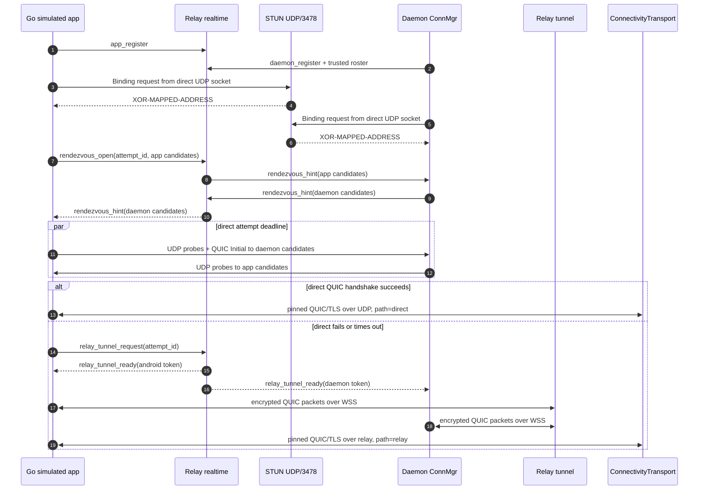

# feat: Implement direct UDP STUN connectivity

## Summary

Implement Step 5 of the QUIC connectivity program by adding self-hosted STUN, short-lived rendezvous hints, direct UDP candidate attempts, and automatic fallback to the Step 4 Relay tunnel. The session protocol stays path-agnostic: direct and relay differ only in packet carrier and path diagnostics, not encryption, session frames, previews, snapshots, input, or resize.

---

## Problem Frame

Step 4 proved the daemon-mediated session protocol over encrypted Relay fallback. Step 5 moves the preferred path toward the architecture's intended shape: direct mobile-to-daemon QUIC over UDP when NAT allows it, with Relay kept as control plane and encrypted fallback when direct setup fails (see origin: `docs/connectivity/implementation/step-05-direct-stun.md`).

---

## Assumptions

*This plan was authored without synchronous confirmation after research. The items below are agent inferences that should be reviewed before implementation proceeds.*

- Step 5 should be completed in this Go repository with a Go simulated app and daemon-side direct path, while production Android UI and `quiche` integration remain Step 6.
- The STUN service should run from the Relay binary and deployment footprint, rather than introducing a separate service repository or third-party public STUN dependency.
- STUN candidate discovery should use the same local UDP socket that the direct QUIC attempt will use, so the observed public mapping matches the port used for the direct handshake.
- Step 5 should add direct-first behavior only for new connection attempts and reconnect attempts; it should not implement mid-connection QUIC path migration or direct re-upgrade of an active Relay fallback connection.
- Step 5 should carry forward the Step 4 known gap that snapshot chunks and live-byte broker forwarding are incomplete; direct path acceptance should prove the same current session behavior as fallback, not invent missing terminal streaming in this step.

---

## Requirements

- R1. Provide a self-hosted Binding-only STUN service in the Relay edge footprint for public UDP address discovery.
- R2. Discover and filter direct candidates from STUN-observed public UDP address plus bounded private UDP addresses.
- R3. Exchange direct-attempt rendezvous hints through the existing app and daemon connectivity realtime sockets, using short-lived `attempt_id` state.
- R4. Prefer direct UDP for new daemon-card connection attempts when candidate discovery succeeds.
- R5. Fall back automatically to the Step 4 Relay tunnel when STUN discovery fails, direct handshake times out, UDP is blocked, the daemon is offline, or candidate state expires.
- R6. Preserve one security model across direct and relay: pinned QUIC/TLS terminates only at Android/simulated app and daemon, and Relay must not see terminal/session plaintext.
- R7. Reuse the existing path-agnostic session protocol, frame registry, broker routing, reconnect resync, and fallback packet tunnel contracts.
- R8. Provide diagnostics and path-state data that distinguish direct vs relay for Android path badge integration without implying different encryption.
- R9. Measure direct success, fallback reason, direct setup latency, and relay fallback latency at attempt granularity.
- R10. Update the Step 5 handoff and connectivity docs so Step 6 Android integration has stable direct path, fallback, and badge contracts.

**Origin actors:** A1 Mobile client, A2 Tunnel session owner on the computer, A3 Relay server
**Origin flows:** F1 Direct attach succeeds, F2 Direct attach fails and fallback takes over, F3 Relay-only control-plane operation
**Origin acceptance examples:** AE1 direct attach with same semantics, AE2 fallback where Relay only sees encrypted payload frames, AE3 path-agnostic control/data separation preferred over Relay-only attach multiplexing

---

## Scope Boundaries

- Do not implement UDP relay, TURN, ICE/SDP, WebRTC, or coturn.
- Do not implement manual user path selection; direct vs relay remains automatic connection-manager behavior.
- Do not add a different encryption model for fallback.
- Do not change the terminal/session protocol shape beyond path-state and diagnostics fields needed by Step 5.
- Do not make Relay own session lists, preview content, interactive grant decisions, terminal byte semantics, or per-session subscription policy.
- Do not rewrite or retire the existing `/agent/ws`, `/device/ws`, `/api/sessions`, or `/api/sessions/:id/attach/ws` surfaces as part of Step 5.
- Do not claim production Android direct-path compatibility from this repository alone.

### Deferred to Follow-Up Work

- Production Android direct UDP and path badge UI: Step 6 in the Android companion repository once its path and build system are available.
- UDP relay fallback: only after production WSS fallback metrics fail the phase-2 latency trigger in `docs/connectivity/contract.md`.
- Mid-connection direct re-upgrade or QUIC path migration: future optimization after direct/fallback attempt metrics exist.
- Production NAT measurement panel execution: collect real cone-NAT and symmetric-NAT evidence after the Step 5 implementation can run against deployed edge infrastructure.

---

## Context & Research

### Relevant Code and Patterns

- `internal/connectivity/sessionproto/sessionproto.go` already defines `PathDirect`, `PathRelay`, and `PathState`; Step 5 should extend this contract lightly instead of creating a separate badge protocol.
- `internal/connectivity/transport/transport.go` centralizes pinned QUIC/TLS config, ALPN `tunnel-conn/1`, disabled 0-RTT, and quic-go defaults. Direct should reuse this unchanged security layer.
- `internal/connectivity/carrier/carrier.go` and `internal/connectivity/carrier/ws_packet_conn.go` show the current `net.PacketConn` carrier pattern. Direct should add a UDP carrier/attempt path without weakening the fallback carrier.
- `internal/tunnel/daemon/connectivity_transport.go` already serves session index, preview subscriptions, interactive grants, input, resize, and reconnect resync over any accepted `*quic.Conn`; direct should feed this same transport with `PathKind: direct`.
- `internal/tunnel/daemon/connectivity_connector.go` currently handles daemon realtime registration and `relay_tunnel_ready`. It is the natural integration point for daemon-side rendezvous hints and direct/fallback attempt orchestration.
- `internal/relay/connectivity/registry.go` owns live-only app/daemon visibility, pairing correlations, and fallback tunnel attempt state. Rendezvous state should follow the same live-only, TTL-bound style.
- `internal/relay/handler/connectivity/app_ws.go` and `internal/relay/handler/connectivity/daemon_ws.go` already parse realtime control events and reject unsupported events; Step 5 should add rendezvous events there.
- `cmd/relay/main.go`, `cmd/relay/config.go`, `internal/config/relay.go`, and `deploy/compose/compose.yaml` are the current server startup and deployment surfaces that must grow UDP STUN binding.
- `docs/connectivity/protocol/transport.md`, `docs/connectivity/protocol/relay.md`, `docs/connectivity/reference/sequence-flows.md`, and `docs/connectivity/reference/error-codes.md` already describe the target direct/STUN behavior at design level and need to be reconciled with implementation details.

### Institutional Learnings

- No `docs/solutions/` entries exist in this repository.

### External References

- RFC 8489 defines STUN Binding behavior and the `XOR-MAPPED-ADDRESS` response attribute: https://datatracker.ietf.org/doc/html/rfc8489
- Pion's `github.com/pion/stun` package provides Go STUN message/client primitives and automatic retransmission support: https://github.com/pion/stun and https://pkg.go.dev/github.com/pion/stun
- quic-go's transport docs describe using `quic.Transport` with a `net.PacketConn`, direct UDP sockets, and non-QUIC packet demultiplexing considerations: https://quic-go.net/docs/quic/transport/
- quic-go client docs describe dialing through a transport/socket while QUIC connection IDs demultiplex connections over UDP: https://quic-go.net/docs/quic/client/

---

## Key Technical Decisions

- **STUN is Binding-only and edge-local:** Implement classic Binding request/response with `XOR-MAPPED-ADDRESS`; do not add TURN, ICE roles, credentials, or media connectivity checks.
- **Relay binary owns the STUN listener:** Running STUN in `relay serve` keeps deployment simple for the current Docker Compose path and avoids adding a second release artifact.
- **Candidate discovery uses the eventual QUIC UDP socket:** The direct attempt must learn the public mapping for the same socket that sends QUIC/probe traffic. A separate STUN dialer socket would discover the wrong NAT port.
- **Rendezvous is live-only and short-lived:** `attempt_id` state belongs in `internal/relay/connectivity/registry.go`, expires quickly, and is removed on app disconnect, daemon disconnect, revocation, superseding attempt, or `rendezvous_close`.
- **Direct-first is sequential, not happy-eyeballs:** The connection manager attempts direct with a short deadline, then starts a fresh fallback QUIC connection over the existing Relay tunnel contract if direct does not complete.
- **Fallback remains the complete degraded path:** Relay tunnel issuance and `WSPacketConn` remain unchanged except for being triggered after direct failure rather than immediately.
- **Path badge data is advisory:** Android owns the visible badge; daemon confirms the active path through `hello.path_kind` and optional `path_state`, while Relay never asserts whether terminal traffic is direct.
- **Go simulator is the Step 5 acceptance client:** Production Android direct behavior is planned in Step 6, but Step 5 should leave Android-ready protocol fields and docs.

---

## Open Questions

### Resolved During Planning

- Should Step 5 implement UDP relay? No. UDP relay remains deferred by `docs/connectivity/contract.md` D1.
- Should direct and relay use different terminal encryption? No. Both paths use the same pinned QUIC/TLS transport.
- Should Relay carry terminal/session path-state frames? No. Relay only carries rendezvous hints and fallback setup; path-state over the session protocol remains daemon-to-app.
- Should production Android code be in this plan? No. The Android repo is not present, so this plan provides Go-simulator evidence and Step 6 contracts.

### Deferred to Implementation

- Exact direct-attempt deadline constant: `docs/connectivity/_archive/2026-04-26-architect-review.md` records a 3s default, but the implementer should set the final Go constant alongside tests and docs.
- Exact STUN dependency choice: `github.com/pion/stun` is the preferred planning default, but implementation may choose a minimal local Binding-only codec if dependency footprint is materially smaller.
- Exact UDP socket reuse API: implementation should choose the cleanest shape after working with quic-go `Transport`, STUN response reads, and UDP probe demultiplexing.
- Production metrics sink: this repository has structured logs but no full metrics subsystem; Step 5 may log structured attempt events now and leave exporter integration for Step 7.

---

## High-Level Technical Design

> *This illustrates the intended approach and is directional guidance for review, not implementation specification. The implementing agent should treat it as context, not code to reproduce.*

---

## Success Metrics

- Controlled local direct-path tests complete a pinned QUIC/TLS session over UDP and exercise the same session index, preview, interactive grant, input, and reconnect semantics as fallback.
- Forced-fallback tests prove blocked UDP, STUN timeout, stale rendezvous hints, and direct handshake timeout all reach the Step 4 Relay tunnel without user path selection.
- Relay opacity tests continue to prove that Relay rendezvous and fallback tunnel code never decodes connectivity session frames or terminal payload bytes.
- Step 5 handoff records whether the cone-NAT measurement target from `docs/connectivity/contract.md` was run; if it was not run before merge, the handoff must say that explicitly and leave production measurement for Step 7 operations.
- Path diagnostics expose enough direct-vs-relay state for Step 6 Android badge work without claiming production Android compatibility.

---

## Dependencies / Prerequisites

- Step 4 fallback transport contracts and tests must remain available because direct failure relies on the existing Relay tunnel path.
- The implementation needs operator/deployment agreement to expose UDP/3478 for the Relay edge host; without that, direct tests can still run locally but production STUN cannot be accepted.
- Production Android direct-path validation depends on the Step 6 Android companion repository and remains outside this Go-repo plan.

---

## Implementation Units

- U1. **Self-hosted STUN service and relay startup wiring**

**Goal:** Add a Binding-only UDP STUN listener that runs with the Relay deployment and returns the caller's observed UDP address.

**Requirements:** R1, R5, R9, R10

**Dependencies:** None

**Files:**
- Create: `internal/connectivity/stun/server.go`
- Create: `internal/connectivity/stun/server_test.go`
- Modify: `internal/config/relay.go`
- Modify: `cmd/relay/config.go`
- Modify: `cmd/relay/command.go`
- Modify: `cmd/relay/main.go`
- Modify: `cmd/relay/config_test.go`
- Modify: `cmd/relay/command_test.go`
- Modify: `cmd/relay/main_test.go`
- Modify: `deploy/compose/compose.yaml`
- Modify: `deploy/compose/README.md`
- Modify: `deploy/compose/.env.example`
- Test: `internal/connectivity/stun/server_test.go`
- Test: `cmd/relay/config_test.go`
- Test: `cmd/relay/main_test.go`

**Approach:**
- Implement only STUN Binding requests and Binding success responses with `XOR-MAPPED-ADDRESS`.
- Add Relay configuration for STUN UDP listen address, with a default aligned to the product's UDP/3478 deployment direction and a way to disable it for local/test deployments when needed.
- Start the HTTP listener and STUN UDP listener from `relay serve`; startup should fail before logging ready if an enabled STUN listener cannot bind.
- Keep the STUN listener stateless. It should not authenticate, persist client addresses, or share data with Relay auth/session registries.
- Update Compose to publish the UDP STUN port and document the firewall/DNS expectation for `stun.<relay-domain>`.

**Patterns to follow:**
- `cmd/relay/main.go` startup logging and bind-before-log behavior.
- `internal/config/relay.go` environment-backed config defaults.
- `deploy/compose/compose.yaml` and `deploy/compose/README.md` for production runtime defaults.

**Test scenarios:**
- Happy path: valid Binding request sent over UDP receives a Binding success response whose `XOR-MAPPED-ADDRESS` matches the sender address observed by the server.
- Error path: malformed STUN datagram is ignored or rejected without panicking and without emitting a misleading success response.
- Error path: non-Binding STUN method does not return a Binding success response.
- Startup: `relay serve` binds HTTP and enabled STUN before logging readiness; if STUN bind fails, startup returns an error and no ready log is emitted.
- Config: STUN listen address can be set by environment/flag defaults and disabled for tests without weakening production defaults.
- Deployment: Compose exposes UDP 3478 while keeping the existing HTTP Relay port behavior unchanged.

**Verification:**
- The Relay process can answer Binding requests locally, and deployment docs identify the UDP port/hostname operators must expose.

---

- U2. **Candidate discovery and address hygiene**

**Goal:** Discover direct-path candidates from a reusable UDP socket, filter local addresses safely, and decide when direct should be skipped.

**Requirements:** R2, R4, R5, R8, R9

**Dependencies:** U1

**Files:**
- Create: `internal/connectivity/direct/candidate.go`
- Create: `internal/connectivity/direct/candidate_test.go`
- Create: `internal/connectivity/direct/stun_client.go`
- Create: `internal/connectivity/direct/stun_client_test.go`
- Create: `internal/connectivity/direct/udp_socket.go`
- Create: `internal/connectivity/direct/udp_socket_test.go`
- Modify: `docs/connectivity/protocol/transport.md`
- Modify: `docs/connectivity/reference/error-codes.md`
- Test: `internal/connectivity/direct/candidate_test.go`
- Test: `internal/connectivity/direct/stun_client_test.go`
- Test: `internal/connectivity/direct/udp_socket_test.go`

**Approach:**
- Build a direct-attempt socket abstraction around one UDP socket that can send STUN Binding requests, receive STUN responses, send UDP probes, and then back quic-go for the direct handshake.
- Record candidates as public UDP address plus bounded private UDP addresses. Private candidates should include only RFC1918, RFC4193, link-local, and loopback/test-only entries when explicitly allowed by tests.
- Cap private candidate count and normalize address serialization before it enters Relay realtime messages.
- Use a small retry budget for STUN Binding requests. If no public address is discovered inside that budget, mark direct as skipped and proceed to fallback.
- Keep address filtering and candidate serialization free of account/session data.

**Execution note:** Add characterization-style tests around the socket and filtering behavior before integrating with Relay rendezvous; wrong-port STUN discovery would make the rest of Step 5 misleading.

**Patterns to follow:**
- `internal/connectivity/carrier/ws_packet_conn.go` for deadline-aware packet connection behavior.
- `internal/connectivity/transport/transport.go` for quic-go config boundaries.
- `docs/connectivity/protocol/relay.md` private address hygiene rules.

**Test scenarios:**
- Happy path: STUN discovery on a UDP socket returns the public candidate and leaves the same socket usable for later packet reads/writes.
- Happy path: private address collection includes allowed RFC1918/RFC4193/link-local addresses and drops unrelated public interface addresses from `private_udp_addrs`.
- Edge case: duplicate candidates are normalized and de-duplicated before serialization.
- Edge case: excessive private addresses are capped deterministically.
- Error path: STUN timeout after the retry budget returns a direct-skip reason that the connection manager can convert into fallback.
- Error path: malformed STUN response, wrong transaction id, or response from an unexpected server address is ignored.
- Integration: quic-go can start a direct attempt using the same socket after candidate discovery completes.

**Verification:**
- Candidate discovery produces bounded, sanitized direct hints and clear fallback reasons without opening extra NAT mappings for the QUIC attempt.

---

- U3. **Rendezvous hint exchange over Relay realtime**

**Goal:** Add app/daemon rendezvous control-plane events that exchange direct candidates without carrying terminal/session semantics.

**Requirements:** R3, R5, R6, R7, R9, R10

**Dependencies:** U2

**Files:**
- Modify: `internal/protocol/connectivity.go`
- Modify: `internal/relay/connectivity/registry.go`
- Modify: `internal/relay/connectivity/registry_test.go`
- Modify: `internal/relay/handler/connectivity/app_ws.go`
- Modify: `internal/relay/handler/connectivity/daemon_ws.go`
- Modify: `internal/relay/handler/connectivity_ws_test.go`
- Modify: `docs/api.md`
- Modify: `docs/connectivity/protocol/relay.md`
- Modify: `docs/connectivity/reference/error-codes.md`
- Test: `internal/relay/connectivity/registry_test.go`
- Test: `internal/relay/handler/connectivity_ws_test.go`

**Approach:**
- Add `rendezvous_open`, `rendezvous_hint`, and `rendezvous_close` frames with `attempt_id`, target daemon identity, public candidate, private candidates, and expiry.
- Authorize rendezvous the same way fallback tunnels are authorized: the app session must be fingerprint-bound, same-account, paired, and currently visible to the daemon.
- Store rendezvous state live-only in the registry. Expire it by TTL, close it when either peer disconnects, and supersede older attempts for the same app/daemon pair.
- Forward app hints to the daemon and daemon hints to the app; Relay must not derive session state, path badges, or terminal semantics from the hints.
- Apply rate limiting consistent with existing fallback tunnel request limits, returning structured `relay_rate_limited` with retry guidance.

**Patterns to follow:**
- Fallback attempt/token lifecycle in `internal/relay/connectivity/registry.go`.
- Existing connectivity websocket event dispatch in `internal/relay/handler/connectivity/app_ws.go` and `daemon_ws.go`.
- Existing tests for trusted daemon snapshots and fallback tunnel token issuance in `internal/relay/handler/connectivity_ws_test.go`.

**Test scenarios:**
- Happy path: paired app sends `rendezvous_open`; Relay forwards the app candidates to the correct online daemon and later forwards daemon candidates back to the app.
- Happy path: `rendezvous_close` removes live attempt state and prevents further hints for that attempt.
- Error path: unpaired app, wrong account, wrong device fingerprint, offline daemon, expired attempt, missing `attempt_id`, and malformed candidate payload are rejected without forwarding hints.
- Error path: a newer `attempt_id` for the same app/daemon pair supersedes the older attempt and drops stale hints.
- Error path: app logout, password change, agent token revocation, daemon disconnect, or paired-device revocation closes active rendezvous state.
- Opacity: tests assert Relay rendezvous handlers do not import or decode `internal/connectivity/frame` or `internal/connectivity/sessionproto`.
- Rate limit: excessive rendezvous opens return `relay_rate_limited` with `retry_after_seconds`.

**Verification:**
- Relay can coordinate candidate exchange for exactly the currently paired app/daemon pair while remaining live-only and content-opaque.

---

- U4. **Direct-first daemon/app connection manager with fallback transition**

**Goal:** Use STUN candidates and rendezvous hints to attempt direct QUIC first, then fall back to the existing Relay tunnel without changing session semantics.

**Requirements:** R4, R5, R6, R7, R8, R9, AE1, AE2

**Dependencies:** U1, U2, U3

**Files:**
- Create: `internal/connectivity/direct/attempt.go`
- Create: `internal/connectivity/direct/attempt_test.go`
- Create: `internal/connectivity/direct/probe.go`
- Create: `internal/connectivity/direct/probe_test.go`
- Modify: `internal/connectivity/interop/mobile.go`
- Modify: `internal/connectivity/interop/interop_test.go`
- Modify: `internal/tunnel/daemon/connectivity_connector.go`
- Create: `internal/tunnel/daemon/connectivity_direct.go`
- Create: `internal/tunnel/daemon/connectivity_direct_test.go`
- Modify: `internal/tunnel/daemon/connectivity_transport.go`
- Modify: `internal/tunnel/daemon/connectivity_transport_test.go`
- Test: `internal/connectivity/direct/attempt_test.go`
- Test: `internal/connectivity/interop/interop_test.go`
- Test: `internal/tunnel/daemon/connectivity_direct_test.go`
- Test: `internal/tunnel/daemon/connectivity_transport_test.go`

**Approach:**
- Add a direct attempt manager that owns one attempt id, candidate set, direct deadline, fallback reason, and result timing.
- On the simulated app side, open direct for a daemon card by discovering candidates, sending `rendezvous_open`, waiting for daemon hints, sending UDP probes to daemon candidates, and dialing QUIC over the direct socket.
- On the daemon side, handle `rendezvous_hint` by discovering daemon candidates, sending daemon hints, sending UDP probes toward app candidates, listening for the direct QUIC handshake, and serving `ConnectivityTransport` with `PathKind: direct` when it succeeds.
- If direct fails or times out, request the Step 4 `relay_tunnel_request` using the same `attempt_id` and start a fresh QUIC connection over `WSPacketConn`.
- Keep `ConnectivityTransport` path-agnostic; it should only receive an accepted QUIC connection and the resolved path kind.
- Ensure direct failure does not leave stale UDP sockets, goroutines, rendezvous state, or interactive broker ownership behind.

**Execution note:** Implement the direct/fallback state tests before broad daemon wiring; the failure modes are mostly lifecycle bugs.

**Patterns to follow:**
- `internal/tunnel/daemon/connectivity_connector.go` for realtime reconnect/backoff and trusted Android key lookup.
- `internal/tunnel/daemon/connectivity_transport.go` for serving session protocol over an accepted QUIC connection.
- `internal/connectivity/interop/mobile.go` for Go simulated app protocol behavior.
- `internal/connectivity/carrier/ws_packet_conn.go` for fallback carrier closure behavior.

**Test scenarios:**
- Happy path: direct UDP QUIC handshake succeeds in a controlled local test; `hello.path_kind` is `direct`, `session_index` is delivered, preview subscription works, and interactive request/input behavior matches fallback.
- Happy path: daemon and simulated app use the same pinned identities and ALPN as fallback; cert pin mismatch still fails before session index.
- Covers AE1. Integration: direct success delivers current session metadata and broker-routed input without any Relay tunnel token issuance.
- Covers AE2. Integration: blocked UDP or direct handshake timeout causes fallback tunnel request, new relay QUIC handshake, `hello.path_kind` is `relay`, and fresh `session_index` is delivered.
- Error path: STUN timeout skips direct and opens fallback without waiting for rendezvous hints.
- Error path: stale daemon hint or mismatched `attempt_id` is ignored and cannot hijack an active attempt.
- Error path: daemon trust revocation during an attempt cancels direct and fallback paths.
- Lifecycle: canceled direct attempt closes UDP socket and quic-go listener/dialer goroutines; reconnect creates a new attempt rather than reusing stale state.
- Edge case: symmetric-NAT simulation or intentionally unreachable public candidate records `direct_timeout`/`direct_unreachable` and still falls back cleanly.

**Verification:**
- Direct and relay both terminate in the same `ConnectivityTransport` session flow, with direct preferred only when it completes inside the deadline.

---

- U5. **Path diagnostics, attempt metrics, and badge data**

**Goal:** Make path choice observable to users, tests, and operations without changing security semantics.

**Requirements:** R8, R9, R10

**Dependencies:** U4

**Files:**
- Modify: `internal/connectivity/sessionproto/sessionproto.go`
- Modify: `internal/connectivity/sessionproto/sessionproto_test.go`
- Modify: `internal/tunnel/daemon/connectivity_transport.go`
- Modify: `internal/tunnel/daemon/connectivity_transport_test.go`
- Modify: `internal/tunnel/daemon/doctor.go`
- Modify: `internal/tunnel/daemon/doctor_test.go`
- Modify: `internal/relay/connectivity/registry.go`
- Modify: `internal/relay/connectivity/registry_test.go`
- Modify: `internal/relay/handler/connectivity/tunnel_ws.go`
- Modify: `docs/connectivity/protocol/transport.md`
- Modify: `docs/connectivity/reference/error-codes.md`
- Test: `internal/connectivity/sessionproto/sessionproto_test.go`
- Test: `internal/tunnel/daemon/connectivity_transport_test.go`
- Test: `internal/tunnel/daemon/doctor_test.go`
- Test: `internal/relay/connectivity/registry_test.go`

**Approach:**
- Extend path-state payloads with attempt id, path kind, optional fallback reason, and coarse latency fields that are useful for Android badges and diagnostics.
- Emit a daemon-to-app `path_state` after connection establishment and after fallback transition completes.
- Add structured logs for direct attempt start, STUN result, rendezvous open/close, direct success, fallback start, fallback success, and direct/fallback failure.
- Track fallback tunnel packet/byte counters in the Relay tunnel path without inspecting payloads.
- Update daemon doctor/status output to include last connectivity path and last failure reason when available, while keeping terminal/session content out of diagnostics.

**Patterns to follow:**
- `internal/tunnel/daemon/runtimeState` last-failure handling in `internal/tunnel/daemon/connectivity_connector.go`.
- Existing Relay structured logging style through `internal/logx`.
- Existing path constants in `internal/connectivity/sessionproto/sessionproto.go`.

**Test scenarios:**
- Happy path: direct success emits path-state data with `path_kind=direct` and no fallback reason.
- Happy path: direct failure followed by relay success emits path-state data with `path_kind=relay` and the recorded direct failure reason.
- Error path: diagnostics tolerate unknown fallback reasons and do not close the transport.
- Opacity: Relay packet counters count packets/bytes but tests assert no terminal/session payload decoding occurs.
- Doctor/status: daemon diagnostic output includes last path/failure metadata but never preview, snapshot, live bytes, or input text.
- Edge case: reconnect clears stale in-progress path state and reports the current attempt result only.

**Verification:**
- A Step 6 Android client can render Direct vs Relay badge state from documented fields, and operators can distinguish expected fallback from broken connectivity.

---

- U6. **Documentation, handoff, and acceptance evidence**

**Goal:** Align docs and the Step 5 handoff with the implemented direct/STUN behavior and record what remains for Android and operations.

**Requirements:** R10

**Dependencies:** U1, U2, U3, U4, U5

**Files:**
- Modify: `docs/connectivity/implementation/step-05-direct-stun.md`
- Modify: `docs/connectivity/contract.md`
- Modify: `docs/connectivity/protocol/relay.md`
- Modify: `docs/connectivity/protocol/transport.md`
- Modify: `docs/connectivity/reference/sequence-flows.md`
- Modify: `docs/connectivity/reference/state-machines.md`
- Modify: `docs/connectivity/reference/error-codes.md`
- Modify: `docs/connectivity/architecture.md`
- Modify: `docs/api.md`
- Modify: `docs/daemon.md`
- Modify: `README.md`
- Modify: `CLAUDE.md`
- Create: `AGENTS.md` if the repository still lacks a tracked AGENTS file when implementation runs; otherwise modify the existing file
- Test: documentation consistency through existing package/API tests where touched

**Approach:**
- Update Step 5 handoff with implemented modules, verification performed, remaining gaps, and concrete Step 6/Step 7 follow-up notes.
- Reconcile `docs/connectivity/contract.md` sub-phase 1.3 wording with actual Go simulator acceptance and the deferred Android production path.
- Document STUN deployment shape, rendezvous event payloads, direct deadline/fallback reasons, path-state fields, and diagnostics.
- Update public API docs only for app-facing Relay realtime/API surface changes.
- Update root docs and agent instructions only to the degree required by the active docs expectations; avoid claiming full Android direct-path shipment before Step 6 lands.

**Patterns to follow:**
- `docs/connectivity/implementation/step-04-fallback-transport.md` handoff detail level.
- Docs expectations in `AGENTS.md` for relay auth, lifecycle, client-facing endpoints, attach semantics, and protocol changes.
- `docs/connectivity/implementation/README.md` update rule.

**Test scenarios:**
- Test expectation: none for pure documentation edits, except that any changed protocol/API code paths remain covered by the unit and integration tests in U1-U5.

**Verification:**
- A reviewer can read the Step 5 handoff and know exactly which direct/STUN behavior shipped, which evidence was collected, and what Step 6 Android must still prove.

---

## System-Wide Impact

- **Interaction graph:** App and daemon realtime WebSockets gain rendezvous events; Relay gains a UDP STUN listener; daemon connectivity gains direct UDP attempt orchestration before existing fallback tunnel setup; `ConnectivityTransport` remains the shared endpoint for both path kinds.
- **Error propagation:** STUN and direct-attempt failures become structured fallback reasons, not fatal user-visible failures unless both direct and relay fail.
- **State lifecycle risks:** `attempt_id` state, UDP sockets, quic-go listeners, fallback tunnel tokens, and broker interactive ownership must all be canceled together when attempts expire, reconnect, or are superseded.
- **API surface parity:** App-facing Relay realtime protocol, daemon realtime protocol, public docs, and Android-ready path-state fields must stay aligned.
- **Integration coverage:** Unit tests alone will not prove direct/fallback orchestration; Step 5 needs controlled local direct success and forced-fallback integration tests with the simulated app and real daemon transport.
- **Unchanged invariants:** Relay remains content-opaque; `tunnel run` remains PTY/session authority; direct and relay use the same pinned QUIC/TLS transport and session frame registry; reconnect recovery remains fresh resync, not missed-byte replay.

---

## Risk Analysis & Mitigation

| Risk | Likelihood | Impact | Mitigation |
|------|------------|--------|------------|
| STUN discovery uses a different socket than QUIC and reports an unusable NAT mapping | Medium | High | U2 requires same-socket discovery tests before connection-manager integration. |
| Direct attempt goroutines or UDP sockets leak after timeout/fallback | Medium | High | U4 includes lifecycle tests for cancellation, superseding attempts, and reconnect. |
| Relay rendezvous state outlives pairing or app-session validity | Medium | High | U3 mirrors existing live-only registry invalidation and revocation tests. |
| Direct fallback path regresses the Step 4 fallback-only behavior | Medium | High | U4 keeps fallback tunnel contract unchanged and includes forced-fallback tests. |
| Path badge implies direct is more secure than relay | Low | Medium | U5 and docs frame direct/relay as path modes over the same encryption model. |
| Production NAT results underperform controlled tests | Medium | Medium | U5 logs attempt outcomes; U6 documents production measurement as Step 7/operations follow-up. |
| UDP/3478 deployment conflicts with existing host firewall or Compose assumptions | Medium | Medium | U1 updates Compose and operator docs, with startup failure when enabled STUN cannot bind. |

---

## Documentation / Operational Notes

- Operators need UDP/3478 exposed for the STUN hostname; this is separate from HTTPS/WebSocket traffic and should be documented in Compose and deployment notes.
- The Step 5 PR should not update schema files unless implementation introduces persistent metrics storage. The planned state is live/log-only.
- The Step 5 handoff should explicitly list which tests simulate direct success and forced fallback, and should not mark Android production direct behavior complete.
- Structured logs should use `attempt_id` consistently across STUN, rendezvous, direct, fallback, and tunnel counters so later operations work can correlate failures.

---

## Sources & References

- Origin document: [docs/connectivity/implementation/step-05-direct-stun.md](../connectivity/implementation/step-05-direct-stun.md)
- Related program plan: [docs/plans/2026-04-28-001-feat-quic-connectivity-program-plan.md](2026-04-28-001-feat-quic-connectivity-program-plan.md)
- Related Step 4 plan: [docs/plans/2026-04-29-002-feat-fallback-quic-transport-plan.md](2026-04-29-002-feat-fallback-quic-transport-plan.md)
- Related requirements: [docs/brainstorms/2026-04-23-direct-attach-control-plane-requirements.md](../brainstorms/2026-04-23-direct-attach-control-plane-requirements.md)
- Current Step 4 handoff: [docs/connectivity/implementation/step-04-fallback-transport.md](../connectivity/implementation/step-04-fallback-transport.md)
- Connectivity transport docs: [docs/connectivity/protocol/transport.md](../connectivity/protocol/transport.md)
- Connectivity Relay docs: [docs/connectivity/protocol/relay.md](../connectivity/protocol/relay.md)
- RFC 8489 STUN: https://datatracker.ietf.org/doc/html/rfc8489
- Pion STUN package: https://github.com/pion/stun
- quic-go transport docs: https://quic-go.net/docs/quic/transport/
- quic-go client docs: https://quic-go.net/docs/quic/client/
