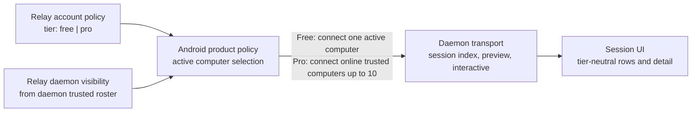

# feat: Simplify connectivity tier policy to computer limits

## Summary

Replace the old session-level Free/Pro model with a computer-count policy contract. The implementation should remove sticky first-attach, locked-row, and preview-gating semantics from active connectivity docs and tests, keep Relay/daemon session transport entitlement-free, and leave Android as the owner of active-computer and downgrade-resolution state.

Implementation note: this plan is now completed. The "Current" and "must be rewritten" wording below records the state at planning time; the active connectivity docs now describe trusted-computer count policy rather than session-level tier policy.

---

## Problem Frame

The origin requirements define a product simplification: Free and Pro should behave identically inside one active trusted computer, and tiers should differ only by trusted computer count. Current active connectivity documents still describe Free session gating, so planning must make the old model disappear rather than coexist with the new one.

---

## Requirements

- R1. Free and Pro have identical session behavior within a single active trusted computer.
- R2. Free allows 1 active trusted computer; Pro allows up to 10 trusted computers.
- R3. Free Replace Computer is transactional: the old active computer remains active unless the new SAS-confirmed pairing succeeds.
- R4. Replace Computer first version changes Android-local active trust only and leaves old-daemon trust revocation as an explicit TODO.
- R5. Pro pairing is blocked at 10 trusted computers until the user removes one.
- R6. Pro-to-Free downgrade enters resolution and requires selecting exactly one active trusted computer before automatic connection resumes.
- R7. Free automatically connects to the single active trusted computer; Pro automatically connects to all online trusted computers up to the entitlement.
- R8. Session rows, preview, detail attach, reconnect, input, and path badges must not depend on tier once the computer is active and trusted.
- R9. The implementation must remove sticky first-attach, locked session rows, preview gating, and Free-only row UI from active product contracts.
- R10. Relay and daemon must not gain session-level Free/Pro entitlement logic.

**Origin actors:** A1 Free user, A2 Pro user, A3 Downgraded user, A4 Official Android app, A5 Relay, A6 Daemon

**Origin flows:** F1 Free user pairs first computer, F2 Free user replaces computer, F3 Pro user reaches computer limit, F4 Pro user downgrades to Free

**Origin acceptance examples:** AE1 Free user sees all sessions on one active computer, AE2 Pro blocks eleventh computer, AE3 successful Replace Computer switches active computer locally, AE4 failed replacement keeps old computer active, AE5 downgrade requires resolution, AE6 entitlement ignores session identity/order

---

## Scope Boundaries

- Do not keep a legacy sticky-first-attach compatibility path in active docs, tests, or implementation notes.
- Do not preserve locked-row, grey-row, tap-to-unlock, or Free-only preview suppression behavior.
- Do not add session count limits.
- Do not add Relay-owned active-computer state in this repository.
- Do not make Relay persist trusted Android rosters or active computer choices.
- Do not make daemon or local broker consult `free` versus `pro`.
- Do not implement old-daemon trust revoke in this pass; leave it as a future TODO for successful Replace Computer.
- Do not add payment provider, billing package, or upgrade purchase flow.
- Do not modify archived documents under `docs/connectivity/_archive/`; they remain historical records.

### Deferred to Follow-Up Work

- Future old-daemon trust revoke: define and implement best-effort revocation for successful Replace Computer when the old daemon is online, offline, or later reconnects.
- Production Android repository implementation: apply the policy model in the Android codebase when its repo path and state model are available.

---

## Context & Research

### Relevant Code and Patterns

- `internal/relay/auth/types.go` already constrains subscription tier to `free` or `pro`; this remains the only Relay-side tier primitive.
- `internal/relay/handler/api/auth.go` and `internal/relay/handler/types/auth.go` implement `GET /api/account/policy`; the response currently exposes account id and tier only.
- `internal/relay/connectivity/registry.go` derives daemon visibility from the daemon-reported trusted roster plus the authenticated app session fingerprint. It does not know session lists, previews, interactive grants, or Free/Pro session policy.
- `internal/tunnel/daemon/connectivity_transport.go` serves session index, preview subscriptions, interactive requests, input, resize, reconnect session index, and path state for any trusted Android device. It does not branch on tier.
- `internal/connectivity/sessionproto/sessionproto.go` defines session transport payloads without policy fields; this should remain true.
- `docs/connectivity/contract.md`, `docs/connectivity/ux/subscription.md`, `docs/connectivity/ux/android.md`, `docs/connectivity/reference/state-machines.md`, and `docs/connectivity/reference/sequence-flows.md` actively describe the legacy sticky first-attach model and must be rewritten.
- `docs/connectivity/protocol/local-broker.md` currently describes Free subscribing only to the sticky unlocked session and Pro subscribing to every live session; that must become tier-neutral for active trusted computers.
- `docs/connectivity/implementation/step-06-android-companion.md`, `docs/plans/2026-04-28-002-feat-quic-connectivity-review-guide.md`, and `docs/plans/2026-04-28-003-feat-quic-connectivity-github-issues.md` still list legacy Step 6 acceptance items and should be updated so future Android work does not implement obsolete behavior.
- `docs/api.md` documents the app policy endpoint and connectivity WebSocket surfaces; it should clarify that tier is used by official clients for computer-limit policy, not session gating.

### Institutional Learnings

- No `docs/solutions/` entries exist in this repository.

### External References

- None used. This plan is driven by local product requirements and existing repository contracts.

---

## Key Technical Decisions

- **Hard replace the session-tier model:** Active docs and planned acceptance checks should describe only the computer-limit model. Legacy sticky-first-attach text should be deleted or rewritten, not marked as an alternate mode.
- **Keep Relay policy tier-only for now:** The existing `free|pro` account policy is sufficient for the official Android app to derive `1` versus `10` computer limits. Avoid adding numeric policy fields unless implementation uncovers a client compatibility reason.
- **Android owns active-computer state:** Free active computer, pending Replace Computer, Pro trusted-computer count enforcement, and downgrade resolution are official-client product state. Relay continues to expose tier and daemon presence only.
- **Daemon remains subscription-unaware:** The daemon should keep serving full session index, preview subscription, interactive attach, input, resize, and path state to trusted devices. Any tier decision happens before Android chooses which computer transports to open.
- **Tests protect absence of session entitlement:** Go tests should focus on proving the backend stays tier-neutral at session transport boundaries and that policy endpoint behavior remains minimal.
- **Documentation is implementation work here:** Because production Android code is not in this repo, the repo-local deliverable is the active contract/handoff rewrite plus regression tests that prevent backend session gating from appearing.

---

## Open Questions

### Resolved During Planning

- Relay active-computer persistence: resolved as out of scope for this repo. Android owns active-computer and downgrade-resolution state.
- Old daemon trust revocation: resolved as deferred. First version is Android-local old-computer removal only.
- Relay policy response shape: resolved as tier-only unless implementation discovers a strong compatibility need for explicit numeric fields.
- Legacy sticky first-attach: resolved as removed, not preserved.

### Deferred to Implementation

- Exact Android local storage key/shape for active trusted computer, pending replacement, and downgrade resolution.
- Exact Android UI copy for Replace Computer, Pro limit reached, and downgrade resolution.
- Whether active-computer state should be account-scoped, device-fingerprint-scoped, or both in the Android app.

---

## High-Level Technical Design

> *This illustrates the intended approach and is directional guidance for review, not implementation specification. The implementing agent should treat it as context, not code to reproduce.*

The important boundary is that tier decisions stop at computer connection selection. Once Android opens a trusted daemon transport, session protocol behavior is the same for Free and Pro.

---

## Implementation Units

- U1. **Keep Relay policy minimal and computer-limit oriented**

**Goal:** Align the account policy API contract and tests with the new model without introducing Relay-owned active-computer or session entitlement state.

**Requirements:** R2, R5, R6, R7, R10; origin A4, A5; origin AE2, AE5, AE6

**Dependencies:** None

**Files:**
- Modify: `docs/api.md`
- Modify: `docs/protocol.md`
- Review only: `internal/relay/handler/types/auth.go`
- Review only: `internal/relay/handler/api/auth.go`
- Test: `internal/relay/handler/rest_api_test.go`
- Test: `internal/e2e/connectivity_pairing_test.go`
- Modify as needed for tests: `internal/e2e/client.go`

**Approach:**
- Keep `GET /api/account/policy` centered on account tier. Do not add selected session, selected computer, unlocked row, or per-session policy fields.
- Update API/protocol docs so `free` and `pro` are described as official-client computer-limit inputs: Free maps to one active trusted computer, Pro maps to up to ten trusted computers.
- Avoid adding explicit numeric computer-limit fields unless implementation uncovers a concrete compatibility reason. If such fields become necessary, keep them derived from tier only and document them as hints, not server-owned active-computer state.
- Strengthen tests around account policy to prove tier fetch remains independent of sessions, daemon rosters, preview subscriptions, and interactive attach state.

**Patterns to follow:**
- Existing account policy handler and e2e coverage in `internal/relay/handler/rest_api_test.go` and `internal/e2e/connectivity_pairing_test.go`.
- Existing auth type normalization in `internal/relay/auth/types.go`.

**Test scenarios:**
- Happy path: new account policy returns `free` and no session/computer selection fields.
- Happy path: operator updates a user to `pro`; policy returns `pro` and still carries no session entitlement state.
- Edge case: policy remains fetchable when the user has no visible daemons.
- Integration: pairing flow still observes tier changes before and after pairing without changing daemon visibility semantics.
- Integration: active session count or preview subscription state does not affect policy output.

**Verification:**
- Policy endpoint documentation and tests describe tier as computer-limit input only.
- No Relay API response exposes sticky session, locked row, unlocked row, or active session entitlement state.

---

- U2. **Rewrite connectivity product contract and UX docs**

**Goal:** Replace the active connectivity documentation's legacy session-gating model with the computer-limit model.

**Requirements:** R1, R2, R3, R4, R5, R6, R7, R8, R9, R10; origin F1-F4; origin AE1-AE6

**Dependencies:** U1

**Files:**
- Modify: `docs/connectivity/contract.md`
- Modify: `docs/connectivity/architecture.md`
- Modify: `docs/connectivity/ux/subscription.md`
- Modify: `docs/connectivity/ux/android.md`
- Modify: `docs/connectivity/reference/state-machines.md`
- Modify: `docs/connectivity/reference/sequence-flows.md`
- Modify: `docs/connectivity/reference/error-codes.md`
- Modify: `docs/connectivity/reference/decision-record.md`

**Approach:**
- Replace `D3 — Free Unlock Rule: Sticky First-Attach` with a computer-limit decision. The new decision should name Free's single active trusted computer, Pro's 10 trusted computers, transactional Free Replace Computer, Pro limit handling, and downgrade resolution.
- Rewrite `ux/subscription.md` around active trusted computers. Delete sticky first-attach, `unlocked_session_id`, locked-row, and preview-gating sections.
- Update Android UX guidance so session rows, previews, detail attach, reconnect, path badge, input, and terminal focus are tier-neutral once a computer is active.
- Replace per-session state machines with tier-neutral session UI lifecycle. Add or revise a computer-policy lifecycle state machine covering Free active computer, pending replacement, Pro limit, and downgrade resolution.
- Replace sequence flows that show sticky first-attach and Pro preview bootstrap with flows for Free first computer, Free Replace Computer, Pro 10-computer block, and downgrade resolution.
- Remove local official-app error codes for locked sessions and replace them with computer-policy errors or local reasons for Pro limit and downgrade resolution.

**Execution note:** Characterization-first at the documentation level: start by grepping active docs for legacy terms (`sticky`, `locked`, `unlocked_session_id`, `policy_locked_session`, `preview gating`) and make the final diff drive those active references to zero outside historical/origin/plan documents.

**Patterns to follow:**
- Existing `docs/connectivity/contract.md` decision format.
- Existing Mermaid state/sequence diagram style in `docs/connectivity/reference/state-machines.md` and `docs/connectivity/reference/sequence-flows.md`.

**Test scenarios:**
- Test expectation: none for runtime code; this is contract documentation. Verification is grep- and review-based.

**Verification:**
- Active connectivity docs no longer instruct implementers to build sticky first-attach, locked rows, unlocked row state, or preview suppression.
- The new docs explicitly carry the TODO for future old-daemon trust revocation.
- The docs clearly state that Android-local old-computer removal is not the same as daemon trust revocation.

---

- U3. **Update local broker, transport, and Step 6 handoff contracts**

**Goal:** Make lower-level implementation docs and Android handoff materials consistent with tier-neutral session transport.

**Requirements:** R1, R7, R8, R9, R10; origin A4, A6; origin AE1, AE6

**Dependencies:** U2

**Files:**
- Modify: `docs/connectivity/protocol/local-broker.md`
- Modify: `docs/connectivity/protocol/relay.md`
- Modify: `docs/connectivity/protocol/transport.md`
- Modify: `docs/connectivity/implementation/step-06-android-companion.md`
- Modify: `docs/connectivity/implementation/README.md`
- Modify: `docs/connectivity/README.md`
- Modify: `docs/plans/2026-04-28-001-feat-quic-connectivity-program-plan.md`
- Modify: `docs/plans/2026-04-28-002-feat-quic-connectivity-review-guide.md`
- Modify: `docs/plans/2026-04-28-003-feat-quic-connectivity-github-issues.md`

**Approach:**
- Update local broker docs so preview subscription is client-choice/tier-neutral under an active trusted computer. Remove Free-only “subscribe only to sticky unlocked session” guidance.
- Update Relay protocol docs so subscription policy surface is computer-limit input only and Relay still does not fan out per-session decisions.
- Update transport docs so `session_index`, preview, interactive, input, resize, reconnect, and path-state semantics are independent of tier.
- Rewrite Step 6 major modules and acceptance checklist around Android active-computer policy: Free first computer, Replace Computer, Pro 10 limit, downgrade resolution, tier-neutral sessions, reconnect by active computer, and path badge parity.
- Update program/review docs and generated issue plan so old Step 6 checklist items do not send Android implementation toward sticky first-attach.

**Patterns to follow:**
- Existing Step handoff style in `docs/connectivity/implementation/step-06-android-companion.md`.
- Existing program step summaries in `docs/plans/2026-04-28-001-feat-quic-connectivity-program-plan.md`.

**Test scenarios:**
- Test expectation: none for runtime code; this is documentation and handoff alignment.

**Verification:**
- Step 6 acceptance no longer says “Free user can unlock only one session per opened daemon card.”
- Review guide and GitHub issue docs no longer present legacy sticky first-attach as current required behavior.
- Protocol docs state session transport remains tier-neutral once a trusted daemon transport is open.

---

- U4. **Add backend regression coverage for entitlement-free session transport**

**Goal:** Ensure future backend work does not accidentally reintroduce session-level Free/Pro gating.

**Requirements:** R1, R8, R10; origin AE1, AE6

**Dependencies:** U1, U2

**Files:**
- Test: `internal/tunnel/daemon/connectivity_transport_test.go`
- Test: `internal/connectivity/sessionproto/sessionproto_test.go`
- Test: `internal/relay/connectivity/registry_test.go`
- Test: `internal/relay/handler/connectivity_ws_test.go`
- Test: `internal/e2e/connectivity_pairing_test.go`

**Approach:**
- Add or adjust tests to make the current backend boundary explicit: Relay connectivity visibility is device-trust based, not tier based; daemon transport serves full session behavior to trusted devices.
- Do not add `tier`, `locked`, `unlocked`, or entitlement fields to session transport payloads.
- Add targeted assertions that session index and preview subscription behavior do not require any account tier input.
- Keep tests close to existing registry, websocket, and transport tests rather than adding a new policy subsystem.

**Execution note:** Add regression tests before any code change that touches these backend surfaces; the expected result should be that most backend code remains unchanged.

**Patterns to follow:**
- Registry visibility tests in `internal/relay/connectivity/registry_test.go`.
- WebSocket connectivity tests in `internal/relay/handler/connectivity_ws_test.go`.
- Transport tests in `internal/tunnel/daemon/connectivity_transport_test.go`.

**Test scenarios:**
- Happy path: trusted Android sees paired daemon visibility regardless of account tier.
- Happy path: daemon transport sends a full `session_index` for a trusted device without receiving policy information.
- Happy path: preview subscription succeeds for any live session under the trusted daemon transport.
- Happy path: interactive request/input/resize behavior is gated only by session availability and interactive grant, not tier.
- Edge case: a revoked trusted device still loses visibility and transport access through existing trust revocation, independent of tier.
- Integration: app policy tier update from `free` to `pro` changes policy fetch output but does not change registry trusted-roster visibility or daemon transport payload shape.

**Verification:**
- Backend tests prove no session entitlement policy is carried over Relay connectivity registry, app websocket, session transport, or sessionproto payloads.
- Existing pairing/revocation behavior remains intact.

---

- U5. **Final legacy sweep and documentation alignment**

**Goal:** Ensure active repository guidance no longer points future implementers at the old session-gating model.

**Requirements:** R9, R10; origin success criteria

**Dependencies:** U2, U3, U4

**Files:**
- Modify: `README.md`
- Modify: `docs/architecture.md`
- Modify: `AGENTS.md`
- Modify: `CLAUDE.md`
- Modify: `docs/api.md`
- Modify: `docs/protocol.md`
- Review only: `docs/connectivity/_archive/2026-04-26-architect-review.md`

**Approach:**
- Update top-level docs only where they describe connectivity tier semantics or Android behavior. Avoid unrelated rewrites.
- Preserve historical/archive references but make sure current product-boundary docs do not claim Free session locking or preview gating.
- Run a targeted legacy-term sweep after all edits. Active docs may mention old behavior only as “removed/superseded” in the new plan or requirements; they should not present it as a valid implementation option.

**Patterns to follow:**
- Current product-boundary style in `AGENTS.md` and `CLAUDE.md`.
- Public API/reference tone in `docs/api.md` and `docs/protocol.md`.

**Test scenarios:**
- Test expectation: none for runtime code; this is final documentation alignment.

**Verification:**
- Grep over active docs and code finds no current sticky-first-attach, locked-row, or Free preview-gating instructions outside historical/archive files and the requirements/plan documents that explain the replacement.
- Top-level docs remain consistent with the new computer-limit model.

---

## System-Wide Impact

- **Interaction graph:** Relay policy fetch remains separate from connectivity WebSocket presence; Android combines tier plus visible daemon roster to decide which computer transports to open. Daemon transport continues to serve sessions without policy input.
- **Error propagation:** Session-level policy errors disappear. Remaining app-local policy surfaces are computer-limit errors: Pro limit reached, downgrade resolution required, and Replace Computer failed/cancelled/mismatch.
- **State lifecycle risks:** Android-local active computer state can diverge from daemon-local trust until future revocation work lands. Docs must name this explicitly so users and implementers do not treat local removal as remote revoke.
- **API surface parity:** `GET /api/account/policy` remains the app-facing policy surface. Connectivity WebSockets and session transport should not gain session policy fields.
- **Integration coverage:** Registry, websocket, and daemon transport tests should prove backend tier neutrality; docs cover Android behavior until the Android repo can implement it.
- **Unchanged invariants:** Relay remains content-opaque. Daemon remains trust root for pairing. Relay does not persist trusted rosters. Session previews, interactive attach, input, reconnect, and path badges are owned below the computer transport boundary.

---

## Risks & Dependencies

| Risk | Mitigation |
|------|------------|
| Active docs still contain old sticky-first-attach instructions after the change | U2, U3, and U5 include explicit legacy-term sweeps and rewrite current handoff docs, not only the central subscription doc. |
| Android implementers misread Android-local old-computer removal as daemon trust revocation | U2 and U5 require explicit wording that first version does not revoke old daemon trust and carries a future TODO. |
| Backend code grows a session entitlement system because policy is underspecified | U4 adds regression coverage around tier-neutral registry and transport behavior; U1 keeps policy endpoint minimal. |
| Pro downgrade behavior needs Android UX decisions not available in this repo | Plan records product constraints and defers exact UI copy/storage shape to Android implementation. |
| Historical docs confuse current grep checks | U5 excludes `docs/connectivity/_archive/` from active-contract checks and treats historical documents as review-only. |

---

## Documentation / Operational Notes

- This change is primarily contract and behavior cleanup in this repository. Production Android code changes belong to the Android repo once available.
- No PostgreSQL schema changes are planned.
- No production Relay deployment changes are planned.
- Operator tier tooling remains `free|pro`; no billing migration is introduced.

---

## Sources & References

- **Origin document:** [docs/brainstorms/2026-04-30-connectivity-tier-simplification-requirements.md](docs/brainstorms/2026-04-30-connectivity-tier-simplification-requirements.md)
- Current subscription doc: [docs/connectivity/ux/subscription.md](docs/connectivity/ux/subscription.md)
- Current Android UX doc: [docs/connectivity/ux/android.md](docs/connectivity/ux/android.md)
- Connectivity contract: [docs/connectivity/contract.md](docs/connectivity/contract.md)
- Relay policy handler: [internal/relay/handler/api/auth.go](internal/relay/handler/api/auth.go)
- Connectivity registry: [internal/relay/connectivity/registry.go](internal/relay/connectivity/registry.go)
- Daemon transport: [internal/tunnel/daemon/connectivity_transport.go](internal/tunnel/daemon/connectivity_transport.go)
