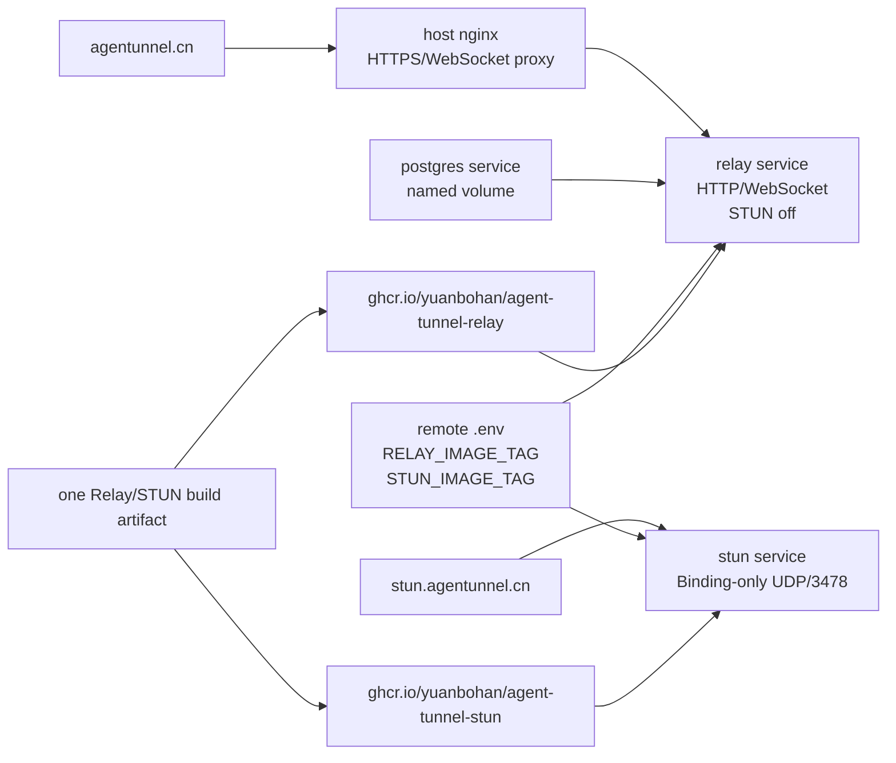

# feat: Split STUN runtime from Relay Compose deployment

## Summary

Add a STUN-only startup mode to the existing Relay binary, then split the Compose deployment into separately version-pinned `relay` and `stun` services that use the same release build artifact under separate GHCR image names. Routine `relay-cn` updates should recreate only Relay by default; STUN stays pinned and publicly reachable on direct UDP `3478`.

---

## Problem Frame

The origin document defines an operations split: Relay changes often, while Binding-only STUN should remain stable and avoid churn from routine Relay updates. Current code starts STUN inside `relay serve`, so Compose cannot independently pin, restart, or verify STUN without also coupling it to Relay's database-backed HTTP/WebSocket server.

---

## Requirements

- R1. Compose must run Relay HTTP/WebSocket traffic and Binding-only STUN as separate services.
- R2. Relay startup must support disabling STUN so Relay updates do not bind or restart the public STUN listener.
- R3. The STUN service must run from a STUN-specific GHCR image name that points at the same release build artifact as Relay, through a STUN-only startup path.
- R4. STUN-only startup must not require PostgreSQL, `RELAY_APP_SECRET`, or `RELAY_OPERATOR_TOKEN`.
- R5. STUN remains Binding-only; no TURN, UDP relay, ICE, WebRTC, or media forwarding.
- R6. Compose must support separate `RELAY_IMAGE_TAG` and `STUN_IMAGE_TAG` pins.
- R7. Routine Relay update paths must not update or recreate STUN by default.
- R8. First split rollout can pin both services to the same tag because that tag first contains the STUN-only mode.
- R9. Operator docs and commands must distinguish Relay-only, STUN-only, and full-stack lifecycle operations.
- R10. `relay-cn` verification must include UDP/STUN reachability.
- R11. Deployment docs must state that UDP STUN is exposed directly on the VPS and is not proxied by nginx.
- R12. Invite/user operator commands must keep targeting the Relay service.
- R13. Runtime Relay/PostgreSQL secrets remain only in remote `/opt/agentunnel/compose/.env`.
- R14. The existing `relay` Release workflow continues running one Docker build and publishes that artifact under both Relay and STUN GHCR image names.
- R15. Image smoke checks must verify metadata for both service-specific image names.
- R16. Docs must explain two-service runtime, separate tags, first rollout, routine Relay update, rare STUN update, DNS, firewall, and verification.
- R17. Existing PostgreSQL schema snapshot/manual-SQL rules remain unchanged.

**Origin actors:** A1 Maintainer, A2 GitHub Actions release workflow, A3 Relay operator, A4 Docker Compose stack, A5 STUN clients
**Origin flows:** F1 First split-service rollout, F2 Routine Relay update, F3 Rare STUN update
**Origin acceptance examples:** AE1 split service restart, AE2 independent tags, AE3 STUN-only startup, AE4 STUN status check, AE5 one build artifact with two GHCR image names

---

## Scope Boundaries

- Do not create a separate STUN Dockerfile or independent STUN release workflow.
- Do not add TURN, UDP relay, ICE, WebRTC, or public third-party STUN.
- Do not proxy STUN through nginx. Nginx remains HTTP/WebSocket reverse proxy only.
- Do not bundle nginx, TLS, or certbot into Compose.
- Do not change Relay auth, session routing, attach semantics, or connectivity rendezvous semantics beyond runtime separation.
- Do not change PostgreSQL schema or the current production rule that existing database changes are manual.

### Deferred to Follow-Up Work

- Automating Docker Engine installation on `relay-cn`: current docs say the host must already have Docker Engine and the Compose plugin.
- Moving STUN to a separate host or region: the chosen DNS shape allows it later, but this plan keeps STUN on the same VPS.

---

## Context & Research

### Relevant Code and Patterns

- `cmd/relay/command.go` owns Cobra command registration, runtime handler dispatch, help text, and operator subcommands.
- `cmd/relay/config.go` owns `serveConfig`, `--stun-listen-addr`, `RELAY_STUN_LISTEN_ADDR`, `RELAY_LOG_FILE`, and Relay config finalization.
- `cmd/relay/main.go` owns HTTP listener startup and currently starts the STUN listener inside `startRelay`.
- `internal/connectivity/stun/server.go` already implements the stateless Binding-only STUN server and helper request/response parsing used by tests.
- `internal/config/relay.go` currently requires database URL, app secret, and operator token through `SetupRelay`; STUN-only startup should avoid this path.
- `deploy/compose/compose.yaml` currently publishes UDP `3478` from the `relay` service and hardcodes `RELAY_STUN_LISTEN_ADDR=0.0.0.0:3478`.
- `scripts/relay-cn-status.sh` already checks DNS, remote `.env`, Compose service presence, local health, public HTTP/API/WebSocket auth paths, and Compose state.
- `.github/workflows/release.yml`, `Dockerfile.relay`, and `scripts/test-relay-docker-image.sh` already publish and smoke-test the Relay image artifact.
- `makefiles/deploy.mk` already has `compose-*` and `relay-cn-*` targets; new lifecycle targets should follow that naming style.
- `docs/docker-operation.md`, `docs/deploy.md`, `docs/operation.md`, and `README.md` are the primary operator-facing docs for Compose deploys.

### Institutional Learnings

- No `docs/solutions/` entries exist in this repository.

### External References

- RFC 8489 defines STUN Binding behavior and the `XOR-MAPPED-ADDRESS` response that reflects the source transport address observed by the STUN server: https://www.rfc-editor.org/rfc/rfc8489.html
- NGINX stream can proxy UDP, but transparent source preservation requires additional privileges/routing and is unnecessary here: https://nginx.org/en/docs/stream/ngx_stream_proxy_module.html
- Docker Compose supports UDP published ports using the `/udp` protocol suffix, matching the existing Compose file's current STUN exposure pattern.

---

## Key Technical Decisions

- Add a STUN-only command in `cmd/relay` rather than a second binary: the existing image already contains the Relay binary and STUN package, so one image can serve two process roles.
- Keep `relay serve` as the HTTP/WebSocket command and disable embedded STUN in Compose: this preserves local/manual compatibility while making production Compose split by service.
- Use separate `RELAY_IMAGE_TAG` and `STUN_IMAGE_TAG` values in `.env`: this lets routine Relay updates move without repinning the stable STUN service.
- Prefer direct host UDP exposure over nginx UDP proxy: STUN must report the client mapping observed by the STUN server, and ordinary UDP proxying would obscure that source address.
- Use `stun.agentunnel.cn` for the public STUN endpoint: it points at the same VPS as `agentunnel.cn` today and can move independently later if STUN gets its own host.

---

## Open Questions

### Resolved During Planning

- STUN hostname: use `stun.agentunnel.cn` pointing at the `relay-cn` VPS.
- UDP exposure model: open `3478/udp` in the cloud firewall/security group and any host firewall; do not route STUN through nginx.
- Image naming model: publish the same release build artifact as both `agent-tunnel-relay` and `agent-tunnel-stun`.
- Routine update default: Relay-only update paths should avoid recreating STUN unless the operator explicitly chooses full-stack or STUN update.

### Deferred to Implementation

- Exact command spelling: choose the final Cobra command shape during implementation, with `relay stun serve` as the planning default because it groups STUN under a clear subcommand namespace.
- STUN status check mechanism: prefer reusing the repository's STUN request/response helper through a small script or Go utility if shell-native tooling is too brittle.

---

## High-Level Technical Design

> *This illustrates the intended approach and is directional guidance for review, not implementation specification. The implementing agent should treat it as context, not code to reproduce.*

---

## Implementation Units

### U1. Add STUN-only CLI startup

**Goal:** Add a command that runs only the Binding-only STUN server from the existing Relay binary, without Relay database or operator-secret requirements.

**Requirements:** R3, R4, R5, R14, AE3

**Dependencies:** None

**Files:**
- Modify: `cmd/relay/command.go`
- Modify: `cmd/relay/config.go`
- Modify: `cmd/relay/main.go`
- Modify: `cmd/relay/config_test.go`
- Modify: `cmd/relay/command_test.go`
- Modify: `cmd/relay/main_test.go`
- Test: `cmd/relay/config_test.go`
- Test: `cmd/relay/command_test.go`
- Test: `cmd/relay/main_test.go`

**Approach:**
- Add a STUN-specific command path under the existing Cobra root. Planning default: group it as a `stun` subcommand with a `serve` leaf so future STUN maintenance commands have a namespace.
- Introduce a small STUN config path that resolves listen address and optional log file without calling Relay's database-backed `SetupRelay`.
- Factor the current STUN listener startup out of `startRelay` into a reusable helper that both `relay serve` and STUN-only startup can use.
- Keep `relay serve` able to start embedded STUN for backwards/local compatibility, but production Compose will set it to off.
- Log a distinct startup event for STUN-only mode so operators can distinguish Relay and STUN logs.

**Execution note:** Add command/config tests first, because the highest-risk mistake is accidentally retaining Relay secret/database requirements in STUN-only startup.

**Patterns to follow:**
- Cobra command construction and handler injection in `cmd/relay/command.go`
- `serveConfig` finalization and usage errors in `cmd/relay/config.go`
- Listener bind-before-ready-log tests in `cmd/relay/main_test.go`
- STUN server behavior in `internal/connectivity/stun/server.go`

**Test scenarios:**
- Happy path: STUN-only config defaults to a UDP listen address and does not require `RELAY_DATABASE_URL`, `RELAY_APP_SECRET`, or `RELAY_OPERATOR_TOKEN`.
- Happy path: STUN-only command dispatch calls the STUN handler with the configured listen address and log file.
- Happy path: STUN-only startup binds UDP before logging ready and emits a STUN-specific startup log.
- Edge case: `off` or disabled listen value is rejected for STUN-only startup, because a STUN service with no listener is a misconfiguration.
- Error path: UDP bind failure returns a clear error and does not log ready.
- Regression: `relay serve --stun-listen-addr off` still starts HTTP/WebSocket Relay without starting STUN.
- Regression: existing invite/user/version commands remain unchanged and do not expose irrelevant STUN flags.

**Verification:**
- The Relay binary has one HTTP/WebSocket startup path and one STUN-only startup path.
- STUN-only startup is secret-free and database-free.

---

### U2. Split Compose services and image tags

**Goal:** Change the Compose runtime from one Relay service with embedded STUN to separate `relay` and `stun` services using independent tag pins from service-specific image names backed by the same build artifact.

**Requirements:** R1, R2, R6, R7, R8, R12, R13, AE1, AE2, AE3, AE5

**Dependencies:** U1

**Files:**
- Modify: `deploy/compose/compose.yaml`
- Modify: `deploy/compose/.env.example`
- Modify: `deploy/compose/README.md`
- Test: `deploy/compose/compose.yaml`

**Approach:**
- Keep `postgres` unchanged except for any service dependency adjustments required by the split.
- Set the `relay` service image from `RELAY_IMAGE_TAG`, pass Relay/PostgreSQL secrets only to `relay`, disable Relay's embedded STUN listener, and publish only the host-local HTTP port.
- Add a `stun` service using `ghcr.io/yuanbohan/agent-tunnel-stun:${STUN_IMAGE_TAG}`, the STUN-only command, no database/app/operator secrets, and direct UDP `3478` publication.
- Keep first-rollout ergonomics simple by showing the same tag for `RELAY_IMAGE_TAG` and `STUN_IMAGE_TAG` in the example, while documenting that they diverge after the initial split release.
- Ensure the Compose file makes the service boundary visible in `docker compose ps`.

**Patterns to follow:**
- Existing `.env` interpolation and required-variable style in `deploy/compose/compose.yaml`
- Current blank-secret example style in `deploy/compose/.env.example`
- Compose operation notes in `deploy/compose/README.md`

**Test scenarios:**
- Covers AE1. Integration: resolved Compose config includes separate `relay` and `stun` services, with only `relay` receiving database and Relay secret environment.
- Covers AE2. Integration: changing only `RELAY_IMAGE_TAG` changes only the Relay service image while `STUN_IMAGE_TAG` remains the STUN service image source.
- Covers AE3. Integration: STUN service command uses the STUN-only startup path and publishes `3478/udp`.
- Error path: missing `STUN_IMAGE_TAG` causes Compose config failure instead of silently reusing the Relay tag.
- Regression: `relay` still publishes `127.0.0.1:8586:8586` and PostgreSQL volume/init behavior is unchanged.

**Verification:**
- Compose can represent Relay and STUN as independently pinned services.
- STUN no longer depends on Relay runtime secrets.

---

### U3. Adjust deploy automation for Relay-only and STUN lifecycle

**Goal:** Make local Make/Ansible entrypoints reflect the operational split: routine updates should target Relay, while STUN and full-stack operations are explicit.

**Requirements:** R7, R8, R9, R12, R13, AE1, AE2

**Dependencies:** U2

**Files:**
- Modify: `ansible/roles/relay_compose/tasks/main.yml`
- Modify: `makefiles/common.mk`
- Modify: `makefiles/deploy.mk`
- Test: `makefiles/deploy.mk`

**Approach:**
- Extend the Compose lifecycle action vocabulary so the role can run service-scoped pull/up for Relay and STUN, plus existing full-stack sync/up/down behavior.
- Make `compose-up-relay-cn` and equivalent routine update targets service-scoped to Relay by default.
- Add explicit STUN-oriented targets for rare STUN updates and either preserve or add clearly named full-stack targets for first rollout/bootstrap.
- Keep GHCR login behavior shared because both services pull from the same private package.
- Do not overwrite remote `.env`; deployment remains driven by operator-managed tag pins.

**Patterns to follow:**
- Current `RELAY_COMPOSE_ACTION` variable flow in `makefiles/common.mk`
- Current `compose-*` target naming in `makefiles/deploy.mk`
- Existing Ansible `relay_compose_action` branching in `ansible/roles/relay_compose/tasks/main.yml`

**Test scenarios:**
- Happy path: Relay-only action pulls/recreates only the `relay` service.
- Happy path: STUN-only action pulls/recreates only the `stun` service.
- Happy path: full-stack action remains available for first rollout or intentional full-stack restart.
- Error path: lifecycle actions still fail clearly when the remote `.env` is missing.
- Regression: sync action still copies Compose assets and leaves the remote `.env` untouched.
- Regression: existing relay-cn operator targets still execute commands inside the `relay` service.

**Verification:**
- Operators have one obvious routine Relay update command and a separate explicit STUN update path.
- No local Go build is involved in Compose deploy automation.

---

### U4. Add relay-cn STUN verification

**Goal:** Extend relay-cn status checks so operators can verify DNS, firewall, Compose, and live Binding-only STUN behavior.

**Requirements:** R10, R11, AE4

**Dependencies:** U1, U2

**Files:**
- Modify: `scripts/relay-cn-status.sh`
- Create: `scripts/stun-check.sh` or equivalent small checker if shell-only verification is impractical
- Modify: `makefiles/deploy.mk` if new helper targets are exposed
- Test: checker script or focused Go test if a Go checker is added

**Approach:**
- Add DNS verification for `stun.agentunnel.cn` resolving to the expected `relay-cn` host.
- Add remote Compose verification that both `relay` and `stun` services are present.
- Add a STUN Binding check against the public hostname on UDP `3478`.
- Prefer a deterministic checker that sends a Binding request and parses `XOR-MAPPED-ADDRESS` rather than treating open UDP as sufficient.
- Keep output in the existing tabular status style and make failures actionable: DNS mismatch, remote service absent, UDP timeout, or invalid STUN response.

**Patterns to follow:**
- Existing result table and diagnostics functions in `scripts/relay-cn-status.sh`
- Existing STUN request/response helpers in `internal/connectivity/stun/server.go`
- Existing local shell wrapper style in `scripts/test-relay-docker-image.sh` if a small script is created

**Test scenarios:**
- Covers AE4. Happy path: status output includes a passing STUN check when a valid Binding response is received from `stun.agentunnel.cn:3478`.
- Error path: DNS check fails clearly when the STUN hostname resolves to the wrong address or no address.
- Error path: UDP timeout fails clearly when firewall/security-group rules block `3478/udp`.
- Error path: invalid or non-STUN response fails without being reported as open/healthy.
- Regression: existing HTTP health and WebSocket auth checks continue to run and report independently.

**Verification:**
- `relay-cn-status` proves both the HTTP/WebSocket Relay path and the public UDP STUN path.

---

### U5. Keep release image checks aligned with dual use

**Goal:** Ensure the single Relay image can be trusted for both Relay and STUN services.

**Requirements:** R14, R15, AE5

**Dependencies:** U1

**Files:**
- Modify: `Dockerfile.relay`
- Modify: `scripts/test-relay-docker-image.sh`
- Modify: `.github/workflows/release.yml` only if the image smoke check needs workflow-level updates
- Test: `scripts/test-relay-docker-image.sh`

**Approach:**
- Keep building only one `relay` binary into `Dockerfile.relay`.
- Add UDP `3478` exposure metadata to the Dockerfile for operator clarity; Compose remains the source of actual port publishing.
- Extend the image smoke test so it verifies both `relay version` metadata and presence of the STUN-only command/help path.
- Avoid starting long-running services in the release workflow unless the smoke check can bind ephemeral ports and exit deterministically.

**Patterns to follow:**
- Current metadata verification in `scripts/test-relay-docker-image.sh`
- Release image build args in `.github/workflows/release.yml`
- Dockerfile conventions already used by `Dockerfile.relay`

**Test scenarios:**
- Covers AE5. Happy path: built image reports the requested release version and branch.
- Happy path: built image exposes a discoverable STUN-only command path.
- Regression: default container command remains `relay serve` so existing Relay-only container assumptions do not break.
- Regression: no second image/package is introduced by the workflow.

**Verification:**
- The published image can serve as the artifact for both `relay` and `stun` services.

---

### U6. Update deployment and operations documentation

**Goal:** Make the split-service model, direct UDP exposure, DNS records, firewall steps, tag pinning, and lifecycle commands clear to a future operator.

**Requirements:** R9, R10, R11, R12, R13, R16, R17, F1, F2, F3

**Dependencies:** U2, U3, U4

**Files:**
- Modify: `README.md`
- Modify: `deploy/compose/README.md`
- Modify: `docs/docker-operation.md`
- Modify: `docs/deploy.md`
- Modify: `docs/operation.md`
- Modify: `docs/architecture.md` if the deployment/runtime split changes architecture wording
- Modify: `docs/connectivity/implementation/step-05-direct-stun.md`
- Modify: `CLAUDE.md`
- Test: documentation examples and links in modified docs

**Approach:**
- Update `.env` examples and docs to show both `RELAY_IMAGE_TAG` and `STUN_IMAGE_TAG`.
- Document first rollout where both tags likely match, routine Relay updates where only Relay moves, and rare STUN updates where only STUN moves.
- Document DNS records: `agentunnel.cn` and `stun.agentunnel.cn` both point at the VPS today; `stun.agentunnel.cn` exists so STUN can move independently later.
- Document firewall/security-group requirements: public inbound `3478/udp`, plus host firewall rule when enabled. State explicitly that nginx does not proxy STUN.
- Keep operator invite/user commands documented against the `relay` service.
- Preserve existing PostgreSQL snapshot/manual-SQL production boundaries.

**Patterns to follow:**
- Current Docker operation structure in `docs/docker-operation.md`
- Current relay-cn snippets in `README.md` and `docs/deploy.md`
- Docs expectations in `CLAUDE.md`

**Test scenarios:**
- Happy path: docs contain a complete first rollout path from release to DNS/firewall to `.env` to Compose startup to status checks.
- Happy path: docs contain a routine Relay update path that does not imply STUN update.
- Happy path: docs contain a rare STUN update path.
- Regression: docs do not tell operators to proxy UDP through nginx.
- Regression: docs do not present Docker volumes as backups or reintroduce automatic schema migrations.

**Verification:**
- A future operator can deploy `relay-cn` without inferring which service, tag, port, or DNS record owns STUN.

---

## System-Wide Impact

- **Interaction graph:** One release build artifact is published under Relay and STUN image names. HTTP/WebSocket traffic flows through nginx to `relay`; STUN clients use direct UDP to `stun`.
- **Error propagation:** Relay database/config failures should only affect `relay`; STUN bind/firewall failures should only affect `stun` and status checks.
- **State lifecycle risks:** STUN remains stateless. PostgreSQL state remains isolated to `postgres` and Relay.
- **API surface parity:** Relay HTTP/WebSocket API contracts do not change. CLI surface grows with a STUN-only command.
- **Integration coverage:** Cross-layer proof requires Compose config inspection plus live `relay-cn` status checks covering both HTTP/WebSocket and UDP/STUN.
- **Unchanged invariants:** Relay remains content-opaque, PostgreSQL schema changes remain manual for existing deployments, and STUN remains Binding-only.

---

## Risks & Dependencies

| Risk | Mitigation |
|------|------------|
| STUN-only startup accidentally requires Relay secrets | Add config and command tests proving STUN-only startup works with no DB/app/operator env. |
| Routine `compose-up` still recreates STUN | Make routine update targets service-scoped and document full-stack actions separately. |
| UDP `3478` is blocked by cloud or host firewall | Document both firewall layers and extend `relay-cn-status` with a real STUN Binding check. |
| Operators try to proxy STUN through nginx | Document direct UDP exposure and why nginx is HTTP/WebSocket only for this deployment. |
| `STUN_IMAGE_TAG` stays on a version without STUN-only startup | Document first split rollout requiring both tags to start at the first compatible release. |
| Compose split disrupts existing local quick start | Keep local examples simple and make first-rollout same-tag configuration the default example. |

---

## Documentation / Operational Notes

- DNS should include `stun.agentunnel.cn` pointing to the `relay-cn` VPS. `agentunnel.cn` and `www.agentunnel.cn` continue to serve HTTP/WebSocket/website traffic through nginx.
- The VPS cloud security group and any host firewall should allow public inbound `3478/udp`. Nginx should not listen for or proxy that UDP traffic.
- First rollout should publish a release containing the STUN-only command, set both `RELAY_IMAGE_TAG` and `STUN_IMAGE_TAG` to that tag, sync Compose assets, create/update remote `.env`, start the full stack, and run the expanded `relay-cn-status`.
- Routine Relay updates should update `RELAY_IMAGE_TAG` and use the Relay-only lifecycle path.
- Rare STUN updates should update `STUN_IMAGE_TAG` and use the STUN-only lifecycle path.

---

## Sources & References

- **Origin document:** [docs/brainstorms/2026-05-14-relay-cn-split-stun-compose-deployment-requirements.md](../brainstorms/2026-05-14-relay-cn-split-stun-compose-deployment-requirements.md)
- Related code: `cmd/relay/command.go`
- Related code: `cmd/relay/config.go`
- Related code: `cmd/relay/main.go`
- Related code: `internal/connectivity/stun/server.go`
- Related code: `deploy/compose/compose.yaml`
- Related code: `scripts/relay-cn-status.sh`
- Related code: `.github/workflows/release.yml`
- Related code: `Dockerfile.relay`
- External docs: RFC 8489 STUN, https://www.rfc-editor.org/rfc/rfc8489.html
- External docs: NGINX stream proxy module, https://nginx.org/en/docs/stream/ngx_stream_proxy_module.html
