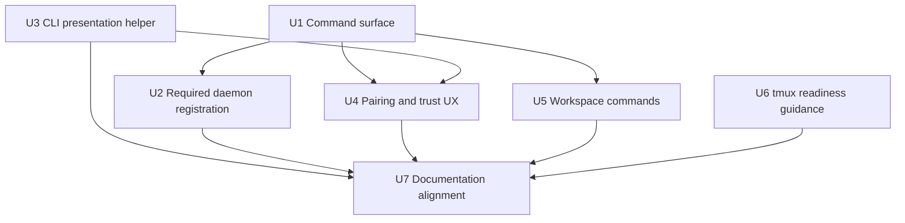

# feat: Simplify tunnel CLI daemon, workspace, and pairing

## Summary

Refactor the `tunnel` CLI around user intent: `daemon` becomes local daemon lifecycle only, `pair` owns pairing and trusted-client management, `workspace` owns tmux workspace view actions, `session` stays account-level live session management, and `run` always requires successful local daemon broker registration before launching the user's command.

The implementation should extend the existing Cobra command wiring, daemon control socket, local broker, pairing state, and session table foundations already present in `cmd/tunnel` and `internal/tunnel/daemon`, while deliberately avoiding Relay protocol redesign.

---

## Problem Frame

The origin requirements identify the current user-facing problem: `tunnel daemon` exposes too many unrelated internal concepts, and `tunnel run --daemon auto|off|required` lets local sessions bypass the daemon broker even though mobile-created and local-created sessions now need one local model (see origin: `docs/brainstorms/2026-05-14-tunnel-cli-daemon-workspace-pairing-requirements.md`).

The codebase already has much of the substrate: account-level `tunnel session list/stop`, launch source metadata, daemon control actions for pairing/trust, tmux workspace helpers, local broker registration, and tmux install guidance. This plan focuses on reorganizing those surfaces, tightening `tunnel run` startup semantics, and making the displayed CLI output feel designed rather than diagnostic.

---

## Requirements

- R1. `tunnel daemon` exposes only `start`, `status`, `stop`, and `doctor`.
- R2. `tunnel daemon start` remains idempotent and succeeds when a compatible daemon is already running.
- R3. Public daemon subcommands for pairing, devices, revoke, workspace, tmux session listing, and broker session inspection are removed.
- R4-R6. Top-level `tunnel pair`, `tunnel pair devices`, and `tunnel pair revoke <fingerprint>` own pairing and trusted-client management.
- R7-R8. `tunnel workspace open` and `tunnel workspace close` own workspace view lifecycle; no `workspace sessions`.
- R9. `tunnel session` exposes only `list` and `stop`.
- R10-R15. `tunnel run` has no public `--daemon` flag, requires a compatible daemon and broker registration before user command startup, and preserves the existing Relay startup gate.
- R16-R17. Mobile computer discovery may require an explicitly running daemon; no system service or login auto-start is added.
- R18-R23. `tunnel pair` supports the happy path in one interactive command: QR, wait, display device identity, prompt for SAS, confirm or cancel.
- R24-R25. Trusted-device fingerprints shown by `tunnel pair devices` are exactly what `tunnel pair revoke <fingerprint>` accepts.
- R26-R30. Workspace commands open/close the local tmux workspace view without becoming session management.
- R31-R39. `tunnel session list/stop` remain account-level live session operations and show enough context to avoid machine/source ambiguity.
- R40-R50. User-facing output is scannable, aligned, copy-friendly, emoji-free in tables, clear about unknown values, and avoids internal implementation terminology.

---

## Scope Boundaries

- No compatibility aliases for removed public commands.
- No public `tunnel run --daemon` option.
- No automatic tmux installation.
- No system service installation, launchd setup, systemd setup, or login auto-start setup.
- No `tunnel workspace sessions`.
- No `tunnel session start`.
- No local-only session stop path.
- No mobile app UI redesign beyond CLI-visible wording and metadata expectations.
- No direct QUIC, TLS, STUN, or relay-fallback protocol redesign.
- No Relay session stop redesign; current `GET /api/sessions` and `DELETE /api/sessions/:sessionID` behavior is treated as already available substrate.

---

## Context & Research

### Relevant Code and Patterns

- `cmd/tunnel/cmd.go` owns Cobra command wiring. It currently adds `run`, `auth`, `session`, `daemon`, `update`, `rollback`, and `version`; this is the primary place to add top-level `pair` and `workspace` while slimming `daemon`.
- `cmd/tunnel/args.go` owns hand-written help text and run argument types. It currently documents old daemon commands and `tunnel run --daemon`.
- `cmd/tunnel/main.go` owns `runTunnelSession`, daemon command handlers, QR rendering, pairing control calls, workspace helpers, daemon status/doctor rendering, tmux guidance, and `legacyLauncherCommand`.
- `cmd/tunnel/session_cmd.go` already has an account-level session table with `Scope`, `Source`, `Session`, `Label`, `Command`, `Machine`, `CWD`, and `Age`. It needs polish rather than a new concept.
- `cmd/tunnel/auth_api.go` already calls `GET /api/sessions` and `DELETE /api/sessions/:sessionID`.
- `internal/protocol/message.go` already has `SessionLaunchSourceLocal`, `SessionLaunchSourceMobile`, `LaunchContext`, and `StopSessionFrame`.
- `internal/relay/handler/new.go` already wires both `POST /api/sessions/:sessionID/stop` and `DELETE /api/sessions/:sessionID`; `cmd/tunnel` already uses `DELETE`.
- `internal/tunnel/daemon/control.go` exposes daemon RPC actions for status, doctor, pair, pending pairing, confirm pairing, devices, revoke, and broker sessions. Public CLI removal does not require deleting every internal daemon RPC action.
- `internal/tunnel/daemon/runtime.go` handles daemon-side pairing reservation, pending response storage, SAS confirmation, trust revocation, broker snapshot, and stop.
- `internal/tunnel/daemon/session_registration.go` owns `tunnel run` broker registration and context verification.
- `internal/tunnel/daemon/broker.go` owns the broker roster and currently accepts registration frames without an explicit public CLI-facing acknowledgement.
- `internal/tunnel/daemon/tmux.go` owns tmux availability checks, workspace open/close, and workspace session listing.
- `scripts/install-tunnel.sh` is published as public `install.sh`; `cmd/tunnel/update_cmd.go` owns native `tunnel update` and `rollback`.
- `docs/daemon.md`, `README.md`, `docs/architecture.md`, `docs/api.md`, `docs/protocol.md`, `CLAUDE.md`, and `AGENTS.md` describe the command and daemon contracts that will otherwise drift.

### Institutional Learnings

- No `docs/solutions/` directory exists in this worktree, so there are no prior solution write-ups to reuse.

### External References

- External research is not needed. This is a Go/Cobra/local-daemon refactor using repository-local patterns, not a new third-party framework or security protocol design.

---

## Key Technical Decisions

| Decision | Choice | Rationale |
| --- | --- | --- |
| Command compatibility | Clean break, no public aliases for removed daemon subcommands | Tunnel is still pre-release, and aliases would preserve the exact confusion this change removes. |
| `tunnel run` startup order | Keep Relay registration gate, then require daemon/broker readiness before terminal prep and child startup | This preserves the existing "must connect to Relay before local session starts" invariant while guaranteeing daemon-local visibility before the user command runs. |
| Broker readiness | Treat registration as ready only when the daemon broker has accepted the session id | A reachable daemon process is not enough; the product promise is that every `tunnel run` appears in the local broker roster. |
| Pair automation | Keep JSON output for `tunnel pair`, `tunnel pair devices`, and `tunnel pair revoke`; remove public `pending` and `confirm` commands | Automation can still fetch invitations and trust state, but normal users do not need invitation IDs or multi-command SAS flows. |
| Pair happy path | Implement one interactive `tunnel pair` command that polls pending responses until expiry/cancel, then asks for SAS | Current daemon pairing state already stores pending responses; the CLI can compose the existing daemon RPCs into the intended UX. |
| Source display | Use `local`, `mobile`, and `unknown` in `tunnel session list` | This keeps existing user vocabulary while avoiding false certainty when launch source metadata is absent. |
| Table rendering | Add a small local table helper; no third-party dependency | Existing output is already hand-rendered, and the needed behavior is narrow: alignment, truncation, empty values, and copy-critical identifiers. |
| Workspace commands | Move open/close to `tunnel workspace`; do not expose workspace listing | Workspace is a view lifecycle concept, while live work remains under `tunnel session`. |
| tmux setup | Warn during install/update and runtime checks; never auto-install | This gives mobile readiness guidance without surprising users with package-manager or privilege side effects. |

---

## Open Questions

### Resolved During Planning

- **Should `session list` display source as `run/mobile/unknown` or `local/mobile/unknown`?** Use `local/mobile/unknown`.
- **Should pairing automation retain JSON support?** Yes, for top-level pair invitation creation, trusted-device listing, and revoke results.
- **Should public `pair pending` and `pair confirm` remain?** No. The interactive `tunnel pair` flow owns pending response discovery and SAS confirmation.
- **Should table rendering use a third-party library?** No. A small local helper is enough and keeps release surface smaller.
- **Should this plan redesign Relay session stop?** No. Current Relay/API/protocol code already has the desired session stop path.
- **Should tmux be auto-installed?** No. Install/update/runtime should provide clear manual guidance only.

### Deferred to Implementation

- **Exact broker readiness mechanism:** The implementation may use an explicit broker acknowledgement, an internal broker snapshot confirmation, or an equivalent readiness signal, as long as tests prove the daemon accepted the session id before the child process starts.
- **Exact countdown rendering for interactive pairing:** Keep the 5-minute product behavior, but tune redraw cadence and terminal fallback during implementation.
- **Exact table width constants:** Use the origin examples as the target shape, but adjust widths if tests reveal better alignment.
- **Exact box-drawing fallback:** Default output should be designed and aligned; implementation can fall back to ASCII borders if terminal constraints make that necessary.

---

## High-Level Technical Design

> *This illustrates the intended approach and is directional guidance for review, not implementation specification. The implementing agent should treat it as context, not code to reproduce.*

### Command Ownership After The Change

| Command area | Public commands after implementation | Backing substrate |
| --- | --- | --- |
| `daemon` | `start`, `status`, `stop`, `doctor` | Existing daemon control and doctor/status code |
| `pair` | default interactive flow, `devices`, `revoke <fingerprint>` | Existing pair invitation, pending response, confirm, trusted device, and revoke daemon RPCs |
| `workspace` | `open`, `close` | Existing tmux workspace helpers |
| `session` | `list`, `stop <session-id>` | Existing relay session list/stop API client |
| `run` | `run [flags] <command>` without `--daemon` | Existing Relay connector plus required daemon broker registration |

### Implementation Unit Dependencies

---

## Implementation Units

### U1. Reshape the public CLI command surface

**Goal:** Rewire the public command tree so users see the new `daemon`, `pair`, `workspace`, `session`, and `run` ownership model.

**Requirements:** R1-R10, R26-R30, R49

**Dependencies:** None

**Files:**
- Modify: `cmd/tunnel/cmd.go`
- Modify: `cmd/tunnel/args.go`
- Modify: `cmd/tunnel/main.go`
- Test: `cmd/tunnel/args_test.go`
- Test: `cmd/tunnel/main_test.go`

**Approach:**
- Keep `daemon internal-run` hidden for background process startup.
- Slim `newDaemonCmd` so public children are only `start`, `status`, `stop`, and `doctor`.
- Add top-level `pair` and `workspace` command groups.
- Keep `session list` and `session stop` as the only public session children.
- Remove `--daemon` from the public `run` command and from help text.
- Update root help examples so removed daemon subcommands disappear and new top-level commands are discoverable.
- Update `legacyLauncherCommand` so `pair` and `workspace` are treated as command words, not legacy launcher names.
- Preserve hidden launch metadata flags used by daemon-launched `tunnel run` sessions.

**Patterns to follow:**
- Existing Cobra command construction in `cmd/tunnel/cmd.go`.
- Hand-written help text style in `cmd/tunnel/args.go`.
- Existing fast-path/help tests in `cmd/tunnel/main_test.go`.

**Test scenarios:**
- Happy path: `tunnel --help` includes `pair` and `workspace`, and no longer includes `tunnel daemon open`, `tunnel daemon close`, `tunnel daemon sessions`, `tunnel daemon pair`, `tunnel daemon devices`, `tunnel daemon revoke`, or `tunnel daemon broker sessions`.
- Happy path: `tunnel daemon --help` lists only `start`, `status`, `stop`, and `doctor`.
- Happy path: `tunnel pair --help`, `tunnel pair devices --help`, `tunnel pair revoke --help`, `tunnel workspace open --help`, and `tunnel workspace close --help` render command-specific help.
- Edge case: `tunnel run --daemon off codex` fails as an unknown run flag and does not launch the command.
- Edge case: `tunnel pair` is not treated as a legacy launcher invocation.
- Edge case: `tunnel workspace` without a child prints workspace help rather than trying to launch `workspace`.
- Regression: hidden `--launch-source` and `--launch-request-id` still parse for daemon-created sessions.

**Verification:**
- The public command tree matches the origin command ownership table, and removed daemon subcommands are no longer discoverable or callable as public CLI commands.

---

### U2. Make `tunnel run` require daemon broker registration

**Goal:** Ensure every local `tunnel run` session is daemon-visible before the user command starts, while preserving the existing Relay startup gate.

**Requirements:** R11-R17, R31-R39

**Dependencies:** U1

**Files:**
- Modify: `cmd/tunnel/args.go`
- Modify: `cmd/tunnel/cmd.go`
- Modify: `cmd/tunnel/main.go`
- Modify: `internal/tunnel/daemon/session_registration.go`
- Modify: `internal/tunnel/daemon/session_registration_test.go`
- Modify: `internal/tunnel/daemon/broker.go`
- Modify: `internal/tunnel/daemon/broker_test.go`
- Test: `cmd/tunnel/args_test.go`
- Test: `cmd/tunnel/main_test.go`

**Approach:**
- Remove `DaemonMode` from public run argument flow.
- Keep the existing Relay connector startup wait as a required gate.
- After Relay registration succeeds and before local terminal prep/child startup, ensure a compatible daemon is running and that the broker accepts this session id.
- Treat daemon base URL and auth-context mismatches as startup failures with actionable guidance, not silent broker skips.
- Convert `ensureDaemonForTunnelRun` or its replacement from a boolean "best effort" helper into a result that can explain platform unsupported, status failure, start failure, base URL mismatch, auth-context mismatch, broker socket unavailable, or registration timeout.
- Add a bounded broker-registration readiness path. It can be implemented by an explicit broker acknowledgement, an internal broker snapshot confirmation, or an equivalent signal, but it must prove the daemon accepted the session id before the user command is launched.
- Keep the long-lived registration sink after readiness so preview, snapshots, live bytes, resize, and input continue to flow for the session lifetime.
- On startup failure, print a cause and the next action `tunnel daemon start`. If the daemon is already running with incompatible context, include enough context for the user to stop/restart intentionally.

**Execution note:** Add characterization coverage around current run startup ordering before changing the daemon mode behavior; this is a cross-layer startup path and false positives can prevent local work from starting.

**Patterns to follow:**
- Existing Relay startup gating in `runTunnelSession`.
- Existing daemon context validation in `ensureDaemonForTunnelRun`.
- Existing session registration reconnect/backoff behavior in `internal/tunnel/daemon/session_registration.go`.
- Existing broker session registration and snapshot behavior in `internal/tunnel/daemon/broker.go`.

**Test scenarios:**
- Happy path: `tunnel run codex` connects to Relay, ensures a compatible daemon, registers with the broker, then starts the child command with the daemon broker sink attached.
- Happy path: when the daemon is already running on the same base URL and auth context, `tunnel run` uses it without starting another daemon.
- Happy path: when the daemon is not running and auth is available, `tunnel run` starts it, confirms broker readiness, and launches the user command.
- Edge case: daemon already running with a different base URL fails before local terminal prep and before child startup.
- Edge case: daemon already running with a different auth context fails before child startup.
- Edge case: broker registration times out after daemon start; the user command is not launched and the message points to `tunnel daemon start`.
- Edge case: unsupported daemon platform fails before child startup.
- Error path: Relay startup still fails before daemon requirements can mask the Relay failure.
- Error path: missing auth still produces the existing auth failure before child startup.
- Regression: daemon-launched `tunnel run` still carries hidden launch context and registers with `launch_source: mobile`.

**Verification:**
- A successful local `tunnel run` always appears in the daemon broker roster, and every daemon/broker failure path stops before launching the user's command with an actionable message.

---

### U3. Create shared CLI presentation helpers and polish `session list`

**Goal:** Make session and trust listings aligned, copy-friendly, and consistent with the new product vocabulary.

**Requirements:** R31-R35, R40-R50

**Dependencies:** None

**Files:**
- Create: `cmd/tunnel/table.go`
- Create: `cmd/tunnel/table_test.go`
- Modify: `cmd/tunnel/session_cmd.go`
- Test: `cmd/tunnel/session_cmd_test.go`

**Approach:**
- Extract table rendering, tail truncation, middle truncation, empty-value handling, and optional identifier preservation into a small local helper.
- Keep default tables emoji-free.
- Render `Source` as `local`, `mobile`, or `unknown`. Do not display `run`.
- Render `Scope` as `local`, `remote`, or `unknown` based on stable daemon/device identity comparison.
- Use `This machine` for the current machine when the session device id matches the local daemon identity.
- Prefer computer name for remote machine display; avoid exposing `platform_id` in the default table.
- Show empty optional values as `-`, and show unknown values as `unknown` when the distinction matters.
- Preserve copy-critical identifiers such as session ids and fingerprints ahead of truncating human labels or paths.
- Keep `CWD` middle truncation so both leading path context and final directory remain visible.

**Patterns to follow:**
- Existing `session_cmd.go` table shape and session row builder.
- Existing `session_cmd_test.go` coverage for truncation and platform id omission.

**Test scenarios:**
- Happy path: `tunnel session list` shows `Scope`, `Source`, `Session`, `Label`, `Command`, `Machine`, `CWD`, and `Age`.
- Happy path: `tunnel session list --json` returns stable account-level session fields for automation without terminal presentation escaping or truncation.
- Happy path: a local CLI-created session displays `Source` as `local`.
- Happy path: a mobile-created session displays `Source` as `mobile`.
- Edge case: missing or unrecognized launch source displays `unknown`.
- Edge case: matching local device id displays `Scope` as `local` and machine as `This machine`.
- Edge case: missing local device identity displays `Scope` as `unknown` rather than guessing.
- Edge case: long labels, commands, and machine names are truncated without truncating normal-width session ids.
- Edge case: long CWD uses middle truncation and keeps the final directory visible.
- Regression: default output does not include `platform_id`.
- Regression: empty live session list remains clear and not table-noisy.

**Verification:**
- `session list` output is readable at a glance, distinguishes machine and source correctly, and keeps session ids copyable.

---

### U4. Implement top-level pairing and trust UX

**Goal:** Move pairing and trusted-client management to `tunnel pair`, with a one-command human pairing flow and copy-friendly trusted-device output.

**Requirements:** R4-R6, R18-R25, R40-R50

**Dependencies:** U1, U3

**Files:**
- Modify: `cmd/tunnel/cmd.go`
- Modify: `cmd/tunnel/main.go`
- Modify: `cmd/tunnel/args.go`
- Test: `cmd/tunnel/main_test.go`
- Test: `internal/tunnel/daemon/pairing_state_test.go`
- Test: `internal/tunnel/daemon/connectivity_connector_test.go`

**Approach:**
- Wire `tunnel pair` as the default interactive command.
- Keep `tunnel pair --json` as non-interactive invitation creation output for automation and tests.
- In human mode, create an invitation, render the QR, show expiry/cancel guidance, poll pending pairing responses for that invitation, show the requesting device identity, prompt for the 6-digit SAS, and confirm through the existing daemon confirm action.
- Use the invitation's existing 5-minute lifetime as the default wait window.
- Treat Ctrl-C, expiry, daemon stop, and SAS mismatch as cancelled pairing attempts that do not create trust.
- Do not expose public `tunnel pair pending` or `tunnel pair confirm`.
- Wire `tunnel pair devices` and `tunnel pair revoke <fingerprint>`.
- Use the shared table helper for `pair devices`, with `Fingerprint` as the first copy-critical column.
- Keep `--json` support for `pair devices` and `pair revoke`.
- Rename human copy from "Android" or "daemon" where possible to "client", "device", "computer", or "pairing" while preserving existing internal types.

**Execution note:** Implement the interactive flow with injectable timing/polling hooks in tests so timeout and pending-response behavior can be proven without slow tests.

**Patterns to follow:**
- Existing QR rendering and decode test in `cmd/tunnel/main_test.go`.
- Existing daemon pairing RPC wrappers in `cmd/tunnel/main.go`.
- Existing pending response storage and SAS mismatch behavior in `internal/tunnel/daemon/pairing_state.go`.
- Existing daemon JSON error envelope behavior.

**Test scenarios:**
- Happy path: `tunnel pair` renders a QR, waits for a pending response, displays device name/fingerprint, accepts matching SAS input, confirms pairing, and prints a paired message.
- Happy path: `tunnel pair --json` returns the invitation JSON without entering the interactive wait.
- Happy path: `tunnel pair devices` renders a table whose first column is the full fingerprint accepted by revoke.
- Happy path: `tunnel pair devices --json` returns trusted-device JSON.
- Happy path: `tunnel pair revoke <fingerprint>` revokes the exact fingerprint shown by devices.
- Happy path: `tunnel pair revoke <fingerprint> --json` returns revoked-device JSON.
- Edge case: no paired devices prints a concise empty-state message.
- Edge case: no pending response before expiry exits without storing trust and explains that the invitation expired.
- Edge case: Ctrl-C cancels without storing trust.
- Error path: SAS mismatch consumes/cancels the invitation and tells the user to run `tunnel pair` again.
- Error path: daemon not running returns a structured JSON envelope in JSON mode and actionable human guidance in human mode.
- Regression: terminal QR output still decodes to the original invitation payload.

**Verification:**
- A real user can complete pairing from one terminal command without copying invitation ids, and can later identify and revoke trusted clients using the displayed fingerprint.

---

### U5. Move workspace view actions to `tunnel workspace`

**Goal:** Make workspace open/close a dedicated command area and remove tmux workspace inventory from the public CLI.

**Requirements:** R7-R8, R26-R30, R49

**Dependencies:** U1

**Files:**
- Modify: `cmd/tunnel/cmd.go`
- Modify: `cmd/tunnel/main.go`
- Modify: `cmd/tunnel/args.go`
- Test: `cmd/tunnel/main_test.go`
- Test: `internal/tunnel/daemon/tmux_test.go`

**Approach:**
- Add `tunnel workspace open` and `tunnel workspace close`.
- Reuse existing daemon tmux helpers for open/close behavior.
- Rename user-facing messages from "daemon workspace" to "Tunnel workspace" or "workspace view" where that improves clarity.
- Keep `close` as detach/close-one-view only; it must not stop daemon or sessions.
- Remove public tmux workspace session listing. The underlying daemon helper can remain for daemon internals and tests, but there is no public `workspace sessions` command.
- Make empty workspace messages clear about the state and point users to `tunnel session list` for live session management when useful.

**Patterns to follow:**
- Existing `runDaemonOpen`, `runDaemonClose`, and tmux helper tests.
- `docs/daemon.md` distinction between workspace close and session stop.

**Test scenarios:**
- Happy path: `tunnel workspace open` calls the existing workspace attach helper.
- Happy path: `tunnel workspace close` detaches one open workspace view and prints a workspace-view closed message.
- Edge case: missing tmux returns install guidance and does not claim daemon failure.
- Edge case: empty workspace prints a clear no-workspace/no-mobile-work message.
- Edge case: no open workspace view exits successfully with a clear message.
- Error path: `tunnel workspace sessions` is not a valid public command.
- Error path: removed `tunnel daemon open`, `tunnel daemon close`, and `tunnel daemon sessions` are not valid public commands.
- Regression: workspace close never stops daemon or live sessions.

**Verification:**
- Workspace commands read as view lifecycle controls and cannot be confused with account-level session listing or stopping.

---

### U6. Add non-blocking tmux readiness guidance to install and update paths

**Goal:** Help users prepare for mobile-created sessions without automatically installing tmux.

**Requirements:** R16-R17, R26-R30

**Dependencies:** None

**Files:**
- Modify: `scripts/install-tunnel.sh`
- Test: `scripts/test-release-installer.sh`
- Modify: `cmd/tunnel/update_cmd.go`
- Test: `cmd/tunnel/update_cmd_test.go`
- Modify: `cmd/tunnel/main.go`
- Test: `cmd/tunnel/main_test.go`

**Approach:**
- Add a shell-side tmux check after successful install in `scripts/install-tunnel.sh`.
- Print a warning and platform-specific install command when tmux is missing; do not fail the install.
- Add a Go-side tmux readiness warning after successful `tunnel update` when tmux is missing.
- Reuse or consolidate wording with existing runtime `daemonTmuxInstallGuidance` so install/update/workspace/daemon messages do not drift.
- Keep `tunnel rollback` behavior focused on rollback unless implementation finds that update and rollback share one post-install message path cleanly.
- Ensure `tunnel daemon start` remains valid without tmux and reports degraded launch readiness, not process startup failure.

**Patterns to follow:**
- Current distro-specific tmux guidance in `daemonTmuxInstallGuidance`.
- Release installer tests in `scripts/test-release-installer.sh`.
- Native update tests in `cmd/tunnel/update_cmd_test.go`.

**Test scenarios:**
- Happy path: installer succeeds and prints no tmux warning when `tmux` is present.
- Happy path: installer succeeds and prints a non-blocking tmux warning when `tmux` is missing.
- Happy path: native `tunnel update` succeeds and prints a non-blocking tmux warning when `tmux` is missing.
- Edge case: tmux warning does not obscure checksum/install failure messages.
- Edge case: unsupported or unknown Linux distro gets generic package-manager guidance.
- Regression: daemon startup without tmux still starts the daemon and reports degraded launch readiness.
- Regression: `tunnel update` no-op behavior remains unchanged except for any intended post-update readiness messaging.

**Verification:**
- Fresh installs and updates guide users toward mobile-session readiness while never invoking package managers or requiring elevated privileges.

---

### U7. Align docs and agent guidance with the new CLI contract

**Goal:** Keep user docs, daemon contract docs, and agent instructions from describing removed commands or optional daemon behavior.

**Requirements:** R1-R50

**Dependencies:** U1, U2, U3, U4, U5, U6

**Files:**
- Modify: `README.md`
- Modify: `docs/daemon.md`
- Modify: `docs/architecture.md`
- Modify: `docs/api.md`
- Modify: `docs/protocol.md`
- Modify: `docs/connectivity/README.md`
- Modify: `docs/connectivity/protocol/local-broker.md`
- Modify: `docs/public-distribution-readme.md`
- Modify: `docs/release-distribution.md`
- Modify: `CLAUDE.md`
- Modify: `AGENTS.md`

**Approach:**
- Update user-facing command examples to show `tunnel daemon start/status/stop/doctor`, `tunnel pair`, `tunnel pair devices`, `tunnel pair revoke`, `tunnel workspace open/close`, and `tunnel session list/stop`.
- Remove documentation of `tunnel run --daemon`, `tunnel daemon broker sessions`, `tunnel daemon pair pending`, `tunnel daemon pair confirm`, `tunnel daemon devices`, `tunnel daemon revoke`, `tunnel daemon open`, `tunnel daemon close`, and `tunnel daemon sessions` as public commands.
- Update `docs/daemon.md` so the daemon implementation contract distinguishes internal daemon RPCs from public CLI commands.
- Update local broker docs to say `tunnel run` requires daemon broker registration instead of best-effort registration.
- Update distribution docs and public README to mention tmux readiness warnings without implying auto-install.
- Keep API/protocol docs focused on already-current session list/stop behavior; do not invent new Relay endpoints.
- Keep AGENTS/CLAUDE guidance aligned so future agents do not reintroduce old command names.

**Patterns to follow:**
- Existing concise README command sections.
- `docs/daemon.md` implementation contract style.
- Existing docs expectation list in `AGENTS.md`.

**Test scenarios:**
- Test expectation: none -- documentation-only unit. Verification is by grep and review against the implemented command surface.

**Verification:**
- User docs and agent guidance describe the same public CLI that `tunnel --help` exposes, and no primary docs recommend removed daemon subcommands or optional daemon mode.

---

## System-Wide Impact

- **Interaction graph:** The change crosses CLI command routing, run startup, daemon broker registration, daemon pairing control, tmux workspace helpers, release installer/update messaging, and docs. It does not require Relay API or protocol changes.
- **Error propagation:** `tunnel run` becomes stricter. Daemon/broker errors must produce actionable CLI failures before terminal prep or child startup, while Relay startup errors remain distinct.
- **State lifecycle risks:** Interactive pairing creates invitations and may observe pending responses; timeout, cancellation, and SAS mismatch must not leave trusted devices behind. `tunnel run` pre-registration must clean up if startup fails after the broker accepts the session id.
- **API surface parity:** Public CLI help, README examples, daemon docs, and agent instructions must move together because this is a clean break with no compatibility aliases.
- **Integration coverage:** Unit tests should cover command routing, run startup ordering, broker readiness, interactive pairing, workspace migration, table rendering, and install/update tmux warnings. Manual verification should include at least one real QR scan once implementation exists.
- **Unchanged invariants:** Relay remains the account-level live session authority. `tunnel session stop` stops live sessions through the existing Relay stop path. The daemon remains a local runtime and tmux workspace owner, not the PTY owner for `tunnel run`.

---

## Risks & Dependencies

| Risk | Mitigation |
| --- | --- |
| Required daemon registration makes local `tunnel run` more failure-prone | Keep Relay and daemon failures clearly separated, make `daemon start` idempotent, and provide explicit next actions. |
| Broker readiness check could race and reject otherwise healthy runs | Use a bounded readiness signal with focused tests for cold start, already-running daemon, and reconnect paths. |
| Removing public commands breaks local scripts used during development | This is an accepted clean break before external release; preserve JSON modes under new commands for automation. |
| Interactive pairing could become flaky in tests due to timers and polling | Inject clock/sleep/polling hooks or isolate the polling loop so timeout and pending response tests run deterministically. |
| Table output could become beautiful but hard to copy | Treat session ids and fingerprints as copy-critical and truncate labels/paths before identifiers. |
| tmux warnings could feel noisy | Print only after install/update success or when users invoke daemon/workspace paths that actually need the guidance. |
| Docs may continue to mention old daemon commands | Include a documentation unit with targeted search review for old command spellings. |

---

## Documentation / Operational Notes

- This is a pre-release clean break; no rollout alias period is planned.
- `tunnel daemon start` remains the explicit onboarding action that makes the computer discoverable to mobile clients after reboot or periods without local `tunnel run` usage.
- The installer and updater should guide users to install tmux manually, but they must not invoke `brew`, `apt`, `dnf`, `yum`, `pacman`, or any other package manager.
- Manual smoke verification after implementation should cover: `tunnel --help`, `tunnel daemon --help`, `tunnel pair --help`, `tunnel workspace --help`, `tunnel run` with daemon already running, `tunnel run` with daemon stopped, a QR pairing happy path, `tunnel pair devices`, and `tunnel session list`.

---

## Sources & References

- **Origin document:** `docs/brainstorms/2026-05-14-tunnel-cli-daemon-workspace-pairing-requirements.md`
- Related plan: `docs/plans/2026-04-22-001-feat-unified-session-management-plan.md`
- Related plan: `docs/plans/2026-04-29-001-feat-connectivity-local-broker-plan.md`
- Related plan: `docs/plans/2026-05-06-001-feat-mobile-pairing-readiness-plan.md`
- Related code: `cmd/tunnel/cmd.go`
- Related code: `cmd/tunnel/args.go`
- Related code: `cmd/tunnel/main.go`
- Related code: `cmd/tunnel/session_cmd.go`
- Related code: `cmd/tunnel/auth_api.go`
- Related code: `internal/tunnel/daemon/control.go`
- Related code: `internal/tunnel/daemon/runtime.go`
- Related code: `internal/tunnel/daemon/session_registration.go`
- Related code: `internal/tunnel/daemon/broker.go`
- Related code: `internal/tunnel/daemon/tmux.go`
- Related code: `scripts/install-tunnel.sh`
