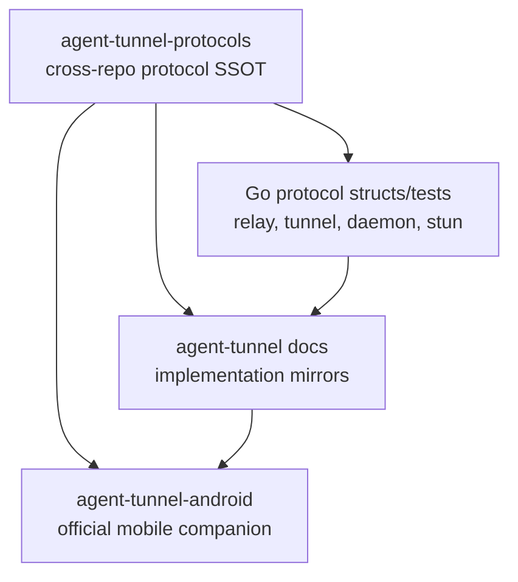
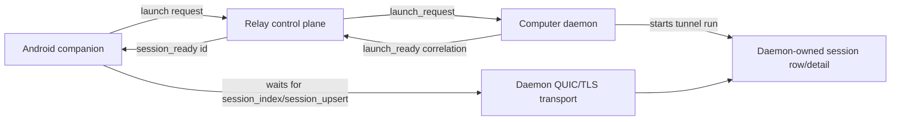

# refactor: Align Protocol SSOT And Retire Mobile Legacy Relay Sessions

## Summary

This plan makes `https://github.com/yuanbohan/agent-tunnel-protocols` the cross-repository protocol source of truth, then aligns this repository's docs, protocol tests, and mobile companion contract around daemon-owned session authority. Relay remains the app auth, pairing, presence, rendezvous, fallback, and computer-launch control plane; the official mobile companion must stop treating Relay session list/detail/attach/stop APIs as its session authority after launch.

### Issue Slice Mapping

- **#132:** U1 + U2. Point important protocol entry docs to the protocol SSOT, narrow repo-local source-of-truth/canonical wording, and split the official mobile companion contract from retained classic Relay session APIs.
- **#133:** U3. Verify and document launch-to-daemon session convergence so `session_ready.session_id` is a control-plane correlation result, not a reason for Android to poll Relay sessions.
- **#134:** U4 + U5. Align protocol mirrors/compatibility markers and fence retained classic Relay session implementation from the official mobile companion path.
- **#135:** U6. Clean active handoff docs and issue references after the protocol and mobile companion split is clear.

---

## Problem Frame

Android is retiring its legacy Relay session surface. The current `agent-tunnel` docs still contain multiple local "source of truth" claims and still document `GET /api/sessions`, Relay attach, and Relay stop as normal app-facing session flows. That was useful while Relay attach was the only mobile path, but it now conflicts with the daemon transport direction and makes Android deletion work easier to accidentally reverse.

Issue #131 captures the immediate upstream need: make launch through Relay converge to daemon-owned session state and make the official mobile companion contract explicit. The new protocols repository raises the bar further: this repo should implement and mirror the shared protocol, not be the cross-client protocol SSOT.

---

## Assumptions

*This plan was authored without a separate synchronous confirmation checkpoint. The items below are agent inferences that should be reviewed before implementation proceeds.*

- `agent-tunnel-protocols` will own cross-repository protocol decisions, collaborative agreement notes, and compatibility-line guidance; this repository will keep implementation-specific mirrors and operational docs.
- This plan should not delete the existing Relay `/api/sessions` or Relay attach implementation unless a later SSOT decision explicitly retires classic/non-companion clients.
- The immediate mobile companion cutover can use Relay `session_ready.session_id` only as a launch correlation key; visible rows and interactive traffic come from daemon transport `session_index` or `session_upsert`.

---

## Requirements

- R1. Important docs in this repository must point to `https://github.com/yuanbohan/agent-tunnel-protocols` as the protocol SSOT for cross-repository work.
- R2. Existing local "source of truth" wording must be narrowed to implementation, API mirror, or operational scope so it does not compete with the protocol SSOT.
- R3. Official mobile companion docs must say Relay is not the authority for session roster, previews, terminal snapshots/live bytes, input, resize, or mobile session detail after launch.
- R4. Relay auth, app sessions, pairing, computer presence, rendezvous hints, fallback tunnel token issuance/packet forwarding, account policy, and computer launch must remain in scope and documented.
- R5. `POST /api/computers/:computerID/sessions` must be documented and verified as a control-plane launch operation whose successful `session_ready` converges to daemon transport session state.
- R6. Retained Relay session APIs must be clearly outside the official mobile companion session authority, while preserving their current behavior for any still-supported classic clients.
- R7. Protocol structs, frame type constants, compatibility version, and tests in this repository must be traceable to the protocol SSOT or to a documented temporary mirror.
- R8. Android retirement work must be able to cite this repo's docs and #131 as the upstream contract for deleting legacy Relay session list/detail/attach/monitoring/notification behavior.

---

## Scope Boundaries

- Do not implement the Android deletion work in this repository.
- Do not move all local implementation docs into `agent-tunnel-protocols`; keep repo-local daemon, relay, deployment, and implementation notes here.
- Do not remove Relay as a platform component.
- Do not remove Relay session endpoints in this plan unless the SSOT explicitly decides they no longer serve any supported client.
- Do not redesign the unified Session/Terminal product model here; align with the existing session/terminal unification tracker instead.
- Do not introduce automatic schema or deployment migrations.

### Deferred to Follow-Up Work

- Protocol repository population: seed `agent-tunnel-protocols` with the canonical cross-repo protocol set and agreement records if it is still empty when implementation starts.
- Android implementation: complete Android issues #171, #172, and #173 in `agent-tunnel-android` after this upstream contract is clear enough to cite.
- Full classic Relay endpoint retirement: decide later, from the protocol SSOT, whether non-companion Relay session APIs should remain indefinitely or be removed in a compatibility-line break.

---

## Context & Research

### Relevant Code and Patterns

- `README.md`, `docs/api.md`, `docs/protocol.md`, `docs/architecture.md`, `docs/connectivity/README.md`, and `docs/connectivity/contract.md` currently define or summarize public protocol behavior and should carry the SSOT pointer.
- `docs/api.md` currently calls itself the source of truth for relay public app-facing APIs. That wording should become repo-local API mirror/implementation contract wording and link to the protocol SSOT for cross-repo protocol decisions.
- `docs/protocol.md` currently lists `GET /api/sessions`, Relay attach, and Relay stop as app-facing session flows. It needs an explicit split between classic Relay attach clients and official mobile companion daemon transport.
- `docs/connectivity/protocol/relay.md` already states Relay does not own session discovery, preview authority, or interactive authority. This is the strongest existing pattern to extend.
- `docs/connectivity/protocol/transport.md` already says `session_index`, `session_upsert`, preview, interactive, input, and resize live in daemon transport and that Relay does not expose sessions in the target design.
- `docs/connectivity/ux/android.md` already says Android should not reintroduce session discovery or interactive control on the Relay plane.
- `internal/connectivity/sessionproto/sessionproto.go` and `internal/connectivity/frame/frame.go` define the daemon transport payload and frame registry currently mirrored by Go tests.
- `internal/tunnel/daemon/connectivity_transport.go` emits `session_index` before deltas and maps broker sessions into daemon transport metadata.
- `internal/relay/handler/api/devices.go`, `internal/relay/device/registry.go`, `internal/relay/handler/ws_api_test.go`, and `internal/relay/handler/rest_api_test.go` cover computer launch and `session_ready` behavior.
- `internal/relay/handler/api/sessions.go`, `internal/relay/handler/attach/ws.go`, and `internal/relay/session/registry.go` remain the classic Relay session and attach implementation.

### Institutional Learnings

- No `docs/solutions/` entries exist in this repository.

### External References

- `agent-tunnel-protocols`: https://github.com/yuanbohan/agent-tunnel-protocols currently exists as a new repository with only a minimal `README.md`.
- Upstream issue #131: https://github.com/yuanbohan/agent-tunnel/issues/131.
- Android retirement plan: `agent-tunnel-android:docs/plans/2026-05-15-002-refactor-retire-legacy-relay-sessions-plan.md`.
- Android alignment plan: `agent-tunnel-android:docs/plans/2026-05-15-001-feat-updated-tunnel-contract-alignment-plan.md`.

---

## Key Technical Decisions

- **Make SSOT explicit but keep local mirrors useful:** Local docs should remain readable and actionable, but every cross-repo protocol decision should point readers to `agent-tunnel-protocols`.
- **Separate official mobile companion from classic Relay attach:** Avoid deleting classic behavior by accident, while making it impossible for Android planning to infer that Relay session list/detail/attach is still the official companion path.
- **Treat launch as control-plane correlation:** `session_ready` means the launch request succeeded and produced a concrete session id; mobile visibility still waits for daemon transport session state.
- **Add tests where docs make convergence claims:** If docs say launch-ready sessions appear through daemon transport, tests should prove the current broker/transport path can emit that session id in `session_index` or `session_upsert`.
- **Prefer contract fixtures over prose drift:** If `agent-tunnel-protocols` gains machine-readable fixtures, this repo should consume or mirror them in protocol tests. Until then, tests should pin the Go mirror and explicitly cite the SSOT.

---

## Open Questions

### Resolved During Planning

- Should this plan move Relay auth, pairing, presence, rendezvous, fallback, or computer launch out of Relay? No. Those remain Relay responsibilities.
- Should this plan remove existing Relay session endpoints immediately? No. The immediate cutover is mobile-companion authority, not classic endpoint deletion.
- Should this plan treat current `docs/api.md` as the cross-repo SSOT? No. It becomes this repo's implementation/API mirror and links to the protocols repo for cross-repo decisions.

### Deferred to Implementation

- Whether the protocols repo will expose Markdown-only docs first or machine-readable protocol fixtures in the same pass.
- Whether daemon transport `SessionMetadata` needs extra fields for mobile convergence beyond `session_id`; current Android can scope rows under the selected computer transport, but the SSOT may require explicit association fields.
- Exact wording for deprecating companion use of Relay session endpoints without over-promising endpoint removal.

---

## High-Level Technical Design

> This diagram is directional guidance for review, not an implementation specification.

Mobile companion session authority after this alignment:

---

## Implementation Units

### U1. Mark Protocol SSOT In Current Repository Docs

**Goal:** Make the protocols repo discoverable from every important repo-local protocol entry point.

**Requirements:** R1, R2; GitHub issue #132

**Dependencies:** A reachable `https://github.com/yuanbohan/agent-tunnel-protocols` repository.

**Files:**
- Modify: `README.md`
- Modify: `AGENTS.md`
- Modify: `CLAUDE.md`
- Modify: `docs/api.md`
- Modify: `docs/protocol.md`
- Modify: `docs/architecture.md`
- Modify: `docs/connectivity/README.md`
- Modify: `docs/connectivity/contract.md`
- Modify: `docs/connectivity/protocol/relay.md`
- Modify: `docs/connectivity/protocol/transport.md`

**Approach:**
- Add a short protocol ownership note near the top of the main docs.
- Reword local "source of truth" claims as repo-local implementation/API mirrors.
- Keep local docs self-contained enough for contributors working only in this repo, but make the cross-repo authority obvious.
- Preserve operational/local truth claims that are not cross-repository protocol ownership claims, such as deployment runtime state and PostgreSQL auth/operator durability.

**Patterns to follow:**
- Existing docs use concise top-of-file status sections; keep the SSOT pointer in that style.
- `docs/connectivity/protocol/relay.md` already has the right Relay responsibility split and should guide wording.

**Test scenarios:**
- Documentation: a contributor starting from `README.md`, `docs/api.md`, `docs/protocol.md`, or `docs/connectivity/README.md` can find the protocol SSOT link quickly.
- Documentation: `rg "source of truth|canonical|must-ship contract" README.md docs AGENTS.md CLAUDE.md` shows no unqualified cross-repo SSOT claims left in this repo.
- Documentation: repo-local API, deployment, database, and daemon-state authority statements remain scoped to their local domain instead of being removed indiscriminately.

**Verification:**
- Docs explain that `agent-tunnel-protocols` owns cross-repo protocol decisions and agreements.
- Issue #132's SSOT discovery and source-of-truth cleanup checks can be marked complete without relying on later implementation units.

---

### U2. Split Mobile Companion Contract From Classic Relay Session APIs

**Goal:** Make official Android companion behavior daemon-transport-first while preserving current classic Relay session API documentation where still supported.

**Requirements:** R3, R4, R6, R8; GitHub issue #132

**Dependencies:** U1

**Files:**
- Modify: `README.md`
- Modify: `AGENTS.md`
- Modify: `CLAUDE.md`
- Modify: `docs/api.md`
- Modify: `docs/protocol.md`
- Modify: `docs/architecture.md`
- Modify: `docs/connectivity/architecture.md`
- Modify: `docs/connectivity/ux/android.md`
- Modify: `docs/connectivity/reference/sequence-flows.md`
- Modify: `docs/connectivity/reference/state-machines.md`
- Modify as needed: `docs/connectivity/implementation/step-06-android-companion.md`

**Approach:**
- Add an explicit "official mobile companion" lane: Relay handles auth/pairing/presence/rendezvous/fallback/computer launch; daemon transport handles session roster, preview, interactive attach, input, resize, and detail.
- Move `GET /api/sessions`, Relay attach websocket, and Relay stop wording into a classic/retained Relay session lane instead of describing them as the companion path.
- Keep endpoint request/response examples for retained APIs, but label their mobile companion status clearly.
- Update sequence/state docs so launch completion flows through daemon transport state instead of Relay session list polling.
- In `docs/api.md`, keep `POST /api/computers/:computerID/sessions` as an app-facing Relay control-plane endpoint, but change any "session appears in `GET /api/sessions`" companion guidance to "wait for daemon transport `session_index` or `session_upsert` for the matching session id."
- In `AGENTS.md` and `CLAUDE.md`, distinguish account-level/classic Relay viewing from the official mobile companion path so future coding agents do not reintroduce Android Relay session authority while following repo instructions.

**Execution note:** Start with docs only. If implementation changes become necessary, create follow-up units rather than hiding behavior changes inside wording updates.

**Patterns to follow:**
- Existing `docs/connectivity/ux/android.md` "Communication Planes" section.
- Existing `docs/connectivity/protocol/relay.md` "Relay does not own" list.

**Test scenarios:**
- Documentation: current docs no longer tell Android to use `GET /api/sessions` or Relay attach as the official post-launch companion path.
- Documentation: retained Relay endpoints are still documented with clear scope, not silently erased.
- Documentation: Relay responsibilities still include auth, account policy, pairing, presence, rendezvous, fallback, and computer launch.
- Documentation: a successful mobile launch is described as `session_ready.session_id` followed by daemon transport convergence, not Relay session list/detail/attach polling.
- Documentation: `DELETE /api/sessions/:id` remains documented for retained/classic or account-level stop behavior without being presented as the official Android post-launch session authority.

**Verification:**
- Android issue #171/#172/#173 can cite the docs as upstream support for deleting legacy Relay list/detail/attach/monitoring/notification paths.
- Issue #132's Done When checks are satisfied by U1 and U2 without waiting for U3's convergence tests.

---

### U3. Verify Launch-To-Daemon Session Convergence

**Goal:** Prove `session_ready` is not only a Relay registry concept; the same created session can appear through daemon transport session state.

**Requirements:** R5, R7

**Dependencies:** U2

**Files:**
- Modify: `docs/api.md`
- Modify: `docs/protocol.md`
- Modify: `docs/connectivity/protocol/transport.md`
- Modify: `internal/relay/handler/ws_api_test.go`
- Modify: `internal/relay/handler/rest_api_test.go`
- Modify: `internal/relay/device/registry_test.go`
- Modify: `internal/tunnel/daemon/connectivity_transport_test.go`
- Modify: `internal/tunnel/daemon/session_registration_test.go`
- Modify as needed: `internal/tunnel/daemon/broker_test.go`

**Approach:**
- Document launch success as a control-plane result plus a daemon-transport convergence expectation.
- Add or strengthen tests showing a broker-registered session is included in initial `session_index`.
- Add or strengthen tests showing a newly registered broker session is emitted as `session_upsert` after a daemon transport is already connected.
- Keep Relay launch tests focused on request correlation, `launch_ready`, timeout, and cleanup; do not make Relay parse daemon transport frames.

**Execution note:** If current tests already cover parts of this behavior, prefer renaming/adding focused assertions over duplicating full end-to-end setup.

**Patterns to follow:**
- `internal/tunnel/daemon/connectivity_transport_test.go` for transport frame ordering.
- `internal/relay/handler/ws_api_test.go` for `launch_ready` correlation.
- `internal/tunnel/daemon/session_registration_test.go` for broker registration and preview updates.

**Test scenarios:**
- Happy path: a broker session registered before transport connect appears in the first `session_index`.
- Happy path: a broker session registered after transport connect emits `session_upsert` with the same `session_id`.
- Integration: Relay `session_ready.session_id` can be matched to a later daemon transport session id without polling Relay session list.
- Error path: Relay launch timeout remains a control-plane failure and does not imply a daemon session row.
- Regression: Relay fallback tunnel remains opaque and does not parse session protocol frames.

**Verification:**
- Focused Go tests prove the contract enough for Android to wait on daemon session state after launch.

---

### U4. Align Protocol Mirrors And Compatibility Markers

**Goal:** Keep Go protocol definitions in sync with the external SSOT and prevent frame/payload drift.

**Requirements:** R1, R7

**Dependencies:** U1 and a minimally populated protocol SSOT, or a documented temporary mirror if the SSOT is not yet populated.

**Files:**
- Modify: `internal/connectivity/sessionproto/sessionproto.go`
- Modify: `internal/connectivity/sessionproto/sessionproto_test.go`
- Modify: `internal/connectivity/frame/frame.go`
- Modify: `internal/connectivity/frame/frame_test.go`
- Modify: `internal/connectivity/interop/README.md`
- Modify as needed: `internal/connectivity/interop/interop_test.go`

**Approach:**
- Add test names or comments that identify the external SSOT as the authority for protocol version, frame type registry, and payload shapes.
- If the protocols repo provides fixtures during implementation, consume those fixtures or copy them into tests with a clear provenance note.
- Audit `SessionMetadata` against the SSOT and decide whether `session_id` alone is enough for Android launch convergence or whether explicit computer/source fields are required.
- Keep unknown JSON field tolerance and unknown frame tolerance as compatibility expectations unless the SSOT changes them.

**Patterns to follow:**
- Existing frame type registry tests.
- Existing `SessionMetadataDoesNotCarryPreviewText` test that protects a protocol boundary through negative assertion.

**Test scenarios:**
- Happy path: all current frame type bytes match the SSOT registry.
- Happy path: protocol version matches the SSOT compatibility line.
- Edge case: unknown JSON fields remain ignored where forward compatibility requires it.
- Edge case: `SessionMetadata` still does not carry preview text or terminal bytes.
- Contract review: any extra fields added for mobile convergence are present in docs and tests in the same change.

**Verification:**
- Protocol tests fail if local Go mirrors drift from the SSOT-backed registry or payload expectations.

---

### U5. Retain Or Fence Classic Relay Session Implementation

**Goal:** Ensure classic Relay session APIs remain intentionally supported or intentionally retired, not accidentally used by the mobile companion.

**Requirements:** R3, R4, R6

**Dependencies:** U2

**Files:**
- Review: `internal/relay/handler/api/sessions.go`
- Review: `internal/relay/handler/attach/ws.go`
- Review: `internal/relay/handler/new.go`
- Review: `internal/relay/session/registry.go`
- Modify as needed: `internal/relay/handler/rest_api_test.go`
- Modify as needed: `internal/relay/handler/ws_api_test.go`
- Modify as needed: `docs/api.md`
- Modify as needed: `docs/protocol.md`

**Approach:**
- Keep current route behavior unchanged unless the SSOT explicitly asks for a compatibility-line retirement.
- Make tests and docs name retained classic scope rather than official mobile companion scope.
- Add a small guardrail test only if implementation has ambiguous behavior that could pull Android back to Relay session authority.

**Patterns to follow:**
- Existing strict user-scoping and not-found behavior for Relay session discovery and attach.
- Existing API envelope and error tests for app-facing routes.

**Test scenarios:**
- Regression: retained Relay session list, attach, and stop behavior still works for supported classic clients.
- Regression: docs and tests do not describe those endpoints as the official Android post-launch path.
- Security: user-scoped isolation remains unchanged for retained Relay session routes.

**Verification:**
- Retained classic endpoints are fenced by documentation and tests without breaking current behavior.

---

### U6. Clean Planning, Issue, And Handoff References

**Goal:** Make current docs and issue handoffs point future workers to the same split of responsibilities.

**Requirements:** R2, R8

**Dependencies:** U1, U2, U3

**Files:**
- Modify: `docs/connectivity/implementation/step-06-android-companion.md`
- Modify: `docs/connectivity/implementation/step-07-hardening-operations.md`
- Modify: `docs/plans/2026-04-28-001-feat-quic-connectivity-program-plan.md`
- Modify as needed: `docs/brainstorms/2026-05-15-session-terminal-unification-requirements.md`
- Modify as needed: `README.md`
- Modify as needed: `AGENTS.md`
- Modify as needed: `CLAUDE.md`

**Approach:**
- Add #131 and the protocol SSOT to current handoff docs where Android or mobile companion work is discussed.
- Preserve historical docs as history, but update current guidance that would mislead future implementation.
- Avoid rewriting broad product docs unless they currently contradict daemon-owned mobile session authority.

**Patterns to follow:**
- Existing docs distinguish active guidance from historical archive material.
- Existing plan docs include related issue and source references.

**Test scenarios:**
- Documentation: active handoff docs link to #131 and do not imply Android should keep legacy Relay sessions.
- Documentation: historical archive references remain historical and are not edited into false current guidance.
- Documentation: `rg "Android|mobile companion|legacy Relay|GET /api/sessions|attach/ws|session_ready" docs README.md AGENTS.md CLAUDE.md` finds current guidance aligned with the new responsibility split.

**Verification:**
- Future Android and Go workers can navigate from current docs to the protocol SSOT, #131, and the retained/classic Relay endpoint boundary.

---

## System-Wide Impact

- **Interaction graph:** Documentation and tests span Relay REST/WebSocket launch, daemon broker registration, daemon transport session metadata, and Android-facing contract docs.
- **Error propagation:** Launch failures remain Relay control-plane structured failures; daemon transport session absence remains a daemon/session-state condition, not a Relay attach fallback trigger.
- **State lifecycle risks:** If a launch succeeds at Relay but daemon transport never reports the session, Android needs a bounded wait/error state. This plan documents and tests the upstream side but leaves Android UI behavior to its repo.
- **API surface parity:** Retained Relay session endpoints continue to need strict auth/user scoping even after they stop being official mobile companion session authority.
- **Integration coverage:** Unit tests alone should not be the only evidence for launch convergence; at least one focused transport/broker scenario should prove the created session id reaches daemon session state.
- **Unchanged invariants:** Relay remains content-opaque for terminal bytes and QUIC fallback packets. PostgreSQL remains the durable source of truth only for auth/operator state, not terminal/session history.

---

## Risks & Dependencies

| Risk | Mitigation |
|------|------------|
| Local docs and protocol SSOT drift immediately after the split | Add top-level SSOT pointers and protocol mirror tests; make local docs explicitly mirrors rather than competing authorities. |
| Android deletes legacy Relay paths before upstream launch convergence is clear | U3 adds focused docs/tests for `session_ready` to daemon `session_index` / `session_upsert` convergence. |
| Classic Relay clients break because companion retirement is mistaken for endpoint deletion | U5 fences classic behavior and preserves tests unless the SSOT explicitly retires it. |
| Protocols repo is too empty to cite concretely | Treat initial SSOT population as a prerequisite/follow-up; current repo can still add pointers and temporary mirror notes in this plan. |
| Session metadata lacks fields Android later needs for matching | U4 audits metadata against the SSOT and adds fields only with same-change docs/tests. |

---

## Documentation / Operational Notes

- This work is documentation- and contract-heavy. Runtime changes should be narrow and justified by tests, not bundled with broad endpoint deletion.
- If implementation also populates `agent-tunnel-protocols`, keep that as a separate commit or PR so reviewers can distinguish SSOT creation from this repo's alignment.
- PR descriptions should link #131, the protocol SSOT, and the Android retirement plan.

---

## Verification

- `go test ./internal/connectivity/...`
- `go test ./internal/tunnel/daemon ./internal/relay/...`
- `go test ./internal/protocol ./internal/relay/...`
- `go test ./...`
- `make test`
- `make build`

---

## Sources & References

- Protocol SSOT: https://github.com/yuanbohan/agent-tunnel-protocols
- Upstream issue: https://github.com/yuanbohan/agent-tunnel/issues/131
- Issue #132 slice: https://github.com/yuanbohan/agent-tunnel/issues/132
- Android retirement plan: `agent-tunnel-android:docs/plans/2026-05-15-002-refactor-retire-legacy-relay-sessions-plan.md`
- Android contract alignment plan: `agent-tunnel-android:docs/plans/2026-05-15-001-feat-updated-tunnel-contract-alignment-plan.md`
- Current API mirror: `docs/api.md`
- Current relay protocol mirror: `docs/protocol.md`
- Current connectivity contract: `docs/connectivity/contract.md`
- Current daemon transport protocol: `docs/connectivity/protocol/transport.md`
- Current Relay connectivity protocol: `docs/connectivity/protocol/relay.md`
