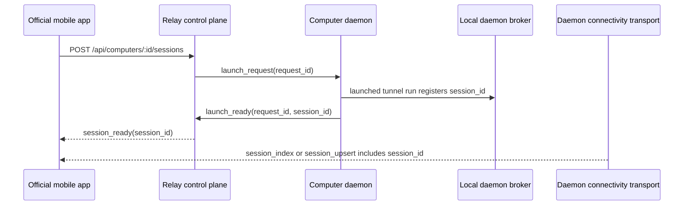

# refactor: Verify Launch To Daemon Session Convergence

## Summary

This plan executes the #133 slice of the protocol SSOT / legacy Relay retirement work: tighten docs and tests so `POST /api/computers/:computerID/sessions` is clearly a Relay control-plane launch operation, while official mobile session visibility comes from daemon transport `session_index` or `session_upsert`.

---

## Problem Frame

Android is deleting legacy Relay session authority. The Go repo already has the intended architecture in pieces: Relay completes launch correlation with `session_ready`, daemon broker owns local session state, and connectivity transport publishes daemon-owned session metadata. #133 exists to make that handoff explicit and test-backed so Android can wait on daemon transport after launch instead of polling Relay session list/detail/attach endpoints.

---

## Assumptions

*This plan was authored from the existing parent plan and issue #133 without a separate synchronous confirmation checkpoint. The items below are agent inferences that should be reviewed before implementation proceeds.*

- The parent plan remains the cross-issue coordination document; this file is the focused execution plan for #133 only.
- #132's documentation split is either complete first or lands in the same branch before #133 wording is finalized.
- This issue should not build a full Relay-to-daemon end-to-end harness. Focused daemon transport tests plus focused Relay launch tests are enough to prove the contract boundary.

---

## Requirements

- R1. Docs must state that `session_ready.session_id` is a launch correlation result, not the official mobile companion's session roster/detail/interactive authority.
- R2. Docs must direct official mobile clients to wait for daemon transport `session_index` or `session_upsert` carrying the matching `session_id` after launch success.
- R3. A broker session registered before connectivity transport connect must appear in the initial daemon `session_index`.
- R4. A broker session registered after connectivity transport connect must emit a daemon transport `session_upsert` with the same `session_id`.
- R5. Relay launch tests must remain focused on request correlation, `accepted`, `launch_ready`, timeout, cleanup, and ownership; Relay must not parse daemon transport frames.
- R6. Relay fallback tunnel behavior must remain opaque to session protocol frames.
- R7. Android issue `yuanbohan/agent-tunnel-android#172` must be able to cite this repo's docs/tests as upstream support for waiting on daemon `session_index` / `session_upsert`.

---

## Scope Boundaries

- Do not remove retained Relay session list/detail/attach/stop endpoints.
- Do not implement Android deletion work in this repository.
- Do not move protocol ownership into this repository; keep `agent-tunnel-protocols` as the cross-repository SSOT from the parent plan.
- Do not introduce a new mobile session matching field unless implementation proves `session_id` alone is insufficient for the current daemon-scoped transport.
- Do not make Relay inspect QUIC fallback payloads or daemon session protocol frames.
- Do not add production behavior solely for test convenience.

### Deferred to Follow-Up Work

- Broader protocol mirror alignment and compatibility fixture work remains in parent-plan #134.
- Full classic Relay endpoint retirement remains a later SSOT decision, not part of #133.
- Android UI timeout/error handling after launch success but before daemon transport convergence remains in `agent-tunnel-android`.

---

## Context & Research

### Relevant Code and Patterns

- `docs/api.md` already documents `POST /api/computers/:computerID/sessions`, `session_ready`, and the companion instruction to wait for daemon transport state.
- `docs/protocol.md` already names retained Relay/classic attach clients separately from official mobile connectivity clients.
- `docs/connectivity/protocol/transport.md` defines `session_index`, `session_upsert`, and the daemon-owned `SessionMetadata` contract.
- `internal/tunnel/daemon/connectivity_transport.go` sends `session_index` from `Broker.SnapshotMetadataAndSubscribe()` immediately after daemon `hello`, then writes `session_upsert` for `BrokerEventSessionUpsert`.
- `internal/tunnel/daemon/broker.go` emits `BrokerEventSessionUpsert` on `register` and `updateSession`, and snapshots metadata without terminal snapshot bytes.
- `internal/tunnel/daemon/connectivity_transport_test.go` already covers initial `session_index` and later `session_upsert` in a broader transport test. #133 should make the launch-convergence intent explicit enough that future refactors do not miss it.
- `internal/relay/handler/ws_api_test.go`, `internal/relay/handler/rest_api_test.go`, and `internal/relay/device/registry_test.go` already cover launch request correlation, late `accepted`, `launch_ready`, timeout, and cleanup behavior.
- `internal/tunnel/daemon/session_registration_test.go` proves a `tunnel run` session registration reaches the local broker and can be waited on with `WaitUntilRegistered`.

### Institutional Learnings

- No `docs/solutions/` entries exist in this repository.

### External References

- GitHub issue #133 is the authoritative issue scope for this focused plan.
- Parent plan: `docs/plans/2026-05-15-001-refactor-protocol-ssot-legacy-relay-retirement-plan.md`.
- Mobile-device launch requirements: `docs/brainstorms/2026-04-18-mobile-device-tmux-workspace-requirements.md`.
- Android handoff: `docs/connectivity/implementation/step-06-android-companion.md`.

---

## Key Technical Decisions

- **Use focused boundary tests, not a synthetic cross-plane mega-test:** Relay and daemon transport are intentionally separate planes. The plan proves the Relay launch result and daemon transport session publication on their own boundaries, then documents the `session_id` handoff between them.
- **Make existing coverage more explicit before adding duplicate setup:** Current transport tests already exercise initial index and live upsert behavior. Implementation should prefer renaming, focused assertions, or small helper extraction before adding a second expensive QUIC test path.
- **Keep Relay content-opaque:** Relay launch tests should assert `session_ready`, timeout, ownership, and cleanup. They should not decode daemon transport `session_index` / `session_upsert` or fallback QUIC packets.
- **Treat docs as part of the contract:** Because #133 supports Android deletion work, doc assertions must be precise enough to cite from Android issues and PRs, not merely implied by tests.

---

## Open Questions

### Resolved During Planning

- Should #133 remove or deprecate retained Relay session endpoints? No. It only makes them non-authoritative for the official mobile companion.
- Should Relay prove daemon transport convergence by parsing transport frames? No. That would violate the Relay content-opacity boundary.
- Is external framework research useful here? No. The work is governed by local protocol and test patterns, not external library best practice.

### Deferred to Implementation

- Whether existing daemon transport tests should be renamed/split or supplemented with new focused tests depends on how much churn is needed to keep the test readable.
- Exact doc wording should be adjusted after confirming what #132 has already landed in the branch.
- Whether a `session_id`-only match needs additional context for Android is deferred to protocol SSOT / #134 unless implementation discovers an actual ambiguity.

---

## High-Level Technical Design

> *This illustrates the intended approach and is directional guidance for review, not implementation specification. The implementing agent should treat it as context, not code to reproduce.*

The implementation proof should preserve the same separation: Relay tests cover the left-side launch correlation, daemon transport tests cover the right-side session publication, and docs describe the shared `session_id` handoff.

---

## Implementation Units

### U1. Audit And Tighten Launch Convergence Docs

**Goal:** Ensure public and implementation docs state the #133 handoff unambiguously.

**Requirements:** R1, R2, R7

**Dependencies:** #132 documentation split should be present or coordinated in the same branch.

**Files:**
- Modify: `docs/api.md`
- Modify: `docs/protocol.md`
- Modify: `docs/connectivity/protocol/transport.md`
- Modify: `docs/connectivity/implementation/step-06-android-companion.md`
- Modify as needed: `README.md`
- Modify as needed: `docs/architecture.md`
- Modify as needed: `AGENTS.md`
- Modify as needed: `CLAUDE.md`

**Approach:**
- Audit existing wording for three claims: Relay returns `session_ready` with a concrete `session_id`; official mobile treats that id as launch correlation; visible row/detail/interactive state comes from daemon transport.
- Keep retained Relay session APIs documented for classic/account-level use, but avoid presenting them as the official mobile post-launch path.
- In transport docs, make initial `session_index` and later `session_upsert` explicitly cover launched sessions once the local broker knows them.
- Use concise cross-links to issue #133 or the parent plan only where they help current handoff docs; avoid turning public API docs into issue commentary.

**Patterns to follow:**
- Existing top-of-file contract notes in `docs/api.md`.
- Existing "Client Notes" section in `docs/protocol.md`.
- Existing `session_index` / `session_upsert` sections in `docs/connectivity/protocol/transport.md`.

**Test scenarios:**
- Documentation: `docs/api.md` says `status: "session_ready"` is launch success and `session_id` is a correlation key for official mobile.
- Documentation: `docs/protocol.md` directs official mobile connectivity clients to daemon transport after launch instead of Relay session polling.
- Documentation: `docs/connectivity/protocol/transport.md` states that the daemon's broker-derived session state is the authority for `session_index` and `session_upsert`.
- Documentation: retained Relay session APIs remain documented as classic/account-level behavior.

**Verification:**
- A reader can start from #133 and find docs that support Android waiting for daemon `session_index` / `session_upsert` without relying on Relay `GET /api/sessions`.

---

### U2. Strengthen Daemon Transport Session Publication Tests

**Goal:** Prove the daemon transport publishes broker-known sessions through both initial index and live upsert paths using stable `session_id` metadata.

**Requirements:** R3, R4

**Dependencies:** U1 for final wording, but this unit can be implemented independently once the issue scope is understood.

**Files:**
- Modify: `internal/tunnel/daemon/connectivity_transport_test.go`
- Modify as needed: `internal/tunnel/daemon/broker_test.go`
- Modify as needed: `internal/tunnel/daemon/session_registration_test.go`

**Approach:**
- Make the initial-index assertion explicitly verify that a broker session registered before transport connect is present in `session_index` with the exact expected `session_id` and representative metadata.
- Make the live-upsert assertion explicitly verify that a session registered after transport connect emits `session_upsert` with the exact expected `session_id`, rather than relying only on metadata update behavior for an already indexed session.
- Prefer extracting small test helpers from the existing transport tests if that keeps setup readable.
- Use broker registration as the daemon-side stand-in for "launch-created `tunnel run` reached the local daemon broker"; `session_registration_test.go` already covers the client-to-broker registration path separately.

**Execution note:** Start with characterization assertions against the existing daemon transport behavior before changing production code.

**Patterns to follow:**
- `TestConnectivityTransportSendsSessionIndexAndPreviewSnapshots` for QUIC control-stream setup and frame reading.
- `TestBrokerPublishesSessionAndPreviewEvents` for direct broker event expectations.
- `TestSessionRegistrationClientWaitUntilRegisteredReturnsAfterBrokerAck` for broker registration acknowledgement behavior.

**Test scenarios:**
- Happy path: broker contains `sess-before` before transport handshake; after daemon `hello`, the first `session_index` contains `sess-before` exactly once with expected label, cwd, command preview, and online state.
- Happy path: transport handshake completes with an empty or existing index; registering `sess-after` in the broker after the control stream is active emits one `session_upsert` for `sess-after`.
- Edge case: a metadata update for an existing session still emits `session_upsert` as a full replacement payload and does not depend on Relay state.
- Regression: broker metadata snapshots used for `session_index` / `session_upsert` do not include terminal snapshot bytes or preview text as session metadata.

**Verification:**
- Daemon tests show that any session id known to the broker can become visible to an already connected official mobile client through `session_index` or `session_upsert`.

---

### U3. Preserve Relay Launch Correlation Boundary

**Goal:** Keep Relay launch coverage focused on control-plane readiness and cleanup without pulling daemon transport parsing into Relay tests.

**Requirements:** R5, R6

**Dependencies:** U1

**Files:**
- Modify: `internal/relay/handler/ws_api_test.go`
- Modify: `internal/relay/handler/rest_api_test.go`
- Modify: `internal/relay/device/registry_test.go`
- Modify as needed: `internal/relay/handler/connectivity_ws_test.go`
- Modify as needed: `internal/connectivity/carrier/carrier_test.go`
- Modify as needed: `docs/api.md`
- Modify as needed: `docs/protocol.md`
- Modify as needed: `docs/connectivity/implementation/step-04-fallback-transport.md`

**Approach:**
- Audit existing launch tests for `/api/computers/:id/sessions` and legacy `/api/devices/:id/launch`.
- Keep assertions that launch only completes after accepted launch plus matching `launch_ready`, including late ordering variants.
- Add or tighten test names/assertions so they describe `session_ready` as control-plane readiness, not as daemon transport session authority.
- Preserve timeout and cleanup tests for accepted launches that never become ready.
- If fallback tunnel opacity is not already explicit enough, keep the assertion in the connectivity tunnel/carrier tests rather than the launch tests: Relay forwards binary fallback packets unchanged and never parses daemon session protocol frames.

**Patterns to follow:**
- `TestHandlerLaunchComputerAliasWaitsForSessionReady`.
- `TestDeviceWebSocketLaunchWaitsForAgentLaunchReady`.
- `TestRegistryLaunchWaitsForSessionReadyAfterAccepted`.
- `TestRegistryLaunchTimeoutRequestsWorkspaceCleanupAfterAccepted`.
- Existing fallback tunnel opacity tests in `internal/relay/handler/connectivity_ws_test.go` and `internal/connectivity/carrier/carrier_test.go`.

**Test scenarios:**
- Happy path: `POST /api/computers/dev-1/sessions` returns `session_ready` with `sess-1` only after a matching `launch_ready`.
- Integration: `launch_ready` before device `accepted` remains pending until accepted result arrives, then completes with the same `session_id`.
- Error path: accepted launch without later readiness returns `launch_timeout` and requests workspace cleanup when a workspace target is known.
- Security: launch completion only succeeds for the owning request/user/token context.
- Regression: Relay launch tests do not decode or assert daemon transport `session_index` / `session_upsert` frames.
- Regression: fallback tunnel tests still show Relay forwards encrypted packet payloads opaquely and does not inspect session protocol plaintext.

**Verification:**
- Relay tests still prove launch correlation and cleanup while leaving session roster/detail/interactive authority to daemon transport tests and docs.

---

### U4. Run Focused Verification And Update Handoff Evidence

**Goal:** Leave #133 with enough evidence for Android and future Go work to cite.

**Requirements:** R6, R7

**Dependencies:** U1, U2, U3

**Files:**
- Modify as needed: `docs/plans/2026-05-15-001-refactor-protocol-ssot-legacy-relay-retirement-plan.md`
- Modify as needed: `docs/connectivity/implementation/step-06-android-companion.md`
- Modify as needed: `docs/connectivity/implementation/step-07-hardening-operations.md`

**Approach:**
- Update only active handoff/planning docs that would otherwise leave #133 marked unverified after implementation.
- Keep historical plans historical unless they currently guide active Android or Go implementation.
- Record which focused test groups prove daemon transport publication and Relay control-plane correlation.
- Do not duplicate full test output in docs; record the contract evidence and keep command output in PR notes.

**Patterns to follow:**
- Existing `Implementation Summary`, `Verification Performed`, and `Known Gaps` sections in connectivity handoff docs.
- Parent plan's issue slice mapping.

**Test scenarios:**
- Documentation: active handoff docs state #133's contract evidence without implying Relay session APIs are removed.
- Documentation: Android handoff can cite daemon transport convergence and Relay control-plane correlation separately.
- Documentation: any remaining gaps are explicitly scoped to Android behavior or protocol SSOT follow-up, not hidden in the Go repo plan.

**Verification:**
- The issue can be closed with a concise evidence trail: docs updated, daemon transport tests strengthened, Relay launch boundary tests preserved, fallback opacity unchanged.

---

## System-Wide Impact

- **Interaction graph:** The plan spans app-facing Relay launch docs, Relay device launch registry/handlers, daemon broker registration, and daemon connectivity transport publication.
- **Error propagation:** `launch_timeout` remains a Relay control-plane failure; absence from daemon transport after `session_ready` is a client/daemon convergence wait condition handled outside Relay session APIs.
- **State lifecycle risks:** A launch-created `session_id` may be known to Relay before a mobile client observes it on daemon transport. Docs should make this a bounded wait on daemon state, not a fallback to Relay session polling.
- **API surface parity:** Legacy `/api/devices/:id/launch` and preferred `/api/computers/:id/sessions` should preserve equivalent launch-ready semantics while docs favor the computer route.
- **Integration coverage:** The cross-plane contract is proven by paired boundary coverage: Relay proves `session_ready(session_id)`, daemon transport proves broker-known `session_id` reaches `session_index` / `session_upsert`.
- **Unchanged invariants:** Relay remains content-opaque, retained classic session endpoints remain supported, and daemon transport remains the official mobile session authority after launch.

---

## Risks & Dependencies

| Risk | Mitigation |
|------|------------|
| Existing tests already cover the behavior but not the issue intent, causing duplicate flaky QUIC setup | Prefer focused renames/assertions/helper extraction before adding redundant full transport tests. |
| Docs overstate endpoint retirement and break classic Relay clients by implication | Keep retained Relay session APIs documented and scope only official mobile companion authority away from them. |
| Relay tests accidentally grow into daemon transport tests | Keep U3 assertions on launch correlation only; prove `session_index` / `session_upsert` in U2. |
| Android still needs a bounded UI wait after `session_ready` | Leave Android wait/error behavior to `agent-tunnel-android#172`, while this repo proves the upstream state source. |
| #132 is not landed first, leaving docs with mixed terminology | Coordinate wording with #132 or include the minimum split needed for #133 in U1. |

---

## Documentation / Operational Notes

- This is contract and test-hardening work. Production code changes should be narrow and justified by failing or missing tests.
- PR notes should link issue #133, parent issue #131, parent plan U3, and Android consumer issue `yuanbohan/agent-tunnel-android#172`.
- If implementation discovers that `session_id` alone is ambiguous across daemon transports, stop and route that through the protocol SSOT / #134 rather than inventing a local-only matching rule.

---

## Verification

- Focused daemon transport tests for initial `session_index` and live `session_upsert`.
- Focused Relay handler/device tests for `session_ready`, late ordering, timeout, ownership, and cleanup.
- Suggested command groups from #133: `go test ./internal/tunnel/daemon ./internal/relay/...` and `go test ./internal/connectivity/...`.
- Broader confidence pass if implementation touches shared protocol structs: `go test ./...`.

---

## Sources & References

- GitHub issue #133: https://github.com/yuanbohan/agent-tunnel/issues/133
- Parent issue #131: https://github.com/yuanbohan/agent-tunnel/issues/131
- Parent plan: `docs/plans/2026-05-15-001-refactor-protocol-ssot-legacy-relay-retirement-plan.md`
- Mobile launch requirements: `docs/brainstorms/2026-04-18-mobile-device-tmux-workspace-requirements.md`
- Android handoff: `docs/connectivity/implementation/step-06-android-companion.md`
- App API mirror: `docs/api.md`
- Relay protocol mirror: `docs/protocol.md`
- Daemon transport protocol: `docs/connectivity/protocol/transport.md`
- Daemon transport tests: `internal/tunnel/daemon/connectivity_transport_test.go`
- Relay launch tests: `internal/relay/handler/ws_api_test.go`, `internal/relay/handler/rest_api_test.go`, `internal/relay/device/registry_test.go`
