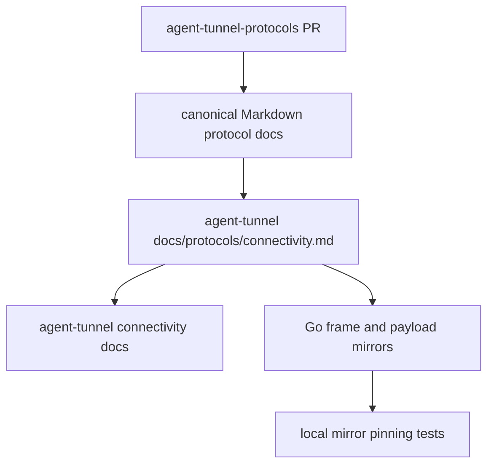
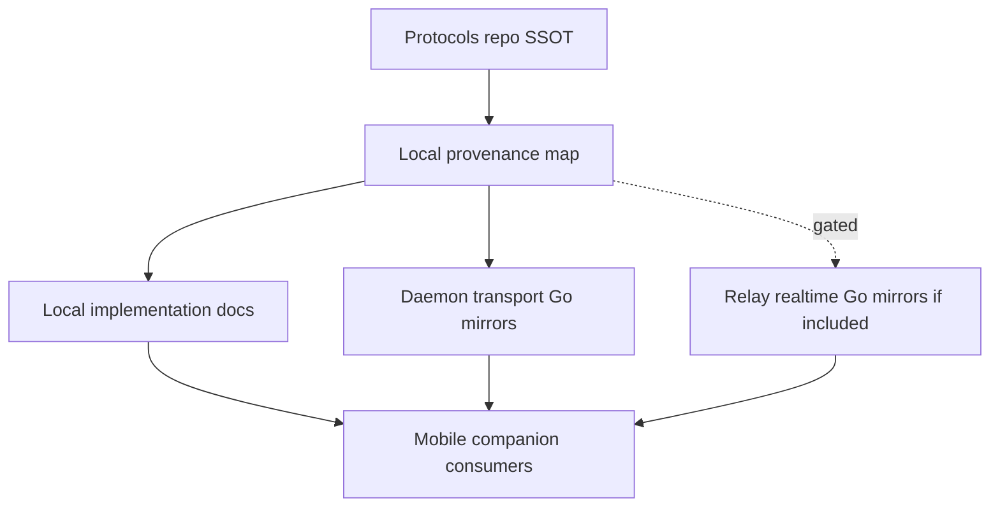

# refactor: Align Connectivity Protocol Mirrors With Protocol SSOT

## Summary

This plan splits issue #134 into a cross-repository protocol SSOT PR plus a local implementation-mirror PR. The protocols repo establishes stable canonical Markdown paths for the mobile/server connectivity contract; this repo then records explicit provenance in `docs/protocols/connectivity.md` and pins the Go protocol mirrors with tests that make drift visible.

---

## Problem Frame

Issue #134 asks this repository to stop treating local Go constants, payload structs, and docs as isolated protocol truth. The current `agent-tunnel-protocols` repo is still empty apart from `README.md`, so a local-only fix would only add comments pointing to documents that do not yet exist.

The implementer needs a plan that preserves the new cross-repository ownership model: `agent-tunnel-protocols` owns mobile/server protocol decisions, while `agent-tunnel` keeps implementation-specific mirrors, provenance docs, and tests.

---

## Requirements

- R1. Create or update a separate PR in `agent-tunnel-protocols` that defines canonical Markdown protocol docs before this repo claims SSOT-backed provenance.
- R2. Keep this repository's protocol docs as implementation mirrors, not competing protocol authorities.
- R3. Add `docs/protocols/connectivity.md` in this repository to state which local docs, Go packages, and tests reference which Markdown document in `agent-tunnel-protocols`.
- R4. Pin daemon transport `ProtocolVersion`, frame type bytes, frame encoding rules, payload shapes, and compatibility expectations against the SSOT-backed mirror.
- R5. Preserve forward compatibility expectations: receivers tolerate unknown JSON fields and unknown frame types where the SSOT says they must.
- R6. Audit `SessionMetadata` for launch convergence and keep it content-light; add fields only if the SSOT requires them, with docs and tests in the same change.
- R7. Gate Relay connectivity realtime protocol mirror work behind an explicit SSOT decision so issue #134 stays focused on daemon transport unless the protocols PR deliberately includes the Relay surface.
- R8. Keep Android implementation work and broad protocol redesign out of this issue; the Relay session endpoint retirement is handled by issue #135 and must not be reversed here.

---

## Scope Boundaries

- Do not implement Android changes in this repository.
- Do not reintroduce Relay session list/stop/attach endpoints as part of this issue.
- Do not introduce automatic generated-code infrastructure unless the protocols PR first chooses a machine-readable fixture format.
- Do not migrate daemon transport payloads away from JSON or change `ProtocolVersion` as incidental cleanup.
- Do not move repo-local operational docs wholesale into `agent-tunnel-protocols`.
- Do not promote local broker mechanics into cross-repository protocol authority; only mobile-visible session metadata and convergence semantics belong in the SSOT for this issue.
- Do not canonicalize pairing in issue #134 unless the protocols PR scope is explicitly widened.

### Deferred to Follow-Up Work

- Machine-readable fixtures: add generated or imported fixtures in a later iteration if the first protocols PR stays Markdown-only.
- Pairing protocol SSOT: add `agent-tunnel-protocols:docs/connectivity/pairing.md` and map local pairing docs/tests in a separate security-focused slice.
- Relay realtime mirror implementation: keep as gated follow-up unless the issue #134 protocols PR explicitly includes Relay connectivity realtime.
- Relay session endpoint retirement: consume the issue #135 outcome and keep the SSOT mirror aligned with the deleted endpoint boundary.
- Android deletion work: consume the resulting upstream contract and issue #135 endpoint deletion in the Android repository after both PRs are reviewable.

---

## Context & Research

### Relevant Code and Patterns

- `docs/plans/2026-05-15-001-refactor-protocol-ssot-legacy-relay-retirement-plan.md` maps issue #134 to protocol mirror alignment and compatibility markers.
- `docs/connectivity/protocol/transport.md` already captures the daemon-to-mobile QUIC transport mirror, including frame registry, stream model, session metadata, and `protocol_version = 2`.
- `docs/connectivity/protocol/relay.md` captures Relay-owned connectivity control-plane behavior and explicitly keeps session roster, preview, terminal bytes, input, and resize outside Relay realtime.
- `docs/connectivity/protocol/local-broker.md` captures local daemon-to-`tunnel run` behavior. This issue should cite it only for mobile-visible session metadata and convergence semantics, not make all local broker mechanics cross-repository protocol.
- `docs/connectivity/contract.md` is currently this repo's phase-1 implementation contract; it should point to the protocol SSOT but remain useful as a local implementation contract.
- `internal/connectivity/frame/frame.go` and `internal/connectivity/frame/frame_test.go` define and test the daemon transport frame envelope and registry.
- `internal/connectivity/sessionproto/sessionproto.go` and `internal/connectivity/sessionproto/sessionproto_test.go` define and test daemon transport JSON payloads and metadata boundaries.
- `internal/connectivity/interop/README.md` and `internal/connectivity/interop/interop_test.go` exercise Go mobile-simulator interoperability and should name the SSOT provenance for scripted protocol data.
- `internal/protocol/connectivity.go` and `internal/protocol/connectivity_test.go` are the Go mirror for Relay connectivity realtime messages and should be included when the protocols PR documents that surface.

### Institutional Learnings

- No `docs/solutions/` knowledge base exists in this checkout, so there are no prior captured learnings for protocol SSOT provenance.

### External References

- `agent-tunnel-protocols` currently contains only `README.md`, so the implementation must not assume existing canonical protocol docs.
- Issue #134: https://github.com/yuanbohan/agent-tunnel/issues/134.

---

## Key Technical Decisions

- **Create and merge the protocol SSOT PR first:** The local PR may be developed in parallel, but review-ready local docs should point at Markdown paths that exist on the protocols repo default branch, or at a reviewed immutable commit if merge order is intentionally reversed.
- **Use `docs/protocols/connectivity.md` as a provenance map:** The local file should map surfaces to SSOT documents and local mirrors, not duplicate the full protocol spec.
- **Keep issue #134 centered on daemon transport:** Relay realtime and pairing can be mapped or deferred, but daemon transport version, frame registry, payloads, and `SessionMetadata` are the active mirror work.
- **Pin local mirrors with table-driven tests and provenance:** Existing uniqueness and round-trip tests should grow into explicit registry, payload-shape, and version checks. If the protocols repo remains Markdown-only, describe these as local mirror pins with SSOT provenance rather than automated external drift detection.
- **Keep `SessionMetadata` scoped to daemon transport identity:** Treat `session_id` as sufficient under a selected computer transport unless the SSOT explicitly requires computer/source fields.
- **Gate Relay connectivity mirrors when documented:** `internal/protocol/connectivity.go` should be updated in this issue only if the protocols PR deliberately defines Relay realtime message families as part of the same scope.

---

## Open Questions

### Resolved During Planning

- Should issue #134 require work in `agent-tunnel-protocols`? Yes. The user explicitly requested a separate PR there because it is the mobile/server cross-repository SSOT.
- Should this repo create `docs/protocols/xxx.md`? Yes. Use `docs/protocols/connectivity.md` as the issue-scoped provenance map.
- Should `SessionMetadata` add new launch convergence fields by default? No. Keep `session_id` only unless the SSOT requires more fields.
- Should Android deletion or classic Relay endpoint retirement be included? No. Those remain separate follow-up scopes.

### Deferred to Implementation

- Whether the first protocols PR includes machine-readable fixtures or only Markdown tables.
- Exact canonical Markdown filenames after the protocols PR is drafted; the plan uses recommended paths that implementation may adjust consistently.

---

## High-Level Technical Design

> This illustrates the intended approach and is directional guidance for review, not implementation specification. The implementing agent should treat it as context, not code to reproduce.

Recommended canonical document split:

| Protocol surface | Recommended SSOT document | Local mirror examples |
|---|---|---|
| Daemon-to-mobile QUIC transport, frame registry, payloads, stream model, transport crypto invariants | `agent-tunnel-protocols:docs/protocol.md` | `docs/connectivity/protocol/transport.md`, `internal/connectivity/frame`, `internal/connectivity/sessionproto`, `internal/connectivity/transport`, `internal/connectivity/interop` |
| Mobile-visible session metadata and launch convergence semantics | `agent-tunnel-protocols:docs/protocol.md` | `docs/connectivity/protocol/transport.md`, selected sections of `docs/connectivity/protocol/local-broker.md`, daemon broker/session registration tests |
| Relay connectivity realtime control plane, if included in this issue's protocols PR | `agent-tunnel-protocols:docs/connectivity/relay.md` | `docs/connectivity/protocol/relay.md`, `internal/protocol/connectivity.go` |

---

## Implementation Units

### U1. Establish Protocols Repo Daemon Transport SSOT

**Goal:** Create the cross-repository Markdown SSOT needed before local daemon transport provenance and tests can truthfully cite external protocol authority.

**Requirements:** R1, R4, R5, R6, R7

**Dependencies:** None

**Files:**
- Modify: `agent-tunnel-protocols:README.md`
- Create: `agent-tunnel-protocols:docs/protocol.md`
- Create as needed: `agent-tunnel-protocols:docs/connectivity/README.md`
- Create as needed: `agent-tunnel-protocols:docs/connectivity/fixtures/`

**Approach:**
- Seed `agent-tunnel-protocols` with a canonical daemon transport Markdown doc for the protocol surface issue #134 is responsible for.
- Make the canonical doc clear about ownership, compatibility line, current protocol version, frame registry, payload families, stream model, transport crypto invariants, forward compatibility, and explicitly deferred changes.
- Resolve the current local wording ambiguity where JSON is current under `protocol_version = 2` but future CBOR text also mentions version 2.
- State that `protocol_version = 2` means the current JSON protocol; any CBOR profile requires a new protocol version or compatibility-line decision.
- Keep fixture work optional in the first PR unless the SSOT PR chooses a stable machine-readable format.
- Require any fixtures to be synthetic and non-secret, with placeholders for tokens, keys, fingerprints, terminal bytes, paths, and user input.

**Patterns to follow:**
- Existing local docs: `docs/connectivity/protocol/transport.md`, `docs/connectivity/protocol/relay.md`, `docs/connectivity/protocol/local-broker.md`.
- Parent plan's SSOT boundary in `docs/plans/2026-05-15-001-refactor-protocol-ssot-legacy-relay-retirement-plan.md`.

**Test scenarios:**
- Test expectation: none -- this is a documentation/SSOT establishment unit unless machine-readable fixtures are added.
- Documentation: a mobile or server reviewer can locate the owner document for daemon transport, frame registry, payload shapes, stream model, transport security, and mobile-visible session metadata without reading this repository.
- Documentation: canonical docs state unknown JSON field tolerance, unknown frame or event handling, and protocol-version compatibility policy.
- Documentation: canonical docs preserve the content-opaque Relay boundary and do not move terminal/session authority into Relay realtime.
- Documentation: any fixtures are synthetic and contain no real credentials, private keys, tokens, terminal captures, private paths, or user input.

**Verification:**
- A separate `agent-tunnel-protocols` PR exists with stable canonical paths that this repo can cite.
- The protocols PR defines a reviewable daemon transport SSOT and explicitly defers Relay realtime, pairing, and local broker mechanics unless intentionally included.

---

### U2. Add Local Protocol Provenance Map

**Goal:** Create the requested `docs/protocols/xxx.md` file that maps this repo's local mirrors to exact SSOT Markdown documents.

**Requirements:** R2, R3, R8

**Dependencies:** U1, or an open protocols PR with stable paths

**Files:**
- Create: `docs/protocols/connectivity.md`
- Modify: `docs/protocol.md`
- Modify: `docs/connectivity/contract.md`
- Modify: `docs/connectivity/protocol/transport.md`
- Modify as needed: `docs/connectivity/protocol/relay.md`
- Modify as needed: `docs/connectivity/protocol/local-broker.md`

**Approach:**
- Add `docs/protocols/connectivity.md` as a compact provenance table, not a duplicate spec.
- For each in-scope surface, list the SSOT document, local docs, local Go packages/tests, and what each local mirror is allowed to own.
- Update local docs so top-of-file status text points to the provenance map when readers need to understand SSOT lineage.
- Keep repo-local implementation contract language for operational details that are not cross-repository protocol decisions.
- Mark local broker mechanics, pairing, and Relay realtime as deferred or gated when they are not part of the issue #134 protocols PR.

**Patterns to follow:**
- Existing top-of-file status notes in `docs/protocol.md` and `docs/connectivity/protocol/*.md`.
- Existing plan/source-reference style in `docs/plans/2026-05-15-001-refactor-protocol-ssot-legacy-relay-retirement-plan.md`.

**Test scenarios:**
- Documentation: `docs/protocols/connectivity.md` names the SSOT Markdown doc for daemon transport and explicitly marks Relay realtime, pairing, and local broker mechanics as included, gated, or deferred.
- Documentation: each mapped surface includes local docs and Go mirror/test paths, so reviewers can audit drift from one file.
- Documentation: local docs no longer imply they are cross-repository protocol authorities.
- Documentation: Android, server, and future agent workers can follow links from local docs to the protocols repo without guessing canonical paths.

**Verification:**
- The local provenance map makes the source of every issue #134 protocol mirror explicit.
- The parent plan and issue handoff can cite the new plan and provenance map for implementation.

---

### U3. Pin Daemon Transport Frame Registry And Version

**Goal:** Make daemon transport frame type constants and `ProtocolVersion` drift visible in Go tests.

**Requirements:** R4, R5

**Dependencies:** U1, U2

**Files:**
- Modify: `internal/connectivity/frame/frame.go`
- Modify: `internal/connectivity/frame/frame_test.go`
- Modify: `internal/connectivity/sessionproto/sessionproto.go`
- Modify: `internal/connectivity/sessionproto/sessionproto_test.go`
- Modify: `internal/tunnel/daemon/connectivity_transport.go`
- Modify: `internal/tunnel/daemon/connectivity_transport_test.go`
- Modify as needed: `internal/connectivity/interop/README.md`
- Modify as needed: `internal/connectivity/interop/interop_test.go`

**Approach:**
- Convert the existing frame registry uniqueness check into an exact SSOT-backed registry check.
- Add provenance comments or test names that identify the specific protocols repo Markdown section or fixture source.
- Keep unknown frame tolerance explicitly tested where production receivers are expected to skip or ignore future frame families.
- Keep the Go mobile simulator's stricter scripted assertions documented if it intentionally rejects unexpected frames during a fixed probe.
- Preserve transport security invariants covered by the SSOT, including mutual pinned certificates, ALPN `tunnel-conn/1`, and disabled 0-RTT.

**Execution note:** Start with failing tests for exact registry values and protocol version before adjusting comments or constants.

**Patterns to follow:**
- `internal/connectivity/frame/frame_test.go` for frame envelope and registry tests.
- `internal/connectivity/sessionproto/sessionproto_test.go` for protocol-version and JSON payload compatibility checks.
- `internal/connectivity/interop/interop_test.go` for end-to-end simulator protocol data.

**Test scenarios:**
- Happy path: every frame type byte exactly matches the SSOT registry for the current compatibility line.
- Happy path: `ProtocolVersion` matches the SSOT current daemon transport version.
- Edge case: `frame.Decode` and production receive loops tolerate unknown frame type values according to the SSOT.
- Error path: malformed or truncated frames still fail with existing errors; SSOT provenance changes must not loosen parser safety.
- Regression: raw PTY frames remain raw bytes for `snapshot_chunk` and `live_bytes`, not JSON payloads.
- Regression: interop or transport tests continue to cover pinned TLS identity, required ALPN, and no 0-RTT assumptions without claiming production Android runtime compatibility.

**Verification:**
- `go test ./internal/tunnel/daemon ./internal/connectivity/...` fails if frame constants, protocol version, production receive-loop behavior, or transport security assumptions drift from the pinned mirror.

---

### U4. Pin Payload Shapes And Session Metadata Boundary

**Goal:** Keep daemon transport JSON payload structs, unknown-field tolerance, and `SessionMetadata` boundaries aligned with the SSOT.

**Requirements:** R4, R5, R6

**Dependencies:** U1, U2

**Files:**
- Modify: `internal/connectivity/sessionproto/sessionproto.go`
- Modify: `internal/connectivity/sessionproto/sessionproto_test.go`
- Modify: `docs/connectivity/protocol/transport.md`
- Modify: `docs/protocols/connectivity.md`
- Modify as needed: `internal/connectivity/interop/interop_test.go`

**Approach:**
- Add table-driven payload shape checks for each JSON frame family covered by the SSOT.
- Treat unknown JSON field tolerance as a compatibility contract, not just a generic Go `encoding/json` behavior.
- Expand negative metadata tests around terminal bytes, preview text, tier policy, and transport/path authority fields.
- Add `SessionMetadata` fields only if the protocols PR requires them; otherwise document that `session_id` is sufficient because the transport is scoped to the selected computer.
- Make local docs and tests unambiguous that `ProtocolVersion = 2` is the current JSON protocol. CBOR must require a future version or compatibility-line decision.

**Execution note:** Implement the metadata audit test-first so any field addition has to update docs and tests together.

**Patterns to follow:**
- `TestPayloadsRoundTripAndIgnoreFutureFields`.
- `TestSessionMetadataDoesNotCarryPreviewText`.
- `TestSessionProtocolPayloadsDoNotCarryTierPolicyFields`.

**Test scenarios:**
- Happy path: each current JSON payload shape round-trips with the SSOT-required field names.
- Edge case: future unknown JSON fields are ignored for all forward-compatible payloads.
- Edge case: `SessionMetadata` omits preview text, terminal bytes, account tier, entitlement, path badge authority, and Relay-only launch correlation fields unless the SSOT explicitly adds them.
- Regression: JSON encoding remains the only payload encoding for `ProtocolVersion = 2`.
- Integration: interop probe payloads use the same protocol version and payload names as the SSOT-backed session protocol tests.
- Contract review: any new `SessionMetadata` field appears in the protocols PR, local docs, local provenance map, and tests in the same change.

**Verification:**
- Go tests make payload-shape and metadata-boundary drift visible.
- The local transport doc and provenance map explain whether `session_id` alone is the intended launch convergence key.

---

### U5. Gate Relay Connectivity Realtime Mirror

**Goal:** Decide whether Relay connectivity realtime belongs in issue #134, and align it only when the protocols PR explicitly includes that surface.

**Requirements:** R2, R3, R5, R7, R8

**Dependencies:** U1, U2

**Files:**
- Review: `internal/protocol/connectivity.go`
- Review: `internal/protocol/connectivity_test.go`
- Review: `internal/relay/connectivity/registry_test.go`
- Review as needed: `internal/relay/handler/connectivity_ws_test.go`
- Modify as needed: `docs/connectivity/protocol/relay.md`
- Modify as needed: `docs/protocols/connectivity.md`

**Approach:**
- Include Relay realtime protocol mirrors only when the protocols PR defines canonical Relay connectivity docs as part of this issue's scope.
- Pin message type names, current protocol version markers, compatibility aliases, and unknown-event tolerance where current code promises them.
- Keep Relay responsibilities limited to auth, account policy, pairing, presence, rendezvous, fallback setup, and opaque packet forwarding.
- Avoid pulling session roster, preview text, terminal bytes, input, resize, or per-session tier policy into Relay realtime.
- If Relay realtime stays out of scope, record it as deferred in `docs/protocols/connectivity.md` rather than editing Go code.

**Patterns to follow:**
- `docs/connectivity/protocol/relay.md` "Relay owns" and "Relay does not own" split.
- Existing compatibility aliases in `internal/protocol/connectivity.go`.
- Existing relay connectivity registry and websocket tests.

**Test scenarios:**
- Happy path: Relay connectivity protocol version and event families match the SSOT-backed mirror.
- Edge case: unknown Relay realtime event types are tolerated according to the SSOT and existing compatibility contract.
- Regression: compatibility aliases remain documented and tested while still marked as legacy aliases.
- Security: if Relay realtime is included, fallback token binding, redeem-once behavior, expiry, wrong-account or unpaired attempts, trust revocation, logout/password-change cleanup, private-address hygiene, and abuse throttling remain covered.
- Regression: Relay realtime tests do not introduce session list, preview, terminal bytes, input, resize, or per-session tier fields.

**Verification:**
- If Relay realtime is included, `go test ./internal/protocol ./internal/relay/...` covers the mirror changes.
- Local provenance maps Relay realtime to its SSOT doc without making Relay a session transport authority.

---

## System-Wide Impact

- **Interaction graph:** The change spans two repositories, local docs, daemon transport protocol structs, optional Relay realtime protocol structs, interop tests, and future Android consumers.
- **Error propagation:** Parser and compatibility behavior should remain unchanged except where tests make existing SSOT expectations explicit.
- **State lifecycle risks:** `SessionMetadata` must not become a dumping ground for preview text, terminal bytes, Relay launch correlation, or tier policy.
- **API surface parity:** Daemon transport must cite SSOT provenance; Relay realtime should do so only if it is explicitly included in the protocols PR.
- **Integration coverage:** Frame/payload unit tests should be backed by interop coverage for at least the existing Go mobile-simulator protocol exchange.
- **Unchanged invariants:** Relay remains content-opaque for terminal bytes and fallback QUIC packets. The official mobile companion's session roster and interactive traffic remain daemon-transport-owned after launch.

---

## Risks & Dependencies

| Risk | Mitigation |
|------|------------|
| Local PR cites SSOT docs that do not exist yet | Make the protocols repo PR U1 and require stable canonical paths before the local PR is review-ready. |
| Markdown provenance improves reviewability but not mechanical drift prevention | Add exact Go tests for frame bytes, protocol version, payload field names, and compatibility behavior; call them local mirror pins unless machine-readable fixtures make external drift detection real. |
| Relay realtime and daemon transport scope blur together | Split SSOT docs and local provenance rows by protocol surface. |
| `SessionMetadata` grows fields that Android does not need | Keep `session_id` as sufficient under selected-computer transport unless the SSOT explicitly requires more. |
| Pairing or local broker mechanics expand issue #134 | Defer pairing and local broker mechanics unless the protocols PR explicitly widens scope; keep this plan focused on daemon transport and mobile-visible metadata. |

---

## Documentation / Operational Notes

- This work should produce at least two PRs: one in `agent-tunnel-protocols` and one in this repository.
- PR descriptions should link issue #134, the protocols PR, this plan, and the parent protocol SSOT plan.
- PR descriptions should state that Go simulator tests prove the Go mirror and simulator contract, not production Android runtime compatibility.
- If machine-readable fixtures are introduced, document how this repo consumes or mirrors them without silently vendoring stale data.
- After implementation lands, consider capturing the provenance-map convention in `docs/solutions/` via `/ce-compound`.

---

## Verification

- Protocols repo documentation review confirms canonical Markdown paths and ownership boundaries.
- `go test ./internal/tunnel/daemon ./internal/connectivity/...`
- `go test ./internal/protocol ./internal/relay/...`
- `go test ./...`

---

## Sources & References

- Parent plan: `docs/plans/2026-05-15-001-refactor-protocol-ssot-legacy-relay-retirement-plan.md`
- Issue #134: https://github.com/yuanbohan/agent-tunnel/issues/134
- Protocol SSOT repo: https://github.com/yuanbohan/agent-tunnel-protocols
- Current daemon transport mirror: `docs/connectivity/protocol/transport.md`
- Current Relay connectivity mirror: `docs/connectivity/protocol/relay.md`
- Current local broker mirror: `docs/connectivity/protocol/local-broker.md`
- Current frame mirror: `internal/connectivity/frame`
- Current session payload mirror: `internal/connectivity/sessionproto`
- Current Relay connectivity Go mirror: `internal/protocol/connectivity.go`
