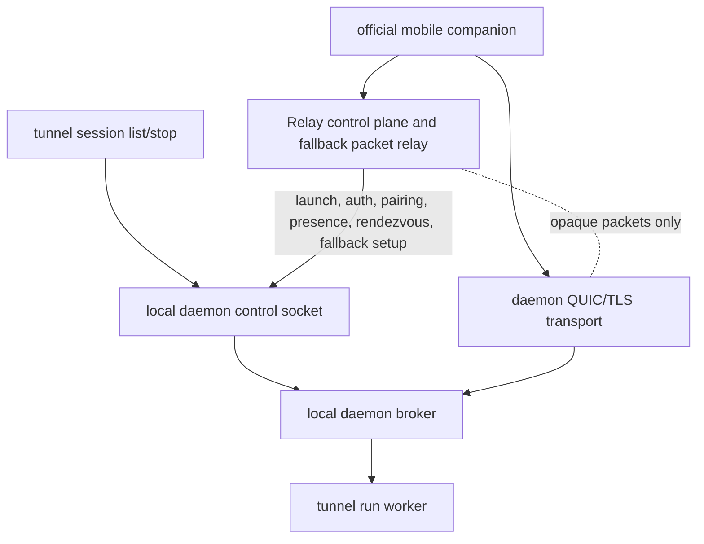

# refactor: Delete Legacy Relay Session APIs

## Summary

This plan changes issue #135 from "fence retained classic Relay sessions" to full deletion of the legacy Relay session list, attach, stop, and account-wide session sharing surface. Tunnel is still in development, so there is no compatibility migration: local CLI session operations should use this computer's daemon/broker state, while mobile/server coordination uses QUIC/TLS direct transport with opaque Relay fallback.

---

## Problem Frame

The branch direction is no longer the older WebSocket session authority model. Keeping Relay-maintained `/api/sessions` and `/api/sessions/:id/attach/ws` encourages Android and future CLI work to treat Relay as the session data plane even though the current architecture makes the daemon transport authoritative for session roster, previews, terminal bytes, input, resize, and detail.

The latest product premise is also narrower for CLI: `tunnel session list` only cares about sessions on the current computer. Different computers do not share session data through Relay.

---

## Requirements

- R1. Delete the app-facing Relay session list endpoint `GET /api/sessions`.
- R2. Delete Relay session stop endpoints `POST /api/sessions/:sessionID/stop` and `DELETE /api/sessions/:sessionID`.
- R3. Delete Relay attach endpoint `GET /api/sessions/:sessionID/attach/ws` and its WebSocket data-plane implementation.
- R4. Remove Relay-side attach routing state, attach peer management, attach packet forwarding, and attach client disconnect bookkeeping that exists only for the legacy WebSocket path.
- R5. Keep Relay agent registration and `launch_ready` correlation for `POST /api/computers/:computerID/sessions`; launch success remains a control-plane result only.
- R6. Keep Relay auth, account policy, app sessions, agent token auth, pairing, trusted-computer presence, rendezvous, fallback tunnel setup, and opaque fallback packet forwarding.
- R7. Retarget `tunnel session list` to this computer's daemon-local broker/control state; it must not fetch account-wide Relay sessions.
- R8. Retarget or constrain `tunnel session stop <session-id>` to a same-computer daemon-local stop path; it must not stop sessions on other computers through Relay.
- R9. Update public and contributor docs so current guidance no longer describes classic Relay sessions, Relay attach, or Relay-maintained session sharing as supported behavior.
- R10. Align active handoff docs with `agent-tunnel-protocols`, `agent-tunnel` #131/#135, and Android #173 so Android can delete its legacy Relay runtime without preserving a hidden compatibility mode.

---

## Scope Boundaries

- Do not remove `/agent/ws` itself; it still registers launched `tunnel run` processes and reports `launch_ready`.
- Do not remove `/device/ws`, `/api/computers`, `/api/computers/:computerID/sessions`, connectivity realtime WebSockets, or `/connectivity/tunnel/ws`.
- Do not make Relay parse daemon transport frames or QUIC fallback packets.
- Do not introduce cross-computer session sharing through another Relay endpoint.
- Do not implement Android deletion work in this repository.
- Do not add a compatibility migration for old clients; the product has not launched.
- Do not redesign the whole CLI session UX beyond making `list` and `stop` local-computer scoped.

### Deferred to Follow-Up Work

- Local attach UX: if `tunnel session attach <session-id>` becomes part of the CLI product, plan it separately against daemon-local broker transport.
- Daemon-owned mobile notifications: Android #173 deletes legacy notifications; a daemon-state notification model should be designed later from daemon transport state.
- Protocol fixture generation: issue #134 covers SSOT-backed protocol mirror tests and any future machine-readable fixture path.

---

## Context & Research

### Relevant Code and Patterns

- `internal/relay/handler/new.go` wires the legacy session routes and creates `session.NewAttachSessionIndex()` solely for app attach logout/password-change cleanup.
- `internal/relay/handler/api/sessions.go` implements `GET /api/sessions`, `POST /api/sessions/:sessionID/stop`, and `DELETE /api/sessions/:sessionID`.
- `internal/relay/handler/attach/ws.go` and `internal/relay/handler/attach/client.go` implement the legacy app attach WebSocket, same-origin checks, client IDs, input forwarding, control messages, and binary PTY byte writes.
- `internal/relay/session/registry.go` currently mixes live agent ownership needed for launch correlation with legacy session listing, stopping, attach lifecycle, input forwarding, resize, snapshot, terminal-byte, and attach-close routing.
- `internal/protocol/message.go` and `internal/protocol/attach_packet.go` define legacy attach/stop message helpers used by both Relay attach and the tunnel connector.
- `internal/tunnel/connector/connector.go` still handles `attach_open`, `attach_close`, `input_text`, `input_key`, and `stop_session` frames from Relay.
- `internal/tunnel/daemon/broker.go` already maintains local live session metadata, snapshots, previews, event subscription, input routing, resize routing, and interactive ownership for the current computer.
- `internal/tunnel/daemon/control.go` already exposes the local daemon control socket pattern for machine-local commands, but it does not yet expose session list or stop actions.
- `cmd/tunnel/session_cmd.go` currently calls Relay `GET /api/sessions` and `DELETE /api/sessions/:id`; this conflicts with the local-only premise.
- `docs/protocols/connectivity.md` already maps daemon transport and mobile-visible session metadata to `agent-tunnel-protocols:docs/protocol.md`.
- `agent-tunnel-protocols:docs/protocol.md` states that classic Relay session list/detail/attach APIs are outside daemon transport and that `session_id` is sufficient for launch correlation within a selected computer transport.

### Institutional Learnings

- No `docs/solutions/` entries exist in this repository.

### External References

- Parent issue #131 defines Relay as control plane plus fallback packet relay, not mobile session authority.
- Issue #135 originally asked to fence retained classic Relay sessions, but the confirmed branch scope is stronger: delete them because the product is pre-launch.
- Android #173 deletes Android's remaining legacy Relay session runtime and docs; this plan gives it the upstream server/CLI counterpart.
- `agent-tunnel-protocols:docs/protocol.md` is the cross-repository SSOT for daemon-to-mobile transport and session metadata boundaries.

---

## Key Technical Decisions

- **Delete, do not fence:** Because there are no launched users, preserving classic Relay session endpoints would add confusion without compatibility value.
- **Keep the Relay registry only as live owner/correlation state:** Relay still needs enough live agent ownership to complete launch requests, disconnect revoked tokens, and clean up live registrations. It should not expose or maintain account-wide session discovery.
- **Move CLI session operations local:** `tunnel session list` and `tunnel session stop` should operate through this computer's daemon state, not through Relay. This preserves the user premise that computers do not share session data via Relay.
- **Use daemon broker as the session authority:** The broker already owns local session metadata and owner connections for daemon transport. Add daemon-local control actions over or around that broker instead of inventing a second local store.
- **Remove Relay attach protocol from public docs:** Current app-facing docs should describe daemon QUIC/TLS direct and opaque Relay fallback, not the old per-session WebSocket attach route.
- **Preserve app auth session cleanup for connectivity only:** Logout/password change should close app connectivity sessions, not Relay attach sessions that no longer exist.

---

## Open Questions

### Resolved During Planning

- Should #135 preserve classic Relay routes for compatibility? No. The confirmed scope is deletion because the product is still in development.
- Should `tunnel session list` remain account-wide through Relay? No. It is local-computer only.
- Should different computers share session rows through Relay? No. Session data stays local to each computer daemon and its trusted mobile transport.
- Should Relay fallback carry terminal/session semantics? No. Relay fallback forwards opaque encrypted QUIC packets.

### Deferred to Implementation

- Exact daemon control action names for local session list/stop can follow existing control naming conventions during implementation.
- Whether local stop can be implemented entirely by broker command routing first, or needs a small worker lifecycle hook for process termination, should be settled while touching the daemon broker code.
- Whether any connector attach helpers should remain for future daemon-local attach should be decided by actual call sites. Do not keep Relay-only helpers speculatively.

---

## High-Level Technical Design

> *This illustrates the intended approach and is directional guidance for review, not implementation specification. The implementing agent should treat it as context, not code to reproduce.*

After this work, Relay may know that a launch request completed with a `session_id`, but it must not provide a session list, attach stream, terminal input, terminal bytes, or cross-computer session sharing.

---

## Implementation Units

### U1. Remove Relay Session Routes And Attach Handler

**Goal:** Delete the public Relay session list/stop/attach endpoints and the WebSocket attach implementation.

**Requirements:** R1, R2, R3, R4, R6

**Dependencies:** None

**Files:**
- Modify: `internal/relay/handler/new.go`
- Delete: `internal/relay/handler/api/sessions.go`
- Delete: `internal/relay/handler/attach/ws.go`
- Delete: `internal/relay/handler/attach/client.go`
- Modify: `internal/relay/handler/api/auth.go`
- Modify: `internal/relay/handler/api/agent_tokens.go`
- Modify: `internal/relay/handler/rest_api_test.go`
- Modify: `internal/relay/handler/ws_api_test.go`
- Modify as needed: `internal/relay/handler/test_helpers_test.go`

**Approach:**
- Remove route wiring for `/api/sessions`, `/api/sessions/:sessionID/stop`, `/api/sessions/:sessionID`, and `/api/sessions/:sessionID/attach/ws`.
- Remove `AttachSessionIndex` construction and parameters from auth/logout/password-change handlers.
- Keep logout, password change, account deletion, and token revocation cleanup for app connectivity, device, and live agent state.
- Change tests that currently prove session endpoints work into tests that prove the endpoints are gone and the remaining Relay surfaces still work.
- Keep 404 behavior consistent with the router's normal API envelope for removed routes.

**Execution note:** Start with failing route-removal tests before deleting handlers so the endpoint contract change is explicit.

**Patterns to follow:**
- Existing `router.NoRoute` API-envelope behavior in `internal/relay/handler/new.go`.
- Existing connectivity disconnect handling in `internal/relay/handler/api/auth.go`.

**Test scenarios:**
- Error path: authenticated `GET /api/sessions` returns not found or method-not-allowed according to router behavior, not a legacy session array.
- Error path: authenticated `DELETE /api/sessions/sess-1` and `POST /api/sessions/sess-1/stop` do not send `stop_session` to an agent.
- Error path: authenticated WebSocket upgrade to `/api/sessions/sess-1/attach/ws` fails because the route is gone.
- Integration: logout and password change still revoke app sessions and disconnect connectivity peers without attach index state.
- Regression: `/api/auth/*`, `/api/account/policy`, `/api/agent-tokens`, `/api/computers`, `/api/computers/:computerID/sessions`, connectivity realtime, and fallback tunnel routes remain wired.

**Verification:**
- `internal/relay/handler/attach` no longer exists.
- `internal/relay/handler/new.go` contains no `/api/sessions` route registrations.

---

### U2. Split Relay Live Agent Registry From Legacy Attach Routing

**Goal:** Keep only the Relay live-agent ownership state needed for registration, launch correlation, disconnect cleanup, and token/user revocation.

**Requirements:** R4, R5, R6

**Dependencies:** U1

**Files:**
- Modify: `internal/relay/session/registry.go`
- Modify: `internal/relay/session/registry_test.go`
- Delete: `internal/relay/session/attach_index.go`
- Modify: `internal/relay/handler/agent/ws.go`
- Modify: `internal/relay/handler/ws_api_test.go`
- Modify: `internal/relay/handler/rest_api_test.go`

**Approach:**
- Remove `AttachPeer`, pending/attached maps, attach start/detach methods, attach input forwarding, resize broadcast, snapshot completion routing, terminal-byte routing, and attach-close routing from the Relay registry.
- Keep `RegisterOwned`, `DisconnectIfOwner`, `SetLaunchSourceForUser`, `DisconnectUserSessions`, and `DisconnectAgentTokenSessions` or equivalent live-owner APIs.
- Decide whether `ListForUser`, `SessionForUser`, and `StopForUser` should be deleted immediately or kept unexported only where current code still needs them during U1/U3 sequencing; the final state should expose no Relay app/client session list or stop API.
- In `/agent/ws`, ignore or remove handling for attach-only frames and binary attach packets. Keep `register`, `launch_ready`, and any fields needed by control-plane launch correlation.
- Keep live session removal on owner disconnect so launch correlation and token/user cleanup do not leave stale live-agent state.

**Execution note:** Characterize remaining registry responsibilities first, then delete attach-specific behavior and tests in one pass.

**Patterns to follow:**
- `internal/relay/device/registry.go` for live-only owner/correlation state without terminal data-plane behavior.
- Existing agent-token and operator user deletion tests that assert live sessions/devices disconnect on revocation.

**Test scenarios:**
- Happy path: agent registration records a live owner and `launch_ready` still completes the matching device launch request.
- Happy path: agent disconnect removes the live owner state for that registered session.
- Security: agent token revocation and user deletion still disconnect live agent sessions owned by that token/user.
- Regression: Relay registry tests no longer contain attach-ready, snapshot, input, resize, terminal-byte, or slow-client scenarios.
- Regression: `/agent/ws` binary messages no longer route terminal bytes to app attach clients.

**Verification:**
- `rg "AttachPeer|StartAttach|RouteAttach|RouteTerminalBytes|WriteAttachInput|AttachSessionIndex" internal/relay internal/protocol` finds no Relay attach routing production code.

---

### U3. Retarget `tunnel session list/stop` To Local Daemon State

**Goal:** Make CLI session operations local-computer scoped and independent of Relay session APIs.

**Requirements:** R7, R8

**Dependencies:** U2 for the Relay-side deletion boundary; can be implemented in parallel after final local API shape is chosen.

**Files:**
- Modify: `cmd/tunnel/session_cmd.go`
- Modify: `cmd/tunnel/session_cmd_test.go`
- Modify: `cmd/tunnel/auth_api.go`
- Modify: `cmd/tunnel/args.go`
- Modify: `cmd/tunnel/args_test.go`
- Modify: `cmd/tunnel/cmd.go`
- Modify: `internal/tunnel/daemon/control.go`
- Modify: `internal/tunnel/daemon/runtime.go`
- Modify: `internal/tunnel/daemon/broker.go`
- Modify: `internal/tunnel/daemon/broker_test.go`
- Modify: `internal/tunnel/daemon/control_test.go`
- Modify: `internal/tunnel/daemon/runtime_test.go`
- Modify as needed: `internal/tunnel/daemon/session_registration.go`

**Approach:**
- Add daemon-local control actions for listing broker sessions and stopping one broker session on the current computer.
- Have `tunnel session list` resolve daemon paths and call the local control socket instead of resolving Relay auth and calling `/api/sessions`.
- Have `tunnel session stop <session-id>` send a local daemon stop request for a local broker session. It should fail clearly when the daemon is not running or the session id is not present on this computer.
- Preserve table and JSON output shape where useful, but update `scope` semantics so local sessions do not imply account-wide comparison against other computers.
- Remove `relayAuthAPI.listSessions` and `relayAuthAPI.stopSession` once no callers remain.
- Keep `tunnel workspace open/close` separate: workspace view lifecycle is still not destructive session stop.

**Execution note:** Start with tests that prove no HTTP server is contacted by `tunnel session list/stop`.

**Patterns to follow:**
- `daemon.Status`, `daemon.Stop`, `daemon.Pair`, and trusted-device control socket request helpers.
- `Broker.Snapshot()` and `Broker.SnapshotMetadataAndSubscribe()` for local session metadata snapshots.
- Existing table rendering in `cmd/tunnel/session_cmd.go`.

**Test scenarios:**
- Happy path: with a running daemon broker containing two local sessions, `tunnel session list` renders both without any Relay base URL or auth token.
- Happy path: `tunnel session list --json` returns daemon-local session rows with local metadata and no remote/account-wide sessions.
- Happy path: `tunnel session stop sess-1` routes to the local daemon/broker owner for `sess-1` and prints the existing stopped message.
- Error path: when the daemon is not running, `session list` and `session stop` return a clear local-daemon error instead of an auth-token error.
- Error path: stopping an unknown local session id returns a not-found style error and does not contact Relay.
- Regression: `workspace close` still only detaches a workspace view and does not stop a session.

**Verification:**
- `rg "/api/sessions|listSessions\\(|stopSession\\(" cmd/tunnel` finds no production usage.
- CLI tests prove session commands use daemon-local state only.

---

### U4. Remove Legacy Attach Protocol From Tunnel Connector Where Relay-Only

**Goal:** Delete tunnel connector behavior that exists only to serve Relay WebSocket attach clients, while preserving local broker and daemon transport behavior.

**Requirements:** R3, R4, R5, R6

**Dependencies:** U1, U2

**Files:**
- Modify: `internal/tunnel/connector/connector.go`
- Modify: `internal/tunnel/connector/connector_test.go`
- Modify: `internal/protocol/message.go`
- Modify: `internal/protocol/message_test.go`
- Delete as appropriate: `internal/protocol/attach_packet.go`
- Delete as appropriate: `internal/protocol/attach_packet_test.go`
- Modify as needed: `internal/tunnel/session/hub.go`
- Modify as needed: `internal/tunnel/session/remote_input.go`

**Approach:**
- Remove Relay-originated attach open/close handling from the connector after `/agent/ws` no longer sends those frames.
- Remove Relay-originated `input_text` / `input_key` forwarding only if those inputs are not reused by daemon-local broker or future local attach code. If reused, move shared input translation to daemon/broker-owned types rather than keeping Relay attach names as public protocol.
- Remove binary `AttachPacket` encoding/decoding if no non-Relay path uses it after U2. Daemon transport already has its own frame registry for snapshot chunks and live bytes.
- Keep `register` and `launch_ready` behavior needed for Relay control-plane launch.
- Keep stop handling only if local daemon stop still uses the same internal connector signal. If the stop path becomes broker-local, remove Relay `stop_session` from the agent protocol.

**Execution note:** Use call-site searches after U1/U2/U3 before deleting shared helpers; do not remove terminal mirror or hub behavior needed by daemon transport and broker previews.

**Patterns to follow:**
- `internal/tunnel/daemon/connectivity_transport.go` for daemon transport interactive frames.
- `internal/tunnel/daemon/broker.go` for local input/resize routing.
- `internal/tunnel/session/remote_input.go` for PTY-byte translation behavior that may remain valid outside Relay attach.

**Test scenarios:**
- Regression: connector still registers a session and includes launch context for mobile-launched sessions.
- Regression: connector still emits `launch_ready` when the local process reaches readiness.
- Regression: local broker registration, preview updates, snapshot updates, and output byte publication still work.
- Deletion: connector tests no longer depend on Relay `attach_open`, Relay binary attach packets, or Relay app-client attach lifecycle.
- Error path: unexpected attach-only frames from Relay are ignored or impossible under the reduced protocol without crashing the connector.

**Verification:**
- `rg "AttachOpenFrame|AttachReadyFrame|AttachCloseFrame|EncodeTerminalBytesPacket|DecodeAttachPacket|AttachPacket" internal/tunnel internal/protocol internal/relay` finds no production Relay attach dependency.

---

### U5. Update Public, Contributor, And Handoff Docs

**Goal:** Remove active documentation for legacy Relay sessions and align current guidance with local daemon sessions plus daemon transport.

**Requirements:** R9, R10

**Dependencies:** U1, U3, U4

**Files:**
- Modify: `README.md`
- Modify: `AGENTS.md`
- Modify: `CLAUDE.md`
- Modify: `docs/api.md`
- Modify: `docs/protocol.md`
- Modify: `docs/architecture.md`
- Modify: `docs/daemon.md`
- Modify: `docs/connectivity/implementation/step-06-android-companion.md`
- Modify: `docs/connectivity/implementation/step-07-hardening-operations.md`
- Modify: `docs/plans/2026-04-28-001-feat-quic-connectivity-program-plan.md`
- Modify as needed: `docs/brainstorms/2026-05-15-session-terminal-unification-requirements.md`
- Modify as needed: `docs/protocols/connectivity.md`

**Approach:**
- Replace "retained Relay/classic session" language with the new boundary: Relay is auth, account policy, pairing, presence, rendezvous, fallback setup, opaque packet relay, and launch control plane.
- Remove public docs for `GET /api/sessions`, Relay session stop, and Relay attach WebSocket.
- Update CLI docs so `tunnel session list/stop` are local-computer commands backed by the daemon, not account-wide Relay commands.
- Preserve historical brainstorm/plan docs unless they are presented as current handoff guidance.
- Cross-link active handoff docs to #131, #135, Android #173, and the protocol SSOT where that helps future workers avoid reintroducing legacy Relay session authority.

**Patterns to follow:**
- Top-of-file SSOT/provenance notes already present in `docs/protocols/connectivity.md`.
- Current daemon transport language in `docs/connectivity/protocol/transport.md` and `agent-tunnel-protocols:docs/protocol.md`.

**Test scenarios:**
- Documentation: `README.md`, `docs/api.md`, `docs/protocol.md`, and `docs/architecture.md` no longer document `/api/sessions` or Relay attach as supported current APIs.
- Documentation: docs still describe Relay auth, computer launch, pairing, presence, rendezvous, fallback setup, and opaque fallback packet forwarding.
- Documentation: `tunnel session list/stop` docs say local computer/daemon state, not account-wide sessions.
- Documentation: active Android handoff docs support deleting legacy Relay runtime and do not imply Android should keep a fallback WebSocket attach path.
- Documentation: historical references remain identifiable as historical if they mention old Relay attach work.

**Verification:**
- `rg "GET /api/sessions|/api/sessions/.*/attach/ws|retained Relay|classic Relay|account-level live sessions|Relay session attach" README.md docs AGENTS.md CLAUDE.md` returns no active-guidance references.

---

### U6. Retire Or Rewrite Legacy E2E And API Tests

**Goal:** Remove test coverage whose only purpose was preserving the deleted Relay session contract, and replace it with coverage for remaining launch/connectivity/local-session behavior.

**Requirements:** R1, R2, R3, R5, R6, R7, R8

**Dependencies:** U1, U2, U3, U4

**Files:**
- Modify: `internal/e2e/client.go`
- Modify: `internal/e2e/local_regression_test.go`
- Modify: `internal/relay/handler/rest_api_test.go`
- Modify: `internal/relay/handler/ws_api_test.go`
- Modify: `internal/relay/session/registry_test.go`
- Modify: `internal/tunnel/connector/connector_test.go`
- Modify: `internal/tunnel/daemon/connectivity_transport_test.go`
- Modify as needed: `internal/connectivity/interop/interop_test.go`

**Approach:**
- Delete e2e helpers for Relay `ListSessions` and Relay attach WebSocket.
- Replace old e2e flows with the nearest current contract evidence: launch through Relay, session appears through daemon broker/transport, and local CLI list/stop uses daemon-local state.
- Keep focused Relay launch correlation tests; they should end at `session_ready` and not attach through Relay.
- Keep daemon transport tests for `session_index`, `session_upsert`, preview, interactive request, input, resize, and reconnect.
- Remove registry and connector tests that only guard Relay attach lifecycle.

**Execution note:** Avoid broad end-to-end harness invention in this cleanup. Prefer focused tests around each surviving boundary.

**Patterns to follow:**
- `docs/plans/2026-05-15-002-refactor-launch-daemon-session-convergence-plan.md` for the launch-to-daemon convergence split.
- Existing daemon transport tests for session state and interactive frames.

**Test scenarios:**
- Happy path: Relay computer launch returns `session_ready` after matching `launch_ready`.
- Happy path: a broker-registered local session is visible through daemon transport `session_index` / `session_upsert`.
- Happy path: local CLI list sees only local daemon broker sessions.
- Happy path: local CLI stop stops only a local daemon broker session.
- Regression: no test helper opens `/api/sessions/:id/attach/ws`.
- Regression: no test asserts account-wide Relay session sharing.

**Verification:**
- `go test ./internal/protocol ./internal/relay/... ./internal/tunnel/daemon ./cmd/tunnel` passes after legacy tests are removed or rewritten.
- `go test ./...` passes before the PR is considered ready.

---

## System-Wide Impact

- **Interaction graph:** Relay route wiring, live agent registry, app auth cleanup, agent token/user revocation, tunnel connector protocol handling, daemon control socket, daemon broker, CLI session commands, API docs, and Android handoff docs all change together.
- **Error propagation:** Removed Relay session endpoints should fail as removed routes. Local CLI failures should report local daemon not running, local session not found, or local stop failure rather than auth/session API errors from Relay.
- **State lifecycle risks:** The Relay registry must not retain stale account-wide session rows after route deletion, but it must still clean up live owner state on agent disconnect and token/user revocation.
- **API surface parity:** Removing `/api/sessions` also requires removing CLI HTTP clients, docs, e2e helpers, Android guidance, and protocol helpers that exist only for the old endpoint.
- **Integration coverage:** Relay launch correlation and daemon session publication should remain separately tested; Relay must not become a session data-plane proxy by test convenience.
- **Unchanged invariants:** Relay remains content-opaque, daemon transport remains the official mobile session authority, and local daemon/broker state remains computer-scoped.

---

## Risks & Dependencies

| Risk | Mitigation |
|------|------------|
| Removing Relay registry attach behavior accidentally breaks launch readiness | Keep launch correlation tests around `/agent/ws` `launch_ready` and `/api/computers/:computerID/sessions`. |
| CLI session stop has no existing local control action | Add a small daemon control action that routes to the broker/worker owner; fail clearly if the session is not local. |
| Docs retain stale `/api/sessions` guidance | U5 includes targeted searches across public docs, contributor docs, and active handoff docs. |
| Connector attach helpers are reused by local broker code under different names | Use call-site searches after Relay deletion and preserve only behavior needed by daemon-local transport, not legacy protocol names. |
| Android #173 deletes against an upstream contract that still mentions classic Relay | Link active docs to #131/#135 and remove active guidance for Relay list/detail/attach. |

---

## Documentation / Operational Notes

- This is a breaking API cleanup by design. Because the product has not launched, do not add deprecation windows, compatibility aliases, or hidden debug entry points for the deleted Relay session APIs.
- PR descriptions should explicitly state that computers do not share session data through Relay and that `tunnel session list/stop` are local-computer operations.
- If implementation updates `agent-tunnel-protocols`, keep that as a separate protocols-repo PR and cite it from this repo's docs.

---

## Verification

- `go test ./internal/protocol ./internal/relay/...`
- `go test ./internal/tunnel/daemon ./cmd/tunnel`
- `go test ./internal/connectivity/...`
- `go test ./...`
- `make test`
- `make build`

---

## Sources & References

- Parent issue: https://github.com/yuanbohan/agent-tunnel/issues/131
- Focus issue: https://github.com/yuanbohan/agent-tunnel/issues/135
- Parent plan: `docs/plans/2026-05-15-001-refactor-protocol-ssot-legacy-relay-retirement-plan.md`
- Launch convergence plan: `docs/plans/2026-05-15-002-refactor-launch-daemon-session-convergence-plan.md`
- Protocol SSOT plan: `docs/plans/2026-05-15-003-refactor-connectivity-protocol-ssot-plan.md`
- Local provenance map: `docs/protocols/connectivity.md`
- Protocol SSOT: `agent-tunnel-protocols:docs/protocol.md`
- Android deletion issue: https://github.com/yuanbohan/agent-tunnel-android/issues/173
- Android retirement plan: `agent-tunnel-android:docs/plans/2026-05-15-002-refactor-retire-legacy-relay-sessions-plan.md`
