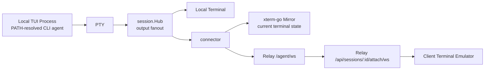
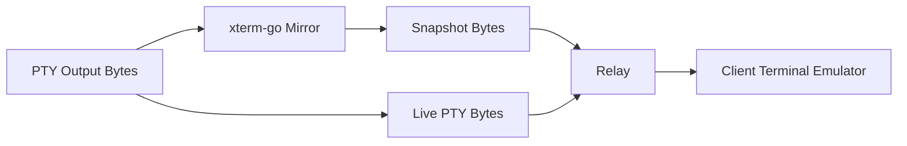
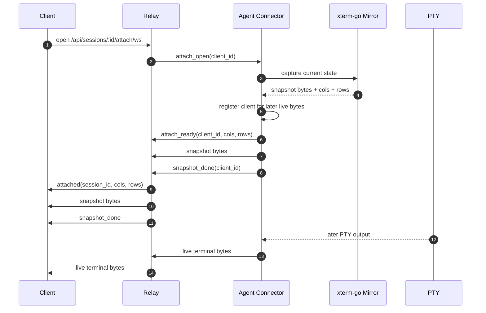
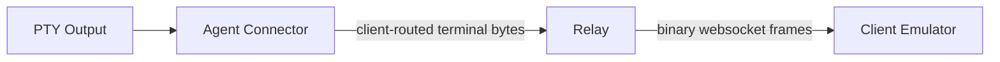
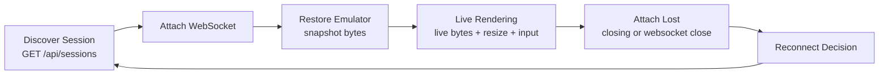
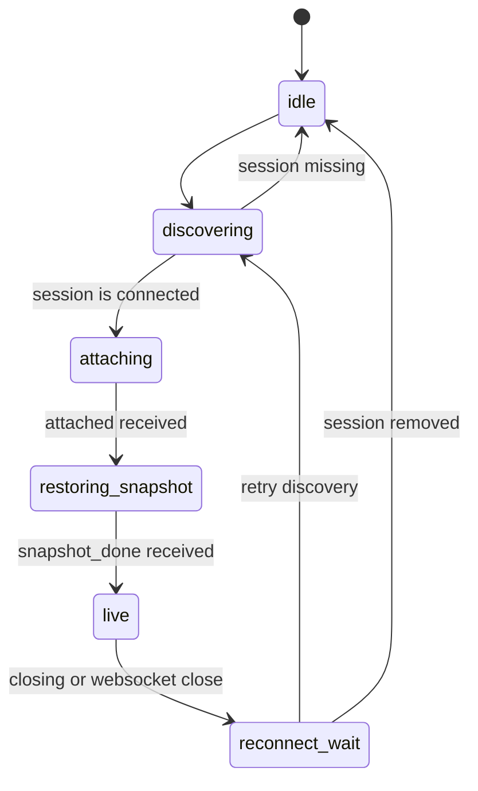
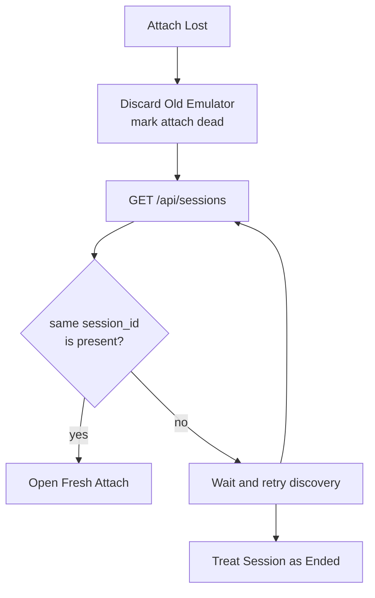

# TUI Attach Flow

This document explains the end-to-end remote viewing path for one running TUI session:

- local PTY output inside `tunnel`
- the agent-side `xterm-go` terminal mirror
- snapshot generation on attach
- live terminal-byte delivery through the relay
- client rendering and mobile reconnect behavior

It is a narrative companion to [docs/protocol.md](./protocol.md) and [docs/architecture.md](./architecture.md). The protocol document is the wire-format source of truth. This document explains how the pieces fit together in practice.

## Mental Model

The system does not send a pre-rendered UI tree or a screenshot.

Instead, it sends terminal bytes:

- the TUI process writes bytes into a PTY
- those bytes include printable text plus ANSI and DEC control sequences
- a terminal emulator interprets those bytes and updates screen state

Both the local terminal and the remote client render the session by consuming terminal bytes with a real terminal emulator.

`xterm-go` exists on the agent side so `tunnel` can keep an in-memory copy of the current terminal state and serialize that state into a fresh attach snapshot.

## Core Objects

- **PTY output**: raw bytes emitted by the real local CLI agent process such as `claude`, `codex`, `gemini`, `qwen`, or `aider`
- **terminal mirror**: the headless `xterm-go` terminal inside `tunnel` that consumes the same PTY output stream
- **snapshot bytes**: a serialized current-screen checkpoint generated from the mirror on attach
- **live bytes**: subsequent raw PTY output bytes after the snapshot boundary
- **relay**: an authenticated broker for discovery, attach lifecycle, and byte routing; it does not emulate the terminal
- **client terminal emulator**: the mobile or web-side terminal implementation that consumes snapshot bytes and live bytes in order

## End-to-End Flow

The steady-state path is:

At steady state, the same PTY output drives both:

- the local terminal
- the agent-side terminal mirror
- any currently attached remote client

The remote client path adds one extra step that the local terminal path does not need:

The important detail is that the local terminal and the remote client are not receiving different semantic payloads. They are both driven by terminal bytes. The extra thing remote attach needs is a current-state checkpoint for mid-session attach or reconnect.

## 1. PTY Output Inside `tunnel`

When the launched CLI writes output, `tunnel` reads from the PTY and broadcasts that byte stream through `session.Hub`.

That fanout drives:

- the local interactive terminal
- the connector

The connector does two things with each PTY output chunk:

1. it feeds the bytes into the agent-side `xterm-go` mirror
2. it forwards the same bytes to any currently attached remote clients as live bytes

Because the mirror sees the same byte stream as the local terminal, it tracks the current visible screen using terminal semantics rather than plain text concatenation.

## 2. What `xterm-go` Adds

Without `xterm-go`, the live streaming path can still work for a client that was attached from the beginning, because the client terminal emulator can interpret the raw PTY byte stream on its own.

What breaks without a mirror is current-screen recovery:

- a client that attaches after the session has already been running needs a correct current screen
- a client that disconnected cannot safely continue from stale local state because it may have missed bytes

`xterm-go` solves that by maintaining an in-memory terminal state that includes the details a real TUI depends on:

- alternate screen buffer state
- cursor position and visibility
- colors and style attributes
- wide characters
- terminal modes needed to interpret later bytes correctly

On attach, the mirror serializes the current visible terminal state into snapshot bytes. Those bytes are not a screenshot and not a JSON diff. They are escape sequences and text that a fresh terminal emulator can replay to reconstruct the current screen.

This repository configures the mirror with no scrollback history, so the snapshot represents the current visible screen, not transcript replay.

## 3. Attach Flow: Snapshot Then Live Bytes

The attach flow for one client is:

The critical invariant is the no-gap handoff:

- any PTY bytes that happened before the snapshot point must already be reflected in the snapshot
- any PTY bytes that happen after the snapshot point must be delivered as later live bytes
- there must be no missing byte range between those two segments

This is why attach is treated as an atomic snapshot-plus-subscribe operation on the agent side.

## 4. What The Snapshot Contains

The snapshot is a checkpoint for a fresh terminal emulator.

It contains enough terminal instructions to restore the current visible state, including:

- the active screen buffer when the TUI is on the alternate screen
- visible text and styling
- cursor and mode state needed for later bytes to make sense

It does not contain:

- transcript history
- durable replay of every old PTY byte
- a relay-generated interpretation of the TUI

The practical consequence is:

- a new client can attach mid-session and render the current screen correctly
- a client can recover the latest current screen by rediscovering the session after the agent comes back online
- a client cannot ask the relay for the exact bytes it missed while disconnected

## 5. What Live Bytes Are

After `snapshot_done`, the attach becomes a normal live terminal-byte stream for that client.

Live bytes are:

- raw PTY output bytes
- routed by the relay without semantic inspection
- consumed by the same client terminal emulator instance that consumed the snapshot

Live bytes are not:

- UI patches generated by the relay
- per-cell diffs
- guaranteed to align with websocket frame boundaries

One websocket binary frame may contain:

- part of one escape sequence
- several complete escape sequences
- plain text mixed with control sequences

The client must not treat websocket frame boundaries as meaningful render boundaries. It must feed bytes into a real terminal emulator in arrival order.

## 6. What The Relay Does And Does Not Do

The relay is responsible for:

- client and agent auth
- session discovery via `GET /api/sessions`
- attach lifecycle on `GET /api/sessions/:id/attach/ws`
- routing JSON control messages
- routing client-scoped binary terminal bytes
- tracking which sessions are currently online

The relay does not:

- emulate the terminal
- derive previews from terminal content
- generate the snapshot
- retain transcript history
- provide durable catch-up for missed live bytes

The relay is intentionally content-opaque. It moves bytes and lifecycle events but does not interpret TUI semantics.

## 7. What The Client Must Do

For each attach, the client should create one fresh terminal emulator instance and treat that instance as the state container for the session.

The client-side sequence is:

1. open `GET /api/sessions/:id/attach/ws`
2. wait for the `attached` control message
3. size the terminal emulator to `cols` and `rows`
4. feed all binary bytes before `snapshot_done` into that emulator as snapshot bytes
5. keep using the same emulator instance for all binary bytes after `snapshot_done`
6. on `resize`, resize the emulator
7. on `closing` or websocket close, discard the emulator and decide whether to reattach

The client should not:

- try to parse ANSI itself at the websocket layer
- assume one websocket frame equals one render update
- keep using an old emulator after disconnect and pretend no bytes were missed
- treat reconnect as transcript replay

## 8. Mobile Reconnect Playbook

Mobile reconnect behavior should be built around fresh attach, not byte catch-up.

### Case A: client network drop while the session is still connected

What happened:

- the mobile app lost the attach websocket
- the agent may have kept running and producing output
- the client may have missed arbitrary live bytes

What the client should do:

1. discard the old terminal emulator state
2. query `GET /api/sessions`
3. if the same `session_id` is still present, open a fresh attach immediately
4. build a new emulator from the fresh snapshot and continue with later live bytes

Why:

- the old local emulator state is stale
- there is no durable missed-byte replay path

### Case B: relay says `closing { reason: "session_offline" }`

What happened:

- the relay lost the owning agent websocket
- the relay closed active attach sockets
- the session was removed from discovery immediately

What the client should do:

1. discard the old terminal emulator state
2. stop sending input for that attach
3. poll or retry `GET /api/sessions`
4. wait until the same `session_id` appears again
5. open a fresh attach and rebuild from the new snapshot

If the session disappears instead of returning to `connected`, the original agent process is gone and that session has ended.

### Case C: app background and foreground transitions

Treat resume as a fresh-attach problem unless the websocket is definitely still healthy and the app is certain it missed no bytes.

In practice, the safe default is:

1. close the old attach if needed
2. discard the old emulator
3. re-list sessions
4. open a fresh attach

### Case D: a brand-new agent launch

A new agent launch gets a new `session_id`.

That means:

- do not assume a disappeared session will come back under the same id
- if the user starts a new tunnel process later, the client should discover the new session separately

## 9. Mobile Client Block

This section is written for the mobile client implementation directly.

The client implementation can be viewed as two loops:

### Mobile Client Responsibilities

The mobile app should treat one attach as one terminal-emulator session.

For each attached session, the app should hold:

- `session_id`
- websocket connection state
- one terminal emulator instance
- a boolean or enum for whether `snapshot_done` has been received
- the most recent `cols` and `rows`
- whether the target `session_id` is currently present in `GET /api/sessions`

The mobile app should not hold:

- an append-only transcript as the rendering source of truth
- a partially trusted emulator that survives disconnects
- assumptions that missed bytes can be fetched later

### Mobile Attach Algorithm

When the user opens a session:

1. call `GET /api/sessions`
2. confirm the target `session_id` is present
3. create a fresh terminal emulator instance with no prior state
4. open `GET /api/sessions/:id/attach/ws` with the app bearer access token
5. wait for `attached`
6. size the emulator to `cols` and `rows`
7. feed every binary frame into the emulator in arrival order
8. mark the attach as live after `snapshot_done`

Implementation note:

- the client does not need one code path for snapshot bytes and another for live bytes at the emulator layer
- both byte streams go into the same emulator instance
- `snapshot_done` is a lifecycle boundary, not a rendering format switch

### Mobile Event Handling

Handle relay-to-client messages like this:

- `attached`: create or confirm a fresh emulator, set terminal size, reset local attach-phase state
- binary before `snapshot_done`: feed into emulator as ordered terminal bytes
- `snapshot_done`: mark the attach as fully live
- binary after `snapshot_done`: keep feeding into the same emulator
- `resize`: resize the emulator immediately
- `closing`: stop input, close the websocket, discard the emulator, and move into reconnect logic based on `reason`

### Mobile Input Rules

While attach is healthy:

- send normal text with `input_text`
- send non-text special keys with `input_key`
- keep all user input scoped to the currently attached session

When attach is not healthy:

- stop sending input immediately
- do not queue unbounded input locally for later replay
- require a fresh attach before sending more terminal input

### Mobile Reconnect State Machine

Use this mental model:

Recommended transitions:

- `idle -> discovering`: user selects a session
- `discovering -> attaching`: session is present and `connected`
- `attaching -> restoring_snapshot`: `attached` received
- `restoring_snapshot -> live`: `snapshot_done` received
- `live -> reconnect_wait`: websocket closes or `closing` is received
- `reconnect_wait -> discovering`: retry session discovery
- `discovering -> idle`: session disappeared and should be treated as ended

### Mobile Reconnect Rules

On any attach loss, default to this sequence:

1. discard the old emulator
2. mark the old attach dead
3. re-check `GET /api/sessions`
4. if the same `session_id` is present, open a fresh attach
5. if it is absent, wait and retry discovery or treat the session as ended based on product UX

Safe default:

- never continue rendering from a pre-disconnect emulator unless the websocket definitely stayed healthy and no bytes were missed

### Mobile Reconnect Decision Diagram

### Mobile Transport Notes

- native mobile clients may omit the `Origin` header
- websocket binary frame boundaries are not semantic terminal boundaries
- partial escape sequences are valid across frame splits
- the renderer must be a real terminal emulator, not a custom line-oriented parser

### Mobile Failure Handling

Handle these cases explicitly:

- `closing: session_offline`: stop input, discard local terminal state, and poll discovery until the same `session_id` appears again or the product decides the session is gone
- `closing: slow_client`: treat local rendering or network as overloaded, tear down state, then attempt a fresh attach if the session is still present
- `closing: logged_out`: stop input, discard local terminal state, and require the user to re-authenticate before opening a new attach
- `closing: password_changed`: stop input, discard local terminal state, and require fresh login before opening a new attach
- `closing: agent_token_revoked`: stop input, discard local terminal state, and refresh discovery because the owning session was disconnected
- `closing: account_deleted`: stop input, discard local terminal state, and require account recovery or operator follow-up instead of retrying attach
- plain websocket close without `closing`: assume bytes may have been missed and do a fresh attach flow

### Mobile Checklist

- create a fresh emulator per attach
- size on `attached` before consuming later bytes
- feed all binary bytes in arrival order
- treat `snapshot_done` as attach lifecycle state only
- discard emulator state on disconnect
- rediscover session state before reattaching
- reattach to the same `session_id` only if it is still present
- never model reconnect as transcript replay

## 10. Resize And Input Around Reconnect

Resize remains session-wide and follows the PTY owner. The client must resize its terminal emulator when it receives `resize`. The client does not become the PTY size authority in this revision.

Structured input still goes over the attach websocket as `input_text` and `input_key`. If the attach is gone or the session is offline, the client should stop sending input and wait for a fresh attach.

## 11. What This Model Guarantees

This model guarantees:

- a fresh attach can reconstruct the current visible screen
- snapshot bytes and later live bytes form one continuous stream for that attach
- relay reconnect for the same running agent keeps the same `session_id`
- the local terminal remains usable even if the relay is unavailable

This model does not guarantee:

- transcript replay
- durable delivery of every PTY byte to every remote client
- recovery of missed live bytes after client disconnect
- remote-driven PTY sizing

## 12. Implementation References

- [internal/tunnel/session/process.go](../internal/tunnel/session/process.go): reads PTY output and broadcasts it through the session hub
- [internal/tunnel/session/terminal_mirror.go](../internal/tunnel/session/terminal_mirror.go): maintains the `xterm-go` mirror and serializes snapshots
- [internal/tunnel/connector/connector.go](../internal/tunnel/connector/connector.go): performs attach snapshot handoff and live-byte forwarding
- [internal/relay/session/registry.go](../internal/relay/session/registry.go): routes attach lifecycle and client-scoped bytes
- [docs/protocol.md](./protocol.md): wire-format contract
- [docs/architecture.md](./architecture.md): package-level architecture
